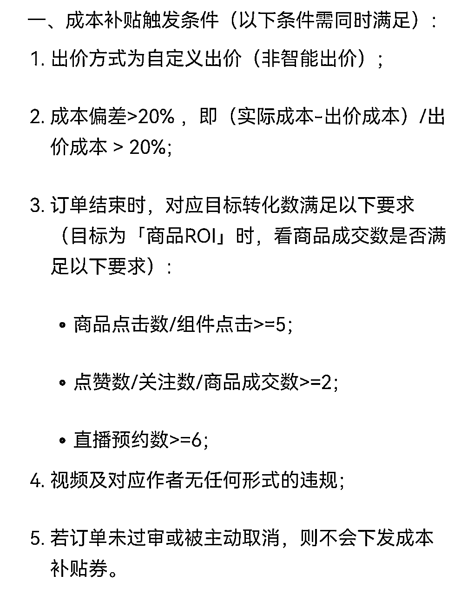

# 《100万GMV达成，视频号短视频挂车投流最新玩法》

> 来源：[https://md8vbz6pkh.feishu.cn/docx/K1ovdE2QyoKkIUxXcOHcEJC7n5c](https://md8vbz6pkh.feishu.cn/docx/K1ovdE2QyoKkIUxXcOHcEJC7n5c)

# 一、自我介绍

大家好，我是纸壳，从去年 10 月份开始全职做视频号，到现在刚好一年，期间没有做过其他项目，一直专注在视频号平台，今天给大家分享我做项目的一点经验，视频号的自然流、直播、付费、后端都做过，目前主要做短视频挂车投流。

先晒波数据，这三个店分别是 6、7、8 月份开通的，截止目前总 GMV100w+，纯利润 30w+。下面就把我做投流的经验完整分享给大家，希望能对大家有帮助。

# 二、短视频挂车投流全流程

首先说一下短视频挂车投流的整体流程，养号--选品--剪素材--测品--放量

## 1、养号（过购物车权限）：确定类目-实拍-申诉-开店

*   确定类目

平台严查画风不统一问题，目前找到的最佳解决方案就是统一类目，所以新账号在养号之前就确定好这个号要打什么类目的品，之后就围绕这个类目做，想做其他类目开新号做。

*   实拍

确定好类目后，找该类目下产品，1 个或多个，实拍 10 条视频，15-20 秒一条，5 条纯音乐，5 条带话术。拍好之后同时上传即可，不需要间隔时间。类似这种就可以，很好拍。

*   申诉

上传 1 小时后去申诉，找不到入口的点这个链接 https://channels.weixin.qq.com/pandora/pages/appeal/index#account-detail?

如下图所示，申诉下面那个原创入口，上面的高质量入口不要申诉。提供相关原创证明后，基本都能通过。通过之后找 10 条视频中播放量最高的 3 条加热，各 50 元，消耗 20 左右就可以停止。播放量上去之后下图高质量入口就自动通过了。

*   开店

用个体执照开通小店，开通完即可获取购物车权限，2000 押金可以带大部分的品。

目前这个方法能百分百开通购物车权限，快的话一天，慢 2 天。

## 2、选品

养完号，就可以选品了，选品可以说是整个流程里最重要的部分，直接关乎能不能赚到钱。打付费的品，只有一个硬性要求，就是高毛利，一般利润要高于 70%，其他的就是围绕人群、痛点和痒点选品。

具体的选品方法有很多，抖音、视频号刷同行，有米云、蝉妈妈查榜单，本质上都是跟品，想要提高成功率只有一个办法，就是大量测品。一天测 5 个品和一天测 50 个品，结果绝对不一样。

举几个例子，图一水龙头过滤器成本 5.5，卖 39.9；图二防烫夹 4 件套成本 6，卖 39.9；图三身体乳三瓶成本 17，卖 99。这都是我之前打爆过的品，主打新奇特、高溢价，围绕目标人群的痛点和痒点猛攻。

## 3、剪素材

选好了品开始处理素材，根据这么久的经验，总结出一套爆款模版，适用于大部分的品，今天分享给大家：

展示产品+引出痛点+解决痛点+逼单+售后服务

现在我们打付费基本就用这一套模版，不同的品替换相应的话术内容，然后合成配音+添加画面，非常高效且好用。

具体的画面处理呢，6 月份之前一直是用搬运的，现在画风和原创问题卡的很严，顺应平台是成本最低的方式，所以现在改成搬运+实拍，下图是我最近打的一个品的剪映截图。

自上而下依次是：标题和字幕、4 个贴纸、4 个滤镜、4 个特效、闪屏视频、实拍视频、搬运视频、配乐、配音，然后再通过 CR 补帧和 CR 加水印。

通过垂直类目养号，以及实拍+混剪，死号的概率大大降低，剩下要做的就是测品、测品、疯狂测品。

## 4、测品

测品分一测和二测

*   一测

主要测品和素材能不能出单，一个品 1-3 条素材，每条素材建 2-5 条计划，根据客单价出价，一般高客单 800-1000 豆，低客单 600-500 豆，时长 6-8 小时，投放金额 2000 豆，其它都不选。

首先看能不能过审，不过审，根据系统提示修改素材或者换品。过审后，看消耗速度、出单量以及商品点击数，几种情况：

1.低点击低转化（品和素材都不行，换品）

2.高点击低转化（素材可以品不行，放弃或调整商品参数重新一测）

3.低点击高转化（品可以素材不行，优化素材）

4.高点击高转化（品和素材都行，有可能会是爆品，直接二测）

*   二测

主要测出价。一测跑得最好的素材和出价继续建 10 条计划，流速起来且密集出单的时候，压出价建计划。

以一测 800 出价为例，二测建 10 条 800 豆计划，流速起来且密集出单，建 10 条 750 计划。以此类推，直到最新出价跑不动，再往上建计划，找出消耗和转化最好的出价，放量

## 5、放量：

放量阶段主要会遇到两个问题：1 是不消耗，2 是 roi 低。

*   不消耗解决方案

一测二测能消耗，放量不消耗，有以下几个解决方案：

1、提高出价，高客单拉到 1000，低客单 800

2、修改投放时长，试一下 12 小时和 24 小时

3、测试不同时段建计划消耗情况

4、开双智能计划拉热度，智能出价智能推广

5、持续投，投到第三天还不消耗，放弃，换素材

*   roi 低解决方案

1、关停空消耗，放量阶段建议开通一个第三方的投放管理工具，我用的是火星计划，可以设置自动关停策略，一般高客单用空耗 40-60 策略，低客单用空耗 20-30 策略。

空消耗的计划及时关停，留下优质计划继续跑，可一定程度上提高 roi。

2、压出价卡赔付，下图是卡赔付的触发条件，主要考核数据是商品成交数最少 2 单，因此要压低出价并提高下单金额。

举个例子，下单金额 3000 豆，出价 800 豆，3000豆全部消耗完，预计成交 4 单，如果只成交 2 单，那么系统会赔付 2 单的豆，压出价到 600 豆，预计成交 5 单，只成交 2 单，系统会赔付 3 单的豆。变相提高 roi。

3、提高客单价，或优化产品 sku 结构，以这个品为例，1 瓶 39.9，两瓶 49.9，大部分人都买 49.9 的。其他品也可以类似组合，套装化或者凸显出一个性价比最高的 sku，引导用户下单。

# 三、踩过的坑

最近几个月，持续放量，随之而来，售后压力非常大，临时找了两个兼职客服，也没有进行太多的专业化培训，了解了产品特性和售后政策后，直接上岗。

然后退货率从 2%飙升到 5%，而且短时间内收到多条差评和投诉，一周时间店铺评分从 4.8 掉到 4.2，之后被系统提示评分过低无法加热。

对售后进行了深度复盘，跟客服一起把有退货和投诉行为的客户聊天记录，拉出来从头到尾，逐字逐句复盘，得出几个结论：

1.  大部分客户开始来咨询的时候，态度都是比较温和的，但是感受到客服不专业，答非所问，诉求得不到满意的解决方案后，情绪会愈发激动，这种情况下很难友好解决，很容易引发退货甚至投诉，因此尽量在客户咨询初期迅速解决问题。

1.  客服岗位的共情能力很重要，一定要习惯换位思考，站在客户角度了解客户诉求，才能更好解决问题。这次找的两个客服，都几乎完全没有共情能力，机械式问答，经常性答非所问，给客户感觉就在敷衍了事。

1.  高情商或者说好的表达能力非常重要，如图，用户表达诉求后，希望得到的是解决方案和被理解的情绪，而不是甩锅或划定责任，这个时候客服用了最容易激化情绪的方式，用户直接退货。

1.  同样一句话，不同的表达方式，完全不同的效果。如图，用户问如果使用过程中出现质量问题能否补发，客服机械的回了句，15 天内包补发的。

如果换一下表达：实在抱歉给您造成困扰，请您放心使用，15 天内出现任何质量问题，我们都给您重新发一份好的，直到您满意为止，如果您还是不放心，我可以把售后日期给您延长到 30 天，出现任何问题您随时来找我，您看可以吗。

也许就没有后续持续的互相折磨，直到退货了。之前客服一直是我自己接的，退货率控制在 1.7%，曾经有客户因质量问题找我售后，友好沟通之后，不仅没退货，反而又下了一单，如图。一句话能成事儿，一句话能坏事儿。

当时正是放量的时候，打的品消耗好，roi 也高，突然被迫中断，一次非常深刻的教训，售后太重要了，不仅关乎之前的利润，还会影响后面的收益，一定要重视，所有踩过的坑都不要白踩。

# 四、最后想说的话

付费模式的优点是稳定可放大，不废号人效比高，缺点是门槛高难度高，需要一定资金，资金回报率低，用大钱换小钱。

新人建议做高客单积累经验，不容易亏钱，老手可以挑战低客单，消耗好，压出价卡赔付，赚更多。

付费模式，尽量自己开店，自己找供应链，利润能到 80%以上，保本 roi1.25，打到 1.4 以上就可以放量。如果带别人的品，最多给 70%左右的佣金，保本 roi1.43，打到 1.4 都不赚钱，不划算。

做投流不要相信感觉，而要相信数据。再看好的品，测两次不行就 pass。

效率可能是最重要的，别人发 1 条视频，你发 10 条，别人测 1 个品，你测 10 个，别人没发现的爆品，你测出来了，就活该你赚钱，某种程度上这可以算一场零和游戏，肉就那么多看谁吃得快。

做难而正确的事，对抗人性的弱点，明明知道去剪视频去测品是正确的事，但就是畏难，控制不住去刷抖音去打游戏，去研究所谓的黑科技，想赚 easy money，年纪轻轻的你不配，是狼就对自己狠点，是羊就别想吃肉的事。

顺应平台的事越做越轻松，和平台一起成长未来可期，对抗平台的事不可持续，越做越累得不偿失。

前几天有朋友问我，你做视频号有至暗时刻吗，我回忆了一下说，几乎每月都有一次，每次平台的变动，新规，都要重新适应，好几次都感觉做不下去了，但每次挺过去都获得了丰厚的回报，踉踉跄跄的走过来，也变得越来越强大，我想这也是小航海以及续航的意义吧。

以上就是我这次分享的全部内容，感谢大家，预祝各位扬帆远航必有所获