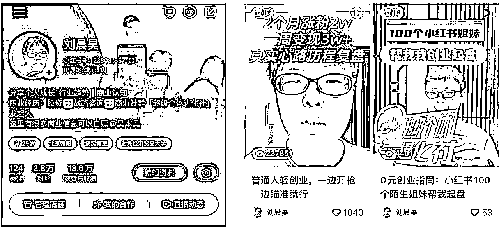

# 小红书从0到1，起盘我0元成立一个社群，单月变现8w+的经验

> 来源：[https://wxqp5aw3pm.feishu.cn/docx/K4zfd2djsoEAdWxTaXrceSf9nLf](https://wxqp5aw3pm.feishu.cn/docx/K4zfd2djsoEAdWxTaXrceSf9nLf)

# 小红书0-1涨粉

## 定位迭代过程

心态准备/鸡汤开头：

1.  给自己一段时间，我从一开始做抖音，到现在，已经快大半年了，一直都在探索，从没停止过脚步。一个小八卦：程前之前还在西安的路边和小摊小贩访谈。自媒体时代最大的红利就是个人IP，都不用做成那么现象级的IP，就我这种还不算什么影响力的，我已经感受到流量多香了。所以，告诉自己，要坚持，要做，我能做的，你也可以。谁一开始还不是个普通人呢～～而且超级个体的前身，不都是草台班子吗哈哈哈哈

1.  别人的路都是别人的经验，还是要自己摸索，不放弃

1.  做自媒体做得好的，观察下来都是生活特别不如意的。我当时就是职场特别不顺利，一下就起号了，所以如果你现在过得不太顺利，放宽心，也许这就是你的创作养料

1.  起号前的探索：别害臊，就是干

*   在小红书，我第一天发了三个方向，共五篇内容：职场类、萌宠类（我有两只猫）、英语学习类，发现我自己而言职场的流量最好，尤其是聊一些互联网公司的招聘、内幕的，虽然没起号，找到了一点点感觉，于是就看准这个赛道发力

*   第二天，《普通人进入投行咨询，野路子才是最合适的》，正式出道，找到了自己在小红书的网感，但我觉得这个和我前半年在抖音折腾了2个月是分不开的，网感，就是靠练，一篇不行第二篇，第二篇不行第三篇，直到你找到你出道的方式，要特别能够耐挫折，要生活中特别不如意（我前期抖音探索慢，还是因为当时职场之路还算顺利，带团队正乐呵呢。后期小红书能快速突破，还是生活苦逼，团队没了，自己也要快跑路的状态）

*   心得：小红书就是标题党，标题取的好，成功了99%，毫不夸张说这一点。所以二八法则来说，每天花80精力甚至更多在选题上很重要。我没有找对标账号，还是结合自己擅长的来挖掘。总的来说，可能我那个标题就是特别特别吸睛吧：普通人和投行咨询精英人设形成强烈反差，野路子，没见过，看一看不吃亏这样的感觉

建议大家可以去看一下我置顶的两个视频，分享了一些我的起号和变现的框架

1.  找到感觉，持续发力

*   投资、咨询，感觉还有很多话题，于是我继续写了

*   投资和咨询收入多少，适合什么样的人？

*   真实战略咨询的生活

*   读书感悟：一年赚一个亿的人，其思维模式和你有什么不一样

这些，都帮我精准的吸引到了投资、投行、咨询这一批小众精英粉丝，那段时间，我的帖子几乎都在投行、咨询热搜第一，很有利于我把粉丝数快速干到1w

1.  因为自己想逃离职场，所以不是很想写职场话题，而且从开始涨粉那一刻开始，我确实每天在思考变现，我做账号，就是为了变现，就是为了逃离职场，所以后期话题会泛一点，不会老讲职场因为我真怕误人子弟啊！探索不同方向，这些方向包括

1.  逃离北上广这种热门话题

1.  应届生考研还是工作这种老生常谈

1.  生活感悟，典型的就是和大学同学约饭后，写下《人生发财靠康波：90后的宏观课题在哪里》

1.  讽刺小说，吐槽投资、咨询、老板pua的文章

这些，都帮我进一步破圈，吸引到了圈外那些对我感兴趣的人

1.  因为自己想跑路，所以自己会去和跑路成功的人聊、也会自己去大量分析一些案例，这个时期的我，内容方向已经变成了

1.  行业机会和我的思考

1.  赚钱案例分享和拆解

这个时候，我的人设可能已经无形中变成了一小部分人的引领者，想关注赚钱机会和从大厂跑路的应该都会去注意我的内容了

总结一下，我的经验就是：

*   快速测试方向，先精准发力一部分人群，用大众话题破圈涨粉，根据自己本身的思考持续迭代内容重点。没有一步到位过，包括到目前为止，我还在迭代还在调整，IP没有尽头，IP意味着不断生长......

*   找到自己的发力点很重要：行业研究我是擅长的，竞品调研我也是，这是我的内容支点。每个人都有自己的支点，找到这个很重要

我也一直在思考，她们关注刘晨昊，到底在关注什么，我觉得是在关注未来自己的投射，说起来抽象了点，具体来说就是刘晨昊在做她们想做的事、说她们想表达没表达出来的话

当然，欢迎你告诉我你为什么关注我，因为我也在探索抖音，由图文为主转纯视频，有很多的不适应，在有商业模式和产品的现在，我更应该思考我的定位到底是什么。我目前自己想到的关键词有：30岁，北漂7年，普通人，职场跑路的希望。欢迎你来点醒我没想到的，非常感谢～～～

## 真实数据复盘：选题参考

*   播放量和转粉最高的，还是利他性强的

*   在我这里，还是赚钱的具体的案例，比如分析兮兮食养的、吉他手常俞老师的，核心可能还是觉得我有用

*   播放量最大的：喜闻乐见类的、行业趋势方面的、行业机会的、小说类的

*   要不要逃离北上广

*   35岁危机

*   要不要去投资、咨询

*   普通人都关心的行业大趋势

*   小红书内容洞察

*   2023就业盘点

*   职场吐槽类：播放量大，转化很低，用户来了哈哈哈就走了

## 内容分类和文案结构

### 案例拆解类

*   先说结果：xxx一年干了多少万

*   拆解路径

*   他是谁，做了什么事

*   有什么样的定位，解决什么样的痛点

*   他怎么做的

*   获客怎么做的：内容制作，有什么特点亮点

*   如何做引流的

*   如何销售的：直播间话术有特点吗？私域话术和朋友圈打造有什么特点？

*   等等，核心就是【以用户的视角】体验这个案例，然后说人话，把这个事情给简单描述就完了

### 行业研究类

*   这一方面，本来也是我的老本行，群里有很多更厉害的咨询，我感觉我也没啥好说的，这一方面比较适合有行业研究基础的人介入，就几个tips

*   不要单纯截图报告，会有曝光点赞收藏，但是对你这个人的印象未必足

*   要有自己的观点，哪怕这个观点是不对的，总有人同意你反对你

### 情绪抒发类

*   每一个自己的阶段性的时刻，都会有分享

*   涨粉1w里程碑经验分享

*   2w分享

*   变现分享（当然也是宣传放大自己）

*   节假日，感谢感恩粉丝，真实情绪分享

*   时运不济，鼓励帖子也写过《去他妈的时代风口，去他妈的等风来》

## 变现设计

### 商业模式类别

*   卖服务：

*   1v1：在小红书，接一个1v1咨询还是分分钟的事情

*   社群：对获客要求高，如果可以持续获客，运营成本增加相对几乎可以忽略不计，我运营500个人的群，和运营100个人的群，成本是一样的。但这个对前段流量和转率要求极高，我前期快速拉起这个事情证明了我的能力，但是你看现在小红书对我违规处理，我收入是肉眼可见的降低啊哈哈哈哈哈。做社群，有条件，做视频，视频给人的感觉更直接印象更强，社群的主理人就是要有自己的风格

*   卖课

*   录播课当然边际成本低，但你自己要提前全部录制完，第一次生产成本是最高的，而且你要考虑同一品类的课，你是否有实力和同行业大v去竞争？还有你粉丝基础和转化率？举一个例子，你倒是比李一舟便宜了，你有多少粉丝买你的单？买单后快速盗版也是一个问题。目前观察到录播课卖的最好的，大多都是20w粉丝量级的，在抖音这个粉丝数还需要更多。拿我自己举例子，我卖一个录播课，收多少钱，几百块，目前付费用户就200多个，转率拿10%来算吧，也就赚个几万块，我对这个没啥动力去录一个几十节的课。所以，全看自己觉得这个事儿值不值，每个人的精力和想法都不一样

*   训练营/大班直播课：最容易打出差异化定位，形成你的高客单价的品类，因为这是【你】的训练营，不是别人的，非标产品，好处是你先收完所有的钱，你后期再慢慢交付。比如说，后期假如我推出一个ip系列训练营，是不是也可以？因为群里很多人需求就是做一个账号

*   卖货：从用户的视角，我的感受是——现阶段很多电商平台，竞争已经进入了白日化，除了小红书外，其他的应该很难有无货源电商一说了，要做就建议有自己的货源，走中高客单价，低价市场厮杀很严重了

*   卖广告：我觉得很卷了，看过一个报告说目前小红书广告变现大类是：家居，美妆，服装，美食，萌宠；此外，品牌方爸爸也没啥钱了，别说小达人了，大达人也卷起来了。但如果搞副业，这几个赛道你还真能考虑的。主业我劝退

### 给你的小tips

*   适合自己的才是最好的

*   可以组合发力，看个人精力

*   前期不建议太多sku，你顾不过来的，我自己的感觉就是这样，一款好的产品做好口碑是前提，后期可以有中高客单价的

*   看决心：想专门做社群，一定想办法搞定流量

*   其他商业模式，对流量的压力会小很多

*   当然了，你也可以学李一舟，就是要把这个钱一次性赚完，每个人上来就要个大的。我了解到b站有个90w粉丝的up主做社群，收费2999元，只做了一年，口碑坏尽

*   也有做课口碑好的，第二年轻松拉一个社群，哪种都好，我觉得前提服务好一小部分人就好

# 如何0元打造一个你的付费社群，我的经验

## 私域引流和避坑

1.  微信号

1.  新号，请务必养号，具体看 ，规矩很多的，不详细说了，不想和我一样一个月被封两个号的请自己去仔细看

1.  每天发朋友圈数量

1.  每天通过好友的频次和数量

1.  其他常规的动作：打开微信运动、抢红包、打视频等操作

1.  老号（一年以上）：一天也不宜通过超200个好友，会被封

1.  一个号的机会就那么两三次，请务必珍惜你好不容易囤的私域

## 为什么朋友圈IP如此重要

*   关注你的，不算你的用户，加你好友的才是

*   为什么朋友圈IP很重要

*   不断加强印象，也是变现提醒用户你这里有货

*   到了朋友圈，你是用户的朋友，你不是那个几万甚至十几万粉丝的“大v”，拉近距离

*   公域IP很难打造，朋友圈IP难度小得多，你只需要比用户那些废物朋友们有见地一点点，你就显得很牛逼了

*   怎么写朋友圈

*   少点专家口吻，多一些自己的感悟，在朋友圈，你是用户的朋友

*   不用反复发普通微商的截图转账啥的，其实你的存在就只是提醒别人你有产品而已，别人知道你有产品，不用那么天天发天天那么直接，用户反感的同时，很容易被同行投诉

*   频次：有些人很夸张最多的时候一天20条，但我觉得早中晚各2-3条已经够了，多了真的烦，看你自己吧

## 素人起盘社群，朋友圈预售你会做吗？

*   step1:亲近你的用户，适当的被白嫖

*   起盘前1个月，我才开始引流到私域，1v1和每个用户都聊过

*   朋友圈IP打造，和用户真实互动

*   step2:打造钩子，并且预热

*   发朋友圈，告诉用户我要出一款搞钱小册子，敬请期待

*   那段时间每天可能发一次进度，引发围观和期待

*   step3:找到你最有潜力的用户

*   发朋友圈，告诉用户们册子制作完毕，有需要点赞即可，我会一一私发，这个目的有三个

*   我觉得连我册子都不想看的，大概率不是对我很感兴趣的用户（排除没刷到因素）

*   点赞大致了解有潜力的用户有多少个，当时我看了一下大概100多个人点赞，当时加我的好友是有300多个

*   方便后期私戳，一对一发册子，并且顺带告诉用户：我有一款社群产品，大概1个月后上线，现在优惠100元，只要499，你要不要买

tips：初创社群，快速拉一个100个人的盘子，比赚钱本身更重要，所以价格不能太高。那种没有公域、纯私域的高价格圈子，注定做不大（当然了，有的人本身做圈子只是顺带，和我专门想做圈子的目的是不一样的）

*   step4:计算转率，判断商业模式是否成立：

*   我转率是很高的，100个人里面，在一周内，大概有50个人给我付费了，当然了，这一波转率注定是最高的，因为我前期铺垫了一个月呢。后期的转率，不限流的情况下，大概也能达到20%，即一天佛系➕20个人，大概有3人可以直接买单，还有些可能过一阵子再转。整体转率很好计算，小红书群大概有1600人-微信800人-付费会员不到160人，各层级总体转率，大家可以自己计算，据我自己以前工作时对教育产品的调研，我这个转率是非常高的

## 如何进一步放大，我的探索方向

*   去各个社群分享，增加自己私域影响力：但这个是其次，个人没有势能，要做社群，更多在公域发力一定是做得更大的

*   重点做抖音，小红书佛系搬运，但是小红书我业务手感是很好的，经验肯定持续分享，也会增加一些我的拆解和思考给到每次分享，我也期待我有一天可以同时分享我的抖音实操给到大家

*   小红书矩阵，这个这两天才开始探索

合作需求：如果你懂抖音懂内容制作，欢迎给我建议，也欢迎你和我合作，我需要做抖音，我要做视频IP

# 附录：小红书相关的报告供参考，加油～

# 其他经验分享

https://mp.weixin.qq.com/s/W5eIDGAkIt5mBPRyQoInqw