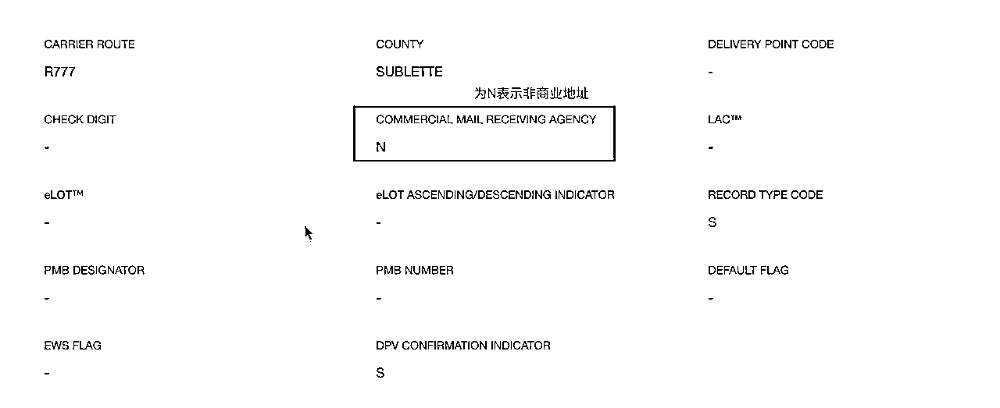
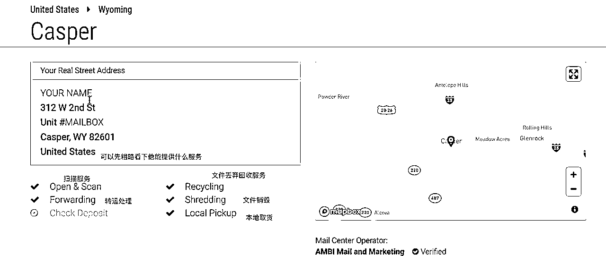
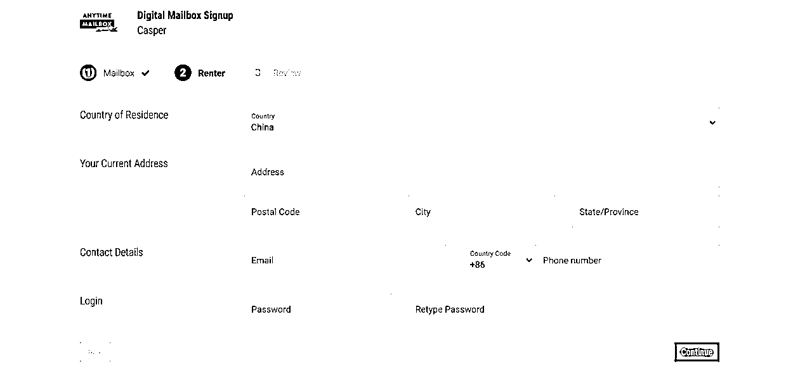
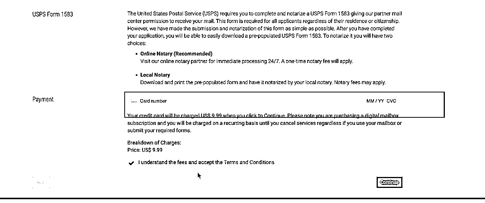

# 美国私人地址

> 来源：[https://cijczs95il.feishu.cn/docx/AbYWdC33UoXLZgxeCgTc3hmandc](https://cijczs95il.feishu.cn/docx/AbYWdC33UoXLZgxeCgTc3hmandc)

# 为什么需要一个私人地址

*   申请美国信用卡

*   申请美国银行账户

*   帮助我们代收存支票

*   帮我们接受官方邮件和信件等等

# AnytimeBoxMail

Anytime Mailbox是一家老牌的虚拟信箱地址服务商，成立于2013年，经营主体为美国Bugo LLC. ，在新加坡和菲律宾都有分支机构，几乎是世界上用户最多的一家了。Anytime Mailbox目前提供世界上几十个国家在内的一千五百多个地址的虚拟信箱业务，并且通过其机app ，用户可以很随时随地的在线阅读信件扫描件。

地址多的原因是AnytimeMailbox的运营模式是加盟模式，类似于国内的菜鸟驿站。

这个方式既是优点又是缺点。

优点是地址很多，而且其中有些可能是住宅地址，可以接受银行账户注册和信用卡申请。

缺点是鱼龙混杂，服务质量比较看运气。

# 如何选择邮箱地址

## 注册公司

如果你是要注册公司，那么就要找到你选择注册公司的州，购买非商业的地址，非商业地址后续才能用于申请银行卡。查询是否属于非商业的地址可以通过USPS官网工具查询。

## 需要接受纸质支票

那么需要选择支持Check Deposit服务的地址，有一些服务商是通过支票发钱的，比如广告联盟，northwest的推荐奖励等。

## 购物需求

如果需要转运包裹的话，优先申请美国西海湾的地址。因为西海岸物流会快一点，直接走洛杉矶国际中转中心，东海岸的会先转到西海岸在到中国。

如果海淘需求的小伙伴可以选择美国西海岸的俄勒冈州，这是免税州，美国有五个免税州，分别是阿拉斯加（Alaska），特拉华（Delaware），蒙大拿（Montana），新罕布什尔（New Hampshire），俄勒冈（Oregon）

# 租用地址操作流程

根据上面的选择好你的目标州，然后开始购买地址

# USPS Form 1583

上面我们完成了地址租用，但是这个时候你还不能使用，或者说合法使用。我们还需要完成1583表格并且进行公正。

我们根据上面设置的密码登录anytimeboxmail，页面会提示你需要完成地址认证

这里注意：

不要点”Notarize Online Now”，没有SSN不能进行在线认证，在线认证只能美国人使用。一旦点错了，就会直接扣除一笔费用，要退款还需要联系客服。

anytimeboxmail会提供1583表格填写，我们在上面填写完表格后，导出保存。

## 如何进行公正

### 自行通过在线公证网完成

我们自己公正，不划算，认证费用还需要75美金，同时还需要英文交流。

### 在Fiverr上面找人搞定

在fiverr上找卖家搞定，提供中文服务，花费30$就可以了。这种方式费用低，而且有专人帮忙预约，认证时他也会充当翻译。

时间大概2-3天完成

## 认证完成

在完成认证后，我们需要回到anytimeboxmail中，把认证的表格上传。网站处理完后，邮箱就可以使用了。

至此，恭喜你，你获得了一个美国地址。