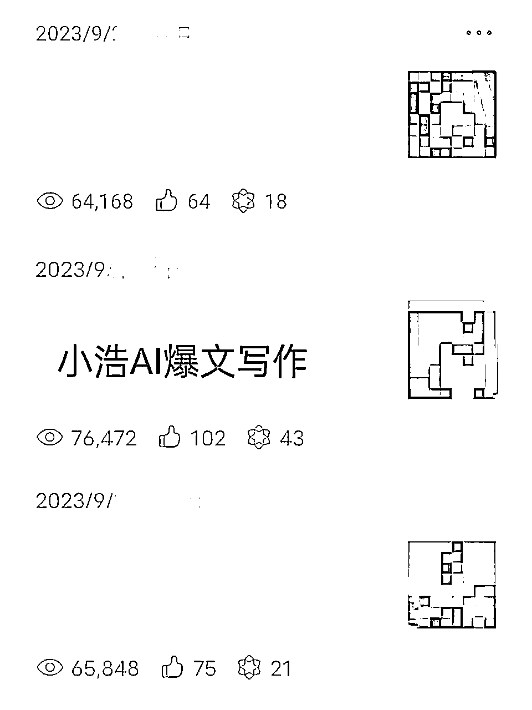
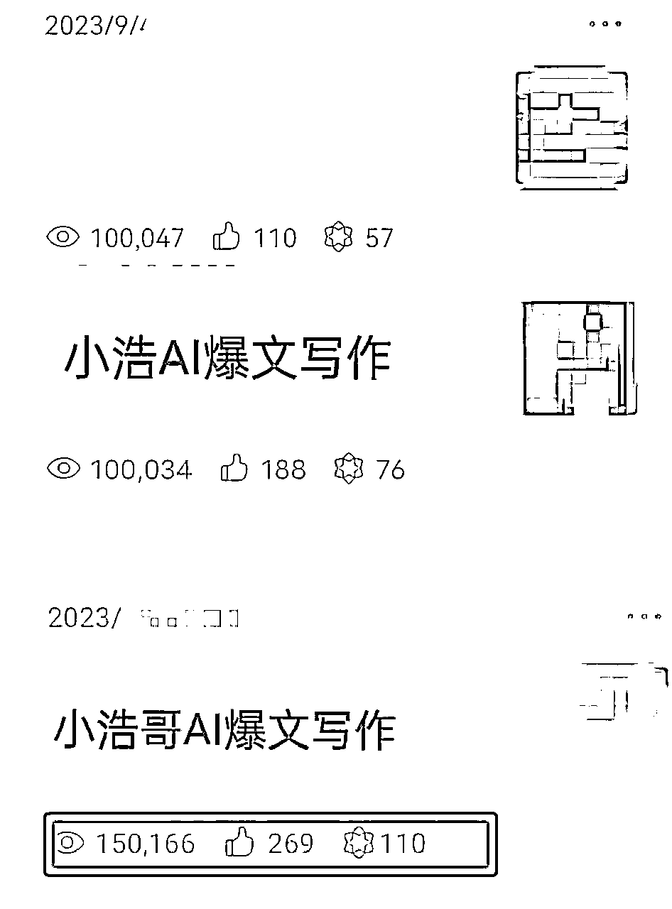
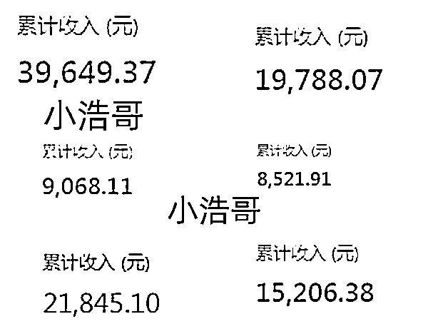
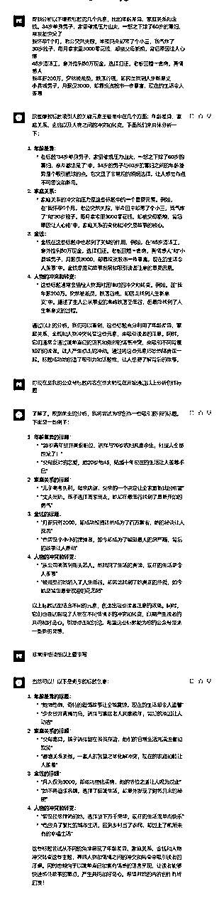
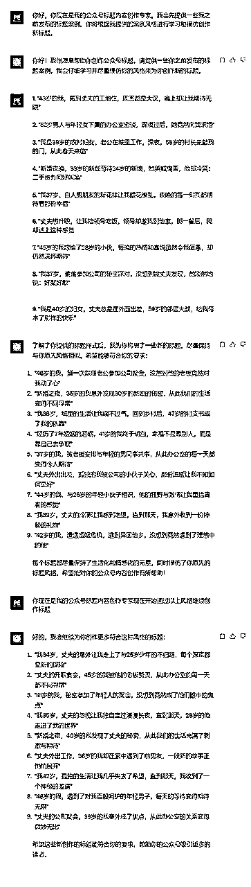
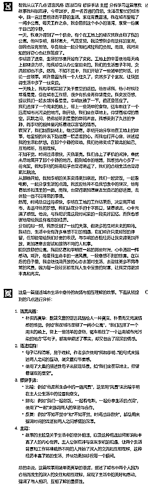
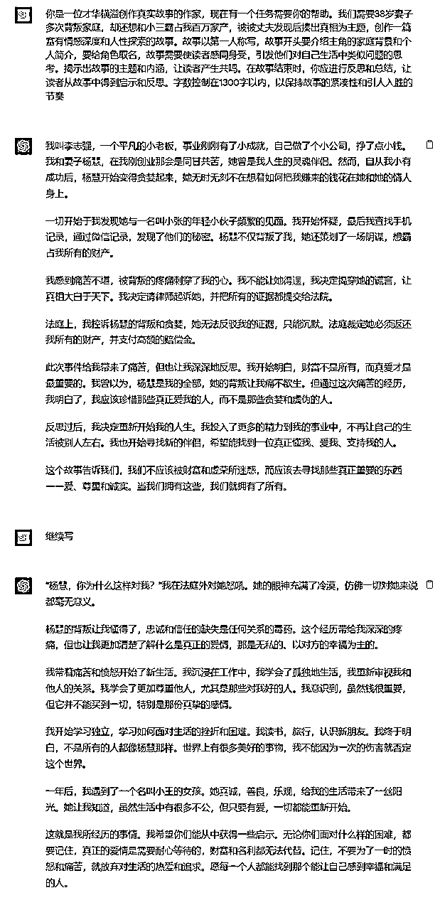

# GPT辅助公众号矩阵爆文写作，3个月实现收益10万+复盘

> 来源：[https://ph57ka8tip.feishu.cn/docx/Kt64dkXvIo3ktkxSAL8cQOrOn8f](https://ph57ka8tip.feishu.cn/docx/Kt64dkXvIo3ktkxSAL8cQOrOn8f)

大家好，我是小浩哥 参加过2期的公众号爆文写作的航海今天，我想和大家分享一个特殊的写作经历，告诉大家如何通过一个神奇的AI工具，把我在公众号的写作收益从零增长到10W+。

随着微信公众号开放了公域推流功能，有了GPT辅助内容创作门槛随着降低迎来了更多的机会。简单地说，只要内容质量过硬，即便是零粉丝的公众号也有机会获得大流量的推荐的机会，实现10万+的爆文。

我与GPT的不解之缘我在今年3月份第一次使用GPT，就被吸引住了后面开始痴迷学习买拉很多相关的课程和资料。从此，我的写作效率飞速提升，从最初的每小时1篇文章，增加到惊人的每小时20篇，实现了一天写100篇文章。

在GPT的帮助下，我一天可以轻松创作出大量高质量的文章，并开设了多达20多个公众号批量化运营。开始不急于求成，稳扎稳打我的写作旅程并不是一帆风顺的。

刚开始的1个月我几乎没有什么流量和收入，但我没有放弃，坚持下去，最终收获了今天的成果以下是我使用GPT创作的部分反馈数据图。

我分享下我如何通过使用 ChatGPT，创作出了多篇高阅读的爆款文章，以及我在这个过程中的学习历程和收获。

# 第一选择合适自己的领域

最佳定位＝你的热爱+你的擅长

选择领域是起号的第一步。不要一开始就广而泛之，选择一个你真正热爱且擅长的领域，深入挖掘，例如情感、心灵鸡汤或热点等。先吃透一个领域，再去拓展。

注册一个公众号：电脑和手机端都可以注册

注册公众号后，考虑如何吸引粉丝，同时不要忘记设置一个易记且与内容匹配的公众号名称和简介。至于流量变现，主要方式为广告和打赏。在满足500粉丝要求后，开通流主广告分成和打赏功能就可以。

公众号内容创作 比较容易上手的三个领域

1.  情感故事

1.  名人名言

1.  影视点评

每一类文章均由素材、选题、正文和标题组成。

今天，我将分享如何在这三大类中，如何创作出吸引读者眼球的文章。

第一素材收集：

做自媒体最大的挑战之一便是如何持续获得优质素材。建议日常留心身边发生的事，从社交媒体平台上搜集有趣的故事，或者直接与读者互动以获得第一手的内容灵感。

生活中处处是素材：观察生活，记录点滴，结合GPT的强大能力，你会发现写作其实并不难。

例如，情感类文章可以从生活中真实发生的事情、网络热门话题或读者分享的经历中获取。

1.  文章制作流程：

*   素材收集：整合生活中或网络上的素材。

*   确认选题：确保文章话题新颖且符合公众号定位。

*   制作正文：结合素材撰写吸引人的正文。

*   完成标题：创作一个引人点击的标题。

1.  爆款文章的秘诀：

一篇高质量的文章需具备以下条件：吸引眼球的标题、原创性、信息新颖、与日常新闻区分、传达正面能量。

找到合适的选题

爆款内容往往与选题关联极大，因此需要选择读者感兴趣的、你领域用户关心的话题去创作。寻找灵感，可以通过分析领域内的爆款文章，找到其中的规律。

1.  标题写作技巧

*   想写出爆文标题是关键：吸引读者的第一步就是一个吸引人的标题。

*   好的标题就像一道开门红，让用户忍不住点进来。

#### a. 爆款标题要素:

1.  调动情绪：让读者产生喜悦、悲伤、愤怒、好奇等情感。

1.  使用数字和数据：具体、真实，给人以明确的感知。

1.  使用极端或夸张的词汇：增加标题的冲击力。

1.  保持简洁清晰：让读者一眼看到重点，快速吸引他们点击。

#### b. 爆款标题公式:

突出主题+矛盾冲突+引发悬念。例如：

*   47岁的我，搬进了丈夫的工地宿舍，被一群硬汉包围，晚上燃烧起了期待的火焰。

*   35岁新郎的言论让26岁新娘哭泣：你这二手货有什么好疼的？

#### c. 标题润色技巧:

1.  植入流量热词，如“疲惫不堪”、“心满意足 ，笑容满面”等。

1.  用具体、生动的语言来描述，创造情境、展现角色，反转情节或制造悬念，使标题更具吸引力。

例如：

原标题: 50岁单身汉，被46岁寡妇骗进家，干完体力活后偷偷跑回了家

改之后: 50岁单身汉，被46岁寡妇骗进家，干完体力活后寡妇却笑容满面。

新娘缺席婚宴，丈夫报复性分居十几年，妻子的态度坚定，一直未变

新娘缺席婚宴，丈夫报复性分居十几年，妻子晚上却笑容满面等着隔壁老汉的反击

怀孕的妻子被婆婆安排去旅游，丈夫一招架醒她，却引发了一场结局

怀孕了，婆婆安排去旅游，丈夫一巴掌把我扇醒，结局却让我如愿以偿

45岁美女房东求助28岁小伙修水管，修好后却有了意外收获

45岁美女房东晚上求助28岁小伙修水管，修好后虽疲惫不堪却体验了不寻常的快乐

# GPT辅助创作

## GPT写标题

第一步 先投喂让GPT分析

## 2.1 如何让 ChatGPT 批量产出爆款标题

我们需给 ChatGPT 一个标题写作指令，这个指令需要自己通过给 GPT 对话调教。

第一步：让 ChatGPT 分析爆款标题元素比如年龄差异、家庭关系和金钱。

我们可以先找 5 到 20 个你这个领域的的5W- 10w+的爆款标题让 ChatGPT 去分析学习：

第二种：模仿指令 也是喂给 ChatGPT，批量生成标题

可以看到，这时候 ChatGPT 已经能够根据你的指令批量给出不错的标题，你可以从中选择自己觉得合适的，也可以在这些标题的基础上通过我上面分享的标题创作方法进行润色修改，作为自己的文章标题。

## 2.2 GPT写正文

## 2.1直接套用模板指令

第一种指令写法

先找到5到10篇爆款文章投喂给GPT最好选择同种类型的爆款文章

你是一位才华横溢创作真实故事的作家，现在有一个任务需要你的帮助。我们需要XXXXXXXXX为主题，创作一篇富有情感深度和人性探索的故事。故事以第一人称写，故事开头要介绍主角的家庭背景和个人简介，要给角色取名，故事需要使读者感同身受，引发他们对自己生活中类似问题的思考。揭示出故事的主题和内涵，让读者产生共鸣。在故事结束时，你应进行反思和总结，让读者从故事中得到启示和反思。字数控制在1300字以内，以保持故事的紧凑性和引人入胜的节奏

这里的主题可以是一个选题 或者一段故事描述

比如现在我以这个选题为例38岁妻子多次背叛家庭，却还想和想小三霸占家产，被丈夫现场揍出真相

你是一位才华横溢创作真实故事的作家，现在有一个任务需要你的帮助。我们需要你以38岁妻子多次背叛家庭，却还想和小三霸占我百万家产，被被丈夫发现后揍出真相为主题，创作一篇富有情感深度和人性探索的故事。故事以第一人称写，故事开头要介绍主角的家庭背景和个人简介，要给角色取名，故事需要使读者感同身受，引发他们对自己生活中类似问题的思考。揭示出故事的主题和内涵，让读者产生共鸣。在故事结束时，你应进行反思和总结，让读者从故事中得到启示和反思。字数控制在1300字以内，以保持故事的紧凑性和引人入胜的节奏。

通过这个指令已经写出一篇故事 删除重复不需要的内容就可以

# 运营这个项目的心得

在操作公众号流量主项目的过程中，成功的关键在于先要找对适合自己模仿的对标，以及清楚自身的能力边界。

不是看到个看到哪个领域赚钱就选那个，我自己一直深耕的就是情感故事文，所有的努力和尝试，都要以自己擅长的领域为中心，先找到行业中值得借鉴的大佬的方法论，同时了解自己当前的能力范围和资源。

在这个过程中，仔细观察项目的每一个环节，发现缺什么就补什么，比如新起的账号已经了一个月了还不入流量池，在标题和内容没有问题的情况下可以选择注销或者重新起一个账号， 要不断优化策略才能使得项目能够更为顺畅地进行。

平时多付诸实践，执行每一个计划，避免过多的内耗，不要陷入无尽的“想当然”和“假如”之中，这些通常只会消耗精力而不会带来任何实质性的进展。如果发现自己在过多地纠结于这些假设而不是行动，那很可能是因为还没有真正投入到项目中。

只有当我们全力以赴，不遗余力地推进，才能看到实质性的成果。如果尝试后没有得到正反馈，那可能意味着我们还没有尽全力。

放下过多的顾虑，勇往直前，全力以赴，务实、行动和全力以赴同时，从中汲取经验，不断优化和调整策略，这是推动公众号流量主项目成功的关键。

### 最后，关于学习心态：

每个人都有自己的发展速度和路线，不要和别人比较，和昨天的自己比，进步就好。这世上没有真正的天选之子，只有默默付出努力的人。请相信，你的潜力远远没有被挖掘出来，继续努力，永不放弃。

无论您是职业写作者还是业余爱好者，我都希望分享这段经历，鼓励大家利用AI的力量，实现自己的写作价值。只要有梦想，有决心，加上AI的助力，我们都能创造出惊人的成果！

愿大家都能在创作的路上得偿所愿，写出的10W+大爆款，走向人生巅峰！