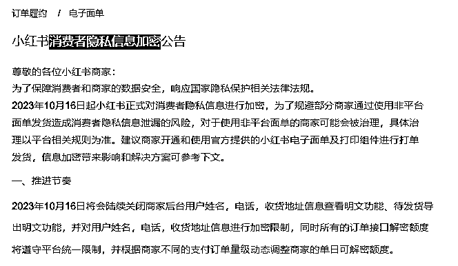
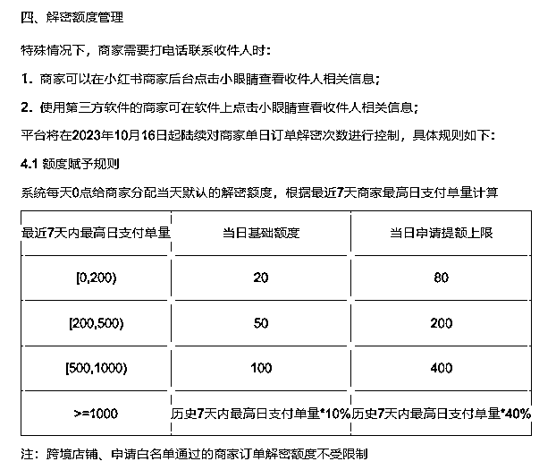
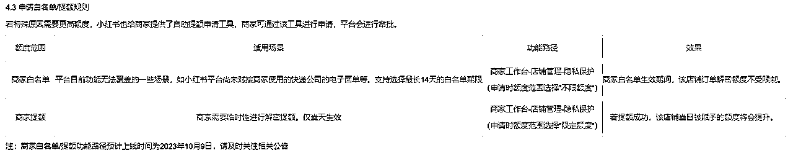
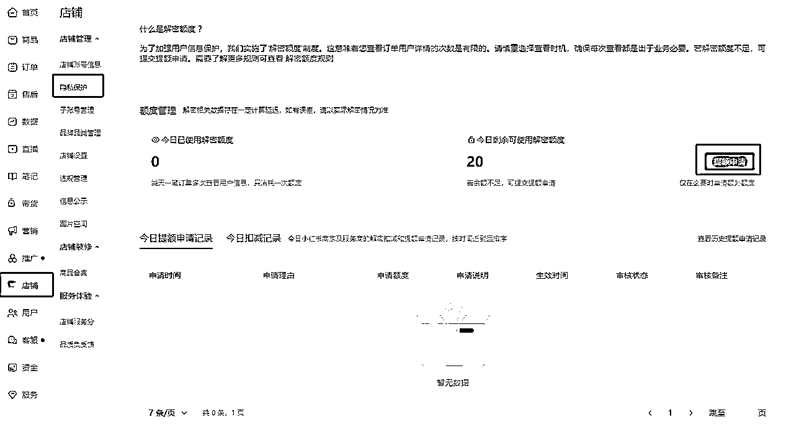
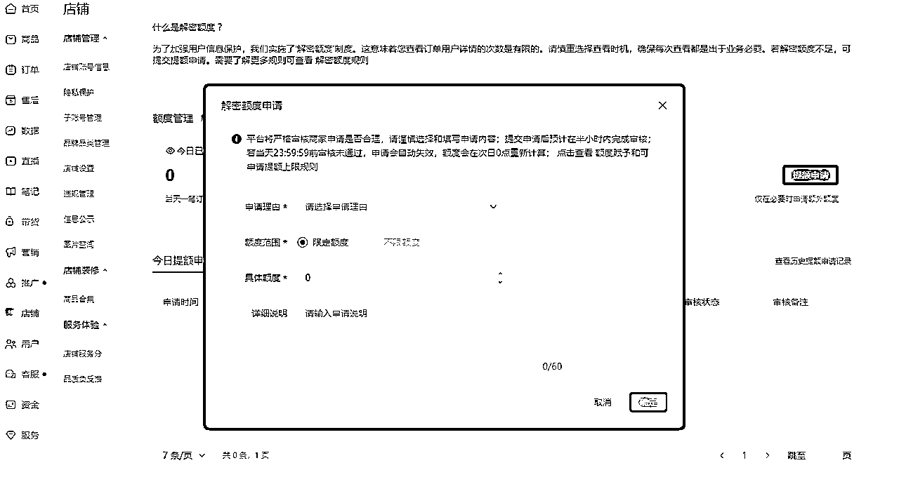
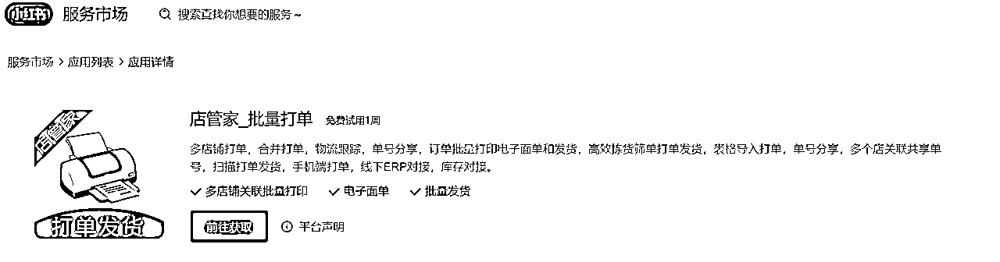
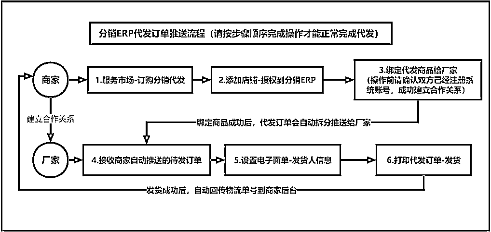

# 应对[消费者隐私信息加密]解决办法

> 来源：[https://q6m0ulsetk.feishu.cn/docx/LDHjdKGnPo0eSnxn1VzcnF8jnpb](https://q6m0ulsetk.feishu.cn/docx/LDHjdKGnPo0eSnxn1VzcnF8jnpb)

# 一、解读要点

平台2023-9-26和10-10日发布了两次《小红书消费者隐私信息加密公告》，于2023年10月16日执行，此公告的意思就是说用户下单，我们复制不了用户信息，连看都只能看到加密后带*的收件信息，但有一定的解密额度，而这一点解密额度对于商家来说远远不够，而且小红书要求商家都要用“小红书自己的电子面单”

从打击无货源代拍到小红书面单再到现在消费者隐私信息加密，强制要求商家使用小红书电子面单进行打单发货，未切换的商家将无法正常打单发货，层层限制，每次新规的出现必定会有人退出，这也是个好事，你的竞争对手少了，心态放好拥抱变化顺应平台

## 公告的四、解密额度管理

这里用最近7天内最高日支付单量0-200单举例，后面的额度数自己看表格

7天内单量不超过200单的，每天有20单内的（每天0点更新）可以查看20个客户的详情信息，对于每天20单以下甚至没有单的不需要担心！20单内可以直接复制用户信息给你的厂家或去1688拍单下单

而去淘宝或拼多多拍单则用中转仓即可，用中转仓也不需要解密客户信息，直接用拍单软件-中转仓下单，也就是说用中转仓拍单发货不影响隐私信息问题。

而一天查看的基础额度是20，需要看更多订单信息，可以申请提额

申请提额流程：商家工作台-店铺管理-隐私保护（需要先点击订单-打单发货-申请电子面单）才有“隐私保护”板块

申请提额的申请理由：

1.代发商家需要让供应商发货

2.使用了小红书电子面单不支持的快递(在申请说明注明快递公司)

3.发货仓库没有对接小红书电子面单

4.虚拟商品

5.其他(在申请说明注明原因)

以上解读适合单量少或自发货已开通小红书面单的商家，而对于无货源商家单量少的需要查看订单信息的方法也可通过以上申请提额方法去查看

以上了解新规和申请额度即可，避免需要查看订单信息时没有解决办法

# 二、无货源商家的解决办法

对于无货源商家的解决办法有以下几种，不同阶段有不同解决办法，自己根据情况灵活变通

## 1.打单发货（自己进货发货）

这一步需要自己囤货自己去谈快递，然后申请平台电子面单-配置面单模板-下载并运行打印组件，具体教程看这个

订购小红书电子面单【官方教程】

手动打单发货【官方教程】

## 2.使用中转仓（单量少）

使用中转仓发货，不需要解密额度，能完美解决黄牛短信、电子面单等问题，规避无货源

单量少但有多个上家并且是在其他平台代拍的，用中转仓（平台代拍，使用中转仓是为了避免判定无货源）单量少额度够用1688直接下没问题，但1688合作的要问清楚不要用其他平台的机器打单，避免给检测到判定无货源

## 3.使用店管家软件（订单量大）

商家通过系统与厂家进行绑定，商家向厂家推送订单，订单同步到厂家那里，厂家获得订单信息进行打单发货，商家这边也自动同步发货。

商家教程https://docs.qq.com/doc/DU0pySmR2WVRhakFs?&u=3d93683801c64dc5b28bfb3c55e94430

厂家教程https://docs.qq.com/doc/DU1ZLVEJmbFFxdkZ1?&u=3d93683801c64dc5b28bfb3c55e94430

## 4.子账号发给上家（订单量大，固定上家）

创建子账号开通相应的权限给到上家，让上家根据教程开通电子面单并配置绑定打印机，适用于只有固定合作上家的

店铺子账号配置指南

小红书电子面单操作指南

但还是推荐用店管家，订单信息清晰，和上家对账，处理售后都方便

单量少让上家配合去开通弄店管家和创建子账号绑定机器上家不一定会接受，找货源前可以先问下上家是否有店管家，有则直接绑定，无就先用中转仓，单量起来了在去让上家配合使用店管家即可，店管家方便和上家对账，处理售后都方便