# 抖音抖店无货源月利润6w+保姆级教程及避坑指南

> 来源：[https://xxuqrz1ty8k.feishu.cn/docx/LFwodDpIHobyWux6xMWc8I7un5u](https://xxuqrz1ty8k.feishu.cn/docx/LFwodDpIHobyWux6xMWc8I7un5u)

大家好，我是一焱，90后，重庆人在成都，全职做抖音

今年5月起盘做抖音抖店，单日最高销售过200w+，月销过1000w+

前段时间分享了《抖音抖店日销200w+经验分享及对抖音终局的思考》，阅读请移步飞书：

看上去确实比较嗨，但是门槛比较高，需要极致的供应链及售后团队才能完成月销过1000w+的规模

今天主要分享《抖音抖店无货源月利润6w+保姆级教程及避坑指南》

老规矩，先甩几张数据图，抖店并不是只有达人端，达人带货都是微利，商品卡才是真正的高利润

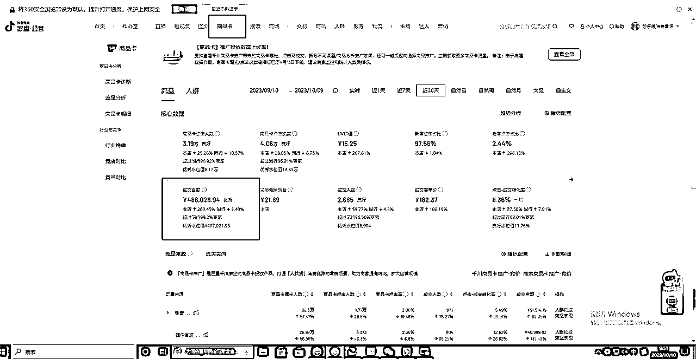

莎乐粮油专营店商品卡月销售额48.6w，占比25%，净利润22%

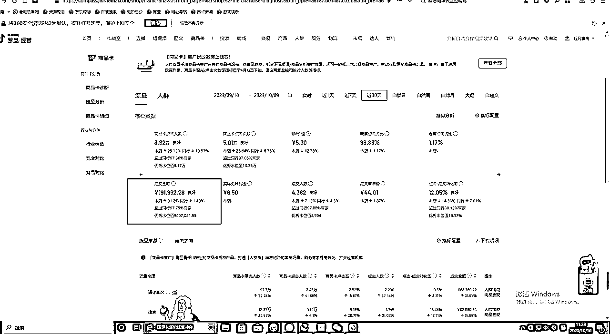

超凡食尚月销售19.1w，商品卡占比87%，净利润18%（该店铺所有产品均是一件代发，利润由于一件代发成本比自己供应链要多4%成本，商品卡占比较高，由于市场竞争较大，达人端无太大竞争力）

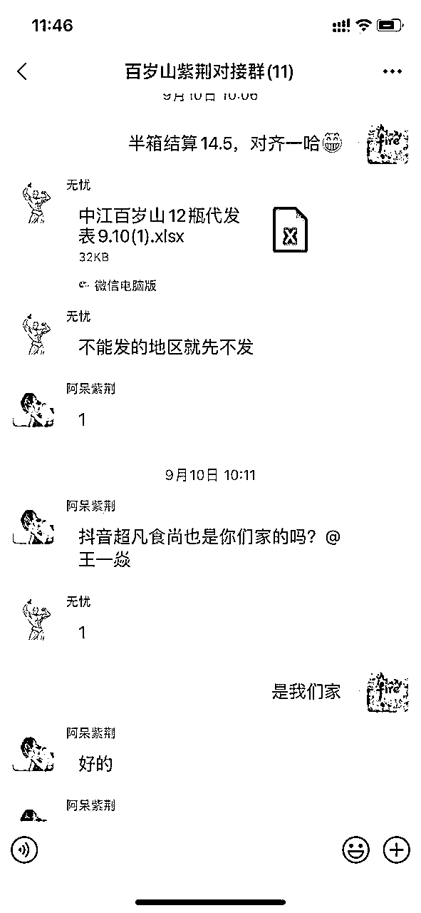

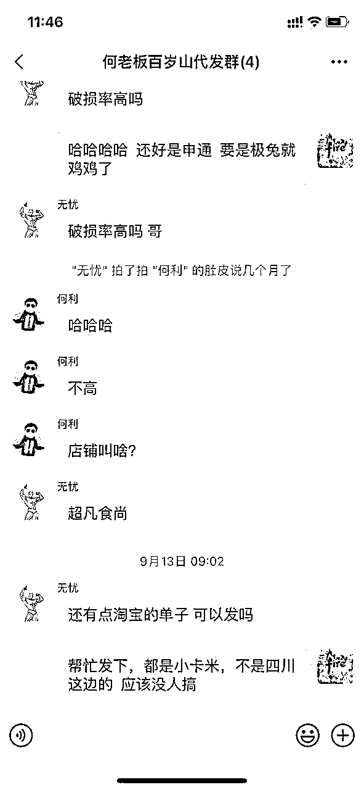

主要带我小兄弟在做，资金不够，找同行做一件代发，每日日结，基本上只需要垫每日发货资金

# 主要分享内容：

# 一、抖店无货源保姆级教程

# 二、抖店详细避坑指南

## 一、抖店无货源保姆级教程

做抖店不仅是达人端，还有商品卡端。现抖音一直在推商品卡，只是现在大家消费习惯还没纠正过来，个人在抖店商品卡吃到了红利，也预测抖店商品卡是抖音红海中的蓝海生意

有的人说，我没有达人，没有货源，也没有供应链，也没有基本的资金，想一两个月做好好抖店，这种直接劝退。

这个超凡食尚的小兄弟能力还不错，前期起盘我利用资源嫁接帮他找了一些达人起店，他自己也很给力，用商品卡承接住了这波流量

抖店是短期很难有结果，不能持续的直接劝退+1

开店基本细则就不讲了，跟着官方就可以开下来了，这边讲一些比较实际的东西，尽量以我带的小兄弟超凡食尚店视角来切入，无货源，无达人，但整体会把抖店这盘生意打法说清楚

### 1、突破重点达人

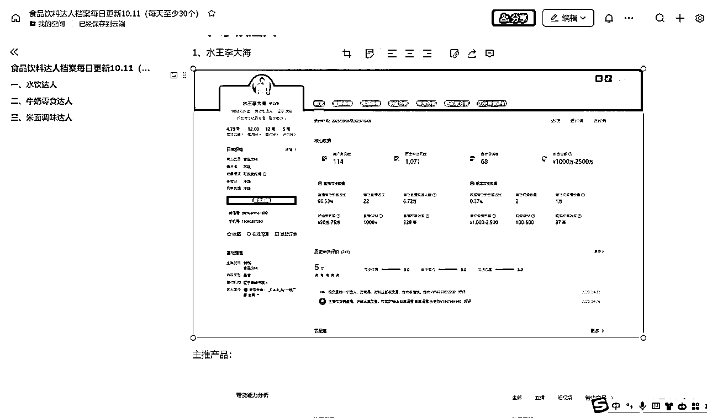

我现在仍然在累积整理达人档案，目的是在食品饮料领域，我能了解到哪些达人真的能出货，当你链接的达人更多，你的势能就更大，也就是你的资源，是很容易变现的

有人会说，我又联系不上，这个只能说你没有那么大的动力区联系他

举两个不太合理但很恰当的例子，一个是赵奕欢，一个是王李丹妮（懂得都懂，我是完成梦想想建立链接）

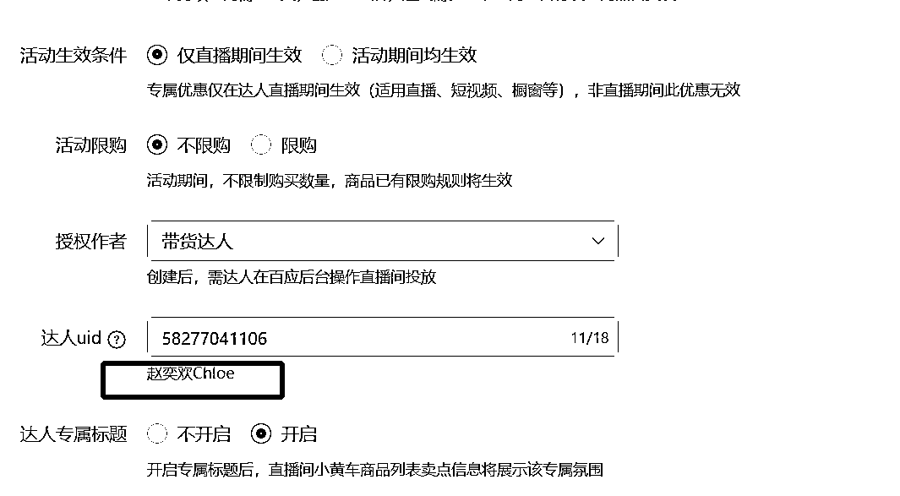

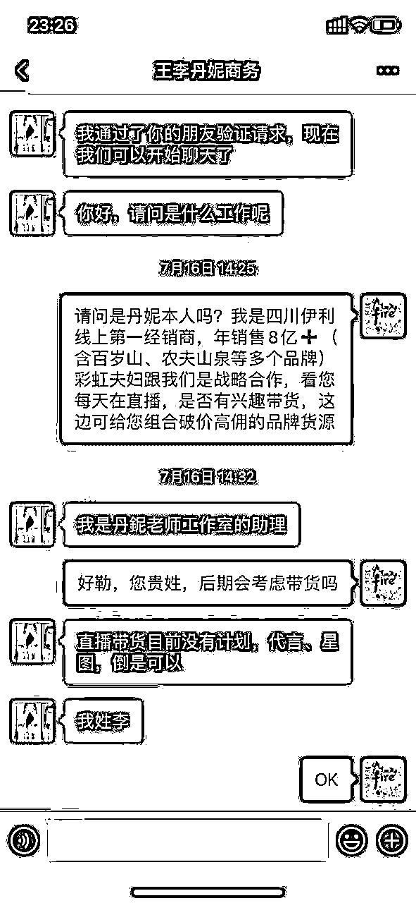

只要你想去建立链接，你又足够多的动力，你基本上都可以做到。当然建立联系的时候 可以吹一定的牛，我们一年卖不到那么多货

记住达人的链接就是你手头的资源，现在你需要做的就是找足够多的供应商货盘，这里比较类似抖音团长的角色，但是并不是，现在团长其实是商家和达人很嫌弃的角色，团长撮合一下双方交易就想挣几个点，市场已经非常有效了，凭什么让他们挣

正因为很卷，你撮合商家和达人，你在达人和其它商家都是第一顺位，可以适当挣一点儿，达人端递品会优先考虑你，供应商也会优先考虑你，我前段时间还帮供应商出了几万箱百岁山，现在关系更加深入了

你自己最后有店铺承接，挣你该挣的钱就行，这样做可能会觉得有些钱没挣到，实话说，挣到太多差价是不符合市场规则的，你在第一顺位，你的单量是不可想象的，同行供应链代发价格也会给到你市场最低

达人第一顺位有优先择偶权，出货量是极大的

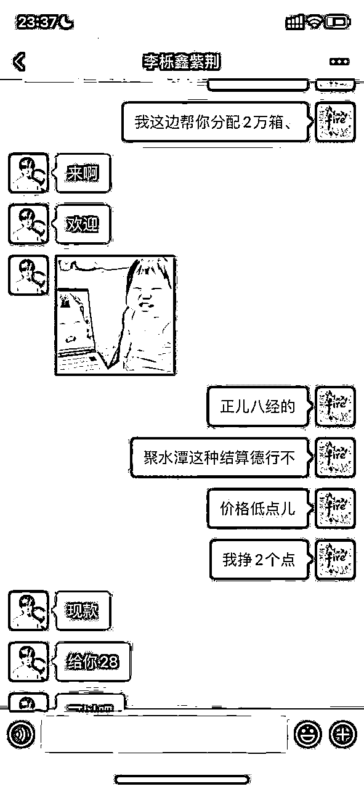

百岁山一件代发价格28，控价37，代发净利润24%，,比我自己去百岁山品牌拿货的成本还低（成本28.5左右），因为他们体量很大，价格成本就很低（顺便说一句，现在关系也挺不错）

#### 怎样和达人或达人商务保持深度链接？

a、要是是达人的话，你除了给他组合货盘，还可以经常和他们唠嗑，谈谈其他的事，也就是所谓的提供情绪价值，对于做抖店的同学一定要去做这个事，有时候真的会1%-2%佣金帮你带几次货，这个不是商业谈判了，大家都是兄弟！

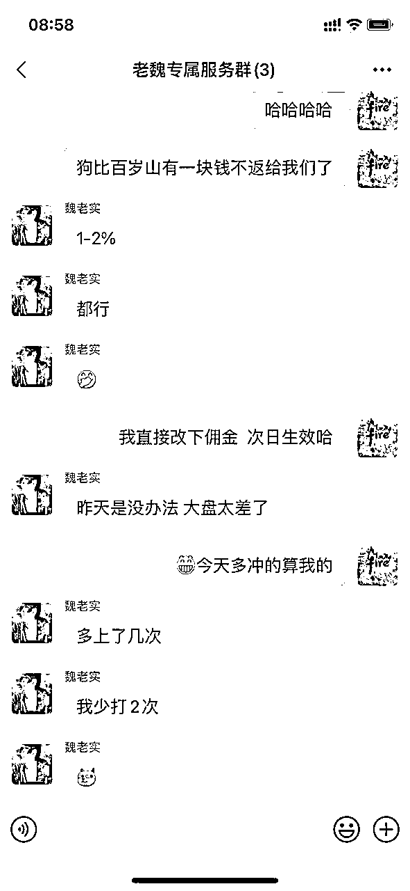

b、重中之重，其实能出货的达人都有商务，记住，你搞定的是商务，是商务，商务就行了

搞定商务：实话实说，可以给钱搞定，可以许愿，比如来成都，安排，多聊天交朋友或者寄样品（我遇到很厉害的达人或商务，直接寄30箱样品，主要给他们自己喝）

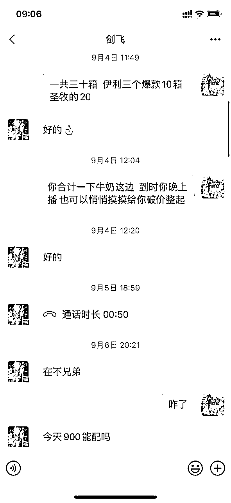

c、为达人做货盘

举例:夏天水饮确实很好卖，但是天凉了，就很恼火，你可以帮他们组合牛奶、零食等，他们会很感激你，这些你和达人的关系就很密切了

### 2、无限链接，上新就有流量

这个很关键，一个单品你可以上很多链接，只要换主图跟标题，抖音的算法都查不到重，上新就有自然流

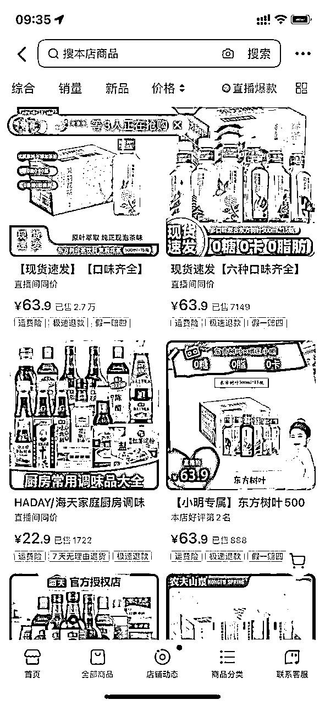

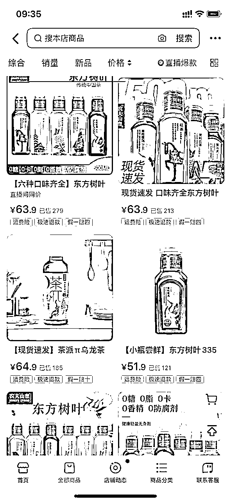

我估计单品可以上无数个，抖音算法制，测试识别不出来，多卖几箱算几箱

### 3、抖音活动提报

接上面，你的链接很多，你可以提价，然后抖音所有的活动你都可以报一遍，算好帐（这个是商品卡最关键的一点，不过多描述）

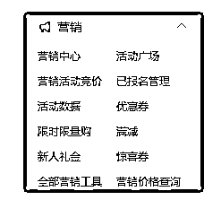

### 4、错位竞争，学会错位去冲榜首，榜首达人无限，自然流也更多

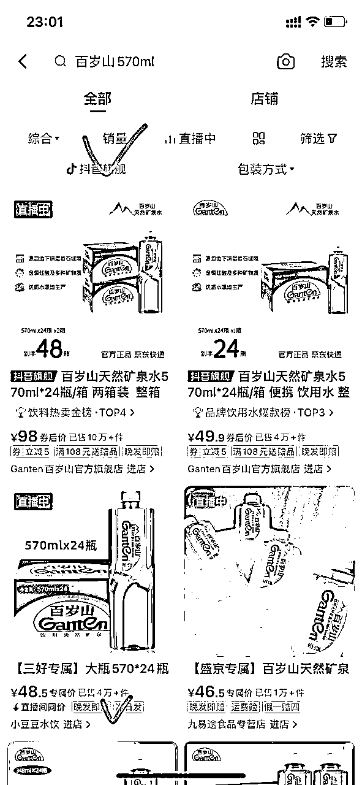

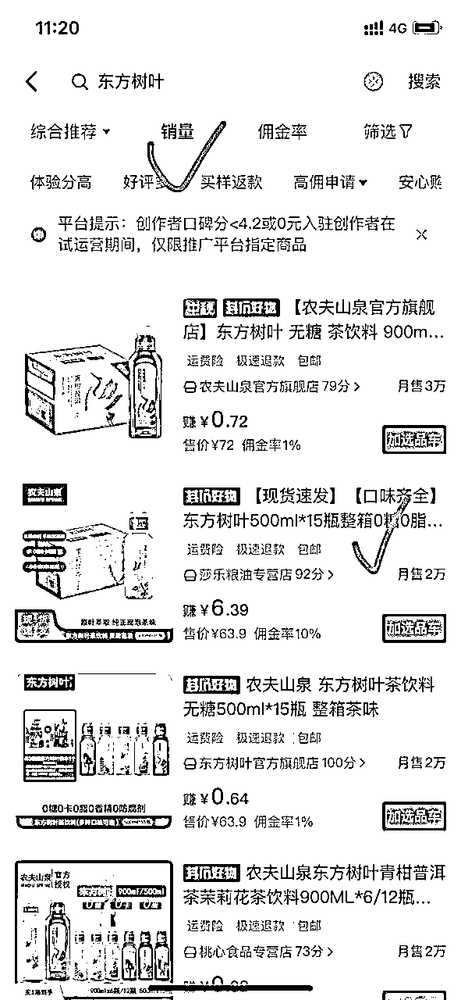

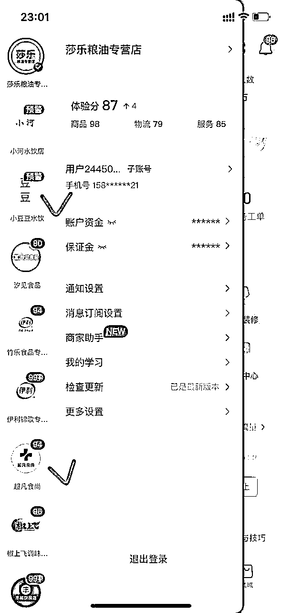

除了官方以外，百岁山570ml和东方树叶500ml除了官方以外，我们都是第一，但是百岁山和东方树叶爆款是348ml和900ml，学会在红海里面挖掘蓝海，然后集中自己的精力与资源去冲榜，这样机会还是很大

### 5、维护店铺分骚操作

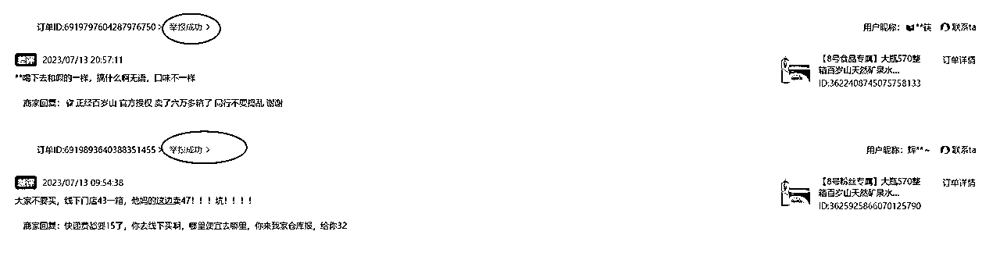

电商不可以删差评，但是可以举报啊，这个非常容易

a、当有客户给了你差评，复制这个顾客的所有信息，包括头像名字

b、复制完这个客户所有信息后，你操作这个号继续在你自己的店铺下单，下单后直接找你们客服谩骂：不退钱就差评，骂人和同行基本100%通过等

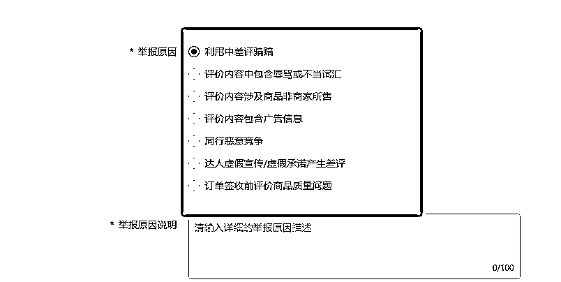

仔细研究这几条即可

### 6、突破一些短视频达人组织

有些达人是个带货组织，个人感觉像传销一样。比如像511,588，带货团队十几万人，本人还没有亲测打入内部（几百元就可以进去），只是推荐，搞定这些组织头子，你的店稳爆！

## 二、抖店详细避坑指南

这个会持续更新补充，也是对自己的警醒

1、开个体店还是企业店？

有条件的尽量开企业店（企业店记得记账报税），之前认为没啥区别

后面发觉个体店有些活动报不了，比如超值购

2、类目一定不要放错，因为每个类目保证金不一样，放错了抖音会认为你是逃保证金，这个是重罚

3、不需要刷单不需要刷单，抖音很容易识别刷单的，70%废单。做食品饮料的起店，我这边可以利用资源推荐一次达人带货

4、不要设置全国包邮

一般甘青宁，西藏新疆内蒙海南快递费是发不了的，这里也要注意转单，我之前被西安的单子转到新疆，快递费一单遭了200多（15kg重货）

5、因为上面说了可以无限链接，扒其它平台的图的时候，注意一定要检查，不能有其它平台水印

6、夸大宣传、违禁词这些不要搞，这个我是建议读抖音后台资料（我起店有个关键，就是老老实实抖店后台的资料看了几遍）

7、很多时候客户投诉、差评这些都可以申诉举报，记住，你是商家，是你让抖音赚了更多钱，这边遇到无理的客户，可以硬刚平台，硬刚客户，之前平台判罚我这边违规，我自己说要是这么判罚，直接起诉顾客诽谤，后面平台妥协了，抖店的规则还有些不完善，该硬还是要硬！

8、90%的团长很坑，这里可能会得罪一些小伙伴，撮合赚差价，在现在的市场环境动动嘴就能赚几个点，做什么春秋美梦（有超级主播的团长还是有议价能力），这里还有注意团长托管计划，说托管的直接拉黑！

9、主动找你带货、寄样品的大多都是骗子，这里一定是你们谈的还不错，再寄出样品没啥问题，要是上来要样品的都是骗子

10、尽量每天上新品，抖音规则，上新品就会推一定的流量（换主图标题即可）

11、价格、佣金一定要反复检查，这个设置错误，可能损失几万甚至几十万，这样这个店肯定是没了

12、不要去买什么达人分销软件，热度云69800一年，为啥不直接去抢，飞书文档建档案，逐步突破就行

后面要是想到还有其它的也会持续更新......

写在最后，抖店其实不是门槛高，这盘生意主要还是考验商务能力，其次就是达人很多都是晚上出现，晚上不缺勤，持续去搞，多半会拿到一个不错的结果

感谢生财这个平台，学到了很多，也拿到了一些结果，也愿意将自己实践的分享出来！