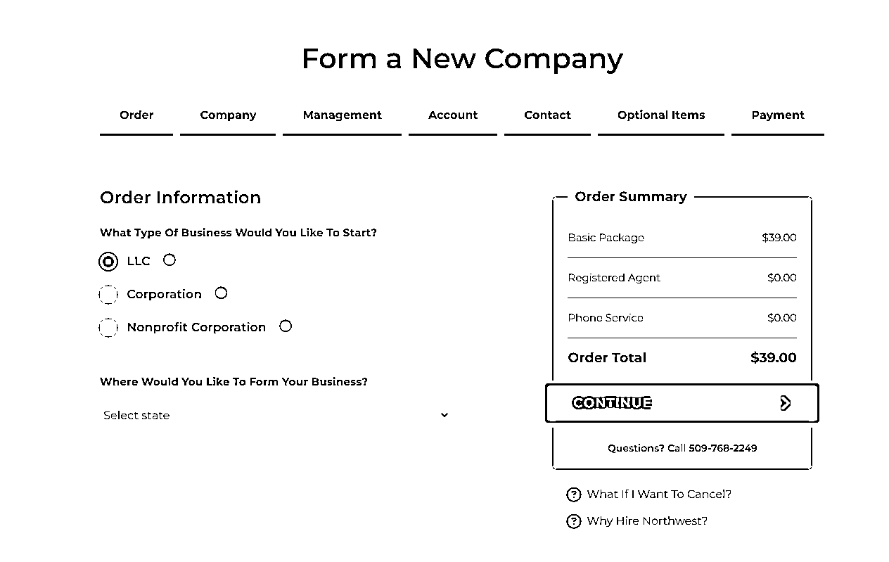
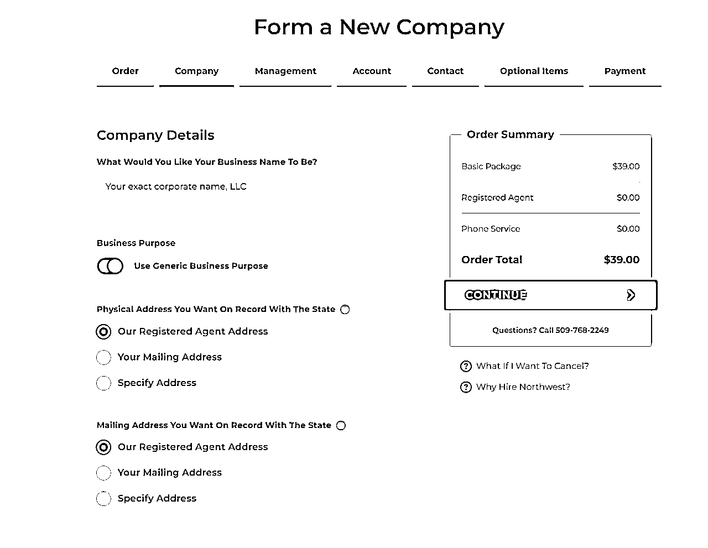
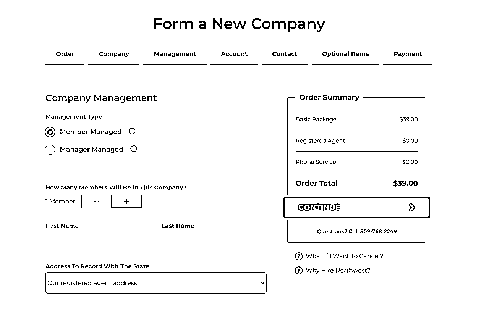
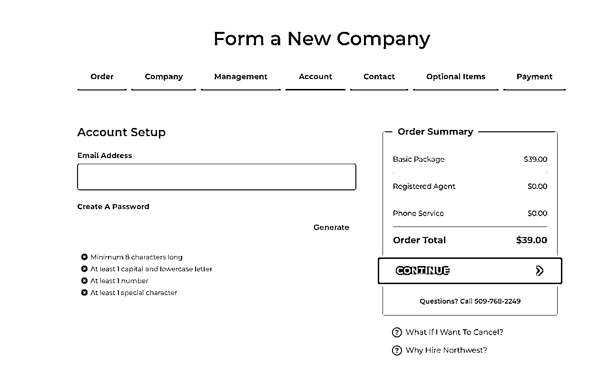
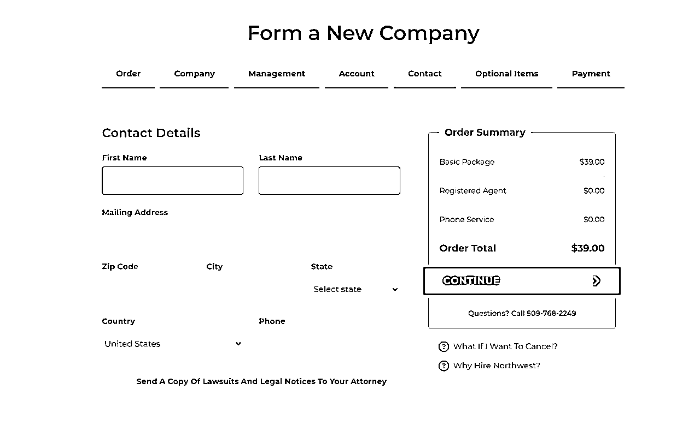
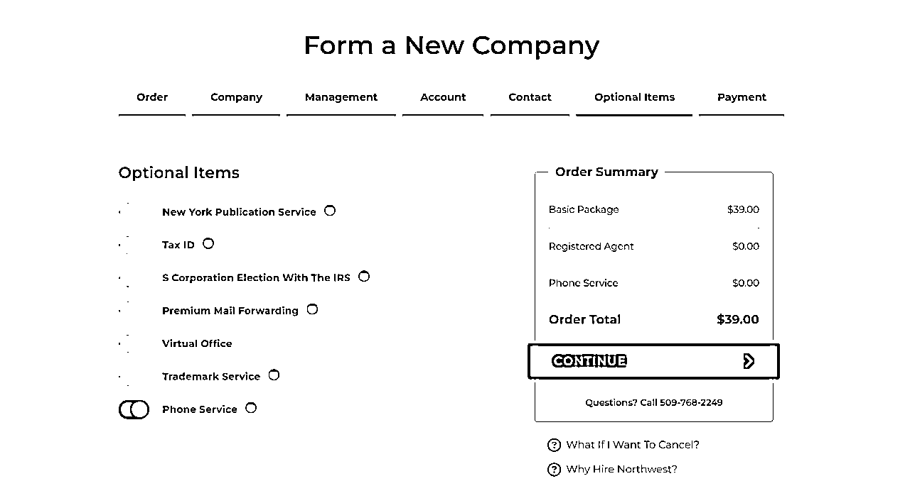
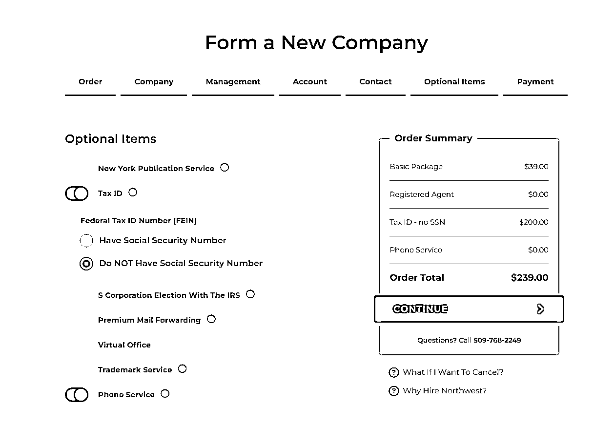
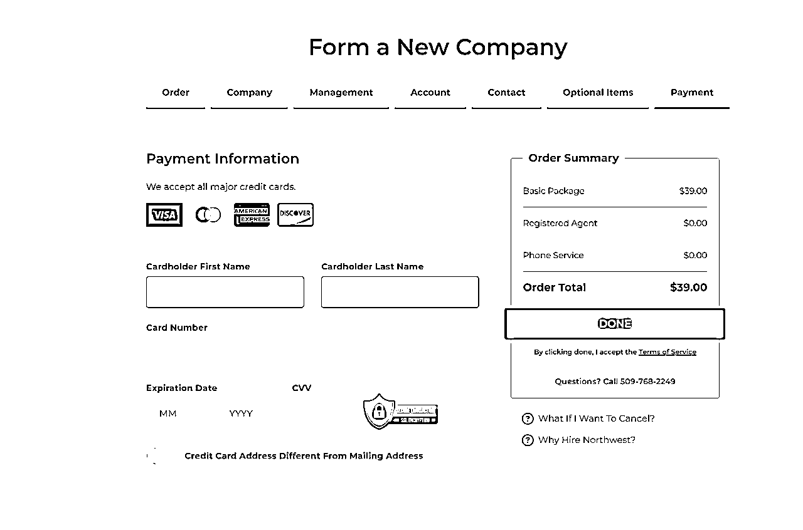

# 最新超低成本注册美国LLC公司教程，地址一切全包仅39美元

> 来源：[https://tj51bxige8.feishu.cn/docx/Lc2rdmvvuoWEvfxvPYvcrB1Cn6c](https://tj51bxige8.feishu.cn/docx/Lc2rdmvvuoWEvfxvPYvcrB1Cn6c)

你们还在找国内代理注册美国公司吗？听我一句劝，真的不要在国内找人注册了，这篇文章主要讲的是个人如何低成本注册美国公司，最低可以39美元注册一个美国LLC公司，并且还包含一年公司商业地址服务，一年公司代理服务等，这篇文章至少给你节约4000元以上，请大家收藏。

### 通过代理机构Northwest Registered Agent注册美国公司仅需39美元

这段时间一直在查询美国公司注册的相关资料，翻了很多国内中文资料，大部分都是国内二手代理注册商家写的，没有什么干货，且都是为了让你找他开公司引流之说，说白了就是能坑一个算一个。通过Google给我提供了很多有用的信息，英文资料一些注册服务机构，价格真的很便宜，可以说比国内公司注册还便宜，不可思议吧。

为了更好的开展跨境业务，需要一个美国公司，总共费用为39美元（39美元的代理注册费+地址一切全包），对的代理注册费用就是39美元。

今天主要讲的就是Northwest Registered Agent美国公司注册代理机构，Northwest Registered Agent是美国第二大注册代理机构，他们在美国每个州都提供有限责任公司组建服务和注册代理服务。如果你正在寻找优质的客户服务和最好的价格，是的，我建议你们选择物廉价美Northwest Registered Agent为你们注册美国LLC公司。

网上很多人都不放折扣注册链接，今天我在这里给大家免费发放折扣注册链接。

大家会神奇的发现，自己通过Northwest Registered Agent官网进入，申请LLC的费用为几百美元+申请LLC州政府收取费用，但是通过我的折扣链接，申请费用为39美元+地址费用全包。

注册链接在下方：

39美元注册美国公司折扣链接

## 美国公司注册教学

需要的资料为你的地址（中国地址都可）、你的邮箱、你的电话号码（国内号码都行）、双币信用卡（国内卡也可）。

不需要护照，不需要美国地址，也不需要你在美国有什么朋友亲戚之类，因为Northwest Registered Agent代理机构帮你搞定了一切。

重点说明下，虽然注册公司不需要护照，但是在美国开展其他业务，比如注册亚马逊美国账号、stripe支付通道、square支付通道、walmart卖家账号等都是需要护照的，没有护照，你身份证明就是个大问题。

### 1.点击折扣链接

39美元注册美国公司折扣链接

进入下图页面，点击 continue 即可。

### 2.设置公司名字，选择商业目的，填写公司地址

Northwest Registered Agent是第一年是免费提供公司地址的。大家可以按照下图选择和填写即可。

### 填写法人信息

可以添加多个公司成员，也可以一个人公司，Address To Record With The State（向州政府备案的地址），可以用他们的地址，你也可以用自己的地址，用他们的地址，可以保护我们的隐私，当然后面公司注册成功后这些都是可以修改的。

### 填写注册邮箱和密码

密码他们的要求长度大于八位必须包含大小写字母，数字以及符号，直接点Generate即可帮你随机生成，记住即可。

### 填写联系人信息

这个联系信息和法人信息可以一样，也可以其他人，地址可以填国内地址，我们一般都是填上法人自己的信息。最下面有一个Send A Copy Of Lawsuits And Legal Notices To Your Attorney（向你的律师发送副本），大部分人都没有美国律师，这个可以不用填写。

### 额外服务

保持默认即可。

我尝试了申请他们的EIN，发现真黑，要200美元，这东西在Fiverr上非常便宜，不会超过20美元。

### 填写付款信用卡信息

这里稍微说下，一般中国的带有 VISA Mastercard以及运通标识的卡都可以支付，因为风控原因，如果你的邮寄地址跟信用卡账单地址如果不一样，则需要勾选最下面的我的信用卡账单地址跟邮寄地址不一样。

### 收到订单成功邮件

## 美国50个州注册美国公司（LLC）相关费用

额外说明：美国还有一个华盛顿特区，英文名为District of Columbia，简称DC，也就是美国的首都，在华盛顿特区注册LLC，特区收取费用为$99，每两年报告费用$300。

以上说的每年/每两年费用都是在LLC无经营状态下的费用，有利润如何报送，还需具体情况具体操作，具体税务问题请自行咨询美国会计师。