# 用ChatGPT赚钱，每小时199元！我是如何用ChatGPT做小红书账号1v1定位咨询的

> 来源：[https://balfcirt91j.feishu.cn/docx/Lcz2dsu9AogeGjxt7xCcabuwn2D](https://balfcirt91j.feishu.cn/docx/Lcz2dsu9AogeGjxt7xCcabuwn2D)

熟悉菜菜的都知道，我应该是全网较早推出ChatGPT+小红书的课程，也是较早用ChatGPT去帮助大家做小红书定位的人。

我迄今为止，已经帮助不下30人，用人机结合、即我的经验+ChatGPT推导的方式，做过1v1的小红书定位。这真是一个很好的方向，可以结合当事人的背景，通过一步步地挖掘，找到一个精妙绝伦的角度，帮助其快速锁定做什么内容的账号。以下是学员做了1v1后的评价。

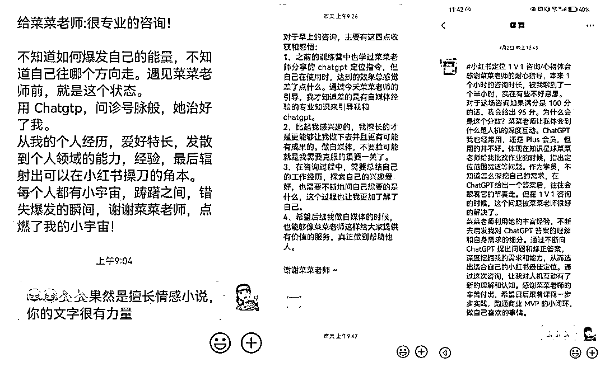

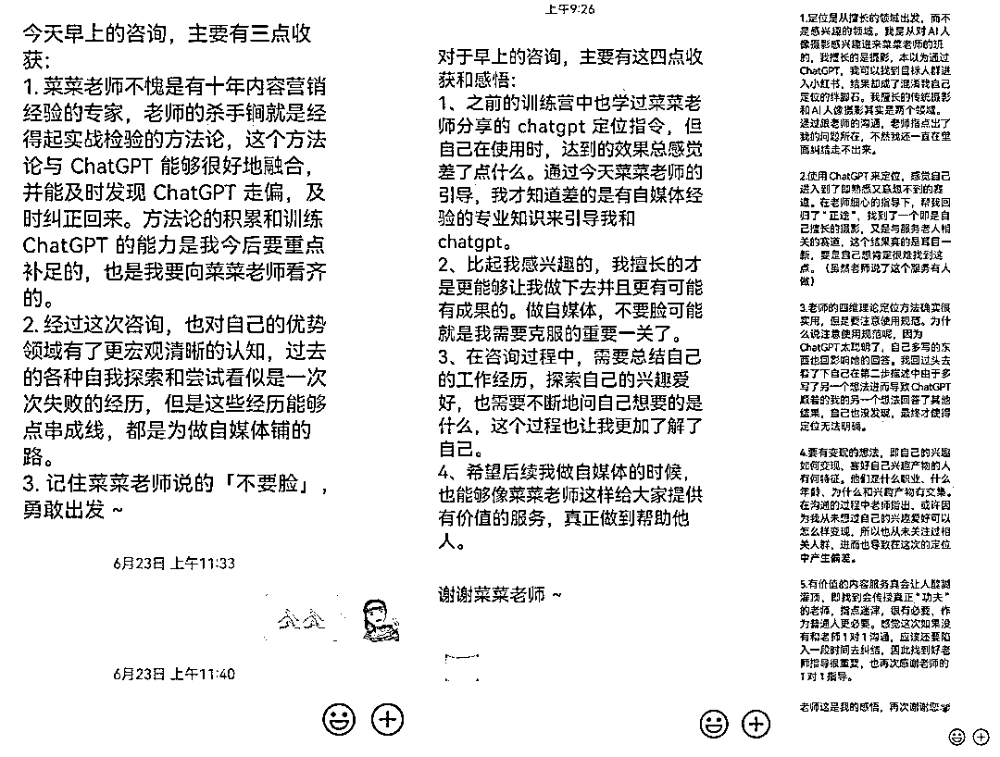

周末，再次接到一个学员的咨询需求，这次，我通过命令的升级，加上了“记忆锚点”的部分，让这名学员的小红书账号定位有了更为出彩的地方。

首先，我来解释下，什么叫记忆锚点：

你和其它竞品相比与众不同、让用户一下就记住你的点。比如。大家都是做保险知识的，如果有一个博主是边刷碗边说保险知识，那么这个刷碗就是他的记忆锚点。

有了记忆锚点，能让你在众多账号中脱颖而出，更受用户的青睐。就像在一片红色的气球中，夹杂着一个黑色的气球，那么这个黑色的气球就会被凸显出来。

再来说说小红书的账号定位，很多人一上来就看哪些热门，就去模仿。比如上周五的时候，一个31岁的男生找到我，给我看了下他的账号：

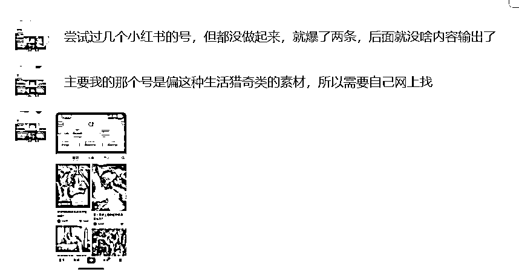

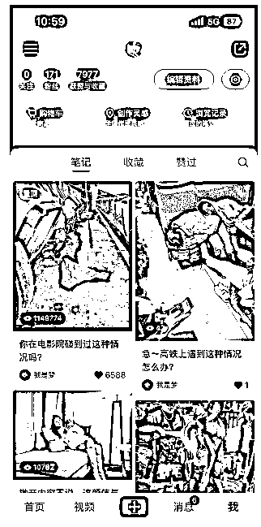

他这里有2个误区：

第一，什么火做什么，却并没有和自己擅长做什么结合起来；

第二，纯做流量是没有意义的，我们做小红书是奔着变现去的，高赞但不变现的小红书账号都是耍流氓。

宁愿要10个精准的粉丝，都不要10000个泛粉。我自己帮公司做的账号，100多个粉丝的时候，就已经变现几千元了。

所以小红书的账号定位有4个关键点：

1）你擅长/爱好什么领域？

2）这个领域下对应的细分赛道是什么？

3）你的内容面对的是哪个人群？

4）你后续的变现方式是什么？

这个从做第一条内容之前，就应该想清楚，不然你后续会越做越累。

后来，我给这个男生做了1对1咨询，最后人机结合输出的答案，非常惊喜：

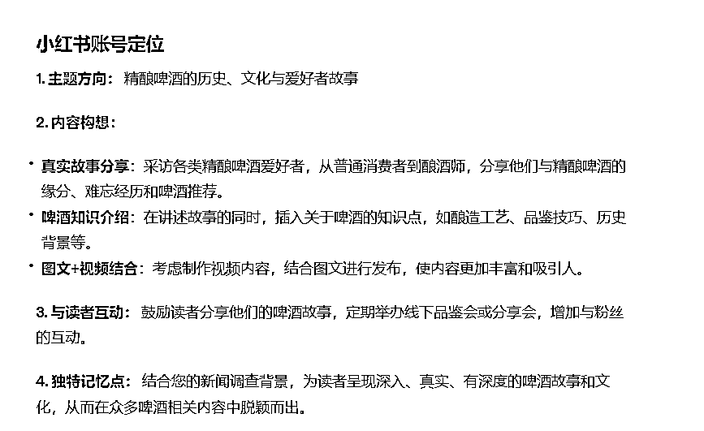

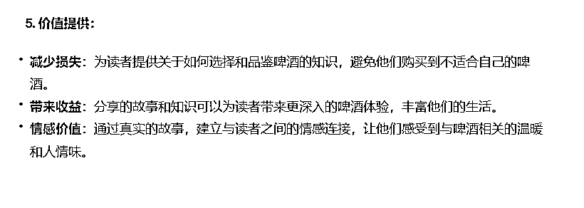

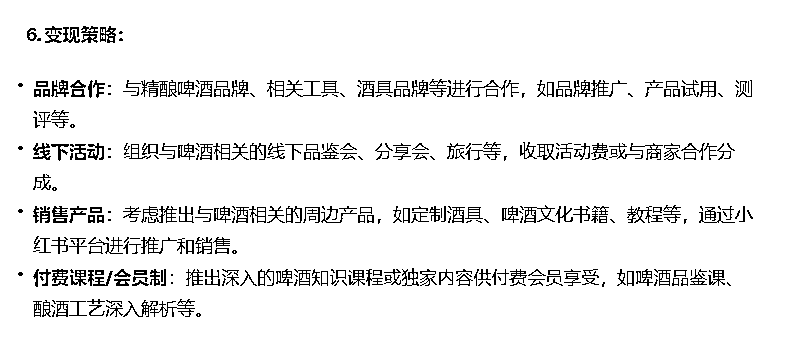

他自己对于这个结果也是很满意，因为帮助他结合了自己的爱好+擅长：

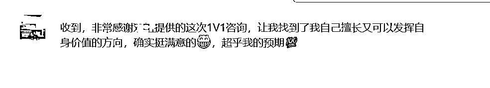

下面，我将完整分享我的训练过程，希望能给初做小红书的同学，带来一些启发。

* * *

# 咨询前的重要动作

1.梳理相关背景：特长和爱好。

这里有2点要注意，一是要有数据来说明，比如这位31岁的男生，做过4年记者，曾经一期新闻节目获得过5000万的播放量；

二是一定要把情况写全写详细，不要有遗漏。比如爱好是运动，那么就要写爱好哪些运动，而做这些运动分别取得过什么成绩。像这个男生，他爱好飞盘，本来他自己说到这就截止了，在我的追问下，他才说出曾经组织过一个3000人的飞盘社群，还变现了8000元，这就丢掉了重要的细节信息。

2.诚实以待

还有一个点需要提醒用户，如果ChatGPT给出的答案不尽如人意，一定要及时指出来，这样ChatGPT才能越来越了解你，给到你满意的答案。

# 完整命令展示

我是一个31岁的男生，我的工作经历如下：

1、第一份工作是在电视台，做记者工作，有4年时间，有从业资格证，做的是社会调查、民生类新闻节目，工作内容是做暗访、采访当事人、写新闻稿件，有一期新闻节目，全网播放量破5000万；

2.第二份工作是在医院，做文案策划，做了3年多，要撰写医院的新闻稿、科室的活动策划、有一次策划了直播带货卖医美产品的活动，我也作为了出镜主播，当次活动卖了50多万；还有一次做乳腺科的直播，当场直播有200万人次；

3、现在在一家建筑互联网类的企业，做企业宣传，已经做了半年的时间，平时工作任务，一是撰写公司重大新闻事件、领导的发言稿、策划活动、二是作为统筹者，组织子公司的的通讯员供稿、进行日常的宣传管理。

我的兴趣爱好、特长，如下：

1、喜欢户外运动，网球、篮球、飞盘、徒步、骑行，以前通过5个月 的运动，成功减掉7斤肉。自己和朋友组建过一个飞盘俱乐部，我在这其中是负责引流和教学的，3个月吸纳了3000玩家，5个月变现8000元；

2、擅长与人沟通、共情能力强，朋友情感受挫，我可以与他们共情，并安慰他们，有一个朋友追了女生1年多，本来想放弃的，后面我和他聊，让他坚持，用别的方式追求，后面就追到了，然后已经结婚了。

3、喜欢喝精酿啤酒，对于精酿啤酒比较了解，知道酿酒的整个过程、也知道精酿啤酒的发展历史、种类、区别，通过自己的介绍，让朋友也喜欢上精酿啤酒。

接下来，请你作为一位小红书的账号定位专家，通过与我对话的方式，为我找到我的小红书账号定位。在正式开始前，我会先告诉你小红书定位的四维理论：

第一步，请根据我给你提供的我的背景资料，引导我先找到自己爱好且擅长、行动成本小的技能；

第二步，在这个技能对应的领域下面，找一个更为细分、竞争较小、但又有市场需求的领域；

第三步，为我定位精准的人群，而这些人群是有高需求的；

第四步，告诉我能给他们提供什么价值，价值从3个方面去思考，第一个是如何减少他们哪方面的损失，第二个是能为他们带来什么收益，第三个能为他们提供什么样的情绪价值

第五步，告诉我，可以如何变现。任务规则：一次只执行一个步骤，逐步执行。

你现在明白了吗？只需要告诉我是否明白，我将开始接下来的指令。

注意，这里划线的地方，都是可以替换成你自己内容的。

# 对话过程展示

1.先找到一个爱好且擅长，行动成本小的领域

先来看看ChatGPT的输出

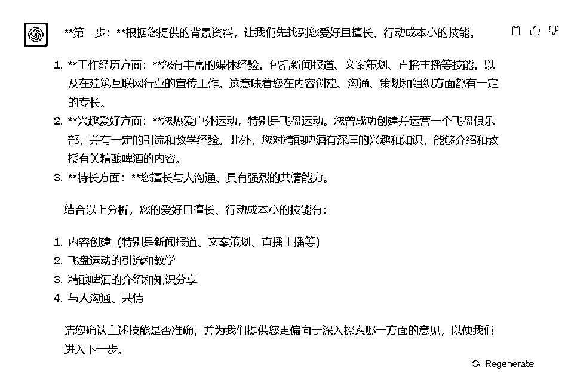

发现好像它没有明白定位的逻辑和用户的场景，用户其实是现在不知道该选择哪一个技能或者爱好作为定位方向，只需要在其中选择一个就可以，但是ChatGPT以为是可以选择多个。所以这时候我们要做调试：

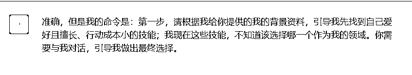

经过校准后，ChatGPT果然明白了我的意思：

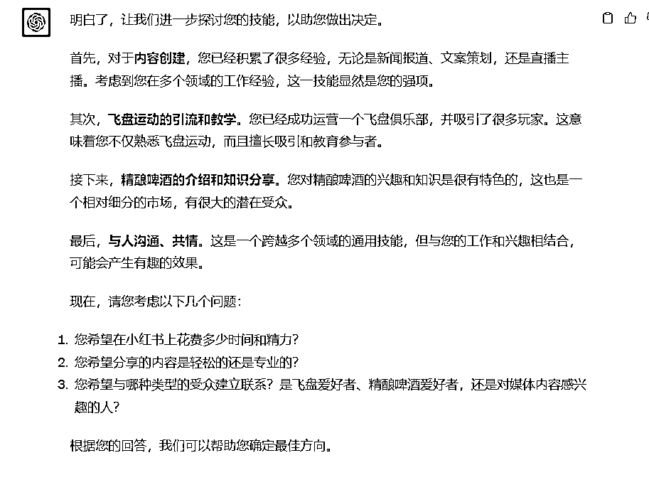

接下来询问用户答案，把答案输入进去。这里的第三个问题，用户做出了选择“精酿啤酒”后，你一定要问用户，为什么选择这个赛道，然后把相关的信息也补充进去，这样能让ChatGPT更了解用户，以便后续做出更准确的判断。

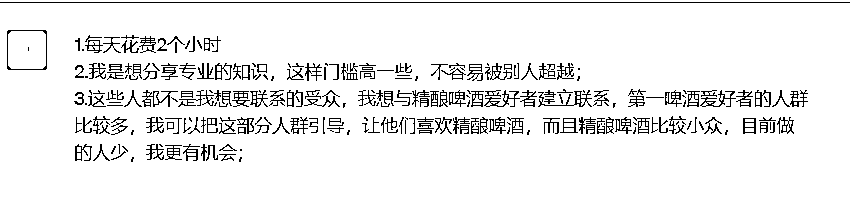

2.找到领域下的细分赛道

接下来，看看ChatGPT选择的细分赛道：

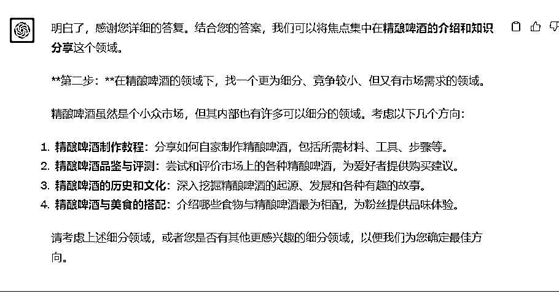

然后询问用户，准备选择哪个赛道，用户觉得2和3比较合适。

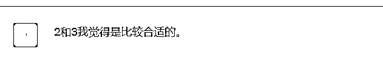

那么这里，我们作为咨询顾问，要注意了，首先，这个细分赛道只能选择一个，前期做账号的时候，先窄后宽，赛道越细分越好。

第二，询问一下用户，目前他的选择，是否行动成本足够小，能够实现？不过，如果你用的是4.0，它会非常智能，直接给你输出每一个方向的优势和挑战，让用户能自行判断。

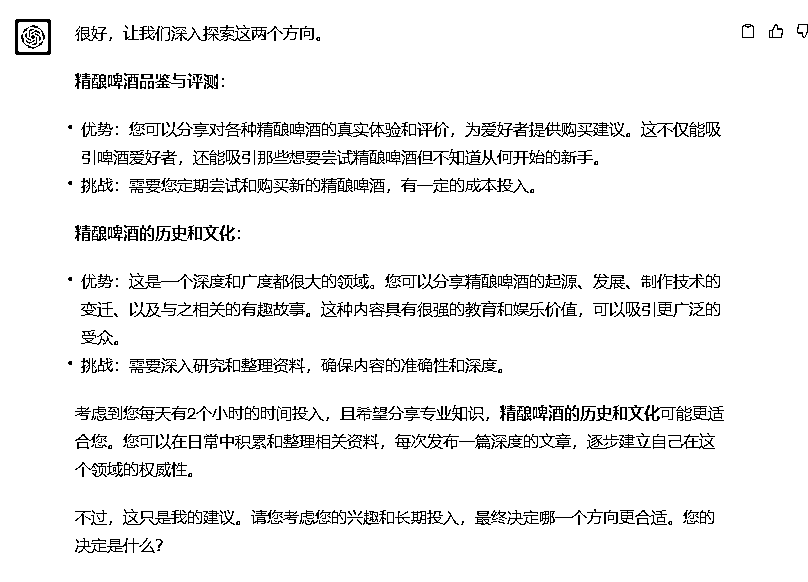

就这样，第二个步骤完成了。

3.找到精准人群

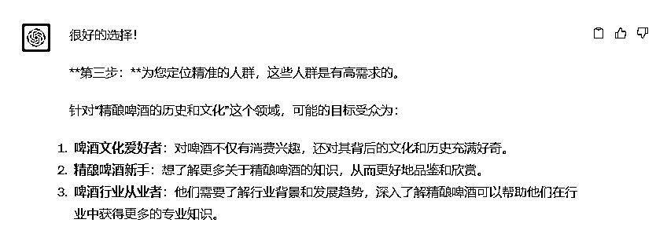

一般来说，精准人群也最好是一类人群，如果是特别小众的赛道，像精酿啤酒，那么多种人群也是可以的。

4.提供价值、变现方式

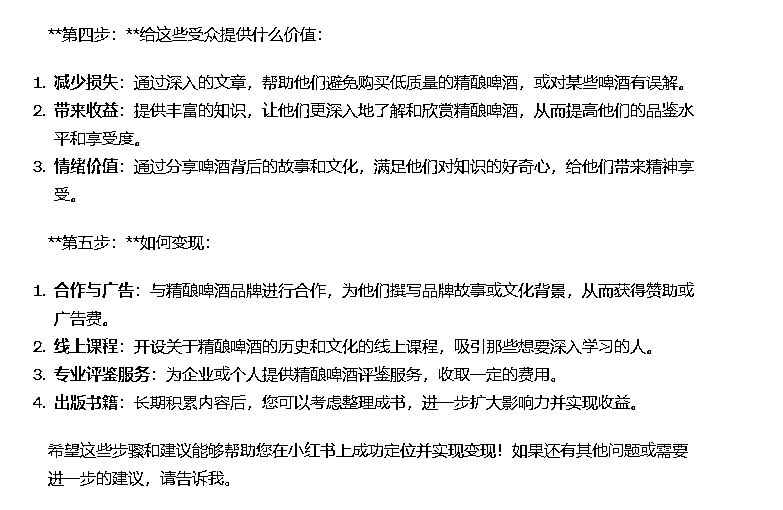

如果发现ChatGPT给出的答案并不是你想要的，那么你可以告诉它，让它给你更多参考答案。当然，如果你在前面给出的背景信息越详细，你后面要调试的地方就会大大减少，基本可以一步出精准答案。

5.找到记忆锚点

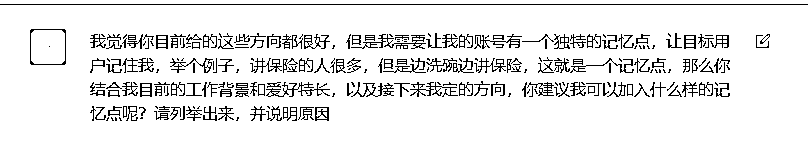

这里的细节是，一定要把记忆锚点的概念和举例提供给ChatGPT，这样能帮助它更好地理解，引导你走下一步。

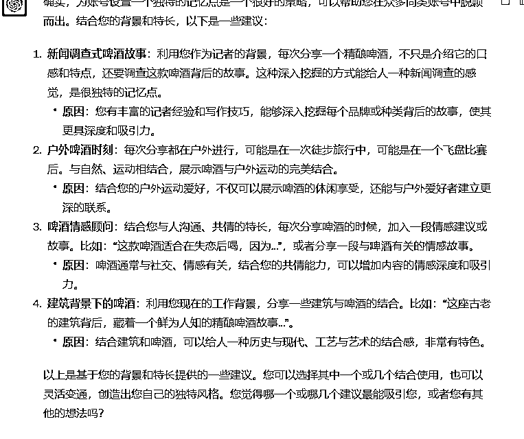

用户看到这些答案可能会有点懵，你得引导他说出自己的想法，是否符合预期，如果不符合，是哪里不符合，一定要说出来。在我的引导下，用户说出了自己的担忧：

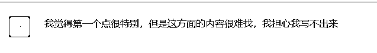

于是，根据用户的想法，ChatGPT进一步给出了答案，而答案中的第4点，戳中了用户，因为他一直希望能继续发挥他的特长——采访。

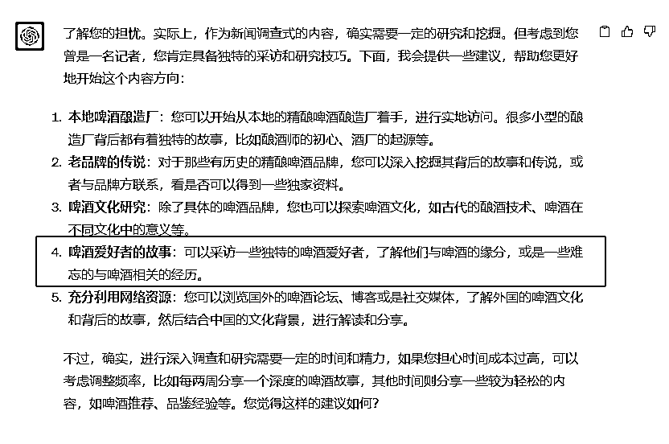

于是我把用户的反馈也告诉了ChatGPT，它给了我更具体的建议：

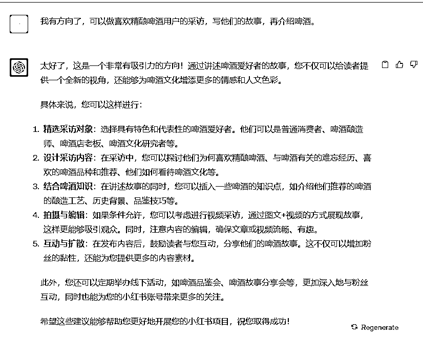

最后，用户对于这个结果，打出了95分的高分，于是我及时表达了正反馈，并且让ChatGPT给我输出整个定位内容。

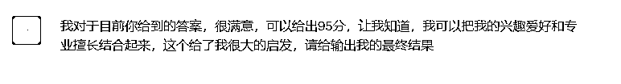

小红书账号定位与变现策略

1\. 主题方向：精酿啤酒的历史、文化与爱好者故事

2\. 内容构想：真实故事分享：采访各类精酿啤酒爱好者，从普通消费者到酿酒师，分享他们与精酿啤酒的缘分、难忘经历和啤酒推荐。

啤酒知识介绍：在讲述故事的同时，插入关于啤酒的知识点，如酿造工艺、品鉴技巧、历史背景等。

图文+视频结合：考虑制作视频内容，结合图文进行发布，使内容更加丰富和吸引人。

3\. 与读者互动：鼓励读者分享他们的啤酒故事，定期举办线下品鉴会或分享会，增加与粉丝的互动。

4\. 独特记忆点：结合您的新闻调查背景，为读者呈现深入、真实、有深度的啤酒故事和文化，从而在众多啤酒相关内容中脱颖而出。

5\. 价值提供：减少损失：为读者提供关于如何选择和品鉴啤酒的知识，避免他们购买到不适合自己的啤酒。

带来收益：分享的故事和知识可以为读者带来更深入的啤酒体验，丰富他们的生活。

情感价值：通过真实的故事，建立与读者之间的情感连接，让他们感受到与啤酒相关的温暖和人情味。

6\. 变现策略：品牌合作：与精酿啤酒品牌、相关工具、酒具品牌等进行合作，如品牌推广、产品试用、测评等。

线下活动：组织与啤酒相关的线下品鉴会、分享会、旅行等，收取活动费或与商家合作分成。

销售产品：考虑推出与啤酒相关的周边产品，如定制酒具、啤酒文化书籍、教程等，通过小红书平台进行推广和销售。

付费课程/会员制：推出深入的啤酒知识课程或独家内容供付费会员享受，如啤酒品鉴课、酿酒工艺深入解析等。

到这里其实还没有完结，还有最后一个动作，需要去小红书搜索一下相关关键词，看看同行的竞争情况怎么样：

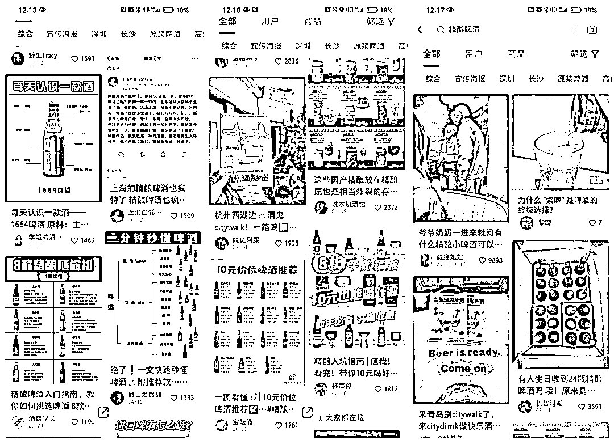

可以看到，大部分的内容阅读量还是挺高的，而且点进这些博主的主页，发现其粉丝量远远小于这篇笔记的点赞量，这就叫“低粉爆款”，这就说明内容是值得做的。

再看看内容的方向，大部分笔记都是在测评酒，而我们准备做酒背后的故事，这是一个与众不同的角度，能唤起不一样的情愫。

所以综合来说，给用户做的这个定位，是非常适合他自己，又有市场需求、好变现的。

以上就是如何用ChatGPT做小红书定位的全过程，如果你还想进一步了解小红书如何做定位，或者如何用ChatGPT从0开始做小红书，可以和我交流。

* * *

### 菜菜的自我介绍

12年互联网内容营销经验，人人都是产品经理专栏作家、三节课特邀讲师。

过往经历：

1/长沙市电视台编导，记者，从业4年

2/新浪微博湖南区第一批官方运营人员，运营的美食微博一年半增长60万粉丝

3/带领新媒体团队打造营养健康ip维他狗营养家，被人民日报公众号，科普中国等账号转载，获得人民卫生出版社举办的科普辟谣大赛二等奖。

4/在三甲医院帮助100多名医生打造医生ip。

5/tob公司内容中心负责人，出产创业者专栏，采访全国40+头部教育机构创业者

6/2023年入局ChatGPT内容创作教学，已链接3000+学员，7月受邀成为三节课的ChatGPT内容训练讲师