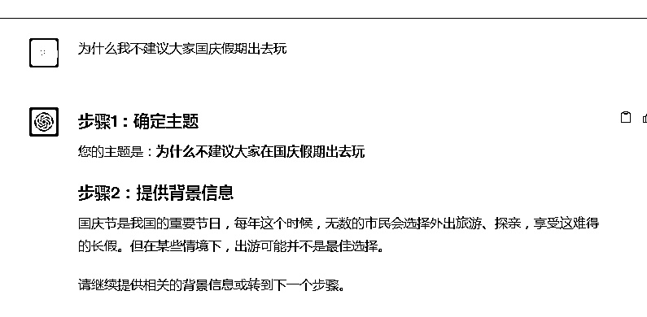
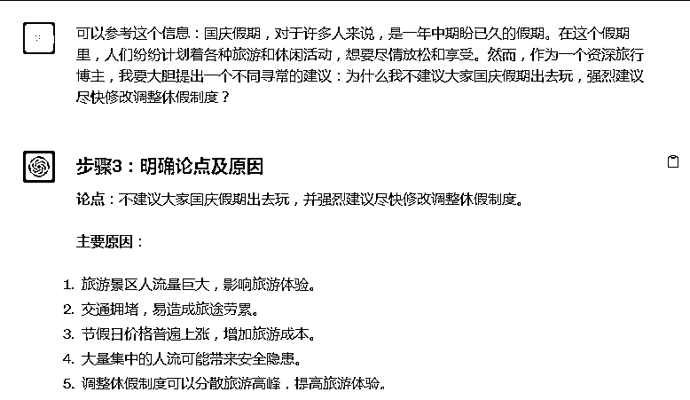
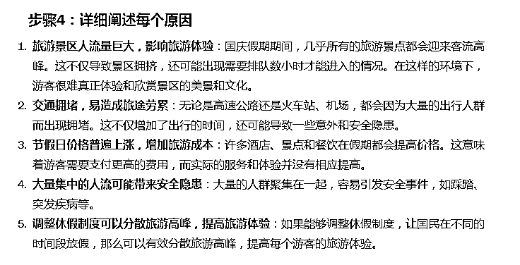
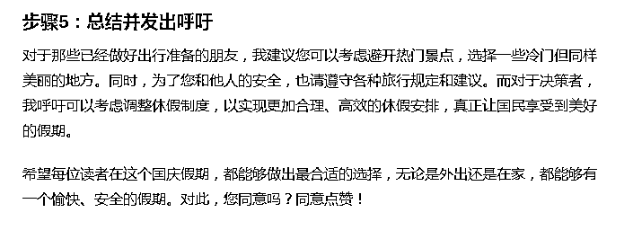
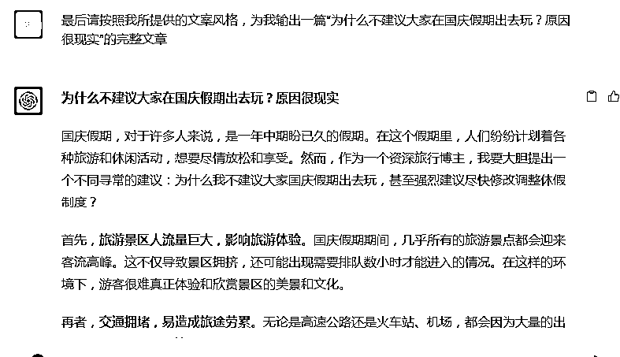
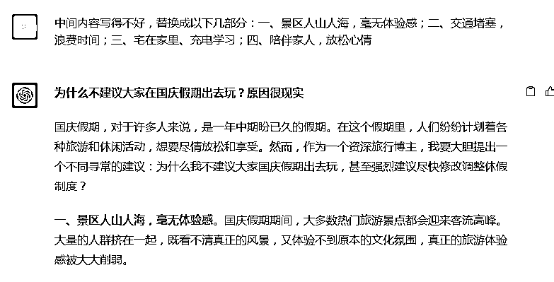

# 如何利用GPT写出10w+爆文

> 来源：[https://szxb4qbve7.feishu.cn/docx/M1Y0dQxznoLNEoxki13czVEWn3d](https://szxb4qbve7.feishu.cn/docx/M1Y0dQxznoLNEoxki13czVEWn3d)

# 1 关于我自己

我是一名90后创业者，多次在生财分享过自己创业经历，简单介绍一下自己：曾经创建过国内最大的90后社区论坛，当时拥有50万成员；毕业后在报社工作，后来拿着一笔风投资金开始创业，从自媒体、直播再到拼多多都有所涉猎，部分项目拿到过小结果。2023年全力躬耕于GPT领域，在四月份时候做了一个GPT课程，在视频号平台卖了1w份左右。

9月份参加微信公众号，航海活动，不到一个月时间变现9000多。

# 2 浅谈一下如何写爆文

目前在将近20天时间里吗，我已经写出了10w+的文章有7篇

如何写爆文主要分3步

## 一 看

9月份微信公众号升级以来，最大的变化就是增加了推荐功能，我们新手的文章也可以“入池”了。微信公众号越来越“头条”化。

那怎么让自己的文章入池呢？这里其实有一个很关键的点：那就是优质的老号，由于本身权重比较高所以更容易入池。

那么怎么让新号挤进推荐池呢？

我们要明白公众号爆文写作的兴起，源于微信平台的三个变化：“看一看”、“问一问”、“视频号”。尤其是“看一看”，这是非常庞大的一个流量池，“看一看”打开以后有3栏，分别是：在看、视频、热点。

“在看”：在看表示是我们的微信好友的喜好与热爱，是对我们相同内容的认可与赞同。

“热点”：紧跟时事热点抓取用户高频的使用习惯，并且一键转发到群聊或者是朋友圈，不用再去打开其他的APP进行截图或跳转。

“视频”：最大程度上帮助企业实现短视频与用户之间的连接。可以展示我的喜好或者关注，最大程度上为我们的私域用户进行二次的转化和开发。

所以，我平时找素材都在微信平台找，很少再去看其他的平台，一来节约时间，二来是更好的熟悉微信平台。

那么，提到看一看这个庞大的流量池，我们要如何才能确保自己的文章进入“看一看”推荐池呢？

1、原创文章：我们尽量使用GPT进行原创写作，我会在第三部分为大家分享独家写作提示词

2、避免违规：我们可以使用一些文章检测工具，比如：易撰，保证文章不要出现违禁词。

3、不要断更：在创作前期，我们要保持较高的更新频率，建议日更或者两日一更，这样可以提高曝光率，让平台发现你。

总之，看见爆款，模仿爆款才能创作出爆款。所以，建议在写一个选题之前，至少要看10篇类似的文章。

## 二 抄

1 抄标题：我们看完大量10w+的爆文以后，会发现他们的内容都很一般，那他们赢在哪里了呢？

其实就赢在了标题上。

我总结了几种常见的标题公式直接拿去

1.提出疑问: 人物+为什么+具体事件；人物+经历+凭什么

《千聊，荔枝有那么多的育儿课，凭什么李老师的课卖的最爆？》

《14岁辍学，29岁身价过亿，这个90后女孩凭什么》

2.引发用户的好奇，制造悬念（说到一半）：如何/为什么+事实+反转

《如何用10秒钟，把堵塞的鼻子变通畅？用它喷一喷，舒服一整天！》

《为什么孩子越大越不愿意和你交流？99%的家长都不知道》

3 利用数字与数据：数字+事实+奖励

《我这里有200页重磅PPT，20个压箱底文案小技巧等你来领取》

4 利用热点：热点话题引入标题中

《杭州亚运会开幕，但你还记得33年前在北京唱亚洲雄风的刘欢如今苍老成这样？》

5 作比较：形成反差和对比

《真正聪明的人，往往很少交朋友》

《35岁月薪3500，你拿什么安身立命》

《为什么方便面就有大品牌，挂面却没有》

《总是踩点进入办公司的人，一年后和提前5分钟进入办公司的人差在哪》

6 .权威稀缺:提供独家的信息

《张小龙首次公开演讲，官方无删减版。》

《离职前，我把运营黄埔军校阿狸的干货都供了出来。》

总之一个吸引人点击标题一定是看上去特别low，特别口语化的，在撰写标题时候不需要你有文采，只需让自己变成一个“大妈”或者“大爷”。

2 抄内容：天下文章一大抄，就看谁会抄

1、“抄”适合自己文风的

明确自己要写的选题，找到相关的素材进行摘抄，抄的时候想想怎么运用到自己的文章中。

比如：今天我要用到马云的简介，那我就找关于马云的文章，看别人是怎么介绍他的，找到适合自己文风的句子，摘抄下来。

2、“抄”反复出现的

什么是反复出现的呢？

比如：我今天的选题的关于写中国新生儿出生率的，那么这就需要数据支撑，而这些数据都是权威机构发出的，咋也不能胡编乱造，所以这个就可以抄下来。

再比如，有些名著的经典开头、结尾和经典名句，那都是永不过时的，谁都可以写，等到恰到好处的应用，会给自己的文章增彩。

类似的例子还有很多，比如大家都在写的句子，不过是将“把”字句改为“被”字句而已，这个我称之为“高级的模仿”，我也经常在用，并且效果还不错。

3、“抄”最新鲜的素材

“老掉牙”的素材就别再写了，我们要与时俱进，在平时的阅读过程中，发现新颖的素材就积累下来。多看今日头条，微博热搜，爆文的秘密都在那里。

4、分类“抄”

我们每天要浏览很多的内容，分类就显得很重要。

假如你今天看了创业类、房产类、社会政策类等等，不做好分类抄了也是白抄，反而会增加工作量。

所以，建议在开始“抄”这个动作之前，先做好分类工作。

## 三 写

1 让GPT仿写爆文

我们可以在今日头条找到一篇爆文，直接让GPT进行仿写，但这么做有可能被判定为洗稿，有一定风险。

提示词如下：

你现在是一名文案专家，擅长写公众号文章，并懂得文章传播逻辑及特点，并且可以模仿文章进行二次创作。下面我会给你一篇文章，请你不改变文章原来内容的情况下，通过修改段落中的个别词句来重新生成一篇文章，语言流畅；另外如果我还有对文章其他修改要求我会在文章末尾以（）里内容表述。如果清楚我的要求，请回答清楚，请开始下一步。

然后你就将文章和修改要求发给他，他就会分分钟给你写一个新文章

2 让GPT创造爆文

大家可以关注一下：彪悍猫先生

这个公众号的文章几乎每篇都是10w+，通过阅读你会发现他的文章是用GPT写的。

第一步：我采集了他的所有文章让GPT进行分析，结果如下

1 写作思路：

*   时事背景：文章通常从某种时事或普遍现象出发，引入问题或者话题。

*   分析现象：详细探讨该现象的起因、影响及其他相关的细节。

*   提出疑问：在文中引入疑问，使读者对话题产生兴趣。

*   行业或专家看法：为了增加文章的可信度，通常会引用行业或专家的看法。

*   建议或解决方案：根据现象或问题，提供可能的建议或解决方案。

### 2 写作结构：

*   标题：通常为吸引人的、与内容直接相关的问题或声明。

*   引入：提供背景信息，为读者铺垫文章的核心内容。

*   主题：按照不同的小标题进行划分，每部分探讨一个具体的子话题。

*   结尾：总结文章的主要观点，提出作者的看法或建议，并常常以与读者互动的方式结束。

### 3 写作手法：

*   数据引证：为了增加观点的权威性，文章中经常引用相关的数据或统计。

*   故事叙述：为了增加文章的可读性，有时会使用小故事或案例来说明某一观点。

*   互动语言：文章中经常使用与读者对话的方式，如“你同意吗？”来增强与读者的互动。

*   结构清晰：使用数字、小标题等方式来组织文章，确保读者能够轻松跟随作者的思路。

### 4 方法论总结：

1.  选定话题：选择一个与时事或普遍现象相关的话题。

1.  进行研究：对选定的话题进行深入研究，收集相关的数据、例子和行业看法。

1.  组织结构：确保文章有清晰的引入、主体和结尾。

1.  引入问题：在文章中加入与读者相关的问题，使其更有参与感。

1.  使用数据和案例：为文章增加权威性和可读性。

1.  结束互动：在结尾部分与读者互动，增强他们的参与感。

第二步：我要求GPT帮我根据以上方法论，为我拆解一下完成爆款文章具体步骤

### 步骤1：确定主题

告诉我您希望探讨的中心问题或现象。

### 步骤2：提供背景信息

描述这个话题的背景和为什么现在讨论它很重要。

### 步骤3：提供相关数据或统计

如果有，给出一些数据或统计信息，这可以增加文章的权威性。如果没有，我可以尝试使用一些泛泛的描述。

### 步骤4：分享案例或故事

您希望在文章中引用的具体例子或故事。如果没有具体的例子，您可以描述一个大致的场景，我会尝试为您构建一个。

### 步骤5：行业或专家看法

分享您希望引用的行业或专家的观点。如果没有，我可以模拟一个“专家”的观点。

### 步骤6：提供您的观点或建议

告诉我您希望在文章中提供的建议或结论。

每完成一个步骤，您可以告诉我，然后我会基于您提供的信息继续创作。我们一起完成上述步骤后，我将为您整合所有信息，形成一篇完整的文章。现在，请从步骤1开始。

以下是我具体创作的一个实例，大家有效期可以看看

GPT不会一次性给我输出一个完美的文章，要经过很多轮的调教，逐个内容细节的优化，最终可以为我生成一篇原创文章。

我在这举这个例子，只是抛砖引玉。大家完全可以找到一个对标账号，然后把所有文章一次性都喂给GPT，让他帮我们分析文章相同点，结构，这样更便捷我们模仿再创作。

当然GPT写的可能没有感情，这需要我们进行人工润色。