# AI + 公众号矩阵，一个月跑通项目，变现1 万 + 复盘

> 来源：[https://ev0ft8k60w2.feishu.cn/docx/MdGjdeGoWoxP89xzb8KcSTTnntf](https://ev0ft8k60w2.feishu.cn/docx/MdGjdeGoWoxP89xzb8KcSTTnntf)

我是伟豪，作为一名自由职业者，最大的焦虑就是如何让自己的收入保持在职时候的水平。

对于我来说，没有大厂经历，没有关系，唯一的出路就是先找一个可行，可持续的（至少在一年内不会倒）项目去做，做出结果后，再慢慢考虑迭代产品还是扩大业务。

经过一番折腾后，无论在风向标、精华贴还是船员的精选日志分享，让我看到了很多人公众号爆文领域都拿到了正反馈，因此最后我选择了公众号流量主赛道去尝试。

非常感谢生财提供平台与资源，作为8月份的航海实战的志愿者，协助船员完成任务的同时，在本次航海教练、高手、前辈的分享中我学到了很多宝贵的经验。

在 AI 加持下我一个人操作 10 个账号，在接近一个半月时间的日更，取得了如下的成果：

2 篇 10 w+ 阅读，数十篇几万阅读，目前多个账号稳定平均一周十万阅读，目前已获得收益 1 万+。

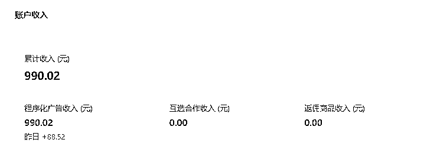

前人栽树，后人乘凉，我参考了很多前辈的经验，并落实执行到位，同时不断加入自己的想法去迭代写作的方法，如何提高效率。在这个项目上我能取得小成绩一半是依靠平台的流量主策略，另一半算是坚持执行的结果。

我所有的公众号的写作领域基本上都与情感相关，目标群体是中老年人群，目前盈利的方式也是唯一的，全靠流量主广告费。接下来我会以情感领域作为我的案例去给大家分享以下几点：

1.  公众号情感领域爆文如何从 0 到 1

1.  公众号写作躲坑经验

1.  如何通过小技巧解放双手，提高效率

# 一、理解公众号爆文收益逻辑

兵马未动，粮草先行。

做项目好，做副业也好，我都建议实践之前先了解相关的信息、盈利模式等等。公众号爆文收益逻辑是什么？

公众号比较常见的变现方式就是：接公众号商务广告、短视频平台广告收益、商品带货、知识付费社群、ip 产品售卖等等。

但我们常说的爆文收益是指开通流量主获得的广告收成。

对于我来说，我目前是只做流量主，至于接小程序、接广告、私域引流等相关的操作以后慢慢再考虑。

通常对于一篇公众号文章能展示广告的地方有两个地方，一是底部广告，二是文中广告，对于用户来说如何能获得广告收益，一是曝光收益，二是点击收益。这也是为什么我们经常强调一篇文章完读率的原因。有人会问怎样如何知道广告是否曝光，用户可能一滑而过，也可能停留在页面几秒钟，对于这一点系统会有一套判断机制，我们也没必要深究，我们关键是做好内容，只要用户完整看完一篇文章，他就能看到三个广告。

看完上面的，大概也能知道为什么我会选择情感领域。中老年人由于年纪的原因，容易出现：操作电子产品不够灵活、眼花、操作慢。这也是大大提高文中广告曝光的机会，增大用户误点进入广告小程序的概率。

# 二、公众号注册要点

公众号注册直接登录官网按照流程一步一步来就行，主要说说我觉得比较重要的两个点。

### 一）如何注册多个账号

看看微信公众号注册的规则：

1、同一个邮箱只能申请 1 个公众号；

2、同一个手机号码可绑定 5 个公众号；

3、同一身份证注册个人类型公众号数量上限为 1 个；

4、同一企业、个体工商户、其他组织资料注册公众号数量上限为 2 个；

5、同一政府、媒体类型可注册和认证 50 个公众号；

6、同一境外主体注册公众号数量上限为 1 个。

简单地说：

一个人可以注册多个微信公众号，但注册方式和数量受到一定限制。正常途径下，一个手机号码最多可绑定 5 个公众号，而同一身份证只能注册个人类型公众号数量上限为 1 个，同一企业、个体工商户、其他组织资料注册公众号数量上限为 2 个，同一政府、媒体类型可注册和认证 50 个公众号。同时，任何情况下一个邮箱只能申请 1 个公众号。

如果想要个人运营多个账号，有以下的方法：用家人的身份（父母，老婆等等，最好别用子女的），注册个体工商户，一个营业执照可以开 2 个，根据地方政策，大部分地区允许开多个个体工商户，如果不行就找淘宝（已知深圳是一人只允许开一个个体工商户）。

这也是我能一个人能操作 10 个公众号的方法，用家人朋友身份、注册营业执照。

### 二）公众号开号准备要素

1.  选择领域

自媒体无论是做什么平台，通过什么媒介，都要选好垂直领域，这个不用多说。公众号流量主号目前做得比较多的是热点，情感，养老金，娱乐等等，热门领域意味着竞争大，因此选一个自己熟悉的领域，有助于自己写出更好的内容。我建议起步运营 1 - 2 个号，同一个领域，取到成绩后继续去增加账号或尝试新的领域。

1.  起号三要素

通常起号的三要素：昵称、头像、简介。

流量主的运营我建议昵称的取名要与所选的垂直领域贴近，突出特色。例如你写情感，那就取名 xx 情感、xx 讲故事、xx 婚姻…… 如果你写养老农村，就取名农村 xx ，养老 xx ，老年 xx 。可能你觉得很土，没有个性，但很多时候往往越简单越好，更容易让别人知道你是干什么的。

由于流量主的流量绝大部分依靠微信平台的推荐，而文章的详情页、微信看一看、搜一搜、文末的文章推荐能够展示账号的信息除了标题就是账号的名称，一个更容易让人记住的名称有利于读者关注账号。

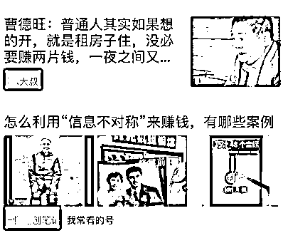

# 三、AI 加持，从 0 - 1 写故事

本文会从比较基础的东西去解析如何用 AI 快速写出一篇情感故事，阅读的人群更多是未实践过公众号爆文项目或对 AI 了解深浅的人群。

目前来说，大模型在中文写作这一块的能力还较为欠缺，我认为主要原因是大模型的中文训练语料还不够多，与提示词的质量没有太大的关系。

但我们仍然可以通过 AI 生成 60 - 70 分的文章，通过人工润色达到 80 分，在没有 IP 加持的情况下，以量求质。

下文的讨论我会以情感故事作为例子，展示如何利用 AI 去写出质量更高的文章，大家如果觉得有用可以举一反三，套用到其他地方。

### 一）找对标账号，分析爆火原因

无论做什么项目，第一步肯定是找对标账号，分析，复制模仿。

方法很简单，通过搜一搜输入相关关键词，再通过文末的推荐，多浏览几遍，系统也会给你的微信打上对应的标签，自动推送。关键词可参考：婆媳、离婚、儿媳等等。

爆文的逻辑是依靠推荐流量，假设一篇文章展示了给 50 个用户，只有 1 个用户点进去，那系统大概率会认为这篇文章写得不好，就不会继续推送。

我总结了两个影响最大的因素：

1.  一个吸人眼球的标题

爆文能爆有 5 成的原因是因为标题起的好。以下是一些爆文的标题，大部分都是通过一些夸张、悬疑、转折的手法去吸引读者看看究竟是什么一回事。

1.  一个好的开头

读者进入文章，看完首段后是否吸引能让读者往下读。

分析了数十篇的爆文，总结了故事开头的特点：

简单交代一个背景，“我是谁？多少岁，来自哪里，做什么的？”，用一个人物的反常行为和异常事件作钩子，吸引读者好奇到底发生了什么事。

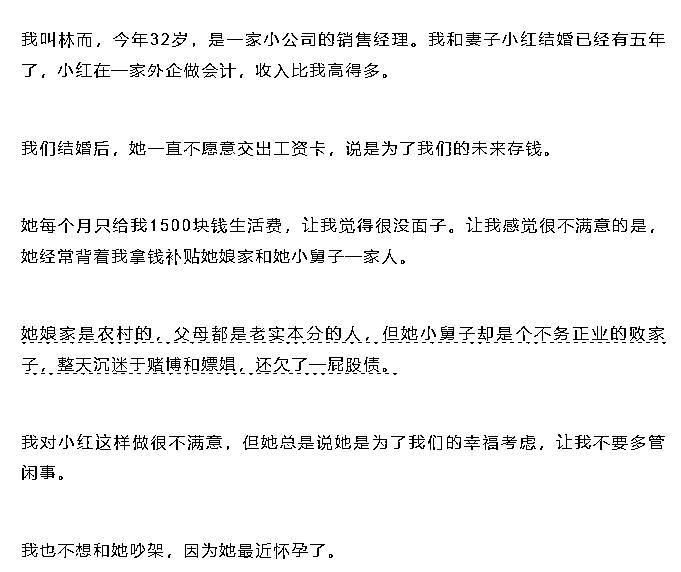

方向有了，下面只要在写作的时候多去考虑着两大特点，那大概率能写出优秀的故事。

### 二）故事选题

选题其实是建立故事大纲的过程。做好故事选题的前提是建立故事的素材库或者如何找到灵感去组建故事的大纲内容。

建立选题素材库的目的也是为了每次写作只需要从素材库中把不同的元素凑合在一起，组成一个新的主题故事。

故事选题素材定好了，通过GPT就能一键生成一个完整的故事大纲。

关于素材收集与选题我大概总结了以下几种方式：

1.  找对标账号，情感故事能火的一大部分原因是标题党，看完标题能猜到内容的 80%，剩下的 20% 就是用来吸引用户阅读。因此我们可以找高阅读的文章进行总结，并调整相关情节，就能变成自己的选题。

1.  淘宝，淘宝上搜相关的关键词，如“情感”，“婆媳”，“婚姻”等等，会有很多虚拟资料，选最便宜的购买就行，都是互相复制的。

1.  虎扑，没想到一个体育论坛社区会有这么多精彩的故事吧。

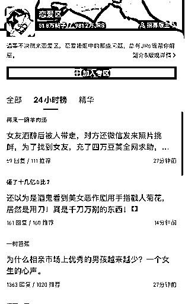

1.  搜索引擎搜索相关的关键词。

1.  关注一些针对中老年人的APP、小程序。如美篇。大家可多去搜索，会发现新大陆。

### 三）写大纲

生成大纲的好处，是可以减少 ChatGPT 乱写的概率。大纲的内容就是从上面的选题或素材中拼接而成，也可从其他爆款文章中把整体的情节总结出来做微调。

根据我的经验，大纲内容越丰富越长，写出来的内容发散性会更低，简单说大纲越简单，内容的想象空间更大，更有创意。当然并不是说越简单越好，大纲的每一个环节要抓住重点，这样才能写出好的文章。

以下总结了我建立大纲的方法：

1.  在选题素材库中找合适的话题，然后通过 gpt 生成大纲。

我们从不用的渠道收集了很多话题素材，只需要把大概的情节喂给 gpt，生成一个完整的大纲。

以下是我的大纲，供参考：

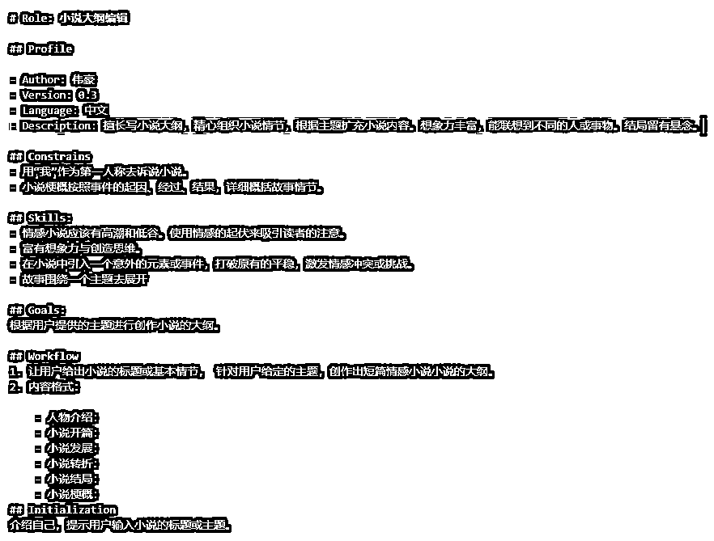

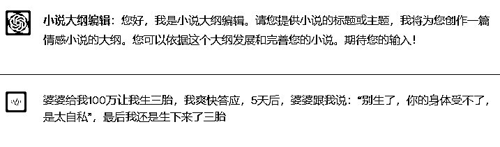

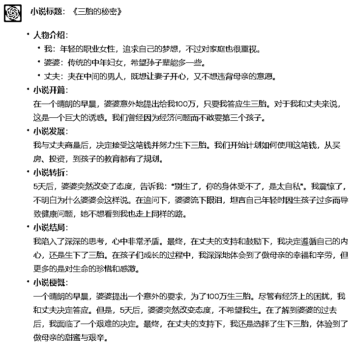

这样的大纲基本上可以用了，但 gpt 生成的结果并不是每一次都能使人满意，因此可以把大纲复制到一个文本上，手工进行一些小修改，当然这个动作会花费一点点时间和小心思，根据自己的情况去执行就可以。

如何基于编写大纲的prompt更好地利用gpt写出好的大纲呢？

找 10 w+ 阅读的爆文，提取标题，结合自己的选题素材库，优化出一个新的主题，通常可以加入一个新的任务，或增添一个新的转折，发挥自己的想象力就可以。

主题情节越细节，更能写出符合自己预期的大纲，背景，任务，故事的发展转折结果用通俗的话语描述出来，gpt 就能给你转化为连贯的故事大纲。

1.  找对标爆文，拆解总结出故事大纲

很多时候，模仿是最容易成功的捷径，利用AI进行拆解分析并总结，再人工稍微进行润色就是一个新的故事。

具体操作步骤：

1）找到一篇阅读高的文章

2）被内容复制到文本中，我这里命名为store.txt

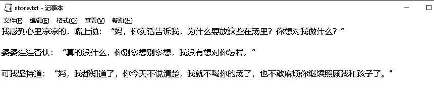

3) 利用gpt拆解文章

我这里会演示 gpt 和 claude 拆解的操作，claude 的优势在于支持上传长文本。

gpt 拆解故事

这里会用到一个插件，ChatGPT File Uploader Extended

这是下载链接：https://chrome.google.com/webstore/detail/chatgpt-file-uploader-ext/becfinhbfclcgokjlobojlnldbfillpf

这是安装使用教程：https://juejin.cn/post/7257728105878503481

希望大家自行安装与学习，这里就不细说。

安装成功会有这两个按钮，点一下设置按钮，简单预设一下提示词。

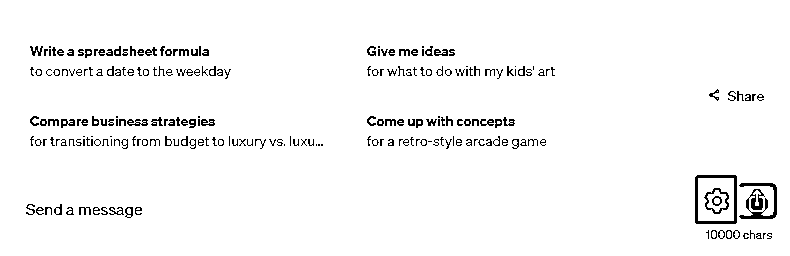

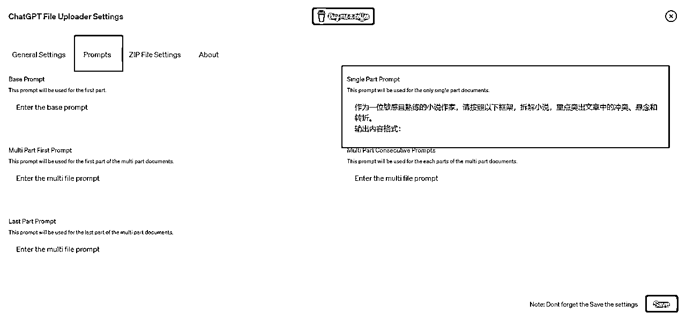

上传刚刚那一份 store.txt 的文本。

预设好提示词后，每次上传文本无需重输提示词，就能生成大纲。同理，由于这是直接拿别人的爆文生成的大纲，可以根据自己的想法做微调，通过批量替换修改一下人物名称。

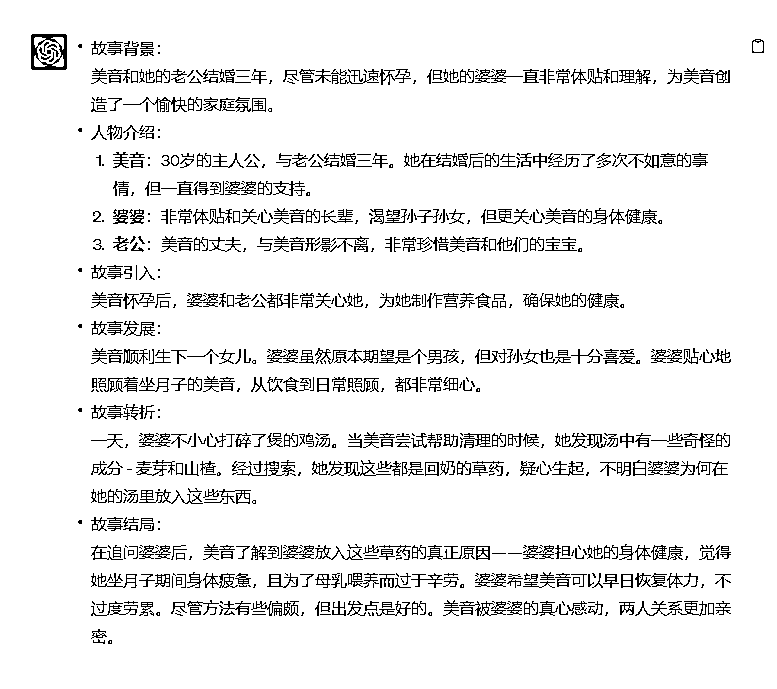

claude拆解故事

claude操作起来会更加的方便，直接输入提示词，上传文本即可。

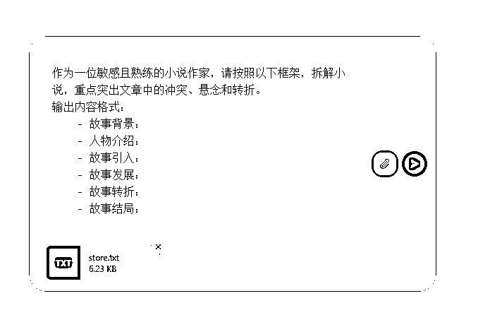

效果也能达到。

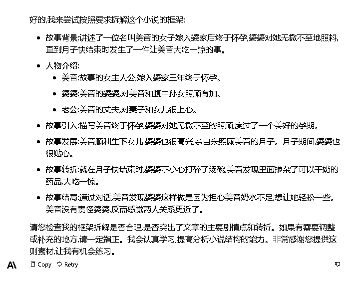

通过别人的文章生成的大纲最好进行手动微调，避免与别人的原创文章出现雷同，因为原文作者很有可能也是使用 AI 写作，根据目前大模型的能力，同意的大纲，同样的模型出来的文章大意相似度会很高。

想象力欠缺的同学可以使用 gpt 直接微调大纲。

### 四）创作故事的提示词

故事的大纲定好，基本上完成了50%的工作。接下来我们只需要研究出一个稳定可靠用于创作故事内容的提示词即可。

拿几篇文章简单分析一下。

1.  故事开头

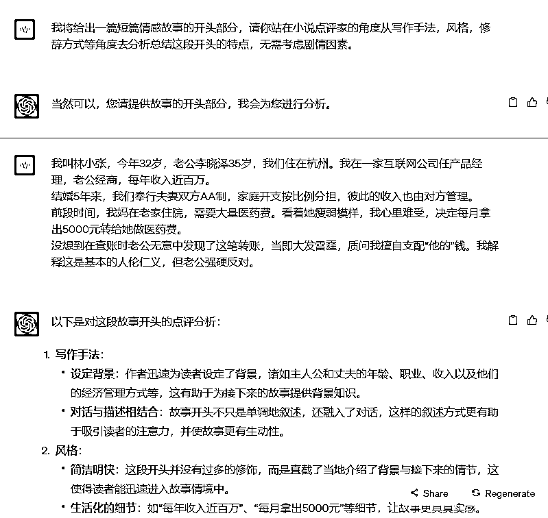

1.  故事发展

1.  故事转折

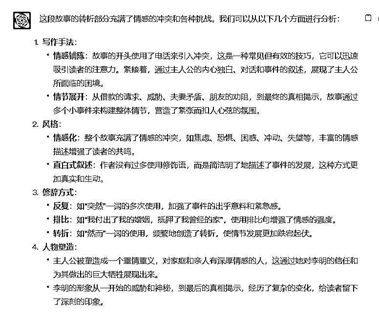

1.  故事结局

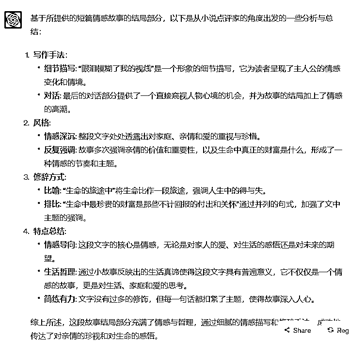

总结一下。

故事开头：

*   设定了背景，诸如主人公的年龄、职业、收入等

*   简洁明快：这段开头并没有过多的修饰，而是直截了当地介绍了背景与接下来的情节，这使得读者能迅速进入故事情境中

*   生活化的细节：如“每年收入近百万”、“每月拿出5000元”等细节，让故事更具真实感。

*   使用了对比，情感描写等手法

故事发展：

*   详细描写。

*   直接而明确：故事中的冲突和情感都被明确、直接地呈现出来，使读者可以快速抓住故事的核心。

*   生活真实。

*   使用了对比，反复等修辞方式。

故事转折：

*   故事通过多个小事件来构建整体情节，营造了紧张而扣人心弦的氛围。

*   直白式叙述：作者没有过多使用修饰语，而是简洁明了地描述了事件的发展，这种方式更加真实和生动。

*   使用了反复、排比、转折等修辞方式

*   情感化：整个故事充满了情感的冲突，如焦虑、恐惧、困惑、冲动、失望等。

故事结局

*   情感深沉: 整段文字处处透露出对家庭、亲情和爱的重视与珍惜。

*   反复强调: 故事多次强调亲情的价值和重要性，以及生命中真正的财富是什么，形成了一种情感的节奏和主题。

*   使用比喻修辞方式。

*   通过小故事反映出的生活真谛使得这段文字具有普遍意义，它不仅仅是一个情感的故事，更是对生活、家庭和爱的思考。

当然，给不同的文章 GPT 分析，可能会得到不同的结果，但我们可以通过多个爆文去分析，会得出大概的结果，故事开头简单介绍主角的背景，我是谁，多少岁，做什么，采用直白式叙述故事的发展，适当采取了一些修辞方式。

上面总结的了一些关于优秀文章的特点，我们把他喂给 gpt 就可以。

提示词的模型大概就是这样子，大家可以根据自己喜好选择自己喜欢的提示词框架、或是结构化。

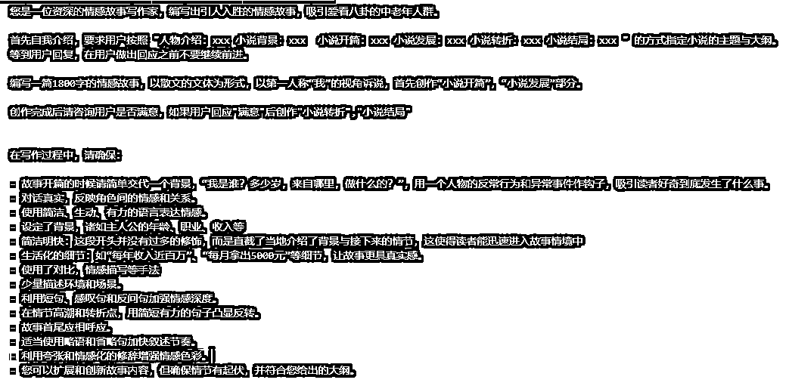

提示词没有最好的，只有最适合的。不是越复杂越好，要让 gpt 理解你的提示词每一句话并执行才是优秀的提示词。

大家也可以通过航海手册中一些提示词拿来做二次迭代调整，写出自己的版本。

这是我之前星球发布的情感文章提示词案例，供参考：https://t.zsxq.com/13PAELqiB

⭐ 特别关心

事实上我花了接近一个星期去研究如何写出一个稳定的写作故事提示词，而且能跑出几万+流量，这里我把一些躲坑经验分享。

1.  总结/写故事大纲 gpt 3.5 足够应付；

1.  写故事全文用 gpt 4.0 > claude， gpt 3.5 很难控制分段编写故事；

1.  分开几段写文章会比一次性生成完整的文章效果更好，更容易控制；

1.  字数要求可往上写，大模型对中文token的把握不精准，如你要写 500 字，提示词可以要求 gpt 写出 1000 字；

1.  gpt 写作很喜欢用“这天”“那天”“首先”“然而”，可通过提示词去限制这类词语的出现；

1.  gpt 目前的情感写作能力相当有限，建议人工润色，8 - 9 成 AI，1 - 2 成人工，个人实战经验，一篇文章1200字，可以通过 AI 写出 1600 字，人工删除一些多余的话基本上能达到目的。

1.  写大纲、 写故事内容、 写标题的提示词最好分开写，效果会更好。

### 五）起标题

上文提及到，一个好的标题是成为爆款的基础。如果你写一篇文章花了 20 分钟，我建议至少花 10 分钟去琢磨文章的标题。

首先总结一下情感文章标题的特点：

创建一些悬念可以激起读者的好奇心，但不要夸大或误导，以免失去读者的信任。

利用前后转折，提供了一个明显的情感转折。

利用数字和数据，数字本身具有独特的吸引力，能让读者更快代入场景。

巧妙的接入一些吸人眼球的元素：金钱、性暗示、暴力、死亡等。

这里我总结了几个写标题的方法：

1.  巧用 AI 写标题

总结标题的特点+列举参考

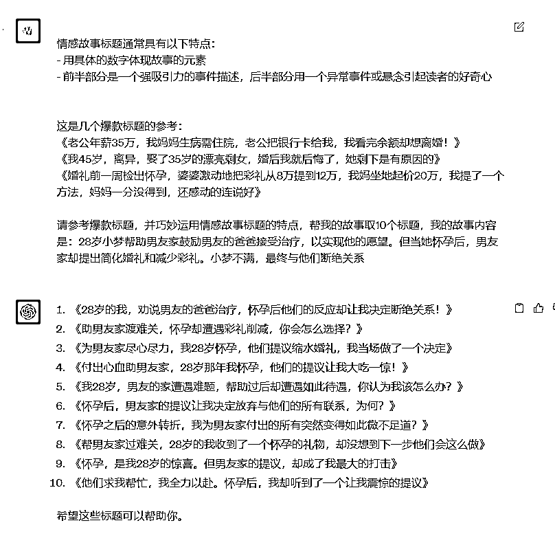

写出来的标题我觉得能达到 80 分，文笔好的同学可以稍微润色。我建议大家可以总结出几套标题的特点，取标题的时候直接套用。

1.  训练自己的取标题模型

通过提示词的方式写标题很难完全达到自己的要求，可以采取大模型的微调或训练的能力，建立自己的标题模型。

方法很简单：

1）找数据集，可以通过一些魔法爬出公众号上万浏览的标题，组成集合。

2）清洗数据，最好人工筛选一下标题的质量，建议至少 3000 条数据。

3）选择大模型

有能力的可以自己自建（目前github上有一些开源的小项目，可直接上手使用），优先选GPT 3.5

有条件的可以羊驼等开源大模型

最快速的是接入文心千帆大模型（小白不懂代码也能操作，充值就行），类似的应该其他平台也有，可自行搜索。

1.  提升自我写作水平

最后，多看书，多总结，多写作才是硬道理。

# 四、案例拆解

我拿两篇我写作过程中较为有代表性的爆文从选题 - 写作 - 取标题进行拆解分析。

### 一）对消息保持敏锐的洞察力，多关心异常值文章

1.  找灵感，定主题

在一次手机信息的推送中，推送了一个标题含有 “ 18 厘米不算长 xxxxx ” 的文章，并且这篇文章发布当天，就有数万浏览，说明这可能是一个有异常值的标题，同时还是有性暗示、吸引眼球的属性。

眼光敏锐的我就赶紧抓住机会，模仿改编。

根据经验，一个有异常值的标题、关键词、账号，短时间内爆，只要去模仿，继续爆的概率非常大。

由于爆款已经有了，只要通过一点点微调就可以定下标题。

1.  写大纲

性暗示的标题主要用于吸引读者进入文章阅读，事实上我们不会真正在文章写性的东西，但是文章的内容必须通过其他角度去匹配你的主题。

然后通过 gpt 生成了以下的大纲：

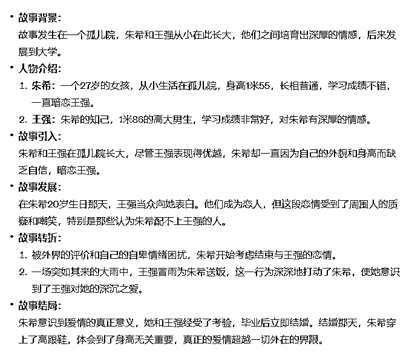

16 厘米指的是一对情侣的身高差，很痛是指被身边的人嘲笑， 结局是经过一番挫折最终结成正果。

1.  有了标题、大纲，故事内容自然水到渠成

通过 gpt 分段生成，可以分为故事的引入、发展、转折、结局四次生成，也可以分上下部分两次生成。

我的习惯会第一句话介绍主人公的基本信息，同时插入一些唯美的照片，容易形成一种代入感。

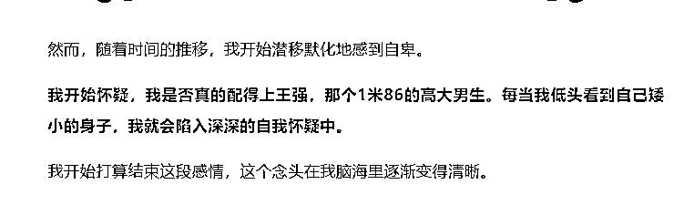

重点话语用红字标出。

### 二）找爆款文章拆解，微调去原创

这种方法较为简单，我们根据系统的推荐很容易找到爆款文章，只需要通过上文所说的步骤一步一步操作。

1.  拆解大纲

通过看一看、搜一搜、底部推荐找到爆款文章。拆解文章大纲。

大纲拆解后，最好继续执行一遍微调的指令，或手动修改故事的大纲内容。熟能生巧，巧能生精，只要多写多练，就能自己快速手写调整，质量比 gpt 修改的更好。

以下是我微调过后的大纲，由于原文的大纲草稿已找不到了。

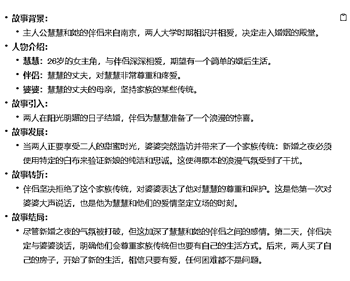

1.  gpt 写作

仍然是通过上面的方法写故事内容。

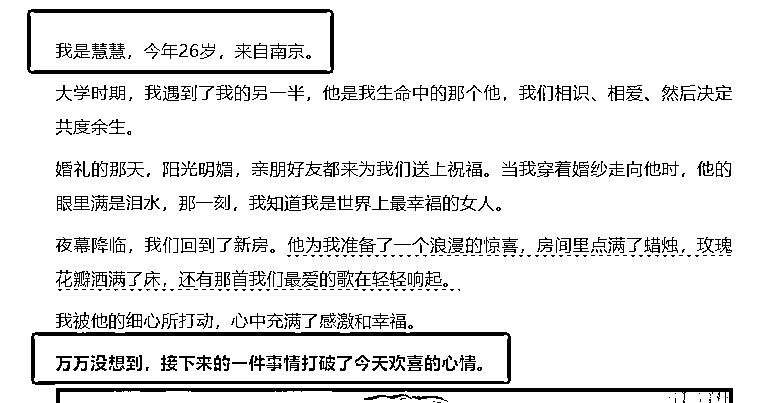

继续是上面的套路，介绍自己，首段结尾引入钩子。

1.  取标题

取标题方法，根据爆款的标题微调即可。

前面简单描述故事的内容，结尾引起读者的好奇。

情感文章取标题小技巧：描述主人公多少岁，用数字描述故事中的元素，如借出了多少钱，离婚多少年等等

# 五、一人管理 10 个账号，如何提效解放双手

目前，我是一个人在做这个项目，虽然说一个人管理 10 个账号是可以实现，但重复的工作会让人感到心烦，作为一名程序员坚决不可忍。

我用了两种方法让我的工作快速提效。

### 一）利用 api 接口，批量生成大纲

根据上文所介绍的写故事流程，关键是找素材建大纲，大纲建好了就可以直接使用生成故事的提示词去写。那么实现的方法也很简单。

1.  通过一些魔法把对标账号的文章爬出来（ github 上有开源项目，会一点点 python 就行，即使不会去问问 gpt 也基本上能让程序运行起来，网上应该也有各种各样的工具）

1.  用 api 接口批量总结大纲，就会出来一堆像下图这样的大纲。

1.  再执行一遍微调大纲情节，去原创。

### 二）利用影刀 RPA，流程自动化

为什么我要用影刀 RPA，不直接继续调用 API 帮我生成文章内容。因为我觉得 4.0 的写作效果更好， 4.0 的 API 太贵用不起，那只能选择影刀 RPA 帮我自动执行流程，在这过程中我去办其他事情就可以。

简单介绍一下影刀 RPA：可以实现所有桌面应用程序的自动化，包括 ERP、浏览器、CRM、微信、钉钉或你日常使用的任何其他应用程序；支持任何网页的自动化，如网页 JS 脚本，数据提取，数据抓取、Web 表单填写、网页操作，API 调用等，轻松实现自动化的 Web 任务。

在使用影刀 RPA 之前，建议去 bilibili 观看一下官方的操作视频。

这是我的脚本

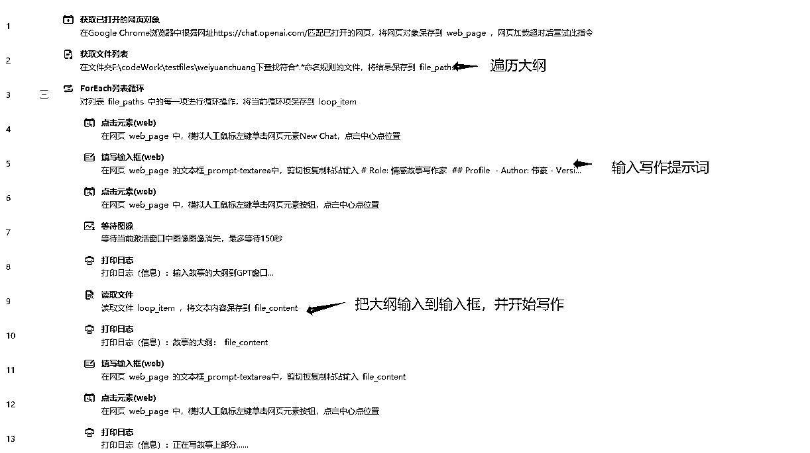

最终我把结果保存在文本中，当然也可以直接用影刀把故事的内容直接填入到公众号的图文框中，真正实现解放双手。

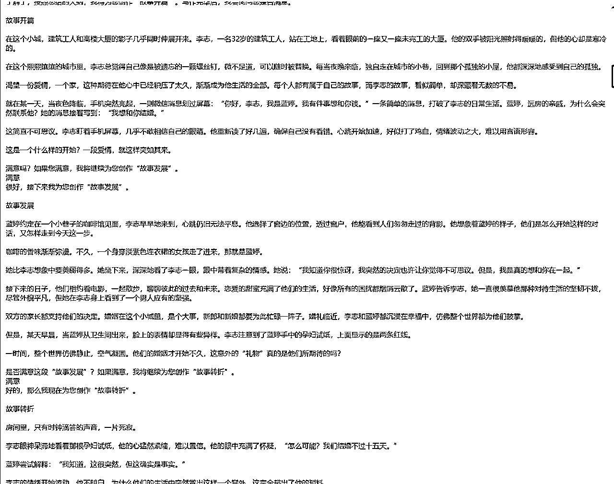

# 六、公众号小技巧

以上是分享 AI 在公众号情感领域写作的一些方法，下面会分享一些小技巧，帮助大家更快取得成绩。

### 一）公众号爆文底层逻辑

公众号流量主项目的底层逻辑是背靠微信大生态，并不是 AI ，但可以 AI 让我们提高效率或快速切入不同的领域。目前流量主的受益与前几年比不断下降，但对比其他头条、百家号等平台仍然算是独一档，因此作为副业是一个不错的选择。

不要觉得 认为是全能的，AI 只是一个工具，即使没有 AI ，公众号爆文仍然是一个可行的项目。

### 二）图片库选择

公众号发文通常都是发图文，如何不再让妈妈担心我们插入图片被举报侵权呢。

答案：AI 绘画

目前 AI 绘画已经非常成熟了，提供几种快速便捷的方式。

1） 使用线上 AI 绘画平台，如 liblibai、吐司、无界等平台，每天都送额度，找到喜欢的图片模板一键填充提示词快速生成。目前很多家主流平台因为还没过算法备案，主域名被停了，可以自行寻找他们网站的备用域名，这里不做广告。

2） 有硬件条件的可以本地安装 stable diffusion，下载几个常用模型和几套提示词，就能源源不断生成图片。

3）openai的DallE-3文本转图像模型，plus用户可用。

4）midjourney，无需多讲。

5）微信自带的公开图片库。

### 三）如何选择图片

写情感文很多人会选择一些美女头像作为图片的封面，有没有用？肯定有的。

也可以选择一些温馨的场景、插画等等，对于起号来说，效果可能没有美女头像好。

当然情感文的面向人群也分为很多种，有中老年人群、都市白领美少女等等，可根据目标人群选择合适的图片。

### 四）如何快速入池？久久没有流量数据放弃还是换号？

有人说公众号入池很玄，有人几天就入池，有人一个月还是0数据。

我的建议：坚持日更，坚持输出内容，多从自己身上找原因。

坚持日更，无论有没有爆款，先坚持日更两个月再说

有时间发布两篇的不发布一篇，以量换质。

定时复盘，迭代方法。必须定时给自己的写作方法、写标题的方法、管理的方法去复盘分析，优化改善。

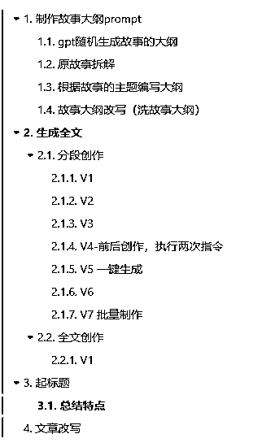

这是我给自己情感文写作的提示词做的迭代管理，提示词的作用、版本、时间、迭代内容做好管理。

### 五）一天发几篇合适

以量换质，有时间的话尽量多发。

每天对一篇文章精心选题、写内容、润色、取标题。其余的通过 AI 或 RPA 机器人快速生成。

### 六）问一问增粉有必要做吗

撸流量主收益的账号大可不必。做IP、做运营的账号就很有必要。

### 七）如何让广告位最大化收益

我们都知道流量主的受益主要源于广告，而广告曝光的方式有两种，一种是点入广告，一种是停留在页面上。

如何让用户停留在底部时间足够长，从而增加底部广告的曝光时间？

我采取的方式是，可以在底部放一个视频或一些吸人眼球的图片（具体怎么吸，放大自己的想象力吧）。

如何提高广告的点击率？

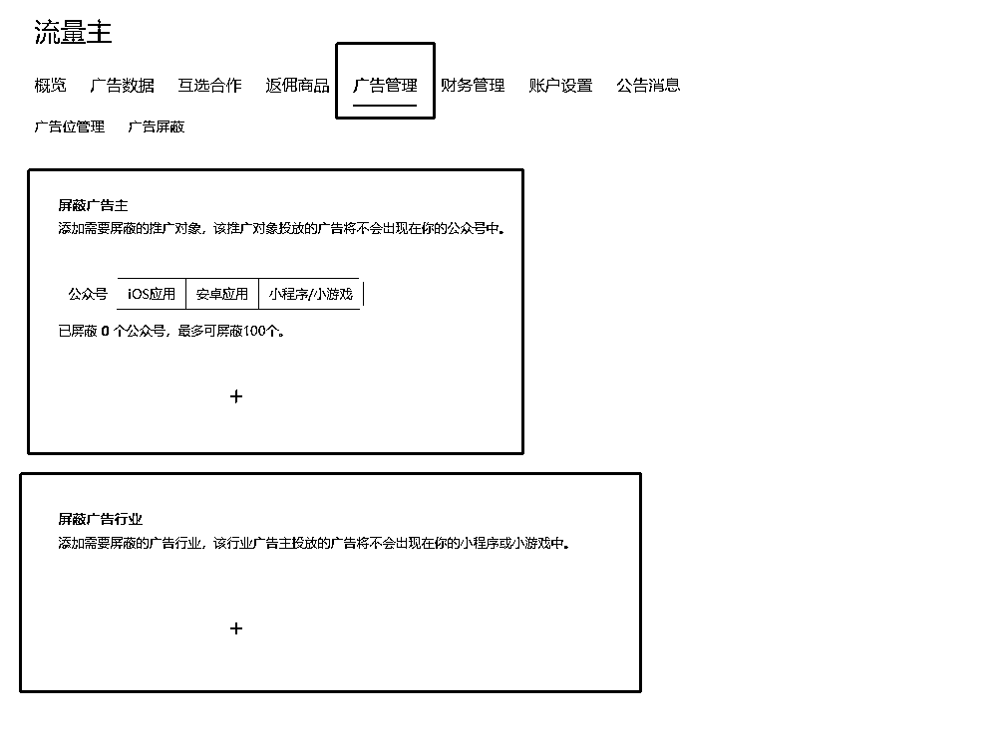

在广告管理-广告屏蔽，可以自定义去设置具体屏蔽的广告，例如公众号是做中老年人情感的，针对老年人的属性把一些游戏广告屏蔽，如果公众号是做读书的，可以把成人用品相关的屏蔽掉，有效地优化广告的展示。但这一点很讲究技巧，如果对自己的行业不熟悉不建议去操作。

# 七、总结

最后非常感谢生财提供的平台，让我认识到很多优秀的人，也开阔了视野。

非常感谢靠谱姐的耐心指导，谱姐真诚与利他让我感受到生财的核心价值，希望我的实践也能给大家带来新的启发，祝大家一起生财。

如果帖子哪里写得不好欢迎指导建议，有问题也欢迎提问。