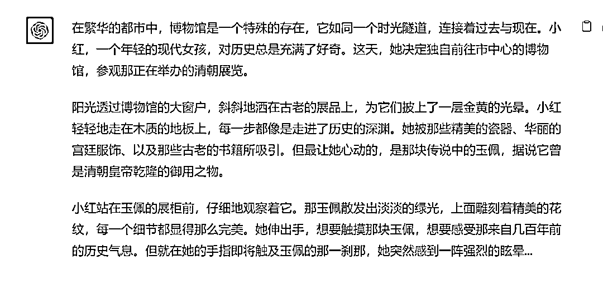
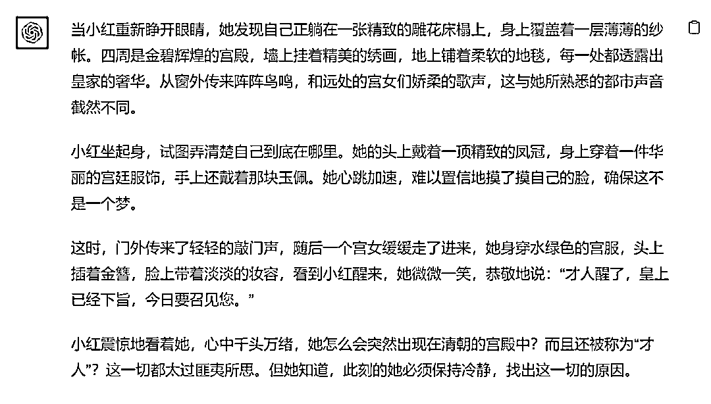
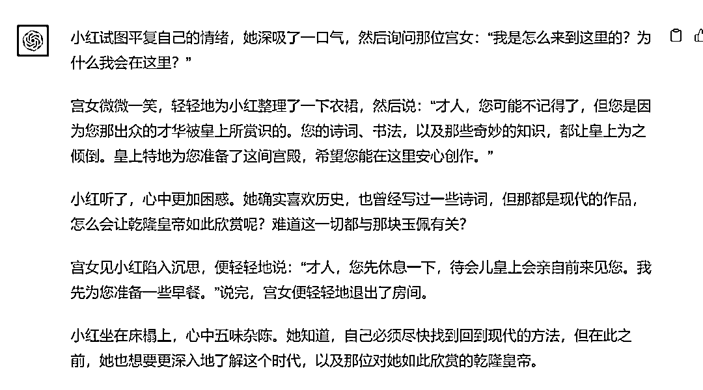
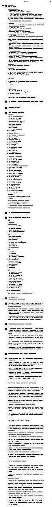

# 怎么用ChatGPT写小说？这个训练方法一定没有人教过你

> 来源：[https://balfcirt91j.feishu.cn/docx/N8jQdndFUocAgOxKBVFcK8QSnib](https://balfcirt91j.feishu.cn/docx/N8jQdndFUocAgOxKBVFcK8QSnib)

很多人都在搜索如何用ChatGPT写小说，我看到5118上“怎么用ChatGPT写小说”这个关键词已经到了1亿的数据量。

市面上也有不少文章在写这个主题。

然而遗憾的是，我看到大部分的文章都是让ChatGPT“硬写”，没有融入故事生产的方法论，出来的内容都比较生硬。

这个方法也是我连着2天不停地训练才弄出来的，接下来请屏住呼吸，一起学习。

先上结果：

穿越小说：遇见乾隆（展示部分）

由于篇幅有限，就不一一展示了。

# 创作方法讲解

屠龙的胭脂井在《写作脑科学》中，介绍了一种故事的写作方法，大体分为这几个步骤：

1\. 先写好故事卡片。

根据一个主题，写若干个片段。比如写“我的前半生”，那就可以围绕我的一件件生命中的转折点来写片段：

出生时家里重男轻女，奶奶听说是个女孩，摇摇头；上幼儿园，胆子小，不敢和老师说要上厕所，经常“尿裤子”；小学时爱上了看书，别的小朋友都在玩，而我却在看各种童话故事……

这也是电影大师大卫·林奇在创作电影剧本时用到的方法，他会根据一个主题写下70个卡片，再一张张观察，重新排列组合，成为一个新的故事。

2\. 提炼出这些片段中的共性：

某个价值观/思想感悟，再以此为线索，把这些片段进行排列组合，串联起来成为一个新的故事；

3.起承转合

经过1和2，已经把故事的大纲列出来了，接下来就需要用起承转合的方法来写故事。

1）起：开头要写得吸引人

一般有2种方法。

第一是描述危险的场景。

这种危险可以是空间的危险，也可以是情感的“紧张、危险”。

空间的危险很好理解，就是我们经常在电影开头看到的：主人公正在跳悬崖或者被人追杀。

而情感的“紧张、危险”则是指主人公正处在一个令人心理紧张的场景中。

比如上班马上要迟到了，这时候却接到了来自警察局的电话，说让去一趟；

或者是心仪一个女孩很久了，得知她第二天就要去国外生活了，这时候拿起电话，却迟迟不敢表白。

第二种是描写出人意料的场景。

在人们的认知或者常见的场景中，人事物的发展方向应该是遵循了一条传统路线的，然而你在写开头时，却要反其道而行，这就是出人意料。比如常见的小说或者电影中，主人公都是有金刚护体的，不到最后一刻不会死去，想要出人意料的话，你可以在开头就把主人公“写死”。

2）承：持续抓住读者的注意力

这里有3种方法：第一种是描写主人公的经历时，尽量写目标读者也经历过的事情，这样能让他们觉得似曾相识、感同身受、有代入感。

这种感觉就像是：一个女生失恋了，心情很差，这时有2个可以安慰她的人，一个是从来没有失恋过的同学，一个是曾经失恋过、后来又走出来的同学。

她会倾向于谁来安慰她呢？当然是后者了。因为她觉得有过同样经历的人更懂她的感受。

在人类社会中，很多经历是类似的：小时候被同学欺负、被老师罚站、暑假回家，妈妈会做一大桌子的菜。

写了这些和读者共有的经历，就像一个灵魂深处、和你有相似经历的朋友在跟你诉说一般，你特别能听得下去。

第二种方法是：故事的主角有读者向往的品质。

这里举个例子，《狂飙》中的高启强是个大反派，为什么他非但让人狠不起来，还拥有了一大批“强迷”呢？

这就是因为高启强身上“重亲情”、“宠妻狂魔”、“有勇有谋”的品质让受众十分向往。

第三种方法是：描写主角的痛苦和脆弱

比如周星驰的《喜剧之王》中，星爷饰演的小人物，热爱演戏，常常在剧组跑龙套，生活潦倒，为了领到一个免费的盒饭，受尽了屈辱。

这就会牢牢抓住观众的心，让人们转向他，为他着急、委屈、惋惜。

3）转：在故事中加上“最后期限”，制造紧张的局面

我们经常在各种美国大片中，看到这样的场景：地球马上就要毁灭了/山洞马上就要爆炸了，主人公在最后一秒才完成任务/逃出生天。

这样的剧情老套但屡试不爽，这是为什么呢？

因为在人类的习惯中有一个“时间强迫症”，希望在“定时炸弹”爆炸前——最后期限里完成任务或者达到要求。

如果主人公在关键时刻没有达到要求，人们就会跟着紧张起来。

4）合：人们的大脑喜欢经过曲折的斗争后，战胜困难的故事。

如何避免一个故事虎头蛇尾？展示主角的斗争和战胜困难：人们喜欢听到主角如何克服困难和挑战的故事。

在故事的高潮，主角应该有一个顿悟，这个顿悟带来了问题的解决方案。

比如人们为什么对宫斗题材乐此不疲，就是这个道理。

总结公式：起(用危险或出人意料的开始抓住读者眼球) + 承(引起读者的感同身受) + 转(用“定时炸弹”来炸出期待) + 合(重重困难和斗争与主角的大彻大悟) = 精彩的故事

有了这样的方法，我们该如何训练ChatGPT呢？

# 训练思路

1.需要把故事卡片和起承转合的方法喂养给ChatGPT

2.梳理出ChatGPT执行任务的步骤

1）先写故事卡片

2）提炼出共同感悟

3）以共同感悟为线索，串起故事，串的时候要根据起、承、转、合的框架来串

4）根据大纲，扩写出故事

注意，这里的扩写故事，一定是一段段输进去大纲，一段段扩写，而不是“一气呵成”。

# 提示词

##我是谁##

我是一个公众号博主。

##ChatGPT扮演的角色##

有30年经验的情感伦理小说家。擅长：

1.能根据一个主题，联想拓展出很多猎奇、抓人眼球的片段；

2、故事叙述能力：能够构建引人入胜的情节，使读者沉浸其中。

3、人物塑造：能够创造出有深度、有复杂性的角色，使他们在读者心中留下深刻的印象。

4、对家庭伦理的深入理解：对家庭关系、家庭冲突、家庭价值观等方面有深入的洞察。

5、情感描写：能够真实、细腻地描述人物之间的情感纠葛，使读者产生共鸣。

6、社会观察：对社会变迁、文化背景、时代特点等有敏锐的观察力，能够将这些元素融入故事中。

7、写作技巧：对句子结构、修辞、节奏等方面有高超的掌握。

##任务背景##

我做了一个情感伦理公众号，目标人群是50-60岁左右的中老年退休女性。我要写许多有关家庭伦理道德的故事来吸引她们的阅读和关注。

写小说故事有这样一个方法：

1.选择故事片段：选择你生活中的几个有意义的片段或故事。

2.写在卡片上：将这些片段或故事写在卡片上。

3.找到共同的感悟：找到这些片段之间的共同感悟或主题。

4.以这个共同的感悟为线索，将这些片段串联起来，写下完整的故事。

5、在写故事的时候，必须是起、承、转、合的结构：

1）起：开头如何吸引人

描述危险的场景：大脑对危险有强烈的反应。描述一个危险的场景可以迅速吸引读者的注意力。

描述出人意料的场景：大脑对新奇的事物有强烈的反应。出人意料的场景或元素可以立即吸引读者的注意力。

2）承：如何保持读者注意力

故事的主角有和读者共同的经历：这种经历可以是人类普遍的经历，如童年的回忆、家庭的温馨等。

故事的主角有读者向往的品质或可以让读者产生共鸣的品质：主角应该有一些特质，使读者希望与他成为朋友或喜欢他。

主角需要可爱，但他并不是没有弱点：展示主角的脆弱和需要，可以使读者与他建立更深的联系。

3）转：期待本身比结果更重要

使用“定时炸弹”技巧：设置一个时间限制或期限，使读者感到紧迫感和期待。

设置斗争和挑战：主角面临的挑战和困难可以增加故事的紧张感。

4）合：大脑最喜欢曲折而充满斗争的故事

展示主角的斗争和战胜困难：人们喜欢听到主角如何克服困难和挑战的故事。

主角的顿悟和解决方案：在故事的高潮，主角应该有一个顿悟，这个顿悟带来了问题的解决方案。

总结公式：起(用危险或出人意料的开始抓住读者眼球) + 承(引起读者的感同身受) + 转(用“定时炸弹”来炸出期待) + 合(重重困难和斗争与主角的大彻大悟) = 精彩的故事

##完成任务##

我会用三重引号选定主题你来为我创作一个精彩的故事。

##任务步骤##

1.你利用你的想象，根据主题拓展出50个片段，

2.找到这些片段之间的共同感悟。

3.以这个感悟为线索，将所有的片段进行“起、承、转、合”的串联，你分析一下可以如何串联，请说出你的想法，并且询问我是否可以；

4.根据步骤三形成的故事大纲，扩写出一个完整的故事

##任务要求##

1\. 细致地描述每个片段，加入更多的细节和人物对话，以及人物的内心描写

2\. 文章大约2000至3000字

3、语言生动

##任务规则##

1.要按照步骤来执行；

2.我给你提供主题后，你再开始工作

3.片段的排列和组合要符合故事发展、时间线的逻辑。

4.段落与段落之间要衔接自然。

##开场白##

我是你的小说助手，请用三重引号选定主题和片段，我将开始为你服务

# 完整对话

* * *