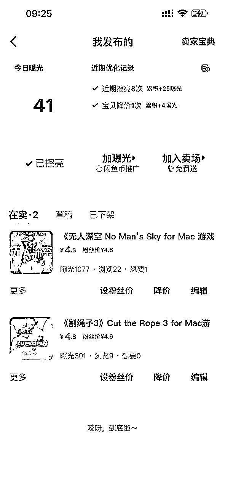
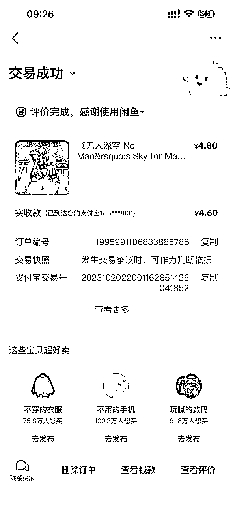
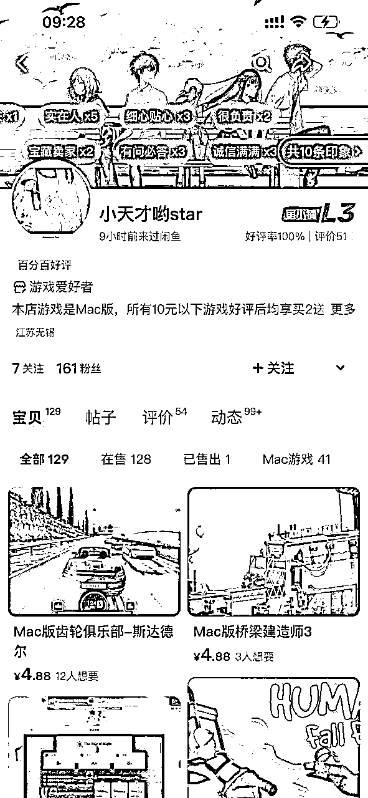

# 闲鱼虚拟产品—从上架到出单，只需要两步。

> 来源：[https://u0yrmcie7v.feishu.cn/docx/O6cXdnySjoeJ9yxxnyPcT4benKc](https://u0yrmcie7v.feishu.cn/docx/O6cXdnySjoeJ9yxxnyPcT4benKc)

大家好，我是西昂。

今天给大家介绍一个比较适合小白操作的小项目——闲鱼虚拟产品。这个经过我们测试后，确定能够开单的，而且见效还挺快~

以前闲鱼是禁止出售虚拟产品的，现在已经没有这个限制了。但是一些比较敏感的产品还是无法出售的，比如chatgpt等内容。

只要是在生财呆过一段时间的圈友，应该对虚拟产品都比较了解了。说白了，就是不需要发物流的产品。一般有资料、课程、素材等等，都属于虚拟产品。

### 今天我们操作的是Mac的游戏软件

这个是我测试的新账号，上架两个产品后就成功开单了。

一些对标账号已经铺了很多商品，每天就是点点发货就可以小赚几百块啦。

### 那么这个产品如何操作呢？

##### 首先，你需要找到合适的mac游戏网站，保证游戏可以用，数量多，更新快。

##### 我目前收集了几个，但是都是收费的网站，就不放出来了。大家用心搜索一下，相信这个不是问题。（如果实在找不到，可以找我要）

##### 然后，网站上有图片、描述等内容，你进行重新排班发到闲鱼就可以了。整体耗时，不超过10分钟。

##### 一天发布5个产品就足够了。

## 骚操作

直接保存同行的图片和文字描述，然后裁剪掉对方的水印。直接上传闲鱼就ok了。

一般2分钟一个商品，10分钟搞定一天的任务

## 自动发货

有朋友问如何自动发货，可以看看：https://www.agiso.com/detail/151

### 风险：

Mac游戏的风险也是存在的，比如一些国内的mac游戏是尽量不上架的，避免出现侵权风险。一些国外游戏的版权可能不那么敏感，还是可以赚赚小钱的。

### 如何放大收益？

1、可以做买赠的活动，比如买2增1，增加销量、也增加了收益

2、增加付费会员，比如199、299、599元，包月、包季、包年套餐。所有游戏软件随便下的。

3、做供应商，游戏可以通过别的渠道下载回来，自己做dmg的安装包，可以持续的引流获得收益。

其实，闲鱼做虚拟产品特别简单，你只需要找到合适的资源，直接上架就可以。

只要保持每天上新，一般3-7天总会出单的。正反馈来的相当快了！

📍 尽量自己找资源，锻炼动手能力。实在找不到的话，v:askteas