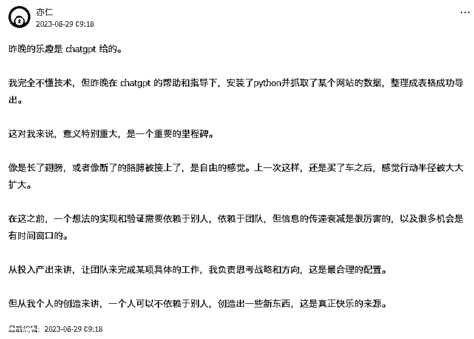
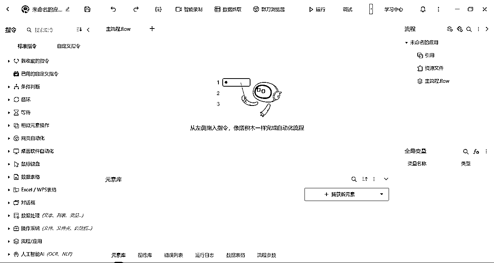
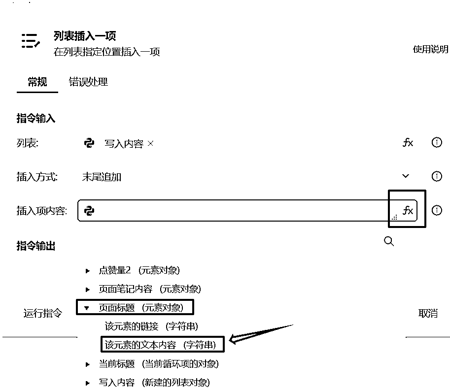
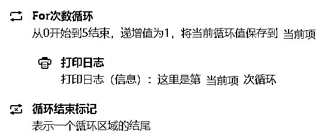
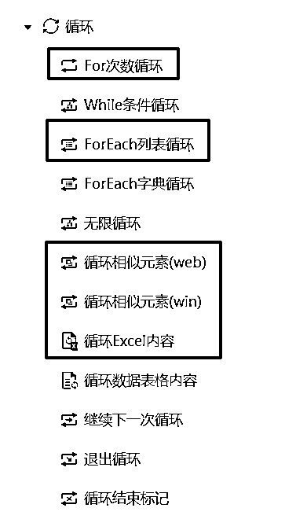
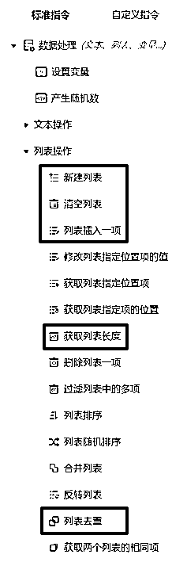
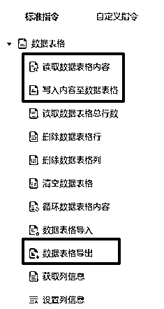
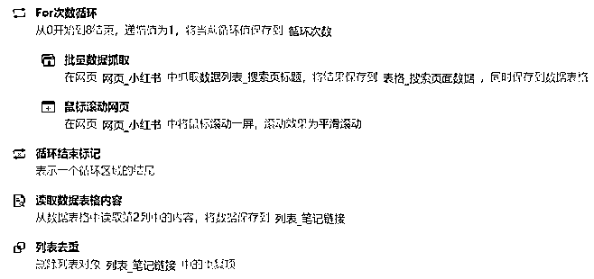

# 零基础上手影刀RPA：15分钟抓取200条小红书笔记，解锁电商自媒体自动化操作

> 来源：[https://ih195hg9y3.feishu.cn/docx/O6v0dOMabodxuxxNQGdctnnun3f](https://ih195hg9y3.feishu.cn/docx/O6v0dOMabodxuxxNQGdctnnun3f)

大家好，我是阿盛，坐标广州，从去年开始接触RPA后，用影刀RPA就做了有100+个应用，目前是影刀官方组建的优质开发者社区成员。

在今年4月份写了一篇影刀RPA的分享帖后，有好些圈友找我了解RPA，想在小红书/微信/抖音和各类电商社媒平台等业务场景中的应用，也在线下同城组局中做过“手把手教学搭建RPA”的主题分享，交流中会发现老早就知道有这效率神器，但就是不知从哪里入手。

所以整理出这篇入门攻略，用实现一个“抓取小红书笔记”的具体功能为目标，了解如何制作一个RPA应用，希望能帮助更多圈友用好这个“解放双手”的神器，加速搞钱效率～

## RPA能用在哪里？

别的不说，就列出几个圈友们在做电商和自媒体项目时都会用到的场景：

*   内容发布：小红书图文/视频内容批量发布，其他有网页版的平台同样适用

*   销量追踪：小红书店铺商品销量抓取，辅助进行选品和调整运营策略

*   获取联系方式：指定关键词的TikTok/INS网红主页信息抓取，可以拿到网红联系方式做邀约

*   微信端内容抓取：在微信搜一搜里按关键词批量获取公众号爆文或最新发布内容

*   软件操作：以微信为例，批量添加好友/导出通讯录/群发图文信息/群成员去重

*   AI联动：自动操作ChatGPT、MJ或SD等AI工具，批量生成内容

接下来我们要分享的攻略，就是从零基础开始，搭建一个自动抓取小红书笔记内容的应用，完整版的运行效果是这样的：

## 关键的心理建设

对于很多没有编程基础的小白来说，最关心的是这能学会吗？

无数的“从入门到放弃”，其实都是因为痛点不够扎心，带着“再也忍受不了”的需求解锁新技能，在线下主题分享时，会特别强调让参加的圈友带上电脑，务必准备好一个具体的需求点。另外就是没能获得有效的正反馈，所以，在这篇分享里会从搭建一个只需要3个步骤的最小应用获得正反馈。

只要跑通过一次就能上手，当你成功运行一个自己搭建的RPA应用后，就打开了新世界的大门。即使你以后不想自己花时间开发，也能比较清楚地知道一个需求是不是能用RPA来做，并且能非常精准地提出需求，大幅减少沟通时间。

其实影刀官方是有视频教程的，对于很多人来说是直接太长不看了，所以就用这一篇图文就用【小红书笔记抓取】作为案例，带你快速划重点。

## 一点点背景知识

在开始操作之前，有必要简单了解一下RPA是什么，和其他软件工具有什么不同，把它用在合适的地方。

RPA（Robotic Process Automation，即机器人流程自动化），这是一种通过软件模拟人类在计算机上执行操作的技术，可以帮助我们自动完成一些重复性的工作，例如数据录入、发送邮件、网页操作和控制软件等。

请注意这里的加粗：模拟人类在计算机上执行操作。

按我的理解，RPA可以定义为”软件的软件“，它的核心功能是可以模仿人类的操作，使用鼠标、键盘或指令来操控其他各种软件（网页浏览器也属于软件），还可以进行数据处理、调用API接口等需要用代码实现的功能。

并且RPA软件大多是属于“可视化编程”或是“低代码”，就是把操作其他软件的各项基础能力，包装成一个个积木块，你拖动一下就能加入这个功能，可以看一下我用影刀RPA做的“小红书笔记内容抓取”应用的编辑界面，只有12行就能完成核心功能。

亦仁老大发过一条动态，在GPT的帮助下用python实现了抓取网页数据的功能，确实，完成编程环境的配置和第一次成功运行是最兴奋的，这也是劝退新手最厉害的部分，而影刀RPA可以说是“开箱即用”，下载安装后，只需要再安装一个浏览器插件，就能实现网页端的操作。

## 开始动手

话不多说，咱们先动手做一个试试，感受一下搭建应用的手感。

案例01

需求：自动打开小红书主页，搜索一个关键词。

流程：这类比较简单的操作，可以直接截图能梳理清楚步骤，如果是涉及多个页面和软件的，就需要再画出流程图。

输入内容：网址、关键词

输出内容：无

那么，我们先从下载和安装开始，在官网下载最新版本（直达下载页面），然后注册账户。

下载安装完成后，建议在自己常用的浏览器里，安装一下影刀插件，不然在调用浏览器时会出现报错。

安装方法是：点击自己的头像，然后在工具——自动化插件里，安装对应浏览器版本就可以，比如谷歌浏览器或是360等。

### 创建应用

第一步就是先创建一个新应用，在左上角点击“新建”——“PC自动化应用”后会自动进入编辑页面，然后就能看到应用编辑界面。

### 元素捕获

接着，我们做的不是直接写指令，而是先把待会要用到的“元素”保持下来。

在RPA应用开发时，有一个跟其他编程最大的不同，就是会需要有一个“元素捕获”的操作，“元素”就是你在这个流程里需要操作的对象，比如网页里的按键、链接或是输入框等，把他们通过“元素捕获”保存起来，在后面才能放在编程指令里使用。

在这个案例的3个步骤中，其实我们是有“输入框”和“搜索键”两个元素需要操作，所以我们需要捕获的元素只有两个，一个是输入框，另一个就是搜索按键，需要注意的是，我们要在哪个浏览器运行，就在哪个浏览器里捕获元素。

捕获方法就是把鼠标移动到要点击的位置，然后按【ctrl + 鼠标左键】就能捕获到元素，点击确定就可以保存下来，在“元素库”里就能看到。

### 编写指令

好了，现在就可以开始编程啦，在左侧的指令区，把我们要用到的指令拖动过来，在弹出的指令编辑框里，选择操作的元素或是填写内容。

### 运行/调试

最后，就是点击“运行”，看能能不能自动跑起来。如果出现报错，就在底部菜单栏的“运行日志”中查看是哪里出了问题，比如初次使用时，最常见的就是浏览器插件没有安装好会出现报错。

如果能够成功运行，那么，恭喜！你已经完成了一个RPA应用的搭建和运行，是不是感觉“有手就行”？

也许你会说，这个应用完全没有实用性，不如手动来得快，那我们就把这个应用迁移到我们的业务场景中，请看下一个“小红书笔记抓取”的实战案例。

## 实战案例

在做小红书时，都少不了找对标的爆款笔记这一步，常见的需求就是抓取小红书笔记内容，在小红书网页版可以复制笔记内容，但手工整理确实累人，现在只要写好一次应用，可以重复地自动抓取。

可以先看一下演示案例的效果：小红书内容抓取笔记

案例02

需求：打开搜索结果的每个笔记，抓取里面的内容，将结果保存到表格里。

流程：在搜索结果页面，逐个点开笔记，抓取内容，再返回到搜索结果页面，继续抓取下一个。

输入内容：无

输出内容：数据表格，表头为：标题 | 内容 | 点赞 | 收藏 | 评论 | 时间 | 作者ID | 笔记链接

第一个版本可以先拿“标题”和“内容”两个部分跑通应用，其他的部分用同样的获取+插入就可以实现，我把核心功能的代码放出来，可以试着操作。

看起来比上个应用复杂了一些，其实只要掌握以下4个常用的操作，就能理解：

### 1.捕获相似元素组

捕获一个元素后，再点击上方的“捕获相似元素”，然后再选一个同类的元素，比如在这里就是另外选一个标题，在点击捕获后，在页面里会有提示所有的相似元素有哪些，看是不是我们想要的，如果没有看清，可以点击“校验元素”，确认一下。

相似元素组的命名建议是：相似元素组_XXX，这样可以跟单个的元素区分开来，方便调用。

捕获元素和相似元素组，是RPA开发中非常关键的一步，甚至可以说能成功捕获我们需要的所有元素，这个应用的开发就成功了一大半。

### 2.设置列表

列表（或者说是数组），在编程里是非常重要的一个概念，特别是在数据处理是会非常高频地用到，以下会简单介绍“变量”和“列表”，如果不太能看懂，可以先试着用起来，对照着上面截图的代码理解。

在前面使用指令时，可以看到很多指令的最后都有一句“将对象/结果保存到XXX”，这里的XXX就是一个变量，可以简单地变量当做一个盒子，在程序运行过程中出现的数据，就能用这个盒子装起来，贴上一个“变量名”作为标签，后面可以再调用。

那么，列表就可以当做是一个抽屉，里面可以按顺序地放置很多个变量盒子。直观地看可以把下面的这一行表格当做一个列表，每个格子里就是一个变量。

| 变量1 | 变量2 | 变量3 | 变量4 | 变量5 |

当我们在获取笔记的数据需要写入到表格时，就会先把标题、内容和点赞数等数据全部加入到一个列表里，这样只需要一次就能把这些数据写入表格的一行，不用对着一个个格子操作。

特别提醒一下，在将标题或内容插入列表时，按下图的示例选择元素对象的“文本内容”：

### 3.设置循环

所谓“编程”就是“编写流程”，算是编程思维的核心，而流程其实只有3种：

*   顺序：按先后顺序执行，这是最容易理解的。

*   循环：处理重复的操作，按设定的次数，或是制定的一个列表，逐个进行操作。

*   分支：进行条件判断，满足条件就执行A，不满足就执行B或啥也不干。

在这个应用里会使用到一个“相似元素组”的循环，其实相似元素组也是一个列表，循环就是把列表里的变量逐个取出来，在循环内进行操作，结束后再取出下一个。

所以在运行时会看到鼠标逐个点开笔记页面，获取数据后又返回，点开下一个，能理解循环内操作步骤的设置，是RPA开发的重点。

如果有兴趣可以自己做一个最简单的循环玩一玩，就能理解“循环”是怎么一回事，对于以后接触列表、表格等会更容易理解。

### 4.写入数据表格

影刀是自带有一个“数据表格”功能，可以在抓取数据后临时存放，全部数据抓取完毕后再统一导出为Excel，比起直接写入Excel表格会更快一些。

在这个应用里会用到一个“写入内容至数据表格”的指令，从A列开始，逐行写入，按下面的截图配置即可，想要详细了解可以点击右上方的“使用说明”，会有详细讲解。

常用的循环、列表和数据表格相关的指令做了标记，在用到指令但又想不起来在哪时，可以在指令上方的搜索框里输入名称，就能快速找到

当你成功运行这个应用，在数据表格中能看到抓取的数据时，相信你会非常兴奋，感受到了解放双手的愉快体验。

同时，可能又会发现一个问题：为什么只能抓取到20条左右的数据？

这时真正到了这个应用开发的难点，需要处理小红书页面内笔记加载数量的问题，能解决这个问题，以后对于绝大多数网页端的数据抓取都能解决。

这里提供一下最关键的思路：

*   抓取一个页面的部分跟上面是一样的，这部分不用改动。

*   先获取搜索页面内所有笔记链接，再通过打开链接进入每个笔记中。

*   获取笔记链接，需要用到影刀自带的“数据抓取”功能，在应用编辑页面顶部功能区可以看到，使用方法可以按提示操作，这里放出这部分的示例截图：

最后，就附上一个完整版的应用分享，新注册的账号在30天内可以获取应用，完成后会把表格放在你的桌面。

影刀RPA应用-小红书笔记内容抓取：

https://api.winrobot360.com/redirect/robot/share?inviteKey=a4fb02c7371708d7

如果运行过程中遇到问题，可以联系我。

## 开发要点

列出3个我认为是RPA应用的开发过程中的关键点，希望对你有启发：

### 了解完整操作流程

RPA不是自动化的魔法，他会完整地模拟你的操作过程，所以当你被重复劳动困扰时，先把你的操作一步一步梳理清楚，可以写下来或是画流程图，不管是自己动手做，或是找人开发，思路都会非常清晰。

特别是在刚接触一个新的项目操作时，不要急着上来就自动化，先手动操作几遍，至少看下有哪些地方是会出现异常的，举个最简单的加微信例子，会出现的情况就有：微信号不存在、对方高频、设置隐私、自动通过或自己高频等等，当你要一个应用稳定运行，就要把这些因素考虑到并设置应对方法。

### 确认输入和输出

在做这个应用时，会有哪些信息需要输入进去，比如自动加好友，就需要有一份微信号清单；自动AI绘画出图，就需要先准备好一批提示词；批量发送笔记，那笔记内容就需要先准备好。

这些数据需要输入的数据，如果较少可以是直接写进应用里，较多的建议还是用表格。

在运行完这个应用后，是否有内容输出，存为表格还是文档，保存在哪里，这些也要考虑清楚。

### 适用场景

最适合用RPA来做的流程，我自己总结的是“高频重复，对时效性要求不高，暂无现成工具能完整满足需求”。

很多人初次接触影刀RPA，看到都是类似爬虫的功能，然而RPA不只在网页端，更能体现优势的是在对软件的操作，比如微信/钉钉自动发送信息；电商后台的订单处理；MJ自动出图；ERP系统内的操作或是数据导出。

并且，在手机端的应用也是可以操作的，建议是在做过网页和电脑软件的操作后再尝试，不然可能会容易踩坑。

## 总结

看到这里，相信你对RPA会有初步的了解，应该能体验到“解放双手”的感觉，更重要的是希望你能理解用RPA实现自动化的思路，让更多的重复工作交给机器，甚至用这套思路梳理业务流程，将来可以交给AI。

最后，感谢耐心查阅，期待探讨交流，一起加速搞钱~

* * *

## 附录

影刀帮助中心：https://www.yingdao.com/qa/

RPA在手机端的案例：