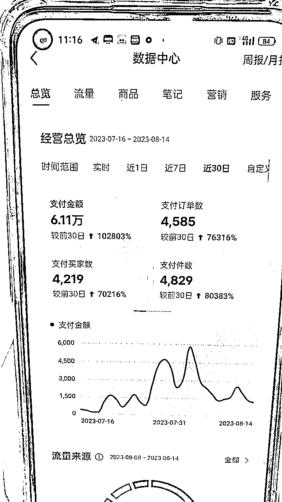
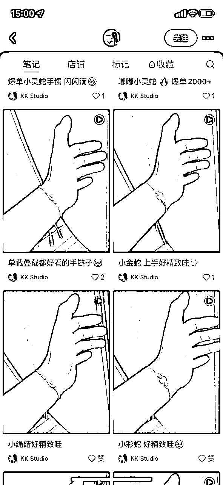
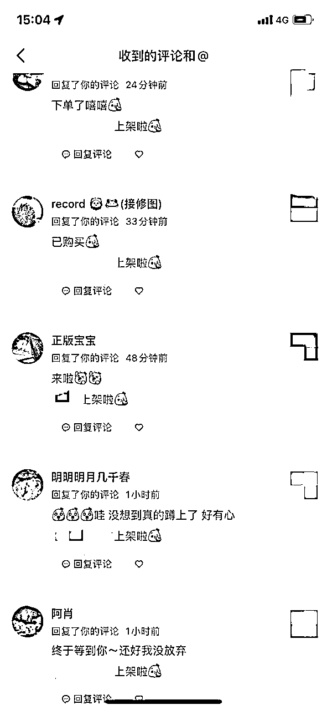
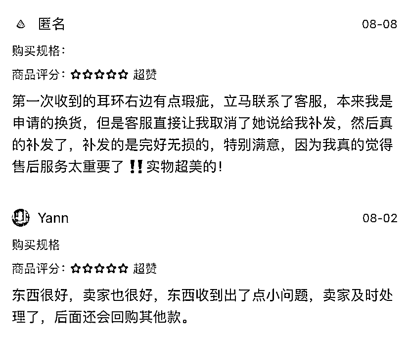

# 每周工作1天，兼职做小红书店铺月入10W+

> 来源：[https://kcd0oe2dxd.feishu.cn/docx/Os65dnJRlopq0ax2tabci9mvnpf](https://kcd0oe2dxd.feishu.cn/docx/Os65dnJRlopq0ax2tabci9mvnpf)

大家好，我是凯旋，主业是一名交互设计师，今年四月开始兼职做小红书饰品无货源，月GMV在3W-10W之间，利润率在50%左右。

一开始只有1个号，7月开了第2个号，一个月的时间，0粉起号，做到了6W+的GMV，涨粉6000+，下图是一些店铺数据。

可能我的收益不算很高，但是我的投产比很高，因为我每周只工作1天。我会在每周六拍摄产品，上架产品，编辑1周的定时笔记，也就是7条笔记。前期我只有1个店铺的时候，2个小时就能搞定一周的笔记，后期扩张到3个店铺就需要一个下午的时间了。

周一到周五因为要上班，对小红书基本放任不管，不刷单不刷评论也不看数据，但是会偶尔回复一下粉丝留言。其余的事情交给请的兼职客服，他负责客服、发货和售后问题，工资每个月2-3K。售后主要是质量问题，这种情况直接联系厂家，都会免费补发。退货退款率目前在0.1%左右。

我一直觉得我的小红书运营得一般，直到最近，在淘宝/pdd/1688等各个平台都能看到自己的照片，有一家淘宝甚至在商品名称中打上了我的薯店名称。我开始觉得也许可以分享一些经验给大家。

为什么同样的产品，同样的价格，相似的封面与标题，有些店铺能爆单有些店铺却不能？可能是因为你忽视了一些细节，今天的文章就围绕着这些细节展开。

我认为开店最核心的是回答一个问题：我通过（ ）的策略将（ ）的产品卖给了（ ）的用户。

## 怎样的用户

目前我总结出的饰品主要有四种价位，分别对应不同的用户群体。

1：10元以下，学生党，羊毛党，看到羊毛先薅再说。

2：10-30，年轻女性，大学生，她们更在意款式，喜欢色彩丰富，价格低廉的饰品。

2：40-70，上班族，轻熟女性，开始追求质感，喜欢款式简洁，通勤百搭的饰品。

3：100+，主要是珍珠，纯银饰品。这类女性追求的是少而精，需要饰品质量过关以及有精致的外包装。

目前比较建议大家做第2，3种类型，低价饰品实在利润稀薄，我们的价格也很难卷过那些工厂号。而无货源代发的包装通常比较简陋，难以支撑起高昂的售价。

## 怎样的产品

跟爆品是每个店主都逃不开的宿命。但是为什么有时候跟爆品能快速出单，有时候不行？因为不是所有的产品都跟店铺适配，在挑选产品的时候需要注意以下几点：

1.价格差较大。

小红书有个大博主，她家有一款40+的产品卖了5千多件，我进了同款卖20+，也卖了2千多件。而这款产品的进价其实只要9块钱。

我的另一款爆品，是线下连锁店的饰品，也是20+的差价让我成功卖了1千多单。

需要注意的是，价格差不是价格战。很多朋友卖小红书的爆款，原主卖12块，你卖9.9，这种就很难出单。相差几块钱的情况下，用户自然更愿意去粉丝多反馈多的大博主那里买。

2.饰品风格跟价格相符

根据对用户的分类，我们会发现有些产品注定难以出单。

比如售价三四十的甜美风饰品和售价十几块的珍珠类(轻熟风)饰品。

前者是因为甜美风的受众是年轻女孩，她们没有那么高的购买力。后者是因为喜欢珍珠类饰品的都是轻熟女性，这个价格的珍珠饰品被她们认为质感不足。

3.饰品风格跟用户相符

在饰品风格跟价格相符的情况下，将小红书的爆款全部上架到自己的店铺中，会发现有一些品也还是出不了单。

因为不同的薯店受众不同，适合别人的不一定适合你。

在粉丝都为学生党的店铺上架四五十的银饰以及在粉丝都为职场人士的店铺上架9.9特价产品都比较难出单。

## 怎样的策略

1.所见即所得

我非常建议大家实拍。

无货源发展到今天，大量相同的商品图和粗糙的仿制品已经让用户产生了信任危机，她们很担心拿到手的东西货不对版。我们会发现，即使在一些实拍的薯店中，用户也会想知道买家的反馈，看买家的返图。

使用相同的封面模版，相同的背景和姿势可以让用户迅速知晓店铺图是实拍。

将小红书的饰品类封面进行整理，会发现其实也就只有几种类型。不同的封面模版同样对应不同的用户类型。

图片从左到右价格依次递增。

低价的饰品会有一些瑕疵，所以需要银色的背景布增加反光折射，看起来更亮。昏黄的灯光能够减少瑕疵的显眼度。

而高价的饰品则需要明亮的光线和简洁的背景来突出商品质感。

2.营造氛围感

饰品没有什么实用价值，用户购买饰品的过程也是她们迈向理想自我的过程，所有的用户都期待自己戴上饰品后变得更有魅力，所以通过商品图给用户造梦是很重要的过程。

装修较好的背景，暖色的灯光，模特白皙的肤色，柔顺的长发，精致的美甲等等都是在为用户展示理想未来。

氛围感的上身图会增加用户的下单意愿。

3.维护忠实粉丝

用户对店主的印象对她们的购买决策有很大影响，李佳琦事件就是一个显著的例子。

很多薯店的私信都是关闭状态，粉丝留言也不会回复。而我因为店铺少，基本都会回复。

我的忠粉们会很热心地评论点赞，返图写好评，介绍朋友来薯店买东西，从而保证了店铺有持续的流量。我从她们身上不仅获得了金钱，还获得了难以言喻的幸福感。

有一些小技巧可以供大家借鉴。

首先一定要多使用昵称和表情包，我回复粉丝评论的时候会加上小宝，宝子，宝宝之类的昵称，再附赠一个爱心表情包。其次，如果能记住粉丝，回复她们的评论时提一下她的状态，比如“上次看你买了XX款，你真的很喜欢珍珠呢小宝”“这款你都催过好几次啦，上架第一个踢你，爱心表情包”。那她大概率会成为忠粉。

没有人不喜欢被重视的感觉，你关爱粉丝，粉丝也会回馈你。

4.及时回应，大方补发

这条跟第3条类似，好的售后会让用户对店铺产生更强的粘性。

饰品的优势之一是但凡出现质量问题，都是厂家免费补发，我们不需要出钱。

将上述的点罗列起来，就相当于：

用户进入了一家装修较好的店铺，里面摆满了符合她审美的产品，且价格只有外面的一半，店主亲切可爱，出现问题都能及时解决。

那用户自然很愿意在这样的店铺下单，一买就是好几款，并且介绍朋友来购买。

本篇文章的思路也同样适用于其他类目的朋友，如果出单不是很顺利，可以纠察一下自己的策略/产品/封面标题等是否都与目标用户相符合。

最后，祝愿大家都能轻松愉快地赚到钱。