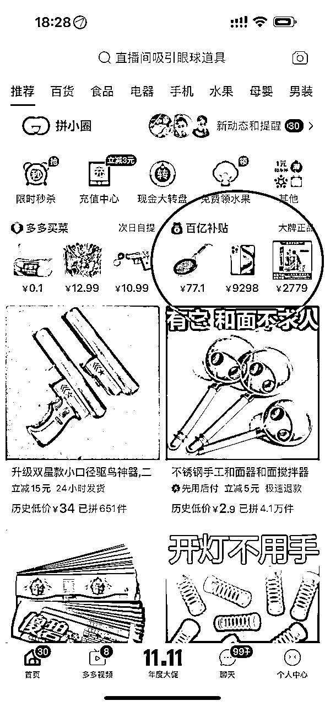

# 《如何在撸货与票务行业快速破冰》

> 来源：[https://pqk61b9yv25.feishu.cn/docx/PH7WdxqlJoKWGpxwNjVc5ydZnHb](https://pqk61b9yv25.feishu.cn/docx/PH7WdxqlJoKWGpxwNjVc5ydZnHb)

大家好，我是尤校长，今天赶在双11之前再给大家分享一篇撸货与票务破冰篇

让大家能迅速拿到结果，并且可以放大，无干货不分享

直接开整，上干货！

# 一：撸货之百亿补贴

一,1拼多多百亿补贴

拿起你手的机，打开拼多多，找到百亿补贴栏目，寻找以下几款产品，苹果手机，茅台，美妆，游戏机，就拿着几个给大家举列子。今天是2023年10月23号。

1，手机举例

找到苹果15proMax 256 原色，下单购买价格是9498（需要整点领券）

今日15proMax256G原色 实时回收行情9850，拿这个时候中间实际差生的差价是352，也就是我们下单时的利润。

9850（回收行情）-9498（下单本金）=352（利润）

2，茅台举例

最后的下单价格是5169，我们来看下今天的实时回收行情是2670

正常一单2瓶，2670是单瓶的价格，2670X2=5340、 5340（回收行情）-5169（下单本金）=171(利润)

3，游戏机举例

搜索游戏机，找到SWITCH，日版，白色

下单的价格是1725，我们来看下今天的事实回收行情

实时回收行情1760，下单价格1725。 1760-1725=35（利润）

4,美妆举例

雅诗兰黛小棕瓶，两瓶装。单瓶实时回收行情440。440*2=880-829=51（利润）

相比来说，美妆和数码的优势各不相同。美妆利润小，但是成本也小，利润率比较大。但是数码相对来说就是本金大，利润也相对大一些。

以上只是随便拿拼多多一个平台其中几款产品举个列子。实际有利润的产品还有很多，像抖音，快手，淘宝，京东的百亿补贴类似有利润的产品也有很多，大家可以参考着来，逻辑是一样的。正常下的货都是硬通货，流动性比较强，都是有专门人回收的。

但是拼多多平台有防黄牛机制，并不是能让你一个人无限下，有的时候也存在下货会自动退款的情况（行业属于称之为：砍单），正常的发货几率只有在40%左右。那我们如何尽量避免砍单呢，给大家分享一个砍单技巧。

# 总结：

给大家解释下百亿补贴的逻辑和产业链：

这其中每一个环节都是有利润的，也是形成闭环的。

黄牛挣了商家的差价，把货出货给档口。档口挣了收货的钱，把货供给电商平台的商家，商家再把货上架到平台卖给用户（黄牛），挣了平台补贴的政策钱。因为有百亿补贴活动，流量进来了，销量和数据都有了，股票自然蹭蹭长，平台就能挣到股民的钱。

百亿补贴是属于行业最基本，最低级，最无脑的玩法。非常的简单

其逻辑只需要掌握两点：人头，资金。

把人头利用率利用到极致，把资金利用率利用到极致。

人头方面：如果你人头够多，那么此时对你来讲，砍单已经不是什么问题

当拼多多砍单的时候，资金快速收回来，立马去找下一个人下，因为你不缺人头。只需要解决如何找到更多的人持续下单就行了。比如你有团队，一天找100个人，发货率在40%，那一天发货就有40单。砍单了60%怎么办？？？不要纠结，继续找人下。

资金方面：正常各大平台，发货是有周期的，一般2-3天发货，到货时间两天，你在出货也需要1-2天。

大概意思就是你下货一单产品，你的资金回流时效在一周左右。这个时候如果你想要放大收益，下更多的货，必须要解决资金的问题。

是不是很无脑，很简单？其实很多人对这行业有很大误区，认为撸货就是拼多多下货，自己下个两单，账号黑了，平台开始砍单了，不给发货了，就感觉行业不行。其实不是行业不行，更多的是你思维不行。

给大家安排点精彩的故事

我是如何做到去足疗店洗脚不花钱还能挣钱？？？

很简单，和我心爱的98号技师谈谈心，让她帮我下一单拼多多到店里，过几天我过来拿。

她可能跑路吗？不可能，因为她一个月的工资可比我的货高多了，每个人上班公司都是要实名登记留底的，再说工资还压在公司呢。

我不仅能挣钱，我还能拉进我和她的距离，后期还被我转化成了找我买演唱会的客户。

核心技巧是什么？我下次来还点你

是不是学废了？

再教你一招，你们家楼下有沙县小吃吗？有兰州拉面吗？有黄焖鸡米饭吗？

去找老板下，资金你来出，就寄到店里来。记得吃饭多点两个鸡腿。

老板开了十几年的年了，可能跑路吗？

有很多人宁愿天天在那抱怨和纠结拼多多砍单的问题，他也不愿意多动动脑子想方法多找点人下单。

知不知道工厂里打螺丝一天工作12小时也挣不到300块，你现在只需要花3分钟时间去说通一个人帮你下一单拼多多你就能挣300多，说不通，不愿意下的让他滚蛋，赶紧去找下一个人下，不要尝试去把一个弯的钢筋给他掰直，那样只会浪费你的时间。

送大家一句话：有志者千方百计，无志者千难万难！

# 二:撸货之葫芦娃茅台抽签

#小程序://新联惠购/iBv4JN7yZancoGB

#小程序://贵旅优品/geldDHLX1vi8iCD

#小程序://空港乐购/QARsRKfuhQpUJ4g

#小程序://贵盐黔品/xn1xSjwFVHYICVg

#小程序://遵航出山/Cw8UgqyaHH5MjTq

#小程序://乐旅商城/9x55IQRswG6A2Jb

#小程序://航旅黔购/8PpYxSkynH2zxve

以上都是贵州特产平台的小程序链接

1、什么是葫芦娃平台？

葫芦娃平台是贵州省内国企主导的特产搭售茅台扶贫平台，包括贵旅优品、空港乐购、新联惠购、尊航出山、驿路黔寻、乐旅商城、贵盐黔品等七大平台，因为长得差不多，戏称“葫芦娃”平台。

2、如何注册和预约？

微信搜索上述七个平台名称，找到相应的小程序，输入姓名、手机、身份证号信息注册，即可预约。预约活动不是每天都有，具体看平台公告或群通知。

3、怎么查中签？

预约后次日10点整，收到短信代表中签，没收到就表示未中签。平台放量时，中签率约千分之四。

4、中签后怎么办？

自己垫资购买特产，找我下指定特产返现，另外茅台到货可以卖给我。

5、中签后如何购买茅台？

中签指的是特产购买资格，中一签可购买不超过1480元特产，特产每消费1元，平台积1分，700分可1499元换购一瓶茅台。购买1400元特产，积1400分，可平价换购2瓶茅台。

6、中一签利润多少？

利润是根据飞天的实时价格和平台补贴变动的，我们算下成本：

（1）购买特产成本：1400（1400-1480之间）

（2）购买飞天成本：1499*2=2998

（3）快递费：60

以上合计4538元

飞天按照2650元/瓶计算，两瓶是5300元，减去成本，利润为862元。中签后，找做特产的人报单，下指定特产，次日另返几百元，目前大概特产是返现500左右（根据不同特产返现金额略有差异），也就是利润可以做到1300多。

举列：

7、中签后多久可以收到茅台？

我们按时间流计算：

（1）10点中签，12点-18点下单买特产

（2）5天后，收到特产，确认收货。

（3）收货第8天，平台有积分。

（4）积分兑换购酒券，购买茅台，5天左右到货。

因为中签需要投资4538元，18天左右收到茅台。

8、为什么报单可以返现？

因为商户在葫芦娃平台卖特产，需要缴一笔不菲的上架费，跟房租类似，为了把上架费赚回来，商户给补贴冲量。

9、有什么注意事项？

（1）三要素一致，即注册姓名、手机号、身份证号为同一个人，不一致中签后无法付款。

（2）付款需要刷脸认证，如果拿父母信息注册，付款时需要父母在旁边。

（3）地址尽量中签后填写，一单填写无法修改。

（4）收到茅台后，不要开快递，不要验货，直接卖盲盒，一瓶利润多5块，还包瑕疵。

10、平台有没有黑号一说？

根据实践观测，新号明显的中签率更高，那么地址相同的一堆老号，自平台改为抽签制后，往往一单没中过。我个人觉得平台是有盾的，毕竟i茅台这个技术已经很成熟了，程序员把i茅台的代码复制过来就可以用了。因此，特别注意下，开新号时，地址尽量不要使用过去老号的地址，堆号预约也不要同开wifi。

# 总结：

核心玩法：就是拼人头，拼号多。号少那你只能拼运气。对于那些长期做互联网的人，有流量有私域的人相当于捡钱。只需要参加抽签就可以了，没有任何的操作难度，中签了就是1300+的利润。

# 三：I茅台抽签

每天早上9-10点预约，下午出结果。利润分别在300和400没有技巧，这个就全凭运气了。

以上几个小项目相对来说对有人头的人非常友好，在行业里一些优秀的在校大学生做的就非常好，因为学生不缺人头，大四老生走了，大一新生又来了。人头取之不尽用之不竭！

# 《票务快速破冰》

票务的模式玩法有很多，每场演出自己运用到的也不一样

小白需要弄懂什么？

学会自己使用各类相关APP，例如我们常见的大麦、猫眼、纷玩岛等

知道什么时候开抢，知道开放哪些场次以及注意事项（一般大麦找到这场演出下面会有官方文件写明），座位图，日期价位等

票分强实名和非强实名。强实名用客户信息去代拍 在此就不多阐述了。其次就是非强实名。非强实名的有转增和改地址。转增是电子票，一般我们都是用手机号转增，比较方便点，转增是需要等到官方开转增了 票夹里面才会出现转增按钮，一般你同行群都会有信息流通知道的。你这边复制输入客户手机号点击转赠后，需要对方（手机号主）来接收即为成功。转赠方点击转赠后，会收到大麦短信的，截图给客户就好了。 改地址的是纸质票，与同行交易成功后，同行给你客户地址，你把这个地址发给你的抢手，操作步骤是，把客户地址添加到你大麦app里，然后修改新地址，选择客户地址，点击保存即可，这个过程需要录屏，然后改好之后截屏，最后把截屏和录屏一起发给同行或客户，不要问为什么还有这一个步骤，这是票圈的规矩，为了证实你已经改过或转赠。 改过地址后，静静等待官方出票后，直接寄到客户地址。在这个时间段内，官方会出座位，在你的票夹上会显示，有时候交易过的同行找你要，截个图或录屏给他即可。

然后是猫眼和纷玩岛，几乎都是纸质票，需要等到官方出票后寄到抢票人地址后，再进行转寄到客户地址即可。

后期成长起来了，你需要用到的不只是在公域+私域的方式去卖票，而是成为商家。

基础app就是大麦 猫眼 纷玩岛 摩天轮 永乐 票星球等。

实际上是有黄牛app存在的，例如摩天轮就是，摩天轮上的票都是根据市场行情溢价后放出来的票，上面的商家都是我们这个业界各个同行，还有一个程序叫做票小二，也是黄牛平台，跟摩天轮的区别所在是：摩天轮是可以搜得到的，路人 粉丝等都可以搜到的，这是一款app和小程序，票小二不同，这个只有小程序，而且是只能通过内部人员邀请码并且把小程序分享给你，你才可以用，后面可以找我拿.但是不允许外流. 票小二通常是我们黄牛之间用来参考行情用的，一般是比摩天轮低个几十上百不等。

票小二的页面上有个《代拍大师》这个东西，是用来接强实名代拍的，成功入驻后，上面的客服会给你派单，这个步骤是免除了你自己去找一手客户信息，你可以选择把这些单子放出去或者不放出去，一般都是选择放出去，为了增加概率，当然，拍不到也没关系。拍到就有钱赚。

票小二和摩天轮有一个共同的后台，<卖家宝app>,入驻卖家宝app是需要资质的:三个经纪人许可证,一个演出许可证,三个月社保,一个挂靠公司,市场上价格大概在9k+上下浮动,因为每隔一段时间 或者因为地区不同,所需要的资质就不同,所花费的费用就不同

票务的模式玩法分为抢票、卖票、扒皮、做空做多、知识付费、

1.抢票

在你的抢手基数足够大的时候，如果这场演出不是强实名且有利润空间的情况下，不论在什么平台抢，一定要提前设置好观影人信息，最好是两个。因为有的演出只支持一证一票，有的是可以一证两票，具体根据演出而定。绑定的信息不要有错误，跟姓名符合。然后写好收货地址。选好日期和价位，点击 想看 然后保存好。预约抢票那里有个抢票攻略，填好就可以了，就是我以上说的那些。非实名制的，可以根据行情加上溢价转手。强势名制的就得需要填写客户的身份信息去抢，客户信息一般都是市场上流通出来的，这种一定要看好客户要求，日期 价位 几张，抢错的话很麻烦，要么客户不愿意给那么多，要么客户直接不要，你就得去退票，如果退不了就只能自己买单了。

抢到正确的客户信息实名票，就去找放这个单子（放客户信息的人）的人报单，截图 录屏发给他，一般对方统计完之后就会统一结账。

可以自己单独抢票，不过不是每次都能抢得到的，手速，网速，付款速度都是重要因素。也可以组织人一起抢票，也就是你让你的抢手们去抢票，同等原理。非实名票，你可以拿出去卖，给你抢手结一部分佣金即可，多少佣金你说的算，因为市场行情在你手里把控，再者也是因为你带着你的抢手赚钱的，没有你，你的抢手也赚不到这个钱。注意风险，不要乱抢票，不要是个演出都要去抢，演出的火热程度决定着赚与亏，只有当市场供不应求的时候，这个票才会有溢价空间的，从而才有得赚。组织你的抢手去抢票的时候，一定要给你的抢手们传达正确的信息，不要让他们抢错，不然要么你为了挽留这个抢手，你来买单，要么你损失一个抢手的信任度。

同时，你的抢手抢到票了 要确保这个抢手安全可靠，不会跑路放你鸽子，不然你如果把这个票卖出去了，他鸽子了，你就要自己花钱来补这一对的损失。千万不要因小失大。

2.卖票

卖票是维持一个票务的最大盈利来源，卖票的方法有很多，但是万变不离其宗还是离不了卖客户或者卖同行。

2.1卖同行：

利润要比卖客户低一些，但是比较好出，更多的适用于你前期粉丝客户较少的.情况下。同行贸易是在贸易群里搭配的，看见别人发的信息或者自己放信息出去，你收了下面抢手的票之后就可以在贸易群里放出这些信息，或者你有客户需求也可以去群里找。一般票圈交易规则是有8/9个共同群聊或者找到担保人即双方都认识且靠谱的人。贸易群配单关键词例如：9.17武汉张学友1980连。连就是连坐的意思，单张后面不作标记， 日期+站点+明星+价位+几张。日期站点明星这三个可以随便组，因为很多黄牛发单子的前后词语顺序不一样，多找找就好了。找到了之后你要确保有这个客户需求即你需要的这个单子是的确需要，的确存在的，而不是非确定性的，不然你去问了同行然后不要，说什么以打款为准，这样可能会被同行判定为鸽子行为。票圈是很忌讳鸽子和跑路的行为的。重点，一定切记，如果真的发生了这样的事情可以自己转个小红包或者找其他人甄别

演唱会开演前如果有客户问你，这个时候可以促成提前成交，也就是预付定金，都是可以找到相关海报的

2.2卖客户

私域（微信+QQ）+公域（流量平台：咸鱼/抖音/微博/小红书）

客户不像我们黄牛那么标准，客户的问票方式大概是：五月天有吗？/16号855有吗？等等这一类信息不全的问票方式，这个时候不要觉得烦，交易都是一步一步来的。明确的告诉客户，您需要什么明星 站点 日期 几张（两张默认连坐 3张及以上就尽量去找，价格也更贵 你赚的也更多）。中低端（演唱会中低价位）的客户是更多的一类人群。在跟客户聊天的过程中，客户给你报了什么价位的票，例如是855价位的，那么客户的接受程度大概就是在855以上多点，因为这个预算是包含了溢价。很多客户都是酱油党或者比价的。第一次交谈的客户基本上都是几十个问的成交的少。这个概率很正常，不要因为有客户在咨询你了，你就心情激动，更不要因为客户不买而烦心。这些事情是很正常的事情，你在这行做久了就明白了。就跟你去卖一件商品是一样的道理，不是每个客户都会百分百成交，所以自己的心情一定要控制好。另外，价格合适，才更容易卖出去，这里说的是你吃到自己应有的利润，不要报的太虚高就行。当然，随着你做票务的时间长短，总会遇到那种顶级客户，愿意花天价来买这个票，当然前提还是这个票在市场上很火热，供不应求，例如TFboys，周杰伦 blackpink等 。跟客户聊天的过程很重要，因为交易是否成功取决于你的发言和让客户的信任程度+价格是否合适。聊天是一门很深的学问，嘴一定要甜，然后你的朋友圈或者其他平台发的作品及商品一定要有，这些是给客户侧面印证的最好凭据，其次是客户让你给他看实拍票图或截图等等，树立信任基础，拿下客户的信任后，这个时候离成交也就不远了。

3.扒皮

也就是我们业界的大白话，提篮子。扒皮，扒谁的皮？同行的。这种主要是靠混迹在同行贸易群里。自身需要一定的沉淀，脑海里掌握的知识和随着时间的积累，对行情的把控。因为这里会涉及到收票，如果行情跌下去 你可能也会亏钱，当然 如果你能捏得住，而且后面行情又涨上来 那该赚还是赚。 首先，在一个很火热的一场演唱会开盘后，立马去收票，收中高价位的连坐，多连坐少收。举个例子，周杰伦2000连，刚开盘基本上都是在8500左右，那么在这样一个顶流加持下，行情必然是呈上涨趋势，过几天在行情涨到10500的时候你抛掉 卖给其他同行，那么一对就赚2000，你在刚开盘的时候收10对，需要花费的本金是8.5w，10对给你带来的收益是2w。你收的越多赚的越多。如果你在行情11500的时候抛掉，那么一对赚3000，以此类推。此方法有风险，大量收票前，谨慎参考或者多问我。 另一种，非大量收票，但是需要你多花时间盯着同行贸易群看，看什么呢，看有没有同一场演唱会同一个日期价位单连或者多连的卖家与买家。 随着做票务的时间越来越久，你的同行贸易群也会越来越多，那么你多多少少都会有一些韭菜群，像你现在刚开始不是那么懂行一样的人以及外围。这类人出票的价格就很低，你盯着一些群，发现在同一场演唱会 日期价位都一样的时候，出现了卖家和买家。去计算他们的出收价。中间如果有差额，那么中间这个利润，你就可以吃的到，这个时候你来联系双方，在卖家对方角色里，你是买家，在买家对方角色里你是卖家。收过来的票，不要先改你地址，或者转增，跟买家协商好后 确认好信息，发给卖家，让卖家售后即可。 还有一种就是，有同行有客户需求，但是找不到他需要的票，他可能明盘或者不明盘，明盘你直接去看行情即可，他找不到在求的票，那一定是比较刁钻的位置，这个时候就需要你多花点时间精力，前提是你一定先看大盘行情，中间有利润，有你想要的利润，再去做这件事情。不然是在浪费你的时间。不明盘的话也是需要你先看行情，再去试探他给的价格，有利润再行动，没有或不高 则不值得去花费这样的精力去扒这个皮。 这个适合你后期有了一定数量的贸易群后才能实现，前期贸易群不多的情况下，扒皮能赚的很少。

4.做空做多

这个玩法需要一部分资金，且具有一定的风险性，在没有搞清楚0-1的逻辑后，不要去碰

做空可以简单的理解为赌跌

举个很简单的例子：在一场演出开盘后，我卖给了你30对2000价位的连坐，但是实际上我是没有这30对的，这个时候票款你已经打给我了，在过段时间后，行情跌了一部分，我再从别的同行手里凑够30对给你交付，那么一开始你给我打的一对票钱减去跌的这部分，中间的差额就是你的利润

做多：可以简单的理解为赌涨

在一场演出开盘或之后，收很多对票，举个很简单的例子，拿周杰伦来讲，最高价位的是2000连坐，开盘后价格大概在8500一对，周杰伦肯定是必涨的，8500*50=425000，这是你所需要花费的本金，那么在开盘过几天后，比如2000连现在行情是1万，与你刚开始收的票存在每对1500的差额，如果这个时候你转手抛掉，1500*50=75000，这个就是你的利润，

5.知识付费

宇宙第一尽头是带货，第二是知识付费，也是之前我讲的卖气球的故事的六种模式

等你已经熟练掌握票务的玩法之后，你也可以去收代理，收徒弟，比如488一个代理，帮你卖票等等，或者收徒弟1888，把玩法模式教授于他等等，这个要看你自己怎么理解与创新，第三种是月费群，这个主要是汇集同行，比如你创建一个一手的强实名代拍信息，或者你把你所有所看到的代拍信息放到这个群里，每单你只抽15块钱，模式也很多，重点在于自己的想法，和能给对方提供什么，利益共存的情况下才会存在。

以上是模式玩法，下面来讲讲引流篇

短视频篇：

抖音/快手这两个短视频平台都不陌生，大部分人都只是在上面刷视频娱乐用，而另一部分则是利用平台来赚钱，推广，发视频，接广告等等各种方法，那么我们所涉及到的就是引流，具体该如何引流。

1，坚持发视频，发视频的重心是在于引流粉丝客户，视频不要模糊，注意时长，相关的可以去搜搜那些专门做某个明星领域的视频号参考，视频内容通常都是一些明星的演唱会切片（回放片段），以及一些综艺之类的，搬运的时候不要全部照抄一个作者的，要找好几个然后剪辑在一起，然后在片头或者视频中间片尾加上字幕，整体不要留下别人的水印，这种小工具在微信小程序随便一搜就有。发布视频的时候可以直接上橱窗，某某演出的票，标上售价即可。或者不上架橱窗，带上标题，#号，然后后面就是关键词，比如薛之谦演唱会就是：#薛之谦天外来物巡回演唱会#薛之谦演唱会门票等等 都可以采取，带上标签是为了引官方流量，增大你的视频曝光浏览量。然后有人在评论区问，这种是比较扎眼的，直接回复私即可，然后你直接私信对接就好了。或者别人直接私信你等等。

2：开直播

开直播的作用是在于引流抢手和韭菜，一定要坚持开直播，敲重点！坚持直播一定会有收获的

开播这件事情，可能很多人都做不到，但是你不去尝试怎知结果，不要去质疑。因为你想的东西，已经有人去实践并且取得了很大的成果。所以一定要克服恐惧开播 不好意思的心理反应。一定！

那么前期你开播一定是没有人去观看的，在你的主业放上你的地球号，发点行业相关视频，需要去同行直播间多连麦多说话，分享输出你的知识和干货，浅浅透露一点即可，或者最近收益怎么样，随便装个逼就行，每次要互关，跟主播互关，抢手就不必了。多坚持，慢慢的会有越来越多的抢手关注你，开播后打开你的麦序模式，多鼓励别人连麦，有人问你问题直接回答即可，过多的话术就不用我说了吧，什么欢迎老铁 谁谁谁，然后注意直播间违规用词等，电商平台 微信 转账什么的都是。随后加了你微信后，后面直接对接拉到抢手群就好了，小白的话给他大概普及一下这方面知识，让他明白能赚到钱，一开始可能只是观望，多在枪手群发点抢到票或者其他活动的截图，随后发点红包，然后定期清人，踢掉那些不参与活动的抢手。

流量平台篇

小红书：发作品

发作品的内容是某某演唱会门票，你手里有什么票需要卖出去，就去找这个官方海报，然后在官方海报上打上自己编辑的文字，什么有票阿 质量保证阿 杂七杂八的都行，可以搜搜别人的参考，然后配上文字，比如天津周杰伦门票有偿转让，这简短的一句话已经写明了信息，站点 明星 溢价然后你的意图。为什么不写价位，因为转让这个词一定是量小的，证明你手里没多少，而你不明着说，如果有人在评论区问你或者私信你，你直接说要什么价位的，给客户配单就行，然后引流到微信里，加好友。小红书的人很屌丝，经常举报你或者系统检测到，作品经常发出去两天会判定为违规，如果真的遇到这种瓶颈，那就采用矩阵的方式，用多个号去做就行。成交与否的客户都可以给他发你的微信号，有时候会屏蔽，分开发就行，然后引流到你私域里，坚持做 一定会有效果

钓鱼帖：

在别人帖子评论

比如别人发的帖子是：一人说一个瞒着父母的高消费/戒不掉又烧钱的爱好等等等等

这种主要是营造装逼的假象，以假乱真。评论什么的，最近一年挣了一百万 两百万 三百万然后买了车子或者房子或者给女的花了多少钱等 你自己编就行了，然后说什么在外地，父母浑然不知， 再续上从小家境不好，营造家里条件或者关系不好的假象，然后过两天再发作品，证实你之前第一次评论的东西，比如你说买了车，那就晒豪车，买了房子那就晒房，图片或者视频一定要高清无水印，然后配上文字，总有人质疑我 没有必要眼红，再说点装逼的文案。总之就是为了衬托你第一次发的话。 这个时间段内肯定会有很多人看到你发的话，点开你的头像看你的作品，然后很多人会问你做什么的，带带他，这个时候机会就来了，当然 这个时候你还需要保持谦虚，就运气好赚了点小钱，不值一提，一般不带人，你真想做的话可以带你做做兼职， 这个时候不就ok了吗，直接引流到微信里，让问你的人加你微信号，这是我本人亲测实践过的事情，有效果！

微博篇

微博也是流量平台，要大于小红书的，发的帖子格式是跟小红书差不多的，可以发视频图片或者纯文字版。然后发布的时候带上热点话题也就是#号后面加上关键词即可。这方面就不多说了，然后微博有个作用就是有个 话题“实时”功能，比如哪场演唱会刚开盘抢完，你去微博顶部搜索这个关键词，有个实时按钮，点进去，会看到很多人在吐槽没抢到阿怎么怎么样，这个时候你可以给别人留言或者直接私信他，说你这里有票，然后带有溢价，接受的来。

微博还有个功能那就是超话粉丝群，平时去签到打卡做个小任务什么的，积累等级，然后成为超话的一员，然后找机会打进粉丝群内部，如果这个明星开了演唱会 会有很多粉丝抢不到票，会在群里吐槽，你看谁说没抢到，直接私信 或者内敛的直接在群里说你认识个黄牛，保真价格不贵等等话语，其实这个黄牛的微信就是你自己，然后直接引流就好了，很暴力。

咸鱼篇

咸鱼上卖票是比较多的一个平台，上面的酱油党 傻x是真的多，但是客户也是真的多，虽然每天问票的人多的一批，但是最终跟你成交的很少。要正视这个百分比，这是很正常的一件事情，不止你一个人，大家都是。咸鱼这个平台是二手交易平台，但是我们去发布卖票信息的时候属于一手售卖，不退不换的。你需要卖什么票，就上传什么演出的官方海报，然后还是一样的道理，在图片上加上自己编辑的文字或者logo，因为大多数人都是普通的海报，你做这个就比较精细，很扎眼，路人一眼就能看到，更大的概率能点进来看你发布的帖子。

文字排版大概如下：

出天津周杰伦演唱会门票

9.8-12，全日期全价位单张连坐都有

拍下不退不换

个人原因强制退款扣除20%手续费

不是钓鱼贴 不卖低价票 拍下确保有票

诚信票务 涨跌不鸽

鸽子勿扰 同行勿扰 酱油党勿扰

不要耽误彼此时间 对你我都好 感谢支持

这只是举个例子，详情可以去顶部搜索关键词，看下别人发布的内容，都不一样，采取一下就好了，尽量不要和别人重复。咸鱼也会有违规提示，这里还是推荐用矩阵的方式去做号，因为真的很好用。然后发布商品后打开设置，设置自动回复，可以是您好我现在不再请稍等，也可以直接是我现在不在，有问题加我绿泡泡，直接引流

咸鱼上的流量曝光如何去做

一方面是自然流，即为官方推给你的流量

一方面是自己花费咸鱼币推流，咸鱼币淘宝买，3块钱一万，很便宜，然后发布完作品后到首页签到处那里，打开咸鱼币抵扣，直接10%拉满，获得的曝光量更多，不要怕钱变少了，正常没人有那么多咸鱼币，而且你是重新开个链接发给客户，所有不要担心。然后成交了的或者有咨询你的客户，都可以让他们添加你的微信，也是一种引流。

咸鱼上面成交的客户，咸鱼这个平台会压资金，这个资金需要你自己先垫资，只有在客户签收后这个资金才会打到你的账户里，除此之外15天自动确认收货。你在给客户交谈的过程中一定要提到，你给客户转赠/改地址/客户纸质票收到后一定要让客户确认，不然后面如果客户反悔申请退货退款什么的，那你就吃大亏了，你去申请咸鱼小法庭一般55开，因为咱们这个是属于门票非法加价倒卖，不属于正常转让范畴内。 所以尽量在微信或者支付宝成交，就不要在咸鱼，省去不必要的麻烦，这个要看你自己说话的精髓了

以上是常见平台引流方法，说的都很具体 都是细节，多看看，自己的私域一定要不断的扩大，不管是谁，是个人都可以加。私域多了，日后你无论做什么项目，都更容易直接转化变现，粗暴好用！

摩天轮篇

摩天轮上是不止可以卖票的，也可以用来引流，很多人是不知道的，比如你去卖一场音乐节，卖了30单，那么平台上会有客户的联系方式，统一配票的时候，给客户挨个打电话，说你是摩天轮商家，是不是在我这里买了某某票，然后你要电子票转给客户，让客户加下你微信，这个也是我亲测过的，很好用，每次这样加个大几十个到上百个不等，演出类客户群体都是带有复购的，指不定哪天会找你买另一场 客户的维护很重要

破冰篇

第一层破冰: 即为掌握这些玩法 详情参考以上内容

第二层破冰：自己的私域客户和公域客户基数要不断扩大，只有自己强大了才有足够多的饭吃

第三层破冰：人脉和圈层，例如你认识了一些大牛且关系不错，那么长期以来你就可以吃到对方的资源，有独家的消息你第一时间就可以掌握，从而就可以吃到第一波红利。

## 本期分享先到此结束吧，写的有点累了，如果这篇文章反响还可以的话，下一期继续分享更多行业干货，你们的支持就是我的动力！马上双11了，行业里的线报最近也比较多，祝大家赚的盆满钵满！

## 记住口号：合格的黄牛向来都是先冲！剩下的交给七天无理由！