# 3.3.2 【日乾】QQ广告分成项目，单号100W播放量，变现2000+（保姆级教程）

> 来源：[https://ai4utyywcc2.feishu.cn/docx/QeKRdjJvEoiLGZxqyFPc7UkKnMf](https://ai4utyywcc2.feishu.cn/docx/QeKRdjJvEoiLGZxqyFPc7UkKnMf)

# 一、前言

大家好，我是日乾，今年刚毕业，00后小萌新一枚，2020-2021年电商某英语书籍细分类目第一，2022-2023自媒体全网40W粉丝，大学期间赚到自己第一个100。今年8月，风向标看到一个信息差，感觉是一个流量洼地，就安排了我这边一个剪辑的学生去实操，一个月时间，一个小白，最高单号100W播放量，变现2000+

## 1项目背景

*   首先，感谢奇杰大佬的混剪社群，自从加了他，学习了不少东西，其次是文少圈友发的风向标，我是一月前看到，然后就马上开始让人实操测试。

*   目前测试结果，可以批量放大，属于小型工作室第二梯队项目，收益不高，但还算稳定。我做的账号平均收益，万次播放量应该在5元左右。因为它实际的收入，是按广告曝光来算的，而不是视频播放量。1W广告曝光收入确实是50元，但是播放跟广告曝光大概在10:1左右。综合来看其实是偏低的，但是我个人认为，这个平台最大的好处是目前自由度很高，对于有内容的圈友可作为分发平台，对于小白，可作为一个入手项目，一个人10-15个账号去怼，对于小白每天收益还是相对客观的。

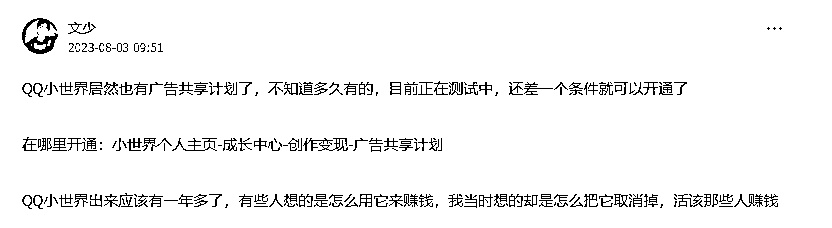

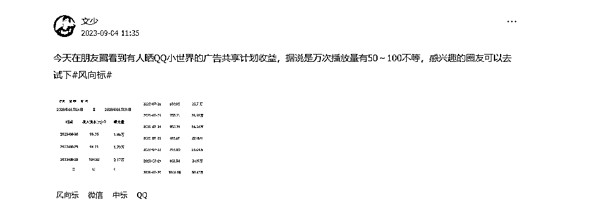

## 2QQ=流量金矿！

火过的内容会再火，但凡对自媒体稍有涉猎的朋友，这句话肯定如雷贯耳。以下是一个对标账号，她把一条视频重复发布多次，流量依然能大爆，说明QQ当下处于2022年以前的小红书，对原创度要求极低，急需内容进入。

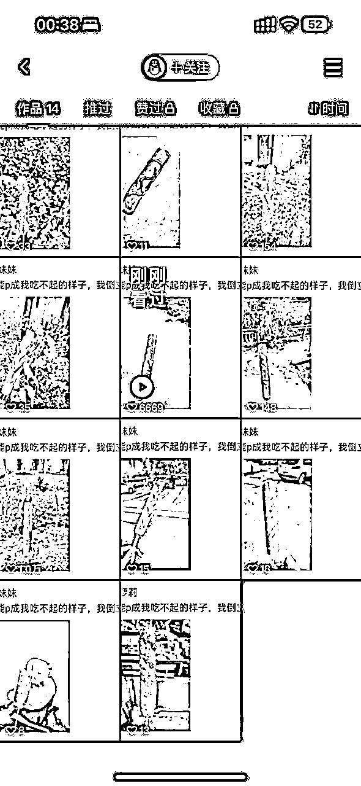

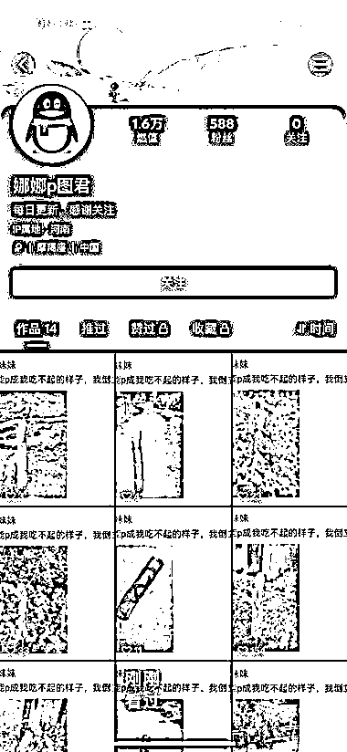

## 3我的账号

以下是我其中一个可以放出来的账号以及后台数据

【性别分布属于有效数据，但是年龄分布，经过我们测试发现除了0-18的大致相同，可作为有效数据，19-51年龄段的，我们所有同类型账号都呈现出不同比例，猜测是QQ不少用户年龄习惯性瞎报，所以可得出，0-18年龄段的人群确实是QQ小世界主要人群，估计在25-50%左右，然后其他年龄段的人群也有不少人会看QQ，跟大家认知中QQ只有未成年不一样】

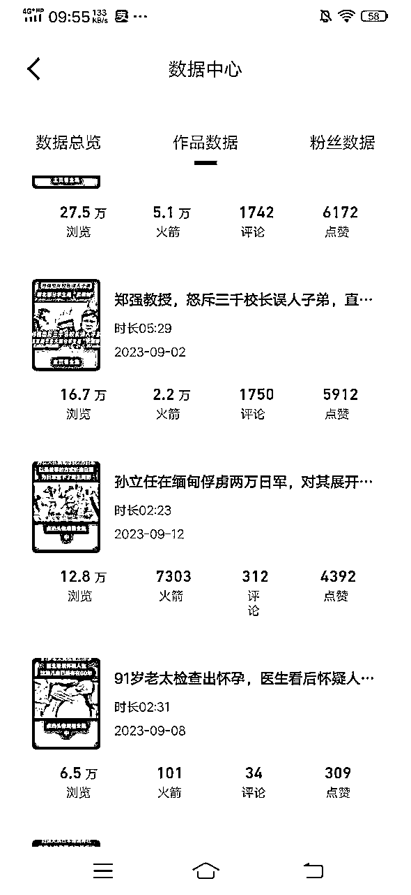

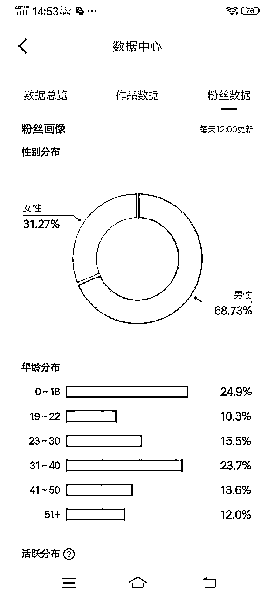

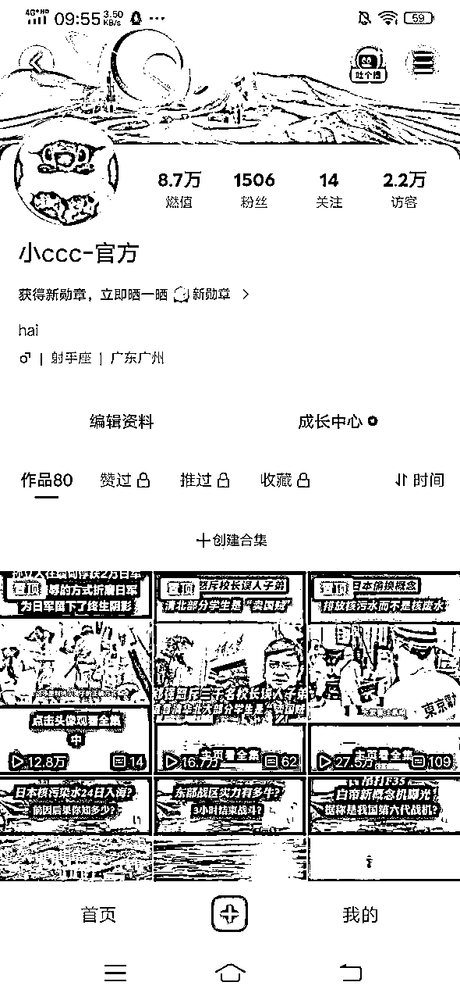

# 二、保姆级步骤教学

## 1账号定位

账号定位类型：其他类型可自测

*   爱国类

*   热点时事视频

*   历史性事件

*   有自己内容输出，可以把QQ作为分发平台

### A爱国类

根据大数据分析，月活6亿流量中50%是95-00后的年轻人群，但是有一个永恒不变的——就是“都有爱国之心”。这类视频就不放对标了，从2年前的正能量文案馆，科比文案馆，情感文案馆等等，都有这类大量的视频作为参考，非常容易剪辑。

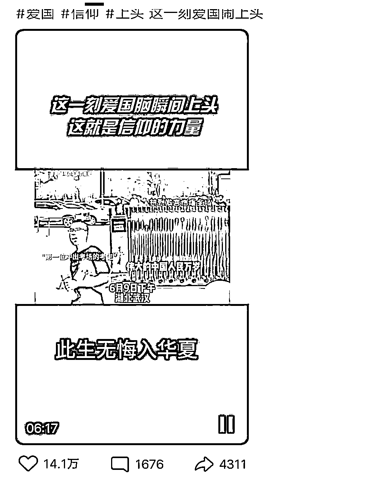

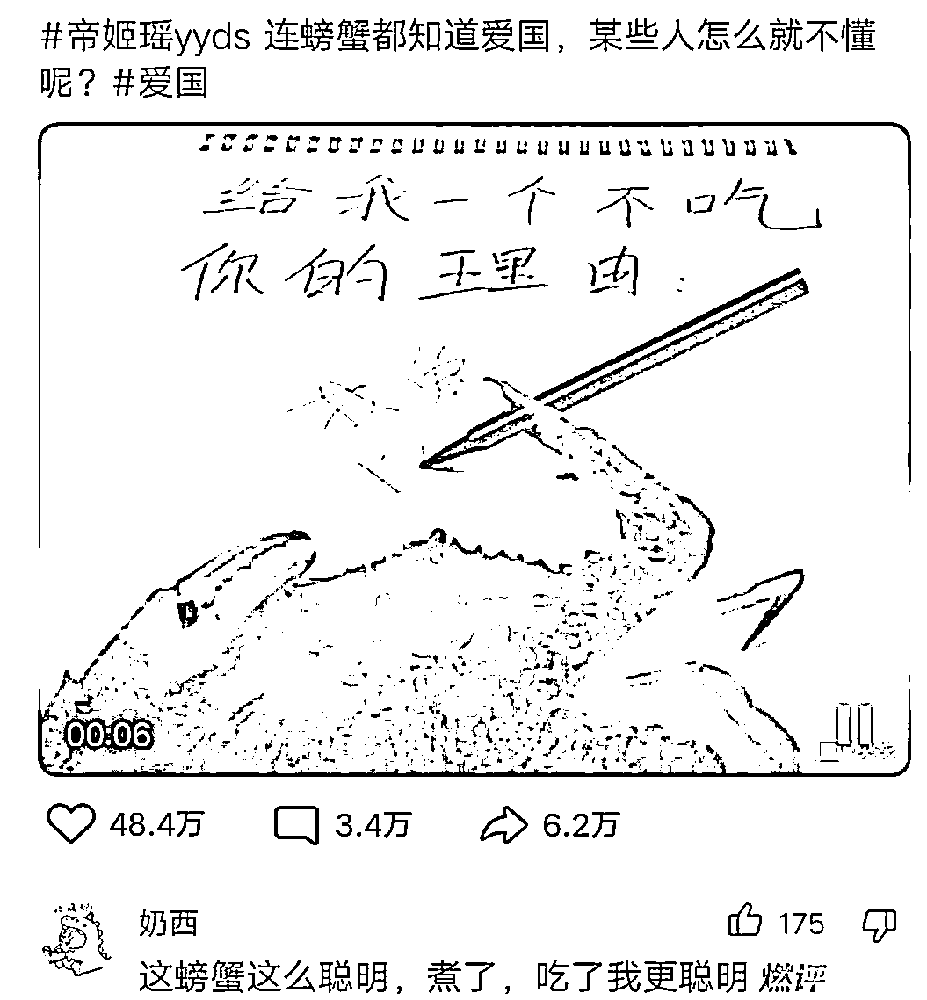

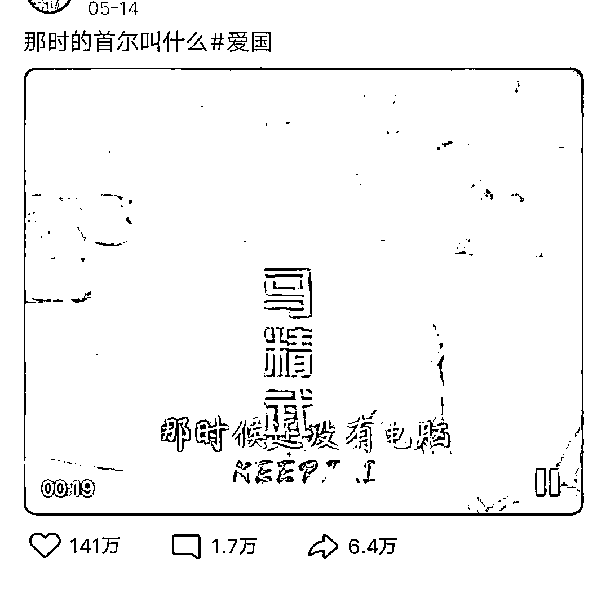

（以上是有关“爱国”主题的相关视频，我们可以看见，这类视频的点赞，评论，转发等数据都不错。）

### B热点事件

热点本身就自带流量，吃瓜可以说是我们人类潜藏的本性，如最近的吃瓜群项目，就又是有圈友直接收割几十万。所以，无论是QQ还是其他平台，如果想快速起号，除了影视，正能量外，热点事件也是一个利器。

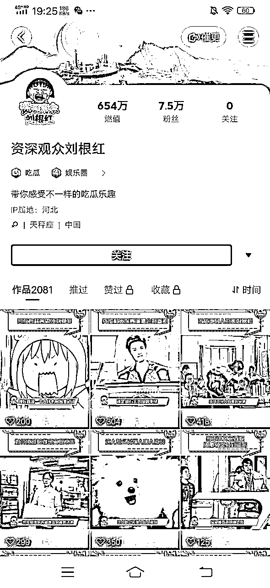

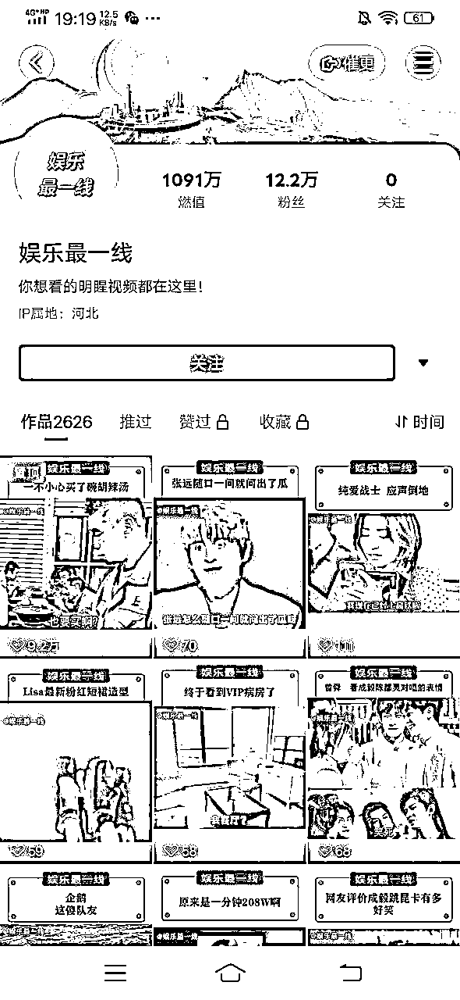

### C历史性事件（科普）

历史性事件，科普等，本质上是提供一种信息整理服务，也是一种内容的输出。这类账号往往可以持续很久，只要找好一个切入点，就可以一直深挖做一个系列，如下图1。

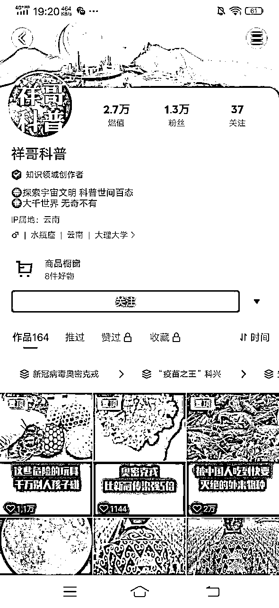

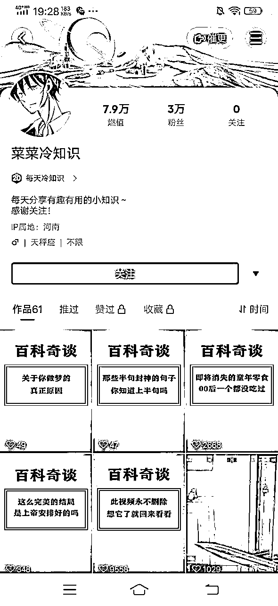

### D有自己内容输出

啥也不用说，一句话可以解释完毕~【因为被盗视频来到这里】，实际上，这就是一个流量洼地，只是目前QQ的关于内容的商业生态没有做起来，但对我们很多有自己内容的圈友来说，与其被人盗视频，还不如多分发一个平台，万一爆了呢。东边不火西边火，往往我们在A平台呕心沥血，B平台随意敷衍，反而敷衍的平台起来了，“人生大起大落的太快，实在太刺激了”。

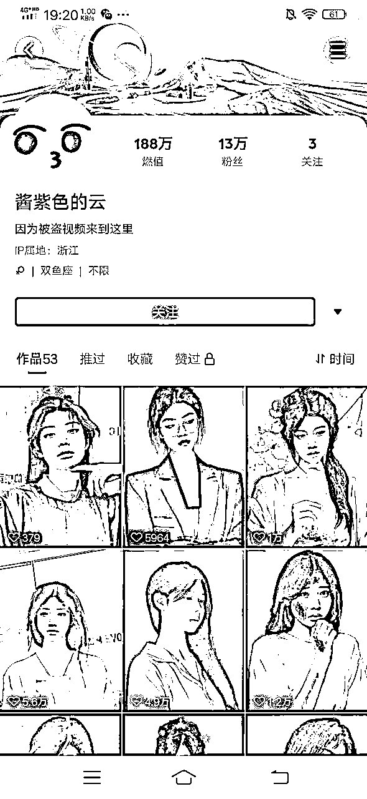

## 2账号准备

1.  注册至少七天后再开始发（一开始很多新号会发不出去）

1.  最好使用注册久一点的账号，之前发过作品也可以直接发，不过前期刚发可能流量不高，重新打标签会需要一段时间。

1.  前期可以不实名，后面到500粉丝再去实名

## 3账号昵称+个性签名+账号头像+背景图

*   账号昵称最好2个字，比较容易记

*   个性签名各类情感文案皆可

*   账号头像一目了然

*   背景图可动可不动，如果后期打算引流，背景图是一个好入口

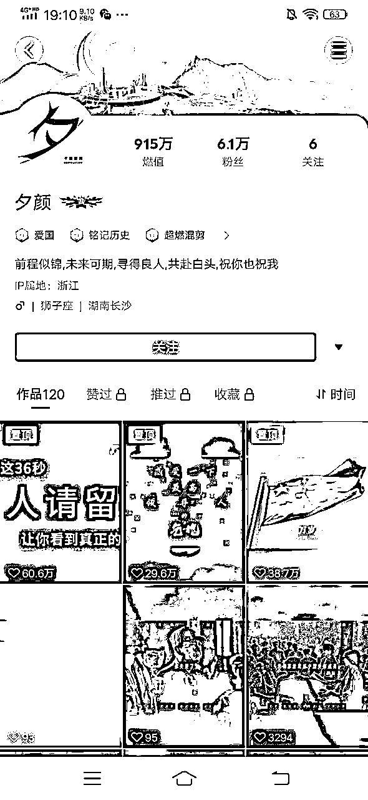

## 4养号

1.  不搜索，直接看系统推荐即可，每天1小时，持续3-7天

1.  刷到对标视频停留时间久一点，可以适当点赞评论，频率控制在1/3

## 5批量混剪

混剪技术，我也是一路学习奇杰大佬的混剪，前段时间还在奇杰大佬的素材交流分享群里面，拿到一大波崭新素材~，所以直接看奇杰大佬这个贴即可，会比我说的更好！目前我们一个小白学生通过反复学习我给的资料，效率可以做到单天80条混剪去重视频了。https://wx.zsxq.com/dweb2/index/topic_detail/214822451152541

我这里仅浅说一下，混剪核心就是素材去重，以素材为核心，通过抠像，蒙版，抽帧等等各种方式实现素材的原创度提高，以对抗平台的审核机制。而在素材达标以后，如何可以快速批量系统化的去重，就是我们这类小型工作室冲刺各种项目的资本。【以上可先看上述链接，如若有细节上的不懂，可以看一下咱生财航海的剪辑特训贴，特别特别详细，当初我要是有这资源，弯路怕是能少走无数~】

## 6视频发布时间及频次

*   发布时间：早上6-8///中午11-13///下午17-19///晚上10点后

*   发布频次：第一天1-3条///第三天开始3-5条///后续十条都行，只要你有时间（间隔时长：1小时+）

## 7账号运营：

*   但凡有一条视频1天内超过5000播放量，再发布1次，如果第二次播放量依旧5000，则可以再发第三次。

*   如果发布一星期了一点赞都没有就删了或者隐藏了，这样我们的账号首页就只有我们数据比较好的视频，也会引起更多的关注。

*   后续每天发布3-10条视频（原创、二次原创3条左右就行）

*   平时有空可以进小世界多刷刷视频----建议尽量多刷与你发布有关的视频

*   后续视频官方有显示推流就转发到朋友圈，偶尔转发就行

# 三、实战复盘

复盘之前，在这衷心感谢生财有术，真的是用心去做好这个平台，我是今年才加入的，但仅仅我这几个月获得的信息摄入就要比我这3年网创获得的优质信息还要多！！！【这里给大家分享一个我最近最深刻的体悟，找实操项目多看中标，补充认知差能自己打造项目的大佬多看风向标】

## 1从风向标里面发现异常值

星球里面有很多风向标，这个风向标最大的好处在于，可以给我们补充优质的信息差，而且是从不同人不同角度认为的优质信息差。只要利用得到，就可以发掘无数个需求，创造无数个好项目。

## 2从中标里面找适合自己项目

这个是最近刚知道的，我之前一直不知道中标和风向标区别，一直只看风向标，直到我进了风向标群才知道，原来有中标一说，也就是但凡中标的都是由亦仁哥筛选过觉得OK的项目，这个对于小白，或者视野不够的小工作室，帮助极大，可直接看中标，然后实操放大！

## 3项目复盘

*   目前，QQ项目，我是安排了1个兼职学生操作，总共怼了15个账号，成功跑出来4个账号，一个接近万粉，三个千粉，其他不成功的大部分都是500以下，并且有限流倾向。学生小白，但单纯靠执行力以及我线下给他们做的剪辑沙龙，偶尔问我一下，就把这个项目跑起来了。所以这个项目我觉得非常适合所有的小白入手。总实操时间一个月左右，开通收益2周，目前总收入2000左右，一个月稳定3000+。

*   项目胜在稳定，适合小白入局，我看他做的不错，已经安排了10个学生开始实操了。这个项目单纯就是无脑搬砖，执行力拉满就行。同时也适合工作室作为引流项目低价打包卖，主打增加学员信任，方便后期的高客单价转化。

# 四、引流布局

## 1倒流私域

这一块我想才是对于我们工作室长期有效的收益。倒流私域，目前QQ对于引流这块，并没有管控的特别严，并且白号也可以快速起号，可以快速倒流一波粉，不过根据我上面的粉丝画像分析，QQ这块50%人群都是95后-10后以及50%各年龄段的人群，就看大家怎么用了，如果大家有对这块私域感兴趣的，可以自己去测一下，这个也是我们现在在测试的，毕竟私域才是核心，播放量收益，薅个一年半载估计就开始降价了，诸如腾讯视频，中视频，所以我也只是给兼职学生去做，不作为自己的主项目。

## 2对标账号分享

大家可以看下述图片，直接在QQ视频里面发抖音二维码，个人简介上微信号，这是什么年代的蛮荒操作了，但是依旧没有被系统删除，视频甚至有推流，这就是一个巨大的异常值！！！

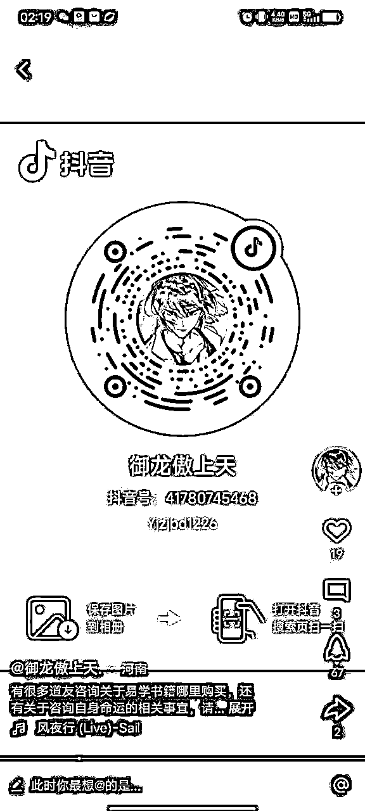

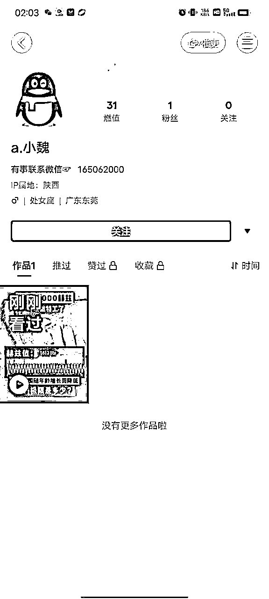

# 五、写到最后

*   这就是我们整个项目的实操步骤，我是让学生一比一还原了所有步骤，然后我来把全套步骤整理优化为SOP发出来的，希望这个SOP可以对大家从0-1冲刺QQ有所启发，希望帮助到大家~

*   如若还有不懂，欢迎沟通学习，对了真诚点赞，手留余香哦【我说的是我的生财帖哈哈哈哈哈】