# 0资源0背景学历普通的宝妈，如何跑通母婴赛道，2年赚到100w+？

> 来源：[https://bokm2adr1g.feishu.cn/docx/QhfUdTMYnoJVg2xTblKc4cIfncb](https://bokm2adr1g.feishu.cn/docx/QhfUdTMYnoJVg2xTblKc4cIfncb)

大家好，我是火羽白，一名95后创业型宝妈。

靠自己不服输的冲劲儿，在经历重度抑郁后，为治好女儿先天性甲减，2年时间内，深耕母婴赛道，成功变现100w+。

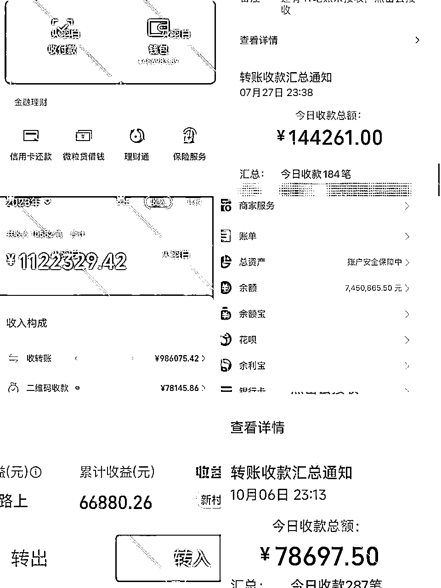

本文详细分享，我是如何在0资源、0背景，且普通学历的情况下，从一名普通宝妈，逆袭为日入14w的母婴产品供应链主理人的成长经验。

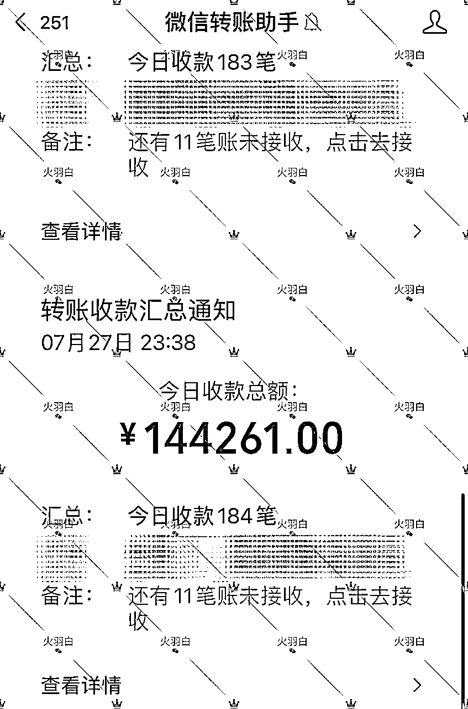

末尾有详细的宝妈带货实操经验分享，和我一样，学历一般，不甘于现状，想能做点副业增加收入的，

或是经济不独立，在家需要看老公脸色的，想给孩子树立一个好榜样的宝妈，都可以参考我的经验，开启赚钱副业之路。

# 一、为给女儿看病，开启母婴零售

## 1、原生家庭打压，女儿早产确诊先天性甲减

我在农村离异家庭长大，爸爸因重男轻女，在我很小时就离家出轨，不知所踪。妈妈、奶奶都觉得因为我，爸爸才不回家，所以对我只有无止境的打压，日常威胁遗弃。

14岁那年，唯一疼我的爷爷去世，我走投无路想到自杀，从3楼一跃而下，结果却只是骨折。

当时，家人都把我当拖油瓶，也不愿意供我继续读书，就把我扔到救助站，在派出所的帮助下，我才找到爸爸。

当时为了能赚钱养活自己，我在暑假就打工赚钱，早6晚6十二个小时连班倒，干了2个月才攒够上大专的学费。

后来借着不服输的性格，我自考了本科学市场营销做销售，因为我知道，想赚大钱只有做销售才行。

在我看来，女人还是要活出个人价值，保持终身学习，赚足够多的钱，才能有自立的能力，才能不用看任何人眼色讨生活。

这样的日子，在婚后仍旧如此，婆婆家里条件好，总是看不起我，我当时只有一个想法，要赚更多，有钱才有脸。

这也是为什么我嫁人后衣食无忧，却仍不甘于现状，想要努力赚钱的原因。

正是这份不服输的倔强，我孕期也没有停止工作，劳累过度导致女儿早产。

原本3月9日的预产期，但在2月8日就因高位破水紧急住院，打了三天催产针转剖腹产。

但最揪心的不只是早产，在新生儿检查时，女儿被发现是先天性甲减，医生说可能会影响孩子的智力发育。

当时，初为人母的喜悦瞬间被击溃，因为我怀孕的时候就是甲减，一直有在按时服药，没想到还是遗传到了女儿身上，真的是又自责又心疼。

好在医生告诉我，后期可以做专业治疗，有康复的可能。也正是医生这句话，让我恨不得拼了命的赚钱，比之前的信念更坚定。

当时，我暗下决心，一定要努力，赚更多的钱，给我女儿一个健康的身体。

因为我知道，作为学历不高、0背景、0资源的普通人，能救我和女儿的只有我自己。

## 2、为女儿努力，月子带货，因祸得福，开启母婴零售

坚定要努力赚钱的念头后，我在刚生完孩子的第5天，朋友圈就开始营业。

当时我三个小时喂一次奶，还要给宝宝喂药，换尿不湿，妈妈们应该都知道，新生儿阶段有多难熬，但是要赚钱的执念根深蒂固的在我脑海里，我不怕苦，我就怕没有钱。

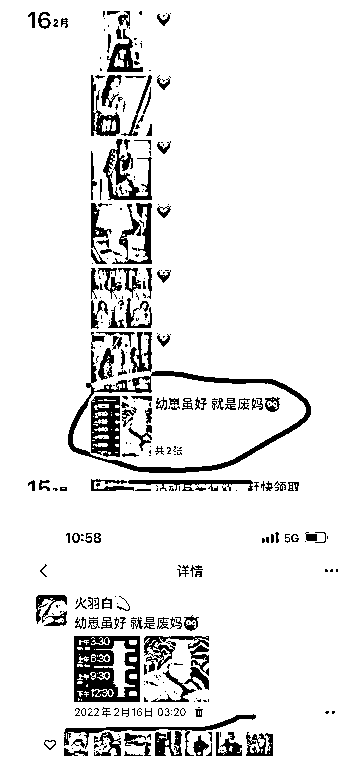

命运的齿轮在4月8日开始奇妙的转动。

当时我带着女儿去妇保院体检，因为我是在人民医院生的孩子，所以没有相关宝妈群，在排队等候时和周围宝妈聊天，才让她拉我进群。

因为很小就出社会闯荡做销售，所以我天生就比较活跃，我想着医院的群基本上都是科普和活动，不如我自己建个私下的宝妈群，大家一起交流蛮好的。

后来，这成为我的第一个零售群。

当时，我想带货但却没渠道，只能在各个童装档口，挨家挨户敲门去问、去测母婴用品的货源。

最终敲定一家质量还不错的，就开始在群里带货童装。

那时，我为了维护第一批客户，又因为没钱，还自己在淘宝买了手工唇膏的材料，回来给每个下单的客户送一个小礼物。

因为自己也是妈妈，所以我深知妈妈们给孩子用的东西，肯定都想选最好的、最安心的。

加上在我看来，口碑永远是最珍贵的羽毛，所以对于品质的把控，我一直都很严苛。

所以第一批零售，反馈预料之中都特别好，这也坚定了我的信心，就此正式进军母婴用品。

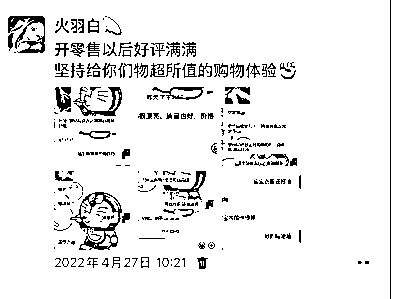

【火羽白经验小结】——启动流量

起步阶段，我的第一批流量来源，就是宝妈群。

有目标用户，肯定就有需求。因为大家孩子的月龄都相差不大，所以我女儿需要用的她们肯定也需要。这就是我开始做母婴代理的第一波启动流量。

如果你也是刚开始，不妨先从宝妈群流量做起，目标用户精准，需求明确，才能成功带货。

## 3、拓宽销路，意外开启社群团购大门

当时为了测品赚钱，我还专门找了当地一家知名品牌可心柔纸巾，试图带货，却意外收获了不贴标的边角料同款。

当时，我老公怕大家不认，但我想着纸巾是消耗品，量比较大，帮宝妈们省点钱总归是好的。更何况同城送货，不满意就退，试一下总没错。

就是这次尝试，帮我开启了社群团购的大门。

从2022年5月8号一直到5.20号，我们总共卖了1400箱，这也是我母婴行业的第一笔高收入，一次性挣了7000块。

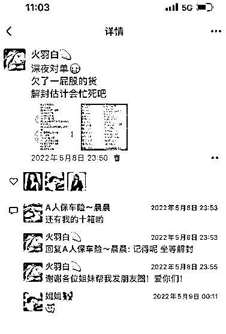

当时厂里都没有货了，还在欠单，我老公一趟一趟的帮我拉货，挨家挨户送货上门，五县两区，都有家里小五菱的踪迹。

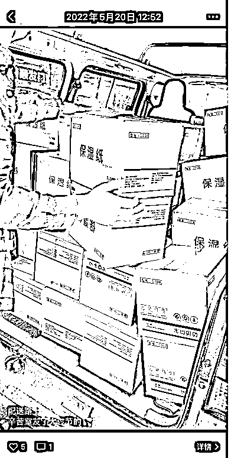

【火羽白经验小结】——团购选品

在团购【选品】时，有这几个小技巧，给大家分享一下：

1、最好选择消耗品，这样出单率、复购率都会比较高。

2、在条件允许的情况下，价格才是最大的优势，所以推荐大家尽可能选择物美价廉的消耗品来带。

3、具体方法：选择同行卖的比较火爆的产品来带。

筛选标准：

1）去淘宝搜同款看看销量，优先选择销量大的产品。

2）再去咸鱼搜索同款产品，看看出二手的人有多少。

如果淘宝销量大，咸鱼出货少，则说明这款产品需求高，且质量过关；

如果淘宝销量大，咸鱼出货也多，说明它可能不太好用，大家买回家都出了，就不建议选。

本以为我会一直做团购，谁曾想女儿4个多月时的一次生病，让我再次燃起要赚更多的决心。

当时她连烧4天，挂完针在家洗澡时，突然小嘴发紫，身上有鱼鳞纹。我当时已经快吓死，赶紧喊我妈出来，直接打了120。

抱着宝宝出门去小区等救护车来的那段路，我已经不知道自己是怎么走下去的。看着她那么小躺在担架上插氧气管，我恨不得替她承担所有，但是我无能为力，绝望到心碎。

去了医院医护人员态度恶劣，经过一夜的折腾，孩子难受到崩溃大哭，医护却只允许一个人看护，就是不让我进病房。一气之下我说转院，去市里的医院。

护士说：谁同意你们出院的？市里医院两个人陪护的病房，要500一天呢，我们这里才50，别这么多事了！

我直接炸了，立马强制出院转到市里。我们住了5天痊愈回家，花了将近3500。

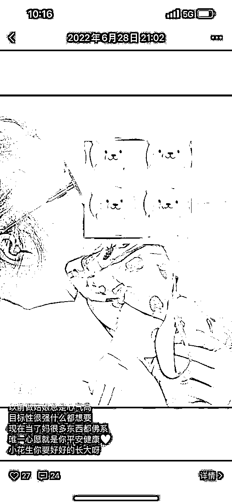

就那一刻，我知道我必须努力赚钱，为了给宝宝提供更好的保障，给她更好的生活，我一定要拼尽全力。

从这时候开始，在带孩子之余的碎片时间里，我几乎全身心扑在母婴用品上。

为了测品，经常自费测试。为了拓宽市场，我还自费买了很多试用装，做活动拉宝妈送尿不湿，包邮免费。

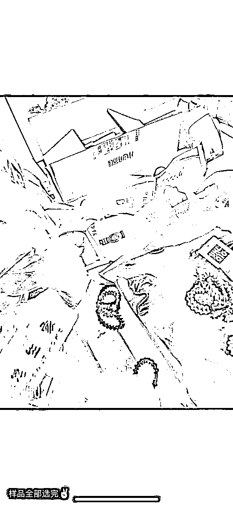

这些都是我自费买来的样品。

为了锁客，我还出了储值活动，5000送200，10000送500。不管在我这里下单什么都可以抵扣，还有逢年过节的会员礼都安排的很明白。

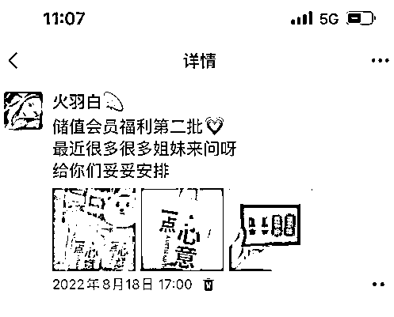

就这样，忙忙碌碌的团购之路可算步入正轨，零售也趋于稳定，每天的利润基本上都能在2500+。

【火羽白经验小结】——引流裂变，及客户维护

1、做团购，引流做裂变很重要，必须要有源源不断的流量来源，才能保证有大量出单。

在做裂变时，我试过最有效的方式，就是免费送样品试用，先让宝妈们满意，她们才愿意放心买单。

2、维护老客户也很重要。逢年过节送惊喜好礼，推出各类活动锁客、留客等。

我采用的是充值储蓄会员卡，就能享受优惠价及惊喜礼品。这样一能帮大家养成在我这儿消费的好习惯，二也能不断积累信任度，拉进用户关系。

·

但事情哪有想象中那么如意，很快我就因团购囤货，亏到怀疑人生。

## 4、疫情影响血亏3w，绝处逢生晋级NBM母婴势力TOP级团长

当时还是疫情反反复复的严重时期，作为实体货物，快递一旦停运，就会有很多退单。

当时，每天都是在接单、退单中无限循环，这段时间很多快递都卡在半路丢了，每天面对无尽的售后，真的人都要累死。

为了维护和很多供货仓库之间的关系，更为了稳定在老客户之间的口碑，所有丢失的快递都是我一个人承担。

这段时间，我算了一下差不多亏了3万左右，无奈只能认了，毕竟做生意哪有光赚不承担风险的道理。

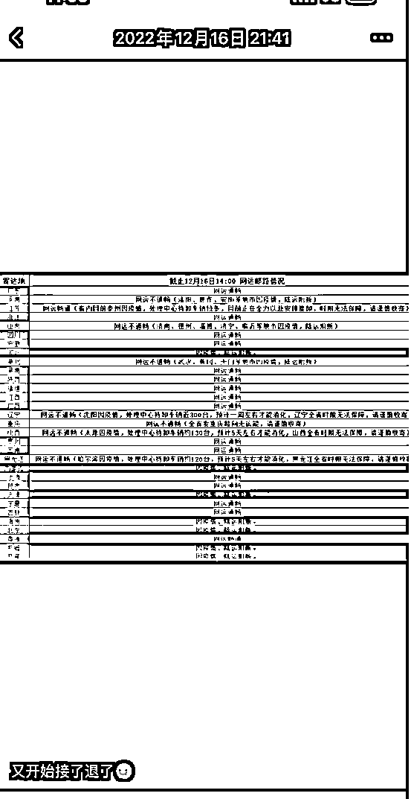

既然带货都需要囤货，快递还这么艰难，那我为什么不直接自己代理一个品牌呢？

萌生这个想法后，除了本来的服装档口，我又租了一个不大的车库，40平左右，专门用来囤货。

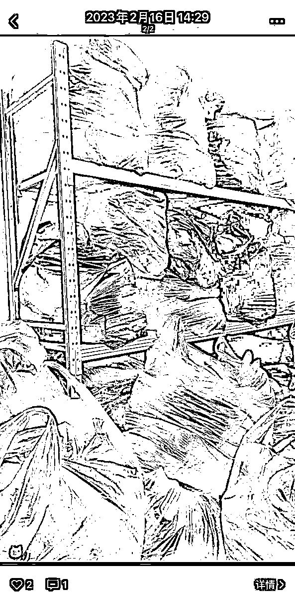

此时，我带的产品主要是母婴用品，和各种类型的衣服。

凭着之前的带货、团购经验，到5月份时，我已经有了不错的业绩，也算在私域小有成绩。

【火羽白经验小结】——囤货须知

1、优先选择消耗品、爆品囤货，参考上文提到的【选品指南】来选择。

2、囤货一定要“量力而行”，千万不能贪多。

这里的量力而行指的是，要根据自己的客户需求量去确定囤货数量。可以的话，最好能提前做个用户调查，看看大家有多少需求，再根据需求，合理囤货，避免亏本。

随后，我觉得自己还需要成长，就选择持续学习走出去看看。

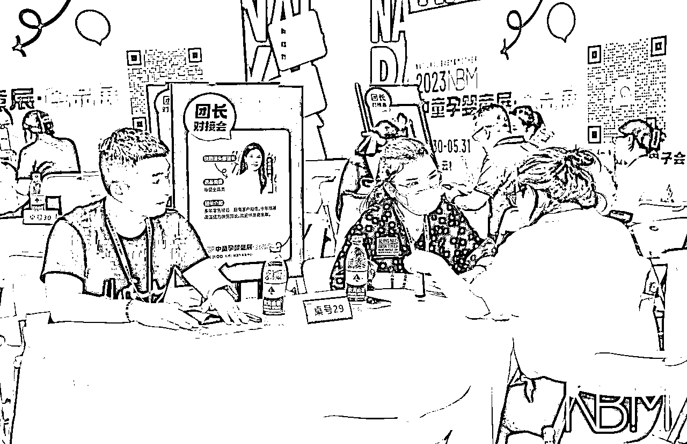

因为这次学习，我得以被更多人看见，还当选了2023年NBM母婴新势力-TOP级团长。

第一次站在展会上领奖，享受到自己努力带来巨大成就感的同时，这次经历也让我收获了很多很多资源，有了新的机会。

于是，我又新接了几个品牌，换了更大的仓库，当时，仓库里的产品已经达到了300+。

【火羽白经验小结】——终身学习

从小到大，我深知学习的重要性，所以当时家里人不供我读书，我也要自己到厂里打工自费。

所以长大后，我始终保持“终身学习”的习惯，从未停下脚步。

也是这个习惯，让我一次次遇到贵人、拿到资源，实现人生的逆袭。

## 5、拓展新业务，开启知识付费，助力更多宝妈赚到第一桶金

随着带货规模的不断扩大，我又拓展出一个新业务。

因为我以前做服装的时候，有给很多开童装店的宝妈指导过，还算有一定经验。

加上带货一年多，我手里也有一些小项目。所以，我动了收自己合伙人，开始裂变团队，带着更多和我一样，曾身处困境的宝妈一起赚钱的想法。

说干就干，我根据自己的经验，很快搭建出合伙人培训大纲，就想着可以带普通宝妈平时在家带孩子也有一份收入。

因为我自己一路走来，踩过坑，亏过钱，所以我想给合伙人们的，就是能直接复刻的，且容易上手的方法论。

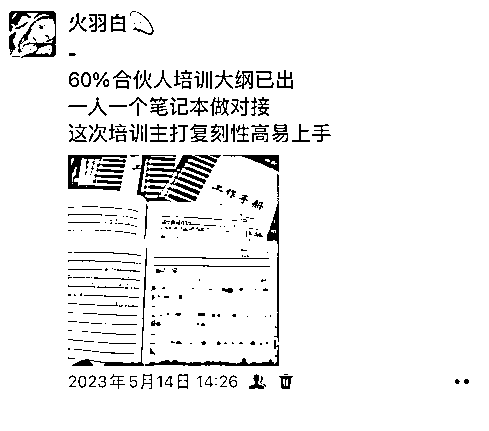

当时，招生做团队裂变3天，因为一直以来的好口碑，我就成功收到了20多个合伙人，2588一人，3天时间，就赚了5w多。

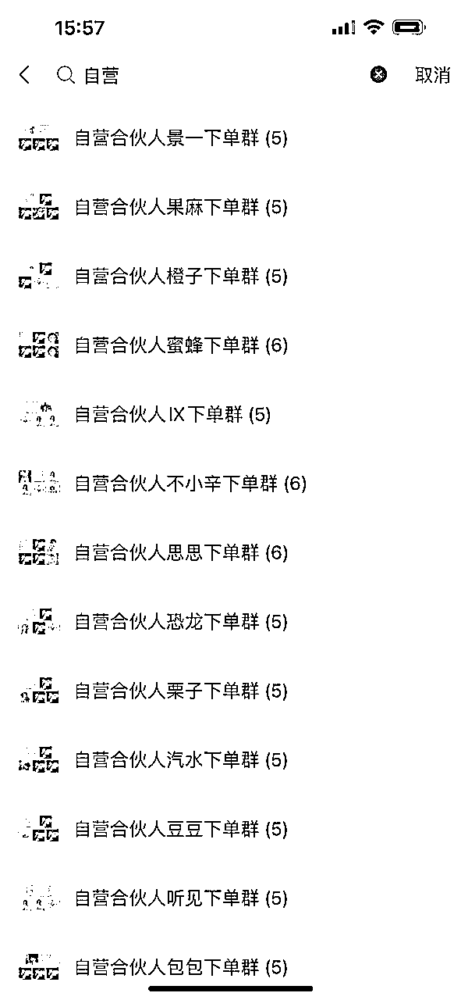

随后，我也逐步搭建起了自己的团队，有专门的供货群、培训群。

随着转介绍和产品实力，我开始慢慢有了影响力。

因为我本身学历就比较低，所以讲不出什么大道理，只能给大家讲实打实的干货技巧。

也正是因为如此，我的培训做到超级细致，哪怕学员谈单不会，我也能一字一句带着她去谈。

很快，我的第一批合伙人就成功拿到了结果。

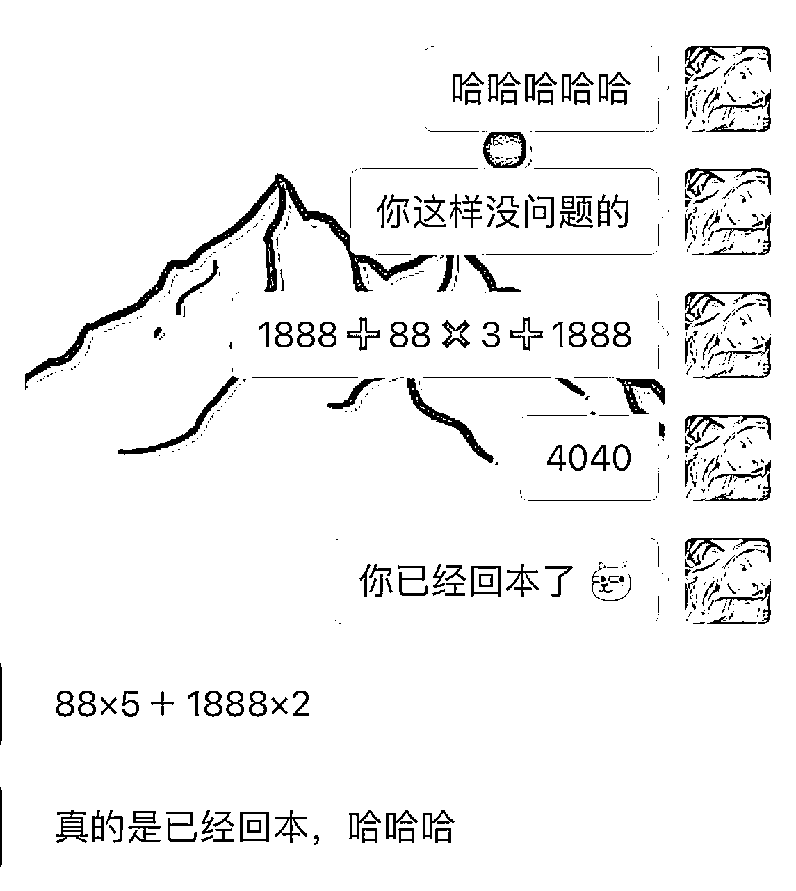

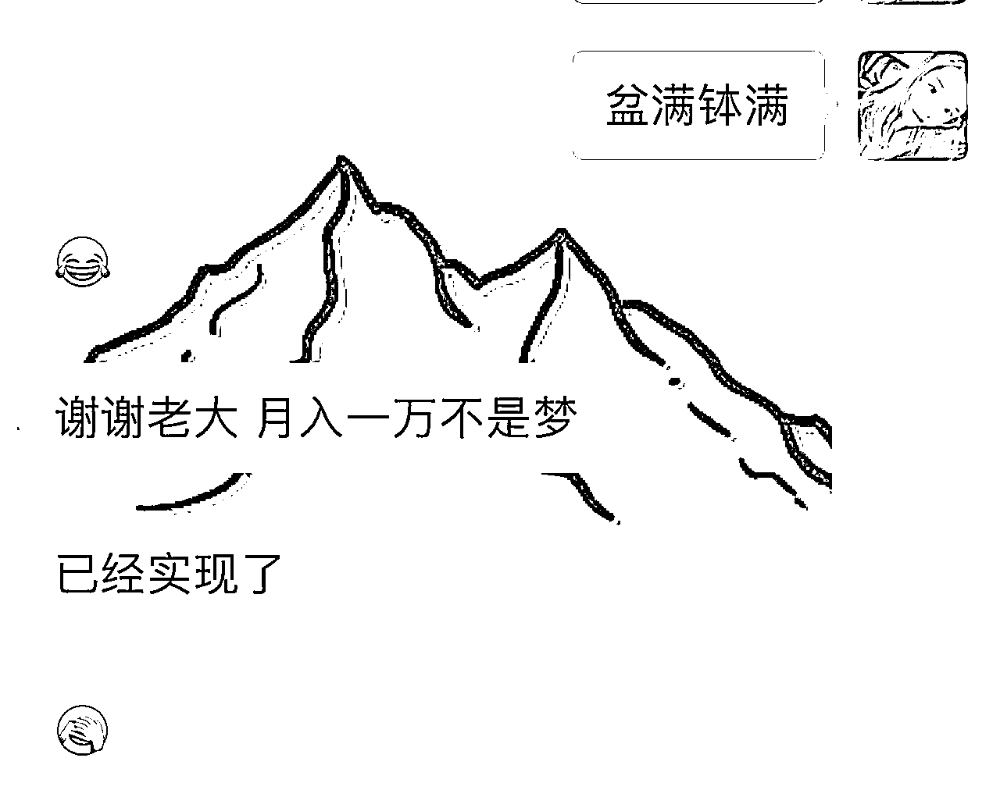

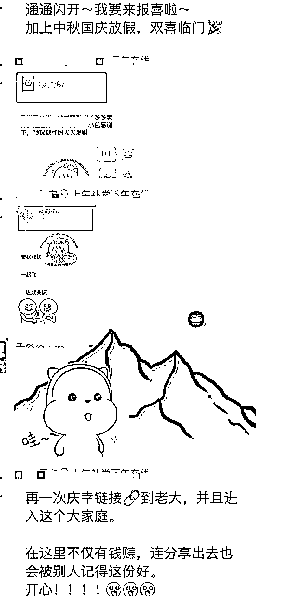

【火羽白经验小结】——勇于开拓，极致利他

在稳定拿到成果，拥有一定资源后，我没有满足于现状，而是用自己已有的经验和资源，去帮助更多和我一样的宝妈们。

开拓新品线，帮助更多人，时刻保持极致利他的真诚之心。

无论是做代理，还是做团购，亦或我现在做的带宝妈合伙人，只要我们始终保持“极致利他”的真诚之心，就会收获满满。

以上，就是我从一个0资源0背景低学历都普通宝妈，到跑通母婴赛道，2年营收7位数的成长历程。

在这近2年时间里，我从零售代理，到社群团购，再到现在母婴行业供应链代理人。

一步步走来，我用无数血亏与经验总结出了以下5点。如果你想做好母婴赛道，参考以下经验准没错。

# 二、如何卖爆母婴产品？在母婴赛道掘金？经验分享

我将从流量裂变、科学选品、矩阵卖货、售前售后、拓宽货品5个方面，为大家分享详细的经验。

## 1、启动流量，3招搞定第一波流量，做好流量裂变

众所周知，做带货，流量一定是最重要的核心。我变现7位数的搞流量经验，可以简单总结为以下3点：

1）线上，混宝妈群

可以尽可能多加一些宝妈群，我常用的来源有美柚、妈妈网育儿等官方的母婴app群聊。

当然，也可以在日常带孩子去医院、游乐园等地方时，多与宝妈搭讪，互相邀请进宝妈群，进而获得流量。

这里需要提醒大家一点，我们在混宝妈群时，最好能够有一定话术，不要暴露太明显的“成交”目的，容易引起反感。

这里，我常用的话术有：

1.有没有离的近的姐妹加个好友以后一起溜娃呀？

2.本地有什么比较好的产康推荐吗？

3.****母婴店有团购活动，我们要不要一起凑单？

2）线下，小区遛娃搭讪

在线下，我们也可以去自己小区、周围的小区，在遛娃高峰期带上孩子去遛娃。

比如夏天，就可以选择傍晚的时候，去遛娃区。最近是冬天，就可以中午太阳大的时候去。

遇到同样遛娃的宝妈，可以随后搭讪，问问对方宝宝在吃的奶粉是什么牌子，在用的尿不湿是哪家的等。

利用宝宝的共同话题，深度交流沟通，进而借势加微信，以互换宝妈交流群的形式，混进新的群聊，也能邀请她进我们自己的社群。

3）线下，母婴店附近拉客

当然，可以的话，你也可以选择在母婴店停车场蹲守拉客，因为这样的客人更精准。

通常，我会以母婴平台官方做活动为由，用送礼品的方式，引导宝妈们添加微信，邀请进群，进而进行进一步转化。

这里也给大家分享几句我当时常用的一些话术：

1.您好，我是****平台的好物推荐官，现在正在做线下推广活动，给您送一些小礼物，邀请您体验一下。

2.您好，我是本地宝妈闲置群的招募员，想邀请您参加我们的闲置交换活动，家里的宝宝闲置都可以来群里出售哦，还可以换积分领取全新绘本玩具。

3.您好，我是****牌子的线下体验活动推广员，现在正在邀请100位宝妈免费试用产品，想邀请您进我们的客户群，后期会经常有知名品牌的宝宝用品体验活动，一起参与呀。

## 2、科学选品，把握阶段性节点，推一款爆一款

无论是做零售，还是做社群团购，甚至是做母婴产品供应链代理，最关键的一定是选品。

大家都知道，最基本的准则是选消耗品，但实际上，更应该关注的，是你的客户所处的成长阶段，这里特指宝妈群体。

有孩子的，或了解宝妈赛道的朋友都知道，宝宝们长得很快，很多东西都不具长期性，经常一个月就得换一批产品。

所以在货品选择上：

在选爆品的基础上，还要根据宝妈客户们宝宝们的成长阶段来选，以妈妈的视角去看，什么月龄，最适配什么产品。

我最开始的客户群体基本上是和我女儿差不多大的宝宝们，因此我了解这个月龄段的宝宝需求，所以当时，我做的是“无自用不推荐”。

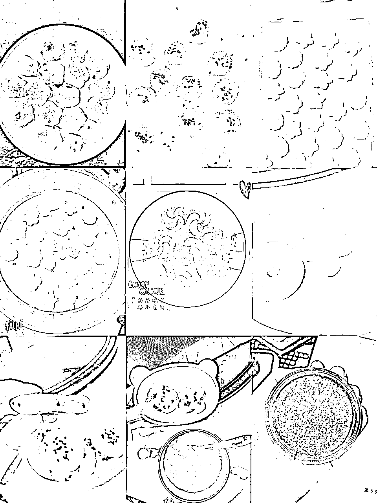

比如宝宝6个月加的辅食，我仓库里安排了很多辅食类目产品，包括要用到的工具辅食杯，辅食硅胶模具一应俱全的提供给妈妈们。

当时，我自己也在学习做辅食，平时还可以和妈妈们一起交流。

精准把控宝妈客户群体，宝宝成长的阶段性节点，才能按需求供货，做到推一款爆一款。

## 3、矩阵卖货，给足客户选择权，怎么都是赚

确定具体的货品种类后，还需要注意的就是卖货上品。

在这里，我的经验是：

千万不要同类型的产品只推一款，用矩阵打法，要推就要推全。

比如前段时间，核污染期间，宝妈们为了宝宝们的健康，都在哄抢DHA。

当时我做了一件事，把仓库所有的DHA现货整理好库存，每个产品对应价格，功效，什么年龄段比较好，性价比怎么样，藻油添加了多少，详细整理出来发到群里，让她们自行选择。

这是因为，现在的宝妈们会有自己的想法，会看专家推荐、博主带货，看小红书种草，也听身边的小姐妹推荐。

我们要做的，不是说服宝妈们选择自己带货的那款，而是把市面上有的同类型产品都提供周全，让她们不管想要哪种，我这里都可以提供。

如此一来，怎么都是你赚，宝妈客户们对你的信任度，也会随着你强大的货源渠道而积累的更深。

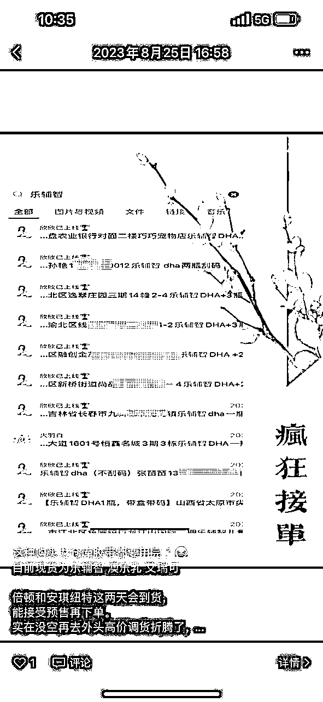

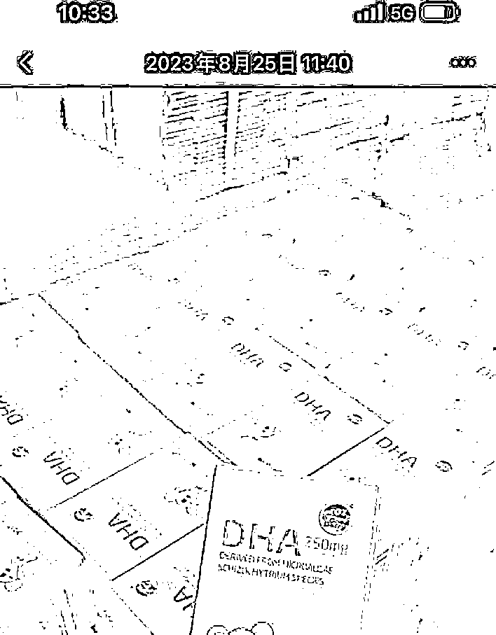

## 4、售前售后，做好情绪按摩，才能事半功倍

第三点，是宝妈群体客户必须要留意的点，即：

无论是售前，还是在售后，一定要给宝妈客户们做好情绪按摩。

关系到位，信任度加深，才能在后续成交上事半功倍。

当过妈妈的都知道，宝妈真的是特别需要情绪价值的群体，对此，我就深有体会。

带宝宝真的需要非常多的精力和时间，我女儿小时候好像只有她睡觉，我才有神经放松的时刻。

如果遇到了孩子生病，妈妈真的是一夜夜熬过来的。

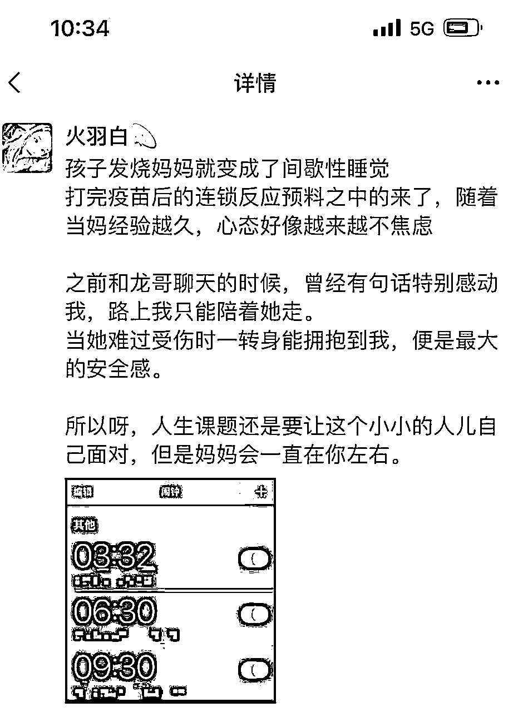

这对妈妈的身心都是非常大的挑战，所以客户遇到这种问题的时候，我们一定要给她们多鼓励，提供多一些的情绪价值、希望，把她们从崩溃边缘拉回来一点点。

除了带孩子的痛，还有各种容貌焦虑、身材焦虑、家庭关系焦虑、婆媳矛盾等层出不穷。

在我的客户群里，不但能够聊带货，还能是宝妈们的情绪发泄所，我会给她们提供充足的情绪价值，帮她们出谋划策。

所以，做宝妈客户群体，一定要能及时为客户做好情绪按摩，她们开心了，带货也就变得容易多了。

## 5、拓宽货品，可延伸至日用品，多渠道收入

当然，除了母婴产品，我们也可以拓宽货品，比如日用品。

众所周知，宝妈是家庭消费的主力。家里所有的生活用品，几乎都是由妈妈操心购入。

所以我们也可以适当加一些日用品、快消品等，逢年过节时，也可以筹备一些礼盒。

比如刚刚过去的中秋，我就带了三只松鼠的零食礼盒，团队卖出去接近200单，当天总营收6万多。

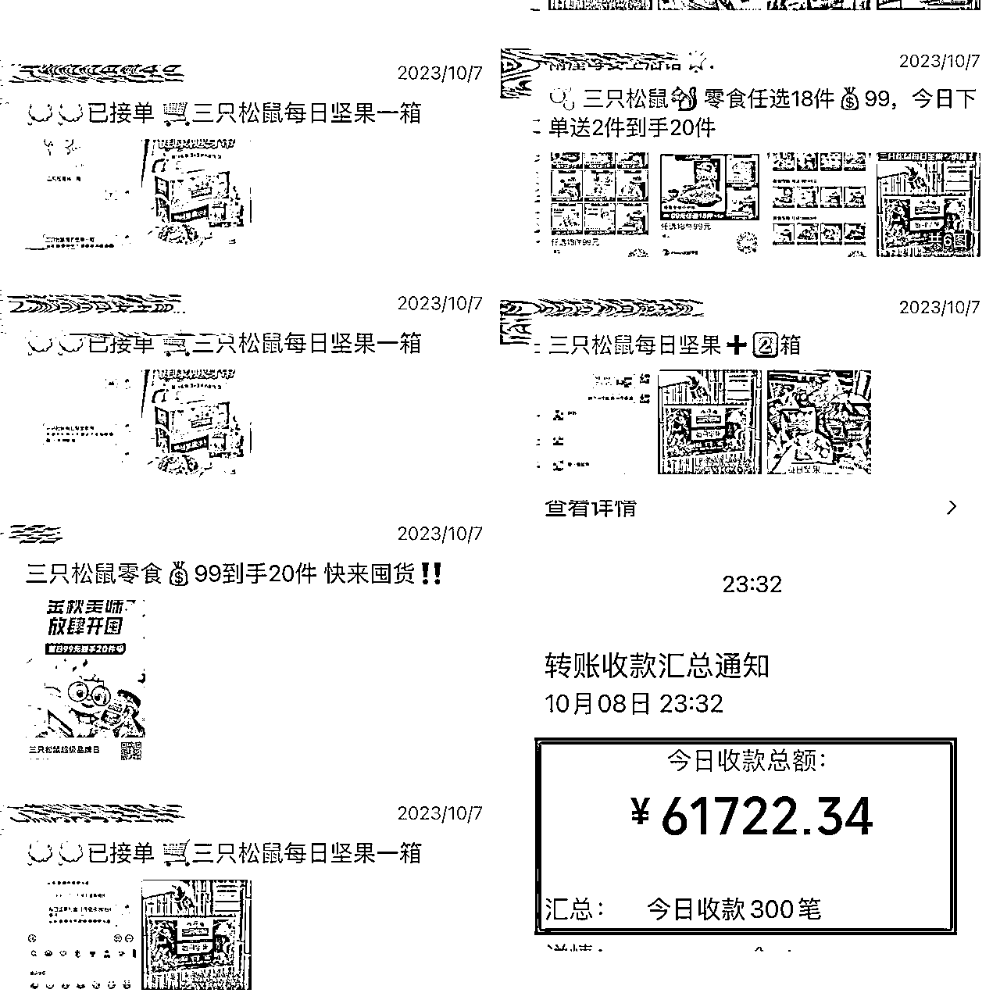

即将到来的新年，大家也可以提前筹备礼盒的货源，到时候提前一个月开售，肯定也能拿下不错的业绩，趁机赚一笔，过个好年。

# 三、0资源0背景低学历的普通宝妈，照样能闯出自己的一片天

都说女子本弱，为母则刚，真的是这样。

我就是从最初只想给宝宝看病，到后来女儿发烧，彻底激发斗志。一路走来，让我遇神杀神、遇佛杀佛的最大动力，就是每次回家后，看到女儿开心的小脸。

很幸运，我成功扛过了这条布满艰辛之路。我想用自己的经历，告诉所有的宝妈们：

披荆斩棘不需要很多钱，也不需要你有很高的学历，很强的背景、资源，甚至是能力。

只要你和我一样，有不服输的精神，肯学肯干。

利用带孩子的碎片时间，就能做一份自己的副业，赚到给自己和孩子更好的生活，给自己充足底气的钱。

毕竟，在我还没赚这么多时，喊老公帮我取个快递，都推三阻四，打完游戏才动。连亲妈都日常吐槽我，不务正业就知道抱着手机，虽然我是在谈单。

后来，我收入直线上升，给家里买了房子，我妈一直舍不得买的貂每年安排一个，我老公喜欢却嫌贵的手表也能不眨眼直接送他。

对女儿更是有求必应，给她一切我能给到的最好的，甚至日常生活费都能由我承担。

现在，家人对我的态度直接180°大转弯，就连吵架婆婆都从最初嫌我脾气不好，到现在只劝我老公：人嘛，哪儿能没脾气！

我一个0资源0背景低学历的普通宝妈，都能靠自己闯出一片天，相信你也可以！