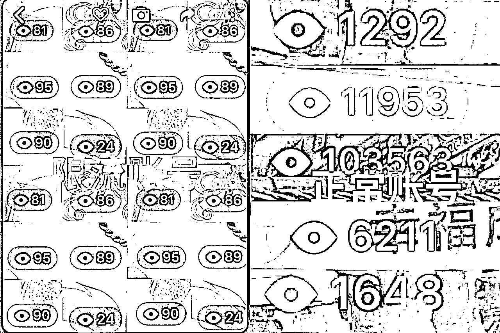
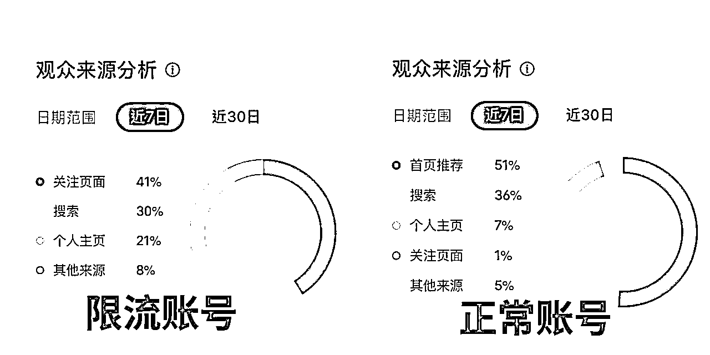
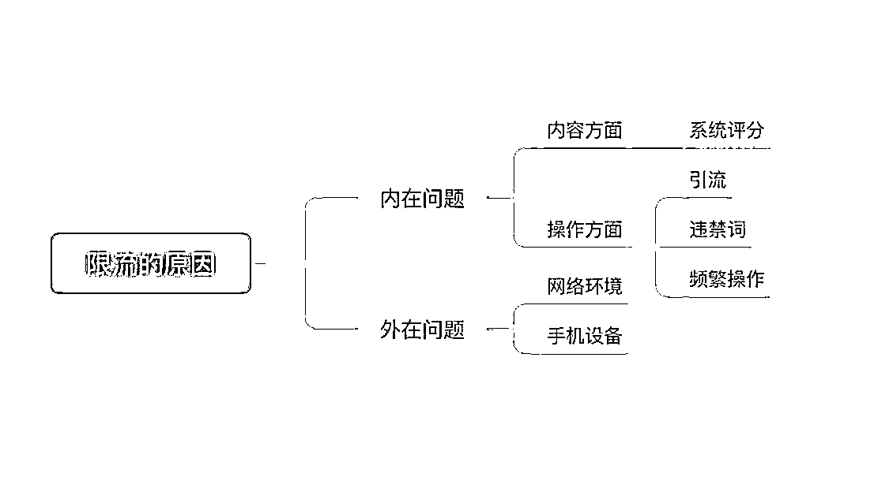
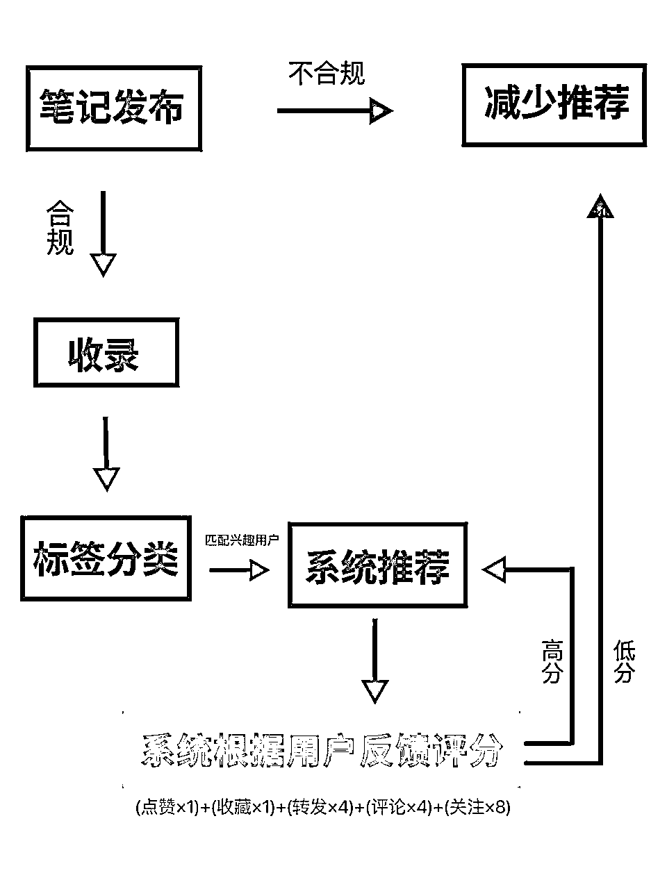
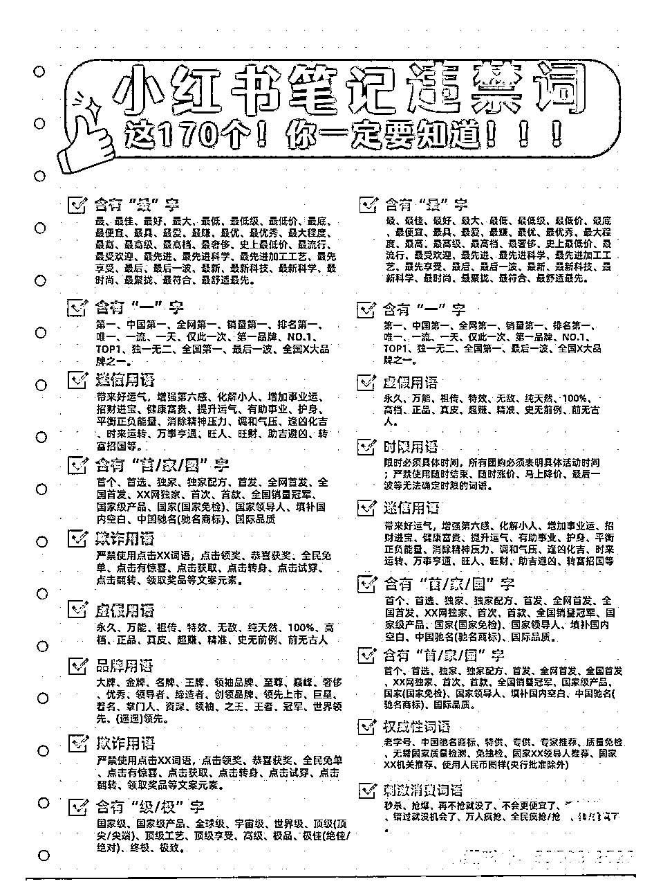
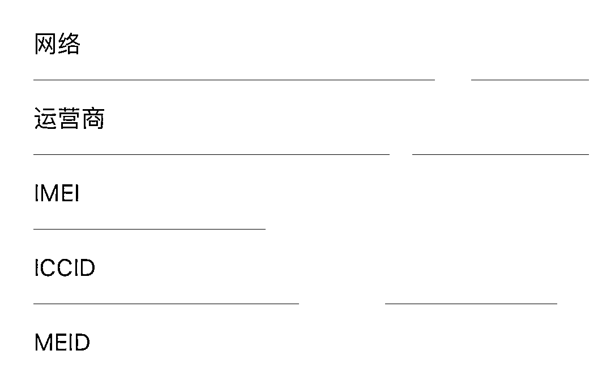

# 小红书账号没流量怎么解决？

> 来源：[https://nivut760ftk.feishu.cn/docx/R3FZdZAbsokg2Px0MD5cp4S0nVc](https://nivut760ftk.feishu.cn/docx/R3FZdZAbsokg2Px0MD5cp4S0nVc)

哈喽大家好，我叫艾小飞，擅长小红书引流

很多小红书创作者，难免会遇到账号被限流的问题

为什么明明我的内容那么好，平台却不给我流量？

为什么同样的素材，别人能爆，我却不能爆呢？

这也是很多小红书创作者很头疼的事，更让人头疼的是，知道帐号被限流了，但就是找不到限流的原因！也不知道该怎么去避免！

所以接下来我会用3500字，来详细的给你们讲解，小红书限流的底层逻辑是什么，让你们看完后，会更全面的知道，账号为什么会被限流了，可以避开原因，让流量大幅度的往上升

# 正常账号和限流账号的区别

OK，我们先来说说正常帐号和限流帐号的区别吧，我做了两张图，来给你们做个对比

首先你们看下这张图，左边这个是限流账号，右边这个是正常账号

再给你们看看这张图

看得出来有什么区别了吗？

也就是说，正常帐号和非正常帐号的区别，在于两点

1.小眼睛低于50以下的，那么说明这篇笔记是被限流了

2.笔记的数据分析图中，推荐和搜索流量大幅度的降低，甚至是没有的，那么说明这篇笔记也是被限流了

所以现在你们可以检查看看，自己的小红书账号，是否是正常的

# 限流的原因都有哪些

可能有朋友会问：限流的原因都有哪些？

限流的原因，总体分为两个板块，一个是内在问题，一个是外在问题

我先给你们看个思维导图，方便清楚接下来的内容都有哪些

## 内在问题

内在问题包含：有内容方面和操作方面

首先内容方面，这个毋庸置疑，就是你的内容质量不够好，自然就得不到系统的推荐

这个是根据什么样的底层逻辑，来评判你的内容是好还是坏呢？

这是我刚刚制作了一张流量推荐的流程图，你的内容是好还是坏，系统全依据它来评判的

这图是什么意思呢？

当你的笔记发布的时，系统会对你的这篇笔记进行自动检测，看看是否合规

如果不合规，那就减少你的推荐，这就是常说的被限流了

如果合规，系统会收录到平台上，然后系统会根据你笔记中的关键词，然后推送给标签背后所对应的人群，系统会根据人群的互动行为，进行打分

如果得到的是高分，那你就会获得平台下一轮的流量推荐

如果得到的是低分，就会减少流量推荐

这就是靠内容来获得流量的一个底层机制

说人话就是：系统它也不知道你的内容到底好不好

内容好不好也不是系统说了算，而是用户说了算的

用户对你这篇笔记互动数据越多，系统就默认你的笔记是优质的，从而给你奖励更多的流量

## 操作方面

不要忽视这个操作方面，刚刚我也说了，很多人都会疑惑，为什么明明我的内容质量那么好，却得不到更多的流量呢

如果你有这种疑问，看完后可自查下，看看是不是也遇到过这种情况

既然说是操作问题导致的限流，那就说明平台不喜欢有以下的这些行为

#### 1.引流导流

首先第一点，也是很多人容易犯的一个问题，那就是引流

大家都知道，引流在任何的一个平台上，都是明令禁止的一种行为

谁都不希望自己的用户被别人给偷走

特别是在小红书上，小红书对引流的打击力度，是非常严格的

在我心中，它算得上是打击引流力度最严格的一个平台了，没有之一

说到平台痛恨引流，那平台都有哪些已知的引流行为呢？

比如你在帐号名称上、简介上、评论区里、私信里、置顶笔记里、@小号上放引流信息，这些行为系统一旦识别到了，不管你的内容评分再怎么高，平台也会给你帐号降权，你的流量就会直线的断崖式下滑

所以想要流量更好地往上涨，需要借用到专业低风险的技巧才能避开，要不限流是小事，封号了才是大事

#### 2.违禁词

很多朋友都不懂平台的违禁词是什么，他们听身边朋友都说小红书很好做，很容易赚到钱，不去了解平台规则情况下，就直冲冲盲目的去干了

干到后面真就是一塌糊涂，账号做了没流量，引流也引不来。最后还抱怨平台恶心，怎么一点流量都不给

别那样想，不妨你们花点时间，去了解平台都不允许发哪些关键词，顺应这平台的规则走，才能获得更多的流量奖励

我也去小红书上，下载一张违禁词的全图，你们可以做个参考

或者你们到小红书上，搜索“小红书违禁词”，花个几分钟简单的学习下

如果你们实在记不住违禁词都有哪些，在这里我推荐三个网站

当在发布笔记之前，可以把自己的文案复制到这些网站上，看看有哪些关键词是被系统提示的，然后你再进行修改

零克查词：专门针对小红书笔记进行违规词检测的工具，检测准确率较高

网址：http://ci.lingke.pro/

句易网：支持短视频、电商、小红书等全平台违禁词检测，可直接输入文字或图片进行查询。

网址：http://www.ju1.cn/

清抖：可以直接在小程序上使用，有广告法上的违禁词，也有一般大类的违禁词。

网址：http://www.qingdou.vip/

这么做的好处是，能大大降低笔记被平台限流的风险，要不到时候，你花了好几天辛苦制作出来的内容，结果因为某个违禁词被限流了，那自信心真的太受打击了

#### 3.频繁操作

我看到有些朋友，他老喜欢去删除笔记

比如他刚发布笔记后，看到流量不怎么行，就马上删掉，然后继续发下一篇，其实这种操作行为是不妥当的

有些朋友，他一口气批量的去删除历史笔记，这种操作行为，也是不妥当的

还有些朋友，发布笔记后突然爆了，非常多的流量涌进来，这时候他在想，要不趁笔记爆了，不如我挂个链接卖卖货吧

于是他就重新的编辑笔记，挂上链接后，发现流量直线下滑，这些也是不妥当的

还有些朋友，他手头上有很多的帐号，但他没有这么多台手机，怎么办？她就用一台手机，来回的切换三四个帐号，这样也是不妥当的。

你想想，我刚说的这些问题，你之前有没有遇到过

## 外在问题

OK，说完了内在问题，再来说说外在问题吧

外在问题有两点，网络环境和手机设备

网络环境方面，像我之前接到过一些朋友的咨询，我发现他们去发布小红书的时候，都喜欢用Wi-Fi去发，我问他为什么不用手机流量卡呢，他说流量贵

我说你这样是不行的，如果你几台手机登录在同一个Wi-Fi下，万一其中有个帐号因违规被永久封号了，那么登录在同一个Wi-Fi下的其他帐号，也会受到牵连，从而导致间接的被限流

这些都是很小很小的细节，希望你们能留意下

还有一个你们不常听到的细节，那就是手机设备

可能你会问我，帐号限流跟手机设备有毛关系啊！

嘿，还真有关系！

举个我自身的案例，我之前在做小红书矩阵引流的时候，因为缺手机，所以到闲鱼上去批量收购二手闲置手机

买回来后，按照我的技巧去发布笔记引流，但奇怪的是，我发的再多，流量都不破百的，也找不到问题所在

我就奇了怪了，马上去请教大佬，看看是哪里出了问题

他指点我，先让我重新换一批手机去试试，然后我在用同样的方法，基本上就没那种问题了

后来复盘得出总结，原来是我买的那批手机，之前都是干灰产的，这些手机的id号，早已被平台给拉黑了

所以不管我怎么发笔记，哪怕内容质量再好，都是得不到平台任何流量推送的

因为当时我不懂这个细节，导致我损失了很多money

所以你们要自查下，看看自己的手机，是不是跟那些工作室买的，如果是，尽快转出卖掉

而且买手机的时候，注意不要买太老款的手机型号，像我现在玩矩阵的，基本上都是用苹果7以上了，几百块也不贵

如果你买七八年前的那种手机型号，大概率也是会被限流的

既然选择了要在小红书上拿到点结果，就要下点血本才行，舍不得孩子套不住狼

以上我说的这些实战经验，不知道你们有没有遇到过相似的情况，如果有的话，就要停止不要再去做了

如果没有的话，那么恭喜你，你算是幸运的，看完后也可以加固对对小红书这方面的认知

# 限流了有哪些解决办法

当你的帐号被限流后，该怎么办？有哪些解决办法呢？

我给出的答案是：对症下药

根据不同的情况，来解决相应的问题

如果你是因为内容的问题，导致没有流量的，那么你就要去优化你的内容方面

## 怎么优化内容呢？

提炼你这个行业的关键词，去搜索同行的爆款，看看他们都是用了哪些话题做内容的

然后你再去模仿他们，做出用户喜欢的内容出来

就像刚刚我所说的，只要你的笔记互动率高，那你就会获得平台更多的推荐流量

如果你是因为引流导流的问题，因此被限流的话，那你就要去学习避开平台的低风险引流方法

我在前几篇文章里，也分享过类似的操作方法，你们可以往前去翻阅下，说得很细，基本上一学就会的那种

如果你是因为笔记中带有违禁词的，那你下次你在发布笔记之前，就要去我刚推荐的那三个网站里，做个简单的筛选，确保没有违禁词了，再去发布会更安全

如果你是因为频繁操作的，比如频繁的发布或删除笔记，频繁的去给别人点赞，评论，关注，频繁的叫别人给你点赞，评论，关注，这些都是不行的，要马上停止这种行为

如果你都没有以上的这些问题，但还是被限流了，那么你可以检查看看，是不是因为环境的问题导致的

比如你被封过的帐号，登录过这个Wi-Fi，你可从现在开始，不要再用Wi-Fi去登录和操作小红书了，改为用流量卡

如果这些问题你都没有，也还是被限流了，那最后一点，可看看你的手机设备来源的问题了

因为只有通过一步步的去排查，才能知道如何去解决这些问题，而不是当笔记没有流量了，就盲目的急病乱投医，那肯定是不行的

在小红书上，十篇笔记里有其中一篇流量不高，是个很正常的现象，不可能说你发每条笔记都是爆款的

但如果你连续发了五六条都是没什么流量的，这可就不正常了

发现流量不正常后，你可按照我刚刚所说的这些流程，一步步的排查和解决

因为我说的这些是比较流程化的，都是大家所常见的问题，我总结出来的

所以当你遇到了帐号被限流的问题，也可以来找我一对一诊断解决

好啦，今天分享的小红书限流的底层逻辑，就到这了，如果在文中，有哪里是不太懂的，可以提出来，或者单独找我私聊

好了，今天就到这了，谢谢大家

原创：艾小飞

转载可私信

禁止搬运和抄袭

微信：aifei9977 （记得备注来意）