# 《AI＋公众号故事爆文，红海赛道搏蓝海出路，矩阵入池率90%，单篇阅读230W，日营收2.1W＋，起号全流程揭秘》

> 来源：[https://n28vbku1px.feishu.cn/docx/R611dzwEtoq73pxSyUycMgV4nIg](https://n28vbku1px.feishu.cn/docx/R611dzwEtoq73pxSyUycMgV4nIg)

大家好，我是暖暖，一个写故事5年，公众号矩阵粉丝80万的博主，非常感谢生财提供平台与资源，让我看到了很多新人在公众号爆文领域的优秀成绩。

暖暖结合了自己运营十几个公众号4年多的经验，带领团队通过Gpt+故事爆文，和其他热门领域，陆陆续续在半个月内突破流量池，达到日收入21000+，日收12000+6500+，日收4000+，日收入3000+，日收入800+，900+...

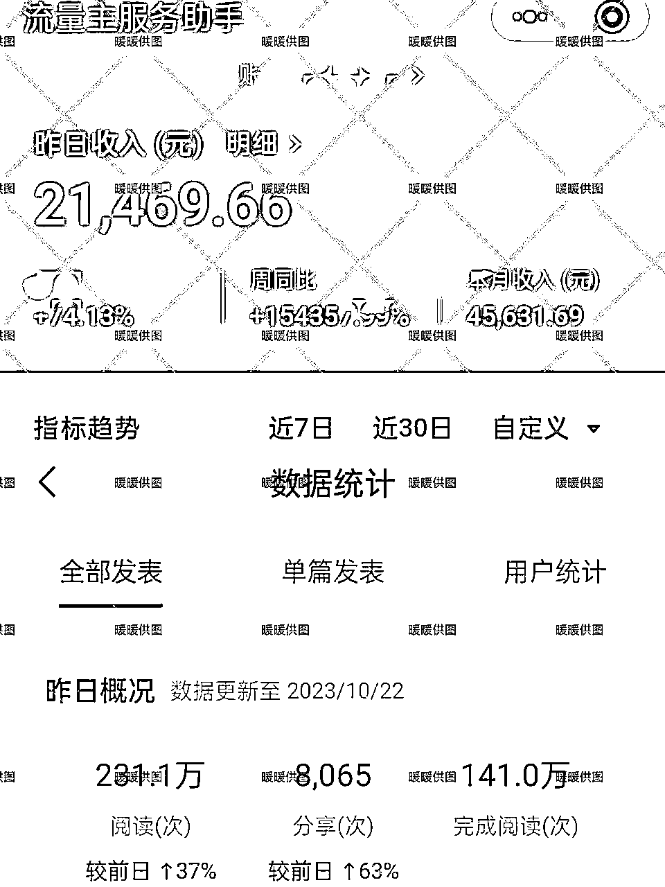

今天这个复盘贴，是理白老师鼓励我写的，运营公众号将近5年，变现300W之后，又通过gpt+公众号爆文的方式，帮助团队一天突破230万阅读，一天突破150万阅读，100万阅读，一天突破94万阅读。

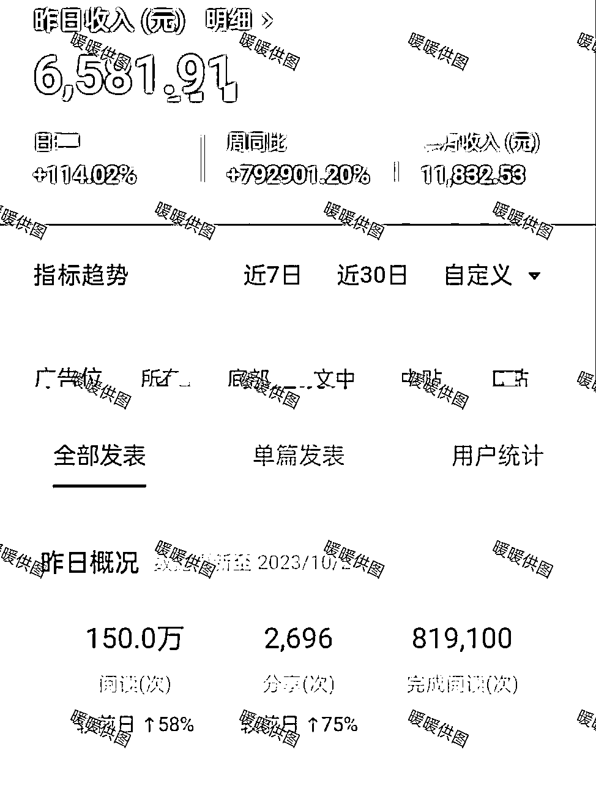

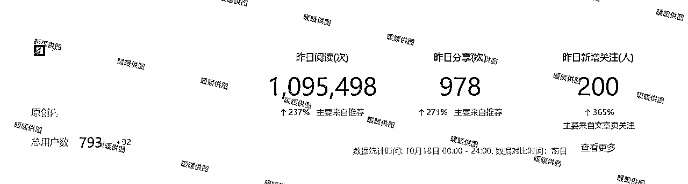

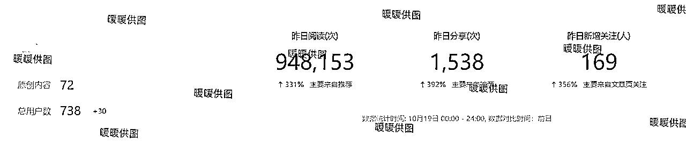

而这，仅仅只用了15天不到，我会用8000字将如何带领小白学会gpt，注册公众号，如何获取源源不断的灵感，爆文的6大类型，一天产出更多100w+爆文的变现全流程写个复盘。

考虑到有些小伙伴可能不会注册公众号，所以这篇复盘帖子有点长。

# 第一部分：公众号注册排版

对于很多没接触过公众号的小伙伴来说，公众号注册和排版可能不太熟悉，所以我通过截图的方式，带大家先拥有自己的第一个公众号。

## 1：用自己的身份证注册，或者家人的身份证注册。

首先电脑打开网页，然后百度搜索，微信公众平台。

点击立刻注册，然后我们会看到四个选项，订阅号，服务号，小程序，还有企业微信。

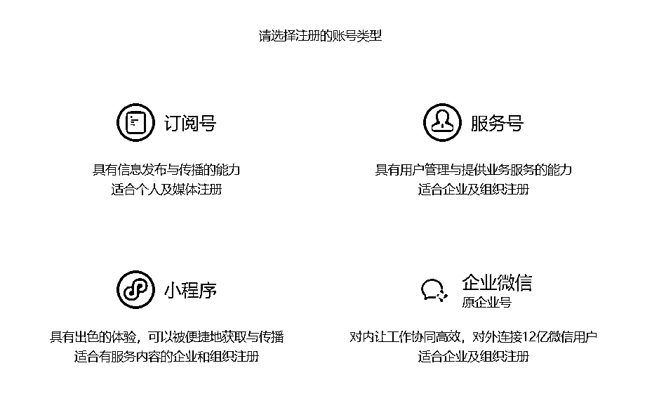

我们选择订阅号就行，千万不要选择服务号。

然后填写基本的信息，比如邮箱，是用来绑定你的微信公众号的，密码，按你们的习惯填就行。

在这里补充下，对于新人而言，个人号是最好的选择，因为可以直接绑定你的银行卡，个人直接拿到流量主的收入。

新人做2-5个个人号是没问题的，自己的身份证注册完了，可以去用家人的身份证注册。

对于想批量做公众号流量主的小伙伴，也可以选择个体户注册，去淘宝买个个体户营业执照。

一个个体户营业执照，可以做两个公众号，第二个需要交300的认证费用给腾讯，其次就是个体户的公众号，需要弄个公章，流量主审核通过，打到法人的银行卡里。

当然，在新人没有跑通流量池之前，1-2个账号就可以了。

公众号也是有权重的，原创度高的小伙伴，更容易进流量池。

而且短故事用AI或者自己写，都是1000字左右就够了，能够在文中插入两个广告，文末插入一个广告。

那种想写几千字的故事，可能你对标的是有粉丝的大号，她们账号有粘性，打开率比较稳定，比如暖暖运营的公众号，阅读在7000-10000阅读，但这类老号，一般是不靠流量主变现的。

所以，大家要找对低粉爆文号，不能筛选错了对标。

在1000字左右的故事，完读率也是比较好的，文章越长，越多人没耐心看下去。

还有些小伙伴担心AI写的文章质量很差，没关系的，经过几次调教，GPT3.5写的文章，加上自己润色，小白也是能突破100w+阅读的。

ps:有gpt4.0的，使用更佳。

## 2：公众号排版和后台功能。

比如我们公众号爆文，大部分的定位都是中老年情感粉丝，那么我们围绕中老年要思考几个排版的重点。

## 第一：就是字体要大，如果你排版14-15字体，对年轻人来说还好，对老年人来说，阅读起来真的很费劲，相信大家都看过父母微信聊天的字体大小吧。

我一般都是用17字体左右的。

## 第二：文章尽量分成4部分到5部分。

这是个心态问题，比如你一千字的故事，不分成几部分，可能一下子就看完了，读者还会觉得你很敷衍，还有就是文章中间，也需要切分开，显得更加有悬念呀。

对于AI写的故事来说，大部分都是不会特别精彩的，我们年轻人可能看不下去，觉得没意思，可是大部分中老年来说，她们的文化程度不是特别高，看文章的需求和我们不一样。

大家可能会担心，哎，万一中老年文化水平高怎么办，放心，你的文章标题就筛选出了人群。

那种博览群书的中老年读者，是不太可能被标题吸引人眼球，但内容一般的文章所吸引的，简而言之，就是那类人不是我们的目标群体。

## 第三：每段话，别超过4行，拿捏不准可以手机预览，等下排版也会教你们怎么手机预览。

因为字体太多，在手机屏幕上，看起来会非常累，还是那句话，我们的排版是为了方便读者啦。

聊完排版的三个重点，暖暖接下来带你们手把手排版。

# 新手小白的排版分两个部分：

## 1：直接在公众号页面排版。

搜索微信公众平台登录。

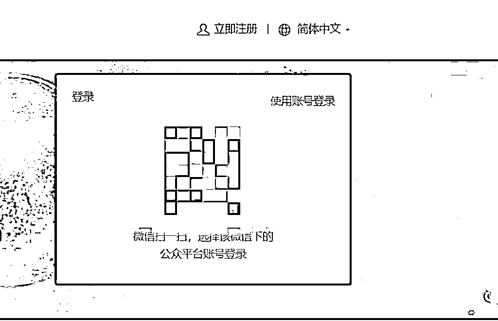

个人号或者公司号，绑定你的微信，这样可以扫码登录啦。

点开图文消息。

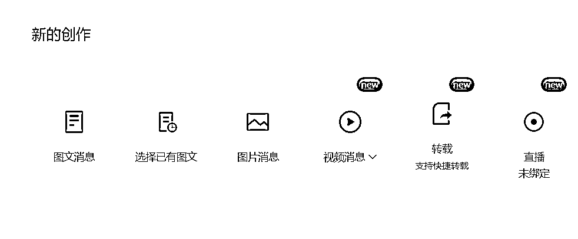

对于简单的排版来说，公众号网页的这些功能就足够了。

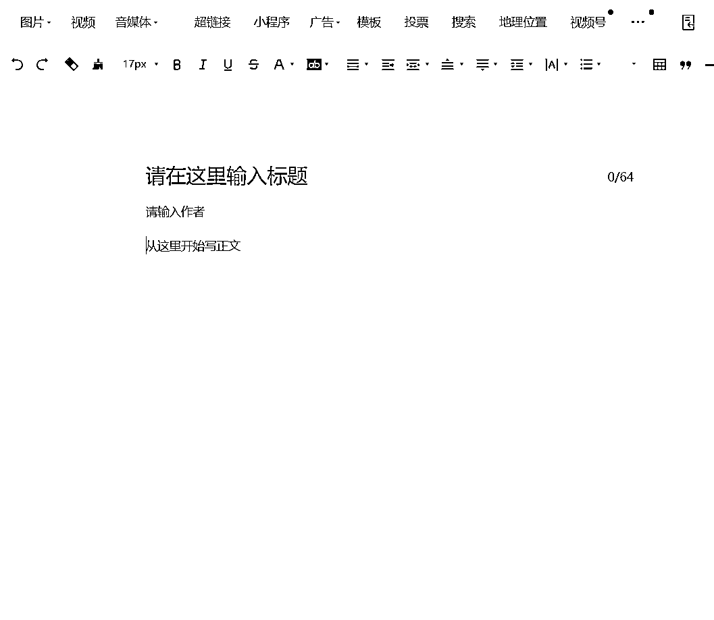

还没入流量池之前，一天1-2篇文章就可以了，保持日更，只要文章内容和选题没问题，基本都能在半个月内进入流量池。

可以在网页写好文章，也可以把你用AI写的文章，复制到这里，粘贴好正文后，开始排版。

排版顺序：

1：全选，调整字体大小。

2：调整两端对齐，段前距，段后距，按自己的感觉调整，比如选8或者16，行间距，字间距也是一样，看你们自己感觉。

3：选择小标题，可以是纯序号标题，也可以去135编辑器，或者96编辑器找序号标题。

我一般是直接用01，02，03，调整到24号字体，加粗，居中对齐，出来是这个效果。

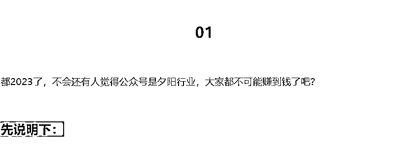

比如这个先说明下，就是把字体加粗，加了橙色的背景色，20字体。

大家可以看自己的审美调整。

如果想要华丽好看的小标题，比如135编辑器里，就有很多样式。

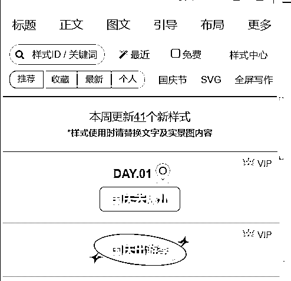

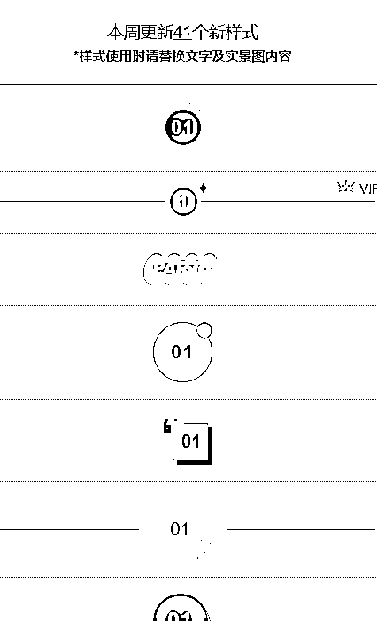

选择没会员的小标题就可以啦。

## 2：找各种网页排版，比如135编辑器，96编辑器等等。

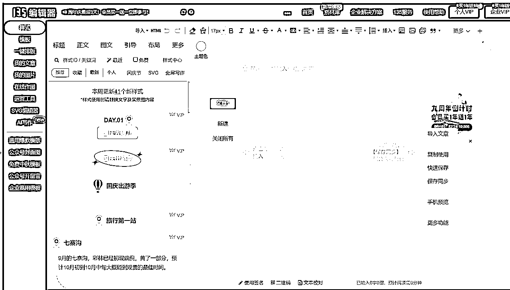

公众号最好有自己的人设，所以结尾可以附上自我介绍，插入往期推荐阅读，这样一篇文章爆了，可以引导读者去看其他文章，实现多篇文章进流量池。

在135编辑器排版好后，全文复制到公众号的图文消息那里，保存好草稿，就可以预览到你自己的微信。

对了你们得自己关注自己的公号，才能收到预览的消息，检查好排版有没有问题，记得插入广告，智能选择，全部插入。

没有500粉丝的先去买粉，中介价格在30-80左右不等。

开通流量主以后就可以插入广告了，这样每篇文章，只要有阅读都有收益，收益是直接打到你们银行卡里的，没绑定银行卡的，记得去绑定下银行卡。

温馨提示：有几个人排版后，发出去没广告，或者排版时，提示插入不了广告名片，你可以复制，重新粘贴下，一般插图多，或者小标题是会卡bug的。

发布的时候，记得开通群发通知，这样大家都能收到消息，定时发布。

情感类型，选择晚上七八点，或者晚上十一点左右，不确定的，也可以看看内容分析，你的号一般是几点有阅读巅峰，故事类型，基本是早上六七点到八点，中午十二点到两点，晚上七八点，十一点以后。

温馨提示：公众号发表，文章标原创不开通群发通知也会推进流量池。

如果你有精力，可以利用发表一天发十几篇，这样更容易测出多篇十万加爆文，爆上加爆。

你们弄好，可以直接定时发表，一般可以定时今天和明天的文章，忙不过来，有主业工作的，可以直接排版几天的文章，提前定时。

# 第二部分：公众号爆文的六大类型。

### 适合的文章类型：

### 1：情感类

（故事，鸡汤，观点）

暖暖和团员都写的情感文章，因为这种比较主观，AI写起来容错率高。

而且中老年情感市场是需求一直很大，每个人都是有情感需求和好奇心的，看故事也是好奇心理，很多爆文都是标题封面吸引人。

案例：

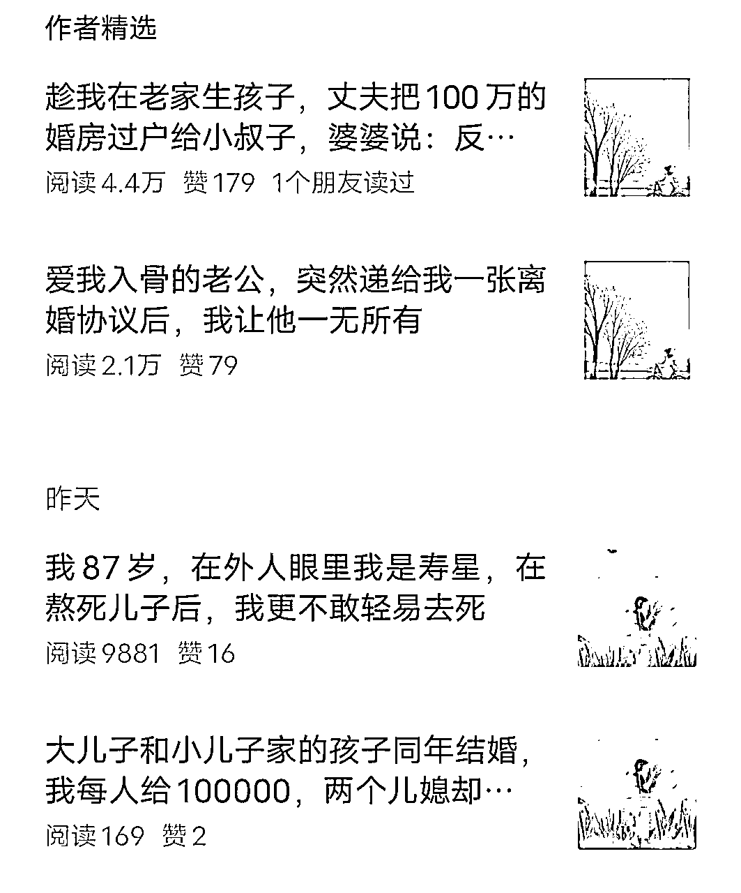

### 2：历史类

很多朋友做历史人物，历史故事选题，打开率都不错，很多上了年纪的人都喜欢看历史。

但是需要注意的是，近代史，涉及敏感人物，还是尽量别去写，因为流量池爆了，是很容易被人工审查的。

大家喜欢历史，可以尝试民间历史故事，或者名人故事，后宫情感故事等。

### 3：民生类

和我们普通人息息相关的，也是比较多人爱看的，比如农村，养生，健康，养老等等，但具体怎么写，还得看你们自己啦。

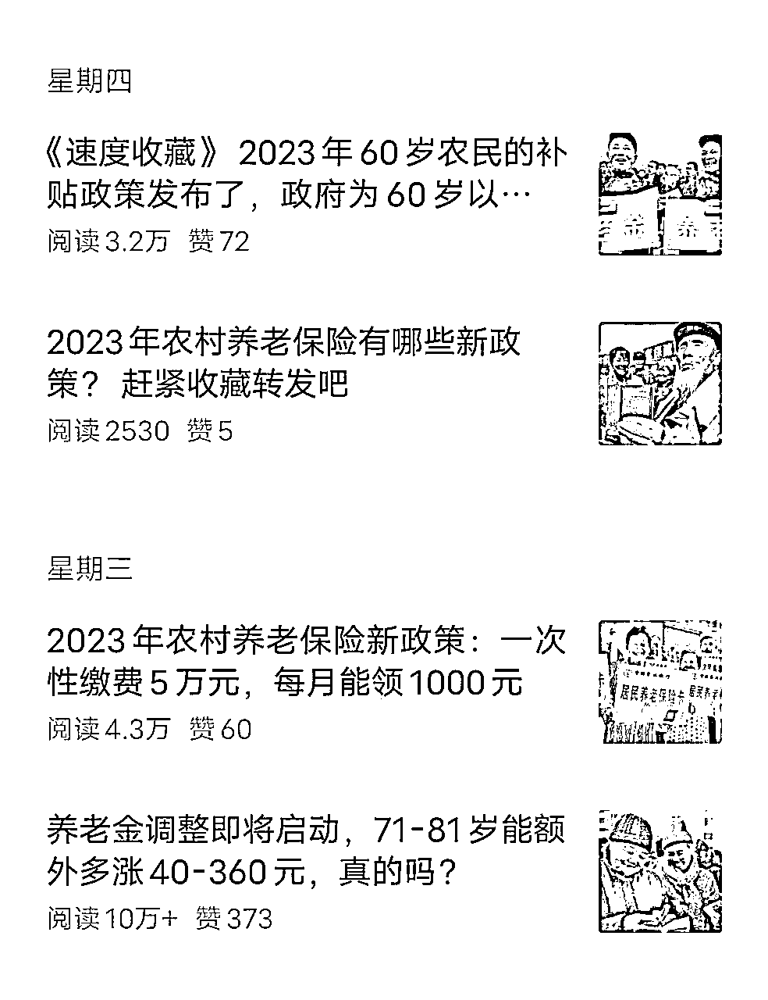

### 4：明星类

这个类目也可以说是名人类，名人自带流量，比如宋祖儿，马云，各种厉害的人物，出名的人物，他们的语录，他们的故事，很多人会忍不住点进去看，但要注意不要侵权。

### 5：评论类

甄嬛传，陈情令，各种爆火的电视剧电影，孤注一掷，你们去写这类型观点，也容易有流量，如果出了十万加阅读，可以和暖暖报喜奥。

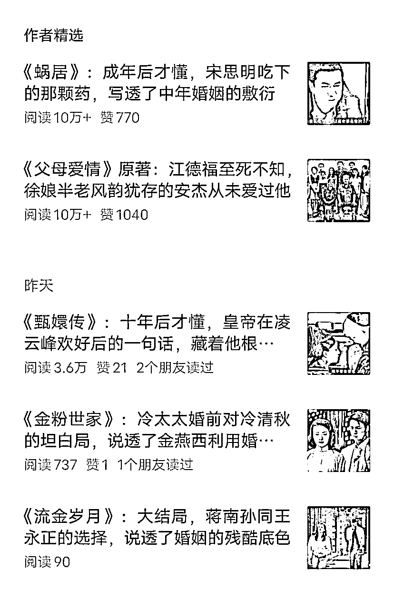

### 6：专业类

比如法律类型，医生方向的，如果没有很好的专业能力，不建议写，容易出问题，其次就是按公众号发布规则，不能写任何擦边，时政类型的文章。

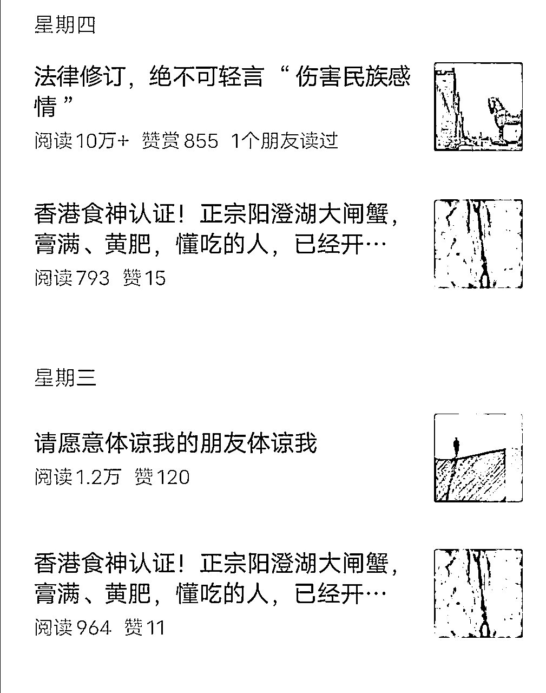

# 第三部分：小白如何快速上手gpt

我是今年年初接触gpt的，从gpt3.5用了一段时间，后来使用gpt4.0，就两者文章对比而言，确实gpt4.0方便很多。

但gpt4.0一个月费用在100以上，所以暖暖在几次调整指令后，将gpt3.5出的文章，调整到了和公众号文章风格差不多的类型。

# ai出文章的好处：

第一：适合零基础，或者没太多时间学习写文的小伙伴。

对于这类想做自媒体，内容能力缺乏的，AI可以帮助你们快速抓住选题，抓住内容框架，然后参考你投喂给它的文章，写出符合你要求的文章，这些文章，基本都是能过原创的，如果你们不放心，可以自己再二次修改，调整。

很多人对AI的印象，就是死板，一板一眼，首先，其次，最后，冰冷毫无温度的文字，也认为这种工具写出来的文章绝对没人会去阅读。

当然，我在没接触AI之前也这么想，不得不说AI真的一次次刷新我们的认知，据我目前一些团员使用的情况来看，AI写的故事，已经相当于1-3个月的故事作者了。

大部分看公众号文章的读者水平都很低，文化水平低，认知程度也不高，接触互联网的东西，没年轻人那么多。

年轻人爱看的公众号基本都是比较偏学习，赚钱，成长，鸡汤热点观点，而中老年读者，可能更倾向于转发祝福类型，养生类型，名人类型的故事或者文章到朋友圈，或者转发给身边的亲人朋友看。

大家有没有刷过父母们的朋友圈，收到过父母发给你的公众号文章，什么健康食物，什么注意防癌症的一些习惯，农村的读者，可能还会关注一些农村建设，三农，养老金等文章。

而这些，也是公众号爆文的主要部分，我们看似不起眼的领域，在公众号开通公域机制后，一马当先，成为了很多读者的心头好。

用AI去写这几类文章和故事，相当于把信息收集，重组，加工，直到完全符合你的要求，而且我们自己提取文章，自己编辑文字，确实没有AI这么得心应手。

大数据时代，工具确实省去了我们很多的时间和精力。

## 第二：AI可以批量生产文章（增加爆款概率）

有些团员，一听到我说公众号要日更，吓得连忙和我说没时间写，要上班，平时交一篇稿子，也要花很多时间，毕竟找选题就难住了很多人，可能你们刷几个小时视频，才能看到一个还不错的素材，对于没有搜商的姐妹来说，AI真的好处多多。

其次就是写文的时候，人物，故事情节，每一句话都需要反复斟酌。

这么说吧，故事，特别是好的故事，真的非常需要考验你的文字掌控能力，

有些人写文，就是鲜活的，一字一句仿佛跃然于纸上，让你看得入迷，舍不得停下来。

但有的人文笔功底不行，写两句，就劝退了读者，这也是为什么那么多学员和我说，觉得写故事赚钱好慢的原因。

在你们没有厚积薄发之前，一边写故事，一边用AI 辅助出故事或者文章，然后你们再加工修改，也能很好锻炼自己的写作能力。

而且公众号去年开通的公域机制，相当于几年前的头条号，相信很多做自媒体的都知道今日头条，也知道这个平台养活了很多创作者。

所以，我们运用AI批量出文章，也能解决原创作者出文章慢的问题，同时运营几个号，一同往一个方向发力，这样时间长了，出爆文的概率也会大大提升的。

试想下，如果你每天就写一篇文章，人家用AI 出十篇文章，谁的概率更大，谁的收益更多，在大部分读者文化水平不高的前提下，想迅速在公众号流量风口上赚第一笔金子，那肯定是量大引发质变了。

## 第三：AI正在飞速发展（黄金期）

我刚开始用AI的时候，它的文章质量远远比不上现在，现在出了GPT4，很多人都说比GPT3.5强。

我相信，大家在学会用AI后，不仅可以用AI 生产各种类型的文案，故事，文章，以后还可以学习AI的其他功能，说不定也会和你们的工作或者专业结合。

在多数人都想当斜杠青年的时候，多学一门技能，未来发展的机会就多很多。

# 新人如何拥有AI：

1：国内软件，有免费和付费。

2：用国外的gpt(文章质量相对较好）

## 新手如何调教AI写1000字的故事。

#### 第一步:找一篇爆过的文章，提取情节（或者文章链接）喂给ChatGPT。

很多人，在提取大纲的时候，都是直接使用的。

根据暖暖带团队的经验，大家可以等gpt出了不错的大纲后，手动修改下，避免重复度高，或者在开头增加悬念部分。

1000字的短故事，和我们3000字公众号故事不一样，建议分成4部分。

文章大纲：

第一部分：开篇悬念部分。

第二部分：事件起因（结合生活片段）

第三部分：故事高潮（解开悬念，要能够引起人共鸣）

第四部分：升华故事主旨，宣扬正能量。

我拿一篇公众号10w+阅读的gpt文章作为案例。

标题：泪目！河南一个10岁的小女孩已经是4个孩子的“母亲”

1：gpt提取故事大纲。

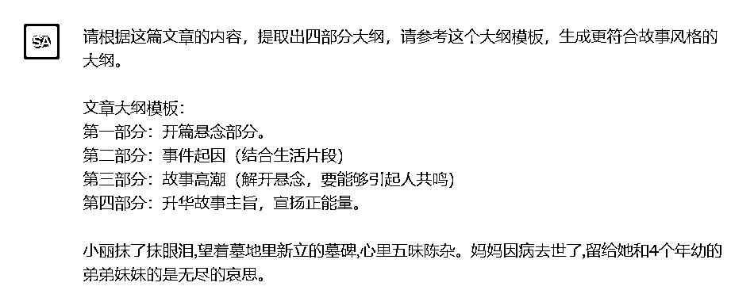

调教指令，大家可以修改优化。

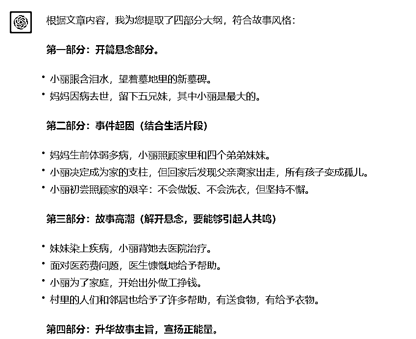

2：这个大纲，和原文章是比较像的，大家不能直接拿去使用。

建议手工修改下，让这个大纲更加曲折和充满悬念。

3：通过优化过的大纲，让gpt扩写出1000字故事，或者分每部分扩写几百字。

我这里就直接用原来的大纲，作为示范，直接扩写出1000字短故事了（大家可以自行优化）

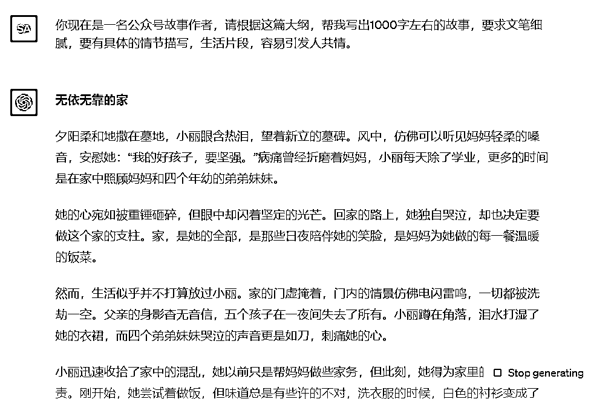

gpt写的故事，在大纲没有修改调整之前，是和原文章有些像的，所以尽量修改大纲，或者分每一部分去让gpt写故事。

公众号爆文故事，打开率基本都和标题封面有关。

比如这个标题自带悬念和反差，河南10岁的小女孩成为四个孩子的母亲。

大家找爆文选题的时候，可以多积累一些低粉爆文号，参考对方的标题，是怎么结合情节，带悬念，反差，情绪，冲突，比如金钱，拆迁，赌博，各种可能引起共鸣和情绪（悲伤，愤怒，好奇，同情）

只要标题和封面有吸引力，这篇文章就成功一半了。

# 第四部分：如何获得源源不断的爆文灵感

## 爆文故事的类型（细分）：

相信姐妹们，也刷到过一些故事，觉得都差不多，暖暖为什么要专门细分故事范围。

其实，故事对应的人群，远比你们想象得精准。

我给你们打个比方吧，就是这几年，很多广告商给我们投广告，都非常认可我的故事号，说转化不错，女性用品，小说充值都很高。

但我几个朋友，她们的账号就不行，每次广告商投放，转化效果特别差，不瞒你们说，我那些朋友经常想付费，花钱让我给她们输送粉丝，因为我的粉丝群体购买力强，每次广告都会复投，这也是我为什么这几年收入几百万的原因。

暖暖仔细分析了其中缘由，对比了我们同行的大部分故事公众号，有古风的，灵异的，现代情感的，职场故事的，还有婆媳的，虽然都是故事，但用户群体其实是有差别的。

比如转化最差的婆媳文章，婆媳故事，为什么呢？

因为她们粉丝大概率是困于婆媳矛盾中的人，你们觉得什么样的女人更容易陷入婆媳矛盾，要么是婆婆身份，要么是留在家照顾孩子，和婆婆一起居住的儿媳妇身份。

当然，也有少部分女生一边和婆婆居住，一边坚持工作，但非常少，仔细想一下，每天上班都忙不过来，如果有孩子，还要照顾孩子，哪里抽得出空去看公众号文章呢？

公众号婆媳文章的受众，大部分是宝妈，手里可能没什么钱的，还有就是婆婆类型的，比较谨慎省钱，六七十年代的人很多都是苦过来的，不会网上购物，或者舍不得大量购买的人居多。

这就导致了这类文章，可能看故事的时间多，但不一定舍得为你的产品或者你的广告付费。

这么说吧，我们公众号写爆文故事，需要的是阅读量，所以专门写给中老年群体看的文章，更容易受到她们的喜爱。

这也是为什么很多人用AI写出很多爆文的原因,用户水平不高的情况下，你写1000字她们也能看几分钟了。

文章长度短，完读率高，老人看文章慢一些，文章停留也会高，所以这类中老年情感故事的单价还不错，虽然比上不足，比下有余了。

那种高质量的，领域比较专业的，应该单价更高一些。

接下来，我们说下爆文故事的具体类型。

### 1：中老年情感故事。

很多人不知道情感故事有哪些，暖暖截图一篇情感故事的文章，给你们看看。

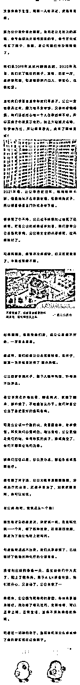

婆媳类型的矛盾，很多是普遍的大选题，比如生育问题，金钱问题，亲戚问题等等，你们要明确这个文章的定位，是多少岁的女性，跨度不要太大。

很多人今天写情感故事，和老公和婚外男人的，明天写婆媳，后天写大学生恋爱，会导致一种情况，你可能婚外的故事爆了，有几万阅读，但是婆媳的只有几个阅读，进而阅读极其不稳定，进了流量池，也相当于没进流量池。

这样长期下来，得不偿失，而且也没办法提升自己的写作水平。

大家可能以为，一千多字的故事没办法提升自己的文章质量。

其实不然，哪怕你们用AI去写，在润色或者指导的过程中，也是能够让你们对文字的敏感度提升的。

### 2：人物故事。

人物故事内容比较泛，围绕人物写的，比较谁谁谁的故事，选名人的，历史人物，或者明星，都会比较受欢迎，有知名度的人，自带流量，但不要写负面的，不然怕引起纠纷问题。

### 3：娱乐故事。

电影，电视剧，娱乐，网红类型的一些故事，注意不要侵权。

### 4：民生/历史故事。

民间故事，历史故事，比较有趣的，什么寡妇故事，都行，民间流传的小故事，可以去抖音快手等平台搜索，也可以去一些电台搜，有些历史书籍也会有这类故事。

不喜欢故事类型爆文的，也可以去找观点类型的爆文对标。

利用微信搜索关键词找到你要的类型10w+文章——订阅号消息往下拉，就会看到看一看，那里也有一些低粉爆文号——点进文章底下，也会有同类型爆文推荐。

前期多积累一些对标账号，选近期比较好的数据爆文选题，持续日更就可以进入流量池了。

# 第五部分：新人一天突破两百万阅读的技巧

暖暖几个团队成员都突破了一天100w左右阅读，有位更是突破了200w+阅读，今天和你们分享下，我运营公众号几年，对于爆文公众号的观察。

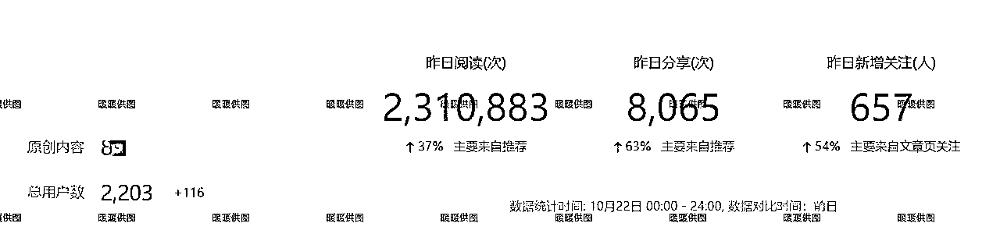

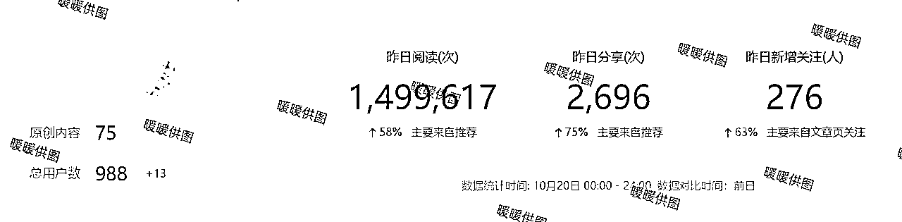

## 首先：给你们说下爆文的三个阶段：

### 第一个阶段：打破流量池的入门期

在流量池入门期，记住3个重点：

1：保持日更，时间允许，尽量1-2篇文章。

2：选自己擅长的方向，（内容标题参考对标账号）

3：一旦有入池的文章，立刻转入飞速提升期。

注意事项：超过两个月不入池，检查有没有这几个原因，一文章质量拉跨，二标题封面拉跨，三是不是经常断更。

如果都没有，那么你这个号应该是很难进流量池。

选择有一：注销，重新注册，二：换领域，再垂死挣扎下。

敲重点：暖暖团队执行力强，认真听课的基本都进入流量池了。（正常情况下,账号进流量池的概率没那么大，这也是为什么很多人爆文赚不到钱的原因）

很多人问暖暖，为什么同样的10w+选题，她的账号为什么只有一两个小眼睛，到底是怎么回事。

请大家按照前面的提示，确认下自己的问题。

我观察了大部分账号，很多同行的低粉爆文号，阅读很不理想，其实是思维固化了。

敲重点：GPT写文章，特别是观点文，很容易重复度高，就是原创度上不去。

易撰可以检测平台原创文章相似度，但是它没办法抓取公众号文章，只能作为参考。

这也是为什么，很多人抄一样的标题，阅读只有1-2个小眼睛的原因，当然账号权重低，也不容易爆文章。

暖暖给学员的建议是：

1：Gpt出大纲的时候，你们自己手工修改大纲，争取文章原创质量高一些。

2：自己手动修改文章内容，尽量开头用自己的话，抛出信息增量，拉近和读者的关系。

gpt可以帮助小白出文章，但只是开始，越来越多的低粉爆文号，都在使用gpt，你们想要一篇文章赚几千块，最好还是多手工润色，公众号原创始终是内容为王的。

3：注重自己账号的重复度。

比如同一部电视剧甄嬛传，或者名人名言，用的关键词，名词，情节基本一样，这就导致了你们前面阅读很爆，发多几篇就不行了。（自己原创的不算，gpt容易重复度高）

因为内容一直在重复，信息增量太少，标题和封面只是帮助你进流量池的。

如果系统认定你的账号，一直在重复写一样的事。

比如垂直度没问题，但情节经常性重复，可能很多低粉爆文号都在写类似的文章，会判定你的内容低质。

这种情况下，可能会暂时不给你流量，解决方法也不难，你们可以尽量提升原创度，让平台认为你是优质的内容创作者。

特别是对于一部分被判定滥用原创的作者，你们一定要切记，手写1000字。

写不出来，就在结尾补自己的自我介绍，编一个故事，和文章事件差不多的，增加原创度，比如我有个朋友，我有个亲戚，它怎么样。

千万不要反复去直接照搬gpt的文章，这样反复取消原创标记，是很影响的。

### 第二个阶段：进入流量池的飞速提升期

这个时期非常重要，如果踩雷了（比如公众号注意事项违规了，封号了）很有可能掉出流量池。

1：多发原创，原创度一定要高。

2：内容选题再优化下，不能持平的水平。

3：垂直度很重要，这个时期公众号标签会被打上。

4：出爆文后，一定要肝3-8篇，看自己的精力。

（暖暖在群里不定时投喂选题，执行力强的基本都入池了，其中两个学员肝八篇，基本都爆了五六篇）

流量飞速期，不能够错过，这也是暖暖团队一天突破200w+阅读的原因。

多篇爆文出现，会直接带动其他文章的阅读，大家也可以在底下插入往期推荐，引导读者去看你的文章，也有一些原创低粉爆文号，会留自己的微信号，引流到私域变现。

### 第三个阶段：稳定流量池的内容期

这是暖暖认为最重要的阶段，内容期。

相信对于很多写作者，或者内容创作者来说，一直用gpt或者长期写一些短文，时间长了会有些腻。

没关系，暖暖在这里和大家说下，爆文的最后，一定是持续性的内容竞争。

你们可以深耕，不断输出自己的内容，吸引更多精准用户。

流量主可以赚钱，但公众号也是有非常多变现方向的，比如暖暖的故事接广变现，付费阅读变现，带货变现等等，我会在接下来的帖子当中一一和大家介绍的。

运营爆文账号，需要极度理性，学会筛选对标，积累网感，不断优化调教指令，定期数据复盘，才能不断在数据起伏中，抓住爆文核心，一次赚几百几千块，月入过万，加油！

对于跑通1-2个账号的小伙伴，暖暖建议矩阵号操作，很多领域要不断测选题，才知道哪个赛道更适合你。

我的复盘到这里就结束了，感谢芷蓝姐和理白老师给我提供了很多帮助提供那么多优秀的项目和资源，让我受益匪浅。

最后，希望能帮到各位小伙伴，祝大家都能通过公众号爆文变现。