# 一个支付行业新手，3个月从0到63426！

> 来源：[https://kfeoftapye.feishu.cn/docx/RS4IdDCUJo2cx1xQAYmcDpftnhe](https://kfeoftapye.feishu.cn/docx/RS4IdDCUJo2cx1xQAYmcDpftnhe)

各位圈友好，我是晋四喜，算是老朋友了。

擅长线上引流和视频号电商，个人特点主打一个执行力强，勇敢试错。

目前主营业务是视频号后端店铺和短视频投放，还有一个无卡支付项目。

无卡支付是最近3个月刚跑出的新项目，目前有一个圈友跟着在跑，效果也还不错！前来给各位圈友分享，希望帮到有需要的圈友。

# 一、先看下里程碑

先说下收益：历时100天，业务从0到1，月收益从0到63426。

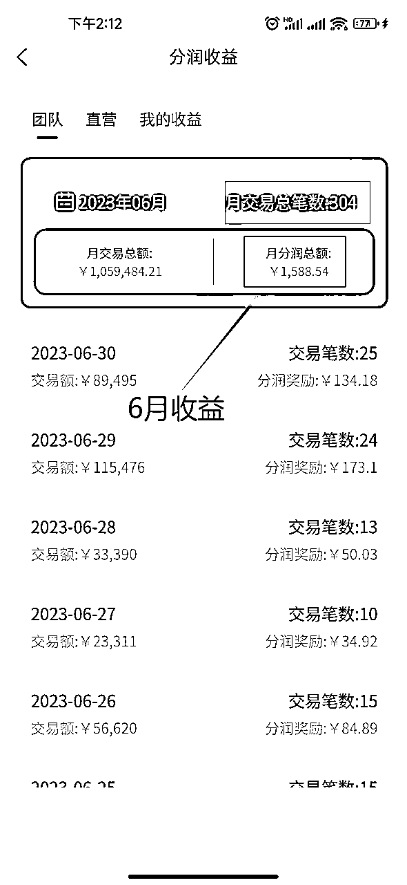

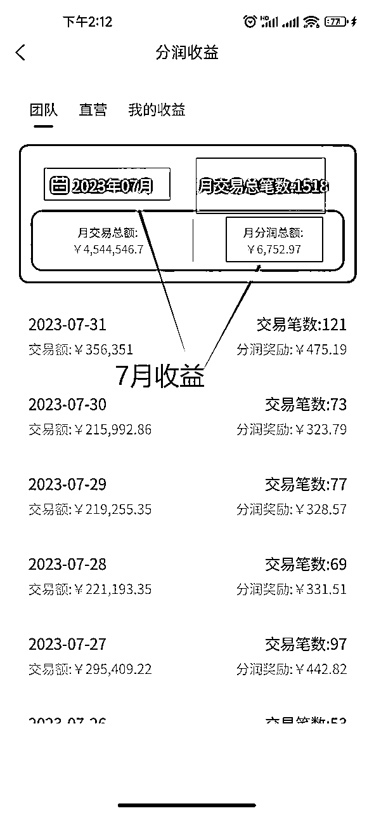

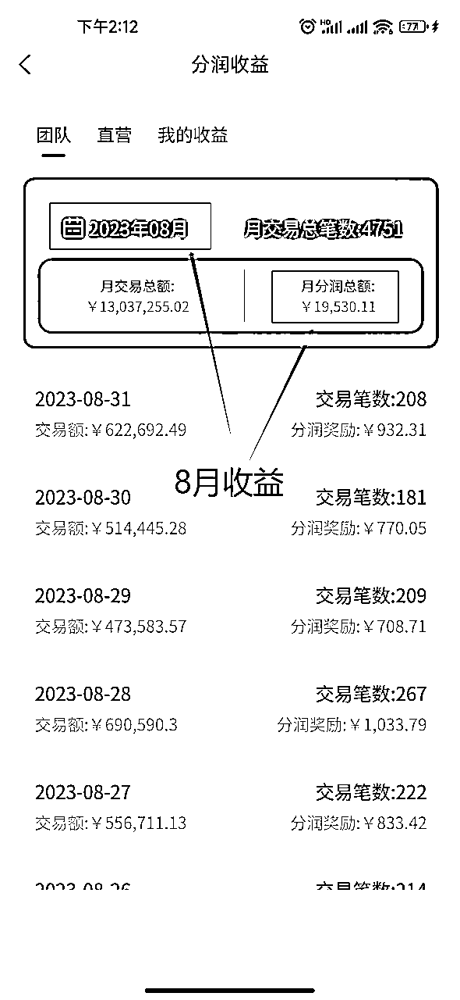

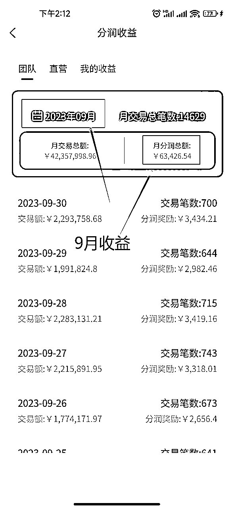

6月中旬启动的业务，在这看似不错的业绩下，反复迭代历时100多天。期间做了头条、小红书、百家号、抖音等平台，总计封了36个账号，才攻下第一个里程碑。

# 二、为什么会做这个项目

在进入生财的三年里，探索过很多项目。主要集中在引流和电商业务，感兴趣的可以看看我之前写的帖子：

在做上述项目过程中，积累了高效生产内容、打磨业务sop、私域转化的能力，也通过这些项目拿到了不错的收益。在自己小富即安时，今年五一假期和朋友喝茶聊到赚钱这个话题，才发现目前赚钱方法的风险性很大。原因有三：

1、电商的业务收入，只要一停下来就会中断。加上视频号平台的变动性很大，随机性抽风（懂得都懂）。

2、电商业务管理成本太高。需要在管理上面花费很多精力，同时还需要支付很高的人工成本。（成熟的短视频制作和直播的人工成本，平均要7K一个人）

3、电商业务的毛利率很低，金钱和精力的投产比不对等。看着每月几十万的GMV感觉不错，净利润率才10%出头。

我做的无货源电商业务，要找到短期收益问题不大，只要肯干。但从长线来说，不具备可持续性和被动管道收益。带着这个疑问，后来的半个月我开始想破局的方法，找具备长线属性的项目。

这期间拜访了不少朋友，直到遇到了涛哥（ps：发现身边叫涛哥的都挺牛逼），他给我提到了无卡支付。

其实支付在19年他就给我提过，那时做贷款业务，一个客户上万收入，根本瞧不上这个每个客户几十元的收益。说实话，在重提支付业务的时候我依然不感兴趣，（一个是感觉收益太低，一个是我团队不擅长电销和地推），但看到他团队300亿的月交易额和月入7位数的被动收益，我才知道是自己的认知太狭隘了。

## 1、决定试一试做无卡支付基于几个原因：

1、支付行业的管道收入，只要用户在刷卡收益就一直都在，并且具备一定复利，每个月的收益都会叠加上个月的。从口罩3年就能看出，支付行业是非常具备韧性的。

2、支付公司靠谱，有人行背书，属于头部资源，不用担心app关闭风险。（为此我还专门跑深圳去了一趟，去支付公司考察了一趟）

3、无卡支付适合线上推广。无卡支付相较于以前的器具POS机，没有区域使用限制，全国都可使用，就意味着全国的客户都可以推广。老支付人不擅长线上拓客，我引流团队的经验可以直接平移，测试成本低。

4、无卡支付更便于转化用户，用户粘性更高。用户只需要下载一个APP就可以实现POS的功能，不会产生任何初期费用，用户的从以前的pos设备到无卡，不用付出任何成本；粘性高相较于传统POS没那么容易被人切，想想谁没事愿意随时背个POS机。

5、最重要的是259号文件颁布，以前的POS机都会一机一商户，但是APP有丰富的线上商户池。这就意味着是一个行业的变革，利润会进行重新分配，才让我们这种新人有机会入局。

说实话，以前在考虑赚钱时，根本就没想过月入7位数这个目标，因为觉得太遥不可及了，但看到身边有现实的例子之后，才深刻的理解到苏世民《我的经验与教训》里提到的金句——做大事和做小事的难易程度是一样的，所以要选择一个值得追求的宏伟目标，让回报与你的努力相匹配。

# 三、我的支付创业之路

决定做这个项目之后，我立即把引流团队调了一个伙伴过来跑测试，主打一个说干就干。

## 1、行业研究做准备工作。

a1，找同行，看对标，

老规矩，一切新业务的开始都先从模仿开始。先找对标账号，走一遍他们的引流路径。

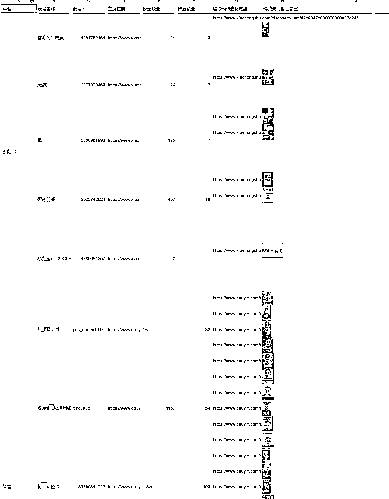

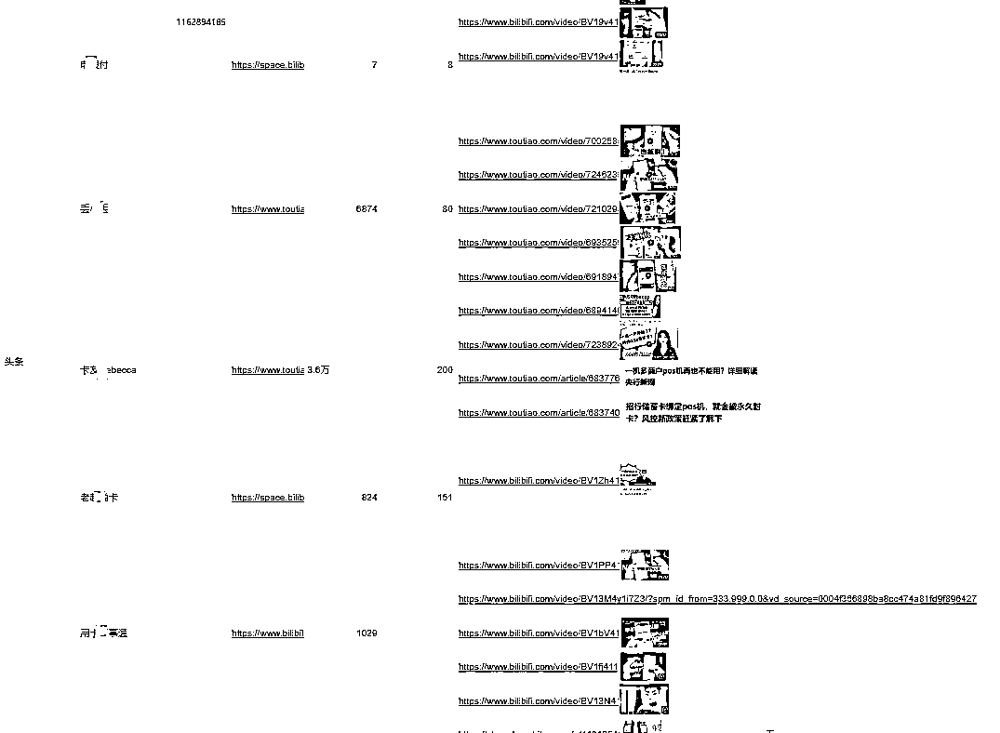

通过对同行的分析，发现百家号和小红书流量来源是搜索，头条和抖音流量来源主要是推荐。转化路径主要是通过私信和平台的关键词自动回复，引流到微信进行成交。

a2，分析用户需求，搭建素材库。

找到流量来源和转化路径之后，就开始着手生产内容。

通过5118提取需求词和全网下拉词，进行深度分析，确定选题。

下图是整理的选题库部分素材：

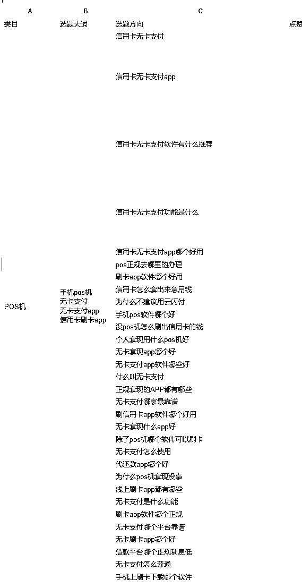

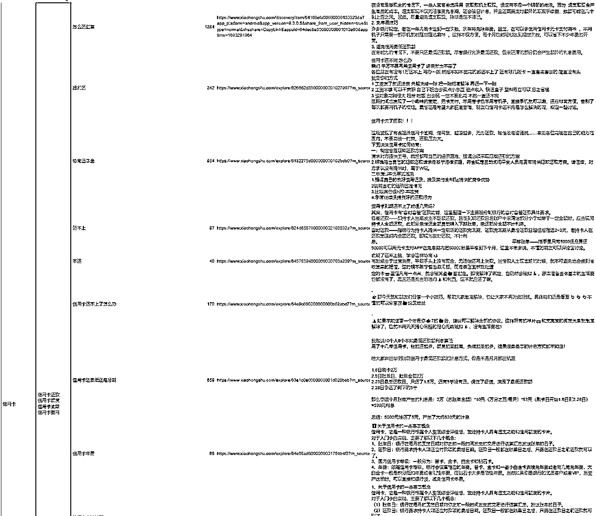

下图是我做的文章生成器各平台采集的基础素材，这就基本就把内容生产的问题解决了

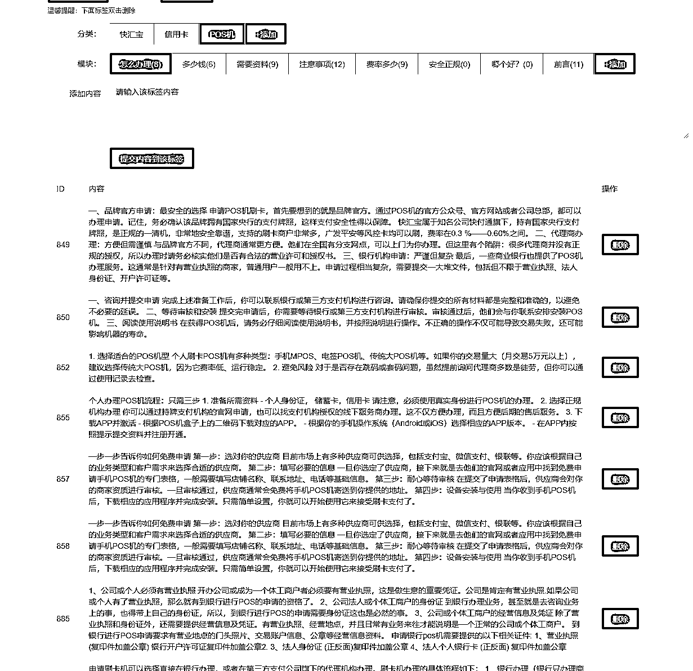

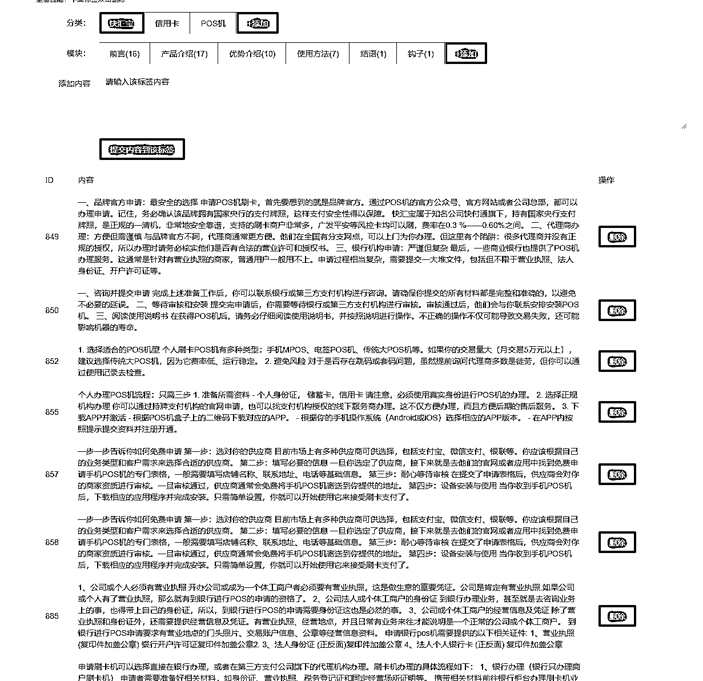

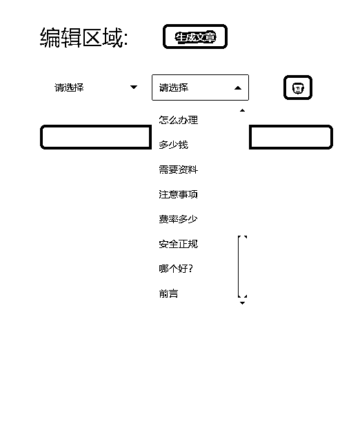

a3，行业小白入局，提升专业水平才能搞定流量转化。

通过扒拉上面的选题和内容模块，对行业有了基本的了解。然后找了两个线下的同行，协同整理了一份《pos专业问答》《POS线上销售流程》。

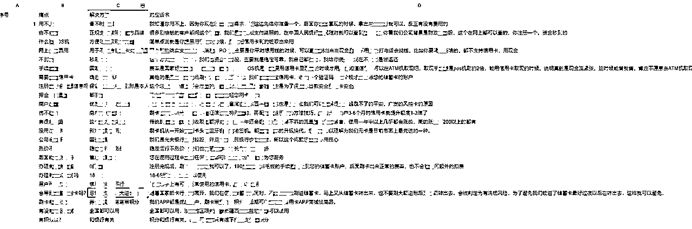

a4，起号养号。

第一批起号了5个头条，5个小红书，5个百家号，5个抖音。测平台反馈，同样也测试

很多人在这一步就会被难住，其实很简单，渠道能解决一部分，不能解决的4个运营商20张卡还不能解决吗？

要做免费流量的第一步就是解决账号问题。

记住注册账号的时候尽量不用WiFi，并且不要在同一地址下注册，手机直接去淘一个软件五开手机——联想拯救者Y70。一个手机所有账号登录。

## 2、测试平台容忍度。

因为内容涉及金融，每个平台管控力度各不相同，还要考虑测试生态情况（同行竞争是否存在恶意投诉）。最开始发布的。

目前测试出来小红书生态最差，每天被投诉；百家号平台管控力度较强，哪怕是蓝V都会被干；抖音和头条相对容忍度高一些。

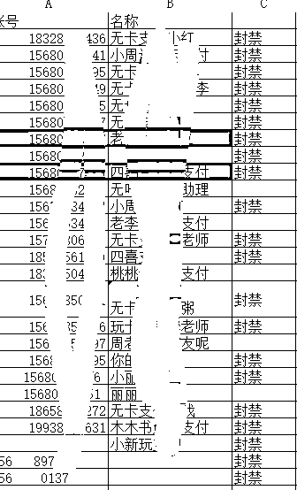

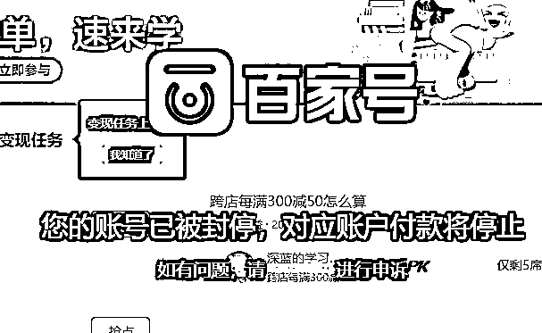

测试大概花了20多天，这个阶段小红书封了4个，百家号全军覆没，头条封了1个，抖音封了2个——这些炮灰一共引流了80多个到微信，转化了40多个，但下来一看分润才1000多，还是有一定的落差感。但本着一个项目没有3个月以上不要给自己下任何结论的原则，又继续踱步前行。

## 3、做正确的事才能事半功倍。

经历了第一阶段的踩坑，第二阶段就开始加账号加人，逐步放大。

两个人每个平台3个号，每天能引流12个人左右，每日激活量大概六七个，这样持续了半个月我就觉得数据增长太慢了，看了其他同行每天日均50户，我就知道肯定是自己方法有问题。

后面和涛哥沟通下来发现两个问题：一个是我们引流过来的都是直接客户，没有裂变代理，导致增量入口太小；部分用户激活了，但是没有交易量，缺少跟进维护。

找到问题答案自然就出来了：优化销售流程，在每个客户聊完之后，加上聊代理的环节；每周定期看数据，对交易异常用户进行二次跟进维护，提升台均交易额。

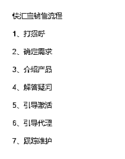

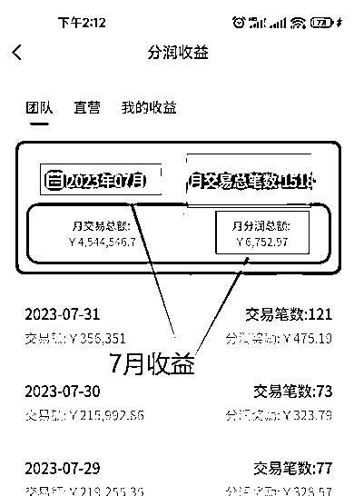

这次优化之后，每天除了引流新增转化，果然就出现了主动转化，收益也开始逐步上升。充分验证了做正确的事远比把事情做对重要，如果不知道是否正确，请主动请教可能有答案的人。

”给你敬佩的人写信或打电话，请他们提供建议或与其会面的机会。你永远不知道谁愿意跟你见面。最后你会从这些人身上学到很多重要的东西，建立你在余生都可以享用的人际关系。在生命早期结交的人，会与你缔结非同寻常的感情纽带。“——《我的经验与教训》，这句话在这里同样适用，主动才会有故事。

## 4、利人方能立于不败之地。

到8月中旬时，每天已经能稳定新增激活15户左右了。按照这个节奏下去，不出3个月2个人的月佣金应该能达到40000+了，但宏伟的目标可不止如此，该寻求更大的突破了。

我发现小代理确实逐步多起来了，但他们大部分都是为了降低自己的费率而去完成发展3户的目标，只有1个是真正想通过这个业务挣钱的，真正发力的也就是只有这个人。要想干大事，一个人肯定是干不成的，必须要有一群能干事的人才行。

之前一直没找人，因为我自己没亲自验证业务是否可行，现在自己小有结果了，也就能坦然的找人了。于是我开始在微信上翻找身边能干事的人，本着窄门进宽门出的原则，第一批次我只聊了5个人。

（什么叫窄门进宽门出：提高要求重点筛选，不做广撒网，找到真正能做事的人，5个窄门进往往比你找100个宽门的效果好很多）

这5个人通过反复沟通，成功影响了一个原本就在做这个行业的同行。他愿意尝试主要基于三个原因：行业259号文件导致的商户问题迫切需要解决；万十五的高分润，干一年抵三年；对于我追求目标的认同，愿意一同追求。后来也就有了9月的快速增长的收益。

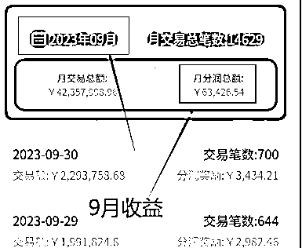

这几个月下来，我感觉到支付这个事很有意义。一能解决普通人的刷卡问题（这本质上是一个社会问题）；二能解决普通人低成本创业的问题，成就一些有能力的普通人。

想想如果有一天达到目标了，一转头发现成就了一群人，那种感受会远大于赚钱的成就感。

# 四、新手小白怎么做？

首先要判断是你是否适合做这件事，否则开始就是个错误，你可以参考一下几个指标：

1、自身资源情况咋样，是否有人脉可以整合。

2、是否有每天3个小时以上的闲暇时间。

3、是否具备一定的沟通能力，放不下面子做销售的就别考虑。

4、是否能接受一定的延迟满足，要达到每个月2K收入，个人应该要次月才行。

因为我是做线上引流出身的，只能分享一些线上的经验。不过创业这个事，用邓公的话说就是，“前期不管是白猫黑猫能抓到老鼠就是好猫。”

线上如果你精力有限，优先做头条和抖音，目前这两个渠道反馈周期比较短。

## 1、微头条怎么做

关于头条具体怎么做，这篇精华帖里已经描述的非常清晰了——直接看03、头条运营细节干货总结

## 2、抖音图文怎么做。

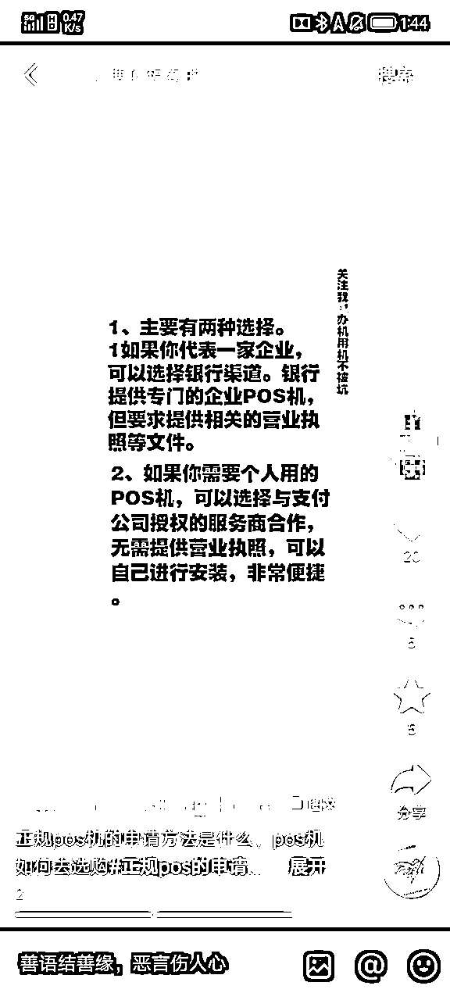

简单来说：一个创客贴，一个半蓝V，一个小回复，一人五个号

a、创客贴是一个在线作图软件，有个功能叫——智能设计和批量设计，你只需要键入内容，他就能自动生成素材；一个账号单日3条素材，速度快只需要15分钟。5个号最多2小时。

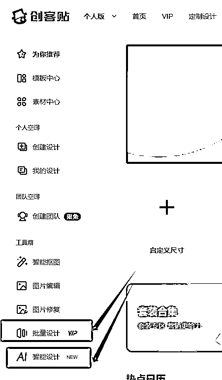

b，一个半蓝V，主要是为了增加用户信赖度。某宝花100元搞个个体执照即可。

c，一个小回复。这是一个抖音自动回复插件，能从抖音私信窗口自动跳转添加微信，避免没有及时回复消息。这个是个神器，非常好用。

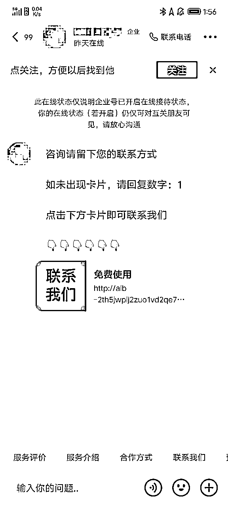

## 3、微信转化细节。

这个微信需要把朋友圈做好，方便构建信任承接转化。

朋友圈是由优质案例、生活分享、专业知识这几个要素构成；每天3-5条即可；

用户加过来的话术，可以直接参考我《pos专业问答》和《POS线上销售流程》，直接套用。

由于涉及支付，能用语音回复转化效果会更佳，用户的信任度会更高。

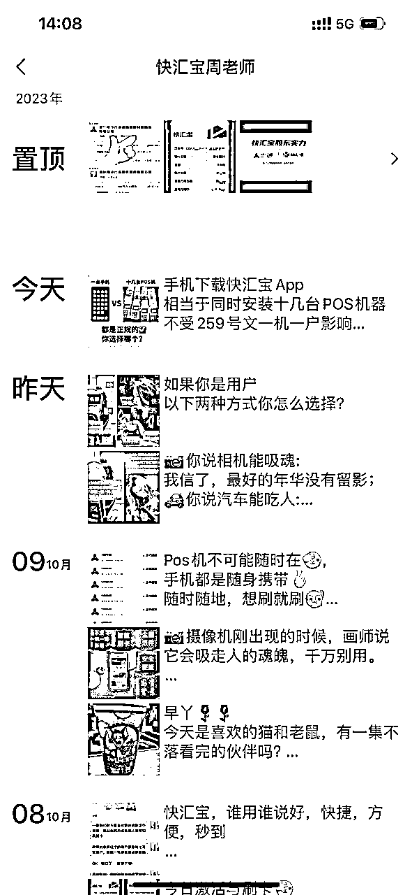

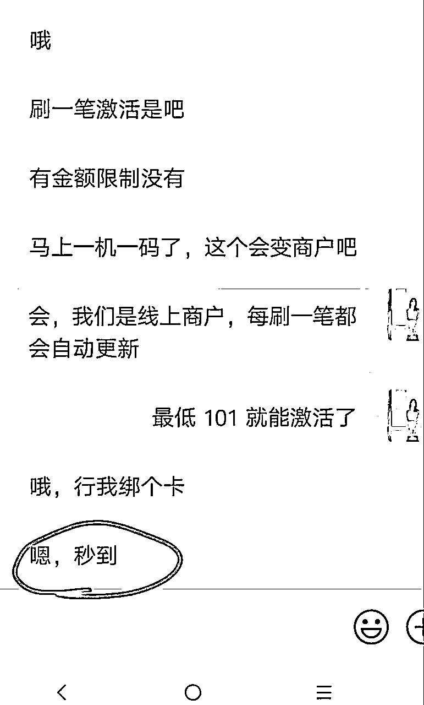

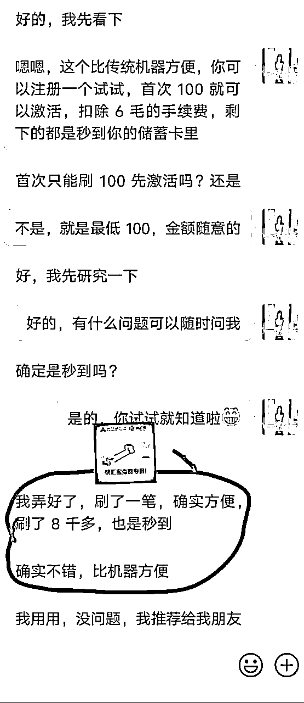

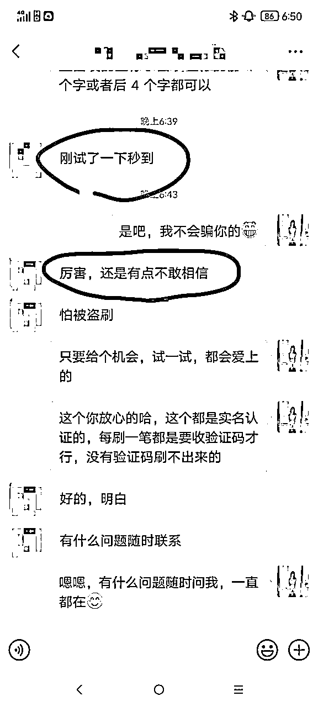

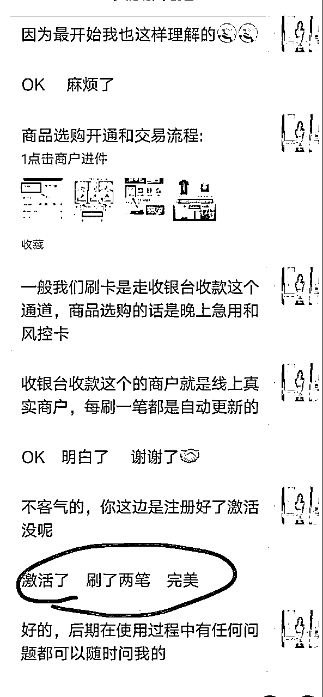

# 五、最后的话

说句实话，我快一年没在生财发过帖了，这次为什么要把这个机会分享出来。主要是寻找志同道合的伙伴，成人达己，合作共赢，我定义的就是找到五虎将。真要说能做事，生财里的伙伴天然已经优于大部分人了。

如果你已经在干支付，以下两点希望你能明白。

1、选品定生死：你的产品是否适合当下时代和用户的需求，这就和电商选品一样，选对品了爆单就像呼吸一样简单。无卡支付在当前阶段确实生逢时宜。

2、选好领头羊：一个好的大哥需要具备高层次的认知和思维能力，带你做正确的事，可以事半功倍；靠谱的口碑，愿意分钱，可以让你的努力不会付之东流。

感兴趣的圈友，欢迎来链接，一起迎接支付的新时代。V：xsd9092，备注，生财圈友

各位圈友好，我是晋四喜，算是老朋友了。

擅长线上引流和视频号电商，个人特点主打一个执行力强，勇敢试错。

目前主营业务是视频号后端店铺和短视频投放，还有一个无卡支付项目。

无卡支付是最近3个月刚跑出的新项目，目前有一个圈友跟着在跑，效果也还不错！前来给各位圈友分享，希望帮到有需要的圈友。

# 一、先看下里程碑

先说下收益：历时100天，业务从0到1，月收益从0到63426。

6月中旬启动的业务，在这看似不错的业绩下，反复迭代历时100多天。期间做了头条、小红书、百家号、抖音等平台，总计封了36个账号，才攻下第一个里程碑。

# 二、为什么会做这个项目

在进入生财的三年里，探索过很多项目。主要集中在引流和电商业务，感兴趣的可以看看我之前写的帖子：

在做上述项目过程中，积累了高效生产内容、打磨业务sop、私域转化的能力，也通过这些项目拿到了不错的收益。在自己小富即安时，今年五一假期和朋友喝茶聊到赚钱这个话题，才发现目前赚钱方法的风险性很大。原因有三：

1、电商的业务收入，只要一停下来就会中断。加上视频号平台的变动性很大，随机性抽风（懂得都懂）。

2、电商业务管理成本太高。需要在管理上面花费很多精力，同时还需要支付很高的人工成本。（成熟的短视频制作和直播的人工成本，平均要7K一个人）

3、电商业务的毛利率很低，金钱和精力的投产比不对等。看着每月几十万的GMV感觉不错，净利润率才10%出头。

我做的无货源电商业务，要找到短期收益问题不大，只要肯干。但从长线来说，不具备可持续性和被动管道收益。带着这个疑问，后来的半个月我开始想破局的方法，找具备长线属性的项目。

这期间拜访了不少朋友，直到遇到了涛哥（ps：发现身边叫涛哥的都挺牛逼），他给我提到了无卡支付。

其实支付在19年他就给我提过，那时做贷款业务，一个客户上万收入，根本瞧不上这个每个客户几十元的收益。说实话，在重提支付业务的时候我依然不感兴趣，（一个是感觉收益太低，一个是我团队不擅长电销和地推），但看到他团队300亿的月交易额和月入7位数的被动收益，我才知道是自己的认知太狭隘了。

## 1、决定试一试做无卡支付基于几个原因：

1、支付行业的管道收入，只要用户在刷卡收益就一直都在，并且具备一定复利，每个月的收益都会叠加上个月的。从口罩3年就能看出，支付行业是非常具备韧性的。

2、支付公司靠谱，有人行背书，属于头部资源，不用担心app关闭风险。（为此我还专门跑深圳去了一趟，去支付公司考察了一趟）

3、无卡支付适合线上推广。无卡支付相较于以前的器具POS机，没有区域使用限制，全国都可使用，就意味着全国的客户都可以推广。老支付人不擅长线上拓客，我引流团队的经验可以直接平移，测试成本低。

4、无卡支付更便于转化用户，用户粘性更高。用户只需要下载一个APP就可以实现POS的功能，不会产生任何初期费用，用户的从以前的pos设备到无卡，不用付出任何成本；粘性高相较于传统POS没那么容易被人切，想想谁没事愿意随时背个POS机。

5、最重要的是259号文件颁布，以前的POS机都会一机一商户，但是APP有丰富的线上商户池。这就意味着是一个行业的变革，利润会进行重新分配，才让我们这种新人有机会入局。

说实话，以前在考虑赚钱时，根本就没想过月入7位数这个目标，因为觉得太遥不可及了，但看到身边有现实的例子之后，才深刻的理解到苏世民《我的经验与教训》里提到的金句——做大事和做小事的难易程度是一样的，所以要选择一个值得追求的宏伟目标，让回报与你的努力相匹配。

# 三、我的支付创业之路

决定做这个项目之后，我立即把引流团队调了一个伙伴过来跑测试，主打一个说干就干。

## 1、行业研究做准备工作。

a1，找同行，看对标，

老规矩，一切新业务的开始都先从模仿开始。先找对标账号，走一遍他们的引流路径。

通过对同行的分析，发现百家号和小红书流量来源是搜索，头条和抖音流量来源主要是推荐。转化路径主要是通过私信和平台的关键词自动回复，引流到微信进行成交。

a2，分析用户需求，搭建素材库。

找到流量来源和转化路径之后，就开始着手生产内容。

通过5118提取需求词和全网下拉词，进行深度分析，确定选题。

下图是整理的选题库部分素材：

下图是我做的文章生成器各平台采集的基础素材，这就基本就把内容生产的问题解决了

a3，行业小白入局，提升专业水平才能搞定流量转化。

通过扒拉上面的选题和内容模块，对行业有了基本的了解。然后找了两个线下的同行，协同整理了一份《pos专业问答》《POS线上销售流程》。

a4，起号养号。

第一批起号了5个头条，5个小红书，5个百家号，5个抖音。测平台反馈，同样也测试

很多人在这一步就会被难住，其实很简单，渠道能解决一部分，不能解决的4个运营商20张卡还不能解决吗？

要做免费流量的第一步就是解决账号问题。

记住注册账号的时候尽量不用WiFi，并且不要在同一地址下注册，手机直接去淘一个软件五开手机——联想拯救者Y70。一个手机所有账号登录。

## 2、测试平台容忍度。

因为内容涉及金融，每个平台管控力度各不相同，还要考虑测试生态情况（同行竞争是否存在恶意投诉）。最开始发布的。

目前测试出来小红书生态最差，每天被投诉；百家号平台管控力度较强，哪怕是蓝V都会被干；抖音和头条相对容忍度高一些。

测试大概花了20多天，这个阶段小红书封了4个，百家号全军覆没，头条封了1个，抖音封了2个——这些炮灰一共引流了80多个到微信，转化了40多个，但下来一看分润才1000多，还是有一定的落差感。但本着一个项目没有3个月以上不要给自己下任何结论的原则，又继续踱步前行。

## 3、做正确的事才能事半功倍。

经历了第一阶段的踩坑，第二阶段就开始加账号加人，逐步放大。

两个人每个平台3个号，每天能引流12个人左右，每日激活量大概六七个，这样持续了半个月我就觉得数据增长太慢了，看了其他同行每天日均50户，我就知道肯定是自己方法有问题。

后面和涛哥沟通下来发现两个问题：一个是我们引流过来的都是直接客户，没有裂变代理，导致增量入口太小；部分用户激活了，但是没有交易量，缺少跟进维护。

找到问题答案自然就出来了：优化销售流程，在每个客户聊完之后，加上聊代理的环节；每周定期看数据，对交易异常用户进行二次跟进维护，提升台均交易额。

这次优化之后，每天除了引流新增转化，果然就出现了主动转化，收益也开始逐步上升。充分验证了做正确的事远比把事情做对重要，如果不知道是否正确，请主动请教可能有答案的人。

”给你敬佩的人写信或打电话，请他们提供建议或与其会面的机会。你永远不知道谁愿意跟你见面。最后你会从这些人身上学到很多重要的东西，建立你在余生都可以享用的人际关系。在生命早期结交的人，会与你缔结非同寻常的感情纽带。“——《我的经验与教训》，这句话在这里同样适用，主动才会有故事。

## 4、利人方能立于不败之地。

到8月中旬时，每天已经能稳定新增激活15户左右了。按照这个节奏下去，不出3个月2个人的月佣金应该能达到40000+了，但宏伟的目标可不止如此，该寻求更大的突破了。

我发现小代理确实逐步多起来了，但他们大部分都是为了降低自己的费率而去完成发展3户的目标，只有1个是真正想通过这个业务挣钱的，真正发力的也就是只有这个人。要想干大事，一个人肯定是干不成的，必须要有一群能干事的人才行。

之前一直没找人，因为我自己没亲自验证业务是否可行，现在自己小有结果了，也就能坦然的找人了。于是我开始在微信上翻找身边能干事的人，本着窄门进宽门出的原则，第一批次我只聊了5个人。

（什么叫窄门进宽门出：提高要求重点筛选，不做广撒网，找到真正能做事的人，5个窄门进往往比你找100个宽门的效果好很多）

这5个人通过反复沟通，成功影响了一个原本就在做这个行业的同行。他愿意尝试主要基于三个原因：行业259号文件导致的商户问题迫切需要解决；万十五的高分润，干一年抵三年；对于我追求目标的认同，愿意一同追求。后来也就有了9月的快速增长的收益。

这几个月下来，我感觉到支付这个事很有意义。一能解决普通人的刷卡问题（这本质上是一个社会问题）；二能解决普通人低成本创业的问题，成就一些有能力的普通人。

想想如果有一天达到目标了，一转头发现成就了一群人，那种感受会远大于赚钱的成就感。

# 四、新手小白怎么做？

首先要判断是你是否适合做这件事，否则开始就是个错误，你可以参考一下几个指标：

1、自身资源情况咋样，是否有人脉可以整合。

2、是否有每天3个小时以上的闲暇时间。

3、是否具备一定的沟通能力，放不下面子做销售的就别考虑。

4、是否能接受一定的延迟满足，要达到每个月2K收入，个人应该要次月才行。

因为我是做线上引流出身的，只能分享一些线上的经验。不过创业这个事，用邓公的话说就是，“前期不管是白猫黑猫能抓到老鼠就是好猫。”

线上如果你精力有限，优先做头条和抖音，目前这两个渠道反馈周期比较短。

## 1、微头条怎么做

关于头条具体怎么做，这篇精华帖里已经描述的非常清晰了——直接看03、头条运营细节干货总结

## 2、抖音图文怎么做。

简单来说：一个创客贴，一个半蓝V，一个小回复，一人五个号

a、创客贴是一个在线作图软件，有个功能叫——智能设计和批量设计，你只需要键入内容，他就能自动生成素材；一个账号单日3条素材，速度快只需要15分钟。5个号最多2小时。

b，一个半蓝V，主要是为了增加用户信赖度。某宝花100元搞个个体执照即可。

c，一个小回复。这是一个抖音自动回复插件，能从抖音私信窗口自动跳转添加微信，避免没有及时回复消息。这个是个神器，非常好用。

## 3、微信转化细节。

这个微信需要把朋友圈做好，方便构建信任承接转化。

朋友圈是由优质案例、生活分享、专业知识这几个要素构成；每天3-5条即可；

用户加过来的话术，可以直接参考我《pos专业问答》和《POS线上销售流程》，直接套用。

由于涉及支付，能用语音回复转化效果会更佳，用户的信任度会更高。

# 五、最后的话

说句实话，我快一年没在生财发过帖了，这次为什么要把这个机会分享出来。主要是寻找志同道合的伙伴，成人达己，合作共赢，我定义的就是找到五虎将。真要说能做事，生财里的伙伴天然已经优于大部分人了。

如果你已经在干支付，以下两点希望你能明白。

1、选品定生死：你的产品是否适合当下时代和用户的需求，这就和电商选品一样，选对品了爆单就像呼吸一样简单。无卡支付在当前阶段确实生逢时宜。

2、选好领头羊：一个好的大哥需要具备高层次的认知和思维能力，带你做正确的事，可以事半功倍；靠谱的口碑，愿意分钱，可以让你的努力不会付之东流。

感兴趣的圈友，欢迎来链接，一起迎接支付的新时代。V：xsd9092，备注，生财圈友

对了，最后提一句，玩这个项目不需要任何的费用，需要的是时间和结合自己的能力资源来开展业务推广。

APP名称叫：快汇宝。支付公司全称叫：深圳市快付通金融网络科技有限服务公司

下面是爱企查里的股权穿透图和相关资质：

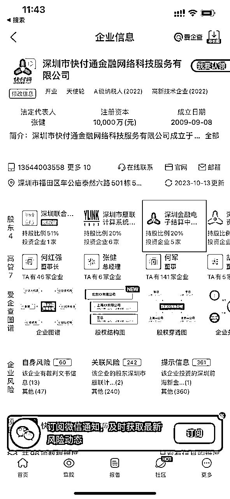

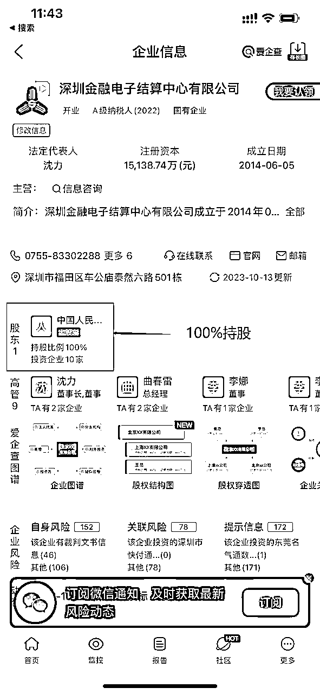

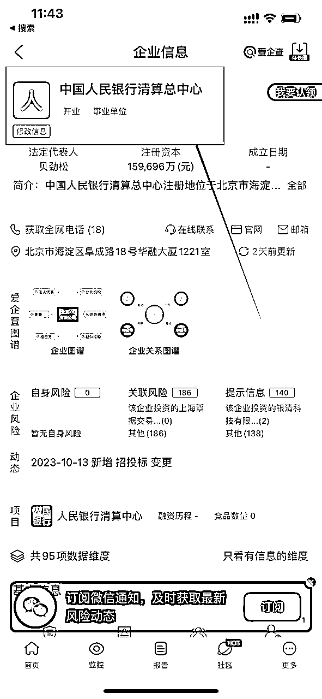

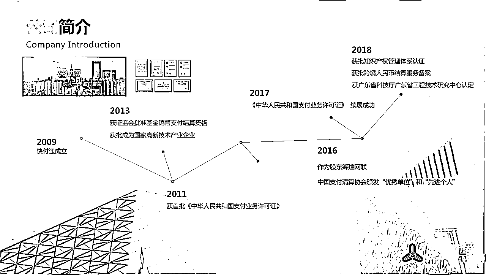

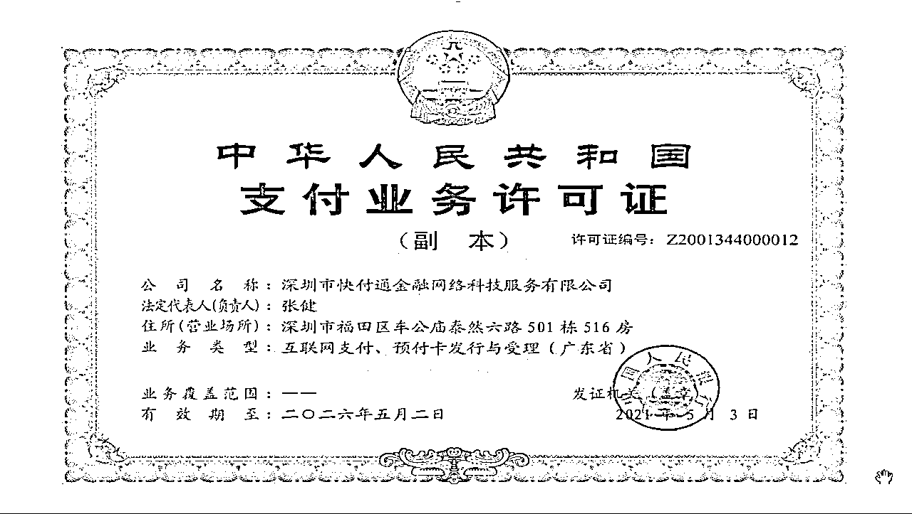

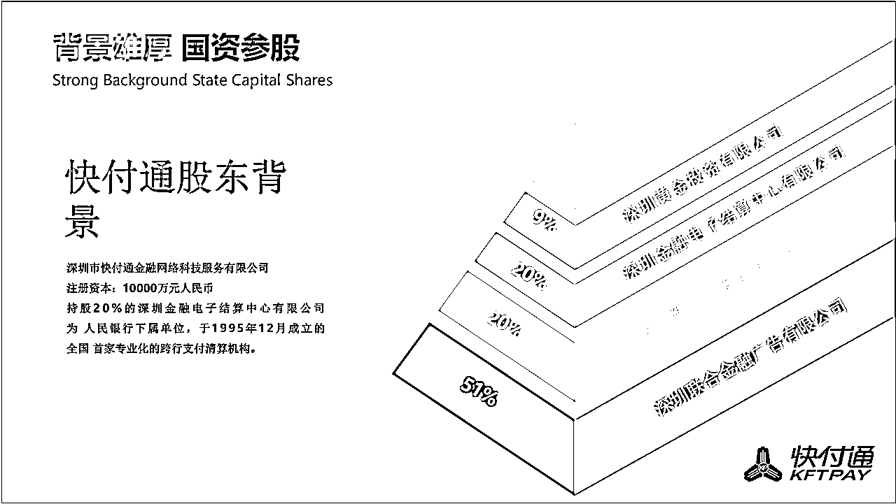