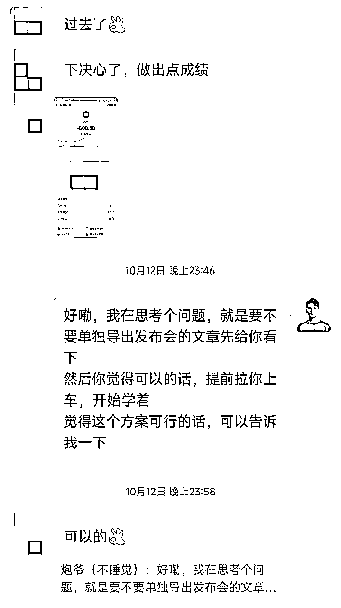

# 小红书海外高端旅游项目，单场发售变现 60W，转化率 97%，经验分享给你像素级模仿复制

> 来源：[https://qpztiqweer.feishu.cn/docx/RUXldhvOcoBKewxqfJYc9sXCnBd](https://qpztiqweer.feishu.cn/docx/RUXldhvOcoBKewxqfJYc9sXCnBd)

最近我和超人 的小红书海外高端旅游项目，设计了一场项目浪潮式发售，4000-5000的客单价，变现 60W。项目首发当日人数便突破了 130 人，现在是首发后的第 5 天（2023/10/18），人数来到了 160+ 人。

其中，预报名人数的转化率甚至达到了出乎我们意料的 97%，这个转化率已经远远超过了我们的预期。了解到市面上一些同行朋友类似的玩法，三四千以上客单价的项目，预报名的人数，通常来说，转化率在 80% 左右就属于是非常优秀的了。

所以综合来看，我们预报名的人数和转化率都还可以，成绩不错，大家可以直接参考拿去复制。整个可复制的发售的逻辑、流程、框架、时间节点的安排，我都在下文一五一十地分享出来了，你们拿去直接像素级模仿就好。

首发结束后，我在我的广告拆解小群里也说了下这个事儿。那会儿转化率是 96%，但后续有几个犹豫的同学也都补了尾款上车，劝退了 3 个我们觉得过于犹豫和问题比较多的朋友，所以最终的数据是超过了 97% 的转化率。

当时本想周末的时候抽空写一下复盘，但最近确实也很忙，星球都好久没打开过了，周末也要处理一些客户的问题和学员的问题，加上还有其他事，这事儿就给耽搁了。

最近陆陆续续有一些朋友过来想找我们合作，但前面有点忙，我们连对外合作的策略都还没最终整好。想着不能再拖了，先赶紧硬着头皮来写一下发售复盘先吧。

本来不太想披露我们的发售流程的，说实话考虑到我们的发售结果和发售的玩法，我去给别人操盘也是要收费 5～6 位数的，但想了想算了，我们现在业务也忙，我也没太多时间去帮别人操盘啥，权当回馈大家吧，希望对你们有帮助。

只是希望你们看完记得点个赞，给我一些正反馈，我觉得我愿意把这么值钱的东西开放出来给你们直接像素级模仿复制，应该是值得你们手中的一个赞的。

在正式复盘拆解我们的发售动作之前，我先简单介绍一下小红书海外高端旅游这块吧，了解了项目的背景之后，再去看项目发售设计的流程，也能更好理解，更有代入感。

# 一、项目介绍

OK，这里只是简单介绍一下海外高端旅游项目的一些背景和前景，篇幅有限，具体的玩法就先不介绍了。

小红书海外高端旅游项目，是指在小红书平台上获取精准客户流量，通过引流到自己微信，然后筛选目的明确的客户，推给后端靠谱的旅行社进行成交以及交付。

境外游，一般产品5%~10%，极端的可达到20%、30%甚至更高。

我们按照一般的产品来算，平均客单价在2W~5W，而且一般都是两人以上出行，甚至有的10+，20+人一起出行的，还有的可能是几个家庭一起，或者公司团建之类的，人数会比较多。

算平均2人出行的话，一单客单价在4W~10W，对应的佣金为2000~1W。

优点：市场大，目的地产品众多，成本低，可复制性强，客单价高，佣金比例还行

缺点：成交周期长（慢的话可能得一两月后才能成交），对应的佣金结算长（得等到客户旅完游结算），以及早期即时正反馈不明显（如果每天只能加2~5人，而且连续一周，半个月都只是咨询，没有出单，容易坚持不下去以及焦虑）

而我们需要做的，就是从内容平台上引流精准目标客户，加到私域上，确认好人数、出行时间、预算，以及具体的需求然后拉群对接给资源方，让他们进一步沟通成交就好。

我们测下来，一般一个人，5~10个号，平均每天花2个小时左右，严格按照我下面给的SOP来操作，一个月出3、5、10单是不难的，跑通之后，还可以上更多的号，因为可复制性是真的很强，加上我们玩法也是独创的，确实挺奏效。

项目的前景自然就不必多说了，过去口罩三年，海外旅游这块可以说是直接停滞了，而今年也是口罩开放后的第一年，整个行业百废待兴，也正是在这样的背景下，对于咱们会互联网玩法的人来说，是绝对的利好。

拿我们来说吧，我们目前的对手基本就是传统旅行社，我们的玩法完全为独创，再加上我们懂线上运营和流量获客，懂私域运营和销售转化等，各种综合起来，用来打传统旅行社，就是降维打击。

甚至可以说，目前赛道里面没有同行会这种玩法，我们目前也没啥同行，直营➕培训，近 200 号人直接铺开，作为第一波吃螃蟹的人，我们在各个圈子内，整这么大的应该也是第一波，甚至可能我今天不来发这篇帖子，很多人对这块可能还丝毫没有关注到。

OK，小红薯海外高端旅游这块项目的背景，这次就先简单介绍到这里，有个概念，方便理解下面的发售流程为什么这么设计就行。

# 二、发售流程

这次的发售，运用了浪潮式发售的流程，大家可以对照着我朋友圈的发售流程来看，理论➕实践，一下就能看明白了，不然就只会停留在理论阶段。

推荐大家可以去看一下《浪潮式发售》这本书，在微信读书上就有电子版。

按照这本书的流程，一场发售分为：造势-预售-发售-跟进四个流程。

*   造势：培养“粉丝”对产品的期待。

*   预售：三段式预售内容渲染市场（说人话就是开放预报名）。

*   发售：正式对外发售，正式开卖。

*   跟进：扫尾阶段，比如收齐尾款，跟进好意向用户等，做好扫尾，也是下一场发售的基础。

按作者书中的发售方法，整个发售过程要持续 10 天，但最终评估过后，我们还是觉得 10 天有点太长了，对我和超人而言，都觉得周期拉得太长了对我们会有些内耗，所以将周期从 10 天缩短到了 7 天。

所以大家在设计发售的时候，一定要根据自己的实际情况做好评估，不要做内耗式的操作，那样你的动作会很容易变形，一定要根据自己的风格和实际情况来。

于是基于这个思路，我们设计了为期一周的发售流程，其中——

*   造势：2 天

*   预售：4 天

*   发售：1 天

然后中间以及发售结束后，穿插着跟进的流程。

本来我们是想着国庆节之前就早点发售的，但按照 7 天的周期，中间正好赶上了中秋和国庆，有点拿捏不好发售的效果。

于是跟我的合伙人靠谱姐 @梁靠谱 电话聊了一下，她根据自己多年的销售经验给了我们建议，让我们假期就先好好休息，发售调整到中秋国庆假期之后再开始。不然发售撞到了假期，大家都在玩，没啥心思关注我们朋友圈的发售，就功亏一篑了。

听取了谱姐的建议之后，这次发售也特别的超预期，首发当日一下突破了 130 人，收款 40W+，现在是首发后的第一周，实战营突破 160 人，收款 60W。

# 三、发售逻辑

发售的逻辑其实很简单，简单来说，从产品设计、用户心理两个大的方面去看。

## 产品设计

首先是产品设计的层面，这是重中之重。如果你的产跟进品本身不过关，那么你是很难撑得起这套发售流程的。

### 产品价值

产品价值是基础，首先要明白的一点是，因为产品好，所以才会受用户欢迎，而不是因为受用户欢迎，所以产品好。一定是因为产品本身有价值，所以用户才会无脑冲。拿我们这次发售的产品「小红书海外高端旅游」项目来说吧，高客单，利润还可以，关键是还有复购，私域有积累，都是高净值客户，价值很高，做起来也不累，这是产品本身的家价值。

过往大家做的都是一些流量项目，比如虚拟（资料）电商这种，我们团队也做过，客单价低，钱没赚几个，还动不动被用户举报，微信就被封了 10 多个，做得那是真的叫一个心累。加上口罩三年，海外高端旅游这块从完全停滞到百废待兴，整个行业释放出了很大的红利。

赶上了这个节点，大家都想从一味地费心费力地追流量，转型到高客单、有复购、做着不累，关键还有私域积累的项目上，而海外高端旅游正好满足这样的需求。这就是产品本身有价值，所以在下半年，知识付费这块普遍很疲软的情况下，我们才能一经推出就爆了，比我们预期的数据多了整整 100+ 人，远远地超预期了。

### 用户价值

除了产品本身的价值之外，站在用户角度，去看一个互联网项目，他所担心什么、希望什么、疑惑什么这是情绪或者精神上的价值。那从物质角度去看项目，无非就是能给他带来多少利益，为他产生多少价值。

而小红书海外高端旅游项目，确实是普通人比较容易操作和见到效果的，也有真实案例做辅助，并且我们玩法独创，一点不卷，做着不心累。

### 产品架构

项目（产品）模式的设计决定了项目（产品）的高度，所以在发售项目（产品）的时候，需要从更高的维度去设计，用心地去做好产品的整个架构。只有在实际的基础上，把产品或者服务的高度做营销化的处理，才能事半功倍。

比如，自营团队➕培训筛选➕后端分润➕孵化优秀学员组建团队，占股分红等......好的产品架构，决定了你做一个项目的天花板，产品架构设计好，项目盘子才能放大，培训更多只是你筛选人的工具和手段，不然单纯靠培训是赚不了太多钱的。不是有一句话是这么说的吗，没有小项目，只有把项目做小的人。

### 产品客单价

在我看来，如果的要发售的产品客单价太低，那用这套流程多少就有点「杀鸡用牛刀」的意味在里面了，对于低客单价的产品，直接卖就好了，没必要整这么一套发售流程，很难撑得起来。如果你的产品客单价在 2000 以上，那么是值得试一试的。

### 发售设计

设计的层面，主要分两块：游戏化设计和浪潮式推动。

游戏化设计：

简单来说，我们把一场发售活动设计得有点像游戏通关一样，让整场发售的营销在无形之中把大家带入到游戏中，先是造势，再是预售，最后才是正式的发售环节，有点像你打游戏，打完了一关，通关了再打下一关，然后最后是打大 BOSS，正常发售的节奏轻松愉快。

比如在我们的发售过程中，用户交了 500 定金提前锁定不涨价特权，这其中是有一些心理学层面的东西在里面的，因为用户都是有损失厌恶心理的，都担心涨价后要多花钱。

把整个发售过程和交付过程都游戏化之后，用户的参与感、打怪升级的游戏体验感都会得到很大的满足。游戏化的设计➕营销，二者结合，不但不打扰用户，而且效果还特别好。

浪潮式推动：

三次波浪，越推越高。造势-预售-发售，三波浪，一浪比一浪高，加上多次一对一私聊触达，以及提前的盲定阶段。

## 用户心理

### 沉没成本

我们这次发售的设计环节中，有一个环节是要用户交 500 或者 1000 的定金，提前锁定不涨价的特权。那么交定金这个环节，其实就是为了增加一个沉没成本，这样用户在做决策的时候，因为已经花了 500-1000，如果不上车的话就会感觉很亏。

沉没成本这个也很好理解，就好比你花了一两百块买了几张电影票，但是你不想看了或者在看电影的过程中，发现电影不太好看，可一想到已经花了钱了，硬着头皮也要看完，那么你付的电影票的钱，你就是所付出的沉没成本。

### 共赢思维

一个项目如果想要把盘子做大，那么肯定不能只想着自己受益，还要考虑用户的既得利益。

想要共赢，那在做任何动作之前，都必须把项目方本身和用户的利益链条都思考清楚，把整个项目的体系设计好，只有站在用户的角度去思考，才能把整个盘子给盘活。

不然如果你只盯着用户口袋里的钱，那么势必就会导致吃相很难看，那不就成了大家口中的“大割”们了吗？

比如我们这次的设计中，就是跟学员长期利益深度绑定的，他们赚更多钱，我们也能赚更多钱，所以在交付这块我们就会卖力地去交付。于是整个交付设计得是比较重的，但效果确实很好，目前刚开始一周，就看到大家阶段性地给我们各种报喜，瞬间就觉得一切都是值得的了。

于是我们整个规划的大方向就很清晰了——团队自营➕培训筛选➕后端分润➕对外合作放大➕孵化优秀学员组建团队，占股分红等......

在这样的规划下，我们的目标是明年培训的盘子能放大到 1000+ 人的规模，把海外高端旅游这块的很多细分市场全部吃下来，和学员、和团队一起做大做强。

你看，这不就是妥妥的多方共赢吗，我们、学员、后端靠谱的合作伙伴都能从中受益，从中赚到钱，这就够了。

# 四、发售细节

发售细节这块，我会做一些脱敏处理，篇幅有限，也没办法全部都截图。感兴趣的可以直接来看看我朋友圈就好，这样也会更加直观一些。

然后把我们这次设计的整个发售的流程和框架分享给大家。先简单截个图大家感受一下。这次是我和超人同时联合造势和发售，这次的思路是，我俩朋友圈主体按我设计的来，保持一致对外造势和发售，部分朋友圈自行发挥，但主框架保持一致。

所以这里仅截图炮爷的部分朋友圈展示，超人的就不截了，大体上是一致的，领会意思即可。因为我俩本身在一些圈子内也都有一些名气和影响力，都有一些积累的，所以联合造势，事实证明，势能加倍，单纯靠我俩任何一个，效果至少都减半。

发售时间：10 月 7 号-10 月 13 号，为期 7 天（一周）

总体节奏：造势 3 天➕预售 3 天➕发售 1 天

打算分三步走：

1、这一次先按浪潮式发售的思路来，朋友圈来操作即可；

2、下一次招募通过快闪群的方式来招募，可以结合直播来分享答疑；

3、后面再集中招募可以单独直播来去招募，PPT + 直播宣讲

| 时间节点 | 事件 | 负责任 | 是否完成 | 备注 |
| 10 月 7 号 晚上 19 点 30 分发布 | 朋友圈预告，倒计时 7 天 |  | ✅ | 除了晚上 19 点 30 发布正式预告之外，其他时间可看情况自由发布 |
| 10 月 8 号（造势） | 朋友圈倒计时 6 天 |  | ✅ | 造势 |
| 10 月 9 号（造势） | 朋友圈倒计时 5 天 |  | ✅ | 造势 |
| 10 月 10 号 | 朋友圈倒计时 4 天 |  | ✅ | 预售 |
| 10 月 11 号（预售） | 朋友圈倒计时 3 天 |  | ✅ | 预售 |
| 10 月 12 号（预售） | 朋友圈倒计时 2 天 |  | ✅ | 预售 |
| 10 月 13 号（正式发售） | 朋友圈正式发布项目（需要配合一篇正式项目介绍的推文） |  | ✅ | 正式发售 |

# 00 造势

## 第一天造势，10.07

晚上 19 点 30 分发布一条朋友圈——

*   文案+倒计时 7 天的海报

参考文案：xxx（已脱敏）

晚上 21 点左右可以再发一条朋友圈文案，截图上一条➕倒计时 7 天的海报——

确实说实话，最近一年我们也没遇到过那么好的项目了，我们自己独创的玩法，高客单价（一单好几万起步），并且xxx（已脱敏）

注：评论区可以提醒关注（公众号或者直播）

## 第二天造势，10.08

发 2-3 条朋友圈，核心是下面两条，一条早上 9 点 30 左右发布，一条早上 11 点左右发布，其他的朋友圈自由发挥

*   文案+倒计时 6 天的海报

第一条朋友圈：

参考文案1：OK，距离新项目发布还有 6 天了，XXX（文案已脱敏）

评论区回复两条：

第一条：咱们做的是海外高端旅游，单子一般都比较大。可以看看咱们谈的单子，好多都是一家子5、6口人出去玩的，单个人客单价3-4起步，XXX（文案已脱敏）

-

第二条：中间第5张图片，长按扫码关注即可预约发布会

---

参考文案2：OK，距离新项目发布还有 6 天了，稍微透露点收益吧，之前朋友圈也提到过，一般产品5%~10%，极端的可达到20%、30%甚至更高。

我们只按照一般的产品 5%～10%来算，平均客单价在2W~5W，而且只按两人出行来算（实际上平均远不止两人），一单客单价在4W~10W，对应的佣金为2000~1W。

xxxxxx（文案已部分脱敏）

感兴趣的可以点赞这条朋友圈，扫码预约一下，任何事情第一波吃螃蟹的，永远有先发优势。

注：文案的配图中，开始配上一些项目收益的截图xxx（备注已部分脱敏）

第二条朋友圈：

下午 17：30 左右发即可。

xxx（文案已脱敏）以下为此条朋友圈的配图

# 01 预售

## 预售第一天，10.09

发布项目预告推文

发布至少 2 条核心的朋友圈，一条是倒计时的朋友圈，一条是发布的项目预告转发朋友圈

*   文案+倒计时 5 天的海报

*   文案+倒计时 5 天的海报

第一条朋友圈，上午 11 点 30 左右发即可——

文案如下：

今晚八点我会在我的#公众号：傅超人 发布项目预告

今晚八点我会在我的#公众号：炮爷Hack 发布项目预告

⭐️⭐️⭐️ 朋友圈评论区评论一句：与此同时，我们会发送一批公众号读者专属福利，记得领取

* * *

*   晚上 7 点 55 左右公众号发布项目预告推文（或者飞书也可以）

第二条朋友圈，晚上 8 点发布——

*   朋友圈转发项目预告推文，并提醒文末领福利（付定金）

需要一篇预告的推文，跟正常项目发布推文略有区别，预告推文主要突出项目的优势和收益

备注：转发公众号发布的项目预告推文➕简单配一个文案即可

文案参考：

记得领取文末福利

## 预售第二天，10.10

*   上午朋友圈继续发布项目预告推文，看情况说下多少人付了定金

参考文案：出乎预料了，xxx人直接打了定金，XXX（文案已部分脱敏，仅供参考）

评论区回复一句：必须做好交付（记得配个表情包）

*   晚上 21 点-23 点左右，朋友圈继续发项目预告推文，并配一下文案➕倒计时海报

参考文案： XXX（文案已脱敏）

备注：文案主要突出自己为了这个项目在卷，在努力奋斗，让用户共情。

*   如果要直播的话，可以发一条配上直播的海报，一条配上项目倒计时的海报（仅供参考，我们这次发售没有加入直播环节）

## 预售第三天，10.11

*   朋友圈继续发 2-3 条朋友圈，其中 2 条带上项目倒计时 3 天的海报，以及评论区放预售推文链接，上午 11 点 50 一条，晚上 21 点 30 一条

*   如果有直播，可以转发下直播预告和直播链接（仅供参考，我们这次发售没有加入直播环节）

第一条朋友圈（早上 11 点 50 左右）：

文案➕倒计时 3 天的海报

参考文案：XXX（文案已脱敏）

第二条朋友圈（晚上 21 点 30 左右）：

*   再发一条晒数据的朋友圈，XXX（说明已部分脱敏）。文案可以参考如下——

参考文案1：还没回复的朋友，明天回哈。XXX（文案已部分脱敏）

参考文案 2：还没回复的朋友，明天回哈。现在团队很多事情在忙，XXX（文案已部分脱敏）

或者这么发也可以——

*   文案➕倒计时 3 天海报

文案：XXX（文案已脱敏）

炮爷提醒：此条朋友圈一定要用户共情，所以也比较考验你的文案能力。嗯，炮爷的文案能力还可以，具体每个人风格不一样，这条文案我设计出来，适合我和超人的风格，但未必适合大家的风格，所以脱敏掉了。

## 预售第四天，10.12

发布项目推文，不是群发

*   朋友圈继续发 2-3 条朋友圈，其中 2 条带上项目倒计时 2 天的海报，以及评论区放预售推文链接，上午 11 点 50 一条，晚上 21 点 30 一条

第一条朋友圈：

*   文案➕倒计时海报

参考文案：距离项目正式对外发布时间已经越来越近了，明晚就要正式对外了。说实话这会儿突然有点紧张了，有种箭在弦上的感觉。

如果说之前还有回头路的话，XXX（文案已部分脱敏）

第二条朋友圈：

*   文案➕倒计时海报

参考文案：想必你已期待已久，那咱们明晚 7 点见，记得定好闹钟⏰，准时开抢！

注：这条朋友圈的核心目的是提醒用户扫码关注公众号，坐等项目正式对外首发上车。

# 02 发售，10.13

*   晚上 7 点发布正式的项目推文

*   朋友圈发至少 3 条，其中至少有一条是用来提醒项目发布时间的，比如项目发布时间是晚上 7 点，那 下午五点半的时候要，需要单独发条朋友圈来提醒一下项目发布的时间，比如：别忘了定今晚 7 点的闹钟，准时开抢！

第一条朋友圈（下午 17 点 30 左右发布）——

文案：别忘了定今晚 7 点的闹钟，准时开抢！

配图：倒计时 1 天的海报

第二条朋友圈（晚上 7 点）——

*   转发公众号正式发布的项目推文

公众号的推文效果👆

转发推文需要配的文案：XXX（文案已脱敏，核心是提醒用户上车）

*   第三条发布一条收尾朋友圈，配上海报（项目首发当日迎来了多少同学之类的）

文案+喜报（海报）：

喜报需要等确定数据后再出

这次我们是all in了，人一生能有几次大机会，碰上了抓不住，后悔一辈子，一起搞一波大的，干就完了！

# 03 成单跟进

跟进主要是每一波预定金的收尾，提醒交了预定金的用户交尾款上车。

第一波跟进时间为 10 月 11 号晚上 10-11 点之间即可——

跟进的话术：

XXX（比较敏感，不方便对外，已脱敏）

👇👇👇

第二波跟进时间为 10 月 12 号下午 14 点 10 分左右即可——

*   私信前面收定金的还没补齐尾款的人，发下面的补尾款文案➕公众号（飞书文档）发布的后面要正式发表的项目推文

你好xx，XXX（比较敏感，不方便对外，已脱敏）

注：核心目的是，预发布的推文发给这部分用户看，收齐尾款，主打点是带着大家提前开始跑项目。

备注：公众号有个发布功能，咱们可以提前先发布后面要正式发表的推文（发布功能不能群发给关注公众号的读者）

注意，是发布，不是群发，发布推文是不会主动推送给读者的，切忌切忌！

然后，等用户回复之后（切记，要等用户回复之后），再发收款信息，公司收款账户/银行卡/支付宝/微信等收款方式，具体情况按需来发就好。

* * *

后续经过上面的一波收款的操作之后，到了第二天还没有补齐尾款上车的，根据需要再额外跟进提醒，具体的话术就不太方便公开了。

同时在跟进的时候，我们会打三个标签🏷

*   小红薯旅游-已收全款

*   小红薯旅游-定金

*   小红薯旅游-意向

跟进的过程中，对于没有交定金，但咨询过项目的那一波用户也可以做一次跟进，这部分人中也会有极少数选择上车的，提醒一次就差不多了，因为这种没交定金的意向用户，就通过朋友圈慢慢触达吧，私信提醒一次没上车就先不管了，不然就会变得很骚扰用户，变成了那种市面上专门割韭菜那种“大割”式玩法了。

这种玩法每天专门晒个 10 条 20 条项目收益，三天两头私信轰炸你，没几个人能顶得住，专门骗傻子的钱，也不符合我们的风格，毕竟我们还是在认真做事、认真做项目的，培训只是一个筛选人的手段和工具而已，千万千万不要把自己的口碑搞坏了，吃相要优雅。

# 五、发售优化复盘

这次的发售，最终的转化率和上车人数，其实都远超了我们的预期。比如，最开始的时候，我让超人盲估一个上车人数，他当时估的是 66 人，我估的是 70 人。

那时我们觉得这次发售能上车 60～70 人真的就已经很不错了，一方面我俩流量也不大，只是 IP 势能还算比较强；另一方面，今年进入了下半年之后，身边有做知识付费这块业务的朋友，大家都很悲观，因为进入下半年之后用户是真的很疲软，根本转化不动。但首发当日我们实战营就突破了 130 人，截止写文章的这会儿，马上就要满 170 人了，这已经远远超过了我们开始时盲估的人数了。

并且这还是我们还没开放对外合作就已经做到的数据，大概 10 月结束，实战营满 200 人应该问题不大。当然了，这个是按不对外合作的情况来预估的。项目发售期间，以及项目发售之后，已经有好几个 KOL 想找我们合作了，我们这个月也会开始开放对外合作。预计这个月开放了对外合作之后，数据还会迎来几波高潮。

言归正传，事后思考和复盘的时候，我发现其实还有更多可优化的环节——

比如，这次我们全程都没有加入直播的环节，比如我们这次也没有严格按照浪潮式发售的 10 天的流程来，而是缩短到了 7 天，时间上相对是有点赶的。

再比如，我们发售当天，有点过于平淡，气氛烘托不到位。已经有好几个朋友给我提过这个问题了，其中有位大佬朋友想帮我们免费转发，不过婉言谢绝了。发售当天的时候我给他报了下喜，然后他问我，说你们是不是明天开始发售呀？我说今晚已经发售完了呀。。

因为我们 13 号发售当天，海报的倒计时是倒计时 1 天。。其实还可以做得更精细化，比如倒计时 6 小时、倒计时 3 小时、倒计时 2 小时、倒计时 1 小时，那整个气氛就到位了，效果也肯定会更好。

总结一下发售的思路，我觉得可能这么做对你效果会比较好——

1、联合造势，找到能力互补、价值观相近的合伙人，一起分蛋糕，一起做大做强。比如我和超人，就属于这样的合伙人，我们也都很注重自己的口碑。我们俩 6 月份的时候在长沙一起吃了顿饭，聊了挺久。他属于项目能力很强的人，而我属于运营、销售、商务能力比较强的人，我俩一起合伙做业务，势能翻倍。

2、深刻理解并设计好浪潮式发售的流程，融入一些游戏化和用户损失厌恶心理的营销设计。

3、尽可能地加入直播发售的环节。用户天然地对直播短频这种能即时互动以及可视化的方式接受度更高。我们后续也会不断地通过直播来招人。

4、最后一天的倒计时还好，一定要更加地精细化。比如倒计时 6 小时、倒计时 3 小时、倒计时 2 小时、倒计时 1 小时，那整个气氛就到位了，效果也肯定会更好。

最后送大家《孙子兵法》中的一句话：“胜兵先胜而后求战。”

不打无准备的仗，祝大家产品都大卖，业务都大赚。

对小红薯海外高端旅游这块业务和上面的发售流程还有哪里不太清晰的，或者还有更好的思路的，欢迎加我好友交流。

微信：paoye365，添加请备注：圈友

公众号：炮爷Hack

