# 轻松搞定10w+爆款文案：一看就会的GPT写作指令法(自媒体人必学的AI教程/结构化提示词）

> 来源：[https://xq6mz7nkknp.feishu.cn/docx/Rux5d3lw3o132RxKE4DcNuO2nIe](https://xq6mz7nkknp.feishu.cn/docx/Rux5d3lw3o132RxKE4DcNuO2nIe)

大家好，我是台风，一名GPT魔法师，目前主攻AI自媒体方向，GPT航海项目教练。

GPT任务指令<brtr>作者；公众号矩阵粉丝3万+，希望能成为国内ChatGPT模式的布道者之一。</brtr>

我擅长GPT指令和产品应用，曾创作过Ai佛祖、Ai律所等多款火出圈的应用(日访客过万)，参与过等多本AI行业书籍的案例编写。

# 一、ChatGPT写文案真的不行吗？

“ChatGPT写出来的文章实在太差了！”

这是我经常听到的抱怨。我让对方把指令给我一看，就知道问题出在哪了。

因为提示指令写得实在太简单了。

比如他的指令是：“你是一名十年经验的作家，帮我写一篇文章，主题是“年轻人不必着急结婚”，内容要吸引人，1200字左右。”

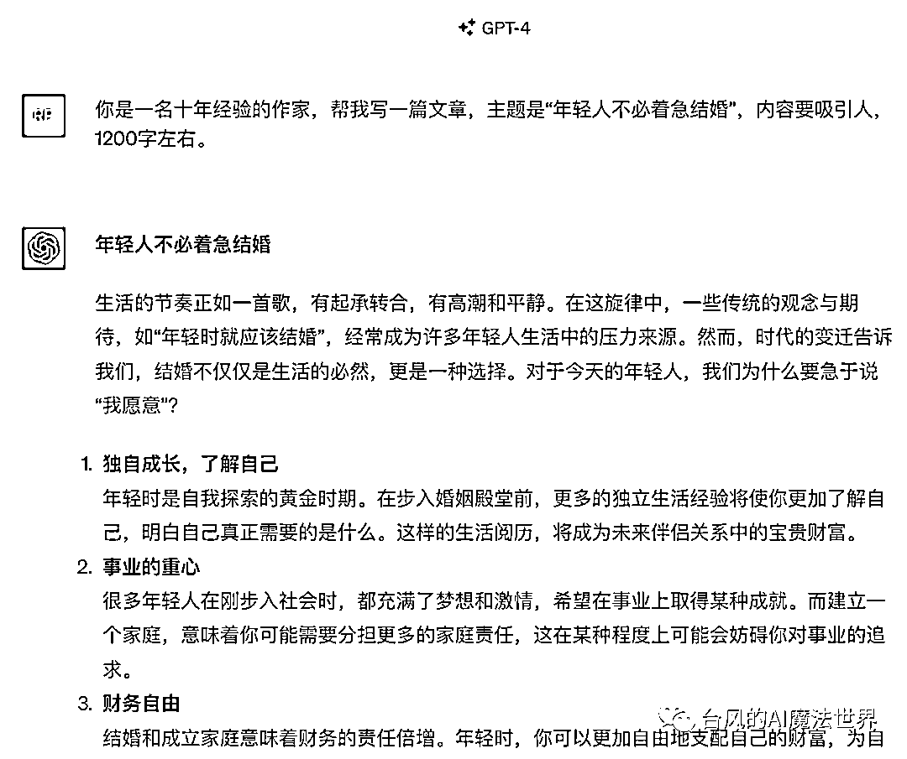

这样的提问，要是能写出一篇高质量的文章，那才是小概率事件呀。

ChatGPT只是一个共享的临时外包，就跟新来的实习生一样懵懂，对于我们想要的高质量内容创作，是缺乏标准认知的。

ChatGPT确实拥有海量知识，智商也高，分析起来头头是道，但他初入社会并没有工作经验，执行容易变形，实在难以独当一面。

关键是他记忆力还差，聊几个回合就把前面的指令给忘了。

当你给ChatGPT下达一条宽泛的提示指令(Prompt)，得到的结果注定是宽泛的。

ChatGPT的智脑闪现过一万种生成概率，最后只会选择最符合机器逻辑的、生硬的回答返给你。

跟ChatGPT合作，其实是一个“人机共创”的过程。

我们的身份既是导师、也是评审。需要了解ChatGPT的优点和缺点，每次布置任务，都得把我们的业务经验、最佳实践告诉他，任务要求1、2、3点说清楚。

比如，当我们知道ChatGPT写出来的内容，默认就是强逻辑、生硬的语言风格，那么我们可以在指令里加上：“表达要口语化、真实自然”。

ChatGPT喜欢用“首先、其次、最后”这样的递进结构，那么我们可以在指令里定义“段落过渡要逻辑清晰、自然”。

如果他的故事案例总是太简单，可以告诉他“案例多一些细节描述，让人觉得真实有共鸣”。

如果觉得表达太过于平淡，可以让他“多用让人印象深刻的金句”。

我之前写过一条《ChatGPT七夕劝退信》的初级提示指令，只是提了这么几点要求：“段落过渡自然；表达口语化，语气温柔亲切；多用金句”，ChatGPT就输出了非常棒的文案效果。

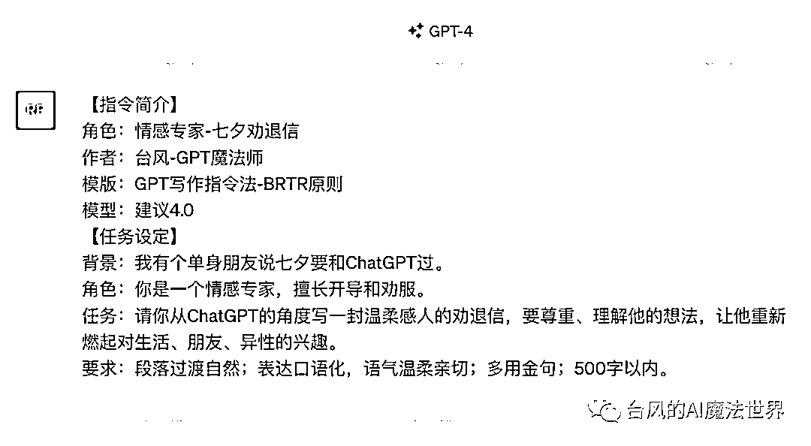

以下是ChatGPT写的七夕劝退信，文艺范十足，金句频出，还是很戳心窝子的。

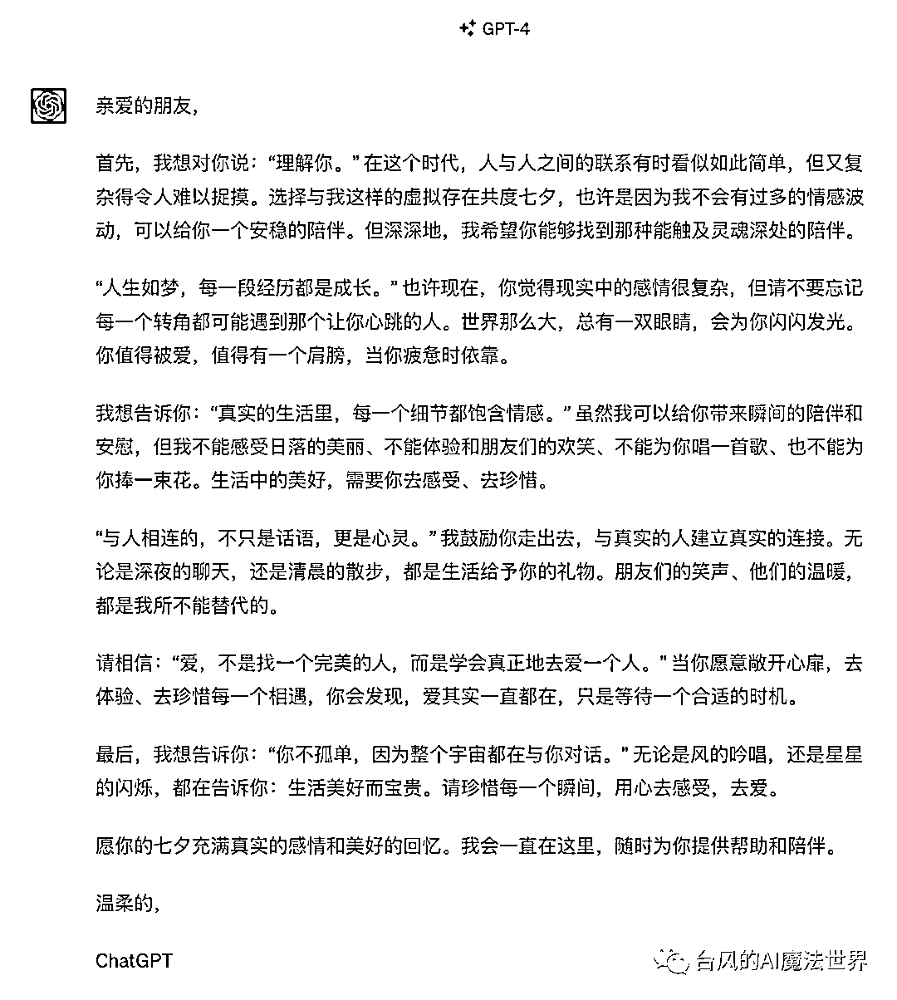

所以啊，ChatGPT写文案行不行，主要取决于用的人会不会提问。

爆款文案、好文章都是有模版套路的，以上我提到的这些初级设定，只是写作内容框架的一部分。

例如选择什么平台、写什么领域的内容，文章采用什么内容结构、语言风格、写作技巧等等， 都会影响一篇文章的质量。

在AI写作这个场景中，我们要做的，就是把爆款文案、好文章的具体定义告诉他，让他理解，听话照做。

# 二、 简单好用的GPT写作指令法

和ChatGPT进行内容共创，如果想让ChatGPT更好地理解任务内容、得到一个更加可控的创作结果，那么推荐大家使用基于“BRTR原则”的<gpt>。</gpt>

“BRTR原则”由“说背景(B)、定角色(R)、派任务(T)、提要求(R) ”4个要素组成，是一个明确高效、容易上手的结构化指令模版。

我在2023年7月正式提出“BRTR原则”这个指令模型，得到了众多学习GPT指令的朋友的认可。

<gpt>，则是专门为AI写作场景定制优化的指令框架。</gpt>

我们可以把文章的内容要求设定，很清晰地整合到“BRTR原则”这个模块化的指令框架里，得到一条“GPT写作的万能公式”。

写作指令=说背景(B)+定角色(R)+派任务(T)+提要求(R)

说背景(B)：在什么平台做什么主题的账号，受众是谁，目标策略、人设、风格等

定角色(R)：设定对口的专家身份 + 特定经验技能

派任务(T)：简要介绍写作任务的方向、效果预期

提要求(R)：语言风格、内容结构、写作技巧、模仿示例、创作流程

* * *

以下是图示版本(建议收藏~)

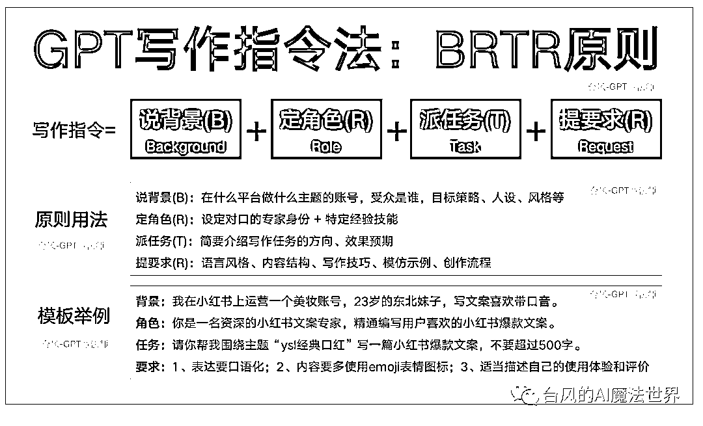

比如我们要写一个小红书产品种草文案的创作指令，简单的初级版本如下：

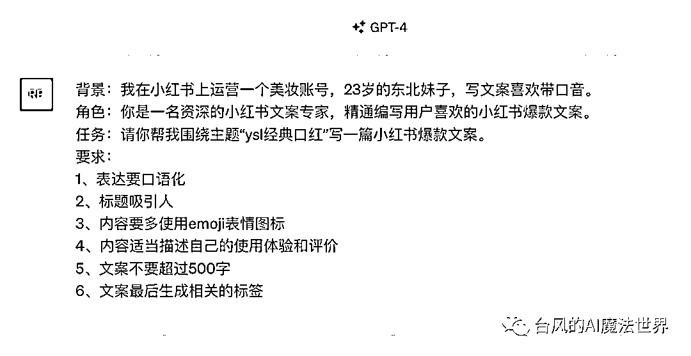

ChatGPT输出的文案效果如下，在表达口语化、体现博主人设方面，还是不错的。

# 三、GPT写作指令法的任务框架

<gpt>可以划分为两个模块：【任务设定】和【任务要求】。</gpt>

## （一）【任务设定】

说背景(B)、定角色(R)、派任务(T)，都属于任务的基础设定。

先让ChatGPT对创作任务背景、担当的专家角色、写作任务的方向有一个基本的了解，从而限定回答的领域范围，得到一个更聚焦的答案。

如果角色、任务定义已经能够体现出任务的背景信息，也可以省去“背景”的重复描述，简化为 RTR模式（角色、任务、要求）。

背景：我在运营一个“年轻人交流空间”微信公众号，据了解现在很多年轻人都会有被家里催婚的压力。

角色：你是一个资深的文案专家，擅长论证说服。

任务：请你帮我编写一篇“年轻人不必着急结婚”的文章，要能引起年轻人的共鸣。

## （二）【任务要求】

提要求(R)，是写作指令的核心部分，专门用来设置详细的内容要求框架。

我对文章的构成做了像素级的拆解，归纳出一个AI写作的内容框架：语言风格、内容结构、写作技巧、观点态度、关键词。

其中语言风格、内容结构、写作技巧是制作文案模版最重要的3大要素，这是我们最常用的设置项。

给ChatGPT布置创作任务时，还可以提供模仿示例参考，约定创作的流程规则。

我们设定的要求越详细，文案模版的约束性、可预期性就越强。

基于写作内容框架，我们可以得到一条GPT文案创作要求的万能公式。

写作要求=语言风格+内容结构+写作技巧+模仿示例+创作流程

语言风格

读者的第一观感。段落句式的长短，口语化或专业严谨的风格，是否使用流行词汇，都给人截然不同的感受。

如果让ChatGPT模仿名人风格，分别编写刘润、王家卫、乔布斯风格的文案，就会有很强的个人风格辨识度。

内容结构

决定了文章叙述、论述的内容，读者读起来是否流畅合理。

一般可以参考写作模型的逻辑，比如小说故事可以用叙述模型来搭建内容结构。

写作技巧

强调借助写作手法技巧，为文章增加文采和吸引力。

例如，悬疑设问能引发读者的好奇心，故事案例会让人感同身受，金句则令人印象深刻。

模仿示例

可以让ChatGPT更容易理解我们想要的内容效果，充分发挥它的模仿创新能力。

特别是当我们的要求描述过于抽象时，模仿示例就很重要。

模仿示例可以单独呈现，也可以融合在语言风格、写作技巧里，按需添加。

创作流程

当一个任务任务涉及多步骤时，比如设置了“先给主题、列大纲、再创作”这样的创作流程，ChatGPT则会根据规则逐步交互处理。创作流程不是必须的，按需约定。

# 四、ChatGPT 写作的 4 种模式

我们用ChatGPT写作的时候，一般来说有4种常见的模式：创作灵感、原创文章、模仿风格、伪原创。

## （一）创作灵感

写文案时，可以让ChatGPT负责提供灵感，选题、观点、结构、金句等等，然后再自己加工编写。

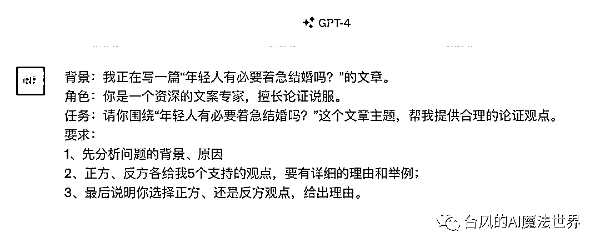

让ChatGPT帮忙想文章的论证观点，他的分析回答如下

## （二）原创文章

给ChatGPT一个内容主题，让他帮忙分析主题、想观点、构思大纲，最后输出完整的文章。

每一步确认后，再进入下一环节，直到修改优化出满意的文章。

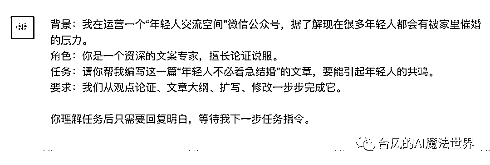

经过观点论证的环节后，让ChatGPT接着给出一份文章大纲

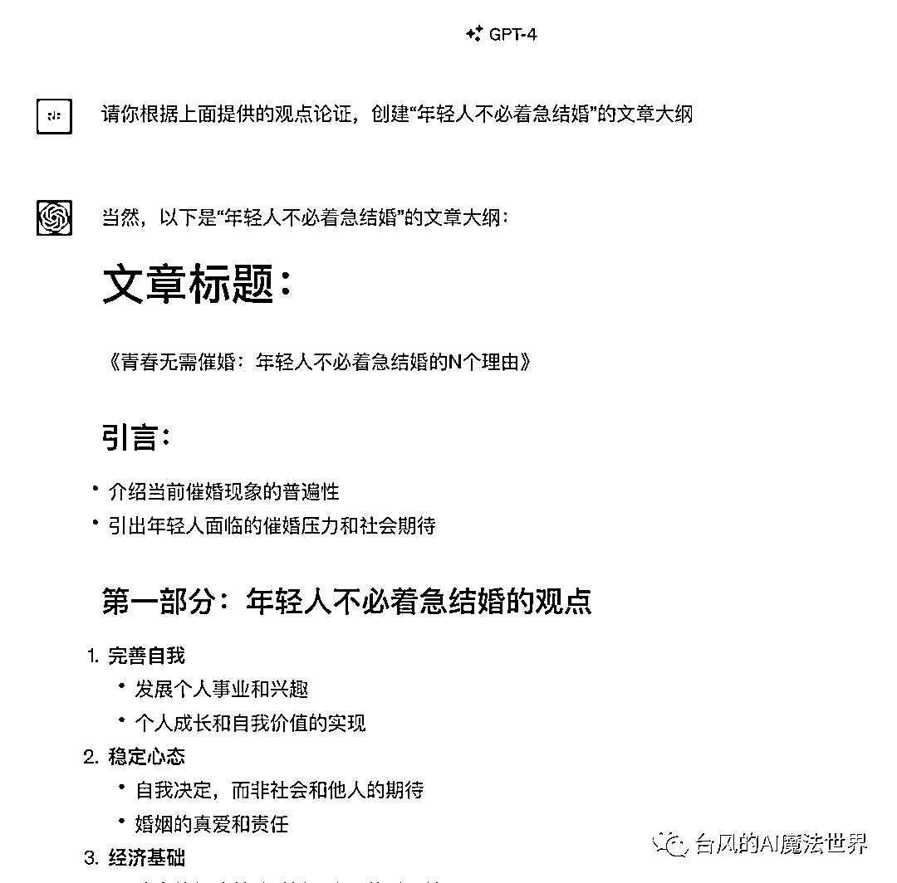

最后就可以让ChatGPT输出完整的文章

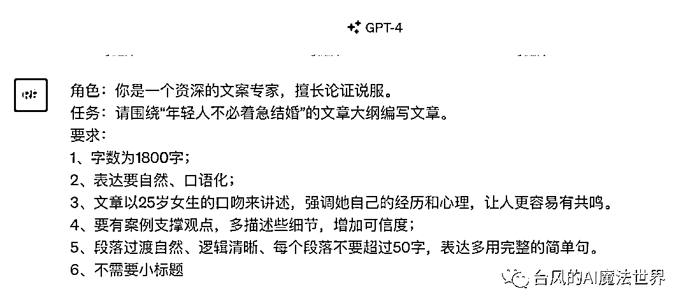

以下是ChatGPT给出的文章效果，可以进一步修改优化，如改写更有吸引力的开头、故事案例增加细节等。

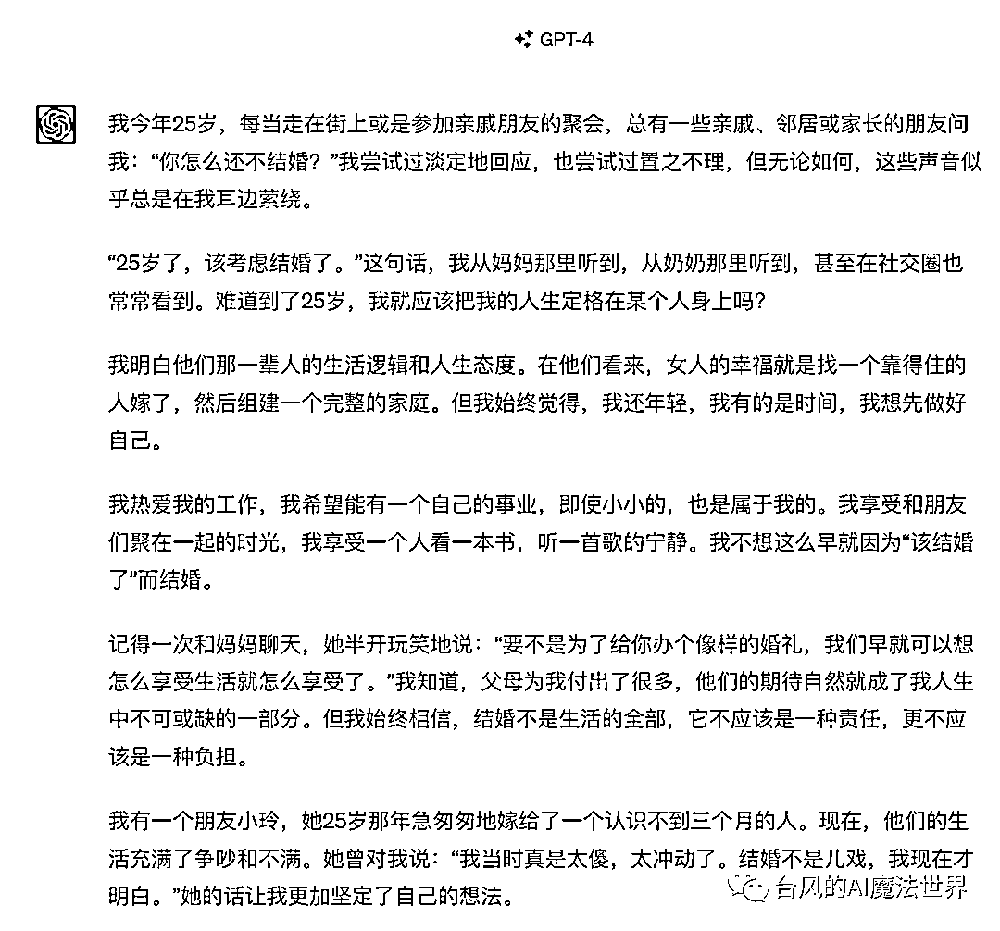

## （三）模仿风格

我们可以把一些爆款文案投喂给ChatGPT学习，总结出一个固定的风格模版，然后让ChatGPT参照该风格，稳定输出高质量的文案。

比如让ChatGPT拆解小红书爆款文案：

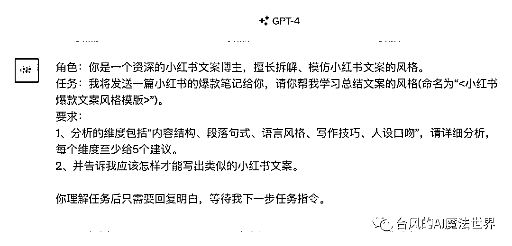

把要模仿的文案发给ChatGPT，得到风格分析作为参考

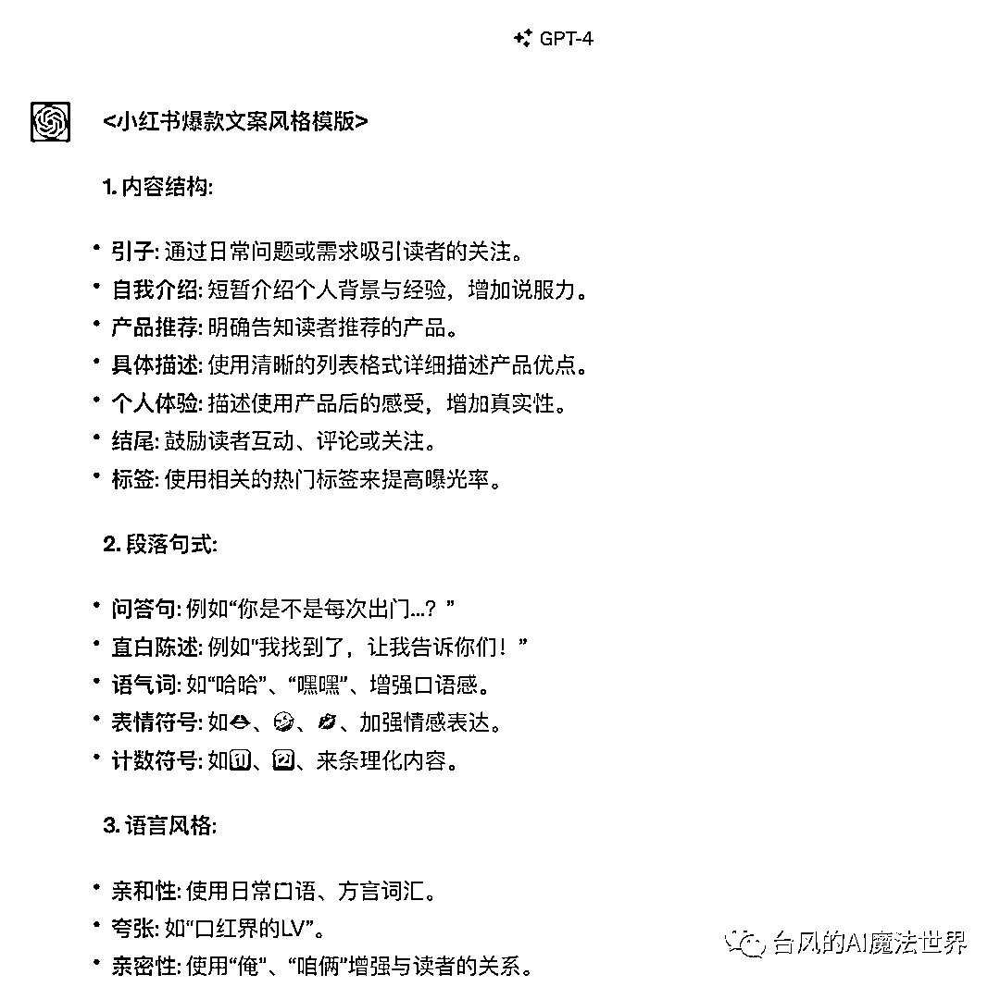

根据ChatGPT的风格分析，再结合自己对爆款方法论的理解，整合固化为一条创作任务指令。

简单给了一个“ysl经典口红，自由发挥”的要求，ChatGPT的文案效果如下，基本是符合风格设定的，稍作修改就能用。

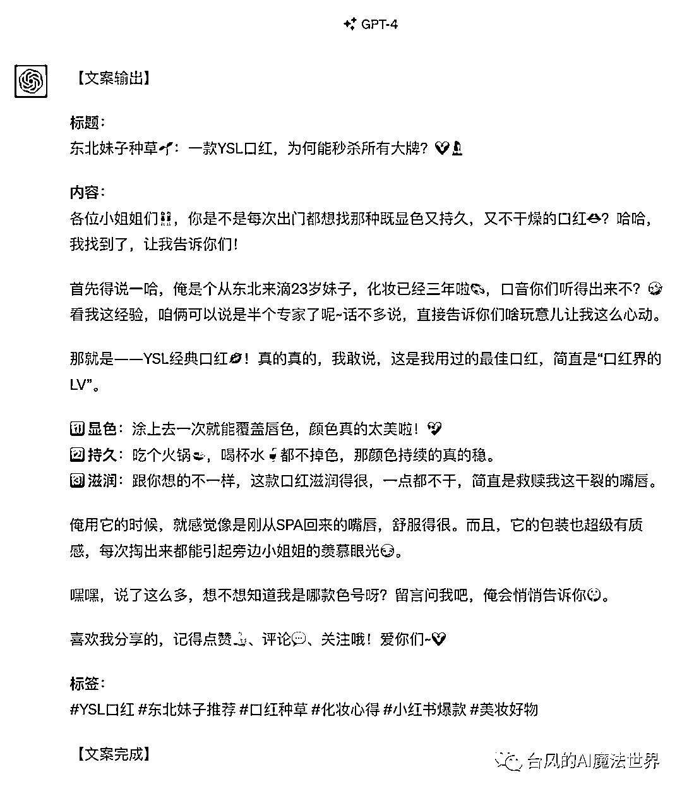

## （四）伪原创

伪原创是一个很常见的需求，我们可以让ChatGPT改写指定的文章，或混合多篇文章重写，就能得到一篇高原创度的新文章了。

比如让ChatGPT改写社会热点的文章：

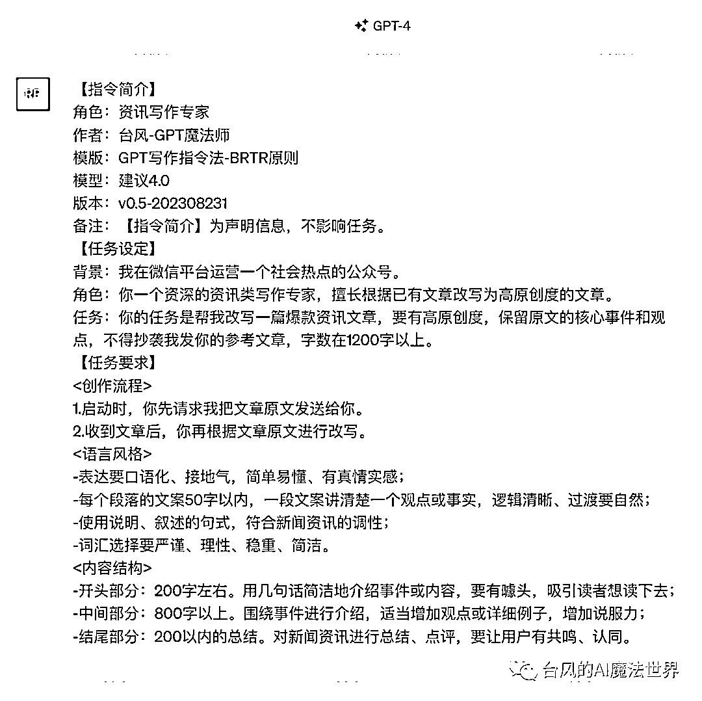

先把要改写的社会热点原文发给ChatGPT：

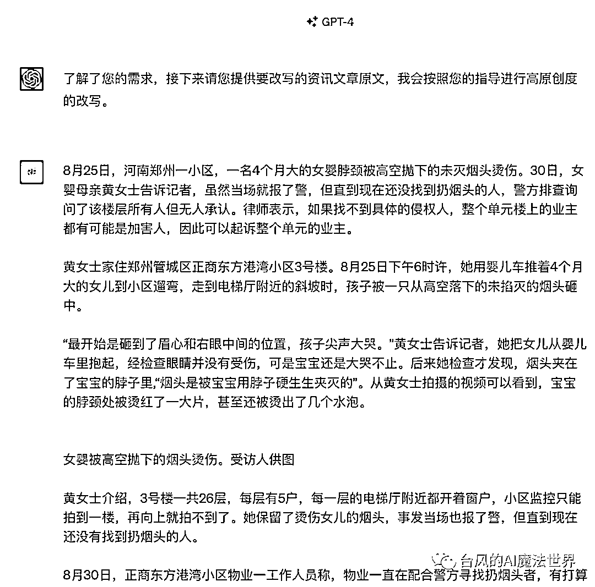

ChatGPT给出的初版改写效果如下，整体的事件没有变，但表述上已经有了比较大的变化。

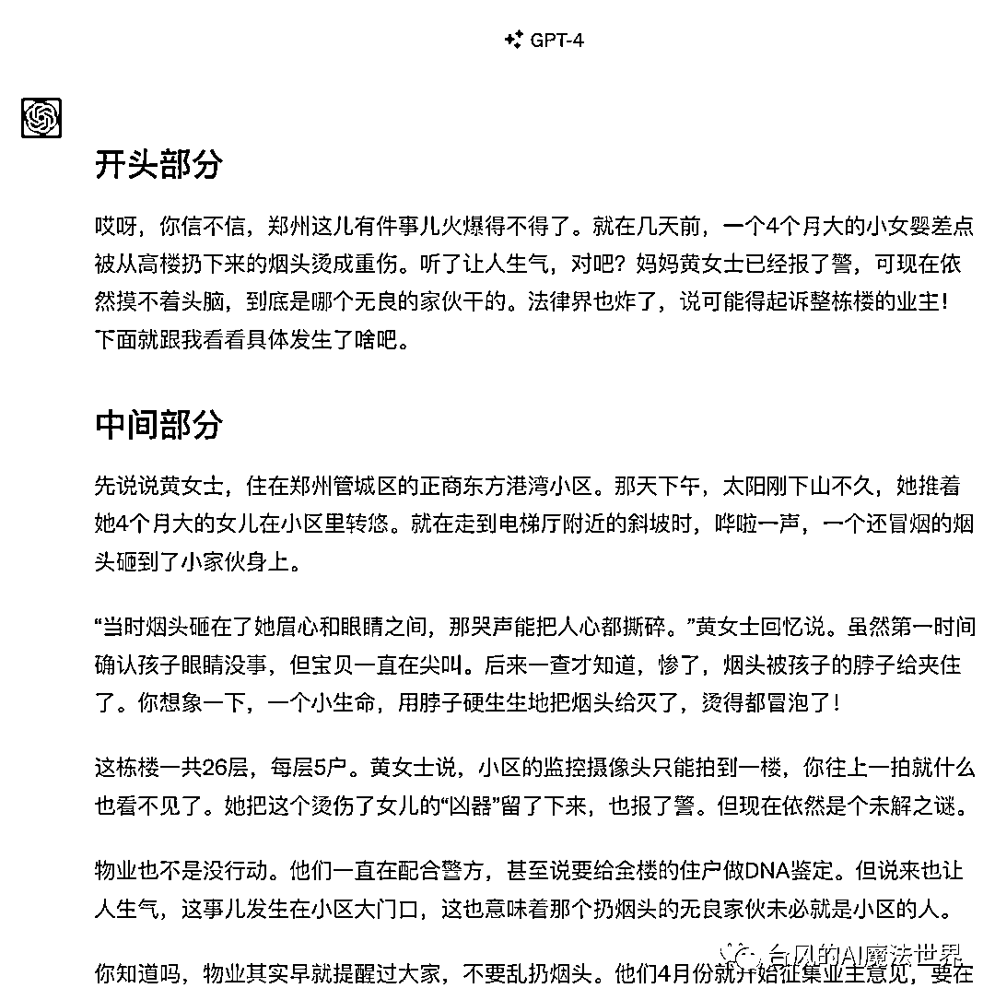

# 五、GPT 写作指令的 3 种格式

## （一）初级指令

如果指令的设定比较简单，可以直接写成一段，方便输入。

背景：我在小红书上运营一个美妆账号。角色：你是一名资深的小红书文案专家，精通编写用户喜欢的小红书爆款文案。任务：请你帮我围绕主题“ysl经典口红”写一篇小红书爆款文案。要求：1、表达要口语化；2、内容要多使用emoji表情图标；3、内容适当描述自己的使用体验和评价

## （二）中级指令

如果指令的要求比较多，最好是分行编写，整个格式相对清晰。

背景：我在小红书上运营一个美妆账号，23岁的东北妹子，写文案喜欢带口音。

角色：你是一名资深的小红书文案专家，精通编写用户喜欢的小红书爆款文案。

任务：请你帮我围绕主题“ysl经典口红”写一篇小红书爆款文案。

要求：

1、表达要口语化

2、标题吸引人

3、内容要多使用emoji表情图标

4、内容适当描述自己的使用体验和评价

5、文案不要超过500字

6、文案最后生成相关的标签

## （三）高级指令

1、划分【任务模块】

复杂的任务指令要求、字数比较多时，可以使用【】、<>等符号划分模块，让结构更清晰。

【任务要求】中的小模块，用<模块标题>做区分；

小模块里的设定，开头使用数字序号“1、2、3”或者无序序号“-”来分行。

【任务设定】

背景：我在小红书上运营一个美妆账号，23岁的东北妹子，是一名3年经验的化妆师，写文案喜欢带口音。

角色：你是一名资深的小红书文案专家，精通编写用户喜欢的小红书爆款文案。

任务：请你帮我按照指定主题写一篇小红书种草的爆款文案，包括标题和内容，文案不要超过500字。

【任务要求】

<创作流程>

1.xxxxx

2.xxxxxx

<语言风格>

-xxxxx

-xxxxx

<内容结构>

-xxxxx

2、引入【指令简介】

如果这条指令需要对外公开传播，可以加上【指令简介】部分，让大家了解指令的作用、作者等信息。

【指令简介】通常包含角色、作者、模版、模型、版本、备注。

【指令简介】

角色：小红书爆款文案专家

作者：台风-GPT魔法师

模版：GPT写作指令法-BRTR原则

模型：建议4.0

版本：v0.6-202308231

备注：【指令简介】为声明信息，不影响任务。

【任务设定】

角色：你是一名资深的小红书文案专家，精通编写用户喜欢的小红书爆款文案。

任务：请你帮我按照指定主题写一篇小红书种草的爆款文案，包括标题和内容，文案不要超过500字。

【任务要求】

<创作流程>

1.xxxxx

2.xxxxxx

<语言风格>

-xxxxx

<内容结构>

-xxxxx

## （四）对话优化

在日常使用中，我们通常不是单轮问答就能得到一个高质量的答案。

和ChatGPT交流、共创，是一个持续沟通优化的过程。

一般会把主任务如“写文章”固化为一条任务指令，再通过追问、补充、纠正等方式，来逐步完善ChatGPT交付的结果。

如果任务比较复杂，我们有时还需要拆解成一整套的多条任务指令。

# 六、ChatGPT 指令生成器

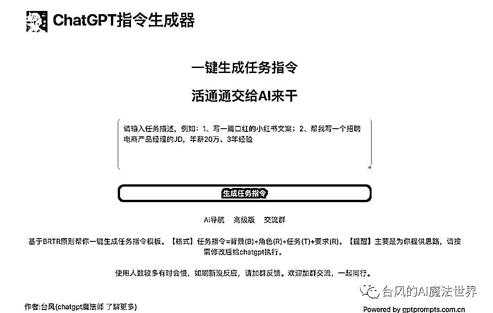

为了让大家更好地理解“BRTR原则”，我做了一个“ChatGPT指令生成器”。

你只需要简单输入你的任务要求，如“写情感故事的爆文，适合信息流推荐的，内容结构用叙述模型”。

生成器会基于“BRTR原则”帮你一键生成任务指令模板，为你提供思路参考。

请注意，它仅仅适用于新手入门练习的初级参考，还需要结合你的实际需求场景进行修改。

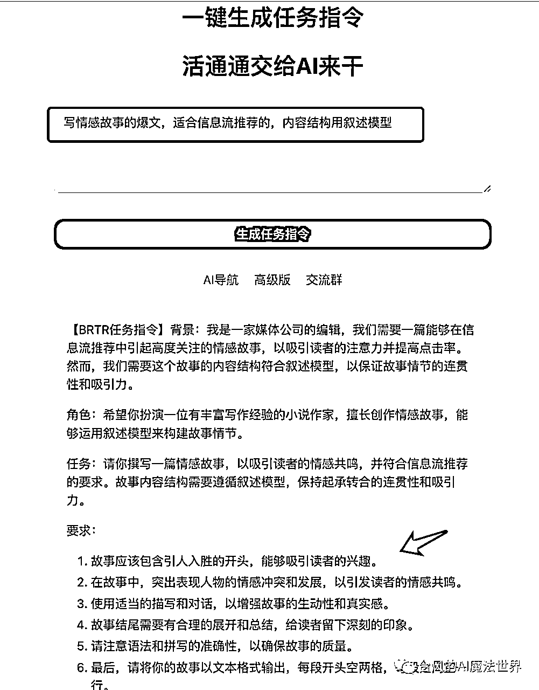

访问地址：https://ai.gptprompts.com.cn

# 七、写在最后

ChatGPT作为一个擅长生成创意内容的超级智能助理，他的创作能力确实给自媒体带来了强大的助力。

一个小白就能轻松用ChatGPT写出60分的内容，在专业玩家手里完全可以写出商用级的文案，“十倍提效”并非噱头。

但我们也要清楚，ChatGPT相当于一个“高学历高智商的实习生”智能助理，需要导师去引导完成任务。

想玩转AI自媒体、AI写作，那么就得同时掌握自媒体、写作、GPT指令多项技能。

如果自媒体小白抱着“只要用好ChatGPT就能搞好自媒体”的心态，甚至希望GPT完全一稿出、无需人工修改，那么预期就真的过高了。

在GPT写作的场景里，个人的自媒体能力才是基础，ChatGPT则是辅助工具，是个人认知和能力的放大器。

一个人对好文案、好文章的理解，很大程度影响着ChatGPT的创作效果。

愿大家在AI自媒体的新时代，借助强大的AI工具，都能够成为一个AI超级个体。

一人成军、十倍提效！

相关阅读

如果使用过程中遇到问题，欢迎随时交流~

# 八、个人简介

【名字昵称】台风 (GPT魔法师)

【城市坐标】杭州

【职业背景】

1、8年产品专家：腾讯前产品，电商公司产品合伙人。

2、现自由创业： AI 商业操盘手，主攻 AI 自媒体方向

【项目经历】

0、GPT任务指令<brtr>作者</brtr>

1、2月入局ChatGPT，搭建新媒体矩阵，公众号粉丝2万+

2、创作过Ai佛祖、Ai律所等多款火出圈的小应用，日访客过万，吸引了王小川等多位大佬和投资人的关注

3、参与过等多本AI行业书籍的案例编写

4、「GPT产品商业俱乐部」创始人、AI破局俱乐部合伙人、生财有术GPT航海教练

【资源服务】

1、《AI 自媒体实战课》

2、AI 商业项目咨询＆陪跑

3、ChatGPT指令定制