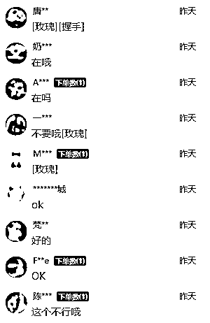
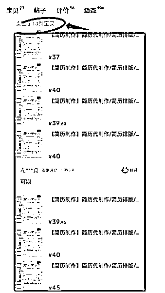

# AI+简历修改，首月盈利7000+

> 来源：[https://cxqeimz77vr.feishu.cn/docx/UArddC9JsoXN7JxmLoWcgtm3n8C](https://cxqeimz77vr.feishu.cn/docx/UArddC9JsoXN7JxmLoWcgtm3n8C)

各位圈友大家好，我是饭饭，生财的龙珠圈友，

95后电商从业者，目前在电商赛道摸索，一年更比一年强，希望能在生财真诚分享写一些有价值的文章结识更多财友，实现破圈。

这是我往期的生财精华文章，附上链接感兴趣的圈友可以阅读了解一下我~

1.《写作店铺月入5万的拆解》https://t.zsxq.com/0evxBa8Gu

2.《我的手机壳店铺》https://t.zsxq.com/0em6sqd4x

3.《互联网小白，加入生财2个月赚回了30倍门票复盘》https://t.zsxq.com/12gmuT5L7

我做了多年的实体店赚过也亏过，转型电商赛道以后实现初步盈利。目前看来实操的这个项目也是普通人易复制，不受时间地点限制的自由项目。

见贴欢喜，文章来啦~

# 【项目收益】：测试第一个月利润7000+

我们是八月底开始接触的这个项目，因为我们主要是开了一些写作店铺，目前多多闲鱼和淘宝店铺累计50多个，然后也有一些关于简历咨询和需要辅导的相关的客户、AI工具和店铺资源等等，也就顺带测试了一下这个项目。

实操下来发现这个项目真的是难度非常低，巧用AI和文文末我给大家准备的简历修改万能工具包，一顿操作下来简历修改就非常的简单，成本也是极低，只需要招兼职大学生或者招聘一些毕业生，懂得使用chatGPT就可以完成整个工作，整体来说项目的难度较低，可复制性较强，

我们实操了初期整个项目就变现7000+，仅仅是通过闲鱼和拼多多来引流接单，在微信上完成交易，

如果不是写作店铺的主营业务太忙，我觉得还能创造更高的收益，翻倍也不是不可能。

用AI来修改基简历，然后修改的好评率还挺高的，我们用AI来修改简历好评率大约能达到70%以上，简直不要太简单，用来做一份副业，也是挺有意思的。如果是个人做的话前期就需要准备电脑、AI工具和注册店铺接单就可以了，如果是团队做的话就两名工作人员就是实现增收，一个负责运营、店铺干预，做好接单工作，另外一个就负责使用AI工具，进行简历修改和交付辅导，然后收钱就完事。

# 【同行的出单情况】

一些做的不错的同行光是一个闲鱼账号就做到了日均销售10单以上，做到纯利润400+，我们实操了每天用AI来优化10篇简历是属于比较轻松的。

# 一.项目的介绍

这个项目就是简历代做，顾名思义就是帮客户做简历，优化简历，做服务然后赚劳动报酬，赚钱这东西自古都是解决痛点就可以，痛点就是钱。谁解决钱就是谁的，目前这些求职市场竞争的加剧和招聘过程的自动化，特别是现在AI的非常快的速度普及发展，越来越多的人在找工作的时候是需要简历优化服务的。

这也就有了 简历优化师 这个称呼，不管是企业和个人都知道一个出色的简历是可以为求职者带来更多机会和可能性的。这种情况下简历优化师的需求就是在不断增加的，特别是在大城市和拥有繁荣经济的地区会比较大，我们团队在短暂的实操过程中就发现广东、上海和江苏的这几个地区的用户占比会比较高一点，下单的报价也能高一点。

## 1.客户群体介绍

这个客户群体也是非常的庞大的，占比最高的群体就是求职者、然后职业转换者、毕业生、职业重返者、自由职业者、高管层、留学生、非英语为母语的求职者等等等等等等很多。

## 2\. 服务介绍

那简历优化师可以提供的服务有哪些？

例如：简历评估、简历优化、格式调整、面试辅导、求职社群、职业咨询、求职战略、求职课程培训等等等等，全部都是可以衍伸的服务，抓住精准流量，变现方式就很多。

# 二.市场分析

## 1.客单价20-400

大家都能感觉到现在的互联网信息传播太快了，尤其是在数字时代，求职者越来越依赖在线渠道来寻找工作，基本上都是线上投简历，简历符合要求再约面试。对于求职者来说竞争也是非常大的，个人简历的质量和吸引力对于求职者来说至关重要，当然是值得花点费用去优化的。在这个时候，提供简历代写和优化服务，也就有了不错的市场，这个产品是非标品，单价在20-400元的居多，价格是需要谈的，不同的人、不同的背景可以报出不一样的价格，学历越高、需求越急的人越容易接受这个，也能报出好的价格，简历+介绍信或者面试辅导，都是一连带的服务。

## 2.市场竞争分析

1.小红书竞争：

这个品在小红书的上的流量也是不错的，小红书上一搜，相关的笔记数量并不是非常大，爆品也很多，特别是在毕业季或者求职季的时候需求可能会更大，很多人是用简历模板来做分享引流。点赞留言都很精准的，也是很大的一块蛋糕。这个板块的流量就是比较高净值的用户了，有学历基础、有工作需要、

2.拼多多竞争：

在拼多多上搜索不同的关键词弹出来的页面竞争并不是很大，单链接销售过万的店铺并不是非常多，这个需要一些人工干预的手段，然后在做一下推广，就能够占据标题的流量，可见竞争并不是非常大，能入局赚点小钱的机会是蛮大的，做电商的好处有一点我很喜欢，就是静默成交的能力，店铺活起来以后就等着客户上门成单就可以。

3.闲鱼：

闲鱼算是零门槛的，只要懂得使用GPT都是可以入局，销量都是99+，做的不错的这几个账号平均每天卖出10单以上，结果验证了市场需求。

毕业季，也是应届生找工作的高峰期，简历代做、代优化的需求明显增加，利润也还不错。

人群定位：晋升、跳槽、留学、应届、英文等等人群、

提供服务：应届生简历、职场简历、小升初简历、面试辅导等等

一般交稿时间：48小时以内~

# 三、项目拆解

我们团队将AI技术与简历辅导相结合，用AI来省去大量的人工成本，为求职者提供高质量的个性化简历服务，从选品的角度来说的话这是非常冷门的一个蓝海品，在拼多多和咸鱼上面很容易就起店，只需要简单的一些运营动作就可以很顺利的起店，

可以说现在的社会竞争加剧，简历在求职过程中变得至关重要。许多求职者仍然面临制作出吸引力和独特性的简历的困难。AI技术的出现为简历辅导领域带来了非常多的机会。通过AI+简历辅导，我们完全可以用来当作一个赚钱的小赛道，给客户提供更加个性化、精确和高效的服务，帮助求职者脱颖而出，增加他们获得工作机会的可能性。

项目的营收思路。

通过平台开店，精准的获取客户的联系方式，提供简历修改服务，客户下单以后借助chatGPT来完成修改服务。

我们实操取得0-1之后和大家分享这个项目的拆解和实施方法。

且听且看，欢迎点赞交流~

# 四、接单平台选择实操分享

开店的方法我们是实践了效果非常好的，这里整理了完整的开店方法分享给大家，可以保存收藏查看。

## 1.拼多多【简历修改店铺】

1.拼多多开店准备

新手建议做个人店：准备一台手机、一张电话卡、个人身份证、1000元保证金【平台保证金，不做以后会退】

2.拼多多开店注册

很多圈友没做过电商平台，我在这里做了详细的注册步骤：

3.拼多多商品标题

标题非常重要，流量的大小直接和标题有关，错误的标题也会直接导致封店或者4w的保证金，这里我提供几个我们操作没问题和正在使用的标题给到各位圈友。

1.求职简历代制作个人定制应届生高端求职设计润色英文简历优化修改

2.个人简历代制作应届大学生简历定制个人简历制作大学生简历代做

3.简历设计个人定制应届生求职修改优化一对一定制电子版简历帮做

4.拼多多详情页制作

关于简历辅导和代做都是在拼多多上能够稳定运营的类目， 参照同行的做详细一点就可以，尽可能去模仿同行的主图和详情页，同行检验的才是安全的，只要不要盲目的自己去创新没把握的详情页，就是完全没问题的。

这里推荐两个作图软件：【搞定设计】【创客贴】

上面有很多模板直接套用就可以：这里放一组我们常用的模板给大家参考

5.拼多多商品发布如何避开4W保证金

很多人还不知道如何去规避拼多多四万的虚拟店铺保证金，只需要选对类目就可以，关于简历代做的类目也是直接发错类目就可以实操，规避4w的保证金,请看点击蓝色部分查看教程

6.如何进行线下引导

目前拼多多对第三方引流的限制也是比较大的，轻则警告，重则第三方引流五万的保证金，

缴纳五万的保证金是不太可能的，除非你是特别大的店铺，然后不缴纳五万的保证金的话就面临主体违规，关联店铺被限制入驻拼多多。

这里我们一直在用的三个方法，一是通过键盘图片，二是通过邮箱联系，三是通过卡券的电话号码联系，最后都是加在微信上对接。

方法1.发送图片引流

提前准备好几张不错的引流图片，隐晦一点，图片大小不一样，在图片上留下微信号，微信号越简单越好，越简单的微信越不容易被识别到，发送的时候需要几张大小不一样的图片来回发送，不然容易被识别到违规，我们用的是键盘实拍图。

方法2.让客户先拍下

给客户报完价格以后，让客户拍下商品链接，拍下可以看见客户真实电话，然后通过卡卷查看客户的真实联系方式，打电话添加微信。

方法3.邮箱联系

实践下来让客户通过邮箱联系也是安全的引流方法，通过让客户留下邮箱，邮箱给客户发送微信，在微信或者QQ对接就可以。

## 2.闲鱼【简历修改店铺】

1.下载闲鱼app ,淘宝授权登录闲鱼app即可，新手下载以后不要更改任何信息就可以（新手避免胡乱编辑造成违规，确定不错的名字以后再写昵称）直接浏览闲鱼的主页面、功能按钮板块、好好熟悉一下闲鱼的后台。

2.标题发布：闲鱼是一个很自由的平台，标题没有固定的，只要不违规就可以，这里我提供常用的可参考：

参考标题【1】

修改简历，秋招实习保研身经百战的学姐 认认真真帮你修改简历！！

没有套路，一杯奶茶让你收获满满！

[1]把自己的简历 截图发送给我

[2]我给你逐字逐句的简历修改建议

[闪亮]一份好的简历真的太重要了，简历对于实习秋招保研都是最最最重要的敲门砖。

[闪亮]我给自己的每份简历反复修改过几十次，我的简历经过了几百次面试的提问

[闪亮]简历修改真的只要一杯奶茶钱，完全没有套路，希望我能用自己的经验帮你也顺利通关～

⚠️文书润色价格根据文书内容决定

⚠️如果需要我完全代写简历，收费为200元一份

#代看简历

参考标题【2】

接毕业生，职场萌新简历修改咨询及中英文简历修改

美港留学加多年外企工作经验

常年招聘intern筛选简历

空闲时间接简历修改优化

擅长商科类简历

携需求报价

参考标题【3】

改简历❤大厂背景HR➕猎头经验

●服务流程：

1，点击“我想要”进入沟通——描述个人情况。根据您的工作年限和岗位内容复杂度等方面评估简历价格以及修改空间。

2，发送优化方案和报价，感觉合适后下单；

3，为了方便沟通，拍下后随时保持联系；

4，会先根据原始简历修改，有需要添加的素材可以一起提供，没有原件的话可以填写信息采集表；

5，普通稿件2天内交稿，加急另议。

主页有更多优质的职业服务，可供查看和选择。

3.商品图：闲鱼的用户都是希望找到个人团队，并不是想找到中介，所以主图做的简单一点这里推荐两个作图软件：【搞定设计】【创客贴】，闲鱼的商品图越简单效果越好。

图一 图二

4.发货：闲鱼上做完简历是不需要发货，做完直接选择无需发货，然后在微信上让客户签收再给他发送文件。

5.闲鱼引流方法

1.图片引流

这是我们专门设计的一张引流图片，把整体背景虚化，通过图案设计成我们微信的样子，留了微信号，发给客户点开就能看见，也是目前在用的，但是这个方法并不是百分之百的安全，你需要多准备几张图片，当你一直重复多发同一张图片的时候，而且图片大小、图片内容这些完全一样的时候，闲鱼的系统就会监控到，从而导致人工介入，那违规扣分就是难免的。

2.符号引流

在输入法里面有两个符号表情 \ / 发出去客户秒懂

3.客户下单打电话

客户拍下一单以后直接打电话沟通，因为闲鱼拍下以后是可以直接看见客户的真实联系电话的。

# 五、接单后的实操

## 1.确定需求

【确定身份】话术：1.您是职场人士，应届毕业生，还是国外留学生呢？

【确定工作经验】您工作几年啦，有几段工作经历呢？

【确定岗位意向】您是做通用岗位还是做海投呢？

## 2.报价

报价这个就取决于和客户的聊天经验了，目前好多单子我这边也不是很精准把握报价，聊天感觉付费能力强、质量要求高的就报价高一点，付费能力低、质量要求不高的就报价低一点

29、39、49、59、66、99、128、168.......400的我们都在报价，因为没有太大的技巧。

## 3.交付

简历制作或者优化完成以后就让客户签收截图，然后发送简历版本，我们发送一般是Word版本+PDF版本各一份，正常的交付时间就是48小时之内交付给客户。

# 六、AI修改简历实操

## 1.通用模板

1.  简历内容分析

第一步是使用GPT分析求职者的简历。这可以包括提取关键词、技能、工作经历和教育背景等信息。我们可以使用GPT来评估简历的质量，语法和拼写错误的检测，以及简历内容的流畅性和逻辑性，可以增添内容、优化内容和修改内容等等。目前我们使用的方法是直接截图提取客户的简历截图信息：

截图提取信息以后复制发送到GPT就可以了，这是目前我们在用的最单一也是效率比较高的一种方法。

1.  个性化建议

根据简历内容的分析，巧用AI可以为每位求职者生成个性化的建议和改进方案。包括推荐添加关键词、提供职业建议和建议重新组织简历内容，完善简历。而且AI还可以根据求职者的行业和职位偏好提供特定建议，这样内容就会非常完善了。

1.  设计与排版

一个吸引人的简历不仅仅关乎内容，更重要的是设计和排版。可以利用AI生成专业的简历模板，让简历在视觉上也非常吸引人。但是这个针对于我们常见的客户对于简历的要求并不是非常高端，我们就是基本上用简历模板就可以完成大部分的任务，这个在我准备的万能工具包里面就有。

1.  面试准备

AI可以提供定制的面试准备建议。这包括提供针对特定职位的面试问题，模拟面试，以及提供有效的答案和沟通技巧。而且AI还可以分析用户的语言和语调，而且提供改进建议。

1.  职业规划

除了简历辅导，我们还可以使用AI来帮助求职者规划他们的职业生涯。通过分析他们的教育、工作经验和职业目标，AI可以提供个性化的职业建议，包括推荐培训课程、职位机会和行业趋势等等，都是不错的变现机会，

## 2.实操过程

简历修改的过程：

## 【优化简历实操模板】

指令调教：

## 【三无简历写作模板】

输入指令，chatGPT提供模板

简历技能精进：

生财参考的链接：大佬原创@常常《如何创造性使用ChatGPT高效完成简历制作》https://t.zsxq.com/125iQA2Nq

# 七、简历修改万能工具包

## 1.简历修改的万能指令

## 2.万能的简历模板库：

https://www.jianliben.com/

## 3.chatGPT（需魔法）

chat.openai.com

## 4.平替AI

https://ibiling.cn/template

## 5.证件照免费制作

https://www.remove.bg/zh

# 写在最后：

每次在生财分享帖子都能很幸福的被一群生财的财友链接到，加入生财后命运的齿轮已经在转动，感谢生财提供的交流平台、感谢漂亮的生财首席医官梁靠谱大大的悉心指导，感谢生财圈友们的链接赋能。

加入生财以后的确发生了很多变化，人生多风雨，学会为自己打伞，每一次的技能精进都是美好，

AI+简历的修改适用于职场办公，这是个技能包，用来自己优化简历或者用来开店赚钱都是一种不小的收获，

我是饭饭，加入生财6个月啦，惊喜如约而至，拿到了龙珠、拿到了精华帖、收到了生财的典藏版衣服、参加了生财航海、被很多有礼貌的圈友链接到，饭饭的电商围观群也有了270位监督我打卡输出方法的小伙伴....

遇见即美好，贴下留言，圈友共发财~