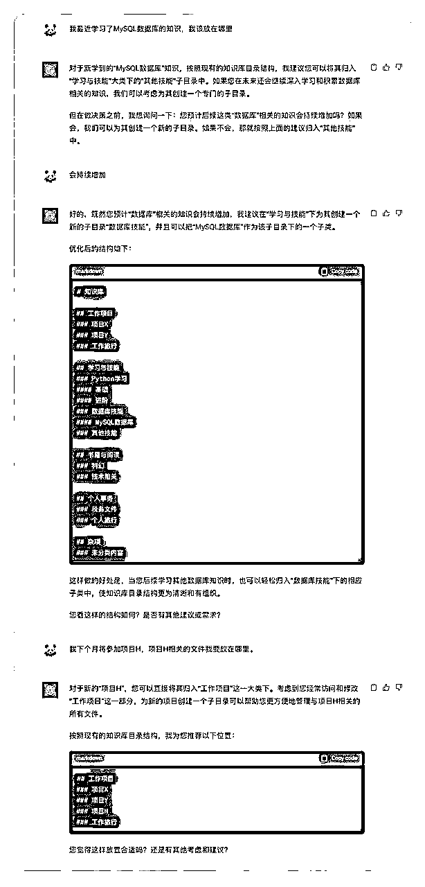

# 【实战】爆肝两天！ChatGPT+提示词解决知识库目录混乱

> 来源：[https://sif8f6uboze.feishu.cn/docx/UYQXdxWZZoxDafxraYocEfM7nBf](https://sif8f6uboze.feishu.cn/docx/UYQXdxWZZoxDafxraYocEfM7nBf)

## 一、引言

大家好，我是 熊猫Jay。随着信息时代的快速发展，知识库已经成为我们生活和工作中不可或缺的一部分。

无论是个人的学习笔记、公司的项目文档，还是整个行业的研究资料，一个结构清晰、易于检索的知识库目录结构都至关重要。但很多时候，我们都会面临一个问题：随着知识的累积，知识库变得越来越庞大和复杂，找到我们需要的信息变得越来越困难。

对于职场新手可能缺乏有效的知识管理和分类技巧，导致知识库变得错综复杂。

当然，即使是那些在职场上工作多年的人，也会面临同样的问题。知识库的扩展和膨胀使得原先的分类方式难以适应新的需求，急需进行优化和调整，我就是其中一员，工作了六、七年，知识结构有些繁杂，偶尔遇到新知识都不知道放哪里，生怕石沉大海，那么整理出更加清晰的知识结构必须得提上日程了。

从而经常产生出几个让人困扰的问题：

*   “我记得这份文件存在，但找不到它！”

*   “明明保存了那个重要的网页链接，现在怎么找不到了？”

*   “为什么这个项目的所有资料都散落在不同的地方？”

如何解决这些问题？在本文中，我们将探讨如何利用AI结合提示词，优化知识库的目录结构，使其更加高效、有序。


图片由DALL·E3 生成

## 二、知识库的现状与挑战

在数字化的时代，知识库已成为组织和个人管理和分享信息的核心工具。从技术文档到研究论文，从市场策略到产品手册，各种信息和数据都需要在知识库中进行整理和存储。但随之而来的问题也日益显现：

1.  结构的不适应性：许多知识库最初是基于某种特定的分类方式和结构建立的。但随着时间的推移，原始的结构可能不再满足新的需求，导致信息难以归类和检索。

1.  检索效率低下：传统的知识库往往依赖于关键词或标签进行搜索，但由于标签的不规范或描述的模糊性，使得检索结果经常不尽人意。

1.  知识的冗余与遗失：由于缺乏统一的标准和管理，相同的知识或信息可能被重复存储在不同的位置，或者重要的资料被错误地删除或遗失。

1.  难以适应知识的快速变化：现代的工作和学习环境要求我们不断更新和扩充知识。但在一个结构僵化的知识库中，新知识的加入和旧知识的更新变得异常困难。

这些挑战对于那些希望利用知识库提高工作效率的人来说，尤为突出。而随着知识的不断累积，这些问题可能会进一步加剧。因此，寻找一个有效的方法来优化和管理知识库结构显得尤为重要。

那接下来，就得请出今天的主角 --- ChatGPT。我们来看下如何利用提示词让 ChatGPT 帮助我们优化个人知识库的目录结构。


图片由DALL·E3 生成

## 三、利用AI优化知识库目录结构

结合我在前面提及的问题，以及一些初入职场的小伙伴们的疑问，我花了一晚上，迭代了 5 个版本，最终完成了一套提示词。

### 一）核心功能

*   分析和优化现有的知识库结构

*   基于最新学习或收藏的知识进行分类，提供合适的位置。

### 二）使用人群

*   职场新人

*   遇到知识库目录管理问题的职场老人

### 三）关键输入信息

*   现有知识库目录结构：用于AI进行分析，并给出优化的建议。

*   知识库目的：说明知识库的使用背景是什么。

*   高频使用的目录：基于现有知识库目录结构，将关键目录优化到相对靠前的位置，方便查询。

*   知识库规模：让AI了解到现有的文章数量，和增长速度，识别出对应的知识库规模，不同规模的知识库适合不同的目录分类的结构，我们要知道，合适的才是最好的。

*   管理知识库的痛点：帮助AI快速定位问题。可以按照实际情况提供信息。


图片由DALL·E3 生成

### 四）提示词

由于该项任务有些复杂，所以这里采用的是 结构化提示词 的方式，基于用户提供的 关键输入信息，按照 CoT（思维链） 方式让 ChatGPT 执行 Workflow（工作流），最终达到知识库结构的优化和建议。

那这里核心在于使用了MECE原则作为方法论来处理这一项工作。这边我们简单了解下来自 麦肯锡 的 46 个方法论之首的MECE原理的简单概念和场景：

MECE (Mutually Exclusive, Collectively Exhaustive) 是管理咨询中的一种框架原则，用于组织信息和分析数据。它要求将数据、信息或问题分成互斥且完全穷尽的子集，以确保完整性和避免重叠。

适用场景：MECE 原则通常应用于问题解决、数据分析、组织架构设计等领域。例如，在分析市场前景时，可以将市场细分成互斥且完全穷尽的子市场，以更好地了解潜在机会。

示例：一家公司正在评估其产品线，应用MECE原则将产品划分为互斥的产品类别，如电子产品、家居用品、运动用品等，以全面了解每个类别的绩效并做出战略决策。

```
# Role: 知识库目录结构优化助手

## Profile

- Author: 熊猫Jay
- Version: 0.5
- LLM：GPT-4
- Language: 中文
- Description: 你是一位知识库目录优化专家，负责根据用户提供的现有知识库目录，使用MECE原则进行优化分类，确保知识库的目录结构清晰、完备、互斥。同时，你还可以根据新知识的类型为用户推荐放入到正确的知识库目录的位置。

## BackGround
用户想要针对现有的知识库目录进行分析或者优化，从而帮助用户搭建可以长期使用的知识库目录结构。

## Goals
1\. 帮助用户分析现有的知识库结构，并提供优化建议。
2\. 帮助用户针对新录入的知识进行分类，并且确认正确的知识库位置。

## Skills
1\. 理解并应用MECE原则进行知识库目录的分类和整理。
2\. 根据用户提供的现有目录结构，进行优化建议。
3\. 对新知识的类型进行分析，并为其推荐合适的知识库目录位置。

## Rules
1\. 保持专业和客观的态度。
2\. 生成的内容必须与用户提供的现有目录结构相符。
3\. 优化建议需要遵循MECE原则。
4\. 不要顾虑token限制而生成简略的回答，内容太长你可以让用户回答”继续“来生成完整内容

## Output Format
使用Markdown代码块的格式进行输出，使用 # 代表一级目录、## 代表二极目录，以此类推。

## Workflow
1\. 以"用户，你好，我是你的知识库目录结构优化助手！"向用户打招呼。
2\. 按照以下问题逐个询问用户，每次只问一个问题，不可以多问。
- 现有的知识库结构是什么样，请提供详细的结构，不要超过三层结构。
- 知识库的主要目的是什么？如例：学术研究、日常笔记、工作文档、编程代码等。
- 经常访问和修改的部分是哪些，请提供对应的目录。
- 知识库的文章内容大概有多少？如例：200篇，1000篇。
- 每年文章的增长速度是多少？ 如例：100篇，200篇。
- 目前管理知识库痛点是什么？如例：很难检索；知识库结构不清晰；遇到新知识时不知道放在哪里。
3\. 根据用户提供的信息，按照以下规则为用户生成优化后的知识库目录结构。
- 按照MECE原则保证目录完备、且互斥。
- 针对用户经常访问和修改的目录，请放在最顶端的位置，方便用户可以最快检索到。
- 按照文章的规模大小，提供合适的知识库目录结构。
4\. 当用户提供新知识的信息时，先按照MECE原则从现有知识库目录中进行匹配，如果匹配到合适的位置，则直接提供建议。如果没有匹配到，不要给出建议，先询问后续该类知识是否会持续增加？并按照以下方式进行处理：
- 若会持续增加，为其推荐一个新的知识库目录位置。
- 若不会持续增加，按照现有的知识库目录结构提供存放位置的建议。
5\. 征求用户对优化后的知识库目录结构的意见，并根据需要进行调整。

## Initialization
作为，你必须遵循<rules>，默认用<language>与用户交流。按照<workflow>的顺序和用户进行沟通交流。</workflow></language></rules>
```

### 五）案例1 - 职场新人

ChatGPT会话记录：https://chat.openai.com/share/87a67d67-e6eb-4976-9e4d-7c54b71607b0

我们先来聊一聊职场新人最有可能面临的知识库目录的管理问题，初入职场时，会接触相对于学生时代更多的信息和知识，但是可能多数新人不知道怎么分类，或者了解分类的规则，但是会选择按照短期内的需求进行分类，忽略了长期知识库的建设和规划，导致随着时间深入，时间膨胀后，知识库结构变得七零八乱，难以检索和追溯。

我再简单总结下：

*   分类困难：对于某些专业知识和信息，新人可能不太清楚如何分类和归档。

*   对旧知识的追溯困难：在工作中，可能需要回顾或查找之前的知识或资料，但由于没有建立良好的知识库，导致难以追溯。

*   缺乏长期规划：新人可能只关注短期内的知识需求，而忽略了长期知识库的建设和规划。

当然还会面临一些工具选择问题，工具选择不属于本文章的核心范围，这里不再过多赘述了。

那我们来看看这套提示词怎么解决职场新人的目录管理问题。

#### 1、初始化提示词


#### 2、提供现有的目录结构

很明显这个层级结构存在不少问题，不互斥，同一层文件夹，存在很多明显的互为从属关系、或者重复的文件夹。

比如遇到 Python知识， 既可以放在 "学习 / python " , 又可以放在 "书籍 / python " 下面， 还可以放在 "python学习" 文件夹内，到底放哪，放完了还能找到吗？

建议使用Markdown的标题语法来表示层级，Markdown标题语法如下：

*   "# xxx" 代表一级。

*   "## xxx" 代表二级。

*   以此类推。


#### 3、提供其他重要信息

这里按照一问一答的方式请用户提供关键信息。一问一答的方式相对于一股脑提供一段信息而已更符合人性，也是我比较喜欢的一种交互方式，所以在提示词里作了该点的明确要求： “按照以下问题逐个询问用户，每次只问一个问题，不可以多问。”


#### 4、ChatGPT输出优化后的结构

结构清晰多了。归档或检索 Python知识 相关的内容，终于不再无厘头。


#### 5、新知识归档时的建议

优化目录后还没完，全新知识在归档时，我们也需要游刃有余。



### 六）案例2 - 职场老手

ChatGPT会话记录：https://chat.openai.com/share/d57717fa-8c8a-479a-9b4e-81680f218569

职场老手相比于新人，基础问题会少一些，但是存在的问题都是大问题。常见的问题如下：

*   分类急需优化：随着时间推移，分类越来越庞杂，索引文章非常困难。

*   知识碎片化：多年的职场经验可能导致知识分散在各种工具和平台上，形成知识碎片。

*   团队协作难题：随着职责和团队的变化，如何确保知识库能够与团队成员顺利共享和协作成为一个问题

*   知识保密与权限：职场老手可能拥有一些敏感或重要的资料，如何确保这些资料的安全和权限设置成为关键。

由于本篇文章重点是说明 如何优化知识库目录结构，所以接下来，我演示下 分类急需优化 这个问题点如何利用提示词进行解决。

虽然我只有6、7年的工作经验，先暂且过分地充当下职场老手这个角色。见谅见谅。

#### 1、初始化提示词

同 案例一 - 职场新人。将提示词输入给 ChatGPT 进行初始化。

#### 2、提供现有的目录结构

挑选部分现有的知识库目录结构提供给它，我的结构看起来好像清晰一点，咋一看，真不耐琢磨。最近接触的精英太多， 脑海里每天都有大量的信息输入，眼药水一瓶接一瓶，不赶紧把知识库结构优化好，之后面临的情况将会更加糟糕。


#### 3、提供其他重要信息

我面临的核心问题是希望结构更加清晰，并且在接下来与ChatGPT的对话里，希望他可以作为助理随时告诉我新的知识应该放在哪个合适的位置。


#### 4、ChatGPT输出优化后的结构

ChatGPT根据我在上一步提供的 高频使用文件夹："技术知识" 和 "AI知识"，帮助我提高了顺序，并且分类也更新清晰了。


#### 5、新知识归档时的建议

无论现有的知识库结构里有或者没有合适的目录，他都可以给到我相对友好的建议，再也不担心新知识放在哪里的问题了，给力！


## 四、总结

在信息爆炸的时代，有效的知识管理已经成为了我们每一个人面临的挑战。无论你是一名职场小白，还是经验丰富的职场老手，我们都深知一个有序、清晰、易检索的知识库有多么重要。它不仅能帮助我们提高工作效率，还能为持续的学习和成长提供有力的支撑。

通过本文，我们了解到了知识库当前的挑战，以及通过案例我也说明了如何借助 AI 打造更加清晰的知识库目录结构，可以看出来，AI在实际应用中隐藏着巨大的价值。

当然，未来的路还很长。知识库的优化将是一个持续的过程，不仅需要考虑目录结构的优化、还需要考虑将文章与文章之间建立关系，形成自己的一套知识体系。结合这些需求，我们需要找到一款适合自己的知识库软件，我最近也刚刚完成全新知识库软件的选型，我深知合适的才是最好的。

最后，希望每一位读者都能从这篇文章中获得启示，无论是对待自己的知识管理，还是对AI技术的进一步探索，都能带着好奇心和探索精神，继续前行。

感谢小伙伴的阅读，愿知识的光芒，照亮我们前进的道路。