# 从0-1做情感脱单课程，3天靠课程围观社群转化7000+保姆级攻略，手把手带你入局情感赛道

> 来源：[https://q2cz7tlxd4.feishu.cn/docx/Uys0d8iMLoEFUvxsRbPcPkMEn9e](https://q2cz7tlxd4.feishu.cn/docx/Uys0d8iMLoEFUvxsRbPcPkMEn9e)

大家好，我是一名96后、线上线下都社牛又擅长谈恋爱的圈友好天气，专注于女性亲密关系研究，个人成长和疗愈，通过改变你对男女关系的认知，让你获得幸福的能力。

很多小伙伴做了产品之后卖不出去，或者正在做课期间无收入，所以没有办法变现，朋友圈发了100遍也没有什么效果，在这里给大家提供一个围观群的打法，可以通过一个月的周期来帮助自己实现产品的快速发布以及通过社群来扩大自己的影响力更好的进行变现。

在靠谱姐、理白、芷蓝姐的点拨和助力下，还有生财航海里条形马老师的《社群发起人》手册的启发下，第一次发起了一场课程制作免费围观群，在制作课程期间，运营这个课程制作免费围观群，我的【实战篇：恋爱聊天脱单课】，累计营收7K+，其他2k不属于课程收入。

以下是此次课程制作免费围观群的收入截图

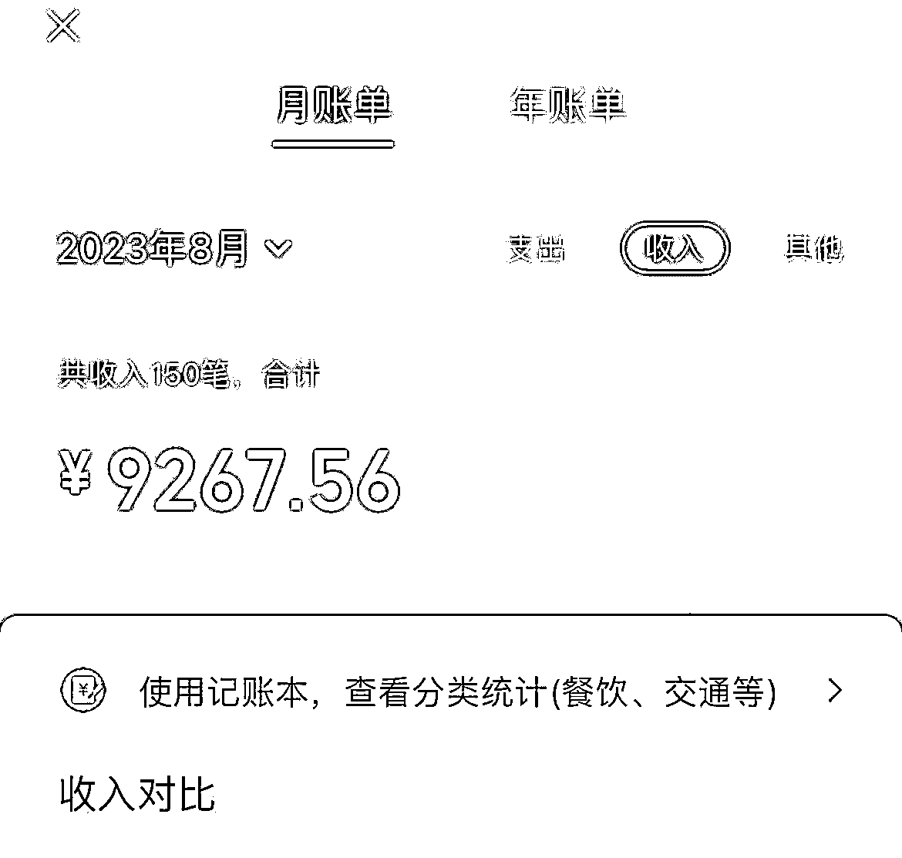

全文主要分为6个部分，可以在pc端的侧边栏点击以快速定位。

1.做情感赛道的原因和初衷

2.课程制作围观群运营的目的

3.课程围观群的裂变、转化和成交的方法

4.课程制作围观群期间的朋友圈打造

5.这次围观群有哪些不足之处

6.最后的心里话

# 1.做情感赛道的原因和初衷

### 1.1 为什么要做情感赛道？

目前专门深耕情感赛道这个定位的人，其实人非常多，我在搜小红书、抖音对标时，在做情感的非常多非常多，

而这也就意味着，这个赛道其实是相对拥挤的。

那么，为什么我还是想要做情感赛道这个定位呢？

我从两方面方面来和你们解释下。

1.市场是有需求的

每个人对情感其实都是有极大的需求的，只是很多人并不知道究竟要怎么做才能猎取属于自己的情感幸福。

比如，首当其冲的便是「缺乏对异性的了解」。

如《男人来自火星，女人来自金星》说过：男人和女人在生活的各个方面都不一样。他们不仅在交流方式上不同，而且在思考、感受、感知、应答、反应、示爱、需要以及欣赏等方方面面也全部一样；

其实我们每个人都渴望获得感情上的幸福或者快乐，但是我们大部分人从小到大并没什么机会接触异性，上学时只和自己的同性玩，也只和同性交流，然后整体的家庭氛围就是以学习为主，无论是在家里还是在学校，早恋都是一种被禁止的行为。

甚至是很多人因为自己的羞涩不敢和异性接触交流，很渴望但是又不敢。

因为，从我们念小学开始，并没有一位老师、课程教过我们该如何谈恋爱该如何去了解异性，如何去寻找并猎取幸福。

大部分人都是在上学的时间只上学，也没谈过几次恋爱，对异性的认知几乎为零。

然后到了年纪听家里人安排相亲，就匆忙结婚生子，然后紧接着而来的就是必然的离婚。

所以，很多人在疑惑，反正结婚了也是离婚，反正大家都没有在认真，你骂她渣女，她骂你渣男。

比如，很多人会出现以下这些问题（这些问题的依据，出自我之前给在群里做了很多的调研）

*   怎么才能提升自己在感情理的“配得感”变成“你值得”

*   如何复盘过往的恋爱经验为己所用

*   母胎单身没有恋爱经验怎么找适合自己的人？

*   筛选大于培养，怎么才能大概率选出合适的人？

*   钢铁直女|直男是如何沦为聊天黑洞而不自知？

*   相亲线上线下如何进行破冰增加好感？

所以，很多人都面临着这样的想要获得幸福的感情但是由于自己没有经验，看不清感情世界的真相问题，同样的，也有很多人并没有意识到自己在情感里的问题，更多的，只是任由问题发生和存在，也不知道对方某个行为或者某句话代表什么意思，稀里糊涂的就过着自己的感情生活，甚至不知道为什么?

2.它是我热爱的领域

情感这个方向，属于我热爱的领域，也是我极为敏感又实战经验丰富的，从很小的时候，在主动告白与被告白，约会--谈恋爱--分手--约会反复经历过，可能我比你们男生都还要了解你们男生，手里的异性样本多到十个手指都数不过来。

身边朋友有恋情疑惑几乎都会第一个向我咨询，哪怕是极度的负面情绪，这些都对我没有丝毫影响，我的高能量足以吸纳一切负面情绪。

之前，虽然会一边自己也谈着恋爱一边总结分析过去每段恋爱的每个细枝末节，复盘分析究竟是哪里出了问题才导致以前的恋情颗粒无收，但完全没有想过自己去做一个情感IP。

直到今年中旬，我才正式想要做个人情感IP。

我的性格就是那种喜欢做自己喜欢的事，并不会因为没有鲜花和掌声而轻易放弃，还有就是我有我的初心在，

我觉得每个人都值得拥有一段幸福的感情，谁不想拥有幸福美满的感情呢？

而这些都是我们可以运作操作起来的，

以前朋友问我：经常和各种男生聊天约会不浪费时间吗？

答案很简单，我在很认真的挑选我人生未来的另一半，时间过了也是过了，但是我想在我年轻貌美的时候找到一个我最不会后悔的对象，所以找对象的路上我真的非常认真且努力，并且非常的有策略。

既然我都可以，那么其他人渴望得到感情幸福的人也是可以操作起来，我希望在我的帮助下，人人都可以拥有幸福的感情。

### 1.2 为什么我的目标人群是需要脱单人群？

事件1：我看到了大部分人情感的痛点

比如说，大龄男女，虽然很多大龄男女嘴巴说着自己不需要结婚不需要感情生活，自己过自己的不香吗？但是实际上很大一部分人是白天坚强，晚上掉珍珠。

比如说，被渣男渣女伤害的人，这类人看不清情感的真相，甚至是自以为自己已经看清了情感的真相，不在相信感情，但是其实只要好好复盘自己，复盘自己手中的牌面，自己完全可以运营起一段幸福的感情。

比如说，脱单目标不清晰的人群，也有很大一部分人为什么找不到对象，就是因为太脱离实际了，不根据自己的自身情况来进行合理择偶从而错过最佳择偶时机

事件2：我通过问卷调研，看到了单身人士身上的痛点

根据对目标人群的问访、咨询，我一共梳理了26个和但是人士相关的问题。

并且，我将其融入到问卷中，通过各个渠道（比如社群、单个咨询、免费围观群等方式）让大家填写，累计收到了96份有效问卷。

以下是我在群里做的调查问卷，后期的课程制作根据反馈进行调整

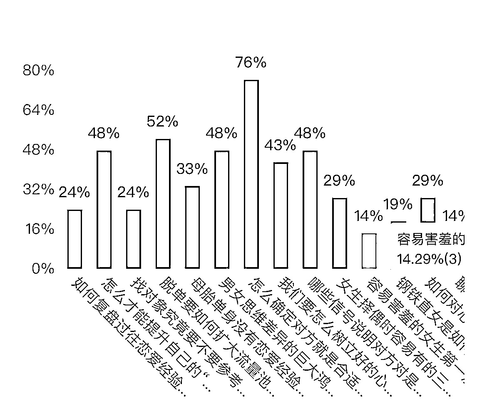

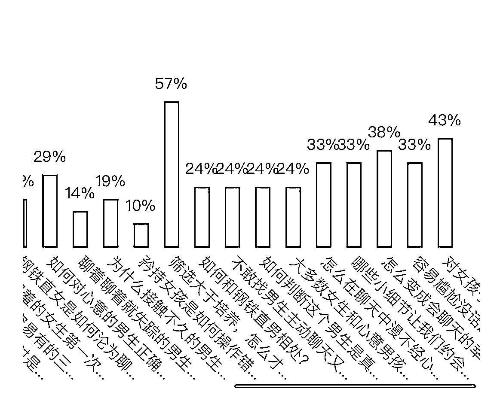

在所有的问题当中。占比最多的问题是：怎么确定对方就是合适的人？

这个问题占到了76%

其次，占比数量占到前5的问题，分别是：

*   筛选大于培养，怎么才能大概率选出合适的人？（57%）

*   脱单要如何扩大流量池?（52%）

*   哪些信号说明对方是在玩短则游戏？（48%）

*   怎么才能提升自己在感情里的“配得感”变成“你值得”（48%）

*   男女聊天思维的巨大差距之性、情人节、慢热的理解（48%）

而其中，1、2、3、4问题，全部是关于「筛选」的问题，其中的5、6，其实是在于「聊天」的问题。

而「会聊天」的能力，对想要脱单的人来说，是一项极为重要的能力，虽然说第五条和第六条并没有涉及到很多的聊天字眼，但是很多时候你要解决并明白一些男女内部脑回路的操作系统，你才能知道怎么去聊天，只有会聊天，你才能去做筛选，良好的聊天是一切良好关系的开始。

当我调查问卷的时候，给了我意想不到的结果。

群友的代表性评论：

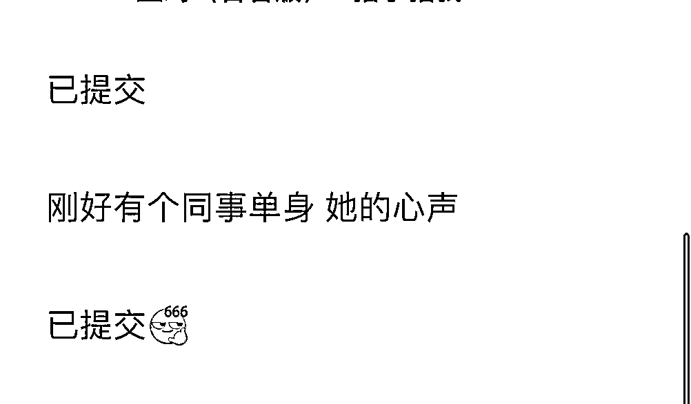

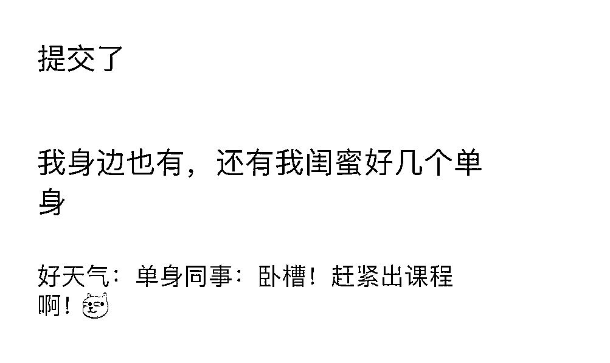

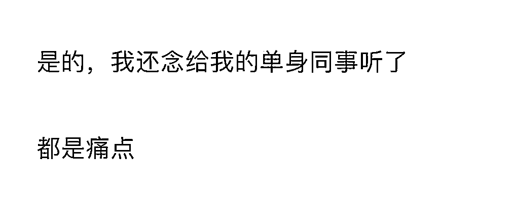

这样不仅是群里的单身人士，甚至她们还把我的调查问卷还让周围现实的单身人士来填写，很多群友说，终于再也不是调查户口式的聊天了。

### 1.3 我的产品做了哪些迭代和升级？

原产品基本介绍

我原本课程的雏形是关于两性脱单以及正在接触阶段的课程，甚至是关于课程的标题都不知道取什么？就是一个很笼统的脱单群体，在我做了调查问卷之后，并且这份调查问卷的课程大纲还比较分散和没有重点，当时设置的课程大纲如下：

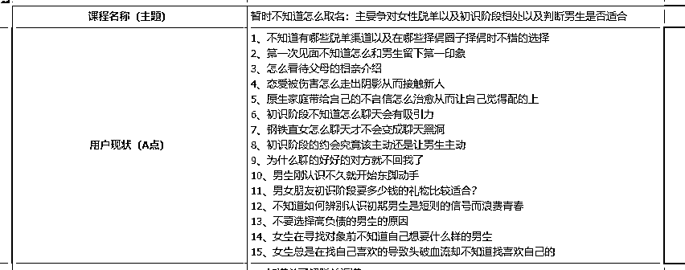

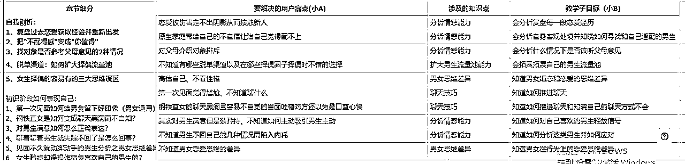

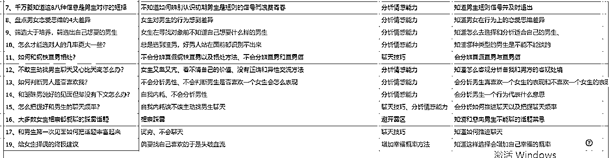

一会儿是聊天技巧，一会儿是分析情感能力，其实分析情感能力就是如何判断对方适合我们的能力。

就拿调研结果的问题分布来看，其实筛选人的能力痛点问题是占在前面的，对于聊天技巧类的需求其实相对比较低，其实对于大部分人的问题来说，想要筛选出适合自己的另一半，首先聊天就是基础，很多人在聊天方面都欠缺，更别提怎么去筛选人了。

所以我的课程就拆分成了两个细分课程，一个是【实战篇：恋爱聊天脱单课】，另一个是【识人篇：如何筛选合适的对象】。

最后，我决定先完成【实战篇：恋爱聊天脱单课】的课程制作，下面是我后面重新又做的一个课程大纲海报：

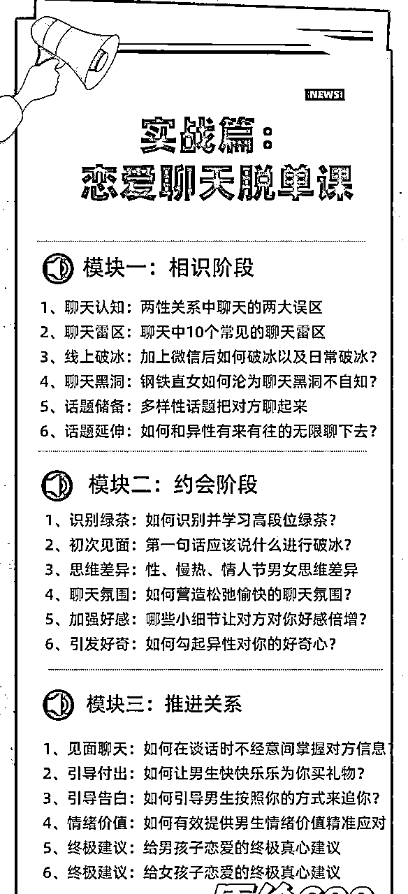

1.  考虑到大家从互相认识的相识阶段如何去破冰聊天以及雷区设置6节课讲透讲明白

1.  考虑到大家从从相识阶段过渡到约会阶段应该怎么去聊天，这时参杂着线上和线下应该怎么去聊

1.  到最后的从约会阶段又到我们的推进关系阶段又该如何去聊天，最后达到脱单成功。

整体的迭代幅度，可以说是超过了80%，因为这样是拆分成了一个具体的两个不一样系列的课程。

一个是实战聊天篇，一个是识人篇，这样的整个课程都是围绕咱们在和一个人从相识-约会-推进关系逐步来展开。

可实操性也非常强，课程设置的颗粒度非常非常细，基本上是拿来就可以用来实操的。

还担心很多小伙伴在实操的过程中肯定会有很多疑问，还专门送了价值365元的恋爱聊天陪伴群。

最后，这时我的课程都还没做出来，在靠谱姐的建议和鼓励下，做一个项目见证群，也可以说说课程制作免费围观群。

以上，便是所有的背景介绍。接下来，和大家分享下，此次课程制作免费围观群的全部流程和经验沉淀。

项目见证群-免费课程围观群时间线一览

*   朋友圈宣告拉群、裂变（明确自己的主线）——8.10~8.14

*   朋友圈宣告终点立flag以及群内宣告21天做完一个系列课程

*   群内自我介绍以及说明做课期间每天分享情感干货——8.10~8.23

*   在做课期间群内可以免费回答情感问题——8.10~8.23

*   群内乘着七夕节到来提前预发售3天——8.20~8.23

*   恋爱聊天脱单课程制作免费围观群解散——8.23

# 2.课程制作围观群运营的目的

### 2.1 群的定位--吸引更多的潜在用户

非常感谢条形码老师的社群发起人手册，给了我非常多的启发，后续在运营这个课程制作围观社群当中有很多关键的要点都是在这个手册当中得到启发的。里面有说到，你的定位越清晰，你的社群里面的人才会越不至于失去焦点。

因为清晰的定位可以告诉他们，在社群里面做什么样的事才能帮助到他们，做什么样的事情才能去对他们产生有益的影响。甚至告诉他们，社群里欢迎他做什么样的事。并且，整个社群的价值观，是跟整个社群的定位高度耦合的。

这个课程制作免费围观群的定位是吸引更多的潜在需要脱单人群进入我的群里，在这个群里可以畅所欲言的聊自己的感情状况，聊自己感情的困惑，它的目的是带来更多的裂变，让不认识你的人认识你，让不认识的人喜欢上你。

在课程制作期间，每天晚上在不停的释放如何恋爱，如何聊天的干货来吸引人，不停的留下一颗种子种在别人的心里，在群里帮助群友相亲时应该怎么去聊，哪些话在初始阶段不要去聊，只谈关于怎么聊天才不应该不会聊天而错过良缘。

又因为是每天晚上持续的免费分享打破大部分人的情感认知和观点，让更多的人愿意主动的拉身边的亲朋好友进入的课程免费围观群。

我看到很多我不认识的小伙伴，甚至没有添加我的小伙伴一直也在拉自己认识的人进群，我很有信心，我关于情感干货的分享肯定是切切实实的帮助了很多小伙伴。

甚至是在我的课程还没开始预售的情况下就有3个小伙伴问我课程多少钱马上微信转账了~ 这个时候我才拉群的第二天，仅仅是在群内干货分享的第二天，这让我感到非常的意外。

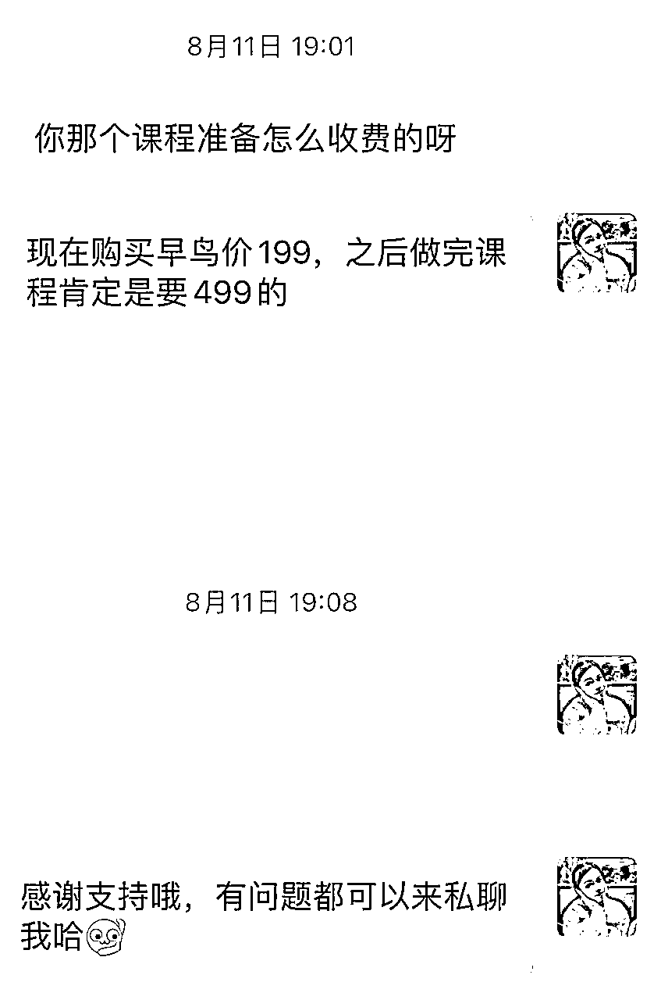

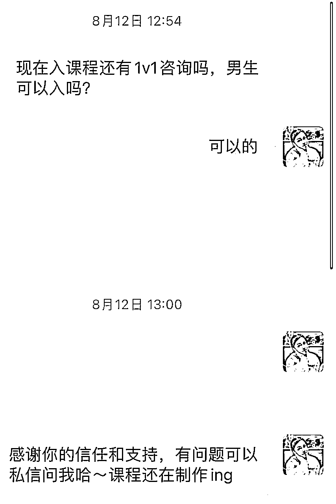

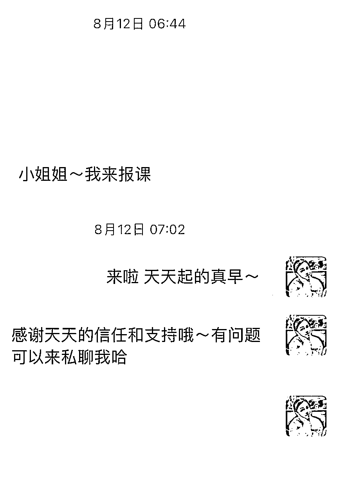

### 2.2 让更多人认识我

告诉大家：我是谁？我有什么产品？我能帮你解决什么问题？我有哪些用户证言？

在每天晚上都会集中分享打破大部分人的情感恋爱干货外，由于在制作课程期间是可以免费在群内咨询情感问题，所以会有很多的有情感问题的人进入群内来提问，

而有情感疑问的兄弟姐妹们在我群里提问时，我以我的专业度来回答她们的问题的时候，反而是帮助我在300多人的群里建立了专业度，加深其他在群内潜水的人群对我的认识以及认可。

而群内得到我的专业度解答情感疑问以后对我的夸赞就是群内人可以亲眼可见的用户证言（截图一部分）

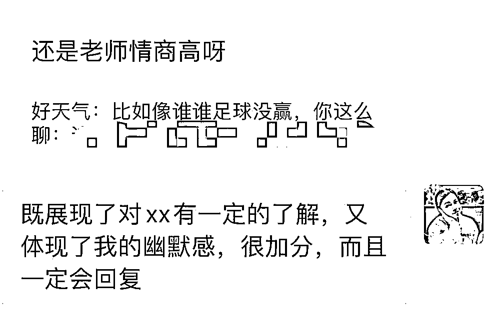

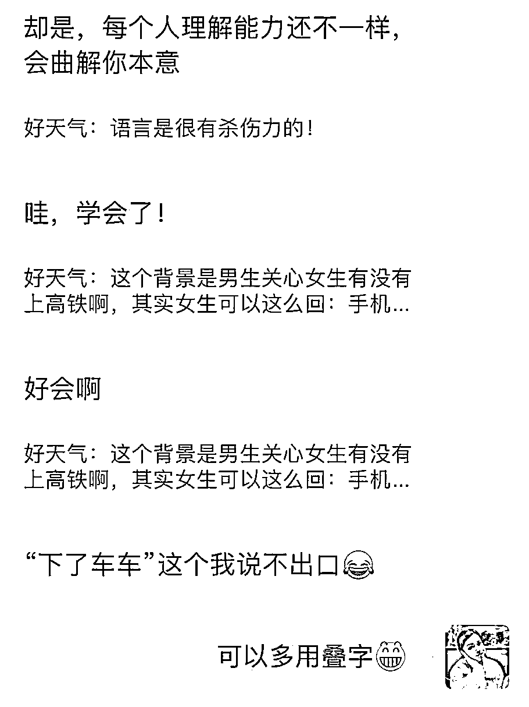

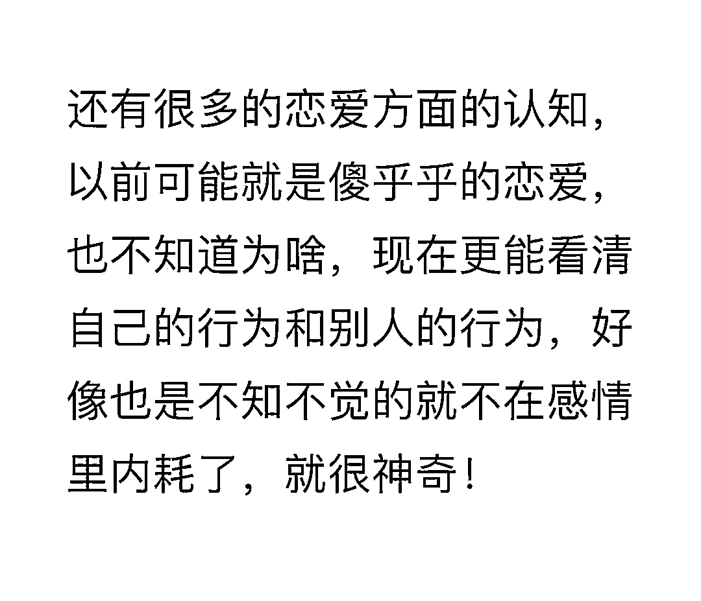

### 2.1 让更多人信任我

条形马老师说过，做好一个社群，最关键最关键的事，是把什么做成？答案其实就是信任，而不是热闹，不是红包和福利到位等等。

信任支撑了人类天生贪恋的确定性，信任是砍掉沟通壁垒的利器，信任是最好的策略，在信任的基础上衍生的策略一: 慢以凝核，慢指的是社群的成员增长一定要慢。

我又是如何让更多的人去信任我呢？一开始我自己拉群时是只有81人。

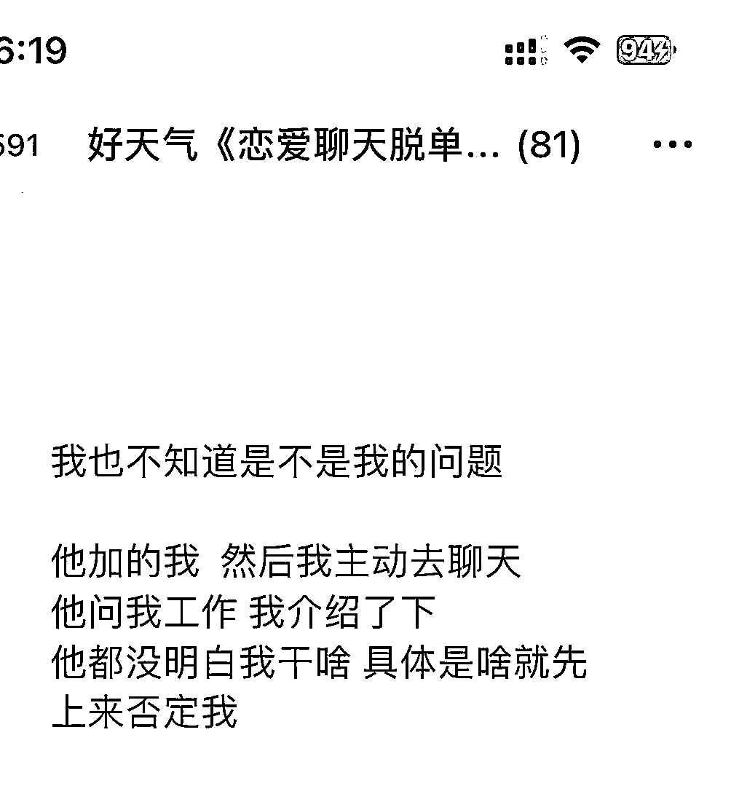

手册里这句话让我深受感触和启发，”因为人类没有办法说“我们今天认识，我们明天就彼此信任了”，这个是非常难的。是信任这件事情特别重要，而且又慢。所以在此基础上，我们要做的事情是先去找一个特别小的核心，非常有策略、有决心地先把核心凝结起来。凝结的胶水就是大家的信任，才是应该最开始做的事。“

所以在我自己持续的分享了很多的恋爱干货之后，积极真诚的在群里回答群友的恋爱困惑，也得到了很多群内的群友好评之后，这个信任一步一步加深，群内很多小伙伴看到了之后都在自发的拉自己的朋友或者在朋友圈宣传我的这个恋爱聊天脱单课程制作围观群。

靠谱姐看到能够帮助到更多的单身人士脱单，于是发了朋友圈帮我宣传这个课程制作围观群，还有很多小伙伴自发的宣传我的这个课程制作围观群，甚至还有很多我不认识的人也在发朋友圈宣传这个群。

在这里特别感谢靠谱姐帮我大半夜的还在群内拉人，一个晚上直接把人拉满~

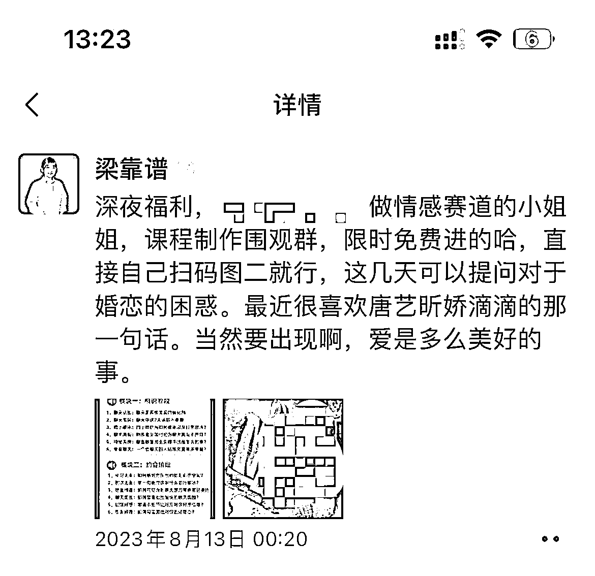

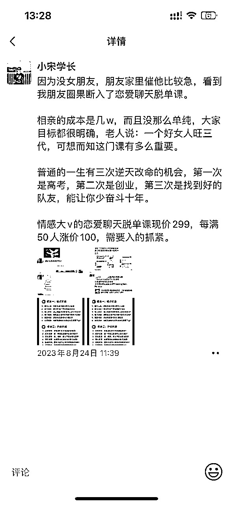

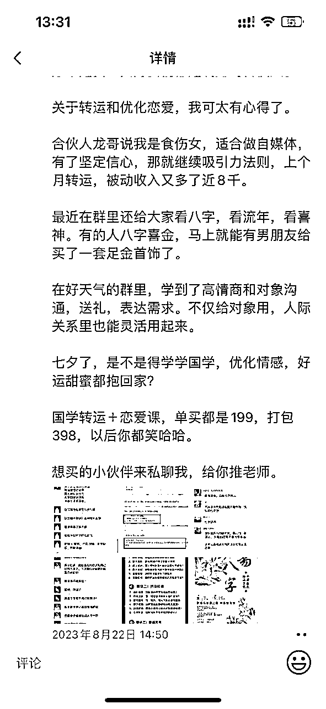

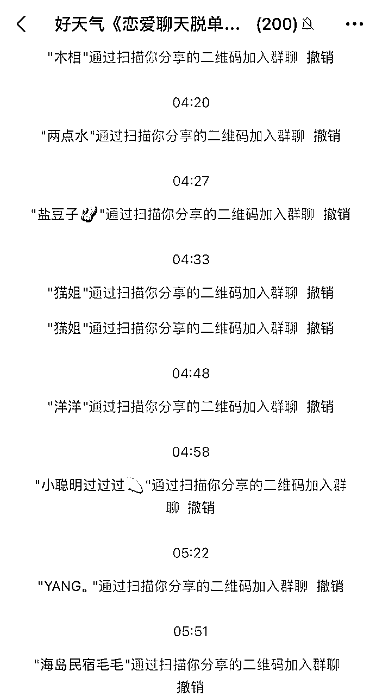

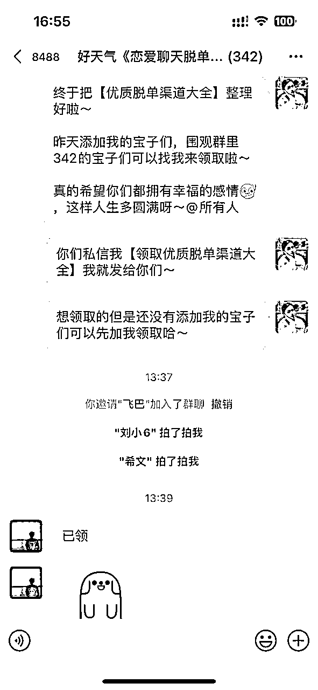

### 2.3 集中成交

在靠谱姐的指点下，告诉我要在七夕节这几天就要开始预售了，不能拖的特别久，于是我就打算用三天的时候来进行成交，这个时候我，经过前面几天的分享以及回答群内问题的同时已经做完了差不多5节课的内容了，而且这个课程还是结合群友们的问题进行改版升级，解决的痛点更加精准。

这三天的干货分享会更为集中一些，中午和晚上都会在分享情感的干货，而情感的干货尽量的涉及更多的内容。

# 3\. 课程制作围观群的裂变、转化和成交的方法

之前我有过犹豫这种课程制作见证群是否需要收费，靠谱姐说的是见证群一般是不收费的，然后大概一个月之内开始推课程或者付费社群。

下面，我从7个环节，来向大家展示这次课程制作免费围观群的全貌，以及每个环节如何裂变、转化和成交的。

### 4.1 社群冷启动---发布宣告文

条形马老师说的有一句话，我觉得比喻的真的太恰当了，朋友圈是广播站，社群是个小集市，

社群的冷启动，这个社群第一次涉及招募成员的环节，社群的第一次增长冷启动一般从哪里招人呢?无外乎主页发通知、兴趣小组发帖、发朋友圈、发公众号、好友群发，等等。

我主要就是从发朋友圈开始的。

首先，需要发布一个招募文，或者说是一个宣告文，在朋友圈宣告我要开始做【实战篇：恋爱聊天脱单课】了，这个见证群，告诉大家可以直接扫码进群围观我做课，并且可以在群内免费提问。

这样宣告了呢就非常正式，这个群的作用呢就是解决你们的恋爱脱单问题，提供痛点以及免费提问，需要的就可以扫码进群，这样进群的人就更精准。

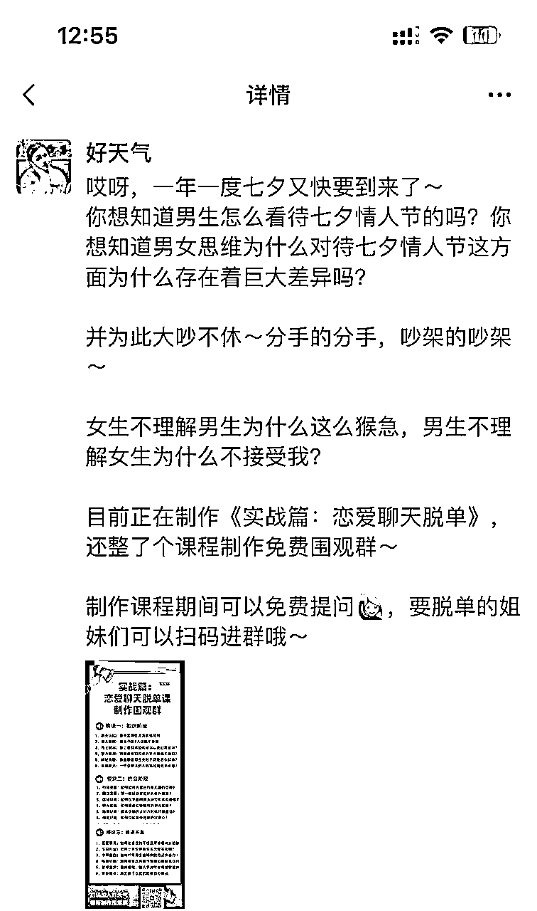

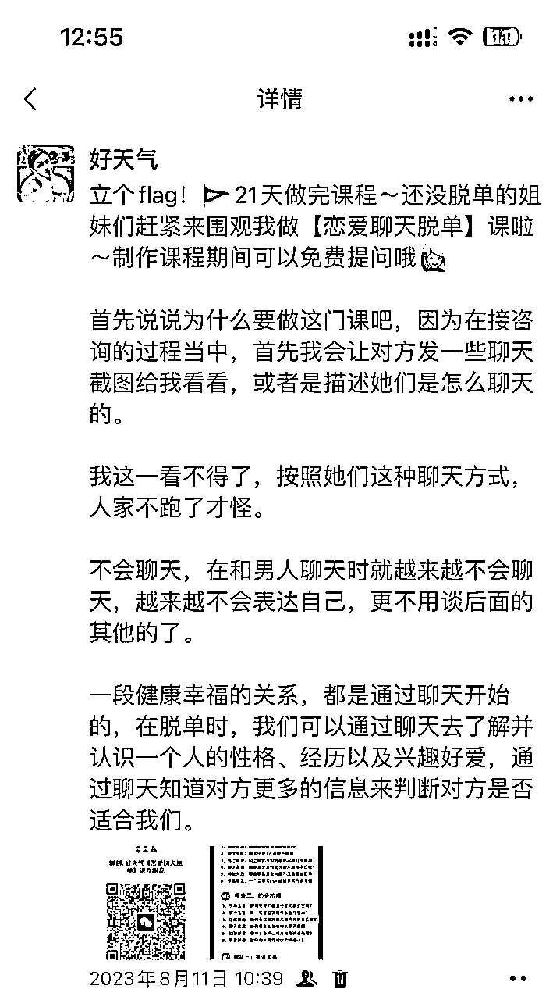

大家通过二维码扫码进群，等到人数满了200之后就手动拉人进群，因为自己扫码进群的人也会比较精准，能够进群的说明多多少少都会有些这方面的需求。

当需要手动拉人进群的时候，需要在评论区进行一些话术引导：

比如：想进群围观我做课的小伙伴在评论区扣【1】，我拉你进群，可以在群内免费提问。

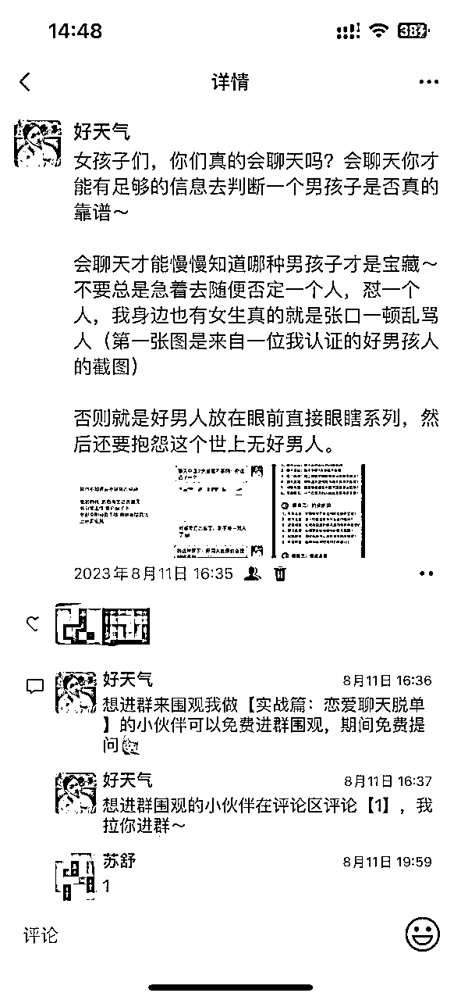

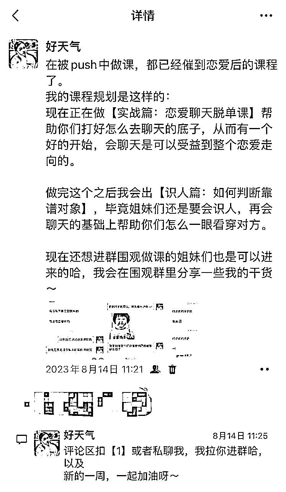

拉人进群之后，一定要及时的欢迎新人进群，以及还要做自我介绍，因为在一个群里，未必所有人都认识我，其实大部分人还是不认识我的，所以这个时候一定要及时地进行自我介绍，还要设置欢迎语。

如果后续还有其他人进群，比如进了10个左右的人的时候，可以打包之前的自我介绍以及分享的精华内容给新进的人小伙伴进行阅读。

另，还可以发一个欢迎的新进群的小红包进行开路。

### 4.2 分享真实案例激发群内讨论度

社群发起人里有这么一句话，构思社群的框架，其中的先从一个社群领导力Tips讲起，心理学家们发现，其实一个人到底有没有领导力，并不完全取决于这个人自身，也不完全取决于他有没有办法拿到绝对的决定权。

还有一个重要的影响因素，就是有没有人回应这个人的呼应，这个回应的人存不存在?如果一个人发起了号召，并且立马会有一个人站出来回应他，一个领导力的最小模型就产生了，这个第一个站出来回应的人，就是这个号召本身的正反馈。

看到这段话后，我在想我应该怎么去非常接地气的让群友来积极的回应我，这个时候我甚至没有任何一个铁杆粉丝，也没有叫任何人来和我打配合。

于是我就想到一个方法，毕竟是做情感嘛，那就一定要有真实的案例呈现，我就想到了真实的案例，而且一定是那种很让人容易讨论的案例。

刚好当时我一个朋友情感上来咨询我，刚好她又是那种非常钢铁直女的那种，我就把她的聊天内容发到群里让大家一起讨论。

真的讨论度非常高，很多小伙伴表达这个话题还挺有意思的，一下子就把群的活跃度给激活了起来，把大家的目光都吸引到我的群里，先让大家先讨论，然后我在最后分享我的看法以及我遇到这种情况，用我个人的真实案例来说明都是怎么做的以及拿到了什么结果。

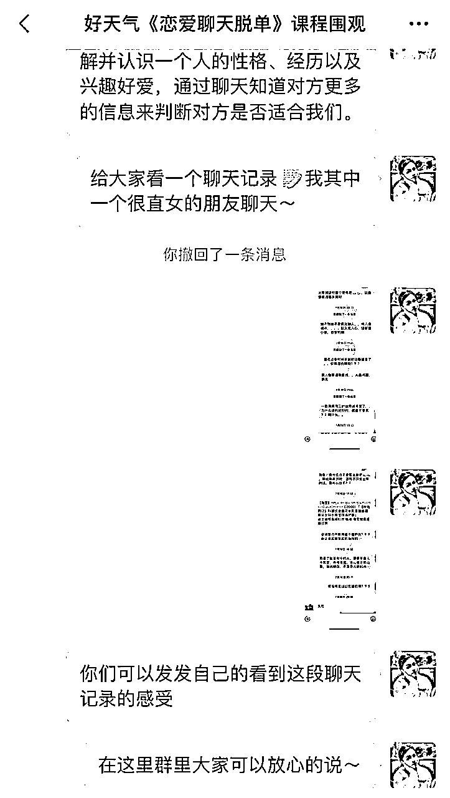

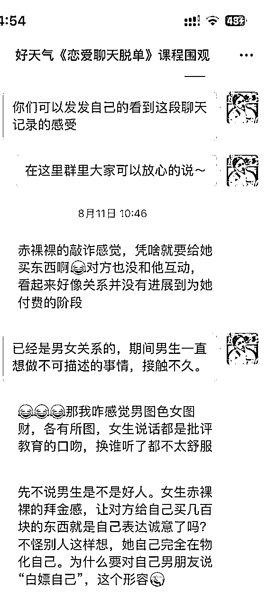

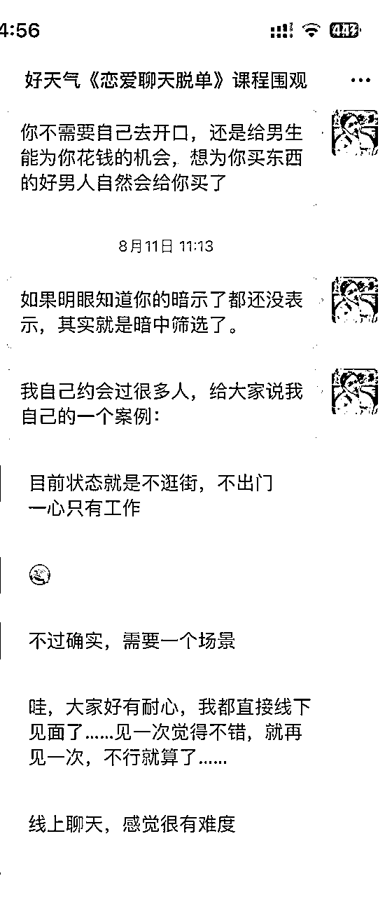

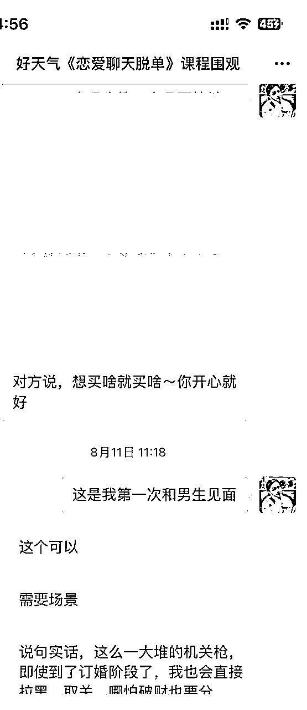

正因为群友又得到我专业度的解答情感困惑得到回报，又有我的活生生的真实案例分享，让群友去讨论，他们既能感兴趣又能够不被约束的去讨论，于是就能分出注意力到我这个社群里。

只要注意力在这个社群里，那么才有可能有后面的一切，无论是更多的信任还是其他一些感受。

### 4.3 领取【优质脱单渠道大全】引导加好友

这点是我在分享干货的过程中，有小伙伴说不知道怎么扩大交际圈，我才想起来要做一个资料引导群内的小伙伴加我好友。

这就弥补了我在新人欢迎语没有准备好的情况下，很苍白的告诉大家添加我的微信围观我的朋友圈，其实这时并没有多少人主动加我。

在制作免费资料发送福利的时候可以及时在群内以及朋友圈宣告发布这个消息以触达更多的人群，说明明天许诺给你们做一个很圈的优质脱单大全，你们可以添加我，明天可以添加我微信进行领取。

然后等第二天的时候整理好了之后，再在群内宣布领取资料的方法，突然有一种养成系的感觉，无论是制作课程还是制作免费资料都在在这个免费围观群制作完成的。

一方面，可以避免大家领完就走，因为是不能把资料直接发到群里的，如果发在群里，大家就没有添加你的理由了，所以一定要设计添加你才能领取到这个免费的福利资料。

另一方面也可以增加互动、增加参与感，就是在对方领完福利之后，还要引导对方在群里回复已领，因为这样可以吸引更多的人来添加我的微信领取【优质脱单渠道大全】，还能增加群内大家都在积极领取福利的氛围，之后我还能以此作为发圈素材。

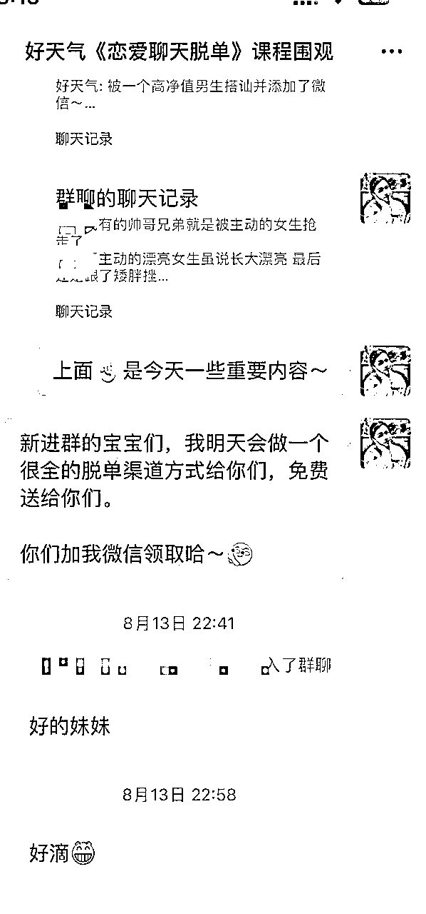

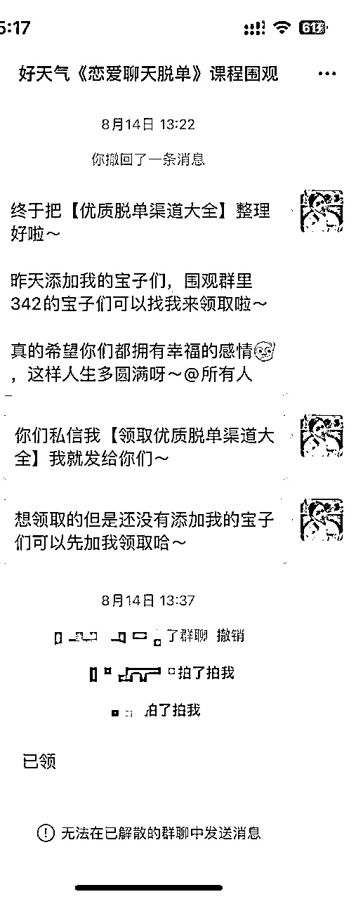

### 4.4 裂变增长的三种方法

（1）真诚利他，放下成交心

看到手册里说，什么样的人适合建社群?第一个是真诚的人更适合建社群，第二个是喜爱分享与交流、抵得住挫折与冷清的人更适合建社群。第三个是乐于走近人，善于理解人心的人更适合建社群，这些才是先决的条件。

本身我做情感就是出于我自身的热爱以及想要帮助更多的人获得幸福的感情，因为我真的认为其实每个人都是能够把自己的幸福感情给运营起来的，但是很多人就是没有方式方法，经常就是遇到情感问题就是两眼抓瞎，我也是真心想帮助人们，多一个人感情幸福其实社会也会更加稳定，做有价值的事情也是很让人开心的。

其实我的裂变引导方式很简单，就是靠真诚分享，认真回答群友的问题，是一种没有压迫感也没有要求对方一定要拉人进群，而是以利他的心态来进行。

以及我主要是争对了领取我资料的小伙伴进行一些引导回复，告诉他们这是送你的见面礼，有问题都可以在群内免费提问，如果身边有脱单需求的人也可以邀请一起。

这个效果还是挺不错的，我发现很多人都会在看了我群内的干货分享以及回复群友问题时，我不认识的小伙伴也会拉人进群。

主要还是就是以一个利他和真诚的心态进行裂变引导，这个时候的成交心一定要放低，一定要把自己真诚的态度拿出来，打消对方对我的顾虑，增加对我的信任。

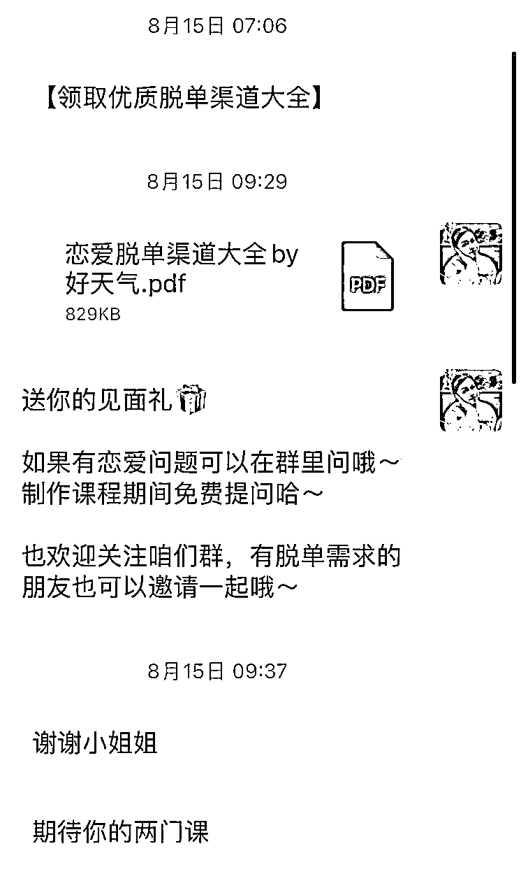

（2）群内持续分享干货打造好口碑

如果群友能在被问及呆在社群的收获时，都能清楚地讲上几句，也是口碑正在酝酿中的绝佳状态。这就是上面说的让更多人认识我以及更多人信任我，用自己的专业度、真诚分享、积极答疑积累更多的用户证言，群友的体验是很好的。

才刚拉群的时候，我会先进行自我介绍，以及说明我为什么要做一个课程免费围观制作群，也就是项目见证群，说明我的初衷是什么。

然后每天都会进行干货的分享，干货分为身边真实案例分享、个人案例分享、两性聊天干货分享。

后续还有人进群的时候，以及我即将要开始今天的分享的时候我会打包之前的干货分享发在群里，然后开启今天的分享。

前面很多天里都是进行干货分享，在干货分享的第二天就有小伙伴给我打钱买课之后我提前预告了我课程的价格。

当然，这个时候也是不要太操之过急，因为还有很多人在围观Ing，现在依然还是打消群内人的顾虑为主，我依旧还是持续每天晚上分享我的干货。

因为持续的无功利性的分享干货帮助了大家之后，群友自发的拉了很多自己的身边的亲朋好友，这样就进行了正向循环的裂变，群里人越来越多，这就是因为分享的内容有打破别人的认知，于是群众推动群众，自发的邀请人进到我的社群。

（3）分佣

裂变主要两种，一种是口碑驱动的，另一种是纯分佣收益驱动的，我给到每个人的分佣是50%，

对于我来说，敢于分佣的前提是口碑第一，如果不是先好好的做好自己的口碑，我是不敢让别人去分佣的，因为当别人帮我宣传了我的产品时，我也是借用了他们自己本身已有的口碑，我首要前提就是好好做好自己的口碑，以此来维护宣传我的人口碑。

### 4.4：正式预售（8.20-8.22）

随着一边在群里进行干货分享以及免费回答群友情感问题，一边制作课程，很早就会在群内提前和群友说，当制作了6节课之后就会开始第一次早鸟价预售。

称着情人节的时候就要开始预售了，真的非常感谢靠谱姐及时的提点，真的一句提点就可以少走很多弯路，真的非常的感谢靠谱姐这个贵人，认识靠谱姐真的太幸运了。

我于是就计划情人节前2天开始预售，这个时候的规划就会更加紧密锣鼓起来，我的规划是早20-22号中午和晚上都进行干货分享，以及用接龙的方式进行报名。

还有这个时候很多的小伙伴会进行情感提问，我都会及时回答并答的非常全面，因为你回答得这个问题其实不是只回答他一个人，而是回答一个群里的人看。

你回答到了大部分人的心坎上的时候，群内人员夸你的时候，就是一个现场的来自群友的好评认证，这个都是群内300多个人可以看见的。

这个阶段的干货分享会更加的全面和多元化，比如说，纯干货、互动型干货、会先提前预埋问题等到晚上的时候在揭开分享，就是为了吸引群内人员的注意力以及让群友自己主动聊天让他们感觉自己才是主场。

我说说正式预售的SOP环节

1、再自我介绍一遍

群内的人群并不是都认识我，可能很多也是中途才进群，也有可能有些小伙伴并没有去爬楼，为了尽量的让大家知道我是谁，我在正式的预售阶段还是做了一轮自我介绍

2、再提醒一遍领取福利

话术：还没有领取【优质脱单渠道方法大全】的宝子可以加我领取一下哦~

也是为了让之后才进群的小伙伴再一次触达，告诉可以有福利可以领取

3、发红包开路以及说明后面也有红包雨

说完前面的内容之后才发一个红包，以及告诉大家后面还继续会有红包的，哪怕是为了等待这个红包也有小伙伴来看群内的内容的，也是一种让群内小伙伴在群内能有更多的停留。

发红包的三个节点：

（1）说完领取资料之后发一个

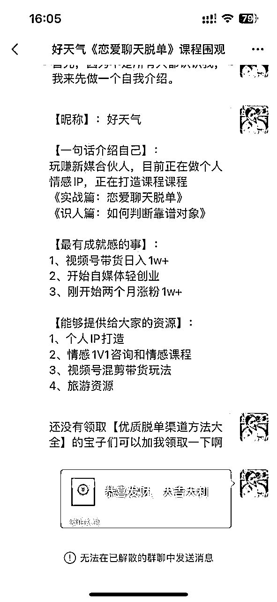

（2）说明完自己制作课程的初衷顺势说明打磨了这门课程

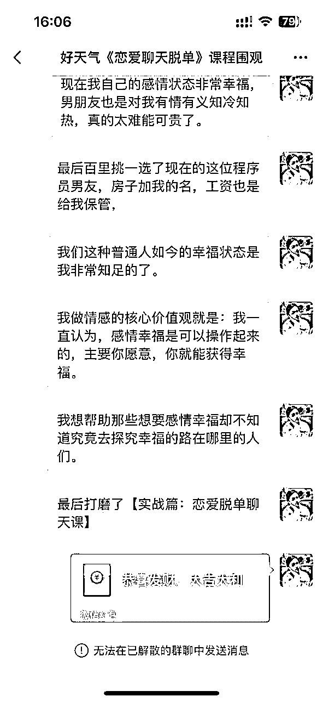

（3）介绍完整个课程体系发一个

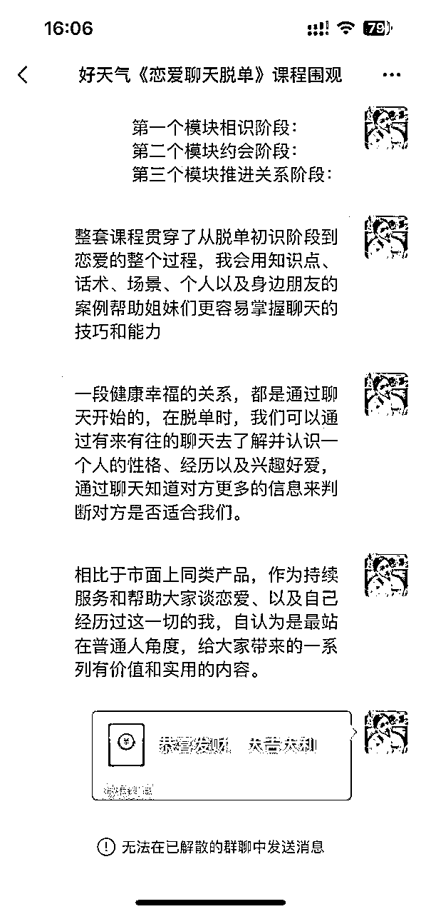

（4）发完课程海报以及价格、权益之后发一个

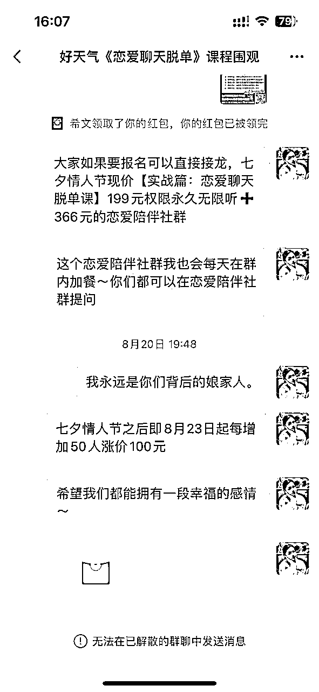

4、打包之前的聊天内容干货再发一次

把之前的群内精华再发一次，也是为了防止后面的小伙伴没有时间爬楼，把精华直接打包好，然后发一个红包。

5、再次说明自己做情感IP的初衷

一定要说明自己做情感的初衷，这样更加真实可信，更加增加信任感，把之前自己遇到的经历笼统的概括一下，说自己曾经再情感里遇到的苦难，现在自己已经度过了这个阶段并且靠自己又成功运营了一段幸福的感情，我自己的亲身经历是可以增加信服感的，于是现在想帮助更多的人猎取幸福。

6、对自己的课程产品进行介绍（适合谁、学完有什么收获）

主要就是介绍这门课程的主要简介、课程的主要大纲、课程适合谁来进行学习

7、说明购买课程有哪些具体的福利

说明购买这个课程有送价值365元的社群以及再群内随时问答

8、以接龙的方式引导大家报名

用接龙的方式非常好，可以增加更多人的互动，以及有人报名的话可以激发带动更多的人来报名。

再这里非常感谢靠谱、馆长、理白的帮助，在半夜的时候进行了一场群内危机公关处理。

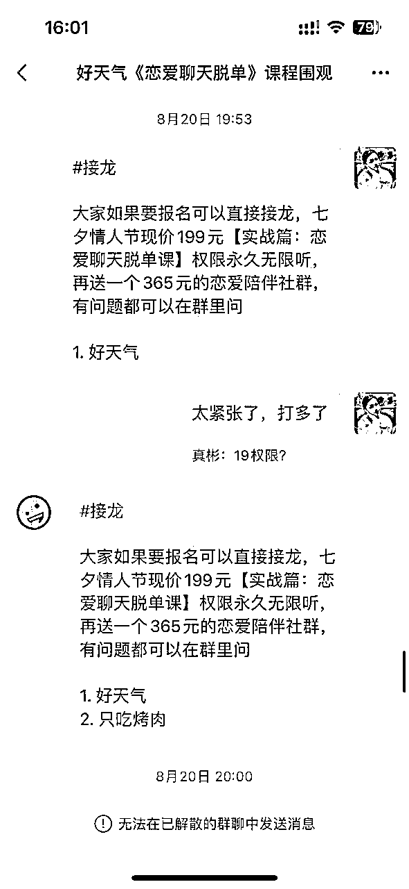

9、限时提醒

每当一段干货分享完之后，我都会及时的提醒现在距离涨价还有多少时间。

### 4.5：更加密集干货分享触达更多用户

在最后两天预售里，我为了更多的触达用户来接龙报名，我采取了这么一个方法：早上时提出一个疑问，让群内人进行思考和讨论，这样就有让群友不受约束的在群里畅所欲言的机会，又一次能够把他们的注意力集中在这个群里，激发对这个群的内容感兴趣

然后发送一个报名接龙，等到中午的时候我对早上疑问进行干货输出，然后又发送一个报名接龙。

下午的时候我就又重复这样的动作，那么接龙报名的触达一天就能有四次，我发现每发一次，都会有人进行报名接龙，说明这个方式也是能够潜移默化的植入群友的心中。

因为当我抛出这个疑问的时候，但是我不说，我先让群友自己去思考，但凡我等之后发表出能够颠覆群友的恋爱认知的时候就是我在群友心中种下一颗种子的时候，他们感到到原来两性聊天原来是这样聊的，于是就会进行接龙报名。

千万不能直接给出答案，因为一旦直接给出答案，他们会误以为自己本来也是这样想的一个错觉，反而认为你的干货不是干货。

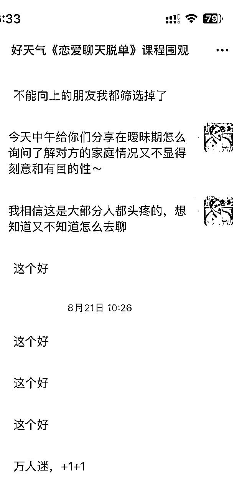

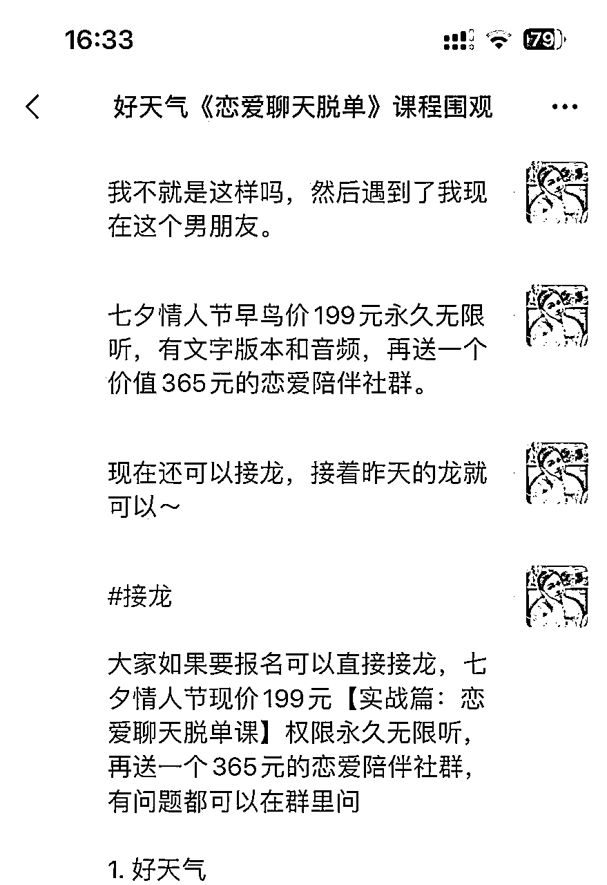

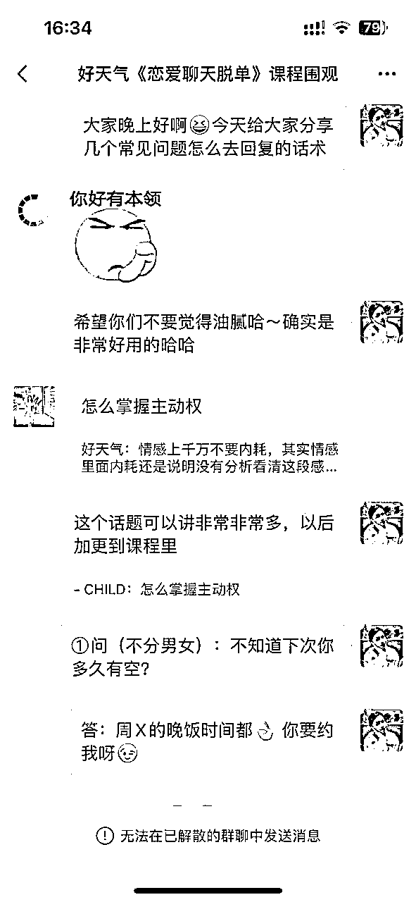

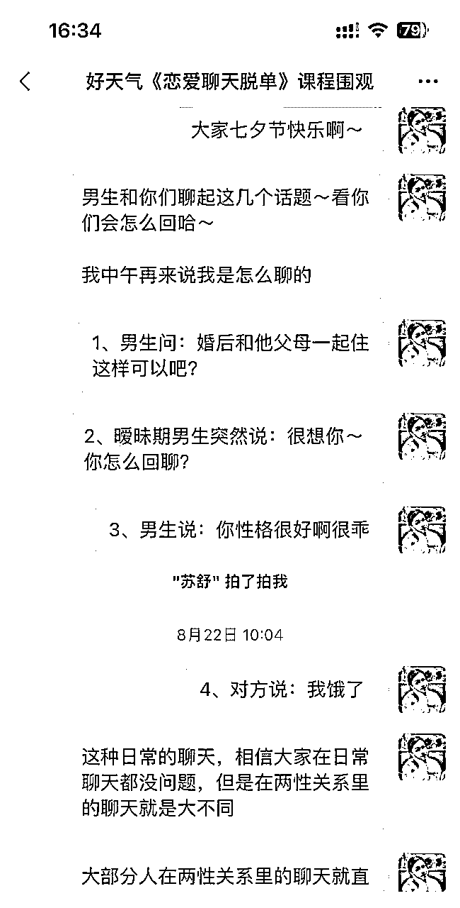

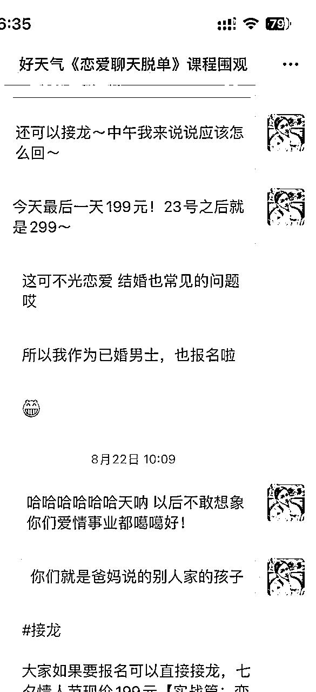

### 4.6：公关危机处理

危机公关的话术的要点有：

1.回答要真诚，不管是谁对谁错，保持客观真诚。

2.继续关注对方的情绪，

社群危机公关应对方法总结几个核心词是：及时、 真诚、 专业、 态度好。

比如群内有个小伙伴说现在市面上很多人割韭菜之类的负面话题，那么我会先肯定他的担心是有道理的，引导对方继续说话，以防他还有不满的情绪憋着不说，跑到其他地方说，更不好控制。类似这样的处理方式，就能有效平息当事人不满情绪。

在这个群里，由于有男女都在，我是有提前预防群内会有男女对立或者吵架的情况发生，尤其是有些男生喜欢说出一些要先肢体接触之类让女生容易喷的话题。

我在我的课程海报里都有写到这类词，每当有人提到敏感的话题的时候，我会及时地见缝插针地达到宣传我的课程以及及时制止会有男女互骂地情况发生。

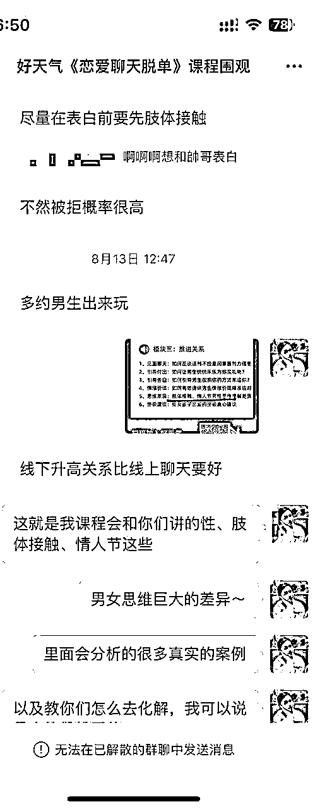

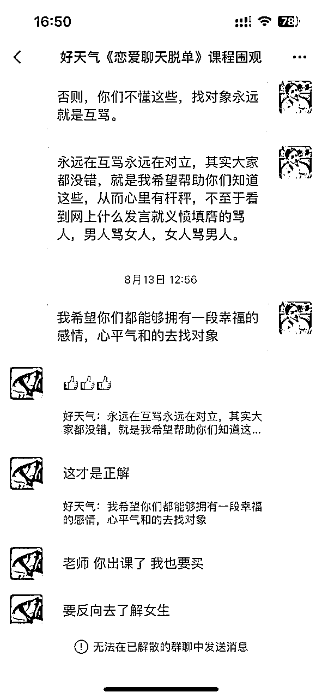

黄小刀老师在社群发起人里提过这样一个问题，比如在一个微信群，某成员出现了异常行为（没有按照约定执行，价值观偏移），此时管理者也不作为，假装没看见或者不好意思处理，那么带来的后果是什么，损害又是什么？

这让我深有感触并思考了一些，在某一天凌晨的时候，有部分人聊起了和正常恋爱价值观极为不符的发言，还在群里放肆不顾公序良俗的发言，群内聊天地的风向越来越诡异，如果没有靠谱姐、馆长还有理白及时的智慧的制止了别人的行为，我想这大概会伤害到其他群友的信任，破坏这个群的氛围以及流失掉更多的社群人员。

在第二天白天的时候，作为群主，我也及时的说明群内聊天应有的恋爱价值观，大家共同维护好群内聊天风向。

社群危机公关应对方法总结几个核心词是：及时、 真诚、 专业、 态度好。

### 4.7：群的使命完成---及时解散群

任何群都有生命周期，也有不同的阶段，大家因为什么而聚集，以及手册里提到，群主最好一开始就帮助群友调整好预期。如果未来必将收费，一开始的“免费”，换另一种称之为“内测”的理解，可能是更妥帖的。

这个群就是[先定位、再招人]，定位非常精准，就是需要脱单的人进群，不知道怎么在相亲中聊天，不会聊天的人进群，而在制作课程期间分享的干货或者在群里回答问题都是免费的，一开始就说明了之后的课程制作出6节之后就会开始预售，所以在群内的人员都知道这点。

其实就是相当于在做课期间的一种内测，看看群友的痛点，挖掘更多的痛点出来来丰富课程的内容。

社群的周期的完结，是社群价值的完结。社群走完它的周期，到了这个时候，群的使命和价值已经完成了，那么就及时解散群，因为已经成为了你的用户的人已经成为了你的用户，否则的话也是沦为别人打广告的地方，一定要好好的守护好自己的口碑，所以群一定要解散。

最后解散群的时候一定要留下自己的个人微信名片，也很感谢靠谱姐及时的在我要解散群的时候发送了我的名片在最后，因为哪怕是回头有人爬楼看见了说不定就来添加我了，也是增加一次用户的触达啊。

# 4.课程制作围观群期间的朋友圈打造

### 3.1 朋友圈造势

1、产品圈

透露自己制作【实战篇：恋爱聊天脱单课】的做课计划以及你们也可以来围观我做课，用还可以在我做课期间可以免费在群内问情感问题来吸引更多的人进入我的课程制作免费围观群。

2、分享自己的情感生活圈--人设圈

朋友圈手册中说，生活随拍的内容，可以发成观赏价值、情绪价值、专业价值，主要是看你文案如何去写。

在人设圈中，我会以和自己男朋友真实的生活状态来更新，这样很具体也能够提升真实性，积累信任度，这样的文案其实可长可短，但是在发日常生活圈的时候，我会注意多留意身边的美好。

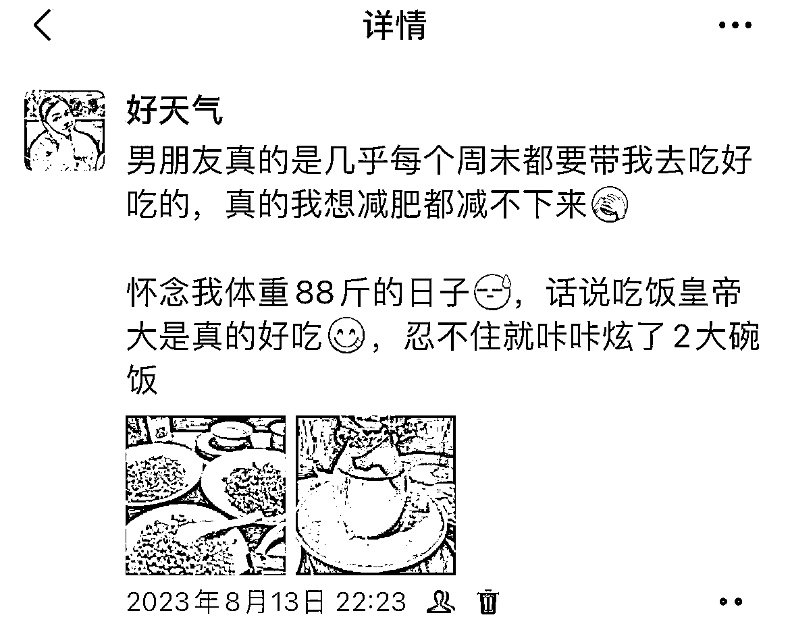

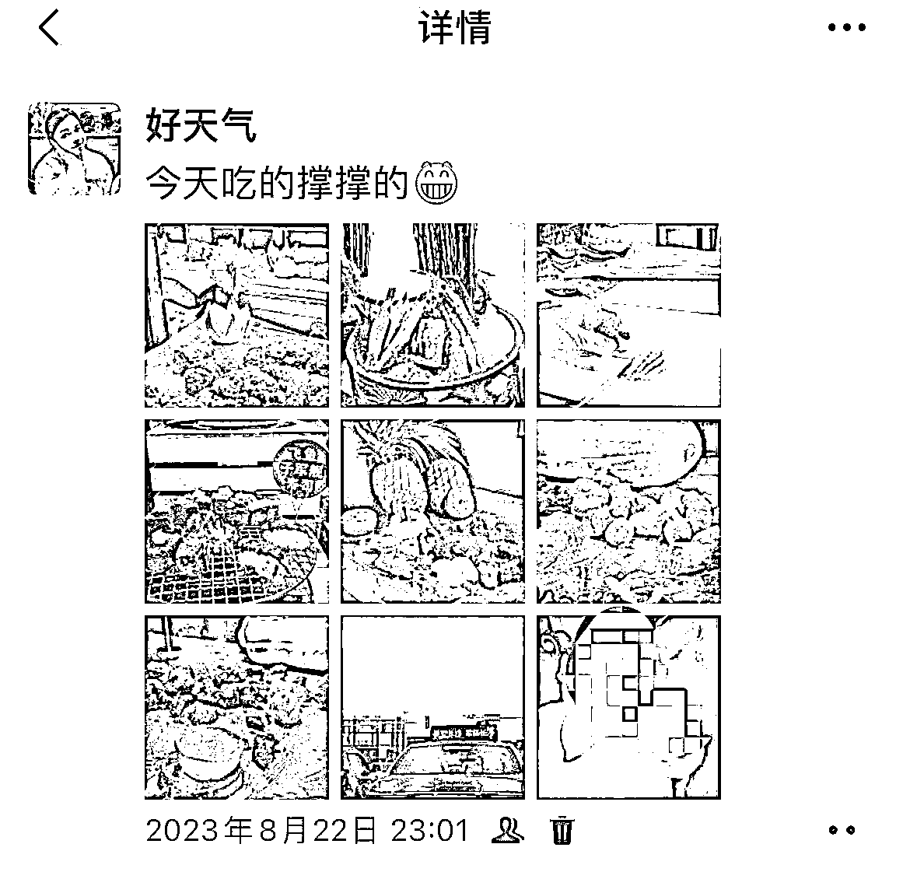

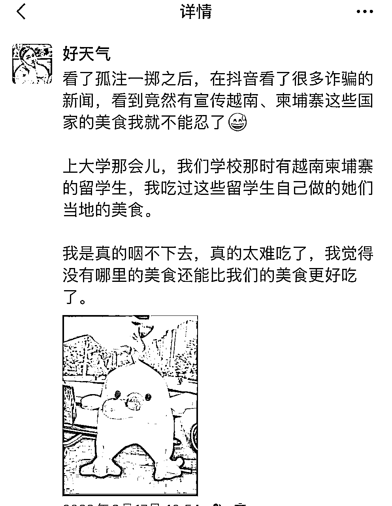

3、分享自己的做课过程

（1）写用户互动体朋友圈

也就是把你的要求，直接放在文案末尾。价值，有来有往才行，千万不要只付出，不索取。我们跟读者的关系也是如此，所以我们跟读者的适当互动是非常有必要的。

由于群里很多人在分享干货的时候还有其他不认识的小伙伴一直在源源不断地拉人进群，刚好我又是做的聊天脱单这个课程。

于是我就马上花了半天时间做了一个【优质脱单渠道大全】来吸引更多的互动以及让更精准的需要脱单人群主动加我的微信。

并且设计了要主动私信我【领取优质脱单渠道大全】，我才会发给这个小伙伴，增加进一步的用户触达和感知度。

让我意外的是很多小伙伴在领了资料后主动在群内说了“已领”，这样就让更多的小伙伴主动找我领取资料，我真的非常的感动，第一次做免费围观社群，总是带给我不一样的感受。

（2）故事带出产品

格式:前面是故事，后面是广告。

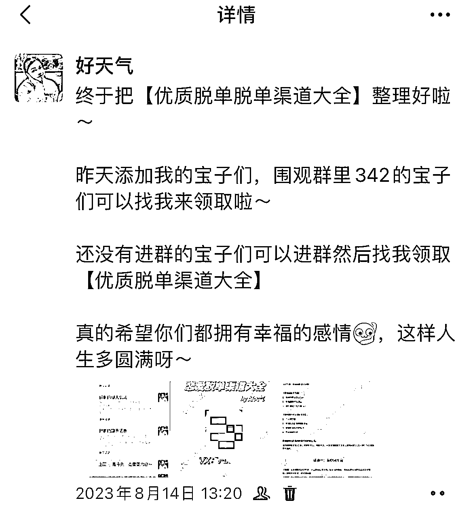

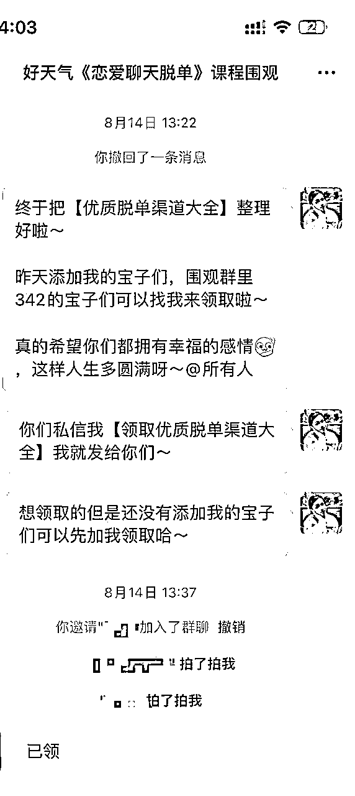

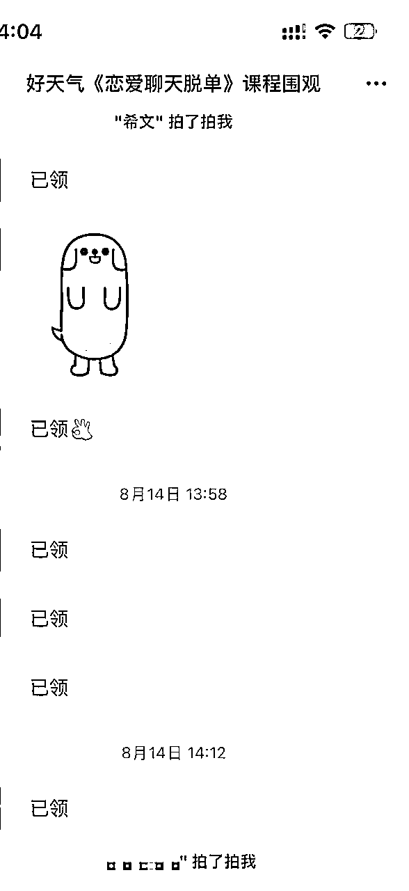

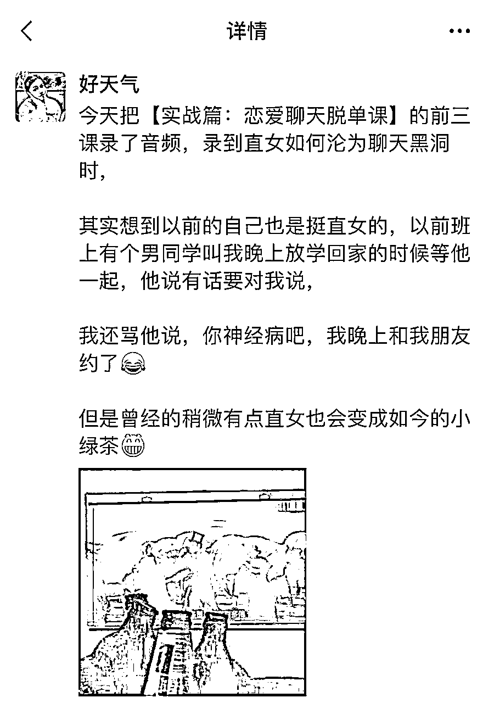

### 3.2 制作规划

项目见证群-免费课程围观群时间规划

*   朋友圈宣告拉群、裂变（明确自己的主线）——8.10~8.14

*   朋友圈宣告终点立flag以及群内宣告21天做完一个系列课程

*   群内自我介绍以及说明做课期间每天分享情感干货——8.10~8.23

*   在做课期间群内可以免费回答情感问题——8.10~8.23

*   群内乘着七夕节到来提前预发售3天——8.20~8.23

*   恋爱聊天脱单课程制作免费围观群解散——8.23

### 3.3 海报制作

这个海报其实就是我的【实战篇：恋爱聊天脱单课】的课程目标，唯一的不同就是上面添加了免费围观群，这个海报我做的并不满意。

### 3.4 朋友圈文案

1、宣告自己要开始制作【实战篇：恋爱聊天脱单课】，可以进群免费咨询

2、人数造势，人数一晚上直接拉满发一次，感谢大家的认可在发一次

3、群内领取【优质脱单渠道大全】，即领资料的时候发圈

4、群内积极解答群内的情感问题得到群内好评后的夸夸之后发圈

5、自己发分享的情感干货发朋友圈持续吸引人进群

6、当别人拉她们的亲朋好友进群的时候发圈

7、有群内主动打钱主动问课程的时候发圈

8、准备开始欲发售的时候要发朋友圈

9、当结束解散群的时候发圈表达感谢

# 5\. 这次课程制作围观群有哪些不足之处呢

### 5.1 新人欢迎语没有准备好

当有源源不断的新人进群的时候其实我准备的并不是特别的充分，都是临时来制作的新人欢迎语，但是好在还是说了欢迎大家来到我的群。

### 5.2 海报做的不够好

我的制作的海报只有课程的目录，但是并没有我的个人信息介绍，也没有课程简介、课程特色、适用人群以及学完能够收获什么都没有，仅仅只有一个课程大纲目录。

所以等下次的时候，我这方面需要进行改进。

### 5.3 禁止广告的群公告没有发

群里有个小伙伴在发自己的票务广告，这个应该是我在建群的第一天就应该要明说不能在群内打广告，但是我以为这是应该大家都会默认的在别人的群里是不能打广告的。

显然是该说的还是要说，否则这个群就会失去了他的意义和价值，也会流失掉部分社群人员，因为在这个小伙伴发自己的广告在群里时，很明显有2个人就退群了。

### 5.4 整体节奏把控并不是特别好

其实在运营这个项目见证群的时候是在凭借我的本能在做，在做的过程中缝缝补补，发现有了问题及时的纠正过来，不过也确实是先完成再完美，希望下次的时候更加圆满有计划一些。

# 6.最后的心里话

这是我第一次做一个社群，而且也是第一次发售课程，第一次项目免费围观群，仅靠我一人绝对不可能完成，很感谢在生财的航海中一直得到了不同的成长，然后运用在自己的社群里拿到了结果，赚到了人生意料之外的钱，我也真的非常感谢靠谱姐，在需要的时候给我指点适合的动作和建议，很感谢芷蓝姐对我的朋友圈进行指导和点评，很感谢理白给我写作方面的指导，三位我人生中的贵人。

也很感谢龙哥、可粒、小鱼儿、小宋学长、大西CC等等还有其他小伙伴自发的在朋友圈宣传，很感谢在能够在我很年轻的时候就认识了这么多的贵人，在走弯路的时候及时的指点我。

谢谢你花那么久的时间看完我的文章，我是好天气，若文中任何细节没有看懂、欢迎找我一起交流探讨。

如果有什么能帮到忙的地方，我也很乐意给你提供帮助。

祝我们一起生财有术呀~