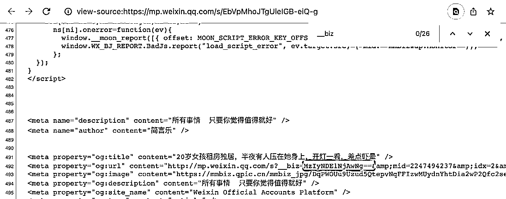
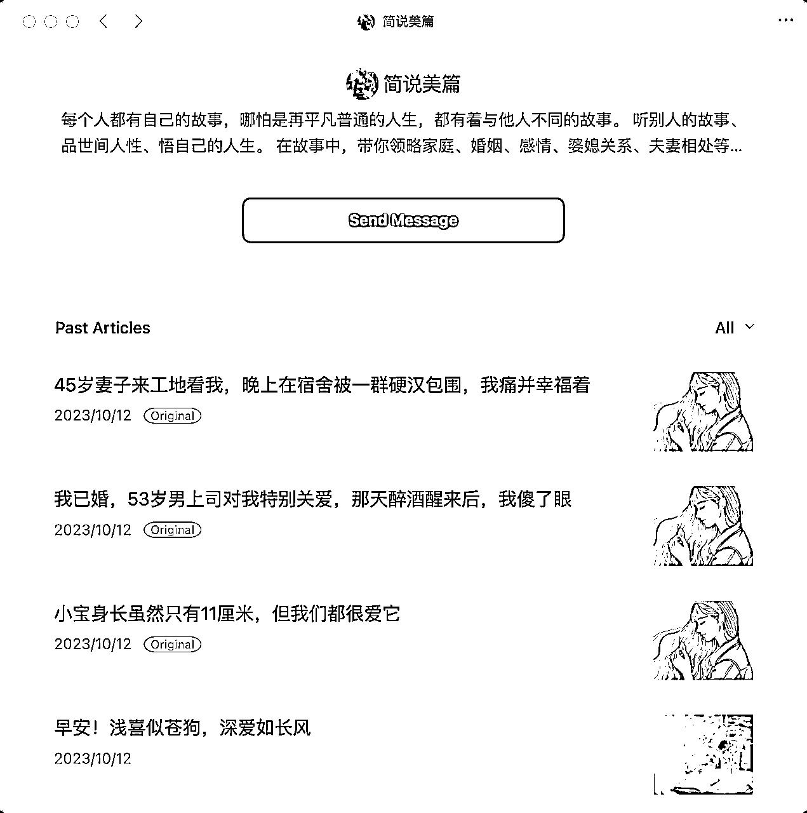
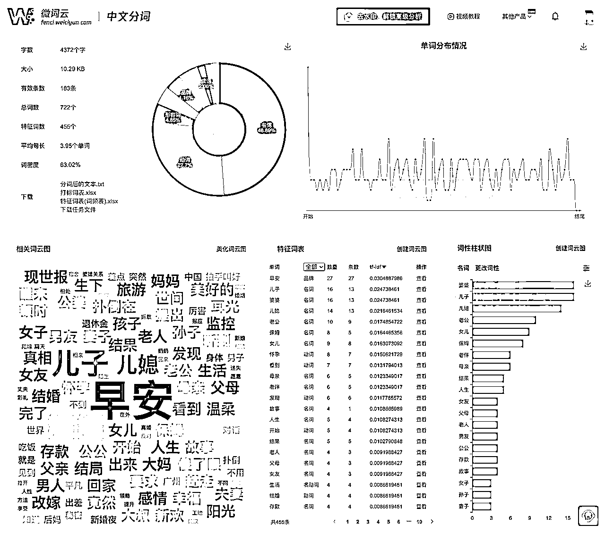
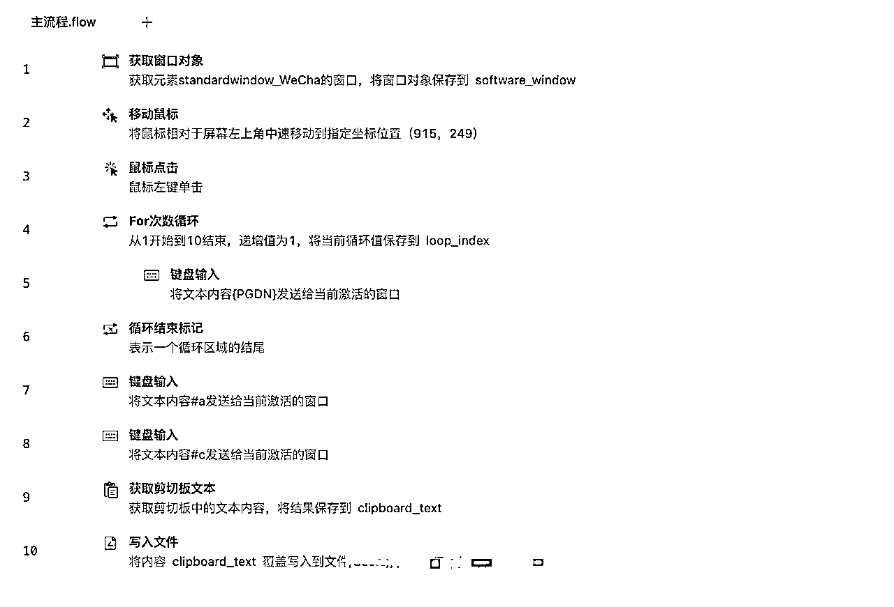
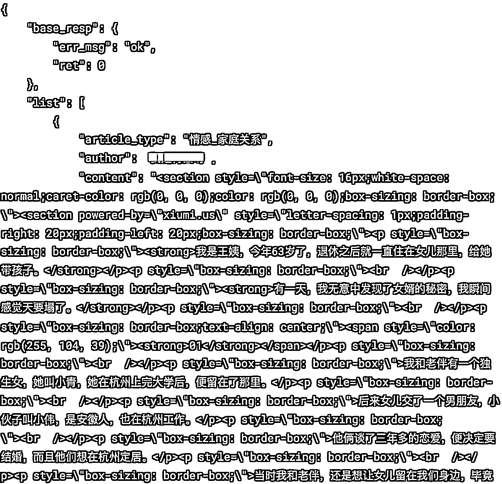
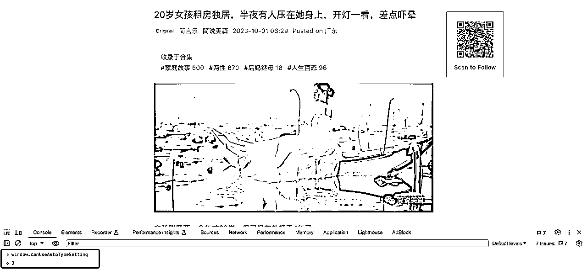
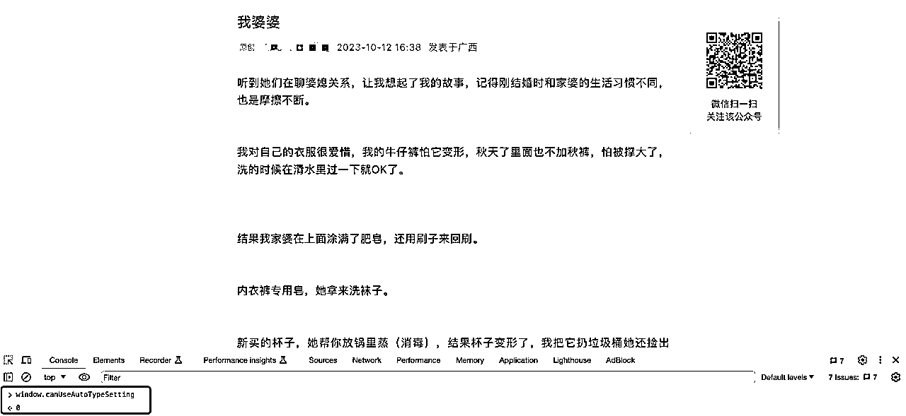

# 无需爬虫，1分钟获取公众号历史文章（标题）

> 来源：[https://vfu5gh579k.feishu.cn/docx/WNCHdjeGdonClExU9yFcz6I2nwd](https://vfu5gh579k.feishu.cn/docx/WNCHdjeGdonClExU9yFcz6I2nwd)

大家好，我是姬小光。参加公众号航海的伙伴们经常需要参考其他人的文章标题寻找思路（尤其是妞妞教练的），但是大部分人是不会写爬虫的，即使 RPA 也要学一阵。这里教大家一个简便的无技术方法，可以快速获取文章标题。

## 获取历史文章标题

首先，我们要获取某个公众号的历史文章链接，这个在网上有很多讲解，这里再给不知道的伙伴重复一遍。

第一步：随便打开该公众号的一篇文章用浏览器打开，右键 查看源代码，搜索 __biz 即可看到图示内容



选中 __biz= 到 & 中间的部分，即为该公众号唯一表示，本例为 MzIyNDE1NjAwNg==

第二步，将获取的 __biz 拼成如下链接，注意 biz 前面是两个下划线：

```
https://mp.weixin.qq.com/mp/profile_ext?action=home&__biz=MzIyNDE1NjAwNg==
```

即为公众号历史消息页面，注意该链接只能在微信内置浏览器打开。

接下来，请在 PC 端微信内置浏览器打开此页面，大概这个样子：



关键时刻到了，你只需要不停地按下翻页键，或者你习惯滚鼠标的话就一直往下滚，滚到满意为止，然后 Ctrl+A 全选，Ctrl+C 复制，最后再粘贴到任何你喜欢的文本文件中，即可获得滚动到目前位置的全部文章标题了！

至此，获取文章标题功能已实现。

## 分析关键词

我们知道 python 可以做分词，但这里还是坚持无码。可以找个在线的词云工具，例如 微词云 ，然后将刚才获取到的全部标题粘贴进去，分析一下，得到如下数据图表：



是不是已经有点内味儿了？一行代码也没写哦~

## 进阶：RPA 自动获取

有人说了，这可以自动化啊！对了，一切都可以自动化，关于 RPA 能力，圈友很多分享，这里不再赘述。按照刚才的思路，大概是这样的流程，自己玩就好：



到这一步，你已经人力自由了。

## 高级：Python 获取公众号历史文章

用 python 刷接口，风险还是大一点，容易废号。因为接口中带了你的用户信息，所以要慎重。简单讲讲，接口地址可以通过 APP 抓包获得，比如 iOS 可以用 stream，Mac 可以用 Charles 等等。通过打开刚才的历史文章列表，并向下滚动，即可看到接口地址为：

```
https://mp.weixin.qq.com/mp/profile_ext?action=getmsg&__biz=MzIyNDE1NjAwNg==&f=json&offset=10&count=10&is_ok=1&scene=&uin=777&key=777&pass_ticket=nW6YdJ9Ajz8WOD5QWR6otnasml3bFeu9ls7CFcVLpe9bpwNUUAO8uQ2xgA1wouAY&wxtoken=&appmsg_token=1239_ITZ0NysE7K5IHytH3LJrMhO0KVxv_kofwv72GA~~&x5=0&f=json
```

参数很多，重点关注以下参数：

__biz: 公号唯一标识，同上文

pass_ticket, appmsg_token 两个用来验证的 token，有效期较短，同样需要抓包获取

拿到接口 URL，就可以用 python 爬了，记得带上 headers，这里比较偏技术，不展开了。


爬到数据之后，可以结合 jieba 等 python 库进行分析。

## 加餐：检测快捷转载

类似的，你只要学会抓包，其实有很多接口可以使用。比如在公众号管理后台查询可转载的文章，接口为：

```
https://mp.weixin.qq.com/cgi-bin/operate_appmsg?sub=check_appmsg_copyright_stat
```

然后再分析下字段，可以看到接口中不但包含了可转载状态，甚至！甚至还包含了文章的完整 html 结构！这可比在页面上复制文本厉害多了，你可以直接把内容生成网页（然后呢？）



还有另一个检测快捷转载的方式，不知道多方便！用 chrome 浏览器任意打开一篇文章，然后 F12 打开控制台，输入：

```
window.canUseAutoTypeSetting
```

然后回车：



如果值为 0 则为「分享」，值为 3，则支持「快捷转载」。



所以这东西有啥用？当然是为了更快捷地转载了😂

## 其他

爬虫有很多形式，手机 RPA 也可以，典型的如 Auto.js 之类，也可以爬取 APP 中的内容，有需要的自己摸索即可。暂时写这么多，估计离精华还很远😂