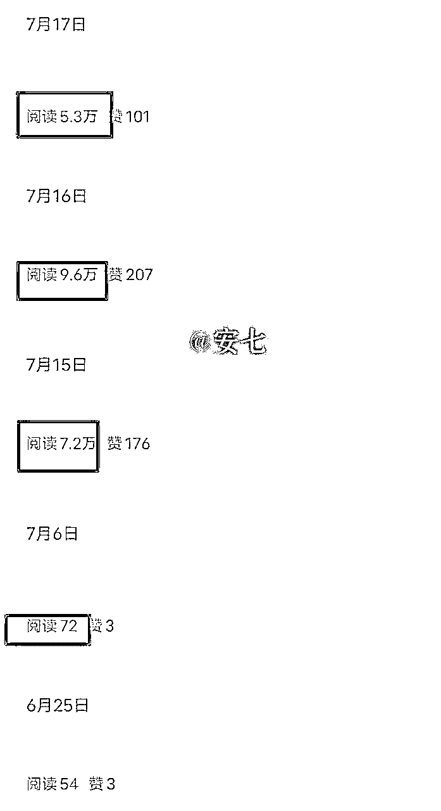
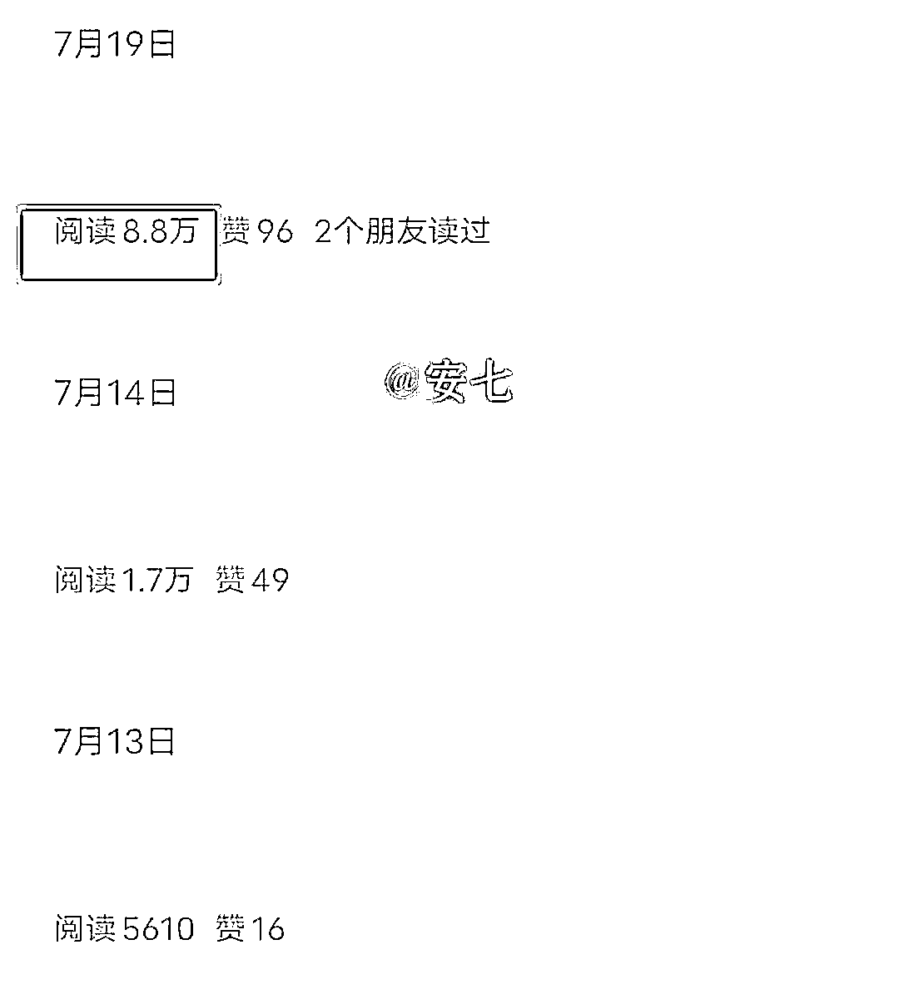
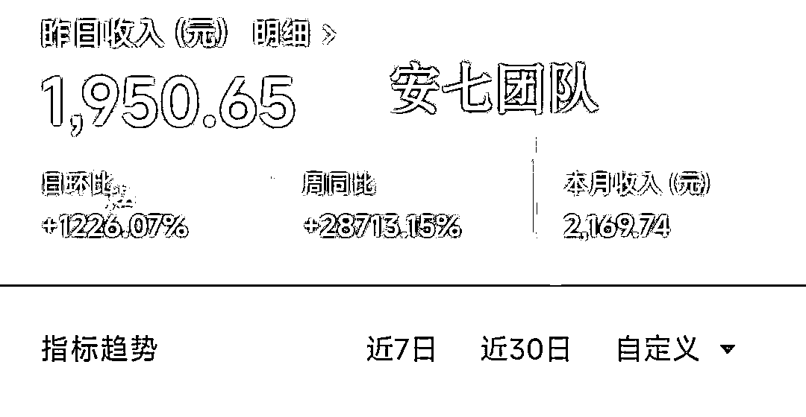
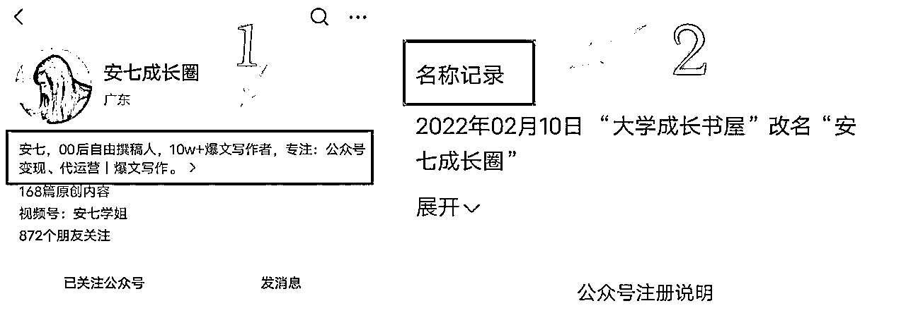
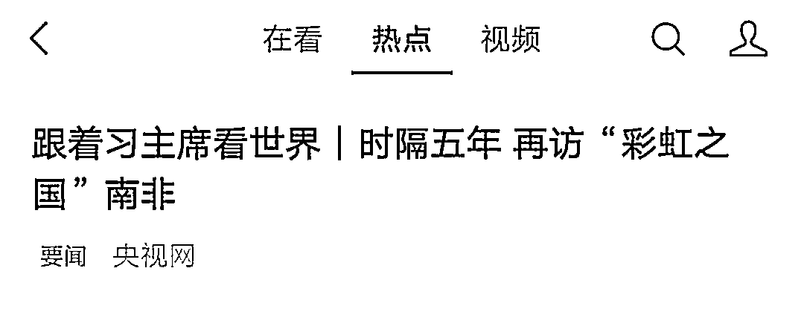

# 《教0基础小白写公众号爆文，25天写出5篇10W+、副业收益5000+的经历分享》

> 来源：[https://die28mmde0k.feishu.cn/docx/WO3ZdyKMBoYkBKxgfsccWsznnVc](https://die28mmde0k.feishu.cn/docx/WO3ZdyKMBoYkBKxgfsccWsznnVc)

大家好，我是安七

10W+爆文写作人

一个不断修炼身心的文字少女

大学经济独立

毕业链接百亿集团股东做天使投资人。

23岁，我开了一家公司，提供代运营服务

9月份带领学员开始实操爆文变现，部分成绩如下：

小白学员25天写出5篇10W+、一个月副业收益5000+；

更文7篇，3篇阅读量上万、1篇阅读量39W、2篇阅读量上千；

单篇阅读量39W、单篇变现1950+；

单篇文章阅读量46W+

……

加入生财也有两三年的时间了，说来惭愧，一直在划水围观，觉得大佬太多，自己实在是没有什么拿得出手的。

前段时间报名了公众号和视频号航海，但因为精力安排的原因没有跟上，不过在航海船上遇到了第一位客户，也是人生中的贵人，航海，超值！

再一次受到圈友鸡汤的鼓励，趁新的一个月刚开始一周，也给自己和同样在围观的部分圈友们打个鸡血。

有希望，有盼头。

# 一、为什么选择公众号爆文？

## 我的经历：

公众号爆文项目，听说去年就有圈友开始测试，但我7月份才开始接触到这个，算是偶然。

当时正好处在人生内耗、迷茫期，6月份大学毕业，又因为自己的状态原因，辞掉了之前的兼职工作，没有收入来源，整个人都处于一种十分低迷的状态。

没有收入来源，也没有想做的事情，干脆拿一朋友的号练练手，看看能不能把她的号“起死回生”。

如果真的做到了，会很有意思，没准也是自己能打的一个点。

想干就干吧。

但，写什么呢？看了一圈，决定写情感类的文章。

一是，之前有位老师对我说：“安七，我觉得你写情感方面的内容很有天赋”，加上两次投稿情感类都过稿，增加了这方面的信心。

二是，我观察过，原来写成长文的一位号主，转战写情感文，阅读量基本上篇篇上万。

我想：ta可行，为什么我不行？（但现在情感类的流量，没有之前那么多了）

开始哼哧哼哧写文。

朋友之前的公众号，144个粉丝，阅读量在20-50。

刚开始写情感文的时候，阅读量也差不多就10多个。

写了差不多10天，还是没有起来的趋势，都快放弃了。

但是！

就在我第二天打算放弃的时候，之前的那篇10多个阅读量的文章，居然飙升到上万了！

而且，在此后的一个月内，我写的文章基本上都是5位数的阅读量，当时最高的一篇是9.5W阅读量，差一点点就10W+了。

（10W+，对写文章、尤其是公众号的人来说，简直是一种莫大的激励。）

也就是在这个时候，命运的齿轮开始转动，我开始接触爆文、研究爆文规律。

我忽然意识到，自己写文章的模板框架、找同行爆款文章、对标拆解的方法，能不能【可复制】？

如果能，那就证明我的方法逻辑是可行的。

说干就干，我把自己实战总结的一套方法逻辑，用在另外一个公众号上。

那个号，是截然不同的领域，同样低粉。

没想到，把方法运用到那个号后，它也“活了”！

在只有10多个真实粉丝的情况下，实现了“低粉爆款”。

阅读量从几个、几十，变成几千、几万，最高的一篇，阅读量8.8W。

亲眼见到，流量主收益从一开始的几分钱，变成一天两三百，甚至更多的时候，我脑子里面开始闪过一个念头：可以用公众号流量主赚收益。

第一个月，还在跑模型的情况下，朋友的号赚了差不多3000块。

没有对比的3000块，赚的很开心、满足。

为什么选公众号爆文？

因为它：

## 1、不限粉丝数，低粉也能有高收益。

粉丝多少没关系，只要有500粉丝开通了流量主，就能写篇文章赚篇文章的钱。

而且阅读量和粉丝数没有太大关系，和能不能掌握爆款方法有关系。

## 2、门槛低

只要你有一个公众号，有500粉（不难，有渠道），会写文字，就可以开始赚钱。

## 3、变现难度小

开通流量主后，发布文章就有钱。

我的第一批爆款学员，都已经实现变现，没有0变现的。

目前最高变现是一个月5000+、单篇最高1900+，虽然没有生财圈友的那么多，但对旗下学员来说也很不错了，因为毕竟原来没有接触过这些，完完全全是从0开始的。

# 二、如何从0到1开始写爆文？

生财里面有很多关于“公众号爆文”的内容，很详细，很干货。

这里我就用 纯小白、0基础新人的视角来写，希望真的有帮助~

（如果有写的不对的地方，非常欢迎各位同行朋友评论指教~）

## 工具篇：

### ①注册至少1个公众号

（1人1身份证1公众号）

公众号怎么注册？

这是官方给出的教程：（个人）注册公众平台步骤 (qq.com)

PS：1人1个身份证1个公众号，如果想通过公众号赚到更多钱，可以找信得过的家人朋友，借他们的身份证开公众号。

事先一定要协商好的利益分配（最好是具有法律效应的白纸黑字），避免后续提现分钱了，因为利益不一致闹矛盾。

单个账号变现是有限的，多开几个，东边不亮西边亮。

细节：取名字的时候，如果不知道取什么，建议叫：是XXX呀。

比如：是安七呀，是彤彤呀，是鸡汤呀……

这样取名字，看不出来是什么领域的，但什么领域都可以用，而且还可以全网同名。

你的小红书、抖音、快手等等，都可以叫这个，你只要在简介那里写一句（全网同名），别人就能通过这个名字关注到你的其他账号了，方便引流

公众号1年只能修改2次公众号名字，所以尽可能不要浪费次数。

### ②完善简介、各项回复（参考同行）

### ③拥有500粉，开通流量主

（如果不想买粉，可以通过问一问自己试着涨粉）

PS：100粉只是能开通广告主，但广告主和流量主是不一样的，至少需要500粉，只多不少。

## 2.方法篇

怎么写爆文？

写爆款文章之前，我们先要牢记几个原则：

### 原则1：爆款都是重复的。

爆款都是重复的、爆款都是重复的、爆款都是重复的。

我原来写文章，总看不起那些“同质化”严重的主题、标题、内容，十分不理解：

为什么都同质化成这样了，阅读量还这么高？

于是另辟蹊径，自己写，费尽心思写，总想“一鸣惊人”，让自己的“创意”被看见。

但往往结果很不如意，市场没有反馈，讲难听点，是我自嗨了，读者和市场都不爱看。

现在学乖了，不自己闷头哼哧哼哧写了。

而是先去看看，有哪些爆款，是不同的人、不同的时间段写，还爆了的？

比如，我刚开始写情感号的时候，有一篇文章标题叫：xx恋爱周期表

这篇文章，就100来字，配上1张xx恋爱周期表

你当时猜别人写，多少阅读量？10W+！

后来，我又看到了另外一个号写这个，也是好几万的阅读量。

于是我也写这个，当初反应平平，现在看，有7.2W的阅读量了。

啥也没有，就一张表+100来字。

你说，哼哧哼哧写的干货，居然敌不过这样的文，是不是该反思？

还是这句“爆款都是重复的”

### 原则2：优先对标低粉爆款的同行。

一定是先对标低粉爆款，而不是有很多年、很多读者的老号、大号。

因为人家有粉丝基数在那里，不管怎么写，10W+都不是难事儿。

什么是低粉爆款？我们又看不到别人的粉丝啊……

#### 2个简单判断“低粉爆款”的标准：

判断1：它（公众号），是不是建立没多久的号？

如果是今年建立的号，大部分都是新号，粉丝数一般不太多

怎么看：

判断2：它之前的阅读量VS爆款的阅读量，相差大不大？

如果一个号，它之前的阅读量都是20、50之间，突然有一天，它一篇文章到达了上万

而且接下来还有几篇，阅读量超出平时很多的

那这个号，就是我们要找的低粉爆款号

### 原则3：一定是，找近期爆款。

前面2点，是要记住的，但这点，一定是要用上的。

就像那句：方法不对，努力白费

爆款找错了，自己模仿爆款写出来的内容效果，也会大打折扣

【近期】的意思是：（时间）最好是1-3天的，次考虑3-5天的，不要超过7天

【爆款】的意思是：（阅读量）最好是10W+的，次考虑5-10W，然后才是1-5W

#### 怎么找“近期爆款”？

主要是3个大的入口：

1.在你看完文章后，往下拉，会出现很多其他被系统推荐的文章。

2.在你看完文章，点赞、点在看后，文章下面也会出现其他得到系统推荐的相关类型的文章

（不要舍不得给别人点赞，你给别人点赞了，系统也能大概判断你的喜好，自动给你推荐同类型的文章

省去了很多时间，自己一个个找很麻烦的）

3.在微信首页“发现”—“看一看”—”热点“

这个里面也会出现一些系统推荐的文章，

如果你打开了“个性化推荐”，系统还会根据你的喜好，推荐你喜欢类型的文章给你。

建议大家都把“个性化推荐”给打开，避免后期大海捞针般，花很多时间去找。

前期找到方向后，一定是要【大量刷同行】的文章，后期系统知道你的喜好了，才会给你推荐。

并且一边刷，一边还要做个对标选题库，把人家的爆款文章收集起来，方便我们后期进行拆解。

### 实操：怎么写爆文？（爆款模板）

分享一个超实用的小白上手模板，我的学员就是通过这个模板，一个月写出了5篇10W+。

模板：开头+段落+结尾

开头：故事/金句/热点/场景描写 开头+点题

段落：每一段直接套这个公式：

小标题：

·名人名言/金句：

·相关例子

·自己的观点

·金句

·一句话总结：

结尾：名人名言/金句+点上面的3个小标题+一句话总结。

# 三、公众号爆文过程中踩过的坑

## 1.没有坚持

一般来说，一个号要想获得推荐，一般要写7-21天，但有很多人都卡在这个过程中。

公众号是目前新手为数不多的变现最快的方式之一，门槛低、变现快。

只要按照正确的方法坚持，结果一定会显化。

我的一位学员，是老号，权重比较高，他只写了3篇原创文，第一篇阅读量才2位数，第二篇原创文阅读量就已经上万了。

但他没有坚持，写到第3篇，玩去了，错过了爆款后的一个趋势。

所以公众号爆款文章，一定要坚持写，一天至少1篇，有能力，一天2-5篇都OK。

## 2.自己给自己点广告

不要自己给自己点广告，也不要引导别人给自己文章点广告。

流量主收益，一个是广告的展现量，一个是点击量。

很多人想钻平台空子，自己给自己点击广告，觉得这样收益会更高吧？

其实不然，系统会检测到，时间久了，它会判你的。

## 3.总是转发社群和朋友圈

这个是手册里面的内容。

总是转发到社群和朋友圈，固定是那几个IP、人看，系统检测到，还是会判你。

## 4.快捷转载键没有关

文章发布之前，一定要检查自己的“快捷转载”有没有取消勾选？

不要打开它，如果打开快捷转载，别人能快速转载你的文章

会分走你的流量哦。

# 四、其他

生财里面的内容和项目有很多，就像亦仁老师说的，在每一个细分领域做到极致，赚到100W不是难事儿。

虽然我目前还没有赚到100W，但经常来生财看一看、泡一泡，感受思维和行为模式的冲击，也价值巨大。

更重要的是，我通过生财，链接到人生中非常重要的几位贵人。

对于像我这样普通家庭出生、起点比较低的人来说，是需要现实世界付出极大成本、还不一定能遇到的。

虽然还是会觉得自己成绩有限，但已经找到了目前自己发展和在走的路，

一个是新媒体代运营，一个是公众号爆文变现。

只要走在路上，就一定会有不期而遇的惊喜！

感谢我的启蒙贵人@明白，大二的时候，有幸被明白老师带入生财有术，命运的齿轮开始转动。

感谢我的成长贵人@阿猫，遇到阿猫，让我误打误撞接触自媒体，看到人生更多可能性。

感谢我的人生贵人@张昭，张哥，在我毕业彷徨之际，指点迷津，战略布局眼光十分独到，其中的恩情，不是三言两语能够表达出来的！

感谢我的事业贵人@金杜—故里小姐，民宿女王故里小姐，低调的大佬，也是我的第一位代运营顾客。感谢故里小姐，在我刚开始代运营的时候，给了我代运营旗下公众号的机会。

哥说，我自带贵人运。

是的，我也是这样觉得。

好的圈子、社群，真的能达到“改命”的效果。

我既胆大，也胆小。

胆大，是因为敢于、舍得知识付费，又稍微带点“说干就干”“说走就走”的勇气

胆小，是因为在大佬云集的圈子，好像就缩起来了、不敢展示。

今天，就来把它打破！

第一次发言，第一次写生财的帖子，有点紧张、期待、兴奋。

如有写的不好的地方，还请各位圈友多多指教，感激不尽！

欢迎各位圈友链接~