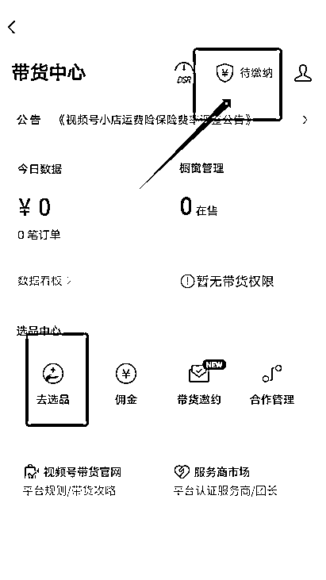

# 从零到一，电商小白快速上手视频号达人带货，拿到正反馈

> 来源：[https://xj6cuxsih3.feishu.cn/docx/Wn6ndZHTQoMBNAxi6pocqsE3nmb](https://xj6cuxsih3.feishu.cn/docx/Wn6ndZHTQoMBNAxi6pocqsE3nmb)

# 一、前言

大家好，我是易秋，今年刚加入的生财有术，个人自由职业，毕业后一直专注聚焦互联网项目，在20年的时候通过抖音小程序变现超40w+。

后又尝试各种项目并实操，也取得了一些成绩，目前全职视频号带货赛道，八月底跟着航海到现在，大概一个半月多的时间，gmv在10w+，纯收益的话 5w+。

很感谢生财有术，在加入生财有术的这段时间里，我感觉自己的成长是巨大的。感谢生财有术，让我看到了不一样的世界。

也感谢生财提供一个这么好的平台，可以让我给大家分享：做为电商小白，怎么如何去快速入手视频号带货这个赛道，并且短时间内取得成绩，实现从 0-1 拿到正反馈。

下面是几个主力账号的历史成交数据

# 二、视频号的泼天富贵

## 视频号的红利

a.流量红利

虽然没有抖音标准和稳，但是起号流量还是相对容易

b.利润红利

抖音行业比较卷，视频号普遍价格比抖音高1-3倍

c.人群红利

三四线城市和中老年触网少，信任度高，退换货也少

你可能会问，现在的视频号，不是已经有很多人入场了吗？

当初无知弱小的我，也是跟你一样，以为视频号的风口已经过去，不像去年随便搬运就能捡钱的样子，加上后来腾讯官方打击力度封号等严重问题，自认为可能现在入局对普通人来说没那么友好甚至是晚了。

后面才发现是我大错特错，渐渐的我在朋友圈看到很多好友都通过视频号赚到了不错的一个收益。

当这些信息反复在我的视线中出现，我慢慢就对视频号带货有了兴趣，借用王拾柒老师的话来说：任何项目任何赛道首先要先入局，入局之后才能在牌桌上，不下牌桌才能机会才知道下一步怎么做，于是我决定入场ALL IN 视频号带货这个项目。

## 理顺变现路径

今天主要就是给大家分享我做视频号达人带货的一个流程路径和经验。

那我决定做视频号带货，首先就是得先要弄懂视频号变现的一个流程，了解视频号带货的底层逻辑，这个项目的钱我要怎么赚到手，去判断可行性，设计出最短闭环，才不会像无头苍蝇一样。

之前看过盗坤老师的直播，我记得很清楚，他说如果你想做一个项目，先去把生财关于这个项目的帖子全部找出来看一遍，你就知道这个项目怎么去做了，所以当时我是花了一两天的时间去看各种关于视频号带货的帖子和航海手册，记录下自己认为比较重要的知识点，看完就对项目有了大体的一个思路框架。

在理清了视频号带货普通小白入场应该怎么玩，怎么实现从0-1把项目跑通成功取得成绩，了解具体的玩法和流程，我就开始进行了实操，因为我玩的是自然流达人带货，会比较适合新手个人的玩法，那我就直接进入主题。

这个玩法主要就是通过混剪其他平台爆过的品的素材，直接去重，然后发布视频撬动自然流带动直播间流速，有流量后再开播承接流量做转化，打低价高佣产品。

核心就是找到抖音快手得到过验证，取得大量结果，并且人群符合视频号人群匹配的品，再去找这个品对应的素材内容来混剪。

项目前期准备：找对标-->分析对标-->模仿-->实操路径

实操路径：

注册视频号-->养号-->交保证金开通橱窗-->选品-->选素材-->剪辑--->发布-->直播人脸实名认证-->直播

# 三、视频号冷启动

## 1.找对标

我觉得这是必须的，同行是最好老师，看成功的案例并且分析人家是怎么做的，这样我们能去进行模仿，甚至做到超越。

那怎样才能去找到类似的对标账号，如果你经常刷视频号，或者逛逛直播广场你就会发现有很多那种看起来不是很专业的一些主播。

直播场景没有很高大上，中间加了一些贴图，这些直播间就是同行的直播间，都是打的自然流，极致性价比低价的产品，这些品的佣金大部分都是 50%。

## 2.分析模仿

找到对标之后就要进行模仿，比如分析他的视频形式（混剪、图文、原创等）接着判断我们是否匹配，能不能产出一样的视频，还有模仿直播的话术（建议录屏下来然后整理文档）

三种常见账户的拆解

下面是目前几种比较主流常见的混剪二创视频类型：

a.硬广类：

比较直白，直接介绍推销产品

b.软广类：

通过一些软性的方式来间接地宣传和推销产品

c.剧情带货类：

通过搬运去重，在剧情中间插入广告来达到种草的一个效果，剧情流量相对比较大，但是转化会稍微低一点

还有一些其他混剪搬运的类型小伙伴可以自行去找（比如图文，解说10件好物分享等）

接下去就到了项目的一个实操步骤

确定好方向之后就是选品，找素材，制作视频，发布，看流量的增长情况，开直播转化变现

# 四、视频号操盘实践

## 1.项目总体路径

注册视频号-->养号-->交保证金开通橱窗-->选品-->选素材-->剪辑--->发布-->直播人脸实名认证-->直播

1.1 注册视频号直接在微信视频号入口发表作品注册即可

1.2 养号基本可以不用养，随便刷两条中老年人视频，隔天可以直接用来发布视频

1.3 交保证金开橱窗选品如下：

## 2.选品：选品定生死

2.1 把自己的账号养成一个带货账号

选品的方法很多，这里推荐适合新手小白一个最原始的选品方式，就是刷视频跟品，拿出一个单独的账号用来刷同行的视频，把自己的账号养成带货这类型的。

不管抖音，快手，视频号都可以刷，每天可以抽点时间刷一下，认为还可以的品就通过表格记录一下，然后再去分析筛选。

因为你账号形成之后，如果别人同行第一时间爆的视频，可能也会第一时间给你推送让你刷到，这样我们快速去跟就能吃到这波流量。

也可以到直播广场去找，只要封面出产品贴图的基本都是我们的同行，进去评论点赞互动，之后系统就会推荐同类型。把号养成后，一打开直播广场基本 80%都是这种带货账号。

目的：找到很多同行

意义：可以跟品、可以学习同行的爆款视频模板，说白了就是提升对视频号带货的感知能力

要求：号不是拿来做视频带货的，就是单纯刷同行的

同行是最好的老师。当你在刷瀑布流视频或者直播广场刷到同行的号，他的最早视频是 6 小时内的，并且这个品你在直播广场没见过就可以跟。

只要视频数据点赞评论转发高，直播间有真实互动，有热卖销量，同时视频类型你能搬，选品中心有这个品的，不要想直接上了再说，时间就是金钱。

我通过这个方法，在国庆期间起床后看到剔肉刀这个品上了直播广场，然后又是9.9有价格优势，视频也没有太过复杂，于是马上就跟上了这个品。

快速在抖音找到素材后剪辑发布，当时一个多小时打了7000多的gmv，这个品佣金比较低35%，利润2000+，再之后你就会发现整个广场几乎都是剔肉小刀这个品了，所以说时间就是金钱。

2.2 系统化选品逻辑

视频号的主要观看、购买人群，是 40岁-50 岁及以上，二三线城市小镇中老年为主。消费观念比较看重价格，追求性价比。

*   选品技巧一：便宜、极致性价比

选品的价格要便宜或者能突出极致性价比，比如说 9.9 的品，19.9的品，抹布，空调防尘罩，沥水架，19.9十包的调味料等

*   选品技巧二：新奇特、视频素材好

我们是搬运混剪靠视频流量引流的，而新奇特的产品本身拍出来的视频素材就有拉停留的能力。例如小滚刷秒变新手墙、栗子开口器，川剧变脸小玩具

*   选品技巧三：强卖点、解决痛点

以老人除味剂为例：老人年纪一旦上去了，身体避免不了产生一些异味，会遭到一些年轻人的嫌弃，然后除味剂刚好解决这个问题，所以不管是老年人自己，或者他们的子女都可以是这个产品的受众人群

*   选品技巧四：节日热点品、周期季节性品

比如之前的国货活力二八，国庆的国旗反光贴，冬天的泡脚艾草，牛羊肉汤包

2.3 使用第三方数据平台找爆品

用第三方数据平台快速找到近期趋势爆品和视频素材，快速测试，考古加，蝉妈妈等

## 3.素材的收集

找素材可以从抖音，快手等去找，通过放大镜直接用关键字去搜你想要的产品或者用图识别去搜，会出现很多之前发布过的带货视频，然后你就筛选你认为比较好的优质素材，可以点个赞或者收藏，方便下载下来混剪。

大部分人会用去水印的小程序之类的，这里我推荐小伙伴可以弄个猫抓的插件或者 IDM下载，我习惯一次性找到想要的素材点赞，后再进到自己的喜欢界面，直接用这两个去抓取下来视频，可以提高点效率。

具体下载方法可以到百度自行获取

## 4.剪辑技巧

剪辑是比较重要的一个步骤，去重一定要做到位，建议每一条都精细化剪辑，这样才能跑大流量。

找素材的时候筛选出爆款音频脚本，参照爆款的框架，黄金前三秒等，然后将多个素材分割混剪成一条全新的视频，变速，转场，添加画中画，滤镜，特效，贴纸的话可以在上下左右四个角都加上贴纸，只要不影响清晰度和观看体验即可。

•

## 5.视频发布

5.1 原创发布

建议有条件的可以实拍，比较考验选品能力，原创直接正常发布，只要品足够好跑起来大流量，出单都是非常猛，以下面两个账号为例，一场直播5000~1w单。

5.2 混剪发布

测试出好的品跟素材之后，就可以直接发布视频了，视频发布可以根据视频播放来观察，第一条视频有200播放就是正常的，后续补视频根据自己的规律，15分钟，半小时或者一个小时去补视频都是可以的，甚至三条，五条一起连怼发，不过现在有的视频推流会比较慢，有时会几个小时才开始推，可以随时观察视频流量的增长。

目前市面上混剪搬运有一大部分通过取巧方式来获得流量，当你去看视频号的直播广场你就会发现，广场上的有一部分的视频都是这样的（俗称卡封面，卡特效）。

卡封面主要目的是为了过系统原创视频检测，原理是你用视频号的拍摄功能拍摄出来的片段，被平台判定为原创视频数据，平台为了节约算力，减少服务器压力，不会再去做原创检测。

除非被举报过多才会重新介入审查。而卡封面通俗来讲，是替换视频片段，有点小 buff 加成，属于短平快玩法，有条件的建议仿拍或者实拍。

最重要的还是品和素材，其他只是辅助，技术方法只是一个放大器，主打一个心理安慰，你的素材是金子用了技术可以变成两坨金子，你的素材如果本来就是一坨屎，再多的黑科技只能让它变成两坨屎，能不能爆的核心还是品、素材。

## 6.上场开播

什么情况下开播：大部分我发布完视频都会看流速，如果播放量流速比较快的情况下我会选择开播，没有一个具体的数值。如果视频流量不好，可以持续更新一条作品来提高流量。

我基本是一两千播放量视频获得推荐的时候去开播，然后去拉拉时长，拉拉成交，如果直播间有人进入，有成交那么就会带动视频的播放！如果视频不跑了，直播间半小时都不进人的情况下，这种时候可以考虑下播。

*   直播方式

可以使用手机直播或者电脑播，开播之前需要过一遍人脸认证

*   手机直播设置

我目前都是用的手机直播，电脑直播设置大家可以自行研究

封面：可以放产品图片或者视频号头像，如果是产品图尽量不要有太多文字的产品图，万一这些产品图有违禁词，容易造成直播间被限流

直播主题：视频同款点这里，同款xx热卖中，如果用户刷到带货视频，会在右下角可以有一个直播呼吸灯可以进入直播间

直播画面参考：可以直接放一张产品图首图+文字（原价xxx，现在xxx ,工厂直销等）要有真人出镜，贴图主要避免没有样品的情况容易违规，如果有持续出单可以在美团下单同款买样品回来播

*   直播话术

可以去录制同行的直播间，分析别人是怎么播的，包括产品介绍，逼单话术，拉互动等，下面列举一些通用话术：

欢迎新进直播间的哥哥姐姐们，今天我们直播间产品正在做活动，工厂直销的一个价格，平时要卖到XXX，今天新号开播，只要XXX，想拍的哥哥姐姐抓紧时间去拍

咱们直播间都是支持七天无理由的，喜欢的哥哥姐姐都可以拍一单回去试一下，满意就留下来，不满意直接退掉，都是没有关系的

哥哥姐姐不要犹豫不要徘徊，犹豫徘徊等于白来，库存就剩最后三单了，拼手速拼网速，能拍抓紧拍，活动不是天天有，拍完就没了

卖低价产品时候不怎么需要塑造品的价值，因为用户都已经被视频种草过了，才进来直播间的。这时候只要反复强调这个价格很划算快卖完了，再不抢就没了，去让他们抓紧下单。

如果产品有高 sku 尽量去推一推高 sku，和他们说两个装比一个装更优惠划算，引导他们购买高 sku 的。

支持7 天无理由退换货，最后三单等这种逼单话术，并且时不时循环说拍了的哥哥姐姐们可以回来扣个已拍加急来增加直播间的互动数据和刺激在线观看的购买欲

## 7.账户库管理

另外建议大家都备几个账号，这点也是比较重要的，视频号太容易违规了，账号较多可以表格记录整理一下，账号的基本信息情况，包括是否违规，正常加热等状态！

# 五、新手十大常见问题

1.害怕直播怎么办？

答：你只要把话术写下来改成自己对应产品的介绍照着读就可以了，只要流量来了都能出单，而且视频号的叔叔阿姨都比较友好，只会问一些相关的产品问题

2.视频号没有那么多咋整？

答：自己前期可以搞五个账号，加上家里人的实名，最少都能搞到十几个账号

3.不能加热违规了怎么办？

答：因为视频问题导致的账号不能加热异常，可以发布十个原创视频，风景或者自拍都可以，然后去进行申诉，基本隔天就能恢复正常

申诉话术：亲爱的视频号工作人员，您好!我知道视频号是一个积极的正能量短视频平台，我很高兴能在这个平台上展现自己，我的作品都是自己辛苦剪辑的，我一直都很注意的，绝对没有拍什么违规的作品。

希望官方可以明察，及时帮我恢复账号流量，如果我有没有注意到的细节，也绝对不是故意的，我保证认真学习平台规则，努力去拍更好的作品，也会认真审查自己的作品再传上平台的，恳请官方能帮我再次审核，及时帮解除账号限制，辛苦了，谢谢!

4.一直不出单怎么办？

答：这个时候就是拼执行力了，每天最少三个号的去测试不同的品和素材，只要你选的品不是垃圾品，视频跑起来之后怎么都能卖出去

5.要直播多久，需不需要拉时长？

答：播多久主要看流量的情况，半小时出一两单，或者不出单，很正常。如果你的爆量视频的播放量一直在跑，直播间还在进人，那你爆量的机会越大，累了就找人替你播一会，家人朋友都可以，直到没有流量了再下播

6.限流申诉一般多久会有结果？

答：如果没有申诉的话快的一两天，慢的时候我最长的等了一个月，所以最好不要去等，同时起新号，随时有备胎，不然你会很被动，一等可能一个月就过去了。

其实你面对的也是大家面对的。唯一不同的可能别人就是有备份的号，每天都持续跟进，最后的结果其实就是在这里拉开了。多备几个号循环利用最大限度解决这个问题

7.要不要养号？

答：正常我都是当天注册新微信注册视频号，隔天就可以用了，可以养个一两天，把自己视频号刷成老年人群体

8.需要做数据吗？

答：没有必要去做数据，视频跑起来可以在评论区引导到橱窗和直播间

9.选品怎么找供应链？

你选的品基本大部分选品广场都有，可以直接去搜，或者你看同行在播这个品，你可以私信客服说你是达人需要带货，一般都可以联系的上，然后叫供应链给你专属定向，广场上的品最多只能到50%佣金，多了需要走定向，新手小白建议先跑线上佣金，线下结算有风险

10.重新起号，如果是注销7天后重新注册视频号，对流量有影响吗？

没有影响，除非特别严重违规处罚，可能会有连坐同一身份下的账号

# 六、一些心得

迈出第一步很重要，迈出去了就会有第二步，否则你会永远在迈还是不迈第一步之间犹豫不决

以上就是我做视频号达人带货一个多月来的一个流程和思路，运气占很大一部分，但是我想说运气是建立在你多发视频的情况下，小伙伴们可以做下参考。

视频号航海和续航我都参加了，航海群里每一次的讨论、高手分享和答疑，都让我收获颇丰，感谢各位教练的指导回答，特别感谢百万哥的指导帮助，还有领队蓝色眼镜，李诚教练，瑾糖大佬，纸壳大佬，睡飞老师，分享官Rice，热情的志愿者梁初一小姐姐

最后的最后，再一次感谢生财有术这个大家庭，对我的影响很深远，而这种影响，绝对不是立马能让我赚到多少钱这样。

而是润物细无声的，在这样的社群里，给了我们普通人一个机会，让我们有机会接触一些更好的项目，有机会去实操，去提升自己，最重要的是，能链接到一部分志同道合的圈友。

看到优秀圈友的分享，看到不一样的世界，看到另一种可能