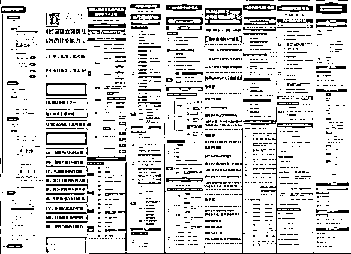

# 结构化思维赋能资料整理，实现高效调用、拒绝形式主义

> 来源：[https://n28vbku1px.feishu.cn/docx/WxJGdct2Fo4U0IxXwEucxSdKnlc](https://n28vbku1px.feishu.cn/docx/WxJGdct2Fo4U0IxXwEucxSdKnlc)

大家好，我是菲比，双一流工科毕业、中美双学位硕士，500强央企工程师，喜欢用结构化思维解构一切的INFJ。

前两天航海刚刚结束，很高兴我这个第一次航海的新人，在过程中收获良多。缺勤两天的情况下，共输出思维导图9张、精华帖11篇，资料整理航船累计积分排名第1。

文章在航海大群做过分享，现在简单修改一下也同步到星球来。主要与大家分享，菲比在资料整理这块，15年间所积累的经验、所改良的方法和一些发自内心的感悟。

文章分为三个部分：

*   资料用时方恨少，精准存放快速翻找

*   结构化思维赋能，更高效地调用信息

*   结构化计划复盘，拒绝无用形式主义

# 一、资料用时方恨少，精准存放快速翻找

我最近在搞装修，很喜欢一个博主叫“大怨种的收纳大法”，她的收纳理念就是：

收纳进柜的物品，必须没有遮挡，一目了然，并且可以方便自己单手、三步之内拿取。

这对我们做资料整理有很强的借鉴意义。

所谓“没有遮挡，一目了然”，就是我们在整理时，必须不重复，也不遗漏；

所谓“单手、三步以内拿取”，就是说我们在自己的资料库中需要搜索某样资料时，可以在点击三次鼠标之内，快速找到它。

那么做到这两点的关键，就是资料的分类方式。

要设计最适合自己的分类方式，就需要我们明确自己的“搜索习惯”和“资料用途”。

例如，此刻你刷微博，有一张ted演讲的拼图，你觉得说得真好，好想保存，应该把它归入什么模块内呢？

首先，需要思考这份资料的用途。

例如，我想在需要的时候，将它插入公众号文章里，那么它对应的模块就是“公众号-公众号图片-叉叉励志类”；如果暂时没想好，就可以存入“灵感-励志类”，类似如此。

其次，要按照自己的搜索习惯来定关键词。

例如，在我们想搜索某张ted 演讲的金句截图时，你能联想到哪些关键词？是ted、微博、图片，还是励志、金句、语录？每个人思考方式不一样，所设定的关键词也会不一样。

资料整理，不是把资料简单分类放入文件夹，让页面“看起来”干净整齐就好。

如果不仔细思考“资料用途”和自己的“思考习惯”，也许我们只会将它保存在手机相册里，或者躺在一个叫做“微博截图”的模糊分类里，等到要用它时，是非常难找到的。

# 二、结构化思维赋能，更高效地调用信息

那么，要做到有效的信息分类，就需要我们用结构化思维，去做信息的接收和输出。

我这几天在做结构思考力的读书笔记，有一些印象深刻的点：

## 结构化接收信息

资料整理的前期，是资料接收。在接收的过程中，提炼出关键点，再将它内化为自身的知识体系，是这份资料最好的归宿。

《结构思考力》中给出了三个明确步骤：

### 识别信息中的事实、理由、结论和观点

事实的堆积，会让理由变得合理，而合理的理由，又可以得出合理的结论，那么合理的结论，就可以反推出正确的观点。

### 找出事实和观点的对应关系，画出结构图

我们可以通过找观点、结论、理由和事实的这个过程，判断出信息的可信度和准确性，并分辨出哪些是关键信息和客观事实，哪些只是举例子或者主观想法。

### 用一句话概括提炼

这可以检验我们是否消化了这份资料，如果模模糊糊的提炼不出来，就说明我们还是没有分析好这份资料，还要回去继续啃。

## 结构化展示信息

我们经过思考、内化之后做输出，如果想让别人听懂我们在说什么，就需要动用横向和竖向的立体化结构思维。

### 纵向结构

每一级内容都会比上一级更具体、更深入，下一级目录的内容会支撑起上一级内容的合理性，从而构建出一个稳固的信息金字塔；

### 横向结构

平行的几个内容需要有一定的逻辑顺序，无论是并列还是递进，相同类别的内容，需要做到“不重复”“不遗漏”，让它所支撑的上一级观点无懈可击。

## 具体化应用场景

做完这些还不够，我们需要把整理好、消化完的资料用起来。同样的内容，应用在不同的场景下，所对应的主题和表达方式是不同的。

例如，你想推广、分销《结构思考力》这本书/这门课：

*   当面对企业高管的时候，就要说：

“结构化思维可以帮助你更高效地管理企业、让员工拥有更高的工作效率”；

*   但如果面对的是自媒体从业者：

就要换一种话术，说“结构思考力可以帮你构建清晰的课程内容体系，写课速度更快、质量更高，变现和引流速度更快”。

思考的资料应用场景越多、越具体，在你需要调用这份资料的时候，效率就会越高，能想到的方案也就越丰富。

# 三、结构化计划复盘，拒绝无用形式主义

把结构化思维带入日常生活，爆发力是极大的。例如我就迭代出了自己的计划和复盘模式。

我以前也做过很多无效的计划和复盘。例如把计划定得太死，把复盘写成心灵鸡汤小作文，对个人成长没有太大的意义。

经过几个月的实践，目前我给自己设计的计划和复盘模版，个人认为还是比较有价值的，可以给大家简单分享一下：

## 像玩“滑动拼图”一样，来做计划

*   列出今天想做的所有事，不分先后顺序；

*   把“今天不完成也没事”的事项删除，或最后待定；

*   把“今天不完成没事，但它对我有成长/积累意义”的事项标注为2；

*   把“今天必须推进，否则就要闯大祸”的事项标注为1；

*   把“立刻马上就要做完，没得商量”的事项标注为0；

*   把“虽然非常紧急，但可以拜托别人帮忙/完成”的事项标注为#。

我们都知道滑动拼图，是所有拼图块都在一个框里取不出来，只能推动滑块最终拼成。

做计划也应当如此。把多余的滑块先扔出拼图，限定住“必做”事项，然后按照重要性来分配剩余任务的时间，就像把滑块推向各自的位置一样。

对于#事项，将它们分担给别人去做，以节省自己的精力时间;

对于0-2事项，警报是逐渐解除的，我们需要按0-2的顺序依次完成。

这样确定好各任务的“地位”后，我们需要简单地预估一下每个事项的完成时间，确保在保证基本的娱乐和休息时间后，依然有充裕的时间来完成这些任务。

如果时间有超出，就需要重新思考任务的重要性排序，或切割，或脱手，或舍弃。

一开始这样做的时候，我们对自己的预估往往不准，很容易就高估/低估自己的能力。

当我们做久了之后，会对自己做某类事情的“时间”“专注度”有比较精准的把控，做计划的时候就会越来越轻松。

比如我，每天上班第一件事，就是查看邮箱，看看今天我有哪些工作任务，再思考一下今天我有哪些娱乐活动、健身计划等，接着快速列出今日事项，对它们进行排序分类。然后直接开干。

这样实践下来的效果非常惊人。

我现在每天的时间利用效率很高，基本不会有内耗，精神也保持得比较好，和家人朋友也不会因为事情多，而忽略彼此的沟通。

## 用Excel表格来做复盘，日拱一卒，厚积薄发

我最早的复盘，是一大堆心灵鸡汤碎碎念，得到的结果只是，我会常常沉浸于此、自我感动。

后来，我开始做公众号，在里面发周记，每周写一篇周复盘。虽然会分模块记录不同的领域，但文字的形式，还是很容易让人陷入“写随笔”的陷阱，更多时候用来情绪按摩，并没有太多实用价值。

后来我干脆用Excel做复盘。

周初做好计划，每天睡前填入进度，根据每项任务所达成的动作，分点写出成功日记和反思日记。到了周末的时候，表格填满了，我的周复盘也写好了。最后用语言一衔接，可以直接发在公众号里，简直美滋滋。

我目前的周复盘模板是这样的：

具体的内容列表如下：

一、月目标

1.月度目标To-do（用O表示）

2.月度关键结果（用KR表示）

3.月度目标进度（用百分比表示）

二、本周复盘

1.本周任务To-do（用O表示）

2.周度目标进度（用KR表示）

（1）如果是柔性目标，就进行打分,B-/A+等；

（2）可具象分析的指标，则用百分比表示

3.周度复盘-回顾原因

（1）成功日记。

疯狂夸夸+找到关键原因，把经验迁移、迭代。

（2）反思日记。

只反思行为本身，有哪些值得改进和修正。

4.周度复盘-心态及行为调整

重点思考反思日记的解决方案。

三、下周任务

下周任务To-do（用O表示）

这样的周复盘可以最大效率地放大“思考”的作用，让我们真正从复盘中获益，看见自己的优秀，也看见自己的不足，并有针对性地去进行改善。

至此文章就结束了。感谢生财有术航海，让我有机会去思考和沉淀这些年的经验，对我自己是非常好的一次梳理和成长。同时，也感谢本次航海我的领队亮亮和组长喜得，以及我的自媒体启蒙教练理白老师。

希望大家能够在生活中真正地运用好结构化思维，做好大脑的信息和思维整理，真正为自己的人生赋能。

最后祝大家中秋、国庆双节愉快！