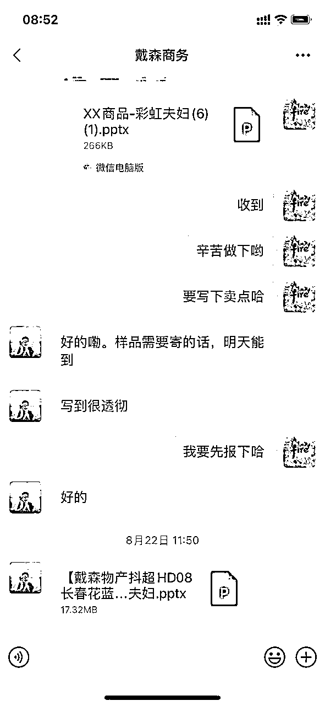

# 抖音抖店日销200w+经验分享及对抖音终局的思考

> 来源：[https://xxuqrz1ty8k.feishu.cn/docx/XYDwdGIAwoKjiRx8pGqckv4ansd](https://xxuqrz1ty8k.feishu.cn/docx/XYDwdGIAwoKjiRx8pGqckv4ansd)

大家好，我是王舒林，90后，重庆人在成都，全职做抖音

在生财潜水了半年，希望写的帖子能够帮助到大家！今年五月起盘做抖音抖店，单日最高销售过200w+，月销过1000w+

先甩几张数据图

# 单店单日最高数据（伊利锦歌专营店）：

## 单日各平台数据（抖音、拼多多、京东、天猫）：

主要分享内容：

一、抖音抖店实操经验分享

二、抖音图文+seo/超级主播切片/自播

三、复盘与总结——抖音的终局：打通自播/达播、短视频/图文，为货架电商服务

# 一、抖音抖店实操经验分享

抖音抖店有一定的门槛，尤其是对供应链及售后处理有很高的要求。单日200W＋，意味着当晚该品类主力达人都在带你的货，你的佣金和价格必须拉到极致，这种情况一般是清货或者冲抖音榜首才会去操作。

最关键的是你选的品在抖音有这么大的规模，核心还是在于选品

## 1、选品

对于选品，我的理解是结合自己的资源及自身的优劣势，选择适合自己的品，而不是随意跟风。

具体是选择自己能够拿到的有价格优势的货品，而且这个品在市场上被验证成功过的，能够拿到不错结果的。

（至少月销过万单才有比较好的机会，因为达人带货也会看抖音最近在给什么品类推流量，大概率只会带单品出单比较多的品）

举例说明：

### a、错误选品：圣牧有机牛奶（目前我这边在代运营，举步维艰），打开选品广场

点开销量，旗舰店月销最高3896，牛奶月销低于1万单，基本都是亏钱，说明这个品还没有被市场所接受。抖音是单品逻辑，一个单品月销低于2w，这个品就很难做起来

### b、正确选品：东方树叶，我月销仅次于官方旗舰店（顺便说一句：旗舰店太狗了，自己破价不让我们破）

我所操作的一些店铺：

#### 选品总结：

1、根据自身的资源去考量，当然也可以打开抖店后台电商罗盘看最畅销的品有哪些。关键自己能拿得到合适价格的品才是好品

2、抖音上拿到结果的品，没拿到的结果不要去碰，大概率是死（圣牧牛奶小杨哥、东方甄选、广东夫妇等大V都带过，但是都没啥用）

## 2、去掠夺同行拿到结果的“资源”

注：1、主要是去撬同行已有的达人资源 2、在选品广场站占位置（同行开多少佣金都要跟上，站在佣金率最高的位置，搜索会更高）

（重中之中，各个行业都很卷，说实话，在某帖子上看到“人无我有，人有我优”的选品逻辑，只能说是妄念。去同行抢资源才是唯一的机会，别指望什么蓝海，有蓝海也轮不到我们，结合自己的资源及优势，筑起自己的护城河）

具体操作，拿伊利牛奶举例

### a、去选品广场搜索竞品

如：伊利，看销量，找到同行对标伊利店铺（现在白奶很缺货，销量看上去一般，主要到年底了，都在做高端奶，预估国庆后市场正常）

### b、去精选联盟——达人广场——同行合作参考——搜索伊利——能带货的达人全部薅一遍

（有人说这些达人怎么会理我，记住你们对接的是商务，与商务搞好关系即可，称兄道弟，甚至送礼送钱，还可以给他许愿。比如我会说你来成都了，我会给你安排到位。抖音平台会抽达人佣金10%，可以沟通线下结算等，这个要去思考怎么去薅，具体可私下跟我交流，具体情况具体分析，总之投其所好）

### c、薅完同行达人

（还是有一定难度，但是你可以全部建立链接，不管是否带你的货）。我有朋友是做的达人矩阵，要求每个抖音商务BD每天必须给达人寄10个样品，现在手上有1万多个达人。我个人认为，只需要和中腰部建立联系即可，省时省力

建立联系方式，加微信——加不了微信/找达人介绍/关注他抖音，直播时刷礼物点赞控评等——最关键的是给达人提供好的货盘（我这边有同行的货品我也在帮忙操作，主要是跟达人建立更紧密的链接）——和达人做朋友（你只要有3-5个稳定出单达人就能稳住基本盘）

我这边还有一个找达人方式，就是当你链接爆了去和带过你货的达人建联。比如我家东方树叶，目前有25万达人在带，可以导表，把带过你家货并出单的达人记录下来（然后找带货不错的去建立联系——话术：你带过我家莎乐粮油专营店的东方树叶，可以给你降价提升佣金，做专属链接，通过率基本100%）

这样你手上的达人就越来越多，你的单量就会逐渐上升（达人是一种资源，能带东方树叶也能带其它饮料，累积的越多，你的单量就会越高）

注：做达人就是时间累积，下日日不断之功，每天添加即可。一个月、三个月，甚至一年，你手上的达人就成千上万了。我这边主要觉得短视频达人出货太不稳定了，还没来得及去深耕，逻辑一样，可以给短视频达人提供样品、素材，甚至可以剪辑好视频给他们分发，出单比较多的还可以投流支持

### d、积累头部达人

这个没啥好说的，花钱也要去做。除了出货以外，可以在给中腰部达人的手卡上降低佣金，并告诉达人是和小杨哥等超播相同机制，甚至可以说你的机制更好，这样可以调动他们的积极性（甚至可以让他们在直播间直接拿这个机制直播，测评转化嘎嘎香）

对接的大部分头部达人，其实让他们带货，基本都是亏，但是一旦链接爆掉，自然流成交基本可以把亏损挣回来，带货的达人也会增加

### e、做抖店真正挣钱的是自然成交

做达人直播其实利润都很低，一旦链接爆掉，有源源不断的自然成交，而且抖音是在推货架电商，平台扣点2%是直接免佣的。

这里建议尽量不要投巨量千川，目前来说roi打不平（高手另说），预估还需要1年左右时间对消费者的教育，现在教投流的都是骗子（我朋友测试过，高山脆萝卜干，月销八百万左右，自然成交30%，抖音萝卜干类目第一，投流基本没啥产出）

当然这里测试了一个小妙招，是我上周跟同行学的，可以同一个链接换不同主图和标题，抖音识别不出来，可以增加自然成交，我东方树叶做了15个链接，精选联盟基本是我，上周测试增加了1000单左右，这周继续增加链接。

补充说明:每天加达人这个是必须要做的，还有就是一定要抢占那种每天直播10小时以上的主播，即使是只挂车你的品，你的自然流也会增加（当然有自播更好，抖音的推荐机制就是先推荐正在直播的品），抖音的货架电商就不去赘述了，和做天猫京东拼多多一样，不断的优化搜索词和报名抖音的活动即可

tips：这边有很多圈友是达人，这边要是有需要，我也兼职了彩虹夫妇的商务，可以帮忙去谈跟商家洽谈更好的机制

# 二、抖音图文+seo/超级主播切片/自播

a、抖音图文+seo这个说实话做的很失败，但是还是想bb两句，图文也有航海资料，个人认为可以结合抖音seo去做，吃搜索流量，在红海中撕出一片蓝海

b、超级主播切片（辛吉飞切片，粉丝6.1万，三个月卖1000万—2500万，有条件的小伙伴可以去搞搞小杨哥等超播的切片，结合seo去做，外包大学生剪辑，便宜实惠，批量整，肯定能挣钱）

c、自播，决定要自播的同学要慎重考虑一下以下问题（我合伙人在做自播，可以说是如履薄冰，烧钱如流水，随时都有可能被千川投死）

1、投入较大（主要设备和人员，保守估计一个直播间五万＋，不算投流，猛的时候投流一天几万）

2、不是高毛利品很难支撑自播的前期运营

3、主播火了，很容易矛盾激化

4、主播成才率低，主播被封禁概率大

5、很费嗓子，主播的周期很短

注：稳妥的自播只有固播，可持续性强，人人可播，可标准化，目的为店铺服务，增加曝光，有一定的产出即可。

若跑出来了主播，可直接加注，需要前面的利润去支撑前期的自播

当然我这边有合作的达人，我认为他们自播方式是最科学的。就两人怼着产品播，一场可以卖20万左右，两个人同时担任中控、运营、主播及助播等角色。人力、设备投入成本低，产出很高，自播一定是低成本投入，不断迭代优化。高举高打的自播，99%都跌的很惨（比如我合伙人，一直cue他，是因为直播项目我投的很少，也算是小投入避坑）

# 三、复盘与总结——抖音的终局：打通自播/达播、短视频/图文，为货架电商服务

李嘉琦79眉笔事件过后，很多品牌方都在开始限制佣金了，比如农夫系列产品，佣金不得高于10%，不然认为变相低价，直接罚款

超级主播的佣金高的十分离谱，比如化妆品，可以给到50%以上的佣金（不含坑位费），提价控价是这些超播常用手段了，这种行为割了商家，也割了消费者，国家肯定是不允许的。

个人认为，抖音也会对大主播进行遏制，对佣金进行控制，当然这些都是推测。

但可以确认的事实，抖音的终局是货架电商——抖店，只是形式改变了，同传统电商的经营思维肯定是做不好抖店的。需要结合以下环节才能做好抖店。

## 1、无限的达人，达人就是资源，就是钱

当你的达人足够多的时候，你根本不用担心出不了货，这个运营达人是长期持续可做的，我这边就有好几个达人突然场均在线3万＋人数，一场可以带货一百多万，你占到第一顺位就可以去挣钱（前段时间我们同行有六万箱百岁山需要清理，我找到达人，提了1%佣金帮忙清库存，也是附加的收入）

## 2、稳定的供应链

要在抖店起规模，一定要有一个好的供应链，这边得感谢得到高研院让我认识了我现在合伙人，一年5个多亿规模的供应链，才能支撑现抖店的规模（必须得感谢得到张潇雨老师（以前看他在得到知识城邦发知识星球，我以为他想搞“诈骗”了，后悔晚加入了生财，真的是多踩了好多坑），是他的课让我入坑开始学习，在生财还发现了大神小马宋老师）

## 3、好又多的货盘

货不一定是要用自己的，记住这些事情都可以做的很轻。你要是没有达人需要的品的话，可以把达人介绍给你的同行，这样达人及你的同行也会和你建立链接，当你手上的供应链与货品足够多，你和达人的链接更深

## 4、顶级的售后

说实话，做抖店，我和我们的客服主管沟通最多，发货前后都得去规避问题，抖音服务分一下掉四五十分都是及其正常的，一不小心就干死了

# 结语：

多样的货品、达人及供应链形成一个正向的飞轮，由抖店来承接。有点儿Amazon飞轮效应的赶脚，18年听潇雨老师讲“飞轮效应”，现在也是用上了，每一个环节的提升都会带动其它两个环节的增长，从而增加抖店的营业额。

最后感谢 同学的监督、鼓励与修正，感谢生财的平台提供了太多精华帖子，让我在抖店上拿到了一定的结果。