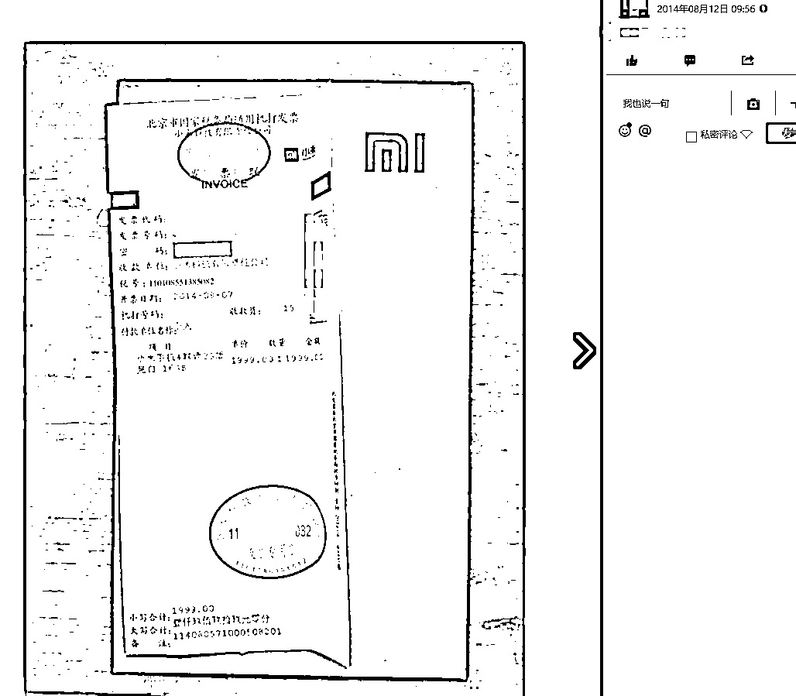
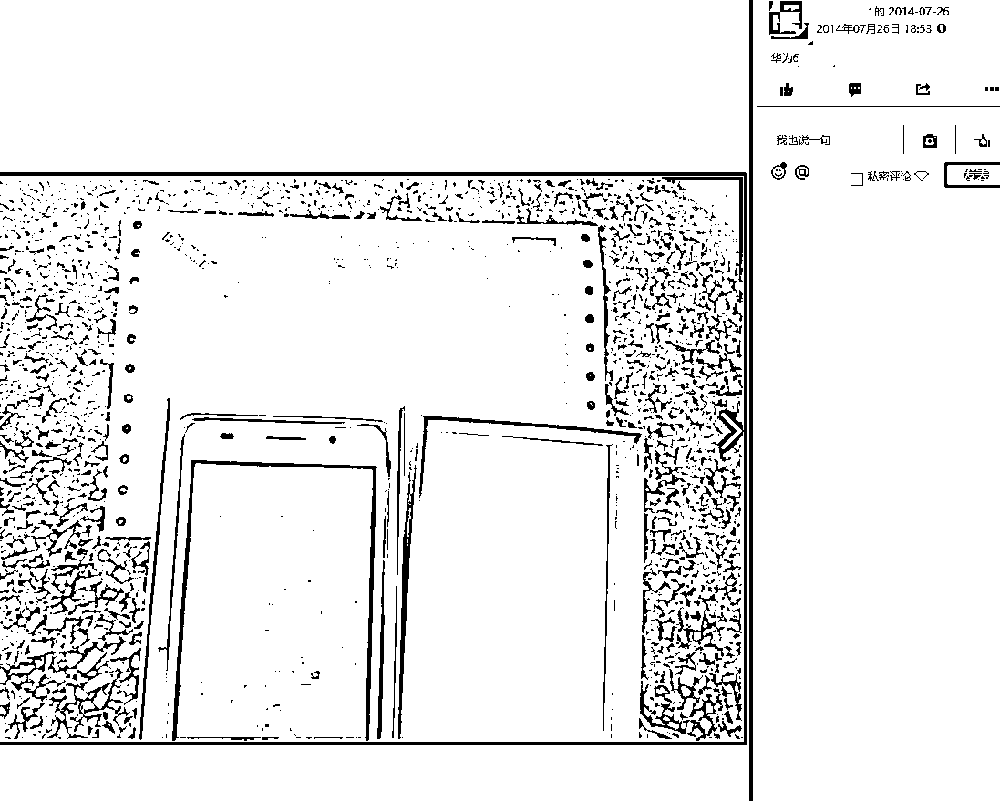
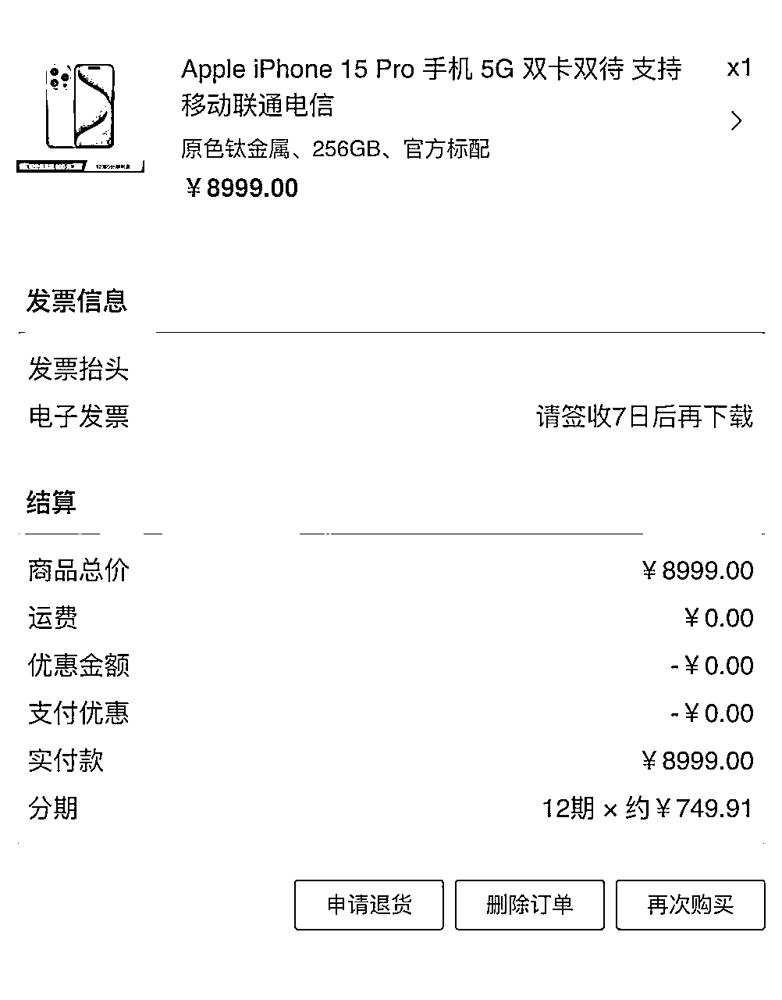
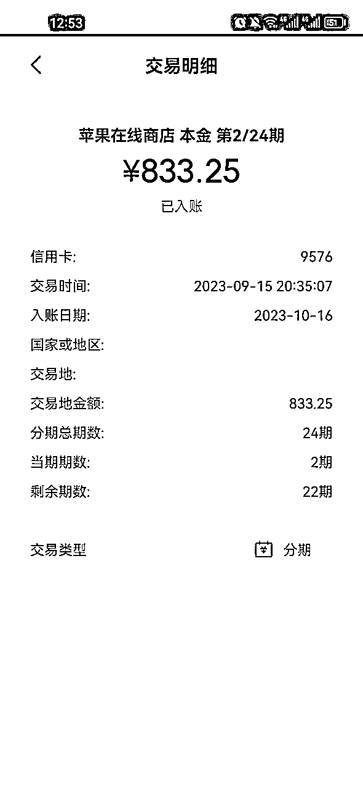
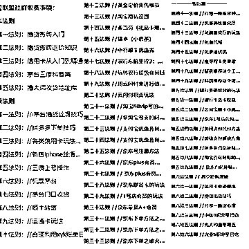
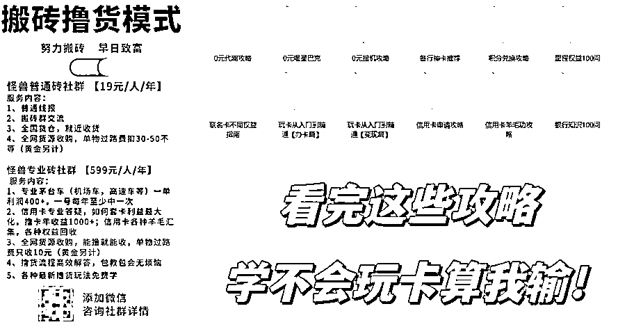
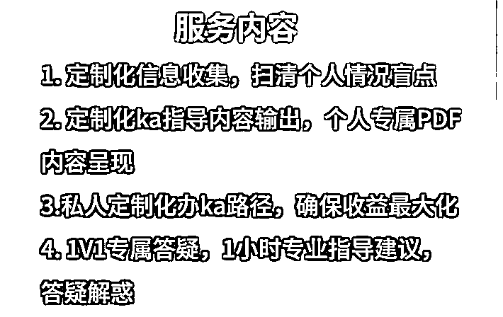
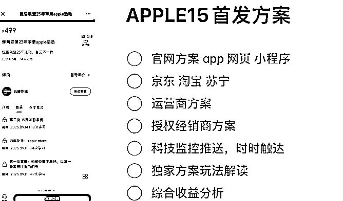
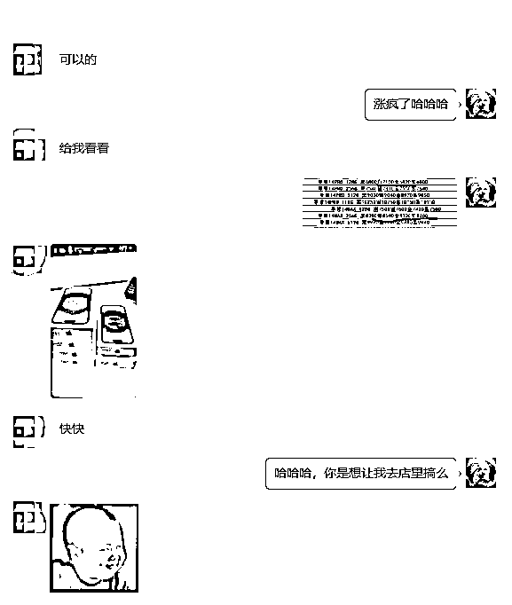
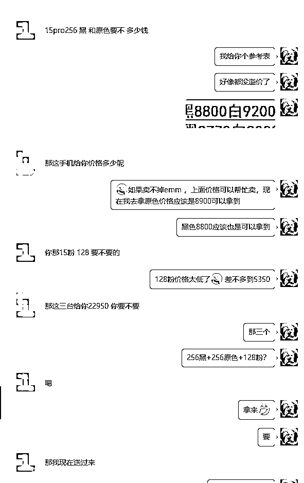

# 撸货行业二出三进，我才想明白这事情原来应该这么干

> 来源：[https://ci41bfsk3st.feishu.cn/docx/YmITdmb2fo3n9MxiJUPcNletnMh](https://ci41bfsk3st.feishu.cn/docx/YmITdmb2fo3n9MxiJUPcNletnMh)

大家好，我是小怪兽，过去一年时间基于撸货搬砖这个赛道折腾了一些东西，心态从“狗都不想玩“到”补贴家用系列的迭代升级“。本篇文章主要讲我对过去一年对于搬砖撸货这件事如何升级门槛和一些自我的尝试，如果你也在做撸货搬砖或将要做这件事，希望本篇文章能对你有一些帮助。

本文主要分为4个部分：

1、前几年的一些撸货经历和放弃的原因

2、重头再来，花时间去尝试

3、过去一年搬砖社群产品线的迭代

4、一些未来的想法

# 一、前几年的一些撸货经历和放弃的原因

13年，我开始尝试体验到，原来买手机转手卖掉竟然还能有溢价，初中刚毕业的我，已经尝到了做黄牛的第一桶金。之所以有黄牛（后续用搬砖词替代）的存在，是因为市场供需关系不平等，导致有人愿意加钱能买商品。

## 1、我是一个”勤奋者“

早期的搬砖生意更倾向于，是一个信息不对等小众群行业，没有像现在那么透明，随便百度抖音小红书微信搜搜，都能搜到一大把相关内容介绍。

之前的难，是抢到手机没地方销售的难

来自小县城的我，抢到一部手机出售的方法更多的是，能找到买家

真实顾客来源于：

1、周围同学（QQ空间销售）

2、家里亲戚朋友或者一些能爸妈的朋友。

3、甚至县城周边手机店上门推销。

在学校的时候还得惦记某天需要请假回家抢手机，抢东西。

这件事在外人看来，这初高中的小伙子上学的时候就有赚钱的头脑，”以后可了不得“

而这件事的落幕是大学时代的来临，以前的忠实顾客已经成年，可以自己去上网买手机了，大家的有支付工具了。

每一笔收益背后都有一笔帐，帐的成本是否能覆盖收益。

抢各种东西包含了我整个初高中生涯。也很不幸，一笔笔收益帐背后代价是高考毕业复读一年

## 2、收益与时间的ROI计算

淘客和搬砖其实是一个比较不错的补充，因为淘客的某些专项任务冲榜，比如某日完成电器销售GMV排名。

在大学期间也折腾了搬砖。

”单人“搬砖

在大学期间搬砖期间，也遇到了一个学弟，两个一起折腾搬砖。

早期的”百亿补贴“平台各种券是没有限购、砍单等等说法。

只时候只需要勤奋，特别在大学里面各种方式拉班里同学，社团同学，让他们帮忙购买。就能很容易的获取收益。

之后随着涌入人群的增多，逐渐的开始了限购，砍单，限购地区等等，让整个事情开始限制下来。

放弃的契机

大家遇到的痛，账号的领券限制，抢不到货了，一个新人入行到放弃，入行百亿补贴，放弃：无法下单百亿补贴。

信息获取途径的增加，大二的时候，可以拉着同学们去排队抽鞋，可以拉人去排队买茅台。而到大三大四的时候，同学们也面临着找工作的压力。

看似辛苦一天赚几百，但实际上，一天赚几百的信息红利不是常有，渐渐的自己的执着不再坚定，同学们忙于找实习工作奔波。

最后一个月算下来，收益四五千，但没办法每个月稳定赚四五千（不包含淘客），慢慢的产生了想放弃这件事的想法。

# 二、重头再来，花时间去尝试

当一件事遇到瓶颈的时候，你会选择

1、选择死磕

2、先放放，等新的契机

我选择了第二种，先放放，等待新的契机

## 1、契机--常旅客

在大佬直播间听到如果会一些知识，可以免费或低价坐飞机，随后我对这个关键词深挖得到的内容是：用xyk的积分兑换里程，里程可兑换机票。

免费兑换机票：消费得到积分->对应卡种->兑换里程->兑换机票

相对于我自己而言，这里有两个比较大的问题“没有稳定体面工作”和“没有固定资产”可能会导致我没办法下大额xyk

和我年龄相仿的创业者，这反而成了一个拦在门外的门槛。

## 2、契机--如何获取积分

经过一番折腾，有了xyk之后，去哪里消费或者买什么东西，成了我纠结的一个点

我自己的每个月花销组成：电商工作室采购+日常生活花销

其他人花销：日常生活花销

想大量消费想来想去，只有撸货能满足了。

## 3、契机--收益模型的转变，学会算账

之前我们经常撸货是指百亿补贴，或者大促的一些优惠券叠加，来寻找有利润的货物进行购买下单。

但随着平台的限制，百亿补贴开始会被砍单和限制购买

这里就出现死循环

不能购买->新号->不能购买->新号

入行也快，退行也快。

这里思维的转变，开始同时计算积分收益和货物收益

当积分收益+货物收益＞成本

那么 积分收益＞成本

货物微薄利润或者平走的状态下，账户就不会存在那么多限制，以消费为目的。

我们的惯性思维是，赚取货物的差价收益，这样面临的人群画像比较狭窄。针对的更多的是年轻或者副业人群。

## 4、人物画像--资金需求人群

月光族，做生意，很多人手上的现金流充足。

而这类人群又每个月需要去摩擦费用或者花销

线下小商店，很多商家都有机或者码牌，小商家与小商家之间都会互相周转。

这个人群画像，中间加入货，他们能节省不少成本。

## 5、人物画像--装修人群

今年你的新房交付完成了，需要一笔资金进行装修

1、家里给予支持

2、朋友之间借

3、向银行借

向银行借，正常情况下按3.51%进行计算，20w，贷款2年，利息总和应该是7500左右

如果折合成24期无息商品，那可简单的计算为消费20w可以承受7500损失，折合

”我买20台苹果，24期分期免息，亏200一台出都划算“

装修需求的画像：在一线城市上班族的刚需装修和大公司上班。随之目标人群开始变多了。周围同事哪些买了房要装修了。

## 6、人物画像--副业人群

很多宝妈上班族大学生，他们对副业的诉求，一个月能多赚一两千，满足生活中一些额外开销，就能满足。

## 7、人群画像--高级羊毛党

这里运用了高级羊毛党来描述以下群体。

人人都有占便宜的心态，而有钱人更喜欢占之前无法触达的小便宜。

比如加油200-50，海底捞优惠券，低价住万豪，接送机，等等诸多小便宜。

他们占小便宜的心态，更多的是体验生活。

基于以上内容的发现，开始了不停的折腾和迭代。

# 三、过去一年搬砖社群产品线的迭代

边做边想，慢慢迭代

## 1、产品--百问百答

之前如果做过训练营的小伙伴会知道，通常在做一个项目的时候，会遇到很多重复性的QA。

这些QA都有共同特性，由此可以整理一个百问百答。

产品的定位为引流款，如同加好友的秘诀”加我领资料“，

产品的定价涨幅逻辑：19.9每满10人涨10，封顶99

这里有一个提醒点，做一件事就要有始有终，切勿中途发现不赚钱，浪费时间然后停摆。

## 2、产品--进阶砖

做产品的思路是，引流款，福利款，高客单价款。一定要有新的产品进行衔接。

进阶砖的定位更倾向于所有权益的打包。

基于很多事暂时没有相通，不如先一股脑地打包扔出去，边走边看

产品逻辑：制定规则，给予大量的新鲜事物，判断能否上手

对于搬砖本身涉及到资金和算账，更多的是想让提升自我能力，或者这本身又是一个筛选的过程。

通过多个权益包打包，看能否有人玩的游刃有余，那么这可能是我想要寻找的人。

## 3、产品--1v1咨询

在引流产品运行中的时候，发现有的人无法把一件事自我组建成一个框架，更多的是碎片化的信息，没办法串联。

还有的人，很直接想花钱买服务。

1v1咨询来源于，xyk这件事，对于很多人来说，和用花呗差不多，但用ka赚取收益和下ka顺序。成为了很多人诉求问题。

根据痛点，解决对应的需求点。

## 4、产品--专项群和算账

每一个重大节日或者重大活动都有集中服务的意义。

比如618、11.11，苹果首发，每年就那么一次

假设按照学习周期维度

第一年，新手入行学习

第二年，熟练上手

第三年，学会算账和开始准备放大

第四年，开始放大

以上是我预估的一个时间线，想玩清楚这个事逻辑

1、时间的沉淀

2、集中学习经验

那继续衍生一个类似于”21天行动营”的产品尝试，目的缩短学习周期，集中操作。

最后实践下来，整体满足预期想法。

## 5、货物的迭代--常见货物

通常我们搬砖中常见的状态是，数码、酒水、美妆。

如果对其进行以价格带为划分

低价格带，通常几百元为主：美妆

中间价格带，通常价格在2k-5k区间：酒水和其他数码产品

中高价格带，通常价格在5k-10k区间：苹果

假设可以以消费为目的，对货物的利润依赖减少，可以补充一些权益。两者相结合增加来获取。

商品的选择就多元化了，不再局限于某几种商品。只要可以平走都可以考虑。

比如黄金

产品的迭代方向：诉求的转变，引导举一反三，也能自己去挖掘商品。

## 6、货物的迭代--经销商

在搬砖的过程中，还发现了搬砖不局限于线上，可以去线下门店寻找机会。

这里以apple授权店为例子。通常我们会遇到以下几种老板。

1、某一片区域的经销商，连锁apple授权店

2、以前就是手机店，后面有钱加盟了apple授权店

3、私人的apple授权店

4、随处可见的手机店

之所以把这个单独提出来，这个和之前的，一二线城市下货逻辑相反，这个三四线城市的授权店反而没有太多的搬砖人争抢资源

举个例子，小城市的apple授权店没有搬砖人光顾，想办法去创造机会

1、挖掘发现契机点

（契机点可以是指：有卖不出去的手机形成的库存压力，或者新机没有大量的消费者，需要高溢价出售）

2、寻找契机，判断是否有契机，无契机，创造契机（本质是发现对方需求，并且解决）

3、尝试建立第一次合作关系

4、创造回报契机

5、得到信任肯定

6、尝试谈判和合作

7、薄利多销，都有受益

本质可以理解为：客情关系的维护

## 7、档口资源和突破自我

可能在很长一段时间中，我们总是陷入一种奇妙的状态，把手上引以为傲的档口收货资源作为门槛和壁垒，然后在中间作为抽成，谋取利润。

换一个角度思考，我把我认识的档口所有资源给出去，以整体客群作为谈判切入点，角度的转变就不再是一个单项循环，可以成为是被需要。

也可以是他们站在一个平等角度去谈心，比如我们是以服务角度，服务的学员商品发货，我们可以第一时间段获取这个信息来源，从此来判断他是否是大量发货，判断供需关系加以佐证。

自我突破

我把搬砖这件事设想为这是通过服务来赚取服务费。需要不断地去研究新的门槛或者内容或者服务中所需的需求点。

通过体系化把看天吃饭，变为自己长期可持续的事情，从而形成门槛。

# 四、一些未来的想法

一直在不停的寻找新的门槛和迭代，或许是我处于一种焦虑状态，对于搬砖的出路迷茫，曾设想过很多走势，比如打包服务教学，比如做中间商，比如以另外一个项目加入到里面来。等等诸多的想法都曾去设想过。

做这件事的初衷是让身边小伙伴们，能快速拿到正反馈，从而开始积累自己的账号和设备，在之后遇到其他项目封口的时候，能迅速赶上，而不是因为基础问题犹犹豫豫，红利期过后疯狂拍大腿。