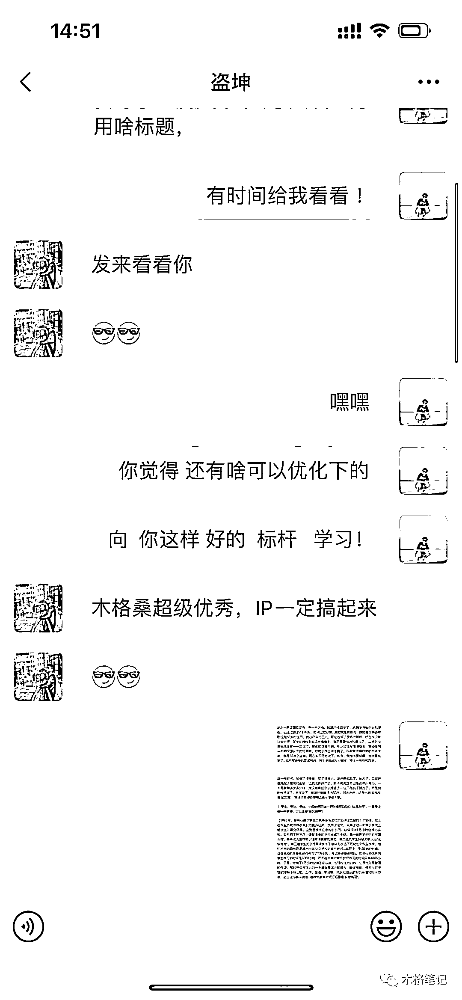
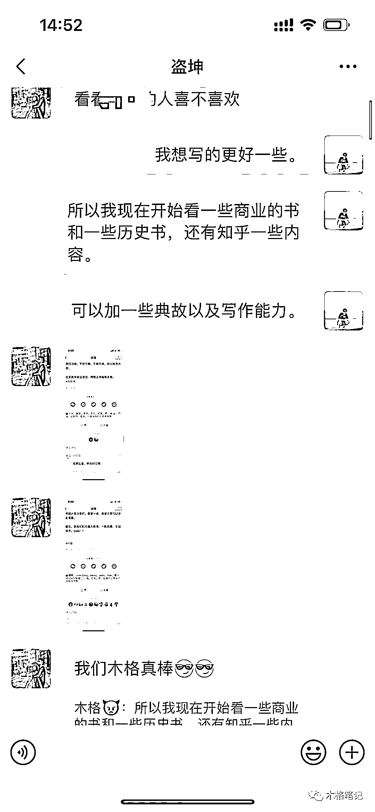
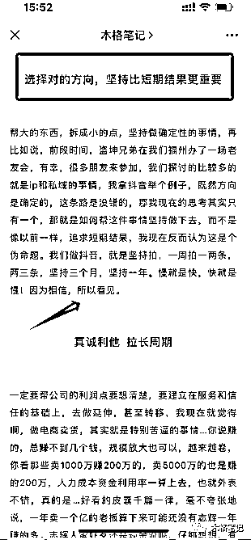
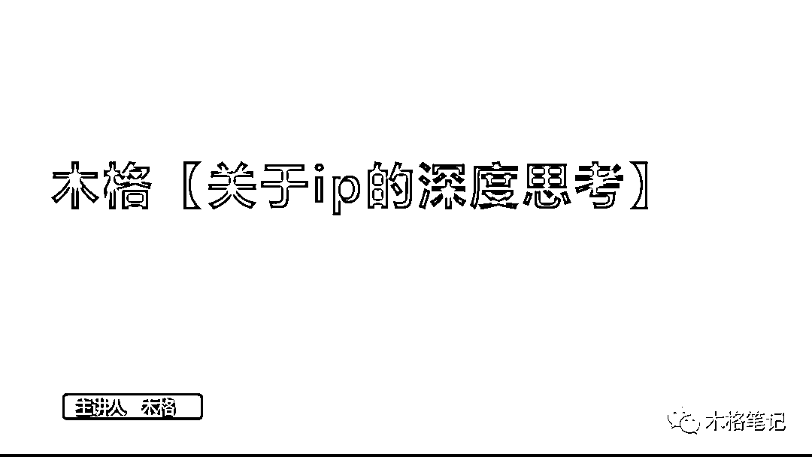
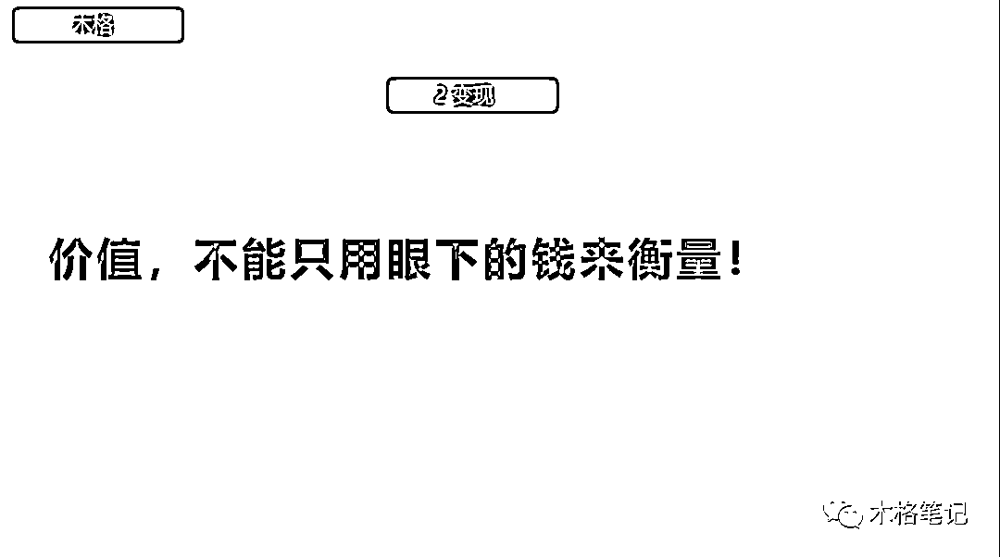
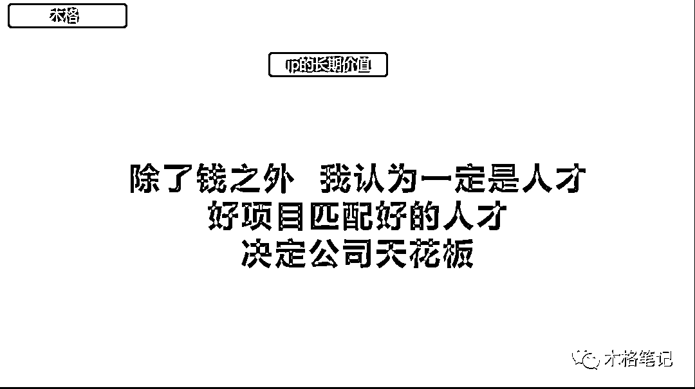

# 通过生财做了一年多 ip，变现几百万的思考复盘

> 原文：[`www.yuque.com/for_lazy/thfiu8/tpwyi3po65kpg6zu`](https://www.yuque.com/for_lazy/thfiu8/tpwyi3po65kpg6zu)

## (100 赞)通过生财做了一年多 ip，变现几百万的思考复盘

作者： 木格

日期：2023-10-07

生财的小伙伴们！大家好，我是木格，今天我想分享的是我在生财一年多时间通过做 ip 变现了 3 百多万，带来的长短期价值以及通过生财吸引到的一些合作人才！这是我今年最大的收获

​挺感慨的，曾经的我，只不过是一个赚快钱的人，哪里有风口，我就往哪里钻，只是现在我反过来了，什么事情有长期价值，我就全力以赴，时至今日，我做 ip 这件事，已经坚持了一年半了，我觉得很轻松，很快乐，也许这对大家来说属于难而正确的事情，不知如何下手，关于做 ip 可能我的想法和别人可能有些许出入，但**”万变不离其中“**，我想分享下，这一年多以来，做 ip 与我而言的短期和长期价值，以及具体应该怎么去做这件事情，做 ip 其实真的不难！难的是自己如何把握

很多时候，我们无法把控未来，但是我可以尽量做好当下，那我认为，这就足够了，当下的小事一步一步做好，未来的大事自然就成了。经历很重要，碰壁很重要，多去做难而正确的事情，多去干同行不愿意做的事情，总会开花结果。**我帮做 ip 这一年半以来宝贵的经历，分享给你**

接下来 我按照以下几点和大家深度解析，什么是 ip，什么是真正的个人 ip，什么才是真正的长期价值【个人观点，仅供参考】

1.  **1 初心**

2.  **2 定位**

3.  **3 变现**

4.  **4 长短期价值**

5.  **5 因为相信，所以看见**

**初心**

时间回到去年六月，那会儿的我，有些许迷茫，去年疫情，我身边的好多朋友都过的也不是很好，视野也比较窄，当时圈子像是流行一句话，怎么形容那种感觉呢，关系不是很好的都很牛逼，关系非常好的，会和彼此掏心掏肺的实际过的都不是很好，实话实说，当时确实是这么一回事儿，现在回过头看，还真是圈子和视野的问题

我做 ip 其实最初的原因就是因为盗坤，咋也是特别特别好的兄弟，还有志辉，几年以来，我看到了他飞速成长，不管是财富上，还是认知上，都特别特别优秀，进步很快，想想我们刚开始认识那会儿，我还在做抖音小店，他还在做淘宝蓝海，那会儿我看他直播，颠覆了我的认知，他的粉丝极其拥护他，这也说明，他实实在在的产生了一个 ip 的价值，去引导大家去做正确的事情，我想这就是初心，几年以前，我们做电商那会儿，实际不是这样的，我看到的和我想的不太一样，不管是变现还是长期价值，都颠覆了曾经的认知

我之前也经常会刷生财，包括看一些精华的文章等等等等，我就想，这些东西其实我也可以做呀，我经历也不少呀，我能分享的也很多~那为什么不去好好试一试呢？

**在做 ip 这件事儿上，坤桑帮助了我非常非常多，包括一些笔记，一些思考，都是实打实的干货，但其实简单概括就一句话，不忘初心，保持真诚利他！**

**‘我刚刚翻了翻，这是去年 2022 年 6 月的聊天记录了‘**

前几天我们的线下训练营我也单独的分享了做 ip 这件事情的见解与做法，我想说说我当时的处境，开头有说，我的看法和其他人不太一样，我一开始其实根本没有啥变现产品，你说天猫吧，门槛那么高，根本不合适，其他一些很快的东西，赚快钱的，也产生不了什么长期价值，所以我一开始其实就是为了做而做，因为相信，所以看见，仅此而已，为什么我会强调这个事情，我想表达的是，这个事情，你明知道他是对的，那就去做就好了，为什么一定要有变现产品，为什么一定要有后端，等等这些，只要是对的事情，咋们先做再说，我不知道别人具体什么情况，反正我就是这么过来的，其他的缺啥补啥就好了，就算没做起来，也无所谓啊，就当记录生活了，那也很宝贵啊！

做 ip 这件事，并不是缺啥不可的，**核心的本质应该是你能坚持下去，长期有效的输出，你的认知，要真正能够对别人有用，不断产生价值，不断提升自己**，这就可以了，当自己足够好的时候，该放量放量，该付费付费，并没有多难

**定位**

搞清楚初心，那定位其实就很简单了，足够了解自己，了解自己真正能产出什么样的内容，能给大家提供什么样的帮助，这句话听起来很简单，其实做起来蛮难的，我做抖音之前也踩过一个坑，就是为了一些表面短期的数据，去刻意的做了一些如今看来很傻逼的动作

我举个例子，我之前会认为，抖音不稳定，抖音的人群质量不高，不如知乎的，不如知识星球的，不如公众号的，很多人也是这样讲的，现在我不会这样想了，说白了，其实就和内容有关系，我他妈我自己以前产出些什么内容，什么抖音小店如何月入 5 万，什么小红书月入几万等等，我不是说生产这样的内容不行，而是你持续产出这样的内容，会有很大的问题，做个人 ip，是要让大家认可你，而不是项目，项目是不可控的，是多变的，只有自己才是不变，才是绝对可控的

说白了就是 生产什么样的内容，吸引什么样的人，你天天嘴上挂着 XX 赚多少多少钱，你只会吸引一群低认知的小白，我思考过，难道看知乎的人，看星球的人，看公众号的人，难道不玩抖音吗？不是的，肯定也会玩抖音，那怎么能说抖音人群质量不好呢？后来我明白了，不是人群不好，是你的内容不好，你的选题和文案不够好，你可以多分享一些创业经历，分享自己踩过的坑，分享自己遇到的问题，管理，财务，人生感悟，今日份思考，这些都是很好的

**我想，说到这里，大家应该能理解我想表达什么意思了，第一，初心不变，第二，持续输出有价值的内容，真正能为创业者产生帮助的东西，这是本质，有些道理其实蛮简单，回归本质！**

**变现**

变现这人看个人了，我反正还蛮佛系的，做 ip 变现肯定是需要的，只是周期，时间长短的问题，不赚钱怎么可以，除了这个，**我更想说下基于我这一年以来，带给我的短期价值和长期价值**

首先第一个，拿短期价值来说，这一年半以来，变现做的其实算比较少的，大概半年一次吧，我朋友圈助理号啥的基本发的内容还是和创业相关的，很少会去晒项目数据，但尽管如此，我们到目前的变现金额也达到了小几百万，虽然不多，但是也是实打实的，那如果我帮这个频率拉的更高，我一个月一次呢？那就是完全不一样的效益了。当然这是眼下的收入，我们要帮目光放到未来

我总是提到，如果是做 ip，那就是先自己足够优秀，再输出有价值的内容，项目也是如此，项目做的足够好了，再去变现也完全不迟，如果我帮目光只是放在短期的培训上，那我的自营就会受到影响，就体现不了长期价值，我的战略就会出现问题，我就没办法做深度了，所以在项目上，**拿大健康板块来说，我的策略是，先帮项目不断做深度，做的更好，在运营，在选品，在推广，在供应链，在人才上面做深度，**这些东西做成型，没有个一两年肯定是达不到的，我不想去做太多的项目变现，我想帮一两个事情能够有机会做的真正足够好的时候，那到时候变现也不迟呀！因为变现其实对于 ip 而言是可控的，但是项目能做的多好是不可控的，在这里，我选择了去做难而正确的事情，先帮事情做好，以后变现的机会多的是，项目都没了，最后什么都没了

再说下长期价值，我为什么不频繁去做变现和这个也有非常大的关系，熟悉我的朋友应该知道，我年初招募了一批项目合伙人，虽然到现在为止，就留下了几位，但是他们产生的能量，氛围，是大家无法想象的，那种齐心协力的感觉，俗话说，人心齐，泰山移，就是这种感觉，我清楚的知道，优秀的人才是无价的，所以我想表达的是，**ip 的长期价值，就是能够吸引到人才，吸引到认可你的人才，项目的本质是人，很多项目做不好，其实都和人有很大的关系**，这就像资本去做投资，往往也是看这个创始人，人第一位，项目第二位，所以说，光这一点，就非常值得我长期坚持努力去做这件事情！找到好的人才，产生合作，共同为美好的明天而努力，我想，这真的是我想要的东西，真诚待人，双赢！

**先相信再看见**

**落叶归根，从群众中来，到群众中去，渔夫出海前，并不知道鱼在哪，但还是会选择出海，因为相信会满载而归，很多时候，选择了才有机会，相信了才有可能**

我给大家总结一下我自己做 ip 的路径，希望对大家有用

**第一，**保持初心！我反复强调这一点，真的非常重要，这就像一个人，如果连基本的诚信都没有，人品有问题，那这个人再牛逼，再有能力也没用，所以一定一定要！**”保持初心“你若花开，蝴蝶自来！自强则万强！**

**第二，**有没有变现的产品我认为不重要，重要的是先开始，因为相信，所以看见，答案有时候已经摆在那里了，不要犯贱，想东想西，先去做再说，**上路就会有答案，上路就会有同行者，上路就会遇到贵人，遇到天时地利人和！所以！去做就好了！**

**第三，**自己要真的有东西，别瞎猫碰到死耗子，**自强则万强，哪怕你初心再好，你没有经历，也是没用的，**这里对应的就是内容，如何产生有价值，能与大家共鸣的内容，我想，你应该好好思考！

**第四，**变现，看个人，当你枪里没有子弹的时候，你频率可以高一点，当自己手里有足够的余粮时，你可以不用着急，**先帮项目做的更好，帮变现放在未来，放在人才身上**

**我虽行过死荫的幽谷，也不怕遭害**，基于我自己而言，我的 ip 并没有做的多好，也就一般般，或者说非常普通，我做这件事情也真的不难，我只是帮我平时写在思考里的东西，同步过来，我写文章的频率也并不高，一个月也就一两篇而已，写一篇文章也花不了太久的时间，也就三四个小时

别帮 ip 想的那么难，困难的事情，完全可以简单化，就说写文章这个事情，完全没有要求，自己心情好了，想写就写，有灵感，有好的认知内容分享的时候，就记录一下，真的很简单！千万不要说 一天更新一篇内容 一周要怎么怎么样，我做这件事情的时候，没有什么目标，因为我清楚的知道，坚持下去，比短期拿到结果更重要！如图，我在前几篇文章也有说道

好了，这就是我做了一年多 ip 的复盘思考，真诚！真心的希望能够帮助到大家，**与此同时，我也整理了一份关于 ip 分享的 ppt 文档，有需要的大家可以参考下哈。**里面更详细的拆解了我对 ip 的理解以及详细过程，包括接下来我要去做抖音，我具体会怎么去做，关于定位，内容，文案，选题，下限，稳定，再从大点的角度来说，产品，流量，销售，转化，稳定，价值等等，基于这些的详细内容分享！希望能够真正的帮助到大家

**‘需要完整 PPT 的评论 1 就行。后续我发给你’**

最后，发自肺腑的分享一句话给朋友们！

**坦率的说，当下赚了多少钱，真的不重要，未来的长期价值才是最重要的，比这个更重要的是什么呢，是你做的事业，你自己是否是满意的，并且呢又是光明磊落的，这才是真正的长期价值！**

* * *

评论区：

花天卓 : 好项目匹配好人才[强]
郭耀天 : 1
快印老司机唐应群 : 1
徐欢 : 非常认可你讲的👍把眼光放长远，人比钱更重要
小花 : 1
小花 : 1，向大佬学习
黄紫 : 1
KiteQi : 1

* * *