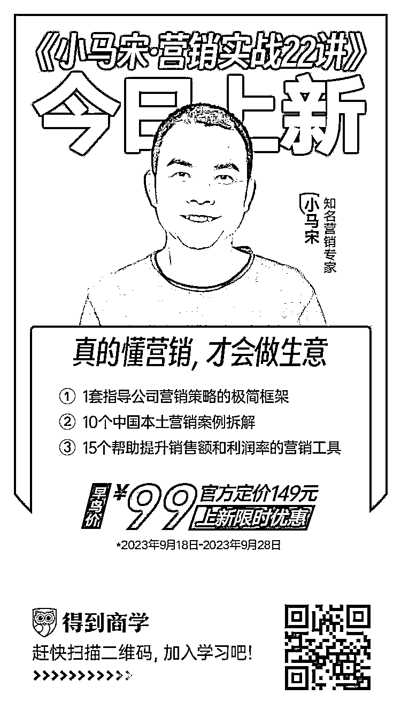

# 服装就是一种高明的政治，政治就是一种高明的服装

> 原文：[`www.yuque.com/for_lazy/thfiu8/ogh91acvvgfhm45e`](https://www.yuque.com/for_lazy/thfiu8/ogh91acvvgfhm45e)

## (47 赞)服装就是一种高明的政治，政治就是一种高明的服装

作者： 小马宋

日期：2023-09-28

服装就是一种高明的政治，政治就是一种高明的服装

前几天在读书群里说起，每个人都有模仿对象，每个大师背后都有老师，今天就给大家介绍几位创意人中的顶级角色，也是我早期的模仿对象。

第一个给我震惊的是尼尔法兰奇，当时看到他写的文案，可以说给我带来了生理性震撼。

20023 年，我还没进入广告圈，只是一个向往广告的人。不过我在一本杂志《地产观察》工作。

我的老板找了一位创意大神，叫蔡仕伟，他原来在奥美工作，是个台湾人，设计出身的创意总监，也是中国第一个获得金铅笔奖的设计师。在当时已经是稀有动物。

找他来是因为一栋别墅，总共只有五栋，占地 600 亩，在北京是顶级豪宅，需要写一本楼书，老板让他做设计，让我做文案。

蔡仕伟当时给我拿了一份文案，让我体会一下奢侈品写作的感觉，那就是尼尔法兰奇给金牌马爹利写的长文案。

我第一次见到那种文案，感觉打开了新世界，后来那篇几百字的文案我几乎都能全文背诵。

后来我找到一份文案工作，第一个任务就是给宁夏红枸杞果酒写介绍的视频，我就是直接模仿了金牌马爹利那一篇，而当时客户纠结了几个月的解说词，一下子就通过了。

法兰奇原来是个街头小混混，后来在西班牙海滩上靠钓富婆为生，还拍过三级片，最后居然成了奥美的全球创意总监，可谓传奇。

他的文字杀伤力太大，每一句都让人惊叹。

他想写你的生活有多悲惨，他写到：生活是一个婊子，而你又娶了一个。

他写皇家芝华士，他能写出让你恨得牙根发痒的文字：

这是皇家芝华士的广告。

假如你还需要看瓶子，那你显然不在恰当的社交圈里活动。

假如你还需要品尝它的味道，那你就没有经验去鉴赏它。

假如你还需要知道它的价格，翻过这一页吧，年轻人。

我曾经模仿过他很多写法，他的作品集就是一个创意宝库。后来大陆要出版他的创意作品集，当时出版社邀请我出面翻译他的作品，而且还安排了与法兰奇的对话机会，但那时我因为太忙，没有接这个活计，也是一生的遗憾。

如果你想了解法兰奇，可以去买那本《文案之神》。记得要买赵宁翻译的那一本。

当然关于法兰奇作品最好的翻译，我认为是一般盗版书《neil french》，可惜没有卖了。

第二个创意人，是乔治路易斯。

这家伙应该是美剧《广告狂人》的原型之一，是个疯狂的创意人，也确实有点疯狂，我记得有关他的好多段子。

其中一个是这样的。

当时路易斯给一家加油站设计了一个 LOGO，这个符号很像是一个路标，就是带个箭头指示的那种。

后来甲方的某位客户提出异议，他说这个符号看起来让人想起男人的生殖器。

路易斯的回答很有意思：我不知道你那玩意是什么样子，不过我知道我的肯定跟这个不像。

他回顾自己广告生涯的作品，是《广告的艺术》，还有一本书叫《蔚蓝诡计》。

他是艺术指导，所以并没有文案流传，但他对广告的策划如有神助。

第三个广告人，是霍普金斯。

霍普金斯与乔治路易斯完全是两类人，乔治路易斯说广告是艺术，不是科学。

而霍普金斯却写了一本书，叫《科学的广告》。

霍普金斯是大卫奥格威的精神导师，是拉斯克尔最欣赏的广告人。而拉斯克尔最为人熟知的故事，就是西奥多罗斯福的一句话：不做总统，就做广告人。这句话里的广告人，指的就是拉斯克尔，据说他应该是史上最有钱的广告人。

拉斯克尔是 FCB 广告的创始人，后来他受到西奥多罗斯福的邀请，出任美国的宣传部部长。

当然这个罗斯福，不是我们熟知的那个二战时期的总统富兰克林罗斯福。

霍普金斯认为广告是一门科学，他是优惠券的发明人，那是在一百多年前。

霍普金斯强调数据和科学实验，他那时候邮寄广告单页，会通过不同版本，先发几千份广告邮件出去，看看电话反馈和回信概率，再决定广告的版本。这就是今天互联网常用的 AB 测试方法。

第四个人，是许舜英。

我在广告公司是从文案做起的，当然会对文案关注更多一些。

而能找到有记载的成体系的文案作品的广告人不多，包括法兰奇，伯恩巴克，他们都有书记录。其实奥格威的系列作品流传下来的并不多。许舜英的作品，是通过网络流传的，而且她的作品量巨大，就像她自己的一篇文章标题那样，叫《大量流出》。

她最出名的是中兴百货系列，她也是李欣频的文案导师+老板，但李欣频的文字，显然没有许舜英深刻。后来地产圈里有一家著名的公司，叫揽胜，风格中也能看到一些许舜英的影子，而创始人杨海华是一个摇滚歌手。

摘几句她的文案：

服装就是一种高明的政治，政治就是一种高明的服装

因为新衣服的缘故，才需要过年。

去服装店展示气质，去书店展示服装

三日不购衣便觉面目可憎，三日不购物便觉灵魂可憎

虽然我的消费欲很寡淡，但当我看到这些文字的时候，还是惊为天人，原来中文广告圈还有这样的大牛存在，如果中文广告文案要是有排名的话，文案功力许舜英应该排名第一。

不过许舜英还是比法兰奇弱一些，因为法兰奇什么风格的文案都可以写，而许舜英的文字个性太强了，她写不了王老吉，也写不了农夫山泉。

许舜英是台湾意识形态广告的创始人，后来掌管中国的奥美时尚广告公司。

第五个，是伯恩巴克。

伯恩巴克是 DDB 广告的创始人。我知道伯恩巴克，也是从一位台湾创意总监那里。那时候我第一次加入一家合资 4A 公司，叫斐思态，后来更名为 LG 广告。

当时我的上司，给我看了一本甲壳虫广告合集，就是早年伯恩巴克的公司 DDB 的手笔，后来他把这本册子送给了我，我几乎能背诵这几十篇文案。但我在试用期就被辞退了，造化弄人。

甲壳虫的广告文案给我打开了另一个世界。

后来我出了一本书，其实 80%的内容，是重新翻译了甲壳虫的系列广告。但这本书被许多人诟病，觉得我是偷工减料，自己没写啥东西，却大幅翻译甲壳虫的文案。后来我让出版社停止出版了。

不过我的初衷确实就是翻译甲壳虫的文案，而不是自己写一些文案理论，而很多读者误会了我的意思。

这本书叫《那些让文案绝望的文案》，有兴趣可以去二手书店购买。

明天就是中秋节，祝节日愉快。

我在得到的《小马宋营销实战课》已经上线，今天是早鸟价最后一天，需要的话抓紧购买

* * *

评论区：

周彦充 : 只看过科学的广告，其他的都没接触到，形象最深的就是广告要把产品说清楚，而不是搞娱乐。
英麒 Ryan : 蔡仕伟，十年前的《守艺精神》开始喜欢他

* * *