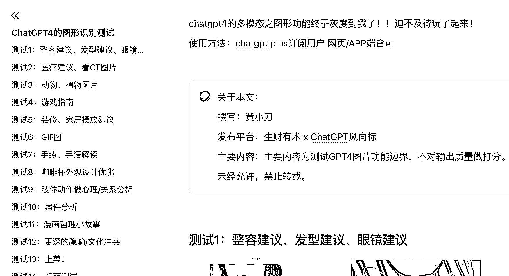

# 玩疯了！ChatGPT4 的图形识别测试！

> 原文：[`www.yuque.com/for_lazy/thfiu8/pnfz5z5k9r6uc4yk`](https://www.yuque.com/for_lazy/thfiu8/pnfz5z5k9r6uc4yk)

## (61 赞)玩疯了！ChatGPT4 的图形识别测试！

作者： 黄小刀

日期：2023-10-09

终于灰度到我了，从不同的应用场景玩了玩，大家一起来玩！

图片较多，整理在飞书文档了：

[`k0z8o16zas8.feishu.cn/docx/GgNGd7ZepotzU5xoQu6cGp8cnJg?from=from_copylink`](https://k0z8o16zas8.feishu.cn/docx/GgNGd7ZepotzU5xoQu6cGp8cnJg?from=from_copylink)

* * *

评论区：

向日葵花花 : 刀姐，为啥我的 gpt4.0 没有显示有图片功能标志呢
宁王 : 有提到灰度，估计是该功能目前只对一部分人测试使用，收集反馈，暂时还没有全面开放，所以……
深圳志哥 : 精华帖
Zero : 哈哈 3 个帐号，其中一个灰度到了，全部按照你的测试了一遍，对它的能力边界又有了一些感知
夙愿 : 测试一中不管是不是名人，只要涉及到容貌相关的话题，都有可能被拒绝，这是 OpenAI 提前设定好的，不过可以通过类似于"奶奶漏洞"的话术来骗 GPT 回答。

* * *