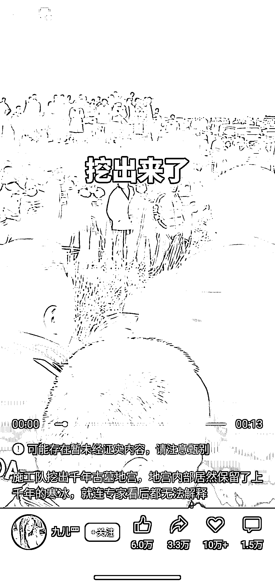
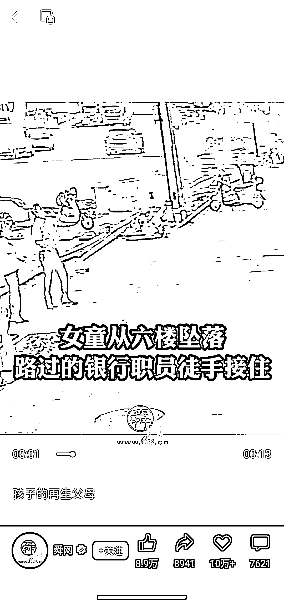
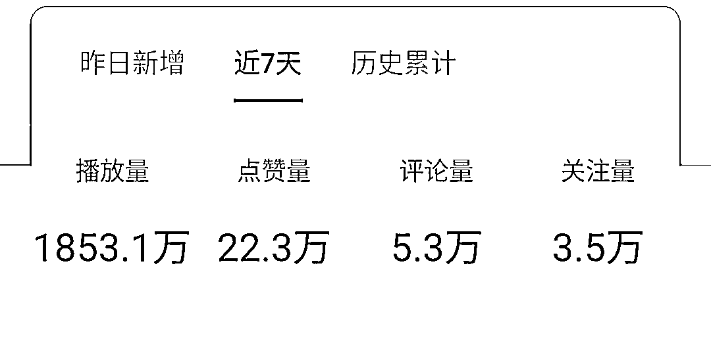
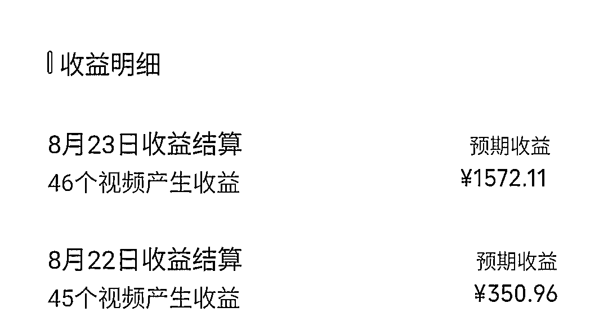
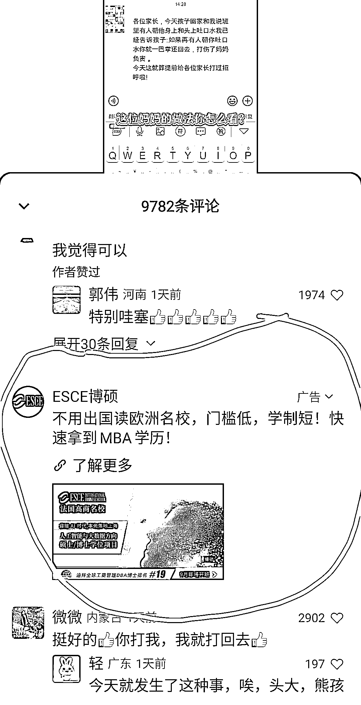
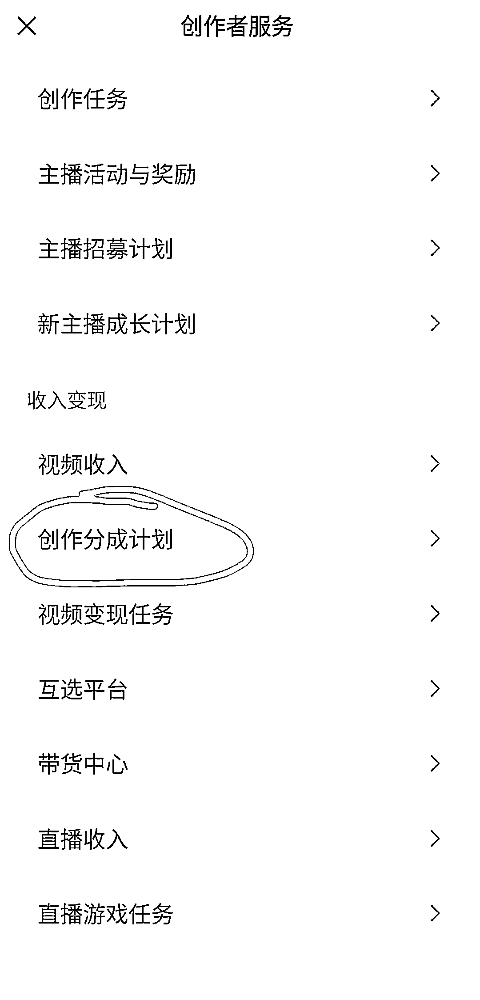
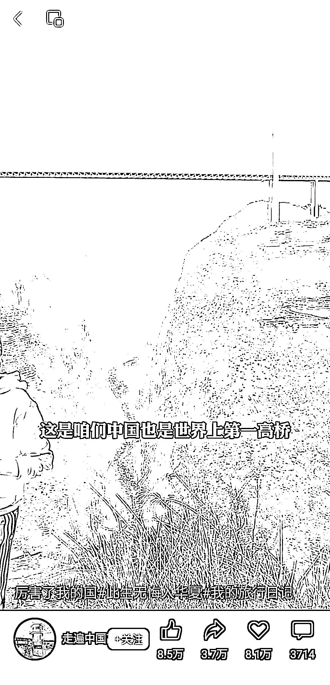
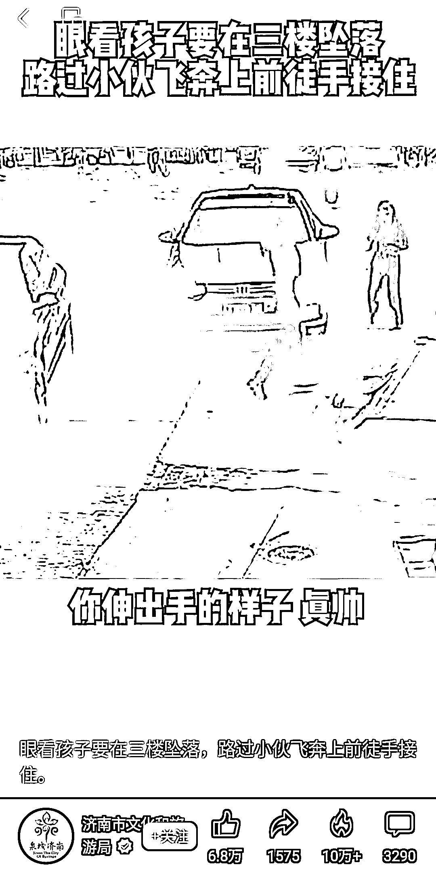

# 视频号创作者分成收益怎么赚？追好热点，打造爆款视频

> 原文：[`www.yuque.com/for_lazy/thfiu8/otd70vphmqgg6bhl`](https://www.yuque.com/for_lazy/thfiu8/otd70vphmqgg6bhl)

## (精华帖)(190 赞)视频号创作者分成收益怎么赚？追好热点，打造爆款视频

作者： 流浪虎

日期：2023-09-27

在视频号，热点、猎奇、感人故事，婆媳矛盾等方面的内容很容易爆，播放量基本上都能上 10W+。

可能大家会很好奇，这类账号是如何变现的。

而我目前正好也在做这类的视频。接下来，就给各位圈友分享下这类 10W+播放的账号，它们的变现路径是啥样的，希望对大家有所帮助。

玩视频号一个月，目前单日纯创作者分成计划收益最高 1500 元+，累计涨粉 9w+，单视频最高播放 608w，半月收益 3300 元。

玩法就是创作热点视频在视频号发布，赚取创作者分成计划分成收益。

项目没啥操作难度，目前市面上已经有很多关于创作者分成计划的培训，收费在 499-1500 元之间。今天的分享就是把整个玩法流程毫无保留分享给大家，全文 2700 余字，更好阅读体验可通过飞书链接。

### 一、项目介绍

视频号创作者分成计划，平台邀请开通这个功能后，发布视频标原创声明，平台会在评论区自动插入广告，然后根据点击率来赚取收益。

简单点可以理解为视频版的流量主收益。公众号是文字版，视频号是视频版。

如何看自己账号有没有开通创作者分成计划？

**微信号主页--发现--视频号--右上角小人--创作者中心--创作者服务更多--收入变现**

如果看到下图所示的创作者分成计划，点进去开通即可。

如果没有看到这几个字，就说明还没被邀请。有时平台邀请会给通知，点通知进去开通即可。有时没有给通知，但收入变现里还是出现了创作者分成计划，得点进去才能开通。

这个自己留意下。

如何开通创作者分成计划？

目前这个功能只有腾讯邀请才行，邀请条件只有模糊一句话：持续创作优质作品。

根据经验，账号没有过违规的，一般爆 2-3 个 50-100w 播放作品会收到邀请。

我目前有 4 个账号开通了这个权限，另外有一个账号，累计播放 100 多万了，还没收到邀请，有点玄学。

### 二、利润空间

发视频收益如何计算，腾讯没有给出明晰的规则：

根据经验，1w 播放差不多 1 元钱，具体还是根据广告点击率来的。

有个视频播放只有 300 多万，但广告收益有 1500 多元。有个视频播放 100 多万，但收益只有 30 元。昨天爆的一个视频只有 79.6w 播放，但收益却有 122.93 元。

收益还是拿不准的。

### 三、玩法实操

既然是赚创作者分成收益，那只要视频爆了就行，什么类型的视频爆就不重要。

目前视频号的哪些内容比较容易爆的？

热点，猎奇，爱国，英勇救人，感人故事，婆媳矛盾等。

**猎奇**，找一些稀奇古怪吸引人眼球的事，抖音上很多类似账号，直接改别人爆了的内容就行。

**爱国，**爱国类太敏感，这里不展开说，视频号上比较火的比如新疆西藏修铁路，珠港澳大桥，邮政跋山涉水骑马骑骆驼送快递等。参考新闻联播体，后半小时的内容平台也是很舍得给流量。

英勇救人，视频号的群体主要中老年人，就喜欢这种社会正能量的视频。

感人故事

婆媳矛盾

可参考模仿账号如下：

**美摄安然；L 航拍；小啾啾 1987；九儿；感恩有爱小木屋；禅缘智慧；党史博采；**

**小茹观世界；琨少说说；心心的念叨；宝珠书道；玩玩娱乐；古董那些事；**

**王耳朵先生；红尘 7666；今古奇谈；12 月 ya。;杰哥看历史；罗兰妹妹；浅笑情感驿站等。**

展现形式可以是视频，也可以是图文震惊版，图文类的制作更简单，在视频号效果反而更好。

以上内容都可以去做，爆了就行，不管白猫黑猫，抓住老鼠就是好猫。

我们今天主要分享是制作热点爆款视频，只是其中的一种，创作视频的流程其实都大同小异。流程如下：

#### （1）确定当日热点

找热点的方法，生财有很多教程，这里不展开讲，主要为围绕抖音热榜，微博热榜来看。

看多了，热点其实很好把把握的，比如这两天的李佳琦相关的：79 元眉笔，西门子报警，蜂花商战捡粉；华为 mate60 发布，华为自主芯片；日本核废水排海；国足守门员喝水等等。

和政治军事有关的热点不要追，比如三胖访问俄罗斯；擦一点边的也不要碰，比如深圳北极鲶鱼事件。一不小心就触碰到红线了，丢号是小事，弄不好就喝茶。

#### （2）找热点文案

确定好热点之后，接下来就是找文案。可以自己写，也可以二改。

下面给大家 3 种方法：

1、抖音上找热点爆款视频，最好是口播形式的，用工具提取文案，比如轻抖，然后稍微修改下，换成自己的文案。

2、打开 360 浏览器，主页内容基本都是热点，但别人是长文章，需要二改为短文案，可以用 chatgpt 改，也可以用度咔剪辑的 AI 成片--AI 改写这个功能。

3、直接从微博上找热点文案，然后稍微修改下变成自己的文案。

文案长度 200-300 字就可以，最好不要超过 500 字。

#### （2）创作视频

有了文案，接下来就是创作视频。我们追求的是批量操作，用数量对抗概率，所以不会去精细化剪辑，制作一个视频的时间尽量在 10 分钟以内。

最快制作视频的方式有 3 种：

**1、口播：**

这种形式做视频最简单，户外，边走边播。但对变现力还是有要求的。

**2、图文：**

图文可以是简单的一张图片，配个音乐，这种也有很多大爆的，对文案的内容就要求比较高了。

还有一种多图做成视频的形式。一个视频 3-4 个张图片，多个标题，就是图文震惊版，引发好奇，耸人听闻。

前段时间好声音李玟时间，很多 10w+的视频都是这种形式。在剪映上做好一个模板，任何爆款，只需要替换标题和图片即可，找好素材 3 分钟出一个视频。

**3、软件一键文字成片：**

推荐的软件是剪映一键成片和百度的度咔剪辑。个人感觉百度的度咔剪辑文字画面匹配度更高，声音也更好听。度咔剪辑也有两个限制，一是内容敏感就罢工，二是长度不能超过 800 字。剪映就宽松多了。

**4、发布视频**

发布可以手机端发布，可以电脑端发布，这个没讲究的。有人说手机端发布流量好些，我流量最高的一个视频就是电脑端发布的。

发布时有 3 点需要注意的：

1、标题得吸引人

2、标签一定要打上

3、标注原创声明

发布时间至少间隔半小时。

多个账号同一个 ip 发布有影响吗？没有影响的，多个账号同一个 wifi 也没影响。

爆款视频可以开别的账号白名单，多个账号重复发爆款。操作如下：

**创作者中心--创作者服务--更多--账号管理--原创保护记录--授权账号**

### 四、踩过的坑

目前市面上关于视频号撸创作者收益的教程几乎没有，腾讯给出的规则也不清晰，只能慢慢摸索，该踩的坑一个没落下。

4 万粉丝的账号和 2w 粉丝的账号，先后被关进小黑屋 1 个多星期。每天正常发作品，只有几十个播放。

踩过的坑如下：

**1、视频忘了开原创声明**

结果视频爆了 600 多万的播放，结果忘了开原创，损失预计 2000 元。

**2、账号流量过大评论区没管理好被关小黑屋**

一个视频转发 35.8w，评论进来的太多，结果一些评论把风向带歪了，导致很多评论被吞，然后账号也被关小黑屋。大爆的视频，如果出现一些评论不正能量的苗条，建议关闭评论区。

**3、一个账号一天发布视频超过 10 条**

一个账号一天发 30 条，后来账号被关小黑屋一个星期。一个账号一天最好不要超过 9 条视频。5-6 条最好。

**4、重复发很久之前爆过的视频**

发半个月前的爆款视频，然后账号又被关小黑屋了，以前爆过的视频可以重复发，最好 1-2 天内发，间隔时间太长会被系统检测。

**5、作品大爆之后，账号会被限流**

目前几个账号测试都出现大爆后限流的情况，不过限流也不会很久，一般不会超过 7 天，如果超过 7 天还不给流量，可能是内容真有问题，可以考虑换新号。

### 五、总结

视频号创作者分成计划是新出来的东西，目前玩的人不多，属于蓝海。

视频号创作收益与公众号流量主对比：

优点：比公众号流量主简单；uc 震惊版，图片类更容易爆；反馈很快；操作相对简单，不用梯子啥的，一个手机就可以操作。

缺点：作品大爆后容易被限流；进入门槛比公众号流量主高；没被腾讯邀请开通创作者收益之前，发作品都是没有收益的。

视频号创作收益与抖音中视频计划对比：

抖音中视频计划是根据播放量来计算收益，收益来源是抖音的补贴，也只是抖音为了抢占中长视频这个山头的短期策略，现在一片红海，僧多肉少，不够分，注定收益只会越来越少。

而视频号的创作者分成计划，不看播放量，只看广告点击率，收益是来视频号投广告的人发的，平台和创作者共赢。

未来创作者越来越多，视频质量越来越高，用户来越来越多，视频号的生态越来越好，投广告的就更多了。创作者有收益，才能持续更下去，像 b 站这种为爱发电的，断更才越来越多。

虽然目前收益不多，但很看好视频号的前景。腾讯的生态里，注重积累，公众号 10 多年了，和创作者共同成长，让很多人赚到了钱，视频号应该也会如此。

目前很好做涨粉，先不想那么多，先把账号粉丝涨上去再说。以现在视频号在腾讯生态里的位置，肯定不会比公众号差。

当然了，不管是公众号流量主，抖音中视频计划，还是视频号创作者收益，这些本质都是拿内容换流量，是变现最低效的一种形式，当副业来做做可以，当主业肯定不行。毕竟收益是不稳定的。

* * *

评论区：

西沙 : 我混剪的超级容易违规[流泪]泪目
流浪虎 : 混剪流量一大收益都可能没收
世界倒着看 : 现在邀请应该不大好邀请吧
流浪虎 : 涨到 1000 粉，爆 2-3 个视频，就可能会收到邀请。
FF_23531 : 玄学，我小号爆了一个视频，涨粉 90，然后限流。后来花 50 加热了一个，粉丝涨到 300，发现开通了这个分成收益，是说航海没学到哈哈[强][强][强]
Waldeinsam* : 做了三天，前两天也没几个粉，第三天就突然被限流了，感觉被关小黑屋了
亦仁 : 感谢分享，已加精华。
流浪虎 : 感谢老大

* * *