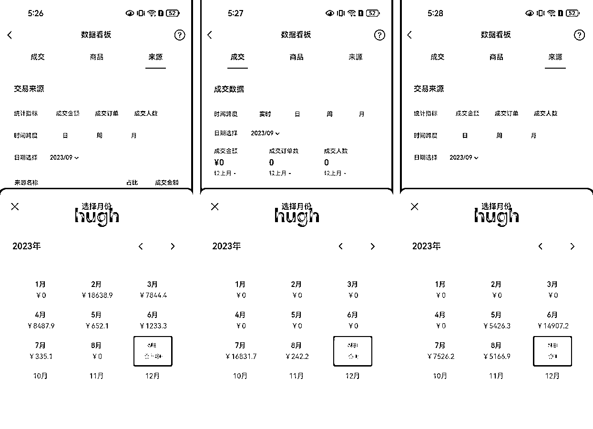

# 在视频号深耕一个小类目，半年赚 15w

> 原文：[`www.yuque.com/for_lazy/thfiu8/sprg68cyg1vdqaix`](https://www.yuque.com/for_lazy/thfiu8/sprg68cyg1vdqaix)

## (精华帖)(165 赞)在视频号深耕一个小类目，半年赚 15w

作者： Hugh

日期：2023-10-13

各位圈友好，我是 Hugh，加入生财一年+。今年 2 月开始，全职做视频号带货，半年多单品类 GMV 25w+，毛利润 15w+。下面是其中六个主力账号的历史成交数据。

相比其他大佬的“快速打品”式玩法，我这种打法很佛系，半年多主要死磕一个很细分的小类目。所以下面从五点谈谈，我这种玩法：

1.  为什么一个细分类目可以持续玩半年

2.  我是如何从 0 做到月利润 5w+的

3.  从几个号，到几十个号需要的一些基本技能

4.  矩阵化和自己做后端过程中，我踩过的一些坑

5.  对还未跑通的伙伴的一些建议

为了让大家有更好的阅读体验，查看全文请移步飞书：[`i2mok5xev6.feishu.cn/docx/Y0hGduYtnot9WIxB1excr6S0nde?from=from_copylink`](https://i2mok5xev6.feishu.cn/docx/Y0hGduYtnot9WIxB1excr6S0nde?from=from_copylink)

* * *

评论区：

亦仁 : 感谢分享，已加精华。
亦仁 : 深耕不错的，慢慢的向上游走，变成细分领域的一个小品牌。
曼巴 : 非常实在的分享，内容很干很实在[强][强][强]
Hugh : 感谢亦仁，首篇精华达成[奋斗]
起轩 : 很实在的分享[强]
牧羊人 : 优秀！感谢分享[奋斗]
云珞 YunL : 很优秀，感谢分享
芷蓝 : 有启发

* * *