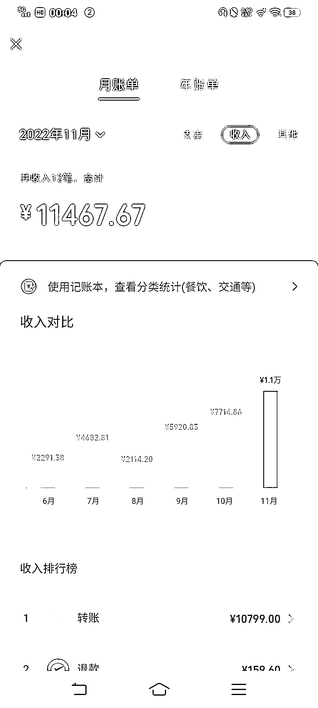
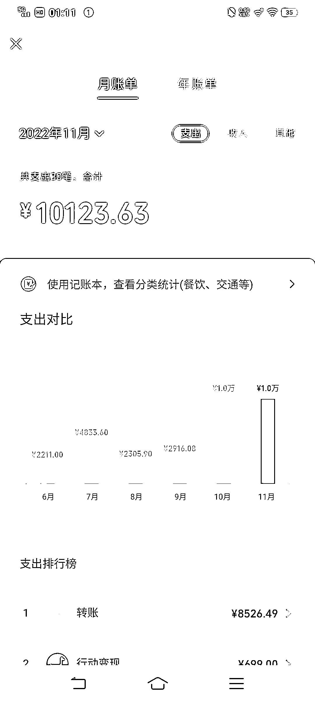

# 副业做公众号，如何透过知识付费赚回学费

> 原文：[`www.yuque.com/for_lazy/thfiu8/qsrhzgrqz7fvvy6q`](https://www.yuque.com/for_lazy/thfiu8/qsrhzgrqz7fvvy6q)

## (40 赞)副业做公众号，如何透过知识付费赚回学费

作者： 二丫吖

日期：2023-10-12

去年 4 月中旬，我还在中 V 那投稿，赚 200 块一篇的稿费。

那时候，一边做公众号，一边投稿赚点小钱。

因为我的习惯是：做事前先买课，付费去看别人总结的经验，能少走弯路，提升效率。

买课需要花钱，于是我一边做账号，一边给中 V 投稿。

投稿有两个好处，一是能赚点小钱，为我买课的花费回点血，另外一个是，中 V 那有几十万的粉丝，我给她投稿，能增加我的曝光率，能为我引流。

5 月份我的公众号日更后，我忙起来了，也就没有再投稿。

其实，现在跟他已经达到了更深入的合作伙伴关系，我应该要继续投的，这样就能持续为我的号引流。

但，现在我自己公众号的文章大部分用的都是历史稿件+问答，要写投稿，起码得俩小时起步，我的畏难情绪起来了，就没有继续做这个动作，现在我公众号的涨粉，主要是花钱买流量，我请了个专门找车的小助理，她全权负责，我只要结算就好。

也就是说“涨粉”这项工作我已经外包了，我自己就没有花时间再去做这个动作。

这是不对的，应该要持续引流。

去年 11 月份（第八个月），我没有接一个广告，但我的公众号收入破万。

这一篇会跟大家说说：

**一、具体赚了多少钱？**

**二、怎么赚的？**

**三、我花了多少钱？钱都花在哪里了？**

运营公众号的这两年，我很少一笔笔去算“具体的收入和支出”，一个原因是时间精力有限，另外一个原因是我觉得“就这么点钱，算个什么劲，费事”。

之前每个月都是几千块，但去年 11 月首月收入突破 1 万，我觉得很有纪念意义，就把收入清单给拉出来了。

### **一、具体赚了多少钱？**

1、卖了一个年度咨询；

2、跟大 V 做了两场直播，我有提成；

3、我这个月付费咨询搞促销，第一次咨询打 6 折，我卖了 4.5 个（其中有一个超了半小时她补付费了）；

4、卖别人的知识付费产品，有分销提成。

以上的收入，全部在这个做自媒体的微信上，光这部分的收入就有 1.1 万了。

还有部分的收入来自我的生活微信，因为我刚开始搞公众号时习惯用这个微信付费买课，绑定的微信就是这个。比：我的知识星球+文章赞赏。

综上所述，我这个月的自媒体收入是：**15000+。**

截止到 11 月，我的自媒体全部收入在 6 万左右。

### **二、怎么赚的？**

跟我同一批的号主们，他们大多靠“广告”赚钱，要么就是成立自己的社群和课程来变现。这是一种办法，但有劣势。

一个劣势是，广告伤粉，频繁接广告会流失掉一些粉丝。当然，号刚做起来，肯定是要靠广告来变现的，这个最直接，也最容易，也能让我们新号主了解广告变现的途径和市场，这种商业模式是一定要尝试的。

正是因为这个尝试，我认识了不少大学生号主，了解了他们的引粉渠道和做号方式。后面我就用我的内容配合她们的引粉渠道，这样降低我的吸粉成本，找到了一条属于我自己的发展路子。

收获非常大。

引粉是需要花钱的，为了让公众号盈亏平衡，我在刚开始的几个月就是靠广告“活”过来的。

其实，自媒体这行跟其他行业没有区别，人微言轻，你的号粉丝少、阅读量低，你是没有话语权的，也很难跟别人有什么合作。

所以，前期在“买课”这个事情上，我基本都在投入。

这种投入，肯定会有“浪费”的情况发生，就像之前，我说花了 1599 报的写作课、花了 1099 报的知乎课，这俩课的钱从结果来看是浪费了。

**但，实际上，对我来说，我买一个课，是有三个目的的：**

1、通过买课，链接这个老师，获得更多的信息和未来合作的机会；

2、观察他们是怎么做课的、社群运营怎么样，有几个小助理，群内氛围、内容结构等等，相当于我是把这些课当“竞品”来分析的。

3、冲着他们社群去的，买课的人都有“付费意识”，如果能吸引过来成为我的读者，就很有可能后面会成为我的付费用户。

4、最后才是课程内容。

所以，这两个课只不过是课程内容不适合我，但我也在这个课程上学到了一些东西。当然，这些东西可能不值两千多块钱，可我很会淘性价比高的课，有些课在我看来可以标价上千，但博主却只卖几百块。

平摊一下成本你会发现，其实差不多，从总体来看，我的认知、在这个行业的话语权、我的收入都在提升，那么这些买课的钱就是值得的。

**也就是说，我买课其实是给自己买一个“向上链接”的途径。**我打工这么多年，我本身就具备向上链接的技能，这个技能是拉开我跟同期号主距离的重要因素，也是我变现途径多样的重要来源。

像我的情况：我有本职工作、要带娃、公号要日更、日常还要买课学习。

**在我没有一定的粉丝基础时，我做自己的课程就是“得不偿失”。那我不做自己的课程，我难道就只能靠广告变现吗？**

**不是，我可以选择做分销。**

我分销卖别人的课：

**对我来说：**不用我运营、不用我上课、不用我售后，来钱快。

**对买课的粉丝来说：**由于我选择的的课都是我自己报过的，这样推荐了也不会影响我的口碑，买课的人还会感谢我推荐一个性价比高的课给他们。

**对开课的老师来说：**我是他们一个很好的课程销售，能直接给他们带来利润，我能为他们创造价值，他们就会想要跟我合作，也会对我有更多资源的倾斜。

一举多得。

钱赚到手后，我会立马投入到公众号的投放中，所以在几个月的时间内，我的公众号能涨粉到两万多。而，粉丝越多，我在这行的话语权就越高，我摆脱了“人微言轻”的局面，我向上链接的筹码就越多，我就能跟更多的博主合作，能抬高我的身价，我的变现途径就会更多。

形成了一个良性循环。

这个时候，我再去做我自己的课程，不管是内容质量还是销量，我都能做得更好。之前很多人问我，为啥不做自己的课程？

其实不是不做，是时机未到。

分销，目前是我做自媒体的一个重要收入来源。

### **三、我花了多少钱？钱都花在哪里了？**

花钱主要是几个部分：

1、我有三个小助理，一个给我排版、一个帮我找车、一个帮我剪辑直播小视频，每月工资支出：1800 元。

2、我经常“上车”，这是“行业术语”，上车的意思是：花钱到某个博主那投广告，推广自己的公众号，吸引这个博主的粉丝关注自己。

3、持续买课，我每个月都会买课的，买不同博主的课，去吸收不同的思维方式，链接不同的人。

**其实我每个月差不多“收支平衡”，虽然赚了不少，花得也多。**

这个月这个微信的钱有点多，因为之前这个做自媒体的微信被封过，我担心梅开二度，就转了 6 千给我的生活号，**所以，这个月的实际支出，其实是 4 千多。**

**这钱从我手里流进流出，留下了什么呢？**

1、我的认知提升了，我对自媒体这行的生意模式理解得更透彻了。

2、我有了一圈很优秀的合作伙伴。

3、我有了一个粉丝 3 万+的公众号，微信 5000+人的私域。

4、我的“生意”运行起来了，起始投资除了时间精力外，几乎可以说是没有实际成本了。

你看，从这个角度来看，自媒体真的是一门非常好的生意，不管你开什么实体店都需要投入初始资金的，还会有亏损的风险，你买股票也遇到遇到行情不好，下跌…

自媒体这个事，对我来说：时间自由、能带来情绪价值、能增长见识、收益无上限…

属于一本万利的事。

所以，能够看到这一篇文章的各位，你们是幸运的，哈哈，至少你们已经“一只脚入行”了，要不要继续，就看你们抱有什么样的目的和行动了。

【延伸阅读】

1）[如何写出一篇对读者“有用”的文章？](https://t.zsxq.com/1190iS6eF)

2）[新手小白做公众号的第一步：写](https://t.zsxq.com/11lFui6Ph)

3）[如何从书中提炼观点，让你的文章更有深度](https://t.zsxq.com/11jkbp0BE)

4）[内容更新频率，日更≠能做成一个账号](https://t.zsxq.com/135Hvhqii)

* * *

评论区：

周彦充 : 小助理的内容感兴趣，期待分享下[呲牙][呲牙][呲牙]
清源 : 对投入产出的分析非常到位，学习了
Allan : 有收获！赞！

* * *