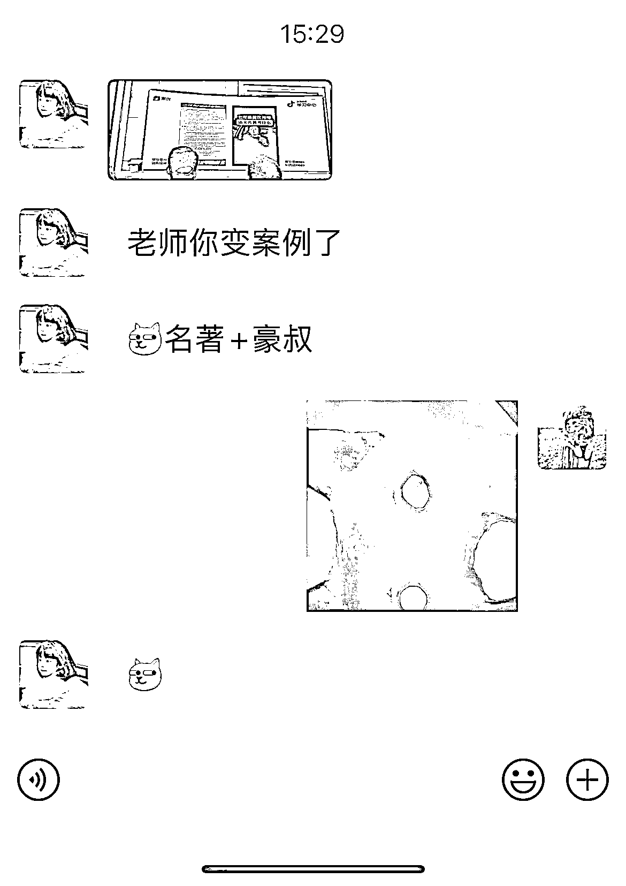
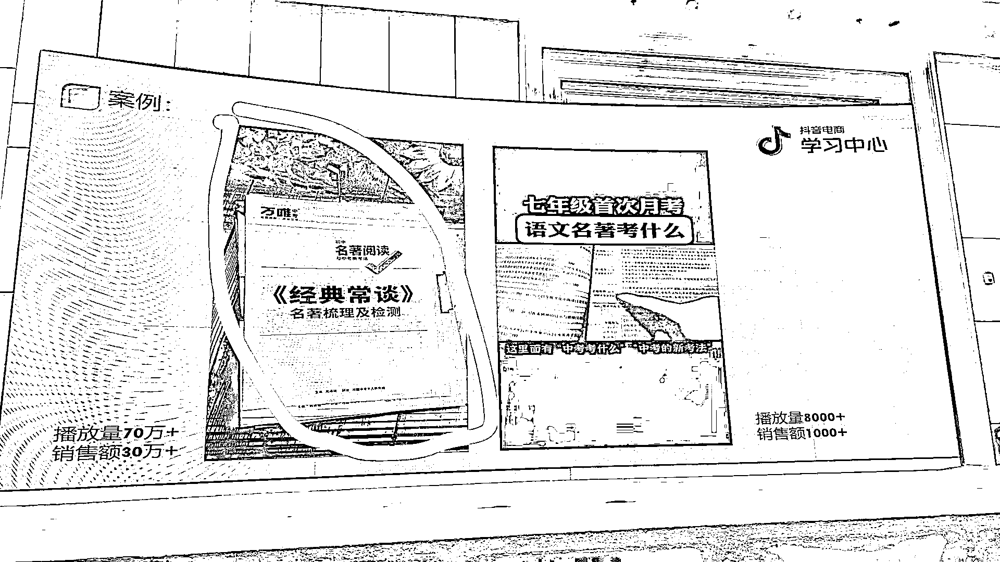
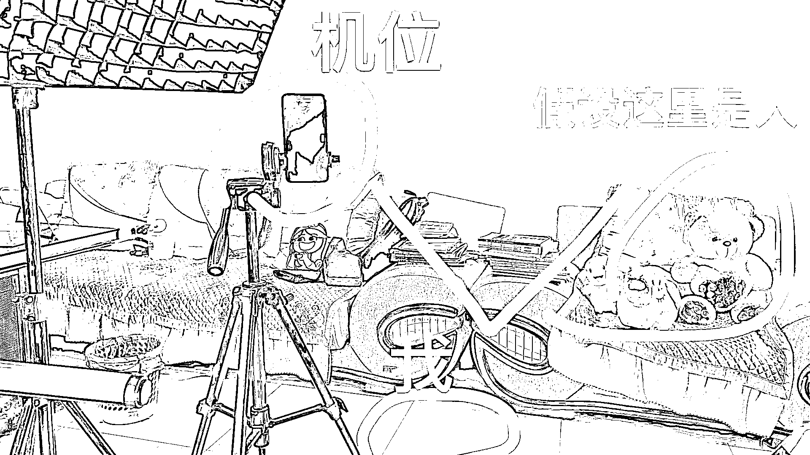

# 抖音短视频带货未来趋势和玩法：口播 3.0 时代

> 原文：[`www.yuque.com/for_lazy/thfiu8/sl87grnce5ppfvpd`](https://www.yuque.com/for_lazy/thfiu8/sl87grnce5ppfvpd)

## (82 赞)抖音短视频带货未来趋势和玩法：口播 3.0 时代

作者： 猎音狮

日期：2023-10-07

**本期关键词：**抖音；短视频；口播；表现力；氛围感；记录美好生活；短视频带货

各位圈友大家好，我是猎音狮，十一假期结束了，圈友们也陆续复工了！今天来聊聊口播账号怎么做，说到口播账号，大家都不陌生，但是咱们今天主要聊的是**3.0 版本**的口播，可能跟一般认知里的口播有点不一样。

首先，先来讲一讲**为什么我们要做口播账号**？

因为很多小伙伴可能他做着自己的生意，有可能白天还要上班，或者说你是一个***自由职业者***，但是你不可能 100%的精力放在拍视频上，那么我们要选择一种输出效率比较高，成本比较低的形式，口播就是最好的选择。

那很多人做口播，都会遇到一个问题，就是我一个人面对着镜头，说不出来话，准备好的文案，就像念稿子一样，干巴巴的，没有什么感染力。

这是因为您还没有进入到这个短视频生产的熟练状态，我刚开始做口播，也是这个问题，请教做的好的头部朋友，朋友说你录 100 个口播视频，就解决了，100 个不行就录 1000 个！后面录的越多，真的越来越自然了！

今天为止呢，2.0 口播我自己不算做得很好，但是也小有成绩，屡次登上带货榜单，部分视频还被**抖音官方**作为**案例**在线下电商大会分享。

但是，和很多小伙伴一样，我也遇到了瓶颈期，因为这种形式的口播，感觉自己已经达到了天花板，很难继续突破往上冲了！

十一期间，我思考了好久，也到处向大咖请教学习，想出了一个新的概念：**抖音口播 3.0**

前几年的抖音，或者前几年自媒体时代火爆的时候做口播，相对比较简单，只要敢露脸，敢对着镜头说话，坚持下来，你就是大 V。往那一坐，你就可以拍出流量视频，但现在还可以吗？

你发现获取流量的难度越来越大，就不说前年了，难度远远高于去年，单这既是挑战，也是机会，所以说**做短视频 IP**，最好的时候就是**现在**，对，就是现在！

因为往后流量只会越来越难获取，先不说自然流，付费只会越来越贵。这样，根据**二八定律**，会筛选掉很多毅力不足的人，继续坚持做下去的，就是吃肉的人！

2.0 时代的短视频，就是往那里一做，巴拉巴拉说教，说服别人认可你，说服别人买你东西！现在用户已经对这种形式没有了耐心，完播率，5 秒跳出率越来越高！

那么，如何让别人能轻松的听下去你讲的话呢？过去的那种 2.0 版本（说教式的，正襟危坐的，专家型的）或许很难再去获得流量了。

那么**3.0 版本口播**机会来了：

我们来说说 3.0 是什么，就是 2.0 的升级玩法，口播还是口播，但是你要会在你原有的基础上对视频形式进行润色，可以改变形式，可以加一些吸睛的元素。

比如我以前是坐在工作室固定位置里，用固定的背景录视频，那我现在可以在公园里边散步边录，也可以在有司机开车的时候，车辆行驶过程中，你在后排录！

又比如教辅带货可以变成亲子互动，家长问 孩子答，一问一答，很有代入感！

等等……

抛砖引玉，可以*头脑风暴，想出更多 3.0 玩法*！

3.0 的视频内容，或让你感觉刷起来很轻松，看视频没有看那种正襟危坐的专家型累了。

那么，针对 3.0 玩法，豪叔下面给出一些建议供参考！

### **重点关键词：注重口播氛围感**

氛围感拉满，收获了用户的注意力，用户就会感觉很轻松，很有亲和力，才能继续看下去，你说我们平常刷这种短视频的时候，谁会喜欢看那种被教育被说教的呢？谁会抱着我要来认真学习的状态去刷短视频的呢？

都是在放松休闲的时候，累了一天了，晚上洗完澡躺在床上刷刷抖音，那这个时候需要的是很轻松的状态，娱乐就变得很重要了，不管你在短视频中充当什么角色，那你要做到的一点是什么？——**口播的氛围感**。

那么，如何提升氛围感呢？

#### 一、找人聊天（适合工作室、团队）

一个人面对镜头是没有氛围感的，周围有人跟你聊天，跟你互动，你就有氛围感！比如案例中的亲子互动型，你也可以夫妻互动、师生互动，家长跟老师互动，学生跟学生互动，老师跟老师互动聊班里学生学习情况、学习方法……

好比我们到餐厅吃饭，看哪家热闹喜欢到哪家吃，用户刷视频也是一样的，为什么剧情的内容更容易火，因为剧情就是一群人在演，非常热闹！

所以，已经有高端的带货短视频，拍成了剧情，去年前年都是工作室在玩，今年有很多以家庭为单位，在拍带货短视频！

是不是思维一下子打开了，用户看视频不再是看你说教，而是想看剧情、看电视剧，劳累了一天，刷到这样视频，谁能拒绝呢？

#### 二、假装跟人聊天（适合个人）

这个是基于第一点补充的，因为很多人做抖音，都是一个人，比如我自己就一个人做，所以找不到搭档怎么办？

一个人口播，其实也可以拉出氛围感，让别人感觉到很有亲和力，很有氛围，想参与进来，而不会觉得你在背台词，或者是看提词器！

今天给大家分享几点干货：

##### 1、呼吸拍摄法

顾名思义，就是拍摄的时候，可以多准备几个机位，正面、侧面随机切换，这个好处就是降低用户的视觉疲劳，然后在剪辑视频的时候，说到重点可以把脸放大，并适当加特效音效，这样，你的视频不再是干巴巴的，就像呼吸一样，跟着心脏跳动起来！

就像很多舞蹈视频，忽前忽后，忽左忽右，会微微的动一点点，还卡在音乐的点上，这个镜头就活了，视频就化身为一个人的真实状态，观众就好像是也在身边观察她，在跟她交流，这就是拍摄的呼吸感，这样的状态，拍出来的视频，就显得没有那么的刻板了，用户看了，就像是看 VR 一样，如同身临其境，充满立体感！

##### 2、三角拍摄法

这个方法，可以治好很多新手的镜头尴尬症，因为有的时候我们只要机器一架，一天拍个十条八条的，然后对着镜头不会说话，但是如果这个时候旁边坐着人，你就自然了。

这个方法，就是看镜头久了，可以看看旁边的人“人”，为了更真实，我放了几个玩偶在那！如果有真人，那效果更好，但是咱们讲的是一个人怎么拍出效果，就只能靠想象了！

就这样，看看镜头提词器，记住内容了，可以讲给旁边的“人”听，这样视频拍出来，你会感觉眼神自然太多，不会有人觉得你在背稿子，看提词器！

##### 3、背台词

背了台词录的口播视频，就像是长期受过训练的主持人一样，很自然！

背过台词后，剩下的时间是在看镜头的，眼神很聚焦，在看一个点！否则新人看提词器，眼珠左右转动会很明显，这个时候你就知道她没有在念稿了，这是针对新手，像我录的多了，看提词器眼神也很聚焦。

当然，这个跟三角拍摄法不矛盾，这个结合三角拍摄法，效果更好，就是你看镜头的时候眼神聚焦，看旁边“人”眼神也聚焦，背了台词，再用三角拍摄法，那你的口播效果真的可以起飞，专业支持人也不过如此！

##### 4、手持拍摄法

你有没有发现，只要镜头在你前面，不管谁举着都容易让你紧张，对吧？所以，对于个人来说，手持拍摄法拍出来不亚于团队的效果！这也就是压轴大招，也就是我们说的**大道至简**！

为什么这样？因为抖音的 slogan 叫做**记录美好生活**，记录才是能够让人还原真实的最快路径。

如果你能成为一个走到哪里都做记录的人，用视频拍下来，并把你看到的一切整理成有看头的这种短视频交给你的观众，并用在值得被分享的场景当中，来输出你的内容，这是自媒体一定要养成这样的习惯，摆拍和剧情演出来的东西绝对没有记录有力量，你如果时间坚持久了，就明白其中的底层逻辑了。

好了，关于做**口播 IP3.0**，我有空会持续为大家分享，今天先到这里，咱们下期再见！

如果这期分享能给你带来帮助，就动用你**发财的小手**，给俺**点个赞**！

我是猎音狮，**专注教辅赛道短视频带货**。往期分享精华文章：

**[1、【抖音项目】图书类目短视频投流带货，我是如何月入 10W➕的？](https://t.zsxq.com/0e2QVMLub)**

**[2、](https://t.zsxq.com/0e1k8vMdS)****[普通人做抖音图书带货，从起号到投流，有哪些具体玩法？](https://t.zsxq.com/0e1k8vMdS)**

**[3、#抖音【我层层优化这个文案，从“抄”到“超”，卖中高考押题作文，3 天转化 3000 单＋】](https://t.zsxq.com/0eUuHMVwk)**

如果我的分享对你有所**启发**，就麻烦帮我**点个赞**，你们的**认可**与**鼓励**，将是我**继续分享的动力**！谢谢！

同行交流 VX：xxsnb6688

* * *

评论区：

江大虾 : 豪叔 666
猎音狮 : 感谢支持[抱拳]
oneday : 感谢豪叔干货分享，豪叔总是走在潮流前线[强][强]
猎音狮 : 感谢认可[呲牙]你的认可，我的动力
Luke 王子 : 干货满满，感谢分享
猎音狮 : 感谢支持[机智]
毅恒(收售租二手机) : 豪叔牛批
胡飞 : 大道至简单，豪叔牛

* * *