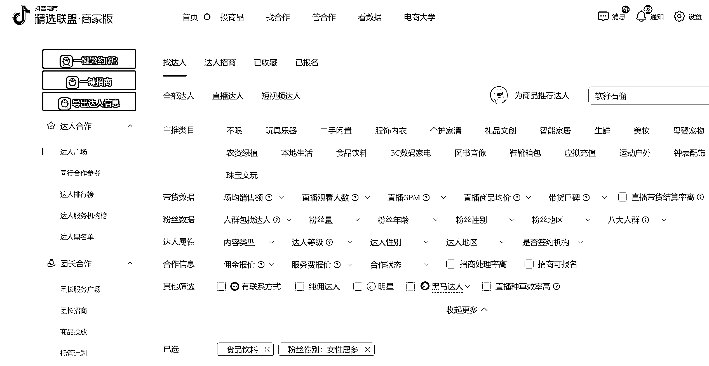
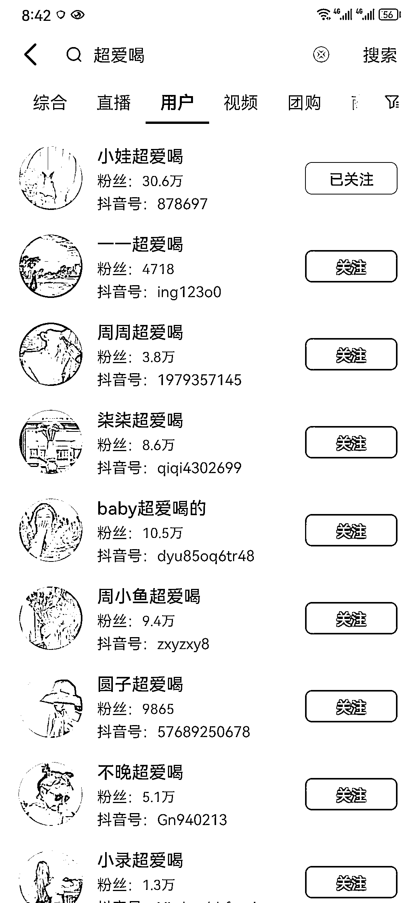
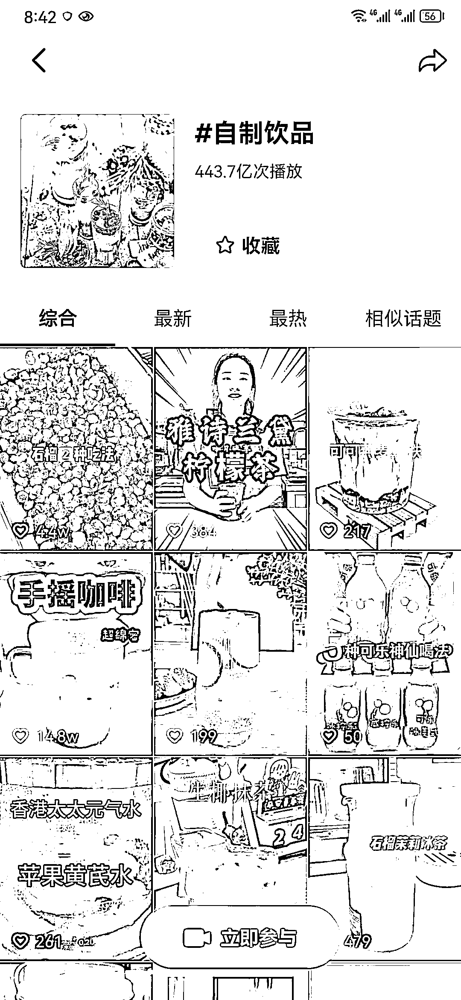
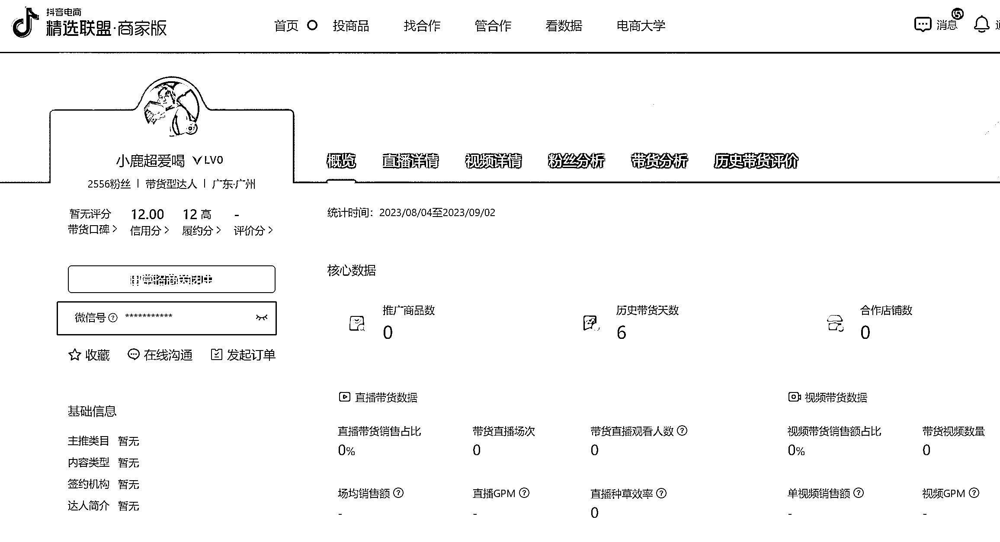
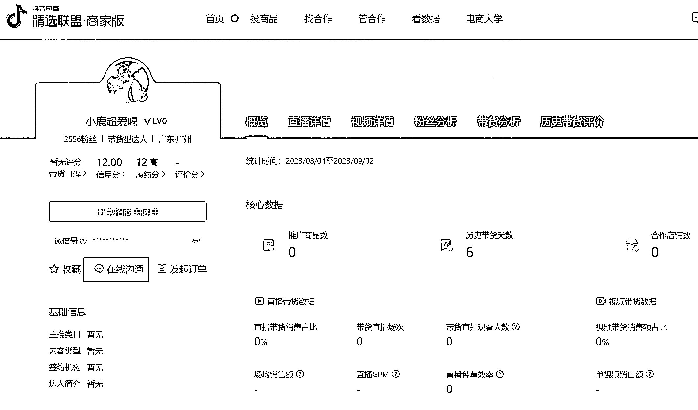
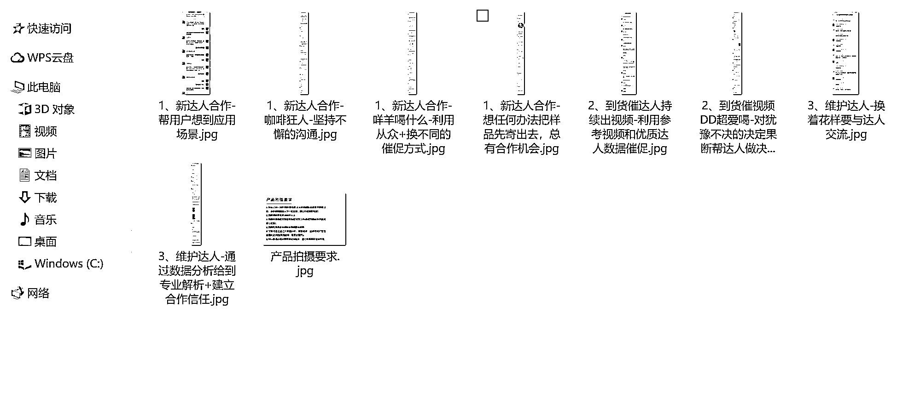
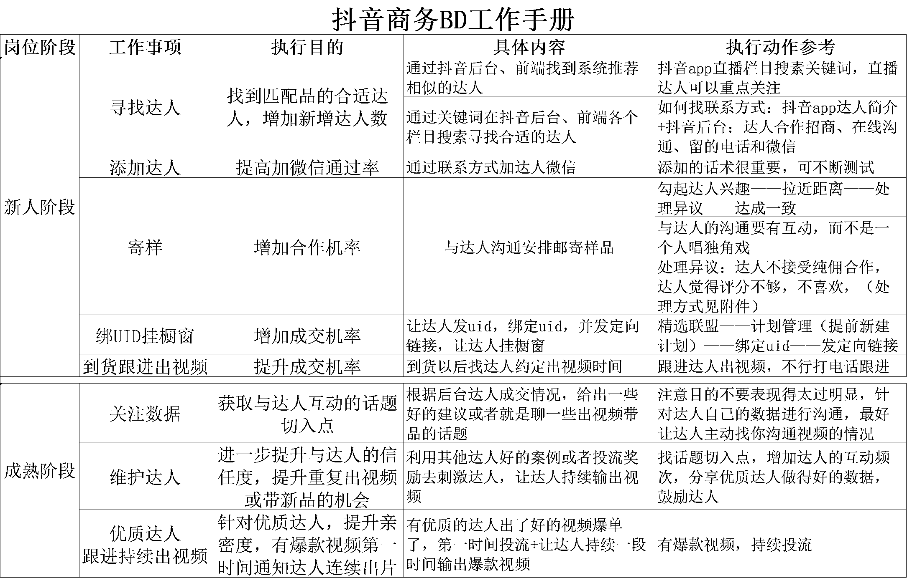
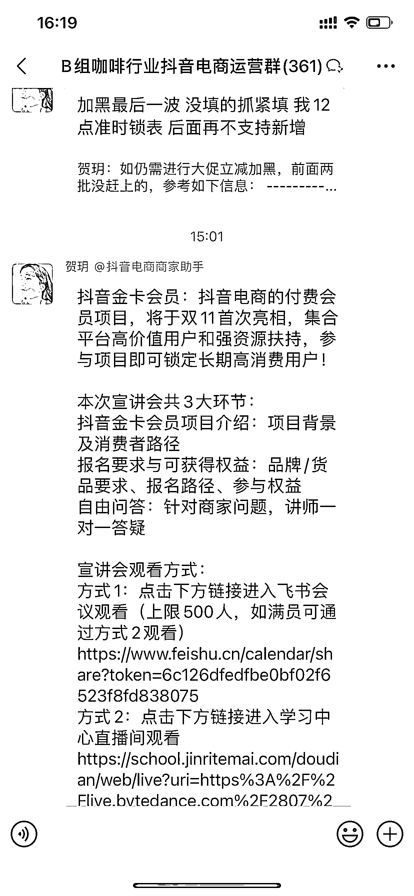
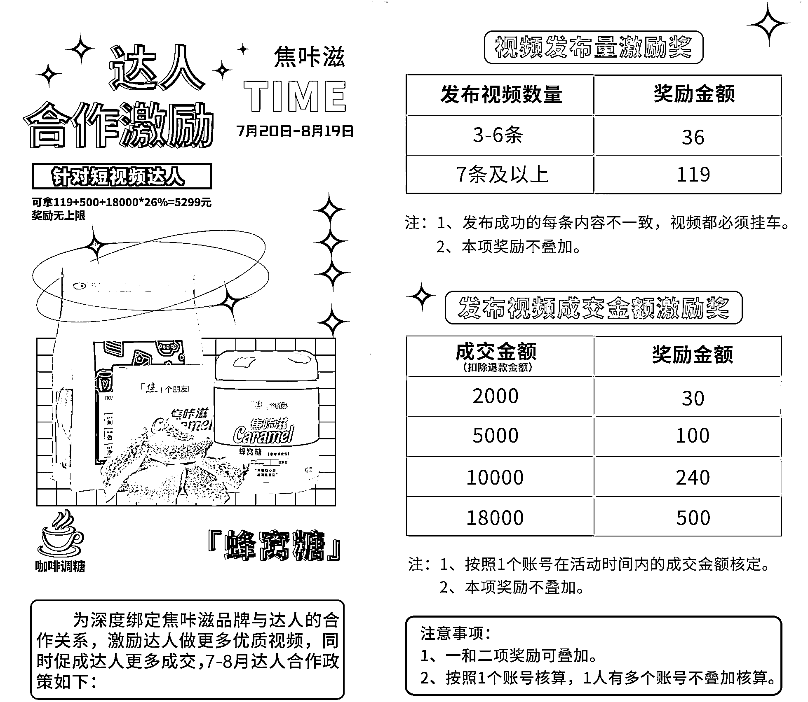
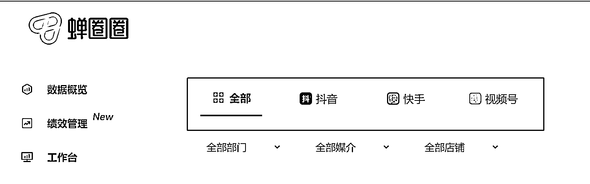

# 没有预算也能做达人投放，2 人单月做到 20 万的达人运营经验分享

> 原文：[`www.yuque.com/for_lazy/thfiu8/gcc6g6grqgtnqqqu`](https://www.yuque.com/for_lazy/thfiu8/gcc6g6grqgtnqqqu)

## (精华帖)(59 赞)没有预算也能做达人投放，2 人单月做到 20 万的达人运营经验分享

作者： 范又荆

日期：2023-10-11

如果你想在抖音卖一个没名气的商品，但又不想自己开直播，也不想剪视频带货，那还有什么方式将商品卖出去吗？

其实有的，你可以请抖音达人来帮助自己。但在前期没预算、产品不知名的情况下，怎么样让达人愿意帮忙带货呢？在产品卖出有收入后，又有什么方式来放大收益？

接下来，就结合自己的实战经验详细跟各位圈友讲讲我是如何做的，希望对大家有所启发。

在开始分享之前有必要介绍下背景：

1、产供销一体，给皮爷咖啡（peet's coffee）供货，拥有咖啡品牌背书优势

2、带过销售团队，懂点电商运营，抖音对我来说是全新领域

3、消费者对产品的认知低，急需要通过内容去扩大用户认知，坚定兴趣电商

4、看到身边其他团队有通过达人分销的模式，拿到不错的成绩

# 一、2 个人 2 个月死磕达人，跑出来的单月 20 万的业绩

**（1） 量变引起质变（想尽一切办法找达人）**

**1、明确找哪类达人合作**

在确定找哪类达人合作前，内部进行了探讨，从产品现状、长期价值、以及市场天花板等方面沟通了下，产品现在与皮爷咖啡合作，有它帮我们背书；贴着咖啡的赛道，价格也能与消费者匹配；

有人觉得，把它归属到咖啡伴侣这个品类，天花板太低了，产品可以直接吃，可以配咖啡，可以搭配甜点做装饰，这样我们就可以锁定更多的达人；

但是用户对我们产品认知度低，用户都不知道有‘蜂窝糖’或叫‘卡美罗’这个产品，大部分用户还是从知道皮爷咖啡了解到我们的产品，咖啡用户的价值也不低。

最终决定把产品归属到咖啡伴侣品类，理想着把喝咖啡加蜂窝糖这点植入到用户心理，让用户想喝咖啡就想起蜂窝糖这个产品，于是锁定饮品博主。

**2、通过一切方法找达人**

a、抖店后台-精选联盟-达人广场

b、抖音 app-刷短视频-关注饮品博主（推荐相似达人）

c、抖音 app 中查看竞品的商品链接下方达人秀（在商品评价下方），这里面可以看到对方产品有那些达人带过。

我们同样可以去找这些达人合作+精选联盟后台直接搜索竞品名称，就能查看竞品 top200 的达人合作，直接找这类达人合作很精准。

d、在找达人过程中发现达人昵称的一些规律，比如饮品博主的昵称里面会带‘喝什么’、‘超爱喝’、‘来一杯’等关键词，于是通过搜索这些关键词，快速寻找到潜在合作达人

e、与 d 有点类似，通过关键词找达人：制作饮品、咖啡的达人，会在话题上添加一些相同的关键词。

比如‘咖啡’、‘自制饮品’通过关键词搜索话题也能快速的筛选出达人

f、通过第三方数据平台，比如：蝉妈妈、飞瓜数据，通过品牌，商品，关键词查达人都可以的，不过查看各项数据需要收费，并且费用也不便宜，感兴趣的可以找淘宝商家购买会便宜很多

**3、获取达人联系方式**

a、在达人广场找到你要的达人，点击进入就能看到达人的联系方式

b、抖音 app 的达人主页，达人简介里有的达人会留下联系方式

c、抖音私信达人，要注意没有互关的情况，你只能给达人发一条消息，所以发的这条消息特别重要，尽量简短表明产品或品牌的优势，以及发消息的意图，加上自己的联系方式

例：TOP 咖啡伴侣，皮爷咖啡独家供应商，与宝账号内容非常搭，期待合作，V 我：***

估计有圈友会说，我产品、品牌没有这些优势，也没有品牌背书。

其实我们也不是抖音的 top 榜单的产品，为了增加达人的信任度，增加合作的机率，达人也不会去查你是不是 top 榜单的（至少这做了半年了没有任何一个达人来问我们，你们产品没在 TOP 榜排名啊）。

也许在意的也根本不会留联系方式，也没有加我们，那这部分达人也不是我们潜在的分销达人。

d、点击如下图的在线沟通也可以联系达人，在沟通中可以把需要合作的商品链接发给他，这样他也更直观

**小结：**

① 抖音私信最高 600 条，预估我们平均一天要抖音私信的达人至少有 300 个

② 同一个达人抖音私信，达人广场，微信加好友我们都会发消息

③ 执行拉满，碎片化的时间也在找达人

**（2）熟知产品优势，善用产品优势（用产品优势打动达人）**

**1、建联的细节调整，提高微信通过率**

a、头像设置：我刚开始用的真人头像，后来改为统一用品牌 LOGO 来增加达人的信任度；

b、昵称：品牌名+商务+小名 例：焦咔滋品牌商务 小于；

c、公开朋友圈的内容 ：提前在朋友圈更新一些关于产品、品牌、公司、达人合作等内容，让朋友圈的人设更立体；

d、设置微信加友话术：这儿的内容与抖音私信内容相似，简短的表明产品优势，或品牌实力，突出最有吸引力的亮点，加上拉近达人话术，比如我与你关注的某某在合作了，前几天有私信过，表示欣赏的话语-很喜欢宝的拍摄风格，

例如：TOP 咖啡伴侣，peet‘s coffee 独家供应商，期待合作，前 2 天与宝私信过（这段用英文代替中文引发达人的好奇、贴着国外品牌凸显自己的品牌实力、用’之前有沟通过‘拉近与达人之间的距离）；

用一些共同爱好（关注了同一达人，是同一个地方的，喜欢同一件物品…）拉近距离，人总是趋于靠近与自己有相同爱好的人；

想尽一切可以加上达人微信的正向沟通方式，切换不同的话术来测试通过率；

**2、 熟悉产品卖点，解决达人异议，达成合作**

**① 与达人谈产品优势**

挖掘产品优势，把产品的优势结合对达人的好处的讲出来，例：

a、**价格优势**：咖啡店喝一杯 38 元，用我们这个蜂窝糖在家自己制作只需几元钱，你觉得对于咖啡爱好者来说那个划算

b、**操作简单、很出片**：你是做饮品的，也在带咖啡，那直接做咖啡的时候放在咖啡中，一条视频就出来了，我给你发几张达人拍的图片，特别好看

** ② 几种常见异议**

**a、产品不适合我**

有可能是达人在找借口，一般是了解了情况再加的达人，直接扔同类型的已经出单的达人数据截图给他，这个账号跟你的内容差不多，已经出单了

还有一种情况，就是达人觉得真的不合适，我有次遇到一个做糕点的达人，他觉得我们品不合适，我给他构建了个应用场景，她做糕点的视频看起来也很有质感。

我说你在制作的过程加上一杯咖啡的制作会不会更上档次，如果能成交也增加你的收益了，帮达人去预想产品的应用场景，让达人无法拒绝

**b、没有预算，没有投流不带货**

有达人是接商家广告的，不会接纯佣的商家，退而求其次，不用挂车，让达人挂橱窗，做咖啡的时候有我们产品露出就行，甚至不挂橱窗，视频里面有露出也行。

先把样品寄出去，免费给达人吃，增加与达人信任、拉近达人的关系，下次有类似达人的情况出单了就更容易推动挂车了

关于投流，我们给了投流政策，24 小时内出 10 单我们就投 100 元

**c、没有时间**

从达人的视频发布情况就能看出更新频率，一直在更新视频的达人说这样的情况大概率是品堆的太多要交视频的，担心的是不能按照约定时间交视频，也担心商务也会一直催她交视频。

这个很好解决，跟达人约定提醒她出视频的时间就好了

**3、 微信只要没删就有机会（每天换着花样给达人发消息）**

对于躺在自己微信一直没有回复的达人，每天坚持给达人发消息，不要怕被删除，都跟你没有产生合作，也没价值，删了就更不值得可惜了；

有的达人是太忙，忙得忘了回消息，有的达人就是觉得当下不想合作，也就不想回消息，只要天天坚持发消息，总有达人能成功唤醒，达人基数多了就经常会有这样的情况：上周怎么发都不回消息的，这周发消息就答应合作了。

**小结：**

① 一定要突破 1、2 个作为标杆的优质达人，这样在沟通中你可以直接拿来作为背书

② 注意细节，细节里面有魔鬼，也有很多很多钱

③ 达人都是为了赚钱，用出单达人的数据激发达人合作

**（3）打磨细节，总结成方法，形成 sop（用标准化的工作流程提升工作效率）**

**1、梳理工作流程**

### 2、形成达人沟通的案例集

### 3、 形成工作简易手册

**小结：**

① 我把这节内容称为知识沉淀，对于新人快速上岗有了这些资料培训能很快上手

② 帮助在做管理的时候，清晰那个节点应该干什么，帮助下属纠正工作习惯

**（4）总结——成功找外因**

2 个人第一个月做了 12 万，第二个月做了 20 万，总结了其原因，主要跟平台和产品有莫大的关系。

完整的做了 2 个月，产品几乎没什么差评，并且泡咖啡确实好喝，得到消费者的认可，复购率也很高，更重要的容易拍摄的很出片，达人在这个过程也赚了钱。

抖音实质还是内容平台，对于还是小白品的我们，要是在传统的电商渠道很难有这么快的突破。

**二、陷入数据漩涡，忽略店铺运营导致业绩极速下滑**

**（1） 寻找更多达人合作的方法**

**1、扩大递品范围（根据店铺粉丝人群，全行业寻找达人，大量的递品）**

**a、了解现状**

通过前两个月的达人合作，拉了下成交数据：出单 Top10 的达人业绩占了 50%-60%，单月达人人均出单金额从 1000 元涨到 1500 元，第三个月开始单月达人人均出单金额下滑从 900 元到 580 元。数据总结：

**①合作达人的基数太低**

单月的出单达人数一直卡在 100 左右，没法用达人数量来对冲业绩的不确定性，急需扩大寄样达人

**②成交占比集中在 TOP10 达人**

一直找的是垂类的饮品博主，很吃老达人的出单业绩，没有新达人的成交顶上去，业绩必然下滑

**③垂类的饮品达人数量有限**

饮品博主的数量有限，这个垂类达人的数量天花板太低，需找其他赛道的达人合作，并找到 1-2 个标杆达人推动该赛道的其他达人合作

**b、解决方法**

**①扩大找达人的范围，先把产品寄出去**

不再局限到饮品赛道的达人，在达人广场筛选出店铺粉丝画像相似的达人（不同类目需要自己去脑补下该类目达人的应用场景）。

目前我认为最好的方式就是通过三方平台：比如我们用的蝉圈圈系统可以查询到竞品下面有哪些合作的达人，他们归属的类目是什么，并且能看到达人带竞品的视频就有参考了。

**2、通过抖音官方和竞品商务获取资源**

**a、找到抖音官方小二获得资源**

偶然的机会，通过电子商务协会，参加了 2 场抖音的商家对接会，对接上了官方小二（理论上也可以通过官方热线找到，但是之前有电话联系过，店铺没有人服务，也许是新店，业绩一般没有人对接）。

小二就会拉你进同类目的商家群，也会拉有达人的微信群，就会收到官方平台的一些政策信息，并且也有一些达人合作的选品对接的信息。

比如抖音官方在扶持图文账号的流量，并且官方在 9 月还上线了图文挂车的通道，不占用账号挂车的名额，还收到明星选品对接的资源，利用好这些资源对店铺的业绩增长也有很大的帮助。

**b、商务群或达人群互推达人**

与达人或者品牌商务搞好关系，让达人或者商务帮你推荐达人

让达人推荐竞品的商务，与品牌商务搞好关系，不要担心是竞争关系，以打工人的身份，和互推达人拉近关系，我们鼓励与品牌商务搞好关系，可以给对方商务邮寄样品，或者如下用资源互换的方式推荐达人

**c、不同品牌的产品组合上达人的直播间**

这个点我是与其他商务聊天得知的，我们自己还没有尝试，给大家提供一个参考方向（可以把它当成品牌间联合营销的方式）

找一些品牌方合作，这个需要给商务 BD 放权，经理来审核合作方案，比如：上头部的达人，5 万坑位费，2 个品牌方可以商量一家出一半（或者品牌不知名时不出坑位费，产品低价主打一个陪衬，让自己的品牌有更多的曝光）。

特别是头部达人，他带过，可以作为背书，找中腰部合作更容易，如果直播间销量好，中腰部达人更会主动找你

**小结：**

① 找到跨类目的达人合作，拓宽达人合作范围，助力产品破圈

② 善用官方资源，甚至其他品牌方资源来帮助自己产品找到更多的达人

## （2） 设置达人激励政策，刺激达人出视频

消费者对产品的认知很低，怎样通过渠道快速的获得更多的曝光，达人也在持续的找，如何推动达人快速的出视频等是当下值得思考的问题；

没有质量要有数量，没有数量要有质量这个是我想到的达人激励方向，然后有了下面的激励方案

**小结：**

活动只作为参考，具体可根据自己产品利润估算，以及之前合作达人的出单情况给出合理的激励方案

**（3）CRM 系统助力商务 BD 管理好达人**

**现状：**

a、商务 BD 的业绩不好统计，没法计算提成

b、合作达人数量越来越多，用表格管理不太方便

**解决方案：**

购买 CRM 系统，可以看到每个商务 BD 人员的达人跟进情况，可以做到过程监控，每个人每个月的业绩核算，系统上直接就可以拉出数据来，并且还可以作为第三方的数据平台，能查询达人，品牌等方面的数据。

对于我们多平台运营的也有好处，能集合多平台进行达人管理

这个板块算得上每个公司的按需采购吧，在商务人员超过 2 个，可以选择使用 CRM 系统来管理，市面上的 CRM 系统可选择也不少，功能会有区别，就不重点讲系统的功能了

**（4）商品链接掉以后的深刻反思**

1、**对于店铺运营缺乏管理，自己也冲在一线找达人，急切需要看到业绩增长**

前两个月通过达人分销，纯佣合作的方式白嫖达人的流量，同时自己也陷到数据的漩涡中，每天看店铺的成交数据要看很多次，自己也陷入不增长就是自己找的达人还不多，达人质量还不够好，自己天天扑在一线找达人做业绩，疏于管理店铺。

结果现实给了我重重一击，做过运营的伙伴就知道，店铺评分影响商品的展现，因为管控不严，导致商务人员在处理售后时，消费者买了 20 单退款时选择的是虚假发货（后来才发现是有人专门来搞我们），直接给同意退款了。

导致我们销量上万的商品链接退品率过高，直接给平台强制下线了，之前合作达人绑定的橱窗商品全部不能下单了，并且因此店铺的评分也极速下降影响整个店铺的销量，当时别提有多心焦了，自己也在总结哪些做得不好的：

2、**抱有幻想，执行不够坚决**

在商品清退前，店铺一直有提醒消息，我记得应该有了半个月的整改时间。

这时是有伙伴说新建个商品链接，重点推新的链接，我因为已经上万销量的链接不想就这样损失了，就采用的是售后专人负责，并且针对平台退款的客户协商补发或者补钱也行，以为这样慢慢退品率就下降了（抱有幻想）。

结果 20 单占的比重太大，最后平台还是做了达人端下架链接的处理，后面不得不新建商品链接，重新推给达人。

**小结：**

① 做店铺运营需及时关注店铺的评分情况，服务，物流，商品分有下降及时调整

② 遇到问题及时制定 B 方案，一旦确定坚决执行

**（5）总结——失败找内因**

1、产品在抖音渠道售卖的 3、4 个月，店铺业绩从 20 万下降到 16 万再到 12 万，商品老链接被平台清退，自己执行不够坚决

2、饮品赛道的达人合作已经见顶，老达人出视频也疲软，未找到其他赛道的优质达人合作。

3、陷在自己的工作中，对外的连接少了，比如明明有兄弟单位可以交流的，结果遇到问题没有第一时间找他们进行沟通

# 三、找到稳定的增长路径，坚定付费和深耕内容

**（1）借助工具提高找达人的效率**

在淘宝上发现的‘全自动批量达人邀约’软件，软件可以模拟人工在达人广场私信达人，提高效率，如果 1 分钟私信一个达人，24 小时软件不停每天可以私信上千个达人。

目前没有 24 小时测试过，担心到时店铺受到处罚，每天私信数量 400 个左右，这样每天的达人寄样数量能翻一倍。

可多准备几个子账号轮流发就行了，我们有一个账号发得太多被禁发商品链接了，

这是通过达人页软件点击在线沟通，统一发的话术，可参考

**（2）付费玩法：小店随心推、千川投放**

一直在想如何获得持续稳定的业绩增长，一次去外面听课学习，与其他做出成绩的团队探讨沟通，得出一个结论：用付费稳定业绩增长，特别是对我们自己有供应链的，可以通过产能实时控制付费的力度。

**1、小店随心推**

投放方式：小额多笔、数据监控（跑飞直接终止计划）

在学习小店随心推之前也踩了些坑（认为效果好的达人直接 500 元投，结果效果很差），后来通过与官方小二沟通才明白，不需要大额投放，100 或 200 起投就行了，可以同时投多笔，数据不好的就终止投放就行，观察的数据就是 ROI。

这是官方老师的答复，仅供参考下，大家可以多看生财的帖子，我最近看到生财大佬（Erik 老师）的直播分享（[兴趣电商选品理论与实操](https://i.shengcaiyoushu.com/t/BOA74SeK)），也很受益

**2、千川投放**

千川投放我们是招的专业的投手，这儿千川的具体玩法就不多说，给大家分享一些我觉得好的点子

我把千川投放的素材分 2 种：一种是自己生产素材投放，一种是找优质达人合作投他的素材

#### ①  投放自己的素材，就需要自己生产内容投放

我们自己是没有拍剪团队的，前期为了验证千川投放是否能跑得通，生产素材用了下面两种方式

**a、找达人合作，从达人那儿购买视频素材**

制定素材标准，找已经合作的达人进行筛选，他即了解产品，也懂拍摄剪辑，只需要谈好一条视频素材的价格，直接购买就行了。

**b、内部文案+外部拍剪**

外部拍剪的团队需要时间磨合，他不一定了解你的品，最好自己能写文案，让他们进行拍剪，这样效率更高，出片大概率也是自己想要的。

#### ② 绑定达人深度合作，做千川投放

找优质的达人，比如之前合作视频的质量也不错，并且也出过单的，让他出视频，通过千川绑定账号合作，投他挂车商品的视频，一定要算好投产，因为又要出达人的佣金还有出推广费，我们一般是降产品佣金才给达人做千川投放合作。

注：做千川投放，一定要算好投产，招人也要谨慎，不要听对方吹得厉害，投过多少钱，投出多少的业绩以事实说话，投手的专业都是投钱投出来的。

**小结：**用千川放大，视频素材是重点，数量和质量都要跟上，我们现在素材的质量同质化太严重，导致放不了量

**（3）KOL 达人接洽**

通过官方小二的资源或者品牌方互推的资源，找到头部达人合作，比如我们最近在接洽的三只羊的团队，头部要不有预算，要不机制够低，一定要衡量好机制是否盈利，三只羊团队是有切片团队的，亏钱建议就不要上了。

要注意骗人公司，一些不怀好意的骗子公司，说是某某 1、2 线明星的直属，说能纯佣合作，品被选中了，结果签合同的时候要交 6 万的保证金，签合同的公司也不是该明星所在的签约单位。

**小结：**

① 目前我们碰了 2-3 个 KOL，因为我们品的原因（消费者认知低），达人也会评估：直播间同样是 2 分钟讲解，那个品带来的 GMV 高，递过去的品都被否了，就目前还等着三只羊团队的审核结果。

② 目前我们在 KOL 对接上还是小白，我有与同行交流过，KOL 的达人对接有很多的细节，更看中商务的公关能力，有意向的达人会去达人的公司蹲点，包括签合同里面的细节，保价机制等等。

**（4）总结——抓大放小，借用资金杠杆快速放大**

1、有一定现金流时，可以通过千川快速的放大，素材是关键，通投计划素材消耗很快，素材流量衰减也很快，素材生产一定跟上。

2、适当的给商务 BD 放权，让他们去接触 KOL，设置好 KOL 合作机制，拿一部分预算持续投入，让产品不断的曝光。

# 写在最后

分享下从纯小白到略知一二且拿到一些成果，自己心态是怎样的吧：

1、面对陌生的领域，大部分人应该都会对未知产生恐惧吧，我自己是这样的，不过我有成长型心态（我希望自己学到新的东西）加上我的好奇心，找到自己的驱动力，无论是有强烈的赚钱欲望，还是责任，还是成就…

让它裹挟着往前走，畅想下拿到成果的喜悦，那未来挑战到了更高难度，回头再看这些问题不足挂齿；

2、在过程中遇到挫折，有挫败时是正常情况，有可能会使自己陷入自我否定，快速脱离这种状态（我自己的方式：找朋友聊天，安安静静的看场电影），聚焦到当下遇到问题的本质，解决掉最核心的 3 个关键任务；

3、我认为成功的关键是愿力，成功等于 100%的意愿 +0%的方法，不是方法不重要，如果有无论如何都要达成的心，就会找无数种方法来实现，那方法在意愿面前就显得太小了。

* * *

评论区：

西猫仁 : 好文章
雨烟 : 优秀[强]
老忘 : 很有用
A 懿展先生 : 去年我们就在做这件事，最终因为产品压货成本大，运营开支大，最终失败告终。[囧]
朱朱侠 : 好详细的操作内容，感恩分享，很有收获[强]
亦仁 : 感谢分享，已加精华。
亦仁 : 非常棒的分享。
王一焱 : 兄弟人才啊，我这边在成都做抖店，月销 1000 万差不多，有兴趣可以链接一下！微信：15881030721

* * *