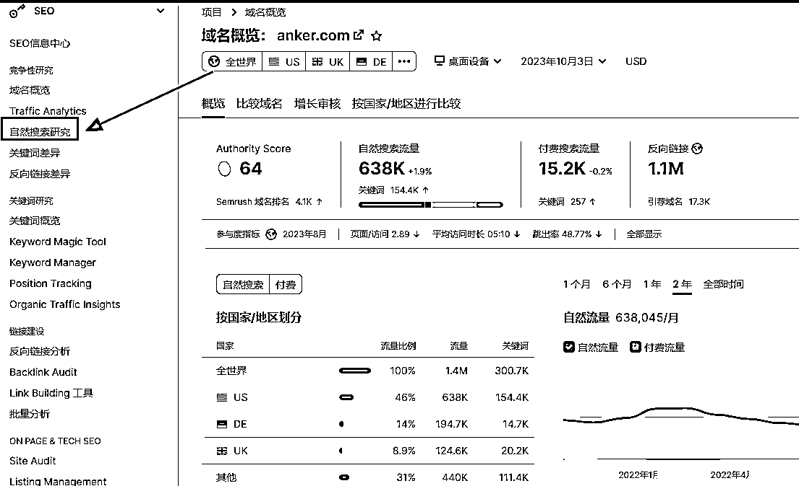
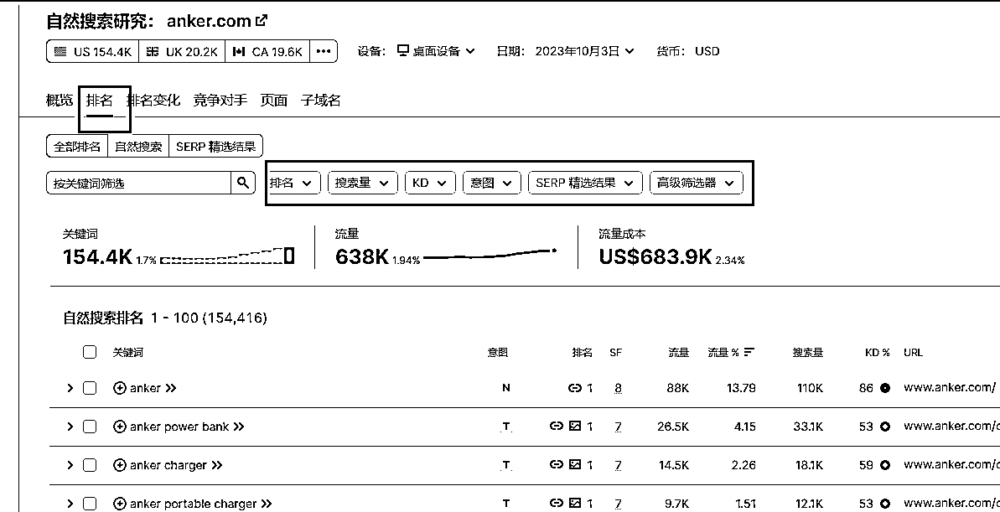
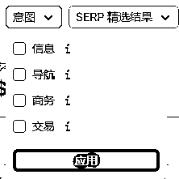
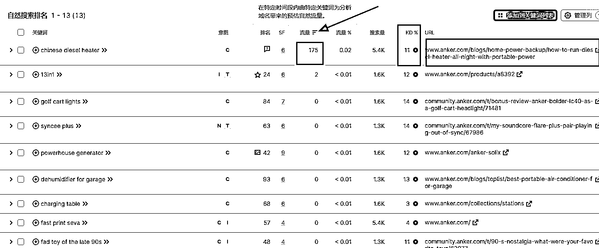
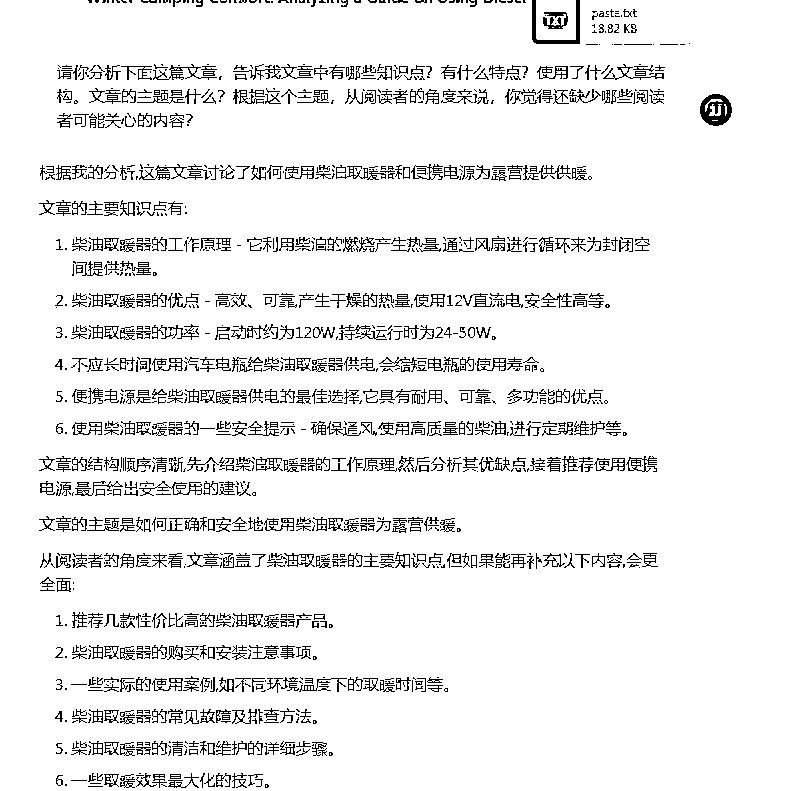

# 快速获取谷歌 SEO 流量的一个策略

> 原文：[`www.yuque.com/for_lazy/thfiu8/crv4ob96m96qe6f8`](https://www.yuque.com/for_lazy/thfiu8/crv4ob96m96qe6f8)

## (30 赞)快速获取谷歌 SEO 流量的一个策略

作者： 希声

日期：2023-10-09

新的网站刚起步做 SEO 的时候是最难的，一是因为网站自身没有权重，二是网站缺乏内容，缺乏外链。

要做好 SEO 的核心重点还是做内容，要能持续产出优质且满足用户需求的内容。

知道这一点之后，我们第一步是要做什么？

找关键词，找话题。

我们得先知道写什么内容。

那应该自己想吗？应该用工具挖掘话题吗？

都不对。

最好的方法就是看同行，看那些同行的网站上面有哪些获得了大量流量的页面，同时该页面的主关键词的难度却很低。

通过这个方法我们就可以很轻松地找到话题，也找到了满足用户需求的具体内容，直接参考这个内容写，那么结果就不会太差。

# **简略具体步骤**

第一步：先用关键词在谷歌上面搜索，收集至少十几个同行的网站。

第二步：然后把这些网站的域名一一放入到 SEMrush 里面，分析该网站下有哪些关键词为这个网站持续带来了流量。

第三步：用筛选功能，把关键词难度定到低于 30 分，然后按照流量大小从大到下排序。那么我们就可以找到许多关键词难度低，但是流量却不错的页面。

第四步：利用 AI 来改写或者仿写这些内容。内容一定要比原文更长，话题也要更多，如果有图片，那么就要配上比原文更多的图文。主打的就是一个字数更多，图片更多，话题内容也更多。

第五步：提交收录。然后不停地重复上面这些流程。

整个流程都很容易，最难的就是用 AI 分析和仿写这些文章。

难是难在使用 AI 的方式和提示词。

同时如果话题不够，也可以收集多篇类似的文章让 AI 分析之后再合并到一篇文章。

# **具体实操步骤**

下面展示下具体实操，假设我的网站是卖数据线，那我想的第一个同行大概就是安克了。

实际操作中建议找中小同行是比较好的，因为太大的网站太优秀了，有些网页即使做得不好但也有可能有个好排名。而如果是那些小网站，流量很少，但是却靠一两个简单的网页带来了巨大的流量，那这些就是最好的对标对象。

我先在 semrush 里面输入安克的网址，然后点击左侧的“自然搜索研究”。

然后点击“排名”，就能看到有哪些关键词为安克这个网站带来了多少流量。

同时我们在下面能看到一排的筛选功能。

我们可以这样设置，搜索量选择 1000-10000 之间，难度可以选择”容易“或者”非常容易“。

搜索意图是否勾选看个人选择了。这个功能是对关键词进行分类（比如是电商网站，那么做交易类的关键词肯定比做信息类的关键词有价值），但有的时候分类并不精准，而且勾选了之后也可能筛选出来的页面太少。

我这里就不勾选意图了，然后筛选出来之后，点击“流量”的排序，从大到小看哪个关键词带来了最多的流量。

可以看到，第一个词是：chinese diesel heater

这个词每个月大概为网站带来了 175 个流量，关键词 SEO 难度只有 11。 而后面就是该关键词所在的网页，我们就可以点击这个网页进去，然后查看具体网页的内容。

进入网页之后，我们就可以开始把这个网页的内容复制出来。

先统计下这个页面上一共有多少个单词，这里统计出来的数据是 3232 个单词。

真的是太多了……

所以再次强调，这也是为什么不建议一上来就对标厉害同行的原因，这些厉害的同行不但整个网站的权重很高，而且细分到每一个页面都做得非常优秀，这么一个话题，他们都能写出三千多个单词来，我们要打败他来拿到这个流量就难得多了。

不过这篇教程只是为了写出实操流程，就让我们硬着头皮继续下去。

做 SEO 要想拿到流量，本质就是要做出比现有的页面更好的内容，而什么是更好的呢？

我的理解就是内容更全，文字更多，图片更多，那最后的结果不就更好了？那谷歌就没有理由不给我排名更高了。

所以统计单词数量的目的是为了超越它的单词数量，统计完数字，我们就可以心里有个数，我们为了超越，大概字数就得写个 4k-5k 字左右，一般来说多多益善。

接下来我们就要开始分析文章说了什么，有哪些主题，我们可以补充哪些主题进去使得文章更加全面。

最简单的方法就是用 AI 工具了。

这里我用 claude 来展示：

分析完毕之后，我们就可以开始写文章大纲了。

到这里，整个教程基本就结束了。因为接下来的流程就很简单了，就是根据这个大纲来写文章，然后发布文章，提交文章的网址到谷歌站长工具。

在写文章的部分我们可以有两个选择。

第一个选择就是在 fiverr 之类的平台上寻找写手，把这个文章框架丢给写手，规定字数和关键词数量等其他要求，让他们写文章。

第二个选择就是用这个框架让 AI 来写。如果选择让 AI 写，建议最好是让 AI 分段来写。比如你可以这么提问：

你需要帮我写一篇英文的文章，文章的标题是《xxxx》，文章的框架是 xxxxx。现在你先写出文章出的第一个、第二个、第三个主题的内容。

等 AI 写完之后，可以继续要求：

非常好，现在请继续写出文章出的第三个、第四个、第五个主题的内容。

以此类推，直到整篇文章写完。

写完后可以统计下单词数量，不够的话可以选择段落让 AI 扩写，或者 AI 提问的时候可以多个要求，比如要求单词数量要多于 500 字（虽然我的实际测试发现 AI 并不会严格按照这个要求来输出）。

之所以要分段而不是直接要求写出全文，原因是如果一下丢给 AI 太多的工作量，AI 就会偷懒，每个主题只写很少的内容，比如每个话题就写一两句话，即使你要求了字数也没用。

AI 会控制自己每次输出的内容字符数，如果你要求太过分——比如要求输出的字数太多——他会有三个选择：无视，罢工，消极工作。

整篇文章写完之后，就是把文章整理一下，然后就可以发布了并提交站长工具收录。

发布的时候最好插入一下图片，如果对手的原文有五张图片，那我们就插入十张图片，如果对手有视频，我们也可以制作更多类似的视频，主打的就是什么内容类型都要更多，更全，更好。

# **AI 写作的内容可以吗？**

有的人会说，用 AI 写的内容谷歌不会打击吗？

我的看法是，AI 内容的大趋势是不可阻挡的，谷歌最终只能妥协，因为在 AI 内容越来越泛滥之后，判断内容是不是 AI 写的意义就并不大了。而且谷歌历来对于内容的要求也很简单：创作出来的内容对于用户应该是有益的，有用的。

所以 SEO 最终的排名依然是会按照用户的行为来进行投票，也就是你的页面有没有回答用户关心的问题，对于用户有没有帮助。有的话，那么客户就会在这个网页上停留的时间就会越长，互动的次数就会越多，最终助推这个网页的排名也会越高。

下面是谷歌大叔最近的一篇文章，更加详细地说明了谷歌的态度变化。

当然，我也并不是鼓吹 AI 写作没有任何危害，因为许多人为了快速产出内容，依然会选择产出大量没有什么价值的或者重复文章，那么这种做法最终一定会被谷歌惩罚。

如果你对于 AI 写的文章依然担心会受到惩罚，那么建议可以选择找写手来写，实际上我也是鼓励这么做而不是全用 AI 写。因为现阶段的 AI 产出的内容依然会出现很多的套话，废话，绕来绕去无聊的话，所以即使从用户角度来说，AI 的内容其实是不够优秀的。

最后，我们可以把整个策略总结为：找被验证过的蓝海话题+摩天大楼的写作方法。

找到被验证的蓝海话题的意思就是：找到 seo 难度低的关键词，同时这些关键词所在的页面已经拿到了流量。

摩天大楼的意思就是：你盖了一栋 100 层楼的房子，那我就盖个 200 层的房子，而且装修得更豪华，那用户就没理由注意不到我。

**如果分享对你有帮助希望点个赞哦~**

**————————**

**我在生财的其他文章链接：**

[跨境创业？新手下场前必看的赚钱指南！](https://articles.zsxq.com/id_n97vrpiahx5w.html)

[保姆级教程！注册 Midjourney 并开通付费订阅功能](https://articles.zsxq.com/id_gnm2x96buu9t.html)

[跨境电商的 ChatGPT 应用指南全集 v3.0](https://articles.zsxq.com/id_eh50cr4chn8a.html)

[1 天内如何启动电商/外贸/跨境网站？ChatGPT 来助力！](https://articles.zsxq.com/id_1azlnfovac6q.html)

[一个工具管理上百个社媒账号？指纹浏览器使用全攻略！](https://articles.zsxq.com/id_u2ub0iv60p1g.html)

[白嫖！3000 元的谷歌广告优惠你要吗？](https://articles.zsxq.com/id_sa1bz4dckqeq.html)

[Etsy 注册最新最全指南！一文回答如何注册、需要哪些材料、如何避免封店、如何申诉](https://articles.zsxq.com/id_590wii7jr4iu.html)

[批量做小红书图片/视频的方法-canva 批量创建](https://articles.zsxq.com/id_pnpv1g2m5fi6.html)

[一个 ChatGPT 高效使用技巧—编辑原有内容](https://articles.zsxq.com/id_5twbrd3idlbw.html)

[效率飙升！跨境电商领域的 ChatGPT 应用指南 v1.0](https://articles.zsxq.com/id_7wu5dtpkh4m4.html)

[《段永平投资问答录-商业逻辑篇》精华金句摘录](https://articles.zsxq.com/id_xrltpwocer4p.html)

[《段永平投资问答录-投资逻辑篇》精华金句摘录](https://articles.zsxq.com/id_2k5d3mdace44.html)

[《穷查理宝典》精华金句摘录](https://articles.zsxq.com/id_er7b3dm8lx7w.html)

[《零编程知识怎么在 AI 帮助做一个贪吃蛇的游戏》](https://articles.zsxq.com/id_nqxxc79whz1t.html)

* * *

评论区：

青锋徐 : 感谢分享

* * *