# 国庆线下实体怎么做活动？成交 5728 张 9.9 元体验卡，后期转化 524 万

> 原文：[`www.yuque.com/for_lazy/thfiu8/coeeh4m9imz0lry7`](https://www.yuque.com/for_lazy/thfiu8/coeeh4m9imz0lry7)

## (精华帖)(204 赞)国庆线下实体怎么做活动？成交 5728 张 9.9 元体验卡，后期转化 524 万

作者： 八子校长

日期：2023-09-28

明天就要开启国庆假期了，大家准备咋过呢？

对咱们生财圈友来说，其实这个节日热点也可以用来为自己的业务做赋能。

我就靠借助国庆这个节日热点策划了一场活动，成功帮助了一个有 100 多家店的大健康连锁品牌精准锁客 5728 位，后期转化变现 524 万。

接下来，就给各位圈友分享下，这个过程中我具体是如何做的，希望能对大家有所帮助。

亲爱的生财有术的同学们你们好，我是谁不重要，重要的是你认识我我能给你提供什么样的价值。

今年是我服务实体店门店的第 6 年，历经 1000 多天，帮扶抖音实体超 3000 家，私域社群超 5000 个，团购货品总类超 800 个，抖音矩阵门店团购超 10W+；

我公司主要服务的客户类型为：传统实体门店，品牌连锁，服务过的行业美业，大健康，微商，母婴产后，餐饮，服装，家具建材，眼镜，减肥瘦身，净水机，家政，教培机构等。

今天在这里把这套实体私域实战小白可复制的体系，我是如何赋能大健康品牌连锁 100 多家店在国庆节线下怎么做活动？通过快闪群+线下活动的形式完成精准锁客 5728 位，留客升单转化 524 万；

没有任何基础的门店又是如何在实战中解决：

1\. 建了一个群，很久了死群如何激活？

2\. 群里全是领红包的，成交时就不说话了？

3.健康养生行业如何精准引流？

4.如何快速激活老顾客进群？

5.如何跟顾客线上互动、种草？

6.如何发起线上团购？

7.如何吸引顾客到店消费？

等等问题，听一百次课程不如干一次，我来拆解一下一场有效的实体私域活动 3 个方面：

1\. 活动前的准备工作：（方案/主题/成交/时间/物料/内容）

2\. 活动中的执行：（建群-引流/破冰-IP 打造-成交-养粉-留升）

3\. 活动后的复盘：（集体复盘-总结经验-优秀表彰）

前中后保持这 3 个节奏，就能有续的进行，不慌不忙，收钱收到手软🤫，下一次就可以做的更好…

# 一、项目背景

该品牌是微商转型品牌，自有代理上万，2015 年成立至今已经是 8 年了，全国也是有几百家直营店，大健康产业主打产品是艾灸及周边养生系列产品。

疫情后线下门店顾客进店太少，线上流量获取越来越难，产品的动销与招商严重受阻，很多代理商都沉寂了。

在这样的情况下，看我们如何激活代理，打爆百店的国庆节活动，来，看我走过的路，都是一笔重要的财富，我把它分享给你。请你用 20 分钟读完，我们结一辈子的缘。

# 二、活动前的准备（方案/主题/成交/时间/物料/内容）

想要做一场成功的活动，好的活动运营方案也就成功了一半，当然细节也很关键，抄作业：

1、确定活动主题：百店同庆国庆艾灸体验节

2、参与对象：品牌代理商 159 家报名，中间有部分掉队，120 家跟上（每个门店收 500 押金，听话照做执行，全退）

3、设计好引流海报：小黄图，空白处放群二维码与抽奖礼品，门店自己准备抽奖礼品

4、线上线下成交方案及海报：线上海报与线下成交易拉宝。

5、线下活动物料：地贴，条幅，易拉宝，小旗，大转盘或红包墙等，活动氛围要直接拉满。

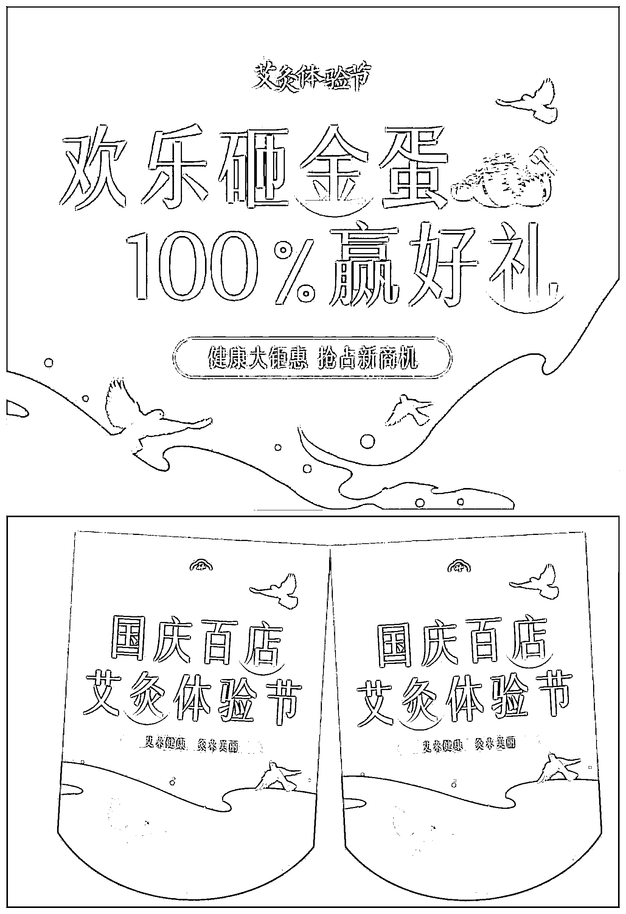

6、抽奖礼品：线上线下都需要，建议是不要用自己店里卖的，此抽奖礼品 200-500 预算，每个门店根据自己的情况提前准备，线下活动抽奖礼品在布置时就提前摆放在线下门店；

7、活动运营内容：建群-引流-破冰-IP 打造-成交-养粉-留升。所有的成交都是精心策划的。

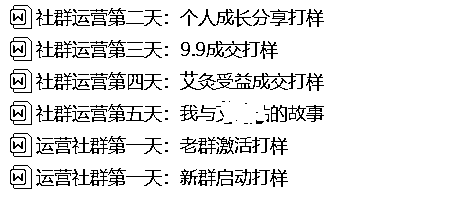

8、活动时间：9 月 18 日 -10 月 7 日结束，实战引流 2 天，线上社群运营变现 5 天，养粉留客升单 7 天

负责该项目，我们一共是主操盘 1 位，5 位教练老师，把报名参与的门店分成了 10 组，每个教练带 2 组。

以上所有该要准备的物料，收的押金，分组名单，都在启动前的启动会议上，做好 SOP 操作的说明以及配合的注意事项。

其实门店老板开店做生意，对于社群是没有概念的，经过调查很多老板都不会玩社群，甚至都没有听过社群的课程。

正式启动前我们给门店上了两节理论课《门店社群正确运营流程》《如何打造 IP 设计社群走心分享》，上课同时，门店配合激活朋友圈，整理自己的潜在客户与目标客户。

# 三、活动中执行：（建群-引流/破冰-IP 打造-成交-养粉-留升）

我们这次活动目标很清晰，通过国庆的活动，引流同城周边的新客与老客进店体验 9.9 元艾灸，激活沉睡的客户，你来店里 3 次，总能成交或升单咱们的卡项。

**1、激活私域唤醒通讯录**

目的为了提高朋友圈关注度，为后面引流做好铺垫，这是建立私域流量池冷启动朋友圈，必须要做的一步，比如

让朋友圈的用户参与进来，正确的给与奖励，也是引流客户进店的一种方式，到店领取礼品，开实体店奖励一定是到店领取。

**2、建立门店顾客社群（定位，群名，公告，群规）**

每个门店建立一个社群，该社群定位就是一个快闪活动群，如果有老群的直接用老群，没有老群的用新群，一共建了 138 个群，初次建新群，前面的 20 个人把自己的拉拉队水军先拉进，然后在开始进行引流。

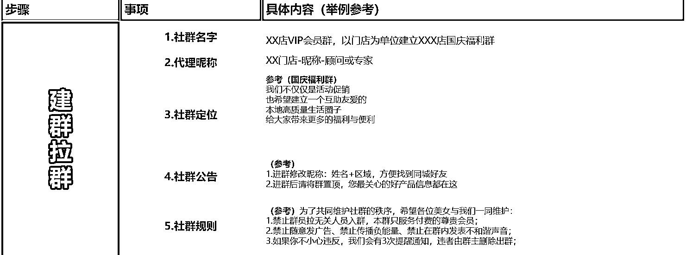

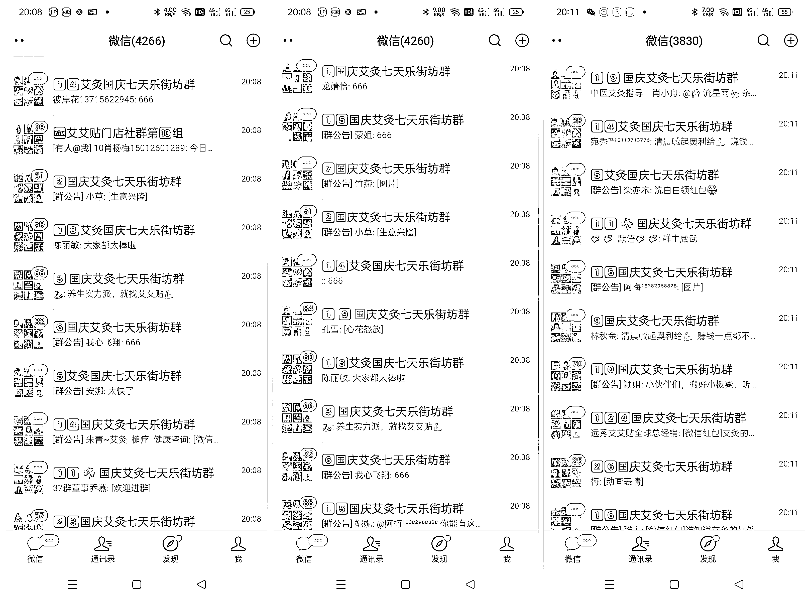

**3、引流邀请裂变**

引流一般通过福利引流，知识引流，实体门店一般福利引流就可以，通过自己的朋友圈引流，别人的朋友圈引流，一对一邀约与群发等渠道，当群满了 200 人之后，回复数字邀请用户进群，文案在此就省略了哈

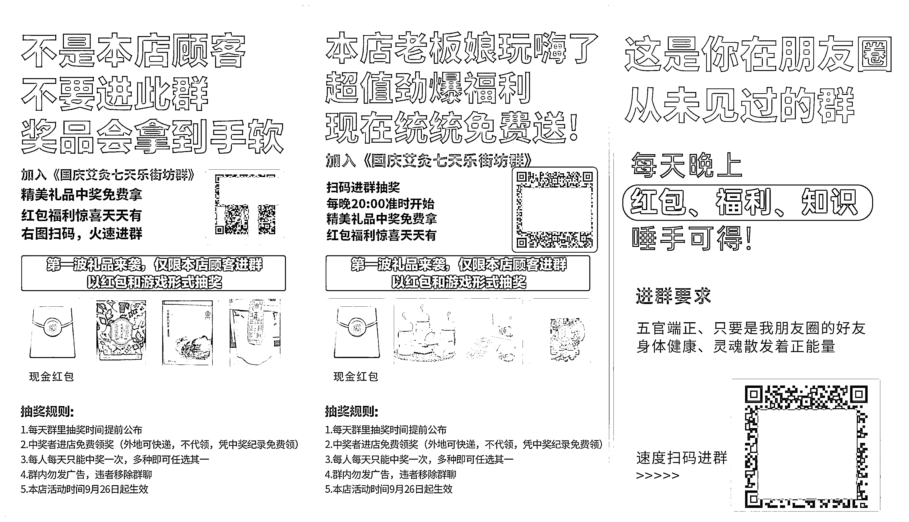

群里进来了不少人后，该怎么办一个群公告告诉我们群友，本群是干什么的，发个小红包，预告我们接下来的活动：

当群里引流人数太少，用群员邀请群员免费送礼品方式，可以是引流时裂变，也可以是运营第 1 天后裂变，比如我们则是第一天运营之后开始进行的裂变：

1、邀请本地好友 3 人进群送一盒价值 10.9 元艾草手口湿巾 80 抽装；

2、邀请本地好友 5 人进群送一盒价值 10.9 元艾草手口湿巾 80 抽装再加一盒价值 25 元艾草润唇膏；

3、邀请十人以上送一盒价值 35 元艾草足浴香包，再加一盒价值 19.9 元艾灸精华贴；

引流 2 天，裂变 1 天，引流进群顾客达 14787 人，138 个群。

**4、社群运营（种草，IP，成交锁客大礼包）**

一个社群要打造 IP，有三个 IP 要打 造，店的 IP，店主的 IP，运营者的 IP。一个有结果的社群，至少要用 5- 7 天打造价值，信任和参与感。

运营第 1 天 破冰，拉近距离，第一天不宜分享什么内容，而是要大气证明自己，发放 3 个现金奖，

3 等奖：9.99 元红包  2 等奖：19.99 元红包 3 等奖：29.99 元红包

抽奖之前，在群里说：想要的伙伴请发 +1，或者 666，满 10 个开始，制作气氛。

参与方式要简单的手气最佳，最后一个 29.99 元则是有奖问答：第一个正确说出我是开什么店的奖励 29.9 奖励，以我手机截图为准哈，这样就在游戏中把广告告诉了群主是做什么的

整个过程大概持续了一个小时，整体气氛和节奏，在结束时，免费送礼品，怎么免费送，邀请进来的人一定要加群主；

1、邀请本地好友 3 人进群送一盒价值 10.9 元艾草手口湿巾 80 抽装；

2、邀请本地好友 5 人进群送一盒价值 10.9 元艾草手口湿巾 80 抽装再加一盒价值 25 元艾草润唇膏；

3、邀请十人以上送一盒价值 35 元艾草足浴香包，再加一盒价值 19.9 元艾灸精华贴；

第一天不宜太猛，以自我介绍，烘托店主，现金奖品，礼品，大气，为了制造顾客的好奇和继续参加明天活动兴趣。

在运营的时候：要放得开，不要把群员当顾客而是当朋友来对待；

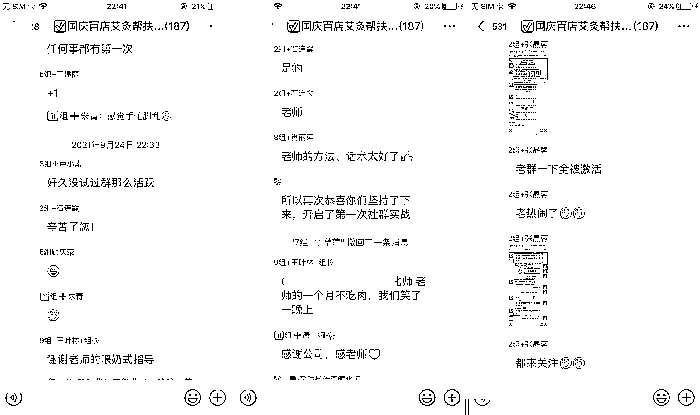

运营第 2 天 活跃气氛+打造个人 IP，活跃气氛需靠抽奖和造势，以及和群员调侃。

个人 IP 打造**制度话题引起共鸣**

通过分享自己的个人故事，分享时有图有文，每次不要超过 3 行，这样阅读起来更舒服，特别新进来的群员都不认识你，那故事则告诉群员我是谁，我是干什么的，我都经历了哪些创业经历，可能某个经历就与群员共鸣啦。

这样做的目的就是打造信任度，吸引关注，最后成交更简单

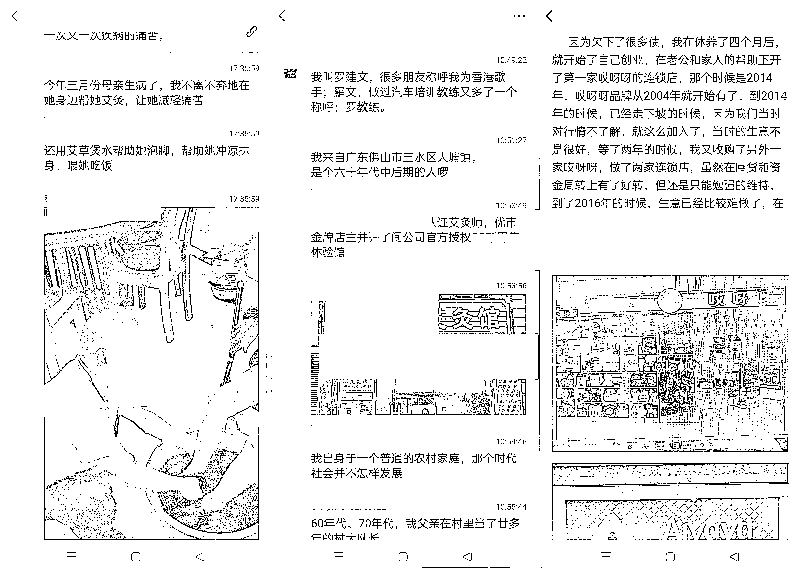

故事要真实，不需要华丽的语言，接地气就好，哪个实体店老板没有一个打动人的故事呢？谁都有经历，分享完故事后，群员对群主对这个群的评价，直接上升一个维度

有些群里，听完故事就要加入，直呼这个方法太好啦，从感兴趣到买货，到加入代理，群友们都感动啦，开始下单；

运营第 3 天 大健康养生专家身份塑造，成交 9.9 元的活动大礼包，坐灸 3 次，每次 45 分钟，每天开场 8 点发红包和抽奖，是为了培养大家的到时间关注习惯，分享内容知识和互动，是为了打造个人 IP 和输出价值，建立社群的关注度，为成交做铺垫。

先发红包雨：

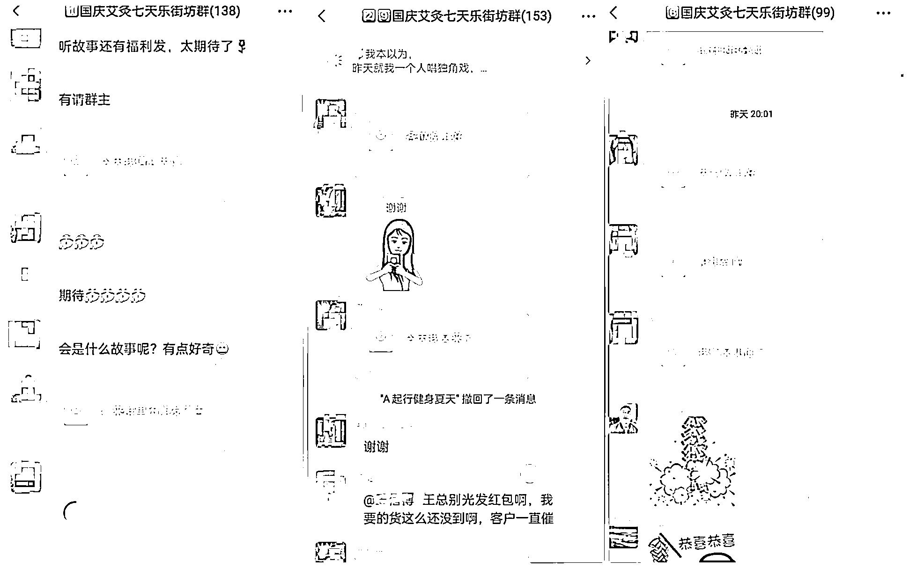

红包雨之后，问一句：伙伴们在吗？在的请发 +666，你就发现有好多人发 +666

然后：准备抢第一个奖品——价值 19.9 元的艾草精华贴，然后一抽奖前，产品塑造图片+文字

听好规则，今天我无意间在朋友圈看到朋友发了两个猜一猜，我猜了好久没猜出来是什么

看看大家能不能猜出来，第一个猜出来的，并且猜对的就把这个精华帖奖励给你，看图猜物哈，考智商

大家也猜一下，这是什么？

游戏说出图片上最多最全的奖励，找到一张自己前台的照片或者自己的货架都可以，来看看怎么玩？大家猜得非常火热，也在群里植入了广告；

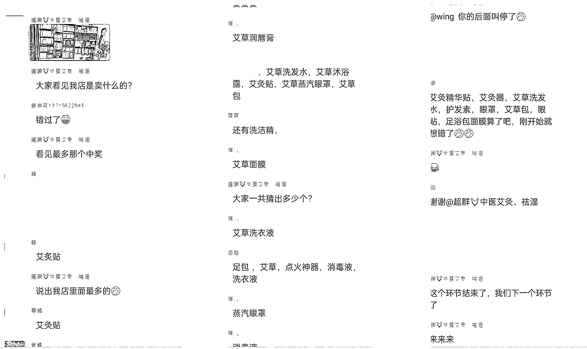

互动完分享健康养生的知识，抛出成交，直接发吗？不要，先猜价格

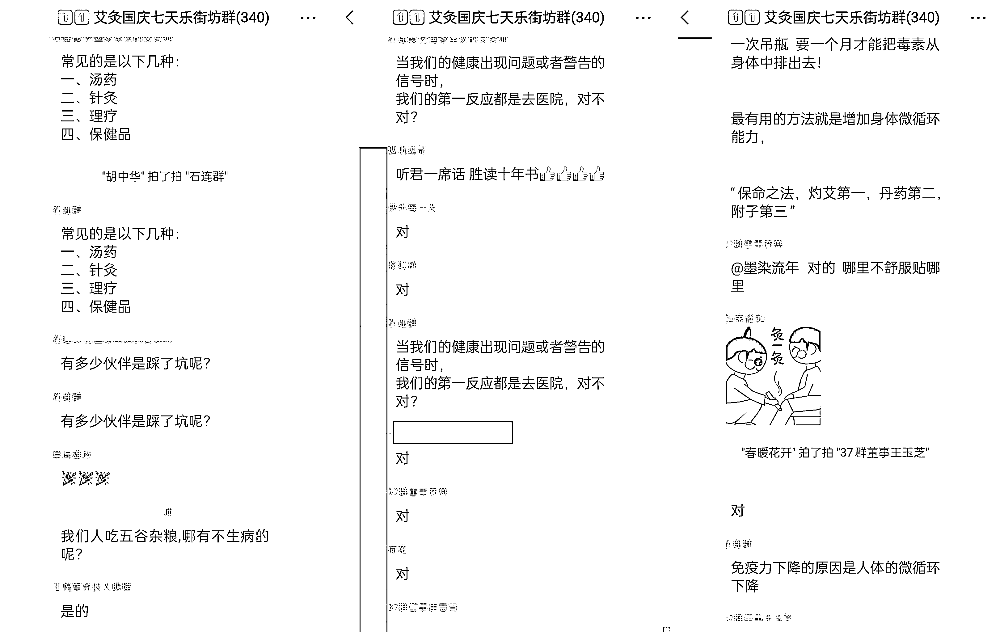

坐灸的套餐一共是 3 次，每次 45 分钟，大家猜一下需要多少钱？猜对或者猜的最接近答案的就送一个名额给你！！

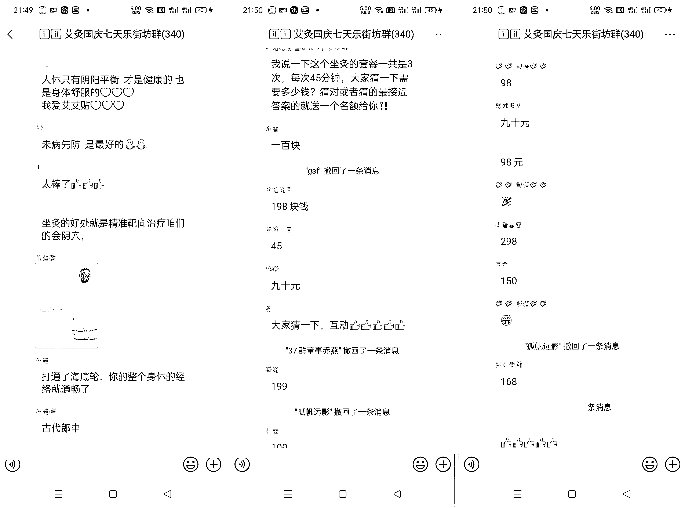

保持群里的关注，让群员把广告看完，群员心里的价格是多少，最后公布只要 9.9 元，还可以 3 次，每次 45 分钟，发起接龙。

第一天的成交属于自动成交，不做任何的逼单与私聊，就是接龙，晒成交的图在群里。成交的齿轮就开始转动啦，晒单，接龙根本停不下来...

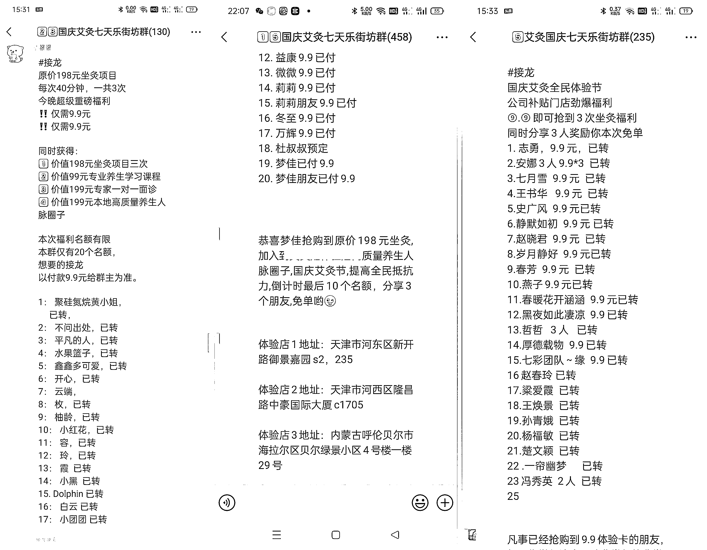

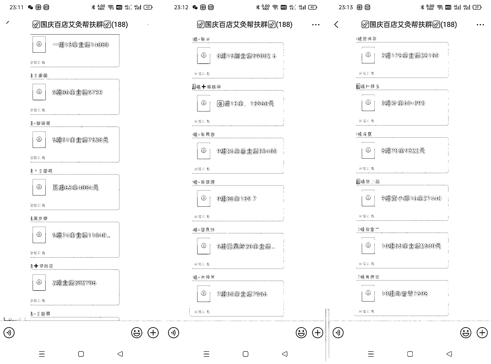

运营第 4 天 案例分享，艾灸带来的好处，群主抽完奖，互动完，邀请群员来分享艾灸带来的好处，继续成交 9.9 元大礼包，筛选 9.9 元建立收费社群为了锁定顾客，变成朋友，提高复购与升单，带动裂变，我们要的是铁杆，有了铁杆，一切都会有；

告诉大家，有个更刺激的小游戏，大家要不要参加？

他们说：参加

游戏规则：等会我发个包，手气最佳得 50 倍奖金！！！

发个 1 元 10 个红包，写上：手气最佳 50 倍奖励

用计算机算出来是多少钱，截图发群里，然后艾特中奖者，私信我立马转账给你， 用转账形式发给对方，恭喜你中奖，50 倍奖励已发、

一边玩一边分享价值知识，50 倍玩了，可以 100 倍，200 倍

且今天的成交包含着裂变，只要你愿意分享三个朋友，亲戚也好，朋友也罢，同事也行

一律统统奖励：给你的 9.9 免单，昨天的接龙继续发群里，把已经购买的晒单发起继续成交

#接龙

国庆艾灸全民体验节

公司补贴门店劲爆福利

⑨.⑨即可抢到 3 次坐灸福利

同时分享 3 人奖励你本次免单

老少皆宜：童叟无欺！手速要快

运营第 5 天 继续成交筛选，建立 VIP 群深度运营

**你的群别人在里面猛发红包，怎么样可以做到？**

每人发一个 1 元的红包，发 10 个自己抢到手气最佳[第 1 个凭我红包截图]，我给你翻 200 倍还你，第 5 天要主动出击私群群员，是否有看到这个活动，一对一的卖卡；

群员已经养成了每晚 8 点群里参与，红包雨，互动游戏，

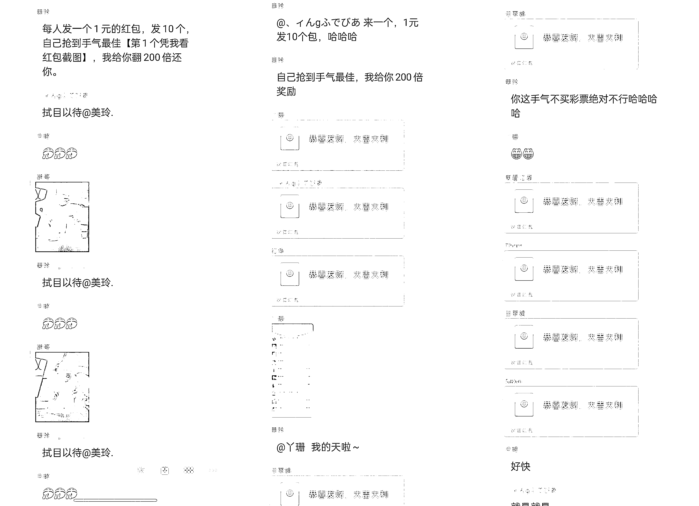

社群的价值是建立信任，而大部分的成交都是靠主动销售，在群里就是做了通知，告知群员我这个活动，当然最后一天放出名额之后，逼单，群里晒单倒计时，发接龙，把所有成交的全部自己接上，留 5 个空的。

修改群名比如：离活动结束倒计时 4 小时，3 小时，整点提醒🔔

主动执行，听话照做，成交靠的也是店主自己，也考验了咱们平时做生意的态度，5 天下来成交 3 天，很多店主精准锁客大几百人，9.9 元卡 3 天锁客 5728 张，最高的卖出 650 单，最低的也是 20 张以上；

社群运营有没有方法，其实每天一个完整的社群运营分为 8 个步骤：

**1.群公告预告**

每一天预告都是提前 4-6 小时在自己的群里，群公告，结尾处一定要引导群员回复，自己可以先回复三次刷屏一波，群员看到以后也会引导其他人群员回复。

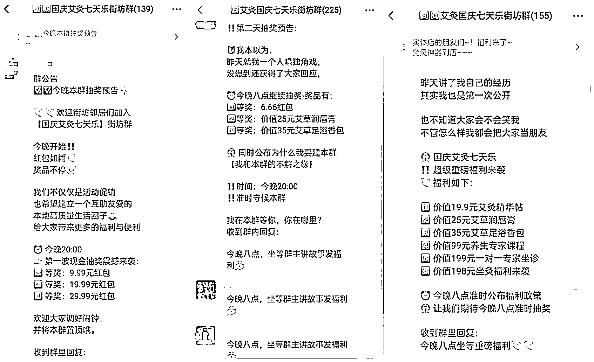

**2.倒计时**

红包上写字倒计时多久，写在红包上，然后多发几个，根据抢红包的人数来调整个数，可以看出关注度。

**3.红包雨开群**

最少发 5-8 个，当然越多越好红包不是全部发一个数目，而是要根据抢完的人数和速度来叠加，比如，你开始发 3 元 8 个，当你看到抢完了就发 4 元 15 个，然后一直加到 100 个，不要全部都发比如 20 个 30 个，不然有些人抢不到就逼逼逼。

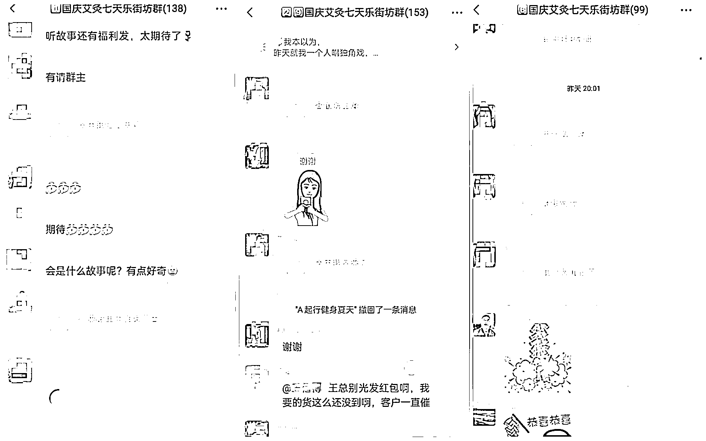

**4.互动游戏打头阵**

（互动游戏是由简单到复杂，多用软植入广告的方法，可以把你的广告软植入进去，比如，拍几张你店里的图片或者视频，让大家看图说出里面东西最多的中奖，他们就会把你图片里面的东西全部都说出来了，这样就不用你说你店里的干嘛的了，软植入了广告）

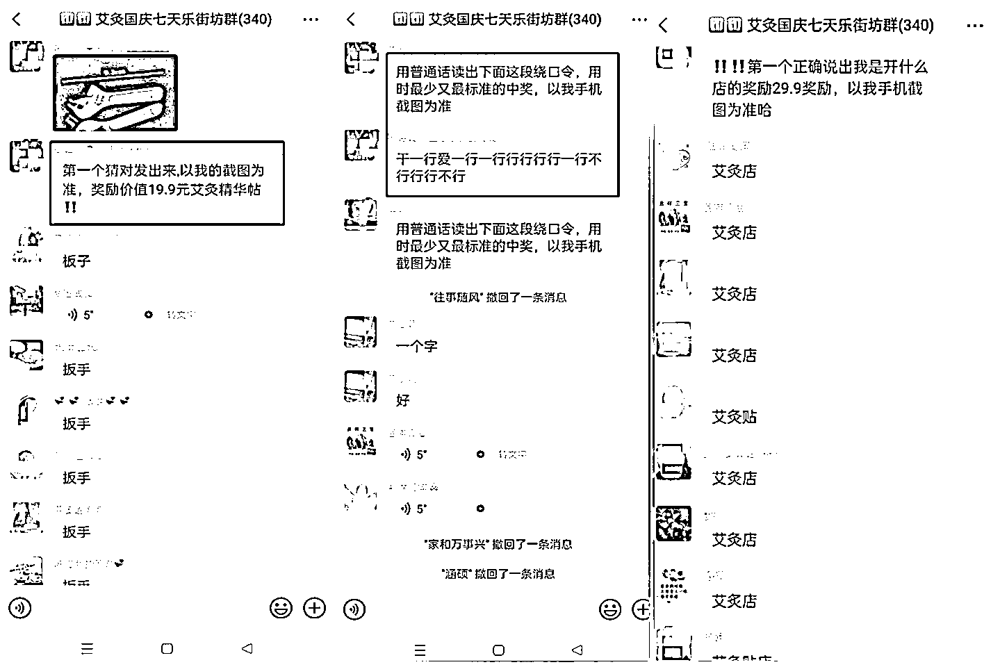

**5.讲你要讲的事情**

**6.结束红包**

**7.明天预告**

**8.闭群**

按上面这个节奏走，不会出错，每次我们都会把每一天的内容做好打样，品牌实体店主只需要复制粘贴到自己的群里，零基础的老板都可以把社群玩得很嗨

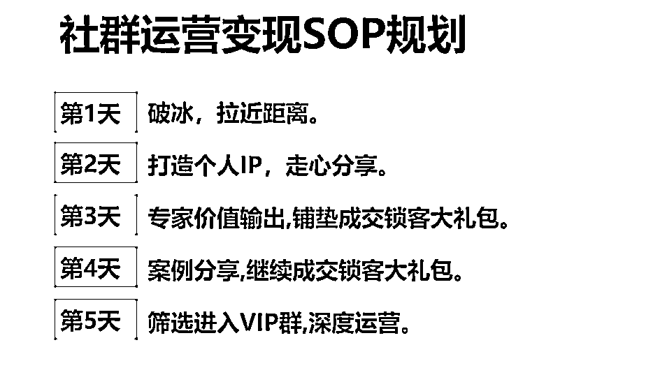

我们 6 个教练老师每天下午 3 点会在指令群里打样，晚上 20 点每个老板准时在群里进行复制粘贴运营，晚上 22 点统一进行复盘，手把手带他们操作；

可能我们学了很多的理论都不如实战一次，收获不止一点点：

**5、引流进店（深度服务，线下沙龙，转化升单）**

店主们跟完成了线上的成交后，下一步约客户进店体验在国庆节期间，同时有条件的组织线下的沙发，线上成交 9.9 元人数超过 40 以上的，鼓励老板建 VIP 群，没有到的直接还在原来的群，毕竟免费群死，付费群活，把时间留给更有价值的人；

线下关键的细节，活动氛围是否到位，物料都要提前布置好，员工成交话术提前培训

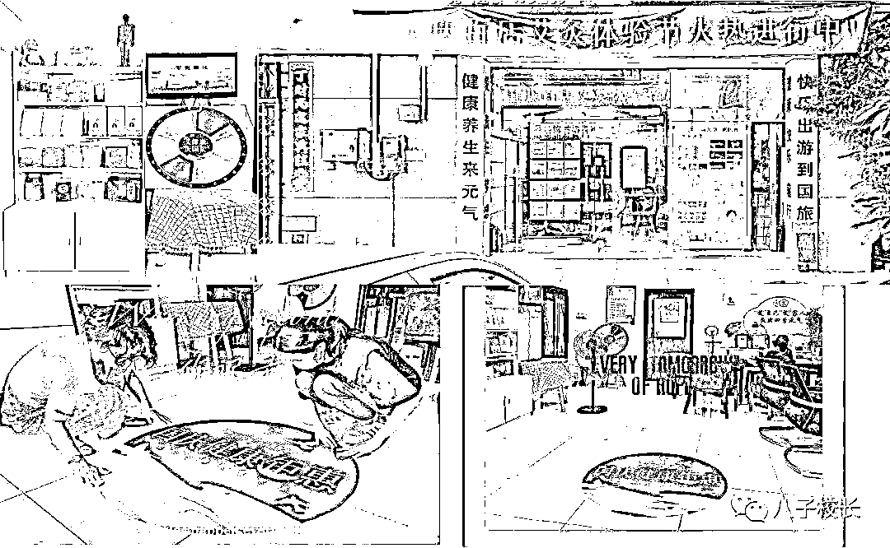

**VIP 群里如何运营呢？**

分享健康养生知识，分享养生案例，每周互动个 2 次，当然在此活动期间我们可以全力支赴约 9.9 元先来线下

9.9 元只是开始，月卡 298 元，卖货，招代理才是终点，所以积极的约起来，店小人少约点，同时拍下这些到店视频晒到群里，也吸引成交一直在持续；

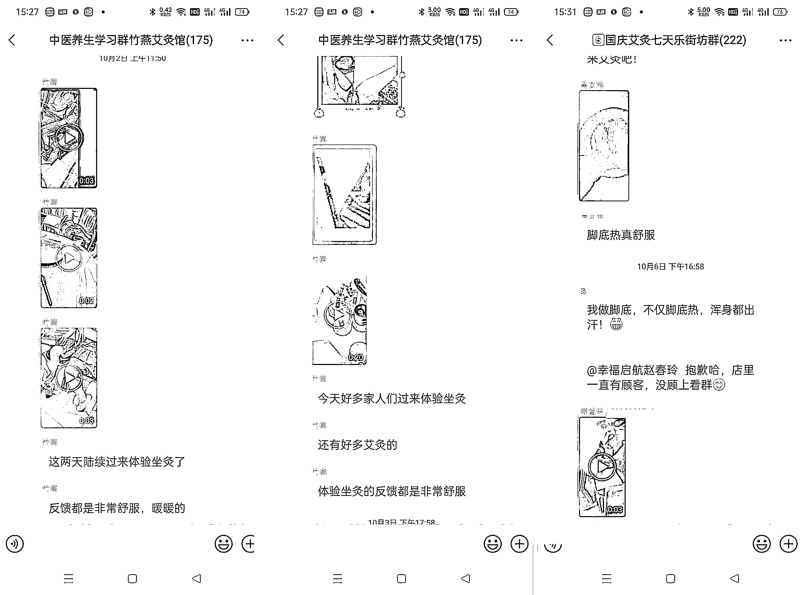

留客升单，老板们也开始收钱收到手软，办月卡 298 的，直接拿产品的，做代理的，停不下来…

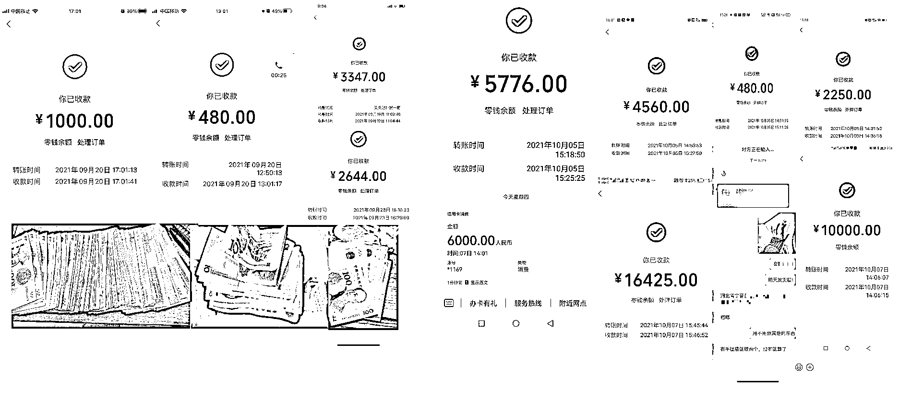

只要有客户进店，最擅长成交的就是店主自己啦，在加上之前社群里的信任与 IP 打造，真是收钱收到手软

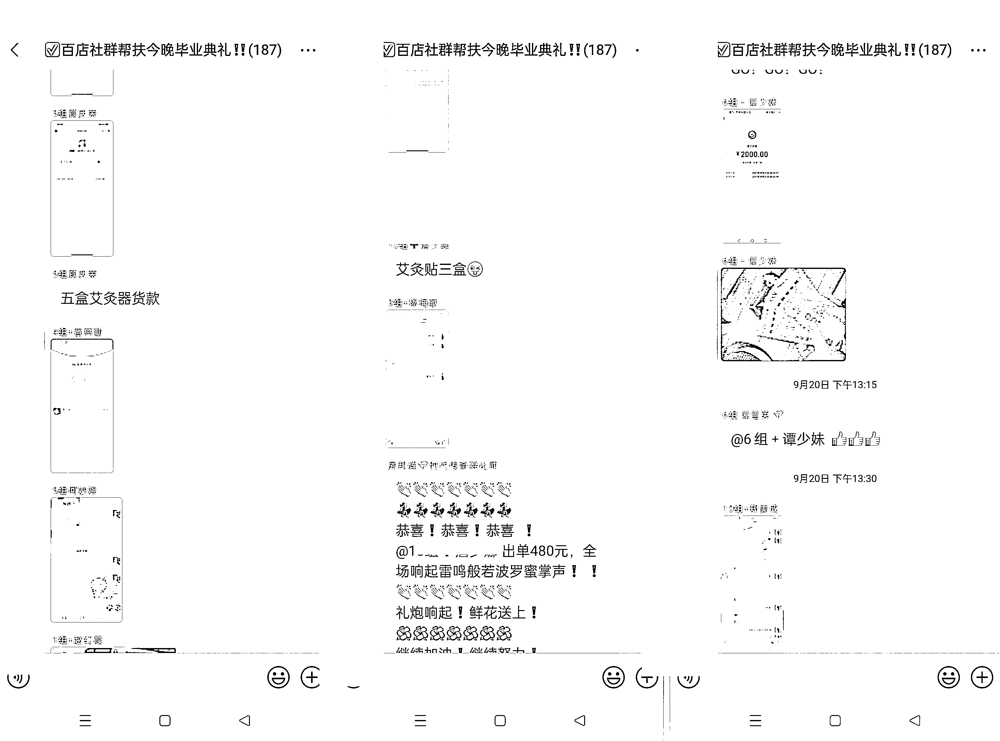

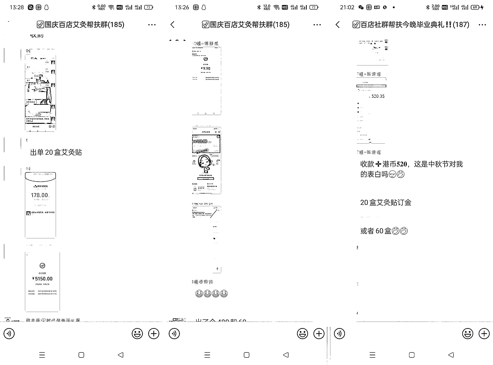

**6、会员群教育，沙龙成交代理**

有部分店主，做了线下的沙龙一天把 9.9 元的客户约上 10 个以上，打造一个养生专家到店坐诊，穿上大白掛，把脉然后开调理方案，成交。

9.9 元到店，没有用过艾灸 10 平米不到的一个车库，成交 30538 元转化率 72%，线下门店都忙疯了；

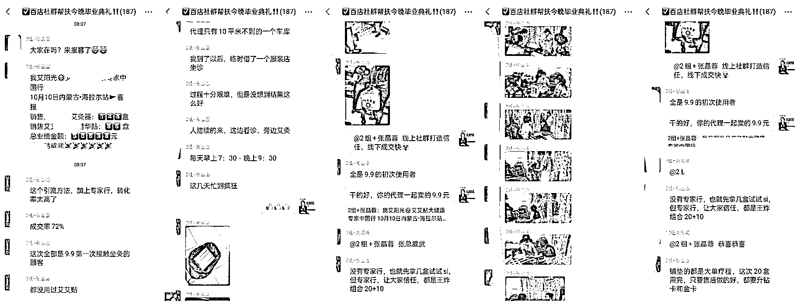

对于没有建立个门店社群，第一次跟着实战社群的他们，每个人收获满满：无复盘不活动，最后就是活动复盘

# 活动复盘（活动成果，改善不足）

5 天线上运营+线下的 7 天活动，总共 12 天，都拿到了什么样的成果呢？总业绩 524 万，平均 120 家门店全程参与，中间有掉队了 20 几家，前 30 名门店业绩排名最高 28 万，最低 4.6 万

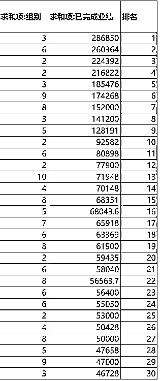

对于没有完过社群的老板或者没有建立实体店社群的老板来说，收获与影响都很大，没有任何基础的情况下，完成这种高强度的运营。

而对于一个操盘运营手来讲，没有优秀的团队与品牌方的配合，老板们的执行，也是无法达成的

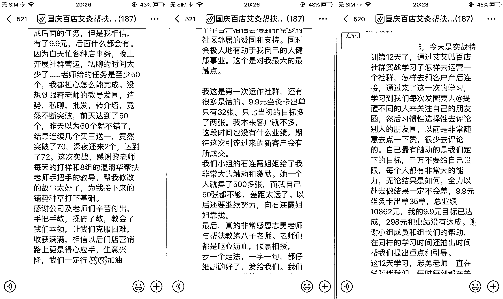

本次活动不足：

1.时间有点久，门店在后期转化时有些力不从心，在加上客户进店后，又要服务又要转化；

2\. 某些门店人手不足，承接流量时，没有时间来沟通；

3\. 想做沙龙的门店，没有提前报公司的活动，做准备，申请专家到店；

4\. 线上社群的继续维护，对于某些店主来讲没有内容创造力，没有时间，最后又变死群了；

如果你一囗气阅读到这，也想认识一下我，我可以共享这份聊天剧本，直接复制可用，以上是关于大健康养生馆社群运营变现的一些实战方法

**此处也已经写完，我们一起做个总结，于我而言我是一个操盘运营的角度，我做的不是代运营，我想对实体商家说：**

1.做为一个老板无论干什么行业，特别是有复购性的产品，都要建立自己的门店顾客社群，平时就可以完成流量的积累，社群运营平时的养群大于变现。

群里每成交一次，信任度下降 30%，不能只管取钱不管存钱，很多群为什么干废了，就是只想成交，没有重视平时的维护。

2.一定要打造自己的 IP，有了 IP 不断筛选铁杆，带着铁杆赚钱，成为合伙人，利益共享才能走的更远；

3.跨界营销，你的群里可以卖水果，土特产，不止产品本身，但是要以谋福利的角度，不赚钱甚至亏一点点，让群员觉得你老板是真的大气，这个群舍不得退。

最后，老板不要干老板的活，要干搞流量的活，会用互联网的平台与工具，抖音公域平台获取流量，打造一个抖音 24 小时上班的业务员，天天在同城发传单，卖团单或引流导入私域，做老板的老师，把门店做成平台，更轻资产的创业；

我想对操盘运营者说，为什么我能做好，而且变现 524 万，这套体系变现我已用于很多行业，变现过千万，**授人以鱼不如授人以渔：**

1\. 同频会与启动会在实战前，很重要，统一行动，统一目标，特别是品牌创始人或负责人，这样推动起来才更快；

2\. 有经验的团队带队导师，能在小群里积极的解决问题，调动店主的积极性；

3\. 有效的奖励 PK 机制，每日执行复盘，每日工作安排，每日 PK 积点公布，每日晨会组长复盘，每日教练老师复盘，做到有问题及时解决，PK 氛围也是有效促进执行拿结果的良药，所以要交押金；

4\. 一套可复制傻瓜式的私域变现系统，不要让实体老板自创，思考，只要 1:1 复制，粘贴，就能收钱，越简单的方式才适合实体店老板，当然城市不同老板圈层不同，所有方法与工具可以优化；

5\. 心法大于干法，给到门店术的干法，道的层面心法更是重要，否则实体老板会掉进方法里，没有从意义上反思生意不好的原因；

6\. 门店如果没有流量造血能力，地理位置不优越不能每天保证流量进店，又不做抖音获客，也不地推，更别提异业联盟，真的在好的方法与工具，也都是白搭，神仙也都救不了；

因此，2021 年我公司开始做公域流量如何精准获客，开启了我的抖音本地生活之路，累计目前服务过的门店超 3000 家，还在持续增长中，专注在休娱大健康细分，减肥细分，头疗养发细分，做深耕；

所以无论是单个门店还是实体，一定要在抖音，视频号通过短视频发足够多的宣传单，引流进店，加私域内容运营，做好离店后的经营，打造好 IP，如此循环🔄在将这套体系复制，招商加盟赋能，能不裂变吗？

叭叭叭叭，欢迎行业专家一起交流交流，我是八子校长，7 期的生财同学，要不要认识一下呢？🥰

最后感谢生财有术平台，也特别的感谢你的阅读，让我们能在此相遇。

* * *

评论区：

段不断 : [玫瑰]
八子校长 : 节日快乐🎈
广州摄影师林海盐 : 分享好细致呀，我看完啦，收获贼大！！养群大于收钱，跨界合作卖不仅仅只是一样东西，这点真的是太棒了。
八子校长 : 🌹🌹你的收获是我不断实战帮扶实体坚持的能量源泉❤️
书豪 : 棒棒的
黄紫 : 好细致，收获满满
八子校长 : [玫瑰][玫瑰]节日快乐🎊
八子校长 : 我也看过你的分享，也是实力派

* * *