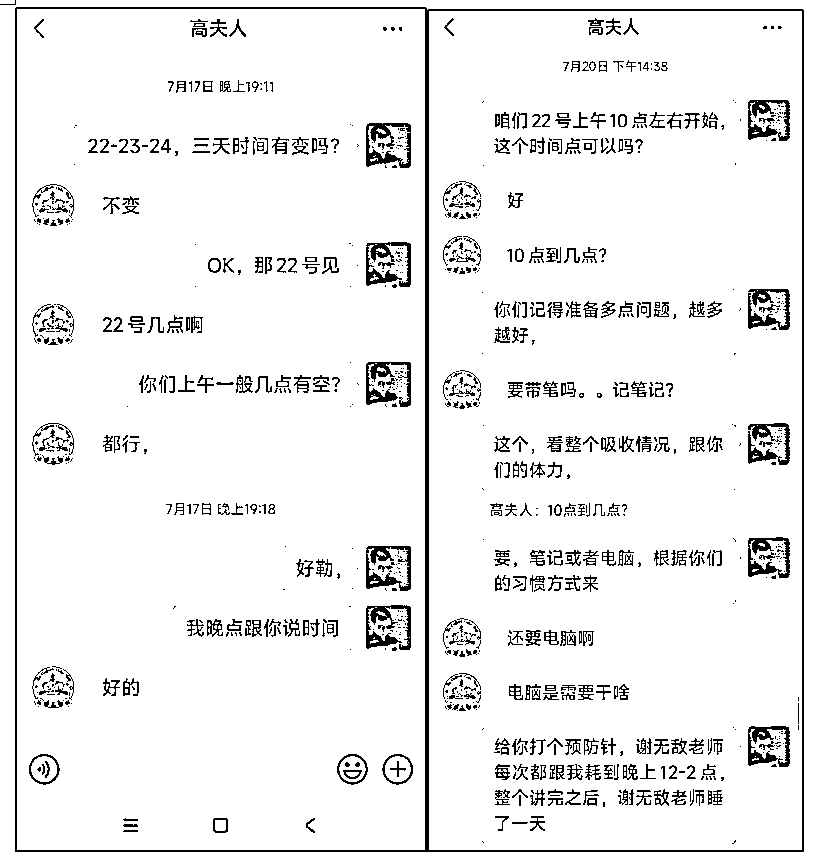
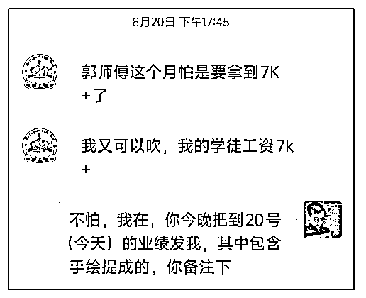
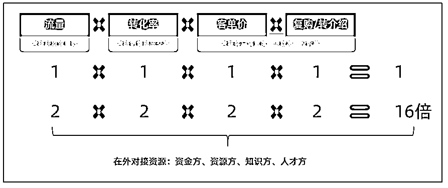
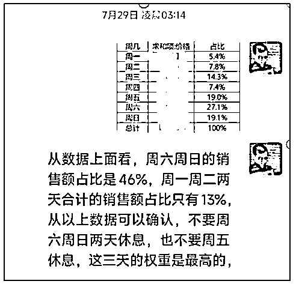
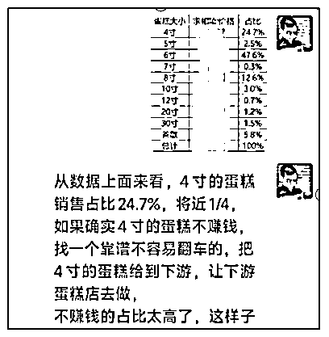
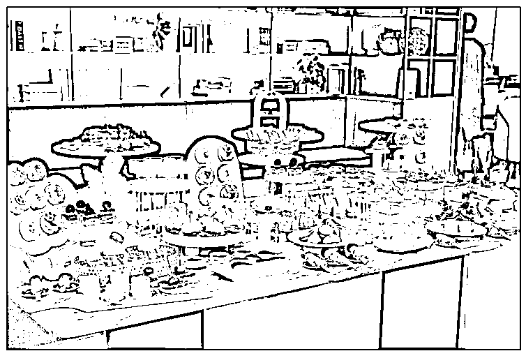
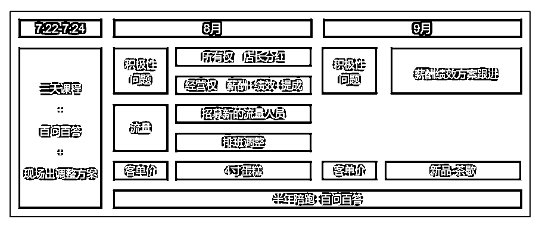

# 如何通过 2 个月时间，让利润变 5 倍！

> 原文：[`www.yuque.com/for_lazy/thfiu8/lehqxufglbzfaqll`](https://www.yuque.com/for_lazy/thfiu8/lehqxufglbzfaqll)

## (25 赞)如何通过 2 个月时间，让利润变 5 倍！

作者： 深圳刘宁培

日期：2023-10-13

大家好，我叫刘宁培，

一名企业咨询顾问，从业时间 5 年，年深度服务企业 50 家+。

生财第二期开始续费至今的老圈友，编号 1748。

给大家分享一个近期案例：如何通过两个月运营调整，让一家蛋糕店的利润快速提升 5 倍。

其中提到的部分方法论，可以用到各自行业，希望对各位老板有帮助。

### **一、沟通痛点及需求**

今年 3 月份跟谢无敌老师签了半年的陪跑服务，**大概用了 3 个月的时间，就让谢无敌老师公司的业绩直接翻了 3 倍。**感兴趣的圈友，可以看之前的文章了解内容👇🏻

老板必读｜如何让公司 3 个月时间，业绩翻 3 倍：[`t.zsxq.com/11gnhuyp2`](https://t.zsxq.com/11gnhuyp2)

同样也是上海的圈友高夫人，看到谢无敌老师的状态及业绩变化以后，也找到了我。

她简单提了自己的需求：**蛋糕店业绩越来越好，以后不用这么忙，可以休息休息，最好跟谢无敌老师一样......**

我说没问题，我可以让你以后不用这么忙，还能让你的业绩翻倍/利润翻倍！

接下来就是拟合同，签约，付款，开启半年 8.6 万的陪跑服务。

### 二、第一次落地交付

7 月 22 日—24 日三天的时间，我飞到上海给高夫人做授课的落地交付+调整方案。

我的落地交付，一开始会有 3 天的线下课程。

授课过程中，会讲到不同板块，再根据公司的实际情况来调整股权激励方案、薪酬激励方案。

（约在了绘素坊的新中式家居空间授课）

#### **公司运营，财务先行。**

在讲到第七个板块-薪酬绩效时，我需要深入计算整个门店的盈亏平衡点、每个部门的盈亏平衡点以及每个员工的盈亏平衡点。

**我还要测算整个公司完成业绩的利润率，这些数据对于了解公司的盈利能力至关重要。**

同时，我需要细致地分析各类财务数据，包括产品财务数据、渠道财务数据、客户财务数据以及团队财务数据。

**这些详尽的数据是制定薪酬绩效调整方案和运营决策调整方案的关键依据。**

只有通过这些精准的财务数据分析，我才能做出有据可依的薪酬绩效调整方案、运营决策调整方案；

（线下课程交付内容）

当计算到高夫人蛋糕店的利润时，我着实吓了一跳，我跟高夫人说：你每个月就赚这点钱，就敢花 8.6 万找我？

**（真实利润这里就不说了，见谅哈，暂且说利润是“1 蛋糕”）**

好在，3 天课程下来，以及详细了解了门店的所有情况后，我确定有把握，**能让高夫人的蛋糕店，每月从利润“1 蛋糕”变成利润“3-5 蛋糕”。**

### 三、做了哪些调整，短短 2 个月的时间，利润变为 5 倍！

#### 1、**所有权层面：**

老板要想脱身，就要给 CEO/店长做股权激励/分红股激励，无敌老师就是通过这个步骤，让自己从知识付费业务里面抽出精力来。

在这个课程中，我向高夫人讲解了股权激励的好处。

高夫人也表示，愿意根据公司的利润表，制定对应的股权激励/分红股激励方案。

通过股权激励的方式让店长成为蛋糕店的所有者之一，从而将店长的个人利益和蛋糕店的利益紧密地联系在一起。

**通过给店长分配一定比例的门店股份，让她成为门店的合伙人，共同分享门店的利润。**

**同时，设定了不同的业绩目标，以及店长可以获得的阶梯分红比例。**

这样，店长清楚地知道自己的努力将直接影响到自己的收入和蛋糕店的利润。店长为了自身利益，也会更加积极地提高门店的业绩，并获得更多的分红。

#### **2、经营权层面：**

#### （1）薪酬绩效的调整：

在此之前，蛋糕店的店长和员工都是按照固定工资拿薪水，没有任何绩效奖金或提成奖金，简单来说就是**旱涝保收。**

这样的薪酬结构会导致员工缺乏积极性和动力，更别提是否愿意无偿加班了。

因此，我根据公司每个岗位的属性、工作量，重新设计了薪酬体系，引入了绩效奖金和提成奖金，让员工能够根据门店的业绩和个人的工作表现获得额外的奖励。

有个小细节要注意，在制定绩效奖金和提成奖金的规则时，**我们需要确保员工最终拿到手的工资是越来越多的，这样才能激励员工更好地工作。**

这样，员工的工作积极性得到了提高，同时他们也更有动力去提高工作效率和质量，最终给门店带来了更多的业绩。

从纯底薪变成**底薪+绩效+提成的薪酬制度**后，2 个员工的底薪各降低了 1000 元，但是根据预估不同业绩带来的提成是 2000-4000 元，最终到手的综合收入是更高的。

如：郭师傅之前是 4000 元底薪，8 月 1 日宣读新的薪酬方案，8 月份整月收入 7000 元+。

新的薪酬方案制定完成后，我会建议在公司内部进行一次宣讲活动，并发布相关的公告。

我跟高夫人说，如果你宣讲有压力或者不清晰的话，我去门店帮你讲。高夫人表示新方案简单明了，自己可以搞定。

在宣讲前，有一个重要的环节不能忽视！

我了解到很多公司在实施新的薪酬绩效方案后，会遇到员工大量流失的情况。这主要是因为两个原因：

一是新的方案可能触及了原本他们应该得到的利益；

二是他们可能没有意识到新的方案会为他们带来更多的收益。

因此，在宣讲过程中，要强调了新方案的优点，并解答了员工们的疑问，确保他们理解并接受新的方案。

#### （2）公司运营层面的调整：

作为企业主需要了解最基本的经营原则——**业绩=流量×转化率×客单价×复购/转介绍。**

太阳底下没有新鲜事，所有公司做的所有运营动作，都是为了以上 4 个业绩子因素服务的。

但是，每一个老板的时间精力、公司员工能力都是有限的，要看手里有哪些筹码，可以哪个子因素快速翻倍。

通过 3 天的沟通，以及拿到了高夫人 7 月份的所有销售数据，我做了以下调整：

#### （2.1）提高流量：

**①提高流量：招募新的流量人员**

**问题：**公司后端交付的蛋糕师、裱花师已经培训到位了，前端从小红书引流的流量不够多。

**解决方案：**在谢无敌老师的社群里面重新招聘了一个流量人员，同时让公司所有的同事都在小红书上种草。（如果是 A 同事的小红书账号引流过来的客户，成交后有对应的流量提成）

**结果：**流量翻了三倍多。

**②提高流量：排班调整**

**问题：**通过分析历史的订单数据，发现周六周日的订单数是最大。

**解决方案：**排班重新调整，以前是周六周日轮休，调整为周一周二轮休。

#### （2.2）提高客单价：

**③提高客单价：4 寸蛋糕少接/外包**

**问题：**不管是做多少寸的蛋糕，店员店长投入的时间成本是差不多的。并且，通过财务测算下来，发现做 4 寸、6 寸的蛋糕，不赚什么钱。

在此之前，高夫人还经常因为接了 4 寸、6 寸的蛋糕，将更赚钱的大蛋糕给推了。

**解决方案：**于是，我帮高夫人定了两个改变方案：

一、找到合适的下游外包；

二、忙的时候不接 4 寸、6 寸的蛋糕，接更高客单价的蛋糕为主。

**④提高客单价：增加产品新品类-茶歇**

为了提高客单价，我们计划引入新的产品品类——茶歇服务。这一举措在 9 月份才开始正式启动。

因为从 8 月份开始调整前面的动作，团队需要一定的时间来磨合和完善各项业务。在这个阶段，我们没有一次性调整过多，以免产生适得其反的效果。

9 月份，小红书上开始发布与“茶歇”相关的帖子，来吸引企业主的茶歇订单。目标是在每个月都努力争取 2-3 个茶歇客户，以此逐步扩大业务范围。

茶歇客户可以增加门店的销售收入来源，提高整体利润率。

#### 3、小结：

在这个过程中，高夫人深刻的认识到时间、精力和资源的有限性。

为了实现利润翻倍的目标，我们应该先做最容易看到收益的事情。所以陪跑初期，我引导高夫人优先做提高流量和提高客单价这两个最容易产生效益的动作。

当流量、客单价稳定之后，下一步就是用新的方案，将单店月利润变成“6 蛋糕”。

（这是后面一起讨论定的目标，高夫人的月利润目标更高，想做到“10 蛋糕”。我最后定的商业模式，主要利润来源不是单店的月利润，而是多店的合计月利润，每个月做到“6 蛋糕”的利润差不多了。）

经过两个月的努力和迭代，月销售额开始逐步上升，但门店的固定成本并没有明显增加或者仅微幅增长。固定成本费比下降，最终提高利润率。

**目前已经达到了多方共赢的效果：**

①店员开心，每个月到手的综合收入更高。

②店长开心，距离可得最高分红比例目标越来越近。

③高夫人开心，以前时不时整个团队加班做蛋糕，现在变成全员 6 点下班，且可以不用到店。偶尔客服休息，她才会去店内顶班一天。

④我压力也小了，把客户的服务费 N 倍赚回来。

### 四、下一步，**把月利润，变成“30 蛋糕”！**

任何公司和任何门店都有人效坪效的上限。

商业模式的终局，就是“批发”，这个话题有点大，我就不展开了，各自思考。

盈利的单店模型做出来后，我的下一步计划是帮助高夫人开设分店。

无论选择通过投资人加盟的方式还是直营的方式，我们的目标都是将盈利单店模型进行复制，使利润得到倍增。

当“城市模型”在上海成功复制后，未来才有机会复制到其他城市。

大家稍等几个月哈，等我帮助高夫人成功开设第二家分店后，再来跟大家分享更多相关信息。

#### **也欢迎大家来和我交流！**

#### **微信：lnp266，添加请备注：生财圈友。**

#### **往期精选干货：**

我在生财有术立的生态位，一直是跟股权设计/股权激励相关的，前后写了三篇文章，都拿过精华帖，链接如下：

③企业初创期股权知识，避坑 80%+：[`t.zsxq.com/fyNbAuR`](https://t.zsxq.com/fyNbAuR)

④股权顶层设计：[`t.zsxq.com/UBqVvjU`](https://t.zsxq.com/UBqVvjU)、[`t.zsxq.com/27eqV7A`](https://t.zsxq.com/27eqV7A)

⑤股权激励：[`t.zsxq.com/05iMB2Zfu`](https://t.zsxq.com/05iMB2Zfu)

* * *

评论区：

暂无评论

* * *