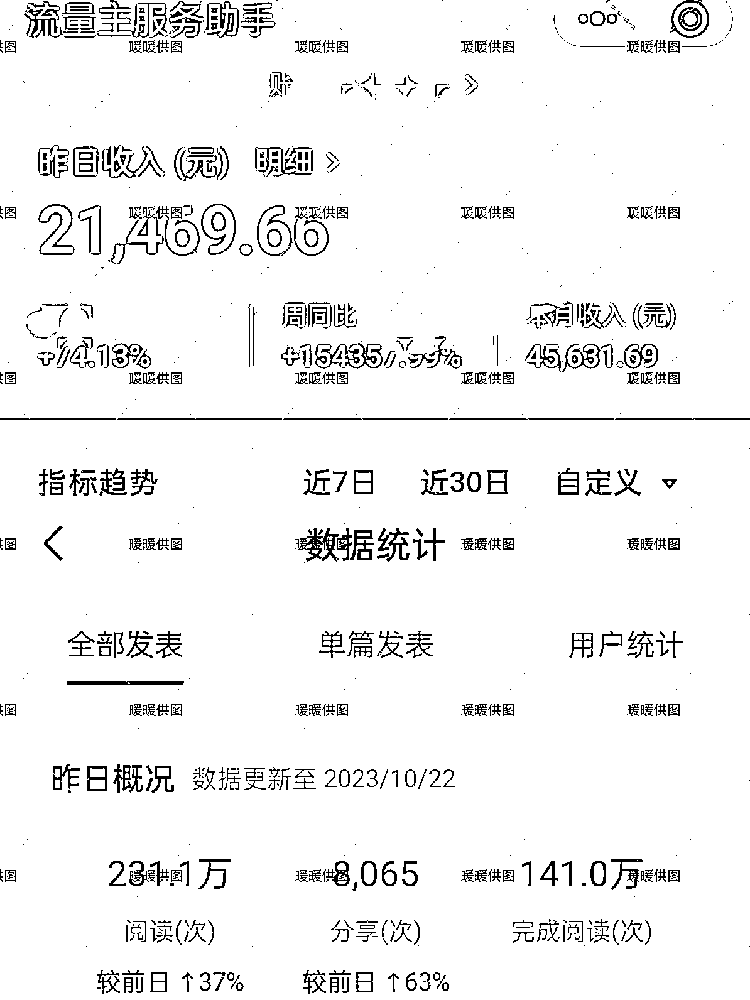
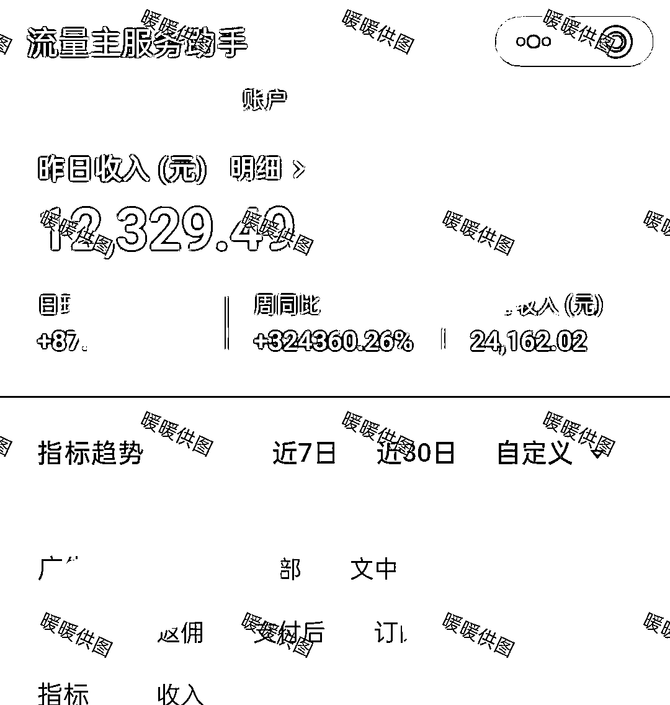
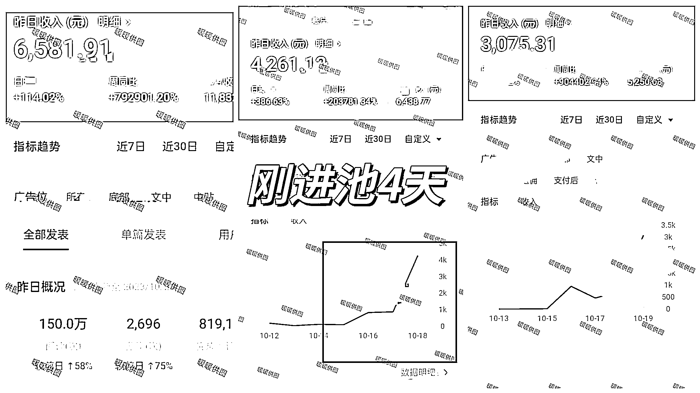
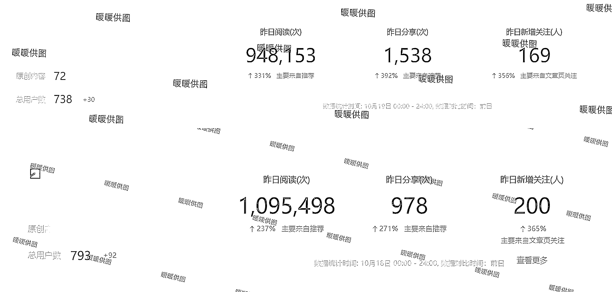

# AI＋公众号故事爆文，矩阵入池率 90%，日营收 2.1W＋起号全流程

> 原文：[`www.yuque.com/for_lazy/thfiu8/vngasoful53tduki`](https://www.yuque.com/for_lazy/thfiu8/vngasoful53tduki)

## (141 赞)AI＋公众号故事爆文，矩阵入池率 90%，日营收 2.1W＋起号全流程

作者： 暖暖

日期：2023-10-23

《AI＋公众号故事爆文，红海赛道搏蓝海出路，矩阵入池率 90%，单篇阅读 230W，日营收 2.1W＋，起号全流程揭秘》

大家好，我是暖暖，一个写故事 5 年，公众号矩阵粉丝 80 万的博主，非常感谢生财提供平台与资源，让我看到了很多新人在公众号爆文领域的优秀成绩。

暖暖结合了自己运营十几个公众号 4 年多的经验，带领团队通过 Gpt+故事爆文，和其他热门领域，陆陆续续在半个月内突破流量池，达到日收入 21000+，日收 12000+，6500+，日收 4000+，日收入 3000+，日收入 800+，900+...

而这，仅仅只用了 15 天不到。

我会将如何带领团队学会 gpt，注册公众号，如何拆解爆文，如何巧妙用调教词，一天产出更多 10w+，几十万+爆文的变现全流程写个复盘。

为了方便大家阅读，请大家移步飞书阅读：

流量主可以赚钱，但公众号也是有非常多变现方向的，比如暖暖的故事接广变现，付费阅读变现，带货变现等等，我会在接下来生财的帖子当中一一和大家介绍的。

运营爆文账号，需要极度理性。

学会筛选对标，积累网感，不断优化调教指令，定期数据复盘，才能不断在数据起伏中，抓住爆文核心，一次赚几百几千块，月入过万，加油！

对于跑通 1-2 个账号的小伙伴，暖暖建议矩阵号操作，很多领域要不断测选题，才知道哪个赛道更适合你。

我的复盘到这里就结束了，感谢芷蓝姐和理白老师给我提供了很多帮助，也感谢之前生财航海的各位教练，感谢生财提供那么多优秀的项目和资源，让我受益匪浅。

最后，希望能帮到各位小伙伴，祝大家都能通过公众号爆文变现。[`n28vbku1px.feishu.cn/docx/R611dzwEtoq73pxSyUycMgV4nIg?from=from_copylink`](https://n28vbku1px.feishu.cn/docx/R611dzwEtoq73pxSyUycMgV4nIg?from=from_copylink)

* * *

评论区：

理白 : 炸裂的成绩，牛逼的团队，优秀的老师！
坏脾气的小可爱 : 太厉害了，暖暖老师。
饭饭 : 太炸裂了吧！
比比先森° : 暖暖老师太厉害了！！
小鹿 : 太牛了！！！
Rico : 暖暖老师太厉害了！
小张有茶自家人喝的茶 : 暖暖老师太厉害了！！
暖暖 : 蟹蟹理白老师[爱心][爱心]一直鼓励支持！！

* * *