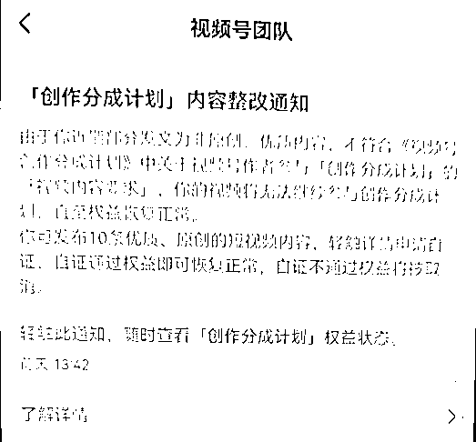
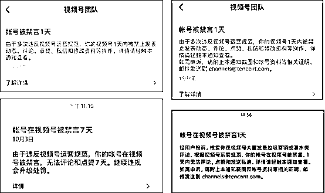
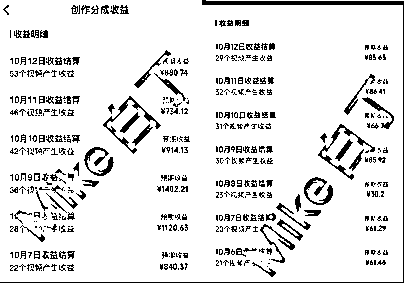
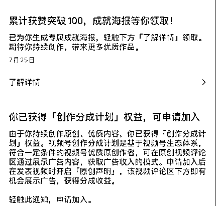

# 冷门项目：视频号创作分成计划，单号一天进账 1402.21 元

> 原文：[`www.yuque.com/for_lazy/thfiu8/szza8guh401ic1q8`](https://www.yuque.com/for_lazy/thfiu8/szza8guh401ic1q8)

## (79 赞)冷门项目：视频号创作分成计划，单号一天进账 1402.21 元

作者： 白丁

日期：2023-10-16

哈喽，大家好~我是白丁。我从 2013 年开始接触互联网，是跟着移动互联网一路跑起来的。我擅长测项目，跑新项目，项目嗅觉灵敏，看见新项目就兴奋，出了网赚项目只要我去测试就能拿到结果。

我来生财已经 6 个月了，感谢生财提供这么好的平台，我在生财了学到了很多知识。这是我第二次在生财分享，上一次分享“支付宝分成计划”有幸被生财认可**“加精”**，这次的分享依然是干货满满。

近期跑通视频号分成计划并拿到结果，**这个项目完全是蓝海期，没有很多人知道。这个项目目前非常冷门**，绝大多数人没有听说过，可以试试问问身边人知不知道视频号分成计划，在视频号发视频就有钱拿，我敢这么说，问 10 个人未必会有两个人知道。

我多年做项目的经验给我的直觉，这个项目大有搞头，**越是人们不知道的时候竞争越小，入局越早，吃到的蛋糕越多，入局越晚竞争越大，能分到的蛋糕越小。**我也是抱着试一试的想法去测，因为我本身喜欢测项目，属于那种见了新项目就兴奋的，就像支付宝分成计划项目出的时候我就是亲自测的，出了最全、对项目解读最深的内容白皮书自媒体人也是我，拿到正反馈的也是我。我的支付宝分成计划白皮书在非常多的付费社群被加精，包括比高的高研社、生财有术，淘金之路等，很多社群都邀请我分享，我每次都是在生财分享完再接受其他社群邀请。

这个项目我花了两个月完全跑通，跑的领域也非常多，这个项目其实并没有很多人说的那么简单，好多人分享都是说无脑搞就赚钱，不管什么项目都先鼓吹一下，让人们先入坑，拿着一些不知道从哪里来的图就分享。**赚钱从来就不是一件容易的事，有人说容易一定是想赚你的钱。**我这两个月里面踩的坑还是很多的，封号、取消创作分成计划的账号太多了，甚至有些号里还有几千块的收益被封号没收的都有，任何一个项目首先不要听人鼓吹，先去评估一下，自己能不能做，做这个项目具备什么样的技能。大家可以看一下我这个账号，每天都是接近 1000W 的播放账号都会被封，也没有做违规的事情，只是原创度低而已。

封号是非常严重的，没有提现的收益会全部没收，已经提现的即使没有到账不会被没收，腾讯也会给号主结算，只要提现了就不用担心。

封号是最严重的处罚，还有一些比较轻的，类似取消原创、减少推荐、取消分成计划。不管什么处罚，只要跑了都能规避，这种坑都是血的教训。

像这种需要申请自证的还好办，有解救方法，努力把自己内容的原创度提高很快就能恢复创作分成计划，这种取消了分成计划的再开通也不会降低流量，这一点腾讯还是比其他平台要好很多。因为我第一桶金是从公众号时代赚来的，能感受到微信喊话“开放”不是一句空话套话。视频号在这一点上做的真的很包容。

上面是我这两个月来遇到的一些处罚，给大家制造负能量了，目的是为了给大家降降火，想做好一个项目真的很难，必要的坑一个都躲不过。

下面给大家说一些好的。

这个项目跑下来收益是非常不错的，下图是我们跑出来收益比较好的两个号 ，像每天 100-300 收益的号有很多，我已经完全是矩阵化铺好了，当然不是无脑找几张图片合成那种粗制滥造，属于精细化运营吧。

做的最差的也是每天大几十的收益，内容做的好不好，有没有抓住流量对应的收益差距也是很大的，我来给大家看一下我们做的好的账号和做的差的账号每日收益对比

最近两天的图我没截，每天都是 1000 多，今天的收益又创了新高达到 1500 多，可以去我朋友圈看。

同样的领域不同的人做出的收益差距是非常大的，上面两张图是两个人做出的收益后台，所以说做收益只是一个结果，能不能做起来还是拼自身素质条件。

测这个项目的时候我也是经过深刻评估的，**一个项目能不能做长久就看是赚的谁的钱，如果这个项目是腾讯直接发钱，大概率是不会长久的。不管哪一家公司做一个项目，一定会有一个止损点，达到止损点就停止发钱。**

**而视频号分成计划也就是上面图里的的广告卡片属于广告投放商的钱，这个钱腾讯也在赚，为了激励作者持续发内容必须分钱，钱才是一切的源动力。这种钱只要视频号流量一直大，广告商是不缺的，这个分成计划就一直有钱赚，无非就是赚多赚少的事。**

****所以，我们在评估项目能不能长期做，就看赚的什么钱，赚的是谁的钱。**就像 7 月出的支付宝分成计划为什么没人做了，刚开始有收益，收益越来越少直到为 0，因为支付宝分成计划作者收益是支付宝直接发给创作者的，属于项目启动资金，不管哪一家公司做一个项目，一定会有一个止损点，达到止损点就停止发钱。**

**我们来看一下视频号收益是哪里来的。**

****

**上面这张图圈起来的就是主要收益来源，点击的人越多，收益越多，视频号分成计划的收益就是来源于广告点击收益。作者开通分成计划发内容标注了原创系统会通过大数据给每个浏览者匹配广告，同一个人每次点击同一个视频的广告也是不一样的，这个广告基本都在评论区的第三到五条评论区，有人点击了这条视频就有收益。**

**因为是广告，所以这属于推广费，这个推广费不是腾讯出的，是游戏厂商出的，游戏厂商在腾讯投放卡片素材，腾讯依据广告类型和内容类型通过大数据计算匹配最优内容人群，所以说视频号、作者、游戏厂商三赢，游戏厂商拿点击卡片广告进去玩游戏的充值钱，腾讯拿游戏厂商的广告费，作者拿腾讯分给的广告费，其中腾讯拿 6，分给作者 4。**

**而视频号分成计划也就是上面图里的的广告卡片属于广告投放商的钱，这个钱腾讯也在赚，为了激励作者持续发内容必须分钱，钱才是一切的源动力。这种钱只要视频号流量一直大，广告商是不缺的，这个分成计划就一直有钱赚，无非就是赚多赚少的事。**

****所以，我们在评估项目能不能长期做，赚的谁的钱是非常重要的。****

****我总结，这个项目完全可以长期来做，视频号需要作者，作者需要钱。****

******理论层讲完了，下面来讲一些实操的。**我主要讲思维层面以及方向型的，怎么剪素材，怎么配音做成一条完整的视频不应该是我们这种高端的社群人学的，这种教程网上免费的一抓一大把，我们要学习思维和方向，方向错了剪辑的再好也赚不到这个项目的钱。****

****首先，如何开通视频号分成计划。****

********

****开分成计划有两个渠道****

****1.优质内容邀请通过。****

****这种属于内邀。只要内容做的原创优质，不用管粉丝就会被邀请开通，优质标准：原创；画面清晰 720P 以上；时长 15s 以上；内容有导向。****

********

****2.触发开通条件。****

****a.有效粉丝 100****

****b.优质原创作者****

****c.符合内容规范****

********

****a 和 b 很好理解，自己拍摄制作或者二创视频都属于原创，天**下没有新鲜事，重新排列组合就是创新，**视频号在这一点也认可，做优质二创就可以。****

****c 这一条：符合内容规范。这条就比较模糊了，这个规则完全是官方说了算，这个规则是用内容就能触发，只要能骗过机器审核就行，这里有一个小技巧，只要你发布清晰度非常高的随拍或者去其他网站搬运没有发过的视频就行，只要是没有在视频号里发布过的视频都算原创，但是搬运一直有风险，视频号又没有识别画面功能，所以搬运必须谨慎。****

****而我们也摸索出非常有效的方法最快两天就能开通分成计划，通过优质的二创剪辑就能骗过机器，在制作上面下足功夫，视频内多加元素，从配音、多片段拼接、增加贴纸一整套下来完全可以骗过机器，下面我给大家截一张图，一条视频处理起来添加的元素还是很多的。****

********

****这里有一个提高效率的方法，就是先做一个标准模板，每次做视频把模板套进去，替换自己需要的素材就行。****

****其实，开通分成计划只是第一步，做爆款内容才是最终目标，爆款=钱。没有爆款视频每天的收益几乎为 0。****

******做爆款的核心：话题和素材。**一个视频能不能爆关键在于话题，每个领域能爆的话题和素材类型都是固定的，能挑动人的情绪价值就是爆款秘籍，喜怒哀乐戳中任意一点再加上素材的制作必爆。我在做内容的时候有一个爆款公示：****

******1.高潮前置。******

******2.内容完整性。******

******3.引导评论。******

****在开始就抛出一个钩子，例如“万万没想到”“谁都没有想到”“绝对想不到”等这种引起好奇的开头，然后在内容中带动情绪把故事讲完，结尾再加“你怎么看”等引导评论语，这种方法屡试不爽。一个视频只要前 5 秒的完播率高，大概率播放量都不会差的。****

****解决完流量问题我们就该解决收益问题，**收益的核心关键元素：领域和评论量。******

****我们在内容的时候要明白一个事，**视频播放量的顶点是由该视频领域曝光值决定的，曝光值决定流量值（播放量），每一个平台给每一个领域都有一个曝光值，曝光值越大，视频能分到的流量越大**，所以我们在做内容的时候选择曝光值大的领域，例如娱乐、游戏、财经等。****

****下面我们再来看如何提高分成计划的收益。先看两张图：****

********

****这是我的自己 IP 账号，已经开了分成计划的。第一张图没有广告，第二种图为什么会有广告。我在前面说过，视频号分成计划收益来源于第三到五条任意一位置的卡片广告，其实这只是针对评论条数多的，其实只要有一条评论这个广告就出现了。**这是一个小技巧，所以我们发布完视频首先用自己的主号或者小号去评论一下就能减少流量收益的损失。******

****就这一个小技巧就能提高至少 20%收益。现在网民已经形成了评论文化，有一个评论总想点进去看一看，如果你的评论做的好就能引导更多的人跟评，评论越多对内容的加热越有利。****

****因为我们是做收益，还要关注广告的类型，在视频号评论区的广告大多以游戏为主，玩游戏的群体是哪些？年轻人和中年人吧，老年人很少玩游戏的，所以做分成计划也要注意一些有流量的领域单价低，像祝福语录这个领域，流量好，评论率高，反而收益相对不高，这也是注意的，做分成计划尽量做一些年轻人喜欢的领域，像游戏，科技这类明显广告点击率要高很多。****

****想做成一件事必须下一番功夫，遇到问题解决问题，不断优化，不断改进，也许一点改动就能带来非常大的收益。所以，运营都是在细节上，而不是说一些大空话。****

****好了，我的分享就到这里了，希望我的分享能帮助更多的人。还是那句话，我喜欢跑新项目，看到新项目就兴奋，大多数决定跑的项目都能拿到结果。****

****这个项目有什么问题找我就行。****

* * *

****评论区：****

****子白 : 白丁老师牛🐮牛，跟你吃肉啦！
沐琳 : 老师，1000w 播放，你是一天发了几条？我是做娱乐八卦赛道的，但收益特别少。
白丁 : 主要看你的素材和话题方向
阿润 : 请问视频号需要养号和一机一卡一号吗
白丁 : 不用养号，一机一卡一号
🦌RUSIZI（更图* : 视频都必须一机一号吗
白丁 : 现在做任何平台都已经是这样了吧
阿润 : 谢谢。视频号创作分成计划下面的“符合内容规范”具体是什么呢？我发了 10 条视频了，流量也有几万，但是还是没有符合这个条件。****

********

* * *