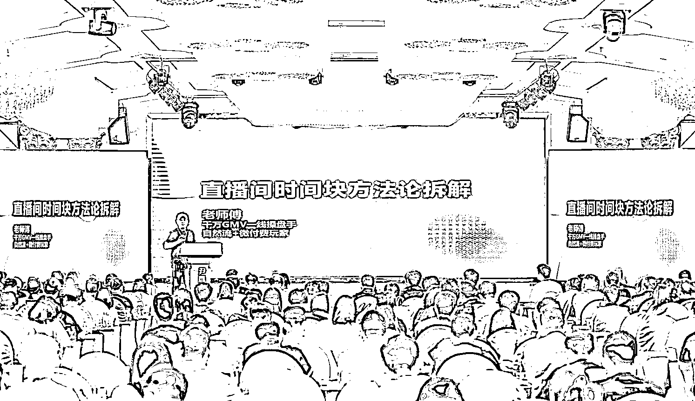
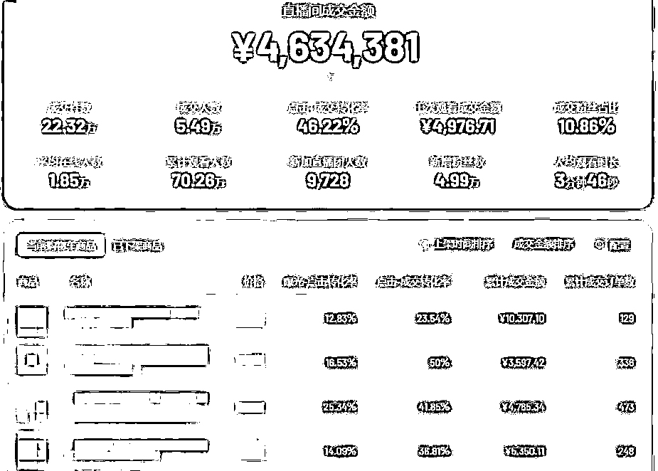

# 我是如何用时间块效应做到直播带货单场 100 万

> 原文：[`www.yuque.com/for_lazy/thfiu8/fyt0m15yybu6wxt3`](https://www.yuque.com/for_lazy/thfiu8/fyt0m15yybu6wxt3)

## (24 赞)我是如何用时间块效应做到直播带货单场 100 万

作者： 老师傅

日期：2023-10-17

首先我们要了解什么是时间块原理？

时间块实际等于实时赛马机制

算法角度系统永远都在：试探性的给流量、反馈数据、奖励流量、再试探性的给流量、再反馈数据、再奖励流量

赛马机制是整个算法的核心，为了保证公平，不仅保障老号的权重，又能让优秀的新号脱颖而出

那么算法以三个要素划分不同的评比渠道：**类目、流量层级和直播时段**

**理解也很简单，**与同类目、同一个流量层级和同直播时间段的号，我要做出比他们更优秀的**数据指标**

这就是为什么，不管直播多么的卷，你发现依然很多同行在起号，而且不断发现很多新号脱颖而出

赛马不只和同行赛马，也要做到与自己赛马

与自己赛马的好处是，你的数据一直是递增的

那么数据指标分为：浅层数据和深层数据

停留、互动、关注、灯牌属于用户的浅层行为数据.带来的是流量的数量，只要激发浅层数据，直播间就可以有人气

商品点击率、点击转化率和 GPM 属于用户的深层行为数据，带货直播间仅仅靠浅层数据不一定精准，靠的是深层数据

以上数据做好了，自然就形成了一个数据和场观、流速等结果数据，这些数据不具备算法层面的意义，但是可以体现一个直播间的健康度

**有一些直播间，你们看到有很高的流量数量，但是卖不出去货，就是浅层数据做的好，但是转化不掉，流量不精准，就导致一个死循环，洗不透人群**

有三类指标最容易预估：停留、GPM 和点击转化率

这三类指标我们在直播的过程中是可以预估也是可以做时间块效应的

操盘手可以通过自己的直播中触发实时推流时，去观察各个指标，来去做阶段性的数据统计，并归纳总结，我下个环节该怎么做

那么，在直播大屏上，最能体现权重的数据，就是场观，而在前面的半个小时内出现的一波极速流则是本场场观的第一个关键，因为它代表平台给你的**流量预分配**

从流量分配的角度，当场流量=预分配流量+实时分配流量，预分配的流量强度是依据以往的直播当中的排名数据决定的

所以，我们在直播的过程中，需要一场又一场的优化，又持续把每个优化好，直播间是没有起不来的

预分配的流量是在开播 30 分钟内会给你的流量奖励，这个叫极速流，，它有一个特点，就是无论直播间标签多精准，被分配到直播间都会有泛流量，如果接下来流量没有后续就导致一波流

第二节：直播日常的时间块运营细节

我们在直播过程中常见的流量曲线有三种：

L 型流量

开播即巅峰，流速维持不到 30 分钟就断崖式下跌.普遍是因为产品、话术和节奏，没有迎合第一波泛流量的特点，所以系统惯性推流结束后没有造成初次的加速

导致 L 型流量也有三种原因

流量泛----------流量少/后续流量跟不上------------有流量但是停留过短

也就是有一些伙伴们说，我总接不住极速流量，导致一波流。

极速流某种意义上也分为 2 种，一种是极速流，一种是泛极速流，极速流也是有精准流量的，你接不住的实际上是泛极速流。

很多出现泛极速流的情况是，他获得了原本不属于他的流量，就是一下子把流量层级破上去了，或是流量不稳固就被拉爆的泛流量，都是这样的泛急速流，谁都接不住

所以，极速流和泛极速流意义上也是不一样的，你在前面每个流量层级的流量精准度优化得越好，后面破层级之后你出来的裂变流量就会越精准

那么，在起新号的过程中，成长速度越稳，账号后续也就越稳，慢就等于快

现在，为什么说马扁起号死的快，因为行为是：可买可不买的人群购买，导致可留可不留的人留.而这些人群给你带来的人就更泛了，慢慢泛，慢慢就没有留存了，慢慢账号就凉了

我起号一直采取的是慢起号逻辑，当然慢起号逻辑不是说几个月才能起得来，是比较稳

逻辑就是前期尽量先打单品，把流量变得极度精准起来，这样前端的裂变源是精准的，后面裂变出来的末端流量也会精准一些

细节就是要控流速，不要一下子把流量拉爆了

在说回承接极速流，我到底怎么才算接住

原则上是没有任何人能 100%接住极速流的，但是我们也需要接住 50%

极速流也分为几种情况，我们以常见的阈值 260 为例。

1.开播极速流稳定 2.开播极速不稳定 3.开播第一次破 260.

解析 1：之前破过 260.每场极速流/峰值稳定

解析 2：之前也破过 260.但是极速来极速走，在线/峰值不稳定

解析 3：之前没破过 260.只是有少量极速流。在线也不高。

接极速流的目的是我要筛选出我的精准人群，我们并不指望全留住它

所以，**大多数直播间来说，极速流，拿直播间的泛爆品或福利品去承接，永远是最有效的方式**

因为只有这样才能最大限度的满足各项指标考核.

第一波极速流之后，你出现了一波流，并非这一波结束就不再分配.而是降低了你的最高流速，但随后依旧会有推流，最终不断减少

比如说你顶点的时候，你 5 分钟有 2000 的流量，这个就算最高流速，你没承接住，也不代表就不给你推流了，只不过是给你的最高流速减少了，变成 5 分钟推 200 流量

在这个节点，我们总有一个问题，我到底在最高流速时候卖正价，还是卖低价

实际上对于算法来说，算法是不懂任何逻辑的.算法只关注一个问题：我给你流量，你能反馈给我什么数据回来

所以，你的品能转化就要转化，不能转化，就做停留为主，去筛选人群

如果你的产品是正价，但并非高转化率的正价品，转正价的后果就是转化率降低，你的 GPM 也变低，你接下来的最高流速也会低。

相反，如果正价本身是打爆了的品，转正价就能获得好的数据指标，一波流之后依然能获得推流

至于，接极速流到底是什么品，要好好思考我们的品处于哪种地步

第一波极速流接好，后 60 分钟的流速就不会差，同理，只要把前 60 分钟承接好，未来 120 分钟的流速也不会差，这也叫时间块效应。

细节是，如果你采取用福利品接极速流，那么你的福利品选择一定要考虑你的人群，要和你真正想卖的产品之间的关联性，因为低价带来的转化率优势更会让你的人群泛，你的福利品定位不准备，对你后续没有好处。

那么极速流接过之后，每一波流量也是分质量的，是跟我们转化路径有关系

泛流量我们有泛品承接，精准流量我们用正价品承接，这样我们才能不浪费流量，满足平台的需求

如果你的一轮没有成交，只是做了停留灯牌这些人气数据，二轮流量会泛一些，二轮又做了人气数据，三轮的流量就会泛一些，就不容易卖正价了；如果做了成交，二轮流量会精准一些，二轮做了更多的成交，三轮流量就会更精准正价会好卖一些

所以，在你第一波流量出现并结束的时候，你就要考虑，你是否确定我能稳定拉来二波，这二波流还是泛的，还是精准的，或者我没接住，那没接住的会让我马上掉流速，我应该怎么做

流量上来之后就需要洗标签，洗标签就是让人群更精准

如果感觉直播间人群精准，憋单时间短一点

如果感觉直播间人群不是很精准，憋单时间可以拉长，憋单时间长想要的人会留下来

但是效果，可能需要考虑你话术内容的功底了

那么流量的第二种是 M 型流量

M 型流量是开播后，除了一波流，还能再实时拉起二波流.拉起二波流，第一靠开场前 60 分钟数据承接不错，所以开播中除了流量预分配外还有实时分配，第二靠直播间出了转化高的品，，提高了递增权重排位，第三是靠短视频或付费带来了数据价值

那么有个细节点就是：你要快速思考出，实时直播中，我卖了什么产品，我的话术说了哪句话，或者我做出了什么行为导致的流量奖励，也要思考出，我现在的回流在线是停留高导致的，还是流速快导致的。

因为，对你接下来第二波的极速流的承接策略也是不一样的。

如果流速高导致的，那你的流量就会参杂着泛，实际上你的二波流不算真正的精准，你还要去洗人群，那你的话术逻辑就是段循环去承接过渡到平稳

如果，你现在的在线是停留高导致的，说明你的人货场和流量是匹配的，比较精准，那就要长循环话术去做价值去把转化给最大化。

所以，你要及时在直播中思考出，我当下是什么情况，用哪种策略去承接，这样才能最大程度承接住流量，继续给后续的流量做铺垫。

那么第三种流量曲线就是波浪型曲线

能做出多峰值的直播间，首先说明基本人货场是有优势的，在 M 型曲线的细节基础上，还需要具备的是做小时的数据，因为，我们在直播中时刻都会产生用户行为和数据行为，系统对于数据的计算同样也是分秒级，但算法还需要根据回传重新分配流量，就是出发赛马机制，所以，我们要拿到**实时分配的流量**，最理想化的状态是：就是做到 5~10 分钟的浅层数据和深层数据同时爬升做递增.

那么有个情况是：新号为什么更容易做到赛马，就是因为新号只需要做浅层数据。

在团队不是很成熟的情况下，5 分钟的数据赛马，对于综合数据的拉升难度很大，因为时间有限，可能一套话术就不止 5 分钟，我们可以把 5 分钟延申到 10 分钟，10 分钟的时间足够在直播中转换各种逻辑了。

系统对于数据的计算是分秒级，越能将数据缩小到最小单元，越容易获得赛马排名

所以过了冷启动的直播间，你去看他们的节奏基本都是 5-10 分钟就循环一次

那么，大部分的直播间都不是那么完美，直播中实时的数据很难在赛马机制中得到爬升，

比如在直播间中，转化率高，但浅层数据不好，又或者是浅层数据高，有人气，但是转化率差。

那么，我们就要在实时的直播中一个很重要的点：补数据

对不同直播时段数据进行分析，当发现某类数据不够时，提前准备，并在适当的时机插入

所有手段都为了一个目的：越能将数据缩小到最小单元，越容易提高赛马排名，而多个小单元时间的叠加，就会形成小时的权重累积

这就是数据意义上的时间块递增

就是你在这 5 分钟时间，感觉某项数据欠缺了，就要及时在下个 5 分钟里做出补救，为了保持后面的最低流速

吃透了第一波流，未来 60 分钟的流速峰值有可能不会被拉高，但是最低流速会被拉高，进而获得持续的流速

在持续推流的 60 分钟，有爆品的就打爆品，无爆款的，及时根据现场每个品的情况，及时调整，重新组合，目的是通过及时调整做数据，保证我后续的 120 分钟的最低流速。

细节：既然接不住最高的流速，我就要保证我的最低流速并不是真的低

以上就是我们直播过程中几种常见流量的情况，

核心点：直播间只有接流量，没有拉流量，流量接的好，流量自然高。

直播节奏

直播间的节奏和流量的匹配程度也是很重要的，节奏不好，它是直接影响当场直播数据的，那么一个直播间首先要有一个基础的排品策略，其次是运营细节和话术的细节。

首先，是品细节，直播间的选品一般可以分为引流品、爆品、利润品

引流品就是那些能够吸引用户拉升单个用户在直播间停留时间，进而接住实时直播间流量

首先，是品细节，直播间的选品一般可以分为引流品、爆品、利润品

引流品就是那些能够吸引用户拉升单个用户在直播间停留时间，进而接住实时直播间流

那么有一套排品的组合后，才是运营的细节，在排品的基础上，要感知直播间的流速和预估接下来的流速，去做实时策略的调整，直播节奏是需要根据现场流量的波动随时要做出调整的，不是一条路走到底。

比如，我们在直播中，出现流速快的时候，去观察是停留高导致的，还是流速高导致的，停留高，我们的主播就要加快商品讲解的信息密度，去把转化和承接密度做好。

那么，在流速很慢的时候，也就是我们在线很低，人很少的情况下，我们就要主动转我们的福利或者引流款，因为进来的人变少了，我们要把进来的人留住。

因此节奏要适当的慢一点，要配合卡库存、互动等策略把人留住，进而把流量接住，为了后续获得流速

那么在一场直播中，密不可分的就是我们的品，就是品+节奏感

第一点，如果我们遇到了爆款，这个时候你应该微微憋单，然后循环去卖它

第二点，我们的款一般般的情况，我们还是微憋单，但是这个时候我们不能一直卖，一定要循环去锁单放单，就是你封单的节奏要频繁一点点，你要保证这个停留数据，保证这个互动数据

第三点，如果你的款不行，就憋单。但是记住一定要补福利品

因为你一个转化不行的款和福利品，一定是福利品能转化。

很多人承接不住流量的原因就是节奏和流量的节点不匹配

理想的直播间节奏是，当我们该继续憋单的时候，我们应该再继续憋单

当我们该放单的时候，不能再犹豫，立马放单。

如果该放单的时候，你在那里拼命的给他讲解产品，拼命的拉互动，你会错过这波流量

那如果该在憋单的时候，你给他立马去放单了，你也是憋不起来这个人气。

那么除了排品的策略和直播的策略，还有一个是数据策略

很多人说我怎么知道我账号是什么权重

一个账号有多少场观，就代表这个账号的权重有多少——单位小时的场观越高，权重越高

那么，大家同样关心的问题，我到底怎么能提高账号的场观

提高场观就是要提高流量层级，而提高流量层级就是要——憋在线人数和在线峰值

因为在线人数高了.必然会触发平台有更快的推流速

那么想提高账号权重也不能光靠卖货，因为你没有流量，就没有人买

那么，就不得不提一个行为动作叫：憋单。

有个误区，很多人理解为憋单是低价，是用马扁套路来做停留和互动，实际上不是，憋单玩的好的人，一定是深度理解人性的，所以，有句话就是，没 5 年诈骗经验，现在做不了自然流主播了。当你不断的播账号，及时做策略，慢慢的就会有了流量感知，只是最开始这一招憋单技巧破层级很管用，所以就导致很多人觉得憋单=低价

比如场观不够的时候，就需要用憋单，做浅层数据

场观够千次不够的时候，用真诚的产品介绍来拖延时间憋单就可以了憋单的核心就是价值塑造

浅层数据重要的是停留，很多直播间比较厉害的，就只关注一个数据，就是停留。

那么停留也为分为 1 次 2 次 3 次

你的用户留在你直播间，实际上用户是留在了抖音平台上。

**只要你能够拉即时停留，其他的任何的考核权重都变的优先级不高。**

**那么不管你是做哪种数据，一切的一切都是从停留开始**

这个不是停留时间越长就一定会推人，这个取得是平均数位，如果有人在你的直播停留了整场直播，你的停留时长就会变的很长，系统要的是多个人的长时间停留而不是一个人的长时间停留

不得不又提到赛马，有个细节是你可以找下跟你赛马的同行，你们去看看对方每 5 分钟卖多少，高客单主要做 GPM 激发推流，代表了你直播间的流量质量，GPM 越高，流量越精准。跟客单价有关

低客单主要做成交密度激发推流，放单数量看直播间的情况而定

那么低客单重要的是转化率，高客单重要的是千次。

但是有个误区：比如我场观小的时候，灯牌数据做到了 1-2%或者更高，为什么不来流量？因为你场观小，你灯牌数据做的在好，实际上也就那么几个

下来在说卡库存和封单

及时封单是需要中控来配合的，没有人气的时候及时封单可以保住你的在线，留老接新，慢慢的在线就上去了

封单可以让那些犹豫的人对下一波放单抢得更加果断！

无论正价品还是福利品一定要记住控单！！！目的是留有一定的成交余量做二次憋单，另外是不让这一轮转化率过高，导致下一波跟不上，影响流量的稳定，为什么不稳定？因为时间块价值做不上去了

其实，很多时候，我们与其说是主播起号，不如说是中控起号。

因为中控要：随时向主播提供信息、配合和替代主播进行产品展示和讲解、带节奏、场控等

你们听过运营，运营型主播，有没有听过运营型中控的？

懂运营，就是是懂直播的整体节奏和方向

那么，我们在起号的时候，如果主播是新人，我们配个逻辑清晰的中控，会做什么

在点对点阶段，中控需要去不断地查看每个在线的关注列表，对标签是否精准有一个感知，该拉黑的拉黑，该成交的提醒成交

带节奏：把直播节奏做调整以及跟主播去**做实时的不下播复盘**的这个动作，一个好的中控他一定是场控型中控，会调节主播的情绪，和主播搭腔

补权重话术，什么是权重话术呢，能让用户产生停留和互动的就是权重话术。

卡千次：对于直播间里面的空单卡单、偷单、憋单、放暗单。优秀的中控它一定是一名卡单高手，会卡单的中控直播间付款率至少提升很多的

他同样会做个细节，就是回弹幕，及时回复弹幕的内容，不然你的主播在没时间回复的情况下，直播间还是挺尴尬的。

还有一点常见的错误是，我到底要不要拉时长，我们先明白拉时长的本质是什么，

本质是平台的流量是动态变化的，拉时长的本质就是守流量，所以，不要为了拉时长而去拉时长，你做不出来数据，你日不落也没有用，那为什么付费直播间可以拉时长，

付费流量是通过整场付费采买流量，建模完成后在线人数比较稳定，但也要具备较强的人货场，这样去拉时长才有用

所以起号期间还没有建立模型的时候就去拉时长，起到的是反作用的效果

所以建议：做好每一场的直播数据上升，再去考虑拉时长.

拉时长是需要前提条件，在线人数要保持稳定、主播的状态不掉，但是大多数情况下

自然流的直播间，在线人数会随着时间的拉长出现人数越播越少的情况，平台会对每场直播计算出一个平均数据，数据越差，下一场的流量就会有所下降

你无论多么辛苦，你数据做不好，猝死在直播间也不会有流量的。

那我们能做的，就是在每一场直播之后，.每一场直播该下播的时候下播，不该下播的时候坚决不下播，做好每一场直播的数据.每一场中做好每个时间节点。

要想得到流量层级，最好的方法，就是让自己能配得上它，不然给你这个流量层级了，也会失去

**当成交密度不够匹配你的人气的时候，不要轻易的去破你的流量层级，不要随意的去拿到不应该属于你的流量，这样你的号死的也快**

所有的层级都要过一遍， 这样你的账号到高在线的时候才能够稳，相对稳定，你直接跳两个层级，你的账号容易跳泛了

**很多人前几天可能开心下，过几天号凉了，人群也变泛了，就是这个原因导致。**

**你的流量层级和你成交不匹配**

**第三节：时间块中的主播话术技巧**

**我们刚才讲到很多次主播，**直播中主播要根据现场的流量波动及时调整话术逻辑

**，而不是一套话术走遍全场**

**所以，话术逻辑也可以分为三大类型：**

**长循环话术，短循环话术，长短双循环话术**

**在讲话术类型之前，我们也看下几种常见的话术逻辑**

建立信任话术 接新话术 逼单话术 停留话术 成交话术 互动话术 人设话术

价值塑造话术 痛点话术 转化话术 利益话术 购买理由话术 可期待话术

**然后话术其实还有一种逻辑，就是表现力，那么也有几种常见的：**

情绪表达 肢体语音 语气-语调-语态 现场临时思维 流量感知

为什么要把这些语气也加在一起呢？

因为这些做到了，也能让你的话术从平平无奇变得有内容，升华话术本身

长循环话术也叫慢话术

长循环话术一般在 5-7 分钟循环一次，是目前所常见的一种话术表达类型

很多主播的长循环话术为什么无效呢？

长循环话术节点：以 6 分钟为循环

价值塑造 3 分-----专业

性价比 1 分---状态拉满

信任 30 秒--------真诚 掏心掏肺

购买理由 30 秒-----激动（可给场控/副播）

逼单 30 秒-----状态拉满（可给场控/副播）

完单 30 秒----平稳/情绪化（也为防止冲动性消费带来的实时退款）

这种长循环话术适合最低流速不低，有持续的稳定的流速，在线也不差，停留也不差，主要以转化为目的

看具体的产品客单价与具体的流量层级决定循环的时间周期

那么在这个过程中，有一种情况，主播节奏突然变化了，有可能是在线变高了，主播想接住，但还是一套话术循环下来，你会发现，没接住，这就是话术和流量的不匹配，流量与节点的不匹配，你去找原因也找不到。

在这种情况下，也要及时考虑的是，到底是流速变快导致的，还是停留高导致的

你能看到这么多人在线了，这么多人没有走，证明这个品是好使的，那就自信点，继续长循环话术，但要穿插一下段循环，即长短双循环话术逻辑。

所以，我们在培养新人主播或者让新主播写话术的时候，我们不妨根据你卖的什么品，有哪些关键的逻辑点，把你需要表达的逻辑点找出来在往里套内容就很简单，

而且逻辑严谨，实际上，刚才那段话术写出来，只需要几分钟时间，不用刻意的想内容，先找到逻辑，话术内容自然就有感觉了。

那我们在看短循环话术的几种常见逻辑：

利益话术--停留话术-互动话术-建立信任话术-可期待话术

短循环话术适合最高流速快的极速流和最低流速慢的节点，因为你要保证你的话术逻辑迎合流量的特点，做最大化的留存.

流速+留存=在线

这套短循环就是时间很短，但也是环环相扣，你在流速高流量比较泛的时候，能卡住人群特点，匹配到节点，在你流速慢的时候，你也能卡住人群特点，因为，无论哪种流量，给你的是曝光，就是场外流量，你要用你短循环话术的逻辑，去拉你的曝光/进入，形成你的场观后，做到接新。

如果直播间流速是正常的，但是你在线不高，就去优化留存。

影响留存的因素：产品/话术/场景/勾子/内容/福利等等。

如果直播间流速不正常，那么影响流速的因素有：浅层数据/深层数据，曝光/进入率，各种流量渠道，那么最能激活流速的就是浅层数据

比如说一切的一切从停留开始。

细节点：有高场观的前提是高曝光，那么曝光人数也可以由每 5 分钟的直播数据、每半个小时的直播数据、上场直播的数据

这也是时间块效应。

浅层数据带来的只是流量的数量，质量还是要靠我们的产品和话术内容去洗透人群。

话术逻辑没问题了之后，在优化我们的个人状态，情绪化能升级话术.这优化 2 秒，那里也优化 2 秒，你整体的即实停留高了，你的平均停留也高

整合起来:产品+话术+主播状态=节奏--转化效率

为什么没有说人货场，因为人货场是你踏入直播带货这条路的敲门砖。

无论是单品还是多品直播间，一个品至少备选 2 种话术逻辑，即快慢双话术

以备在直播中应对流量的波动，匹配流量的节点，把直播间流量最大价值话承接住

这也是很多伙伴的疑问，我的话术没问题，但就是接不住流量的原因之一。

因为话术中只有内容，没有逻辑。话术中没有攻击性，话术里没有利他思维，只有营销思维。

那么，很多主播说在直播间中怎么带动互动都不行，到底怎么带动互动。

那先理解为什么要互动

从算法角度上，近一分钟的互动率能够直接触碰平台的推流机制，可以这么理解：分钟级评论=流速

其次，没有互动行为，直播间就没有氛围感，直播间里的客户只有看到别人互动了，气氛到位了，才更有可能买

所以，互动在某种意义上也影响流速和转化。你看到优秀的自然流主播，一定是**拉互动意识**非常强的，能够随时靠个人话术强拉互动.

但是，直播间里没有无缘无故地**互动行为**，一定是你激发了他们的某种**行为动机**：需求、渴望、从众、期待感、冲动感、贪欲、甚至是黑点。

你没有抓到观众的需求点，而我们想让观众行动，你就要先给他点什么价值，用来激发他的行为

这个价值包括福利价值和情绪价值，你通过憋单节奏慢慢的塑造起来价值，就会逐渐增强对方的期待感，加上水军的带动，就会带动更多真实互动行为

不是人设主播的尽量把互动话术放到固定话术里，不要出现真正的临时应变，你应变不过来的，会被打乱节奏的.想好几个关键点，套在短循环话术和穿插在长循环话术里。

首先就是从底层思维里就反向操作：不断的思考我能给对方什么东西？而不是我要对方什么东西。

刚才提到一个词叫憋单

**憋单的时间长短和在什么情况下憋单也是看实际情况的**

你直播间只有 3 个人，你去憋他的单？一会就憋走了

你直播间有 30 个人，你就要啰嗦一下，，因为你要憋你的即时在线，也就是即实停流

1-10 人的直播间，你要点对点的平播来完成人群建模、建稳。

平播-点对点更多需要用的是人性话术

就是不断挖他痛点，但给了痛点后不能马上给解决方案，要把这个痛点放大。

之后在给解决方案

那么，在这个过程中，虽然带来的末端泛流量不是我们想要的人群，但是我们依然需要让他留存，让他做浅层数据，这样才能带更多人过来，不然你就断了裂变源，连人气都没有了，你的 GMV 也不会高哪里去

哪怕他冲动消费了，退了，这个成交都会影响你下一波流量的起量，也是有价值的

冲动是由情绪的积压和释放产生的，积压的过程是你塑品和制造期待感的过程，释放就是你最后一步放单的过程

在塑品憋单的时候，一定要制造强烈的期待感之后，再去放单，放单之前要通过公屏的互动来测试对方的冲动程度和冲动人数

**塑品的目的是放大产品的价值感、让用户感觉买对了**

**高人气的直播间，话术要强调的点是——身份认同和价值观共情，就是所谓的人货场匹配**

**提前要了解自己的人群，要不断问自己——听你这段话的人——他们是什么人？——他们正在经历什么**

**总结：主播可以忘记话术内容，但是不能忘记话术框架逻辑**

我们做直播带货，特别是玩自然流量的一定要认清，我们的所有的点一定是**围绕人性作为出发点**

**有个误区就是我在起新号的过程中，我的话术是和别人在线很高卖的很好的直播间学的，为什么在我直播间里说出来就没有用了**

**因为，**他们的话术和节奏都是控人数比较多的场，我们新号直播间抖音是不知道你需要什么样人群的，你的标签不精准，直播间里面进人就秒进秒出

还有你的账号不是没有流量，只不过是曝光了，没进来而已。

**第四节：直播中如何做精细化复盘**

**熟练的团队不一定非要下播后复盘，主播怪运营，运营怪主播，最后产品背锅**

**所有的罗盘上的每一波的数据都会决定你本场后面的数据，要随时进行——不下播的复盘与话术补救，因为不下播复盘是过程，下播复盘是结果，过程是可以改变结果的。**

**那么确定一场直播的框架，就要有个基本的直播脚本**

**像有经验的团队，其实是不需要做脚本的，因为团队现场都会根据当下的情况，及时做调整，心里都是有数的，如果团队基础功不够，我们就需要做个脚本来帮助我们在什么时间做什么事情。当然，你提前做好的脚本和你本场直播中每个节点不一定是非常精准匹配的，但是，当你出现了每个比较重要的节点的时候，我们提前有个框架，就等于有了紧急方案，我们可以应对自如，就不用恐慌了**

直播脚本的作用就是：管理主播话术，脚本最重要的受益者肯定是主播，我们可以非常便捷的为主播每个时间段的动作和行为做出引导，让主播知道在具体什么时间做什么，还有哪个步骤没做，另外也可以借助主播传达出更多和粉丝的互动和其他方面的内容.

目前很多时候后台复盘的时候都是在讲场观多少，销售多少，互动多少，其实这只是一个统计，并不是复盘，真正的高质量复盘是在每一场直播中找到问题，发现问题，加以优化，如果没有脚本作为指导的话，就会感觉没有具体的哪好哪不好，梳理不清，为什么销量低也不清楚，为什么互动少，也不清楚是哪出了问题，所以在复盘当中，一定是通过脚本来分析出哪个时段，哪个环节出现问题，然后再加以优化

做脚本的逻辑点：

1.把握节奏，可随着直播间当下的状态，适时调整产品售卖顺序

1.激活推流：产品热点，产品卖点和槽点，互动交替进行，激活各项直播间指标

2.主题：主题一定要明确

3.协作：降低主播压力，只需要把握十分钟现场节奏，重复重复就可以

4.商品卖点：每一款商品都设定自身的卖点，这个卖点是为了吸引我们的精准用户下单购买的，所以一定要在脚本中清晰的表达出来

商品卖点 T 以开播 2 小时为例，那么细分成时间块价值：排序依次是 0-5 分-5-10 分-10-15 分-15-20 分-20-25 分-25-30 分-----30-45 分-----45-60 分

每个账号的流量架构/规模不一样，也可以分为：

0-15 分 15-45 分-45-95 分 95 分----xxxxxxx 分

具体以自身目前阶段去做脚本

那么在实时复盘中，先了解我为什么来流量，就是分配流量

你的直播间能不能够给用户创造价值是停留和互动创造的

你的直播间能不能够给平台创造价值是由成交决定的

所以，我们在看大盘数据时，就知道我们到底是缺浅层数据还是缺深层数据了。

**我们总结为流量数据指标分为了两个维度，一个场观，一个流速和峰值**

**流速和峰值要一起拆解，**直播间不能脱离流速分析峰值，单纯的看峰值和在线人数，很容易只看整场直播数据不看阶段数据，从而造成无效复盘..对于峰值的分析，除了结合流速去看，也要分开阶段去看，就是我们今天的大主题：时间块效应

把流速、峰值拆分的时段越细，分析的时候就更加有参考价值，比如常见的 5min 的流速分析，但也可能是分钟级的分析

我们去观察当中这 5 分钟缺了哪里，如果实时停留短，那我们在下个节点，就要补一下能让你拉住停留的话术。

缺了成交，就及时改变排品，穿插下福利品之类的

当你有了一定规模的场观后，平台就不只是考核浅层人气数据了，还会考核深层电商数据.直播间的转化能力不达标，你满足不了平台更深层数据指标，流量层级就会掉

健康的直播间都是阶段性的拉流的，先用浅层数据要场观，再测试转化要成交，再去进一步扩大场观

就是我们刚才说的一个点：开播极速流承接，我在能保证我筛选出精准人群又能转化，就同步就行，如果我的品转化不了，我就索性不要转化，就先要浅层，后要转化。保持不了我的最高流速，我就保持我的最低流速不低

即：**拉升流量，转化流量，继续拉升流量**

这种就是保证流量质量的情况下，再追求数量的扩大，那你就不在是一波流了，也会出现 2 波流 3 波流

真正的去分析一个直播间，一定是实时的去把数据指标拆分为账号的不同阶段、直播的不同时段，而不仅仅是去看整场罗盘分析 GMV 、转化率，其实没太大意义

有个细节点是：大家都知道在线有个阈值 260 人，那同样直播推荐 feed 也有个阈值，

所以你的账号有标签的情况下，你推荐占比只要掉了，第一时间就是——拉在线

比如推荐占比 88%，每分钟只给你推 100 人，89%，每分钟给你推 300 人，90%就是直接给你推 2000 人了。

刚才说到 260 人阈值，无经验的团队或者产品受众度窄的账号，不建议快速破这个阈值，越早破越早死

起号 260 人来得越迟越稳，宁可在 260 人以下苟活，也不要在 1000 人在线暴毙

抖音自然流现在讲究的是求慢，不要一场就爆流

如果你一直在 200 人左右，你的账号是可以做出 GMV 的，也能相对平稳。

如果你第二天就 1000 人，你账号歇菜可能性很大

260 人以下相对精准，260 人以上在线，抖音对主播的能力要求是完全不一样的，因为赛马机制的层级不一样

直播的时候也要时刻有一个做数据的概念

所以，刚才提到的中控或者其他人要在不打扰主播主节奏的情况下，及时提醒，去做数据，补数据，补权重话术。

**所有的话术——是随着你的罗盘数据而改变的**

**那么我们在起新号的时候，第一步是建模 第二步是破层级**

**怎么才算建模成功呢**

系统建模的流程：开播系统推送泛流量你能转化---系统加大相同属性人群推流---你能继续稳定转化---系统放大相同属性人群推流---你能继续稳定转化--建模成功。

第二步就是破层级，​破层级就是（破场观、破在线人数、破进入人数）让系统给你推更多的人，如何让系统给你推更多的人呢？那就是让系统知道你有被利用的价值

**现在总结一下我认为比较容易出现误区的几个细节点：**

**憋单也是憋停留和流速，所以，憋单的前期是有基本流速，你 5 分钟只进几个人的时候，这个时候憋单是无意义的，就要去点对点把你的模型在精准一些，就需要更多的利益话术和人性话术，做下基础的流速**

**那么第二个细节，憋单的品选择也要是验证过的爆款，起码是潜在爆款才有憋的意义，用福利款去重憋，拉来的流速，某种意义上也是泛人群，匹配泛爆品是可以的，你没有爆款去后续成交转化，就会导致你的人群洗不透，憋来流量的意义也没有了**

**那么憋流速的优先级是：停留-互动-转粉-灯牌。**

**憋单的核心就是价值塑造，掌握逻辑，你哪怕在转化过程中的长循环话术也是在憋单。**

**所以，憋单适用很多种流量架构中**

**细节是你当下的节点和你的流量有没有匹配。**

**那么在接极速流的时候，也是在憋单，所以，到底怎么接极速流，到底用什么品接极速流，大家可以根据自己的账号制定方案。**

**总结问题 2：我们在直播的准备中，一定要做到及时的策略调整，不要等着下播后在去调整，你账号突然掉层级，是因为你连续几天数据不好导致的，那么，我能在开播的过程中，及时的把问题优化掉，你账号存活的周期也就越大，自然流不是做不了，而是自然流赛马机制不确定的因素太多，所以，配合微付费会更稳，那么付费是放大你的人货场，在你验证人货场没问题之后，你在配合付费，这个付费 ROI 基本是稳赚不亏的，你的直播间节奏和人货场有问题，而没有得到优化，就大量的付费，会导致你自然流占比下降，你的付费也会亏。到最后账号死掉。**

**总结问题 3：现在很多时候，运营的信息差基本没有了，有的是细节差。所以，不要纠结大家都是什么套路，什么玩法，而要纠结的是我的细节该怎么优化。**

**所以，现在大家不要重心放在运营套路上，而要放在产品-场景-话术上**

**话术和人群的匹配---产品和人群的匹配--人群和流量的匹配**

* * *

评论区：

如风 : 太干了

* * *