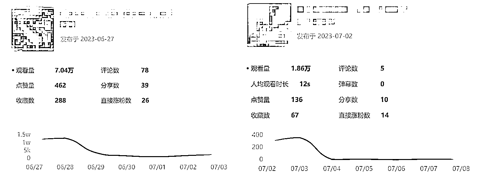
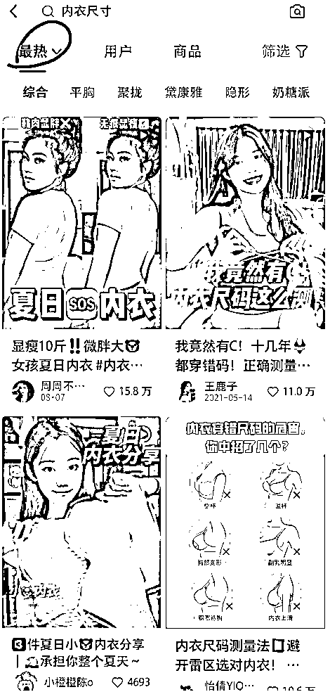

# 抓住风口，顺应规则，我是如何在小红书做电商，两个月变现 26w+的

> 原文：[`www.yuque.com/for_lazy/thfiu8/di2ceo9md30qccz0`](https://www.yuque.com/for_lazy/thfiu8/di2ceo9md30qccz0)

## (精华帖)(135 赞)抓住风口，顺应规则，我是如何在小红书做电商，两个月变现 26w+的

作者： 未兰子🌱

日期：2023-10-17

大家好，我是海内外电商通吃的未兰子 Lanny。这次生财航海参加了小红书店铺这个项目，给大家分享下我的小红书店铺战绩：运营两个月变现 26w+，销量 1.4w+。

先简单介绍下我自己：

我曾做跨境电商独立站多年，做了两三个爆品，最高月利润 20w，后面在工贸一体公司 3 人团队做品牌精细化运营，一年后因个人原因离职，团队解散，至今网站无人运营，纯自然流量月均净盈利 2 万。后面在一家公司做海外推广经理，但后面因长期紧张的工作状态，导致身体不适，想要从事自由职业，后来就加入了生财，研究起了小红书。

八月份开始做小红书，目前做到每天日销 100+，最高记录 500+，利润目前有 30%+。可以看到从八月份的顶峰开始就一直在下滑了，这个我也会在后面分析原因。

这是其中做的最好的一个账号。五月份加入航海，前前后后开了 6 个账号，尝试过五个类目，其中四个账号浅尝辄止，有出单的是两个账号，另一个账号搬运违规废了，也出了几十单，不计算在内。

我一直是一个人全职在做。和上班比，感觉比上班累，赚的也并不是很多，但心态是完全不一样的，而且我相信，机会会更多。

下面开始进入正题：我是怎么做的？

#### **我做对的第一步就是，对小红书平台先有了解。**

这也是我航海的时候会选择小红书店铺的原因之一，因为对它了解。

我之前就是小红书重度使用者。买东西做决策前，之前是上知乎搜索，后面就搜小红书了。小红书真的是年轻女性的聚集地（也是消费主力），所以我先是感受到了小红书的价值。后面小红书就开放了电商板块，生财也及时增加了这个航海项目，我觉得这是个机会。（Tips：我做这几年电商，也明白很多能够赚到钱的很多都是早期入局的，所以一定要敢于去做）

而且小红书上面都是视频图片，相较于知乎大串大串的文字，我觉得视频图文信任度更高，信息传递更快。还有我发现小红书的推送算法确实有科技。（Tips：这一点也说明了布局小红书 SEO 的重要性）

另外，小红书是一个年轻人分享生活的平台，上面真的太适合种草了，软广做的也相当好。

我之前一直做电商，对一些软文广告是很敏感的，但是在小红书，我看到一些帖子真的会忍不住点进去，有些笔记内容，明明知道它明里暗里在推广产品，我竟然都丝毫没有觉得不适，行云流水般，自己也能学到不少东西。（Tips：多刷小红书能学习到营销方法）

从上面可以看出**做小红书卖货的重点是能够解决购买者的疑问。**

举个例子，比如卖内衣的，我在小红书上看到有些账号就从这些内容出发的：

1.  如何挑选合适的尺码

2.  内衣应该选择什么样的面料

3.  内衣各种形状怎么挑选

4.  还有就是使用经验分享。我的大多数爆文都是这类话题。

我看到还有卖功效类产品互动很高的也是这类标题：

1.  真实分享，我用了 XXX 一个月的变化。。。。

2.  XXX 真的是智商税吗？

3.  。。。? 能劝一个是一个！

这些话题都是购买前做决策的大家可能会去搜索的。如果内容做的好，热度高，那转化肯定不会差的。而且显得我们比较专业，涨粉也很快，比只会晒产品和视频图片要好。

像上面说的这类内容，是可以提前就布局好的。我有几篇内容就是教大家如何挑选、怎么使用、产品成分等等，转化都很高。加上我看到几个做的很好的账号也是分享好的内容多一些，很多热度高的笔记也是分享好的内容，**所以我就想要做好内容。**

**这是我认为很重要的一点：在小红书上做内容，定位应该是分享知识，而不是纯营销。**

你可以在卖产品的同时先分享怎么挑选、怎么用、注意事项、你的使用经验等等。这类内容也会涨粉快。而且做纯营销的账号平台也不喜欢，流量会受到限制。而分享知识的这类账号可以长久做下去，其他人模仿的门槛也稍微高一些。

确定了平台调性之后，我有了一个大概的方向，接下来就是具体的做一个账号来实战了。我从头开始大概描述下我的整个过程～

#### 1\. 账号**萌芽期 - 确定定位：**

从能够持续产生内容的方向出发确定 IP，确定内容话题，从而找这个内容相关的产品。我最终锁定的是健康类的，因为现在对健康比较关注的群体也越来越年轻化。

其实我一开始加入航海，在确定类目方面走了很多弯路的，并没有上述这么清晰。

我先尝试过美甲，但是发现其实这个方向很难产生内容，很多对标账号都是晒美甲图片，而热度很高的几乎都是原创的，我自己不会原创，只能 by，感觉很难坚持下去，就弃了。

又考虑到夏天需求应该比较大，于是开始尝试防晒口罩、防晒衣，模仿其他热门帖子发布内容。有个新号刚发几篇内容小眼睛就超过一千，但是当初也考虑到多种因素，账号不在自己手上，资金结算很麻烦，就没有用心运营。**但现在回过头想想，这种方法真的还挺适合新号养号的。**

尝试过几个方向后，我才想到做健康类的产品。主要考虑这几个方面：

1.  平时我自己也比较关注这些，自己有需求，也许其他人也有一样的需求；

2.  我碰巧刷到一个账号，看到他的店铺里的产品销量还不错，这是一个我可以参考的成功案例；

3.  健康这个问题越来越受到年轻人的重视。从《年轻人养生消费趋势报告》数据来看，健康养生话题下的观众画像来自一线（占比 28.65%）、新一线城市（32.49%）的年轻女性（85.27%）成为关注健康养生的主力人群，其中，18-24 岁的人群占比 43.96%，年轻化的趋势凸显；

4.  这类内容比较利他，可以挖的很深，容易涨粉。

基于上面四个考虑，我在健康类的账号运营上，明显花的心思比较多哈哈～

我一次性运营多个账号，基于效率问题，就从简单的图文开始，在小红书和淘宝逛逛上找可借鉴的内容做修改。

一开始真的什么风险都不考虑，直接下载图片，添加了水印和表情就用一个新号发布。发了几篇后，我发现小眼睛噌噌噌往上涨，一开始还很窃喜，没想到这么简单，粉丝也从 0 个涨到十多个。这时我就立即上架了几个产品，过几天竟然也出单了，让我有点惊喜，心想小红书也太容易了。

**但是后面接二连三的告诉我笔记违规。**就这样过了一段时间，那个号就废了，小眼睛都是二十以内了。

虽然号废了，但是初始的笔记数据告诉我这个方向可行，这类话题好找，店铺里也已经有了转化，给了我很大的信心，只是直接下载后发布的这个方式并不合适在小红书上持续的进行。

所以纠结了一段时间后，我最终下定主意，干脆利落的弃掉这个新号，用回我自己原来发过内容的老号继续做。

#### **2\. 账号成长期-优化笔记：**

这次我找到对标内容后没有直接发布，而是自己用 Canva 作图文了。不过顺利的是，很快有两篇帖子的点赞和曝光都不错，粉丝也开始上涨。我开始上了原来出过单的产品，也开始慢慢的混剪产品相关的视频去发布。

有个产品出单很好。我就更加深入研究跟这个产品相关的话题。我具体会研究它的名字都有什么叫法，一般都用在什么场景，有哪些功能，在淘宝上看这款产品有什么评论具有话题性的。然后就衍生出好多内容出来。

一开始没有样品，我就在淘宝上下载评论区的图片和视频进行剪辑。后来就开始自己解决素材了。

另外我认为，新手创作笔记最最最重要的一点，也就是很多大佬提到的就是学会模仿。

内容主要可以分成三个部分：封面、标题、视频文案/图文笔记内容。这三点我们要拆开来，找小红书上最热的模仿。

怎么模仿呢？

比如卖内衣，我们今天的内容话题是内衣尺寸，你就可以输入这个内衣尺寸，按照最热排序。

我们可以根据发布的日期、博主粉丝的数量等等心理做权重分析，看哪个标题最吸引自己，就模仿标题，再看哪个内容更吸引自己，就模仿内容，再用 ChatGPT 重新编写，标题也是这样操作。

我后面没有用任何的工具，只用了这个方法，就做了很多爆款内容。

当然，我们也可以找最新的内容，看哪个点赞比较多的，粉丝又比较少的，赶快复制。

如果你每天日更，感觉到才思枯竭，那可以从下面的四点找到好的内容想法：

1.  模仿稍微够一够就能达到的账号：可以用小号关注一些跟你差不多或者做的稍微好一些的博主

2.  代入自己，在买产品之前会考虑的问题

3.  售前或者售后客户常问的问题

4.  其他在买之前会搜索的内容：可以在小红书搜索框输入关键词，或者用工具 5118 获得更多话题内容

还是重复上面的，我们做小红书卖货要专注内容，好的内容才有流量。卖货就要考虑到消费者会关注什么内容，多从这个角度出发。

除了之前提到内衣的例子，比如你卖健腹轮的，那话题可以围绕：马甲线、大肚子、腹肌等等这些话题，而不是这个健腹轮真的很好，用的什么材质等等。这些可以讲，但不是重点。而且你刚起号的时候，也建议不要讲这些，纯健身分享。

下面几个话题可以用在不同的产品上：

1.  真实经验分享

2.  我用了...天的变化

3.  。。。真的有用嘛？

4.  。。。真的是智商税啊

5.  。。。能劝一个是一个

还有几个小点可以提一下：

1.  封面可以带上标题：鲜艳，字体要大 吸睛

2.  文案标题可以带上 emojis

好了，那上述的内容其实都需要我们多刷小红书，这个群体有一些专属的文字、比较关注的内容都和其他平台不一样的。要找好感觉，就要多去刷一刷。

#### 3\. 项目成熟期-解决货源

这些内容确实很好，后面稳定出单后（比如每款产品每天能固定出 10 单以上），我就开始找固定的供应商，解决发货、物流等问题了。

供应商我都是在 1688 上找的。我找供应商的时候会看**销量、价格、评论和店铺的粉丝量，找个四五家，就可以确定下这款产品产地集中的地方，去掉其他产地的，然后确定好两家。**

再发展到后面，因为粉丝也有一定量了。我担心会被平台识破我从其他地方拿来的图片和素材，就问供应商要实拍图片，他们一般也都配合。再到后面我就自己拿样品回来拍摄，拍摄的素材分类保留下来，下次换个话题还可以拼凑剪出来，省不少时间。

但是我也不是事事顺利的，尤其是自己发货后才发现踩了很多坑：

1.  **一定要留至少 X+3 天的库存作为底线（X=补货所需运输天数）。**

因为有个供应商离我们这里很近，当天发货，次日就能到。所以那天产品差不多卖完后我才开始下单，次日到的结果都是劣质品。我去问供货商，结果他说因为厂里出了问题没有现货，从别的家拿的。结果我所有客户的单子都给耽搁了，丢失了几单，物流评分也下降了。

一般国内电商经验比较足的应该不会出现这种问题，我就是因为之前拿货都没什么差错，这次就是没有居安思危。而且这件事后，我也立马找另一家供应商拿货了。因为这个供应商太不负责了，没有同理心，给我换了产品且是品质差的产品，不提前告诉我。虽然后面也有陆续拿货，主要是不想闹得太僵，因为他都知道我的店铺信息，避免多个风险。做生意以和为贵，能不结梁子就不结梁子。

1.  **赠品也要做好库存管理。**

我的一个赠品是印刷品，当时下了单也没有注意物流动态。过了有三四天左右我才看到，我就问怎么回事，结果说是因为下大雨耽误了，发不了货。我非常着急，因为他们也不知道什么时候能发。眼下已经没库存了，后面我就想到打印店可以打，马上联系附近的打印店，花了 5 倍高的价格为这次失误买单。尽管是赠品，也是要做好库存管理。

#### 4\. 项目成熟期-增加流量

因为之前一直带上标签#商品笔记扶苗计划 以及那段时间的热门话题，有好几篇自己拍摄的笔记给了流量，都是大几千一万这种，这阵子我的单量也噌噌噌往上涨。

**真的就是那句话：****平台规则才是第一。****所以后面我都是会看平台又有什么新动向，有哪些话题我可以参与的。**（包括我在写这段内容的时候是双十一扶持直播，我就开始直播了。)

除此之外呢，还有就是一定要关注并且参加小红书的话题，尤其是商业话题。比如我参加了多次小红书七夕礼物季，那流量可真慷慨大方。

这些话题都是在标签里体现出来的。所以标签也是很重要的。

分享几个我常用的工具：

1.  视频剪辑：剪映为主，有需要的可以用美图秀秀加美颜滤镜

2.  图片编辑：美图秀秀（建议买会员，无论是文字、贴纸还是音乐都很符合小红书）、Canva

3.  文案产出：ChatGPT、new bing chat

#### 5\. 所有的环节中，选品相当重要，因为内容要依附于产品

我觉得还有个关键因素就是产品。我之所以能这么幸运，我觉得是因为选对了产品。我单就一款产品就卖了两万多个，一万多单。

这款产品的特点就是**好看，也有用**，在市场上还比较新，可能出现得比较早了，但是还没有被大多数人发掘。功能比较实在，内容就比较好创作。

因此，产品的选择上也非常重要。我们可以利用工具选品，比如蝉小红，抖音相关工具，但是我个人感觉更多的还是运气和坚持。感恩～

所以，这也解释了我为什么高峰后销量就一直下滑了，一是因为这类产品已经被其他卖家跟上来了，市场需求也逐渐得到满足，就要另寻他路。二是因为平台流量的倾斜，我上面讲到我这次流量也有很多是平台的奖励。后面因为跟此类产品相关的话题少了，流量自然也下来了。

我目前正在筹划做养生食补赛道的产品。如果有资源的可以推荐哈，感谢～

上述就是我这次的分享，因为时间也比较赶，这几天比较多精力在选品上，一方面是准备用上述思路起一个号，另一方面也是因为产品都是有生命周期的，这阵子产品热度下来了，销量也在下滑，所以要赶快做出应对，不要死磕老产品。

最后，我想总结下这段时间我能取得这小小成果的几个点给大家以参考。

**首先，做你感兴趣且稍微擅长的事情。**

比如，我对健康类的知识很感兴趣，我就有心思去做，而且还打算去进修。再比如我之前做过跨境电商，对内容营销也有些经验，算是稍微擅长，所以我对好的内容很敏感。

对的，**只要这个市场够大，没有成为红海，只要你稍微擅长，你能取得小成果的几率就很大了。**

包括有个朋友，他之前做销讲的，后面开始在抖音上做直播带货，卖男装。现在做的风生水起，我跟他比就是个小弟。他没有选择做女装，也不是做内容营销，而是做男装做直播。我相信，在自媒体这个大领域，一定也能找到你的一席之地。

**其次，一定要抓住风口。**

如果小红书电商前年就火热了，那我现在入场肯定很难，需要耗费更多心血。就跟我当初在独立站有点势头就去做独立站一样。所以只要你听说了新的玩法，大胆去试试吧。

**还有就是平台规则，一定要顺势而为。**

你做这个平台，就要看它有什么新的玩法。比如小红书注重素人种草、有价值的内容、好看的图片等等，你如果这么做了，成功率也会很大。

最后，我们都知道现实情况是多变的，所以更好的平衡思考和行动，才能扩大项目成功的概率。

**我们既要脚踏实地去做，也要有时间去思考，缺一不可。**

* * *

评论区：

翔叔 : 海外独立站现在还适合入吗？
zhAzha : 不是很理解为什么不做好独立站
未兰子🌱 : 我个人感觉可以做小众产品，满足某类人的需求。但是大体上来说没之前好做了。如果是新手不建议入局，如果产品和营销渠道都有优势，可以试试。
未兰子🌱 : 当初不做独立站其实不完全是我自己能掌控的。因为是上班打工的，工厂产品本身存在很多问题无法很快就能解决。当然自己也确实觉得太累了。就现在对比小红书来看，更印证这句话。前期（一般两三个月）独立站基本都是亏损，测品没测好，或者营销没做好，可能会一直亏下去。这都是潜在风险。加上独立站更重视营销，一个人做除非你真的特别幸运，发的内容或者合作了几个博主突然就火了，不然都要堆内容的。所以相对而言，我如果自己做，不会选择独立站。
嘉明 Lock : 没想到评论区的回复对我现在帮助也超级大，及时止损。
亦仁 : 感谢分享，已加精华。
金珠 : 主要品类是哪方面，就是健康方面吗？
西瓜🍉 : 需要自己囤货吗？小红书出单之后，再去 1688 下单厂家发货吗

* * *