# TikTok 美国小店日均 GMV 达 600 万+美元，对我们来说有哪些机会？

> 原文：[`www.yuque.com/for_lazy/thfiu8/al0722ics4gdtlxy`](https://www.yuque.com/for_lazy/thfiu8/al0722ics4gdtlxy)

## (精华帖)(94 赞)TikTok 美国小店日均 GMV 达 600 万+美元，对我们来说有哪些机会？

作者： 阳光杉木

日期：2023-10-20

一天总体的 GMV 在 600 万美元，整体数据不断上升的美国小店，依然有很多人觉得难，不知道怎么玩？

其实，做 TikTok 美国小店，不同资金、不同的人、不同体量的店铺入局玩法都不一样，但总体思路是与其他电商平台一样的，无非就几个问题：

1.  爆品还是长期品？

2.  供应链是否稳定？

3.  产品的曝光和推广怎么做？

但很重要的一点是，要玩下去或持续在这个赛道拿到结果，核心一定是选品。

接下来，我结合案例解析，从开店、货盘、店铺运营、选品玩法四个方面，分享 TikTok 美国小店该怎么玩，希望对大家做 TikTok 有帮助。

目前美国小店整体数据呈现上升趋势，皮皮汇总一篇文档，给大家学习和了解。

**第一个门槛，就是店铺的稳定性**

被封原因汇总：

（1）对大多数商家来说 店铺入驻门槛是达不到官方要求的，而市面上大多数通过买资料买店铺的资源也优劣难分，导致封店铺

（2）由于官方要求本土货盘 没有货盘通过虚拟仓从国内发出（国内发出 通过物流商隐藏轨迹 从而模拟海外仓发出）又受到平台打击

（3）自身小店商品质量以及履约能力不够导致封店

# 一、关于店铺

目前 TK 在美国主要是三种电商模式：本土小店，跨境小店，全托管模式。

**（1）美国本土小店：**

美国当地主体或个人申请的小店

**企业入驻条件：**

1、美国本土企业（接受中国籍法人占比 25%或以上美国主体）；

2、本地备货,货在美国,支持商家海外仓自发货尾程或者平台物流自提；

3、要求单类目亚马逊美国站总流水大于 200 万美金以上,流水越大优先级越大,优先处理大于 1000 万美金的商家

相关入驻资料可以评论；留言我发给大家

**（2）美国跨境小店：**

跨境店对应入驻门槛及要求

**1、具有本土货盘的跨境卖家**

1.  具有美国本地仓储物流能力，需美国本地发货请注意，目前支持美国海外仓或 FBA 多渠道配送发货，暂不接受跨境发货、虚拟海外仓

1.  具有跨境电商运营经验，单店铺年 GMV 超过 200 万美金（例如亚马逊）

1.  具有达人建联能力，及一定的内容运营能力如具备短视频拍摄、直播运营能力

**开放类目：**

1.  美妆快消:美妆个护

1.  3C 硬件:汽车&摩托车、电脑与办公设备、手机与电子产品

1.  时尚配饰:母婴、时尚配饰、珠宝配饰及衍生产品、儿童时尚、行李箱与包袋、男装与内衣、民族服饰、鞋类、运动与户外、女装与内衣

1.  家居生活:汽车&摩托车、母婴用品、美容与个人护理、家具、健康&个护、家用器具、家用电器、厨房用具、宠物用品、运动与户外用品、纺织品与软家具、工具与五金、玩具

1.  收藏品

1.  食品饮料

**2、已出海品牌在目标市场国(如美国)**

仅满足以下四个要求之一即可 :

1.  社交媒体(如 TikTok、Instagram、Facebook 等)粉丝总数达 10w 及以上；

1.  独立站月访问量 PV 达 20W 及以上；

1.  SEO 月搜索数达 1W 及以上；

1.  或在目标市场已有线下品牌直营店、或渠道店；

1.  未出海品牌满足以下三个要求之一即可；

1.  年营收达 1000 万美金及以上，或累计融资金额高于 150 万美金以上，或固定资产高于 150 万美金以上；

1.  上市公司出海项目；

3.  BrandZ 上榜品牌/Kantar、胡润榜 Top 100；

**3、未出海品牌**

满足以下三个要求之一即可 :

年营收达 1000 万美金及以上，或累计融资金额高于 150 万美金以上，或固定资产高于 150 万美金以上

上市公司出海项目

BrandZ 上榜品牌/Kantar、胡润榜 Top 100

**（3）美国全托管：**

目前全托管主要是在沙特，英国，美国上线。卖家或者工厂只供货，且只能供货。平台帮你解决流量销售，收款，发货，售后等一系列问题。

# 二、店铺运营思路

以下是一些店铺运营思路分享

**（1）低价拉排名**

小店在正常上架商品以后，直接在不同的商品链接上架一个最低的 SKU 商品，并且保证自己不亏损或者是少量亏损，需要限制好库存；

同时制作属于该商品的短视频，挂短视频橱窗，当天 24 小时以后，在 ads 广告后台，通过投放视频播放量的方式，把这个带有橱窗链接的短视频 推广出去。

连续推送 3 天，可根据调整情况给预算和库存【可以在观察 24 小时播放量的同时看出单量，看看这个品能不能起来，其中一个 SKU 是不赚钱的，最主要的几个 SKU 利润高点即可（新人不建议尝试 ）

优惠券吸引客户同样道理

**（2）铺达人打法**

**1、寄样**

以铺达人为主，前期可通过**大量寄样拿到优质的投流素材**，重点是**和达人沟通好投流的流量不给佣金**，只能拿到播放量和涨粉。

实操下来大多数达人还是同意的，不同意的实在不行可以**给 1%-3%**。拿到达人的 AD Code 之后，用一条新链接去绑定广告，这样投流出的单就不需要考虑达人的佣金成本了。

实操过程中，**本身有自然流的视频建议等自然流快结束的时候进行投流测试，这样往往是可以带动再起一波自然流的，一般观察一天内的情况。**

素材选择方面，出单的视频都可以试投，**自然流超过 1M 播放的谨慎投流**，**10K 以上转化率 OK 的素材可以多一些预算测试**。

**2、不寄样**

通过给达人素材，达人口播进行讲解，这样会**快速测试市场**，将**试错链路拉短**，达人+厂家素材一结合，就是一条完整的带货素材。

**（3）纯付费拉动小店流量**

小店正常运营情况下，可以把全部的客单价抬高，尝试付费拉动

这里面最大的坑是一个成效费用是多少，投多少钱才能赚到这个付费的钱，美区测试过不少品，一般是**10-20 美金/CPA**，产品的素材和热度 ok 的话，可以直接投放 视频播放量，直接拉播放量，CPM 1-2 美金；

如果产品素材一般和热度一般，最好是控制出价才能拿到比较好的 ROI，不要盲目提高预算。

预算 500 以内，按照 50 叠加，预算 1000 以上，按照 500 叠加，放量复制计划 3 条，观察 1 天，不行的话重建计划，预算拉 5000 一组，匀速消耗，随时观察，ROI 不行的话直接关掉

**1、投流的相关思路**

核心策略：定向太窄可能导致计划跑量困难，定向太宽可能导致人群不精准，需要通过调整来控制

对于跑量不错的计划，定向本身就比较宽的情况下，想要紧缩定向，建议不要直接在原有计划上修改，而是通过复制计划，修改定向来紧缩人群

**新计划如何优化素材？**

**核心策略：投放素材为王**，新计划出现不消化的问题排除出价、定向的原因后，最有效的解决方案就是调整素材。每天保持不同类型素材的创作频率，同时对老素材进行数据分析，明确优化方向，寻找优质素材共性。

评估素材质量，一般看 3 秒播放率、点击率、转化率等数据

**2、执行策略**

如果素材一直不出量，首先果断**停掉老素材**，**判断素材 3 秒播放率的留人能力**，通过对**老素材优化 3 秒关键帧，生产新素材。**

新素材出量快，但不转化，可以将素材拉群出来分析卖点表达是否充分，结尾是否有引导，针对有问题的部分进行素材优化，保留优点优化缺点。

**（4）商城搜索流量有待开发**

通过优化链接，提高链接的权重拿商城流量 这一个动作，目前商家做的也比较少，是机会点之一。

**（5）做内容带货拿佣金**

有运营账号经验和素材打爆经验的团队，可以直接不用发货，去和商家合作，做内容拿佣金赚利润，后续会延伸出机会。

**总结：**

**1、自然流做账号**

**起号难、需要铺量，需要时间持续积累 2、大量找达人带。**

**目前是有拿到大结果的  目前皮皮上看到销量很好的一些小店商家打法，有非常多的达人帮忙带货 同时以上也有分享，通过达人可以拿到大量的 ugc 素材，解决素材问题  **

**3、投流拉爆**

目前来说**投流依旧在早期，整体投流情况是比较糟糕**的，目前纯投流小店玩家非常少，但投流赛道后续一定会产生许多大结果的商家

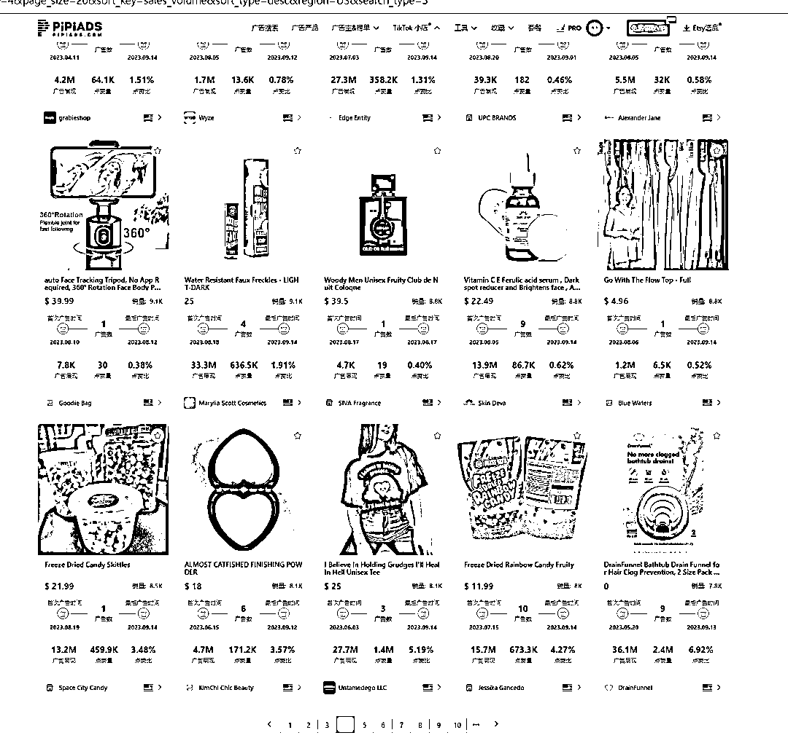

（pipiads 查看美国小店投流数据）

# 三、**关于货盘**

货盘目前卡了大部分商家，我跟大家聊聊玩法和机会：

**（1）多平台分摊风险**

**（2）与本土货盘合作**

**（3）自己备货**

**注意：虚拟仓目前不建议，平台打击**

**（1）多平台分摊风险**

如果你同时有多个平台的跨境业务，就不用太担心滞销的问题，例如你有做独立站，是可以同步独立站和美国小店一起分摊的。例如你有做亚马逊，同样的道理。

**（2）本土货盘合作**

目前身边有亚马逊卖家朋友，或者相关亚马逊渠道的，可以和他们达成合作，从他那里拿货。这一点是值得研究的，特别是亚马逊大卖家 一些产品同样契合美国小店。

与此同时，还有一些其他商家 或者当地的货盘的资源有待开发，可以分析老外的货盘是从哪里拿货

**（3）自己备货**

自己备货 对选品的要求非常高，建议选一些货本相对较低，重量较轻，产品新颖的品少批量进行测试，拿到结果了在逐渐放大，非常考验开品能力

**注意：核心一定是选品，这是玩下去 或者持续在这个赛道拿到结果的核心。如果你有开品实力，就会容易很多**

# 四、**关于选品玩法**

**（1）国内搬海外**

国内一些类目 是可以直接复制到海外的 目前我看到很多玩家做的品，就是国内的品（例如国内爆了的健身轮）

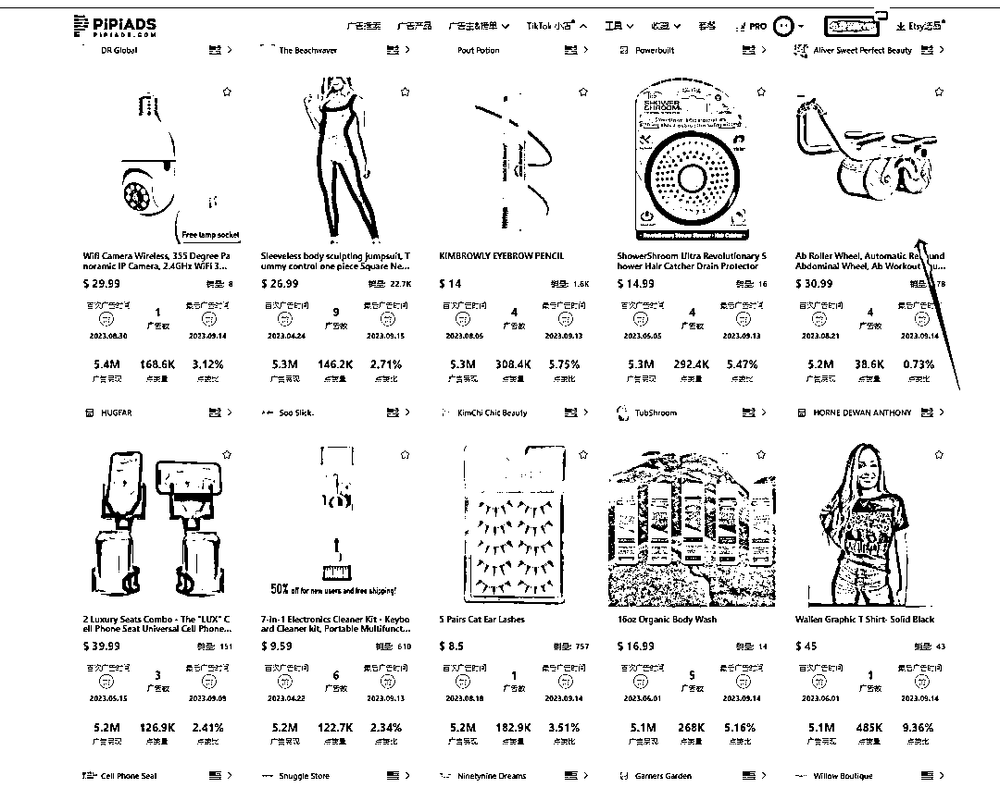

**（2）平台信息差**

独立站 亚马逊 etsy 等社媒爆的品 就可以考虑继续美国小店尝试一波

推荐 etsy 平台，etsy 上的品和 tt 非常契合

**数据选品网址链接：[etsyshop.ai](http://etsyshop.ai)**

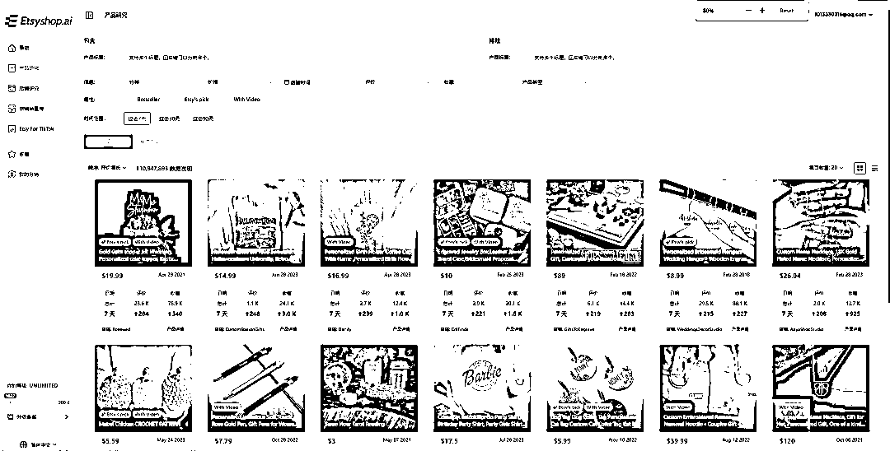

**（3）地区信息差**

目前 tt 有多个国家和市场 对应的 一些产品是全球通用的。东南亚爆了，就可以调研美国市场，看看有没有机会。

**选品数据（以 pipiads 为锚点）皮皮可以看到美国小店相关的投流数据及销量情况，大家可以实时跟进了解市场信息**

# tiktok 小店亿级赛道案例解析

通过 pipiads 数据检测到海外摄像头市场增长迅猛，多家广告主进行 Tik Tok 广告投放拉爆单品摄像头拿到不错的结果。

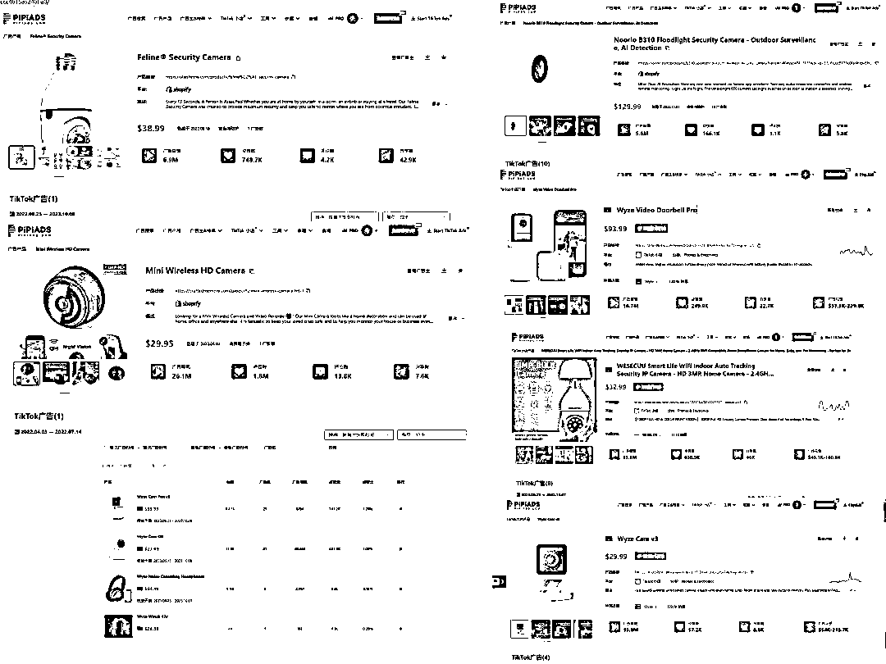

（多广告主投放数据部分截图）

欧美摄像头是全维度的发展，商业，家用，城市建设等等需求日益增长，而**出海赛道热潮主要集中于智能家用安防系统下**

**消费者的需求也有迹可循**

**（1）生活上安防意识提升：**

1、欧美家庭很多都是独门独栋的房子，**主要场景运用于室内、院子、车库、花园**，需要多个摄像头去了解和观察外界环境。

2、**家里有老人、小孩、宠物等，因工作或外出原因无法照看时了解情况**，通过监控系统掌握情况从而放心工作。

**（2）技术红利**

1、**硬件安装、传输，到软件储存、维护，技术门槛的降低**，以前给在海外安装一套智能产品需要借助第三方的上门服务，**一次服务费大概在二三百美金左右**。

现在随着技术的发展，**买家可以自己安装，简化一系列步骤后大大降低了门槛。**

**（3）供应链端的成本优化及市场的良性竞争**

出现**更多物美价廉的安防系统 回到消费端以更实惠的价格和更优质的产品走向市场。**

**爆品：**

以**灯泡摄像头**举例

这款品是**好几年的老爆品**了，现在依旧有人再做

最早由多个不同的独立站广告主在 tiktok 上将其**不同地区反反复复打爆售卖关键词：地区差异化+素材差异化**

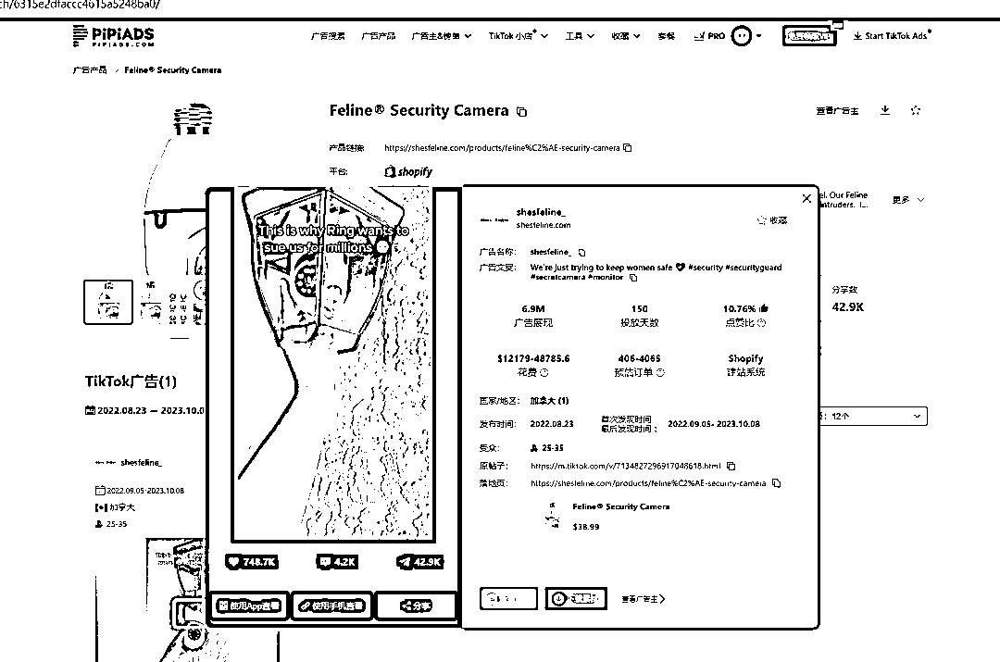

**观察亚马逊发现其售卖情况-多家跟 几百上万单不等**

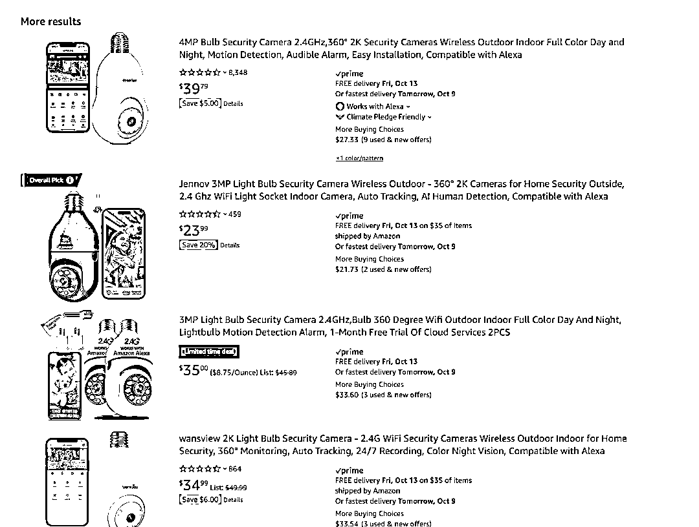

**观察沃尔玛其售卖情况 多家跟 几百几千单不等**

**观察谷歌搜索其搜索情况 多站搜索数据浮现**

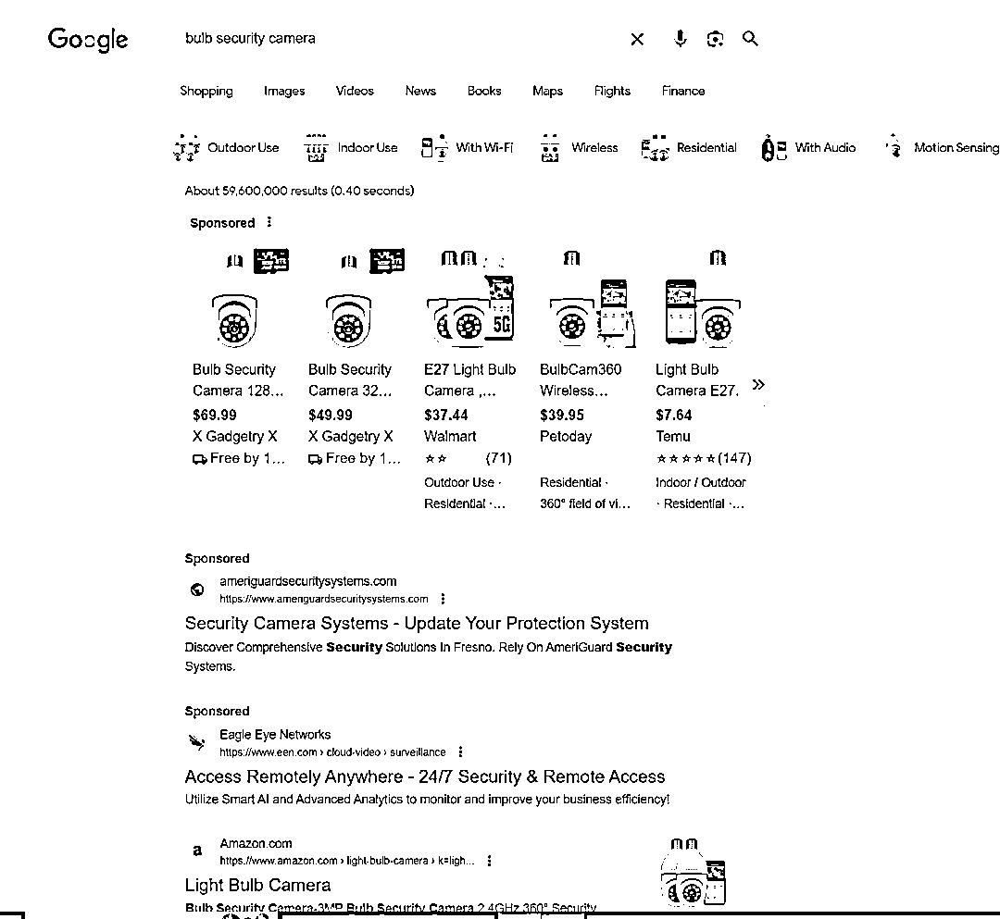

**观察 tiktok 美国小店近期售卖情况**

**多家小店做，几千单不等  **

**爆品总结:**

爆品具有**多平台售卖共性**，也就是说 大多爆品各平台的销售情况都是有出单的

**反推平台与平台差异**

（1）观察社媒渠道出单 拿到电商平台评估是否有机会

（2）观察社媒单平台爆了 拿到其他社媒平台看是否有机会

**反推地区与地区差异**

（1）观察美区爆了 拿到欧洲等其他地区看是否有机会

（2）观察美国爆了 拿到其他国家看是否有机会

**反推平台内素材差异**

（1）观察自然流小爆 拿去投放是否有机会

（2）观察独立站爆了 拿到小店看是否有机会

（3）观察某一条素材爆了 迭代新素材创意看是否有机会

**反推产品差异**

（1）观察某产品爆了 找同质化差异产品复制看是否有机会

（2）观察某类目爆了 延伸类目周边挖掘看是否有机会

而以上思路的本质源于对市场的了解 用户需求的把控 以及信息的提取

**在这里 皮皮用户以 pipiads 为锚点**

**1、如需查询特定的广告主**

可通过**搜索产品关键词 网站域名**来获取友商售卖情况

注意：由于投放的特殊性 如广告文案和关键词信息很多广告主未关联，就会漏过很多信息 很多数据你就会搜不到

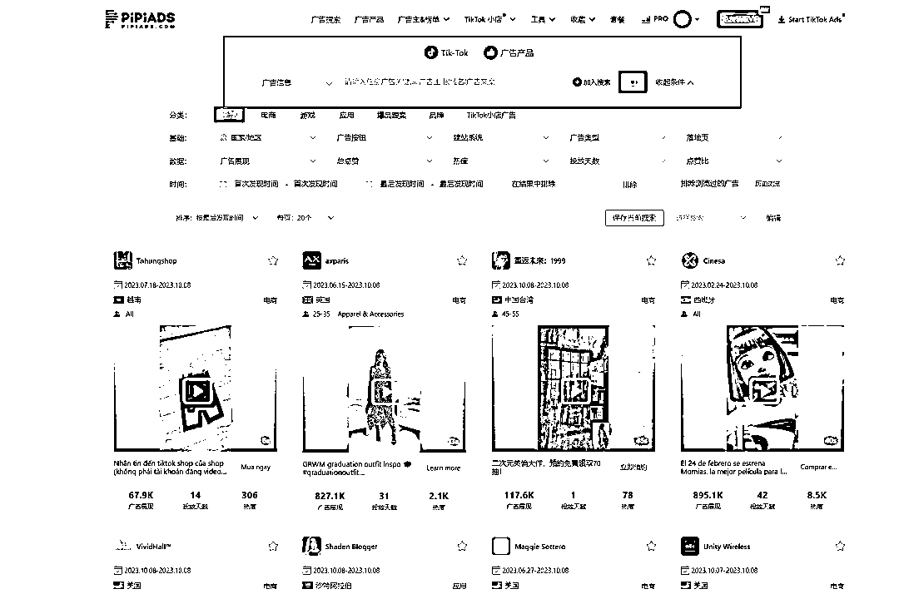

**2、如需实时查看爆品数据**

时间**选最近 3-7 天的广告** 广告产品 广告主 通过**广告展现从大到小排序筛选** 或**广告数从大到小顺序排序筛选** **每天持续去刷一遍 了解实时投放动态**

**3、如需查看小店数据**

进入 pipiads 小店页面 选择对应的国家 通过广告展现和销量排序进行查看观察

**总结：**

**1、选品核心是挖掘市场需求 提炼市场信息 需要多维度 高密度的去持续分析市场情况 了解市场动态**

**2、通过 pipiads 等工具分析和研究有结果的人是怎么做的 向他们学习 并实践验证自己的选品思路长期品牌**

以摄像头品牌**Wyze**来给大家分析

（Waze 亚马逊部分售卖数据）

Wyze 是一家总部设在华盛顿州西雅图的美国公司，专门生产智能家居产品和无线摄像头，由前亚马逊员工在 2017 年创建 其中四个创始人 有两人是华人

（Wyze 独立站）

他们的成功秘诀 我提取到一个最关键的点在于**极致性价比**

它成功地将带有 WIFI 链接、APP 软件的**无线摄像头的价格拉低到了 20 美元**，而那时候其他的**相似产品都在 100 美元，甚至 150 美元以上。**

**低价+优品 受到消费者狂热的追捧+传播以用户为核心+寻找优质的代工厂+自主研发能力 缺一不可 pipiads 观察到 Wyze 的美国小店情况**

小店有**26 个产品** 短短**几个月累计出了近十五万单**

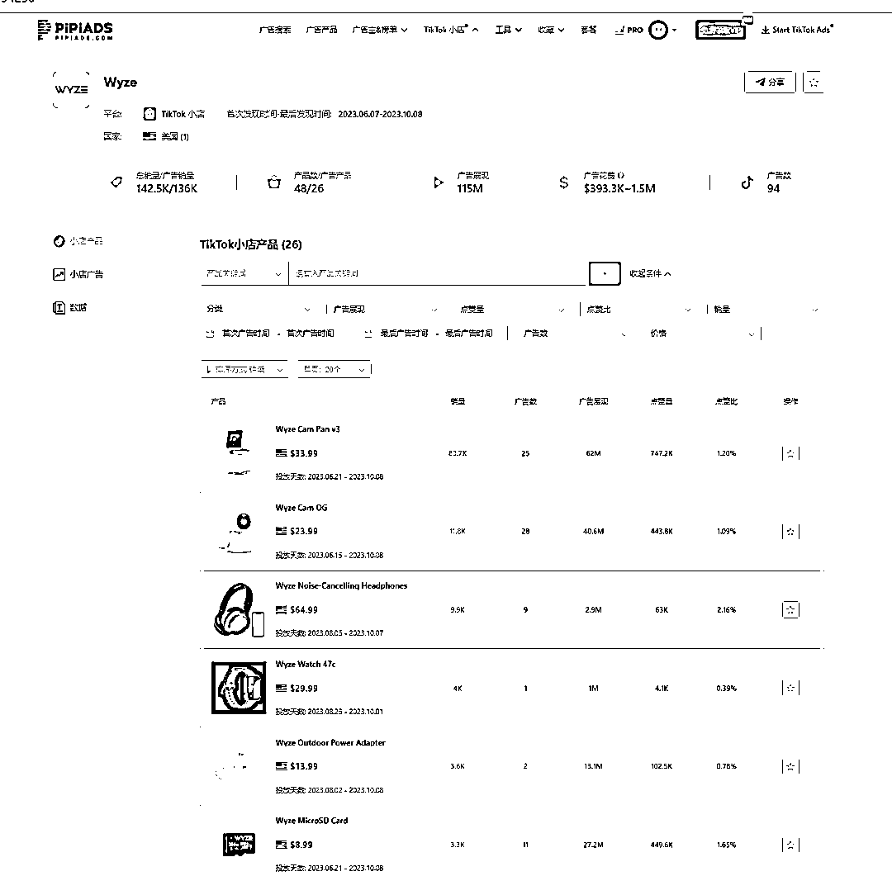

**观察出单量最多产品**

号称同价位无敌的**Wyze Cam v3**

pipiads 观察到该品累计出了**8 万单**

定价 **$33.99，**约**272 万**美金销售额

皮皮抓取广告数 **25 条**

广告展现累计 **62M**

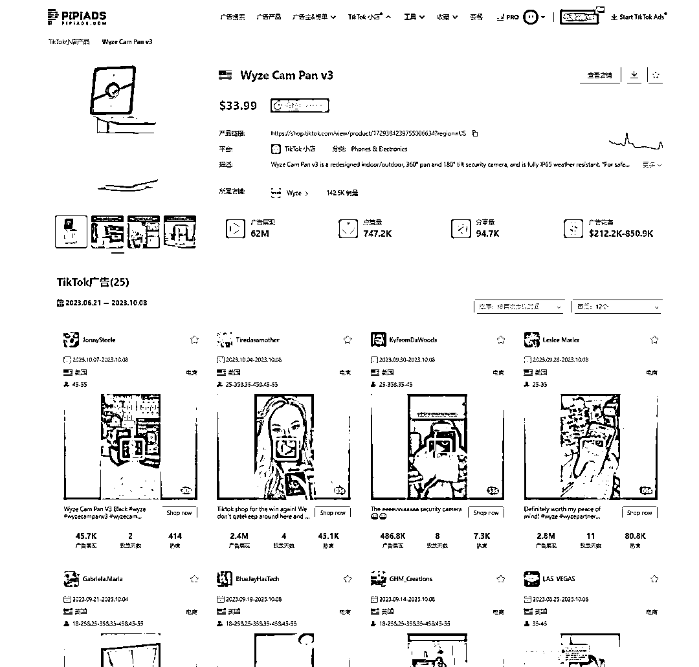

该款支持多方式安装

1.  高清录制

2.  夜视功能

3.  改进麦克风和扬声器 实时双向通话

4.  支持免费的云存储功能

5.  支持运动和声音检测

6.  支持烟雾及一氧化碳报警协同

**总结：极致性价比影响用户心智**

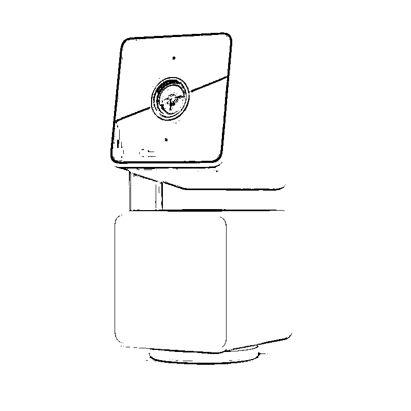

**总结:**

**tiktok 的流量蛋糕 未来会有更多的品牌进入 一些小赛道对应也会诞生更多的新锐品牌**

**（1）品牌故事与市场结合打组合拳**

摄像头赛道是一个千亿级赛道 有无数创业者想切入分一杯羹 而你对品牌的定位可以参考 Wyze 以极致性价比迅速席卷市场 从而进行广泛的自主传播

**（2） 从群众中来到群众中去**

选赛道选品本质就是挖掘市场需求 解决用户痛点 满足用户需求 提升用户服务质量 品牌长期道路需要紧紧围绕用户 而这对任何一个公司来说 都很难 但又必须去解决它 所以不同体量对应满足不同的需求

**以细分小赛道切入会更加容易**

**（3）技术创新+成本压缩**

**任何产品都要回到供应链** 供应链的质量 稳定程度 这都需要去磨合和挖掘的 尤其电子产品赛道在这些基础上去降低成本同时考虑产品质量更是难题与机会

总而言之，爆品也好，垂直站也好，小品牌也好，大品牌也好。每一个公司都有自己去寻找的使命和需要完成的意义。

无需急躁 先让自己慢下来

* * *

评论区：

静水流深 : 安防这个品终于被你们追踪到了，我朋友刚刚洗完了一遍[呲牙]
阳光杉木 : 你速度够快的 刚发马上就看了
静水流深 : 你是大作肯定要第一时间拜读啊
仙贝壳 : 真诚发问，大佬可以留个联系方式吗
亦仁 : 感谢分享，已加精华。
仙贝壳 : 大佬可以留个联系方式吗，有问题想询问您

* * *