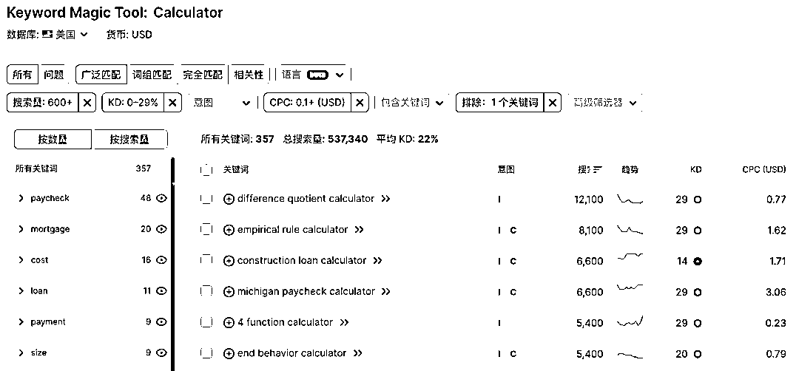
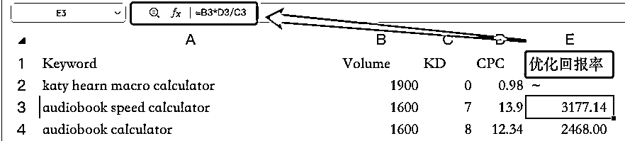

# 用一个公式来判断关键词是否值得做，让你选择关键词不再犹豫

> 原文：[`www.yuque.com/for_lazy/thfiu8/munoone8k9uosmlh`](https://www.yuque.com/for_lazy/thfiu8/munoone8k9uosmlh)

## (25 赞)用一个公式来判断关键词是否值得做，让你选择关键词不再犹豫

作者： 哥飞

日期：2023-10-16

大家好，我是哥飞。

哥飞原创了一个公式，用来帮助大家在找词时轻松判断一个词是否值得做。

很多时候，关键词没选对，后面就白干，所以选词很重要。

哥飞之前在《[海外工具从需求挖掘到网站制作一篇文章让你搞懂](https://wx.zsxq.com/dweb2/index/topic_detail/811844452441512)》跟大家很详细的聊了要如何去挖掘关键词，按照方法大家也能够挖掘出一些关键词，但是下一步，如何判断哪些关键词能做，哪些不能做，就不知道怎么判断了。

于是，哥飞就自创了一个公式，参考 ROI 的定义，造了一个 KDROI 概念，用来帮助大家判断哪些词值得做。

投入产出比（ROI）=产出/投入*100%，用来判断你做某个事情，花了多少钱，能够回来多少钱，如果大于 100%就是赚钱，等于 100%是不亏不赚保本，小于 100%是亏钱。

优化难度回报比（KDROI）= volume * cpc / kd ，其中 volume 是关键词搜索量，cpc 是关键词广告单价，kd 是关键词优化难度。

volume * cpc 表示关键词的价值，再除以 kd 就相当于是每 1 单位的优化难度能够带来的价值，也就是优化难度回报比。

Semrush 和 ahrefs 都可以查关键词的优化难度，其中 ahrefs 对于优化难度还进行了量化。

优化难度不是线性的，优化难度越高，需要做的努力就越大，所以公式 volume * cpc / kd 中的 kd 也可以换算成外链网站数量，这就是线性的话。但是换算需要太多工作量，所以我们也可以简单近似处理，就用 kd 去计算。

通过计算每一个关键词的 kdroi ，再对关键词按照 kdroi 从高到低排序，就得到了最值得做的关键词列表。 我们实际举个例子，我们打开 Semrush ，输入《[给 AI+工具方向航海家们的需求密码关键字大全](https://wx.zsxq.com/dweb2/index/topic_detail/411822528844528)》中列出来的 51 个关键词中的“Calculator”这个词，设置筛选框搜索量 600+，kd 为 0～29，cpc 大于 0.1，排除“near me”关键词，就得到了下面截图所示的总共 357 个关键词。

我们点击关键词表格右上角的导出按钮，下载 csv 或者 xlsx 文件，在电脑里打开。保留 Keyword、Volume、KD、CPC 这四列，把其它列都删除。

然后新增一列，输入公式 =B2*D2/C2 ，拉一下这一列就计算出来了优化难度回报率。之后按照这一列从高到低排序，就得到了一个新表格。

完整表格太长了，哥飞放这里了 [`text.is/vckdroi`](https://text.is/vckdroi) ，大家自取。

当然你也可以自己打开 Semrush 去查询任何关键词，得到关键词列表后，按照哥飞教的方法去计算 kdroi 。

我们选词时，尽量选择排在前面的 kdroi 大的词即可。

好了，我们文章讲完了，学会这个方法，是不是对于选词就不在话下了。

有任何问题，欢迎评论区留言。

* * *

评论区：

哥飞 : 基于我这个公式，做了一个前端小工具，你上传从 Semrush 下载的表格，上传到这个工具，就可以在前端计算出 kdroi ，之后你就可以下载计算好的表格数据。
数据在前端计算的，不用担心关键词泄漏。
代码还开源了，大家可以自己本地部署或者在 vercel 一键部署使用。
[`github.com/Kunsect/roi-calculator`](https://github.com/Kunsect/roi-calculator)
K7 : 感谢哥飞教练的思路，受益颇丰

* * *