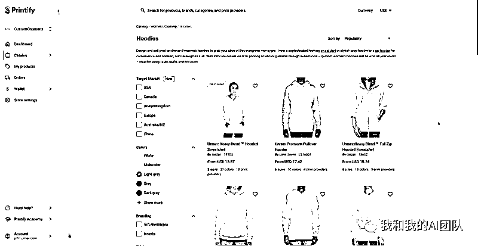
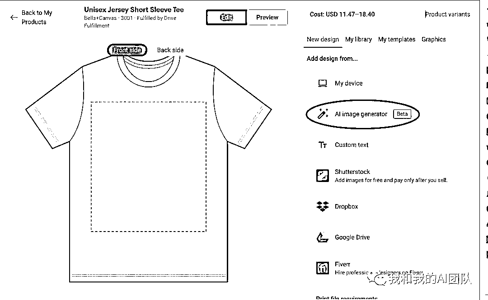
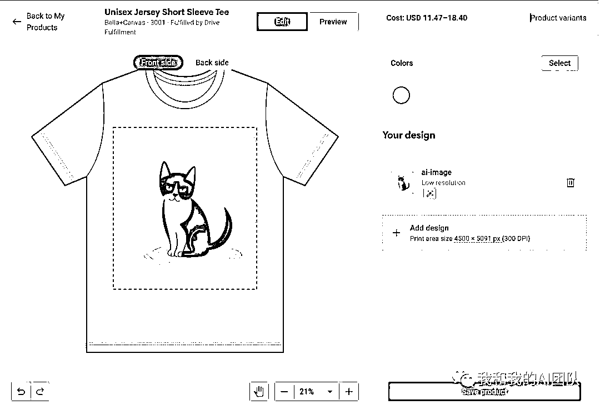
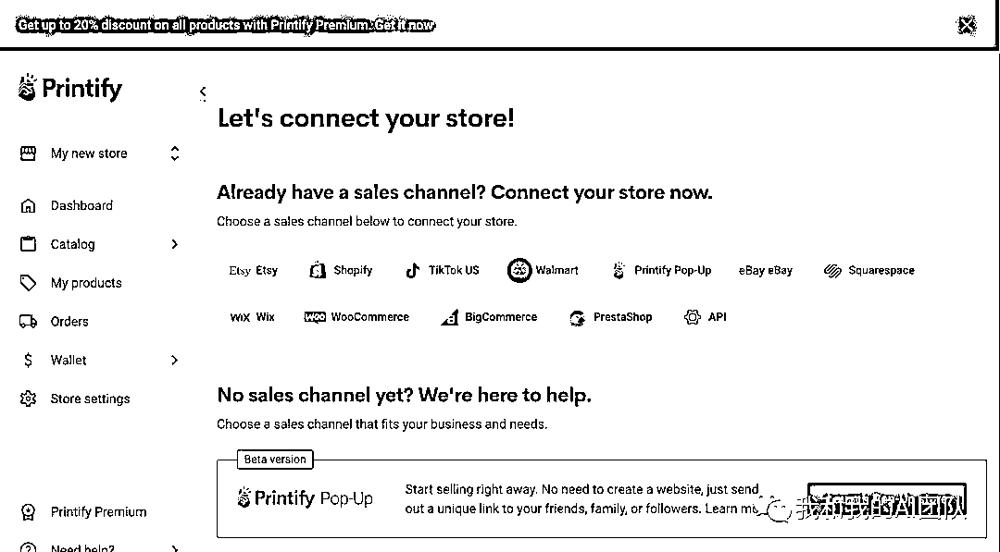
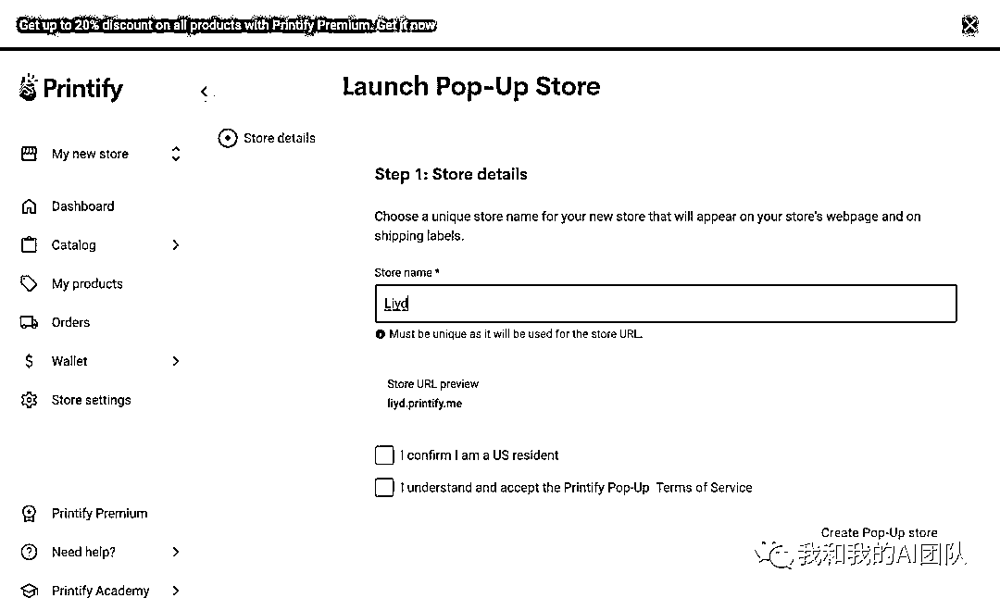
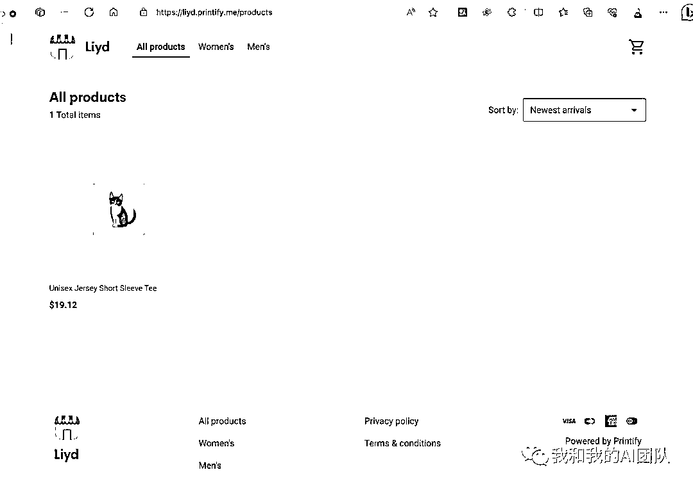
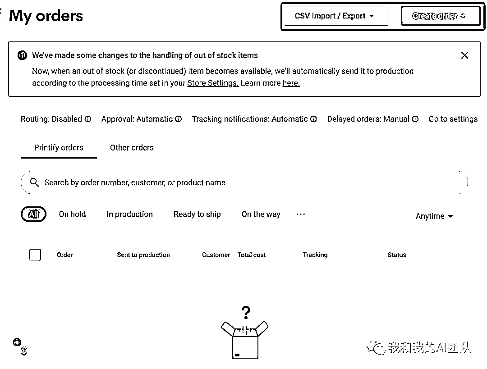
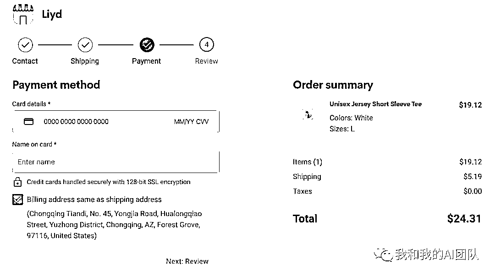

# 如何在海外使用 Printify 设计销售产品赚取美金

> 原文：[`www.yuque.com/for_lazy/thfiu8/hgrlgl3ggmqyh2o4`](https://www.yuque.com/for_lazy/thfiu8/hgrlgl3ggmqyh2o4)

## (17 赞)如何在海外使用 Printify 设计销售产品赚取美金

作者： lyd

日期：2023-10-23

Printify 是一个提供定制化产品的服务公司，提供超过 900 多种可定制产品，面向全球销售，也就是说，我们只需要把他们的产品挂到我们网站上卖，他们提供发货及其它所有的服务，我们只需要赚佣金就好了。

目前，Printify 提供 900 多种产品。这些产品包括 T 恤、拼图、宠物床以及许多其他个性化的产品。为什么推荐 Printify ，因为它把产品设计和销售流程都做得非常简单，很容易就能上手，并且个性化设计的服饰在市场上的需求呈现持续增长的态势，再加上现如今 AI 绘画如此成熟，我们很容易能做出满足客户需求的商品！Printify 还贴心的内置了一个 AI 图片生成器可以免费使用。

下面是一个完整的如何在 Printify 开店->设计->销售->收款的流程。

# **第 1 步：选择要销售的产品**

从 Printify 目录中选择产品，并根据位置、颜色变体或其他标准选择最适合您需求的打印提供商。

# **第 2 步：上传设计图**

上传设计好的图片，如今的 AI 绘画如此成熟，特别适合拿来做这件事。

更方便的是，Printify 内置了一个 AI 图片生成器「AI image generator」，使用起来还不错，非常方便。

选择「AI image generator」

选择风格「style」和图片提示词「prompt」，点击生成图片「Generate images」

从生成的图片中选择自己喜欢的图片，然后调整大小位置等就可以了

最后设置好商品的详情介绍、价格、颜色和尺寸等等参数就可以了。

# **第 3 步：将产品发布到您的商店**

Printify 已经与海外几乎所有的电商平台和程序做了集成，我们设计好后，就可以直接发布到商店进行售卖。

## **已经集成的电商应用：**

1.  Shopify

2.  WooCommerce

3.  Etsy

4.  eBay US

5.  Wix

6.  PrestaShop

7.  BigCommerce

8.  Squarespace

9.  Walmart US

10.  TikTok Shop US

## **使用 Printify API 与自己的程序集成**

如果你的商店使用的不是以上已经提供集成的电商平台，那么 Printify 还提供了 Printify API，可以自己进行集成。

## **快闪店「Printify Pop-Up」**

如果你还没有自己的商店，Printify 还贴心的提供了一个免费的快闪店「Printify Pop-Up」，我们只需要简单的设置，就可以生成一个自己的商店。

Printify Pop-Up

我的 Printify 快闪店

## **手工创建订单**

我们还可以手工创建订单，也可以通过 excel 批量导入订单。

手工创建订单

不管我们是使用的以上哪一种，选择后选择连接，就可以把产品发布到商店，进行了售卖了。

# **第 4 步：售卖商品**

Printify 快闪店使用起来很简单，选择商品加入购物车，填写收货信息，然后直接付款就可以了。

快闪店默认已经集成好了支付功能，填写信用卡信息就可完成支付。

售卖产品

# **第 5 步：如何收款**

我们需要在 Printify 绑定一个付款卡，因为当客户在我们商店中下了订单，我们会收到客户付款金额，Printify 并不会从客户金额中扣除。随后，Printify 将单独向绑定的卡中收取生产和运输成本。

也就是说会产生两笔订单：

1.  客户购买商品订单「会收到 Printify 余额」

2.  Printify 扣除生产成本订单「从绑定信息卡扣除」

从余额中提取资金，Printify 会在 48 个工作小时内进行审核。审核过后会打款到之前充值时使用的信用卡中。

如果是使用的 Printify 快闪店，则要简单很多，Printify 会直接收到客户款项，并负责打印、运输和客户支持，而我们的收入会转到 PayPal 帐户。

注意事项：**不同国家的税收方式和金额都有所不同，有一些地方是有免税州，在提现之前必须要先处理好。**

* * *

评论区：

书情小跟班 : 我不了解跨境电商，如果切入 pod 赛道的话，是不是你说那个快闪店模式结合 fb/x/ins 等社交平台的话相对更容易呢
lyd : 是的，哪个就非常容易，收款也简单，直接 paypal 收款

* * *