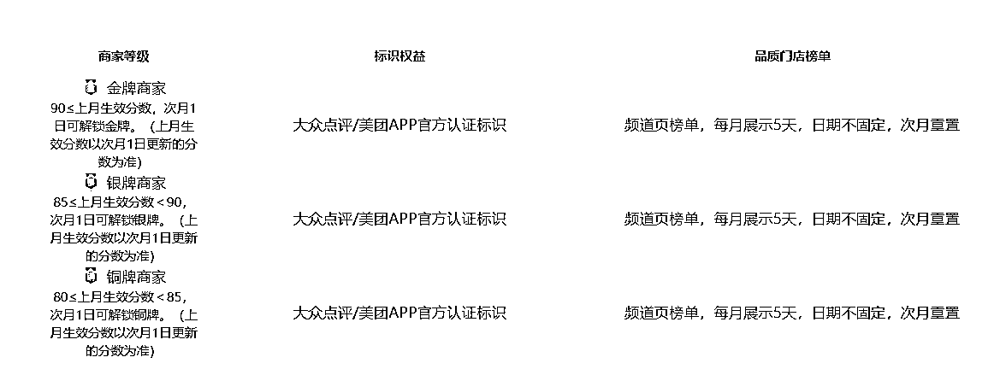
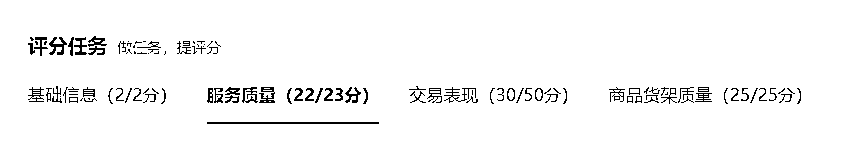
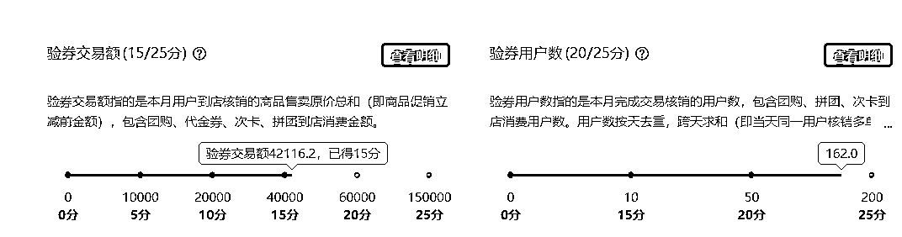
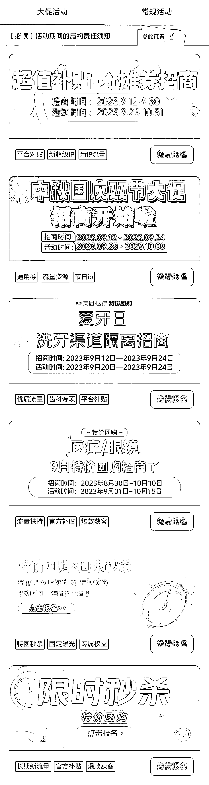
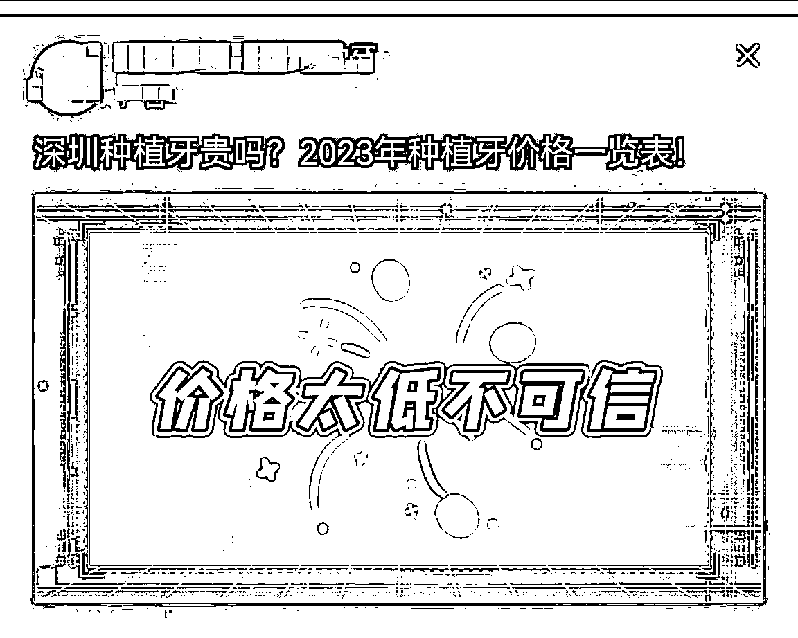

# 线下实体如何做好付费推广？以头部口腔门诊线上付费推广为例

> 原文：[`www.yuque.com/for_lazy/thfiu8/mgdtquosybg20e69`](https://www.yuque.com/for_lazy/thfiu8/mgdtquosybg20e69)

## (精华帖)(93 赞)线下实体如何做好付费推广？以头部口腔门诊线上付费推广为例

作者： Stan.

日期：2023-10-17

一家实体门店想要通过线上引流获客，除了免费流量就是靠付费了。那怎么通过投放拿到流量，做出结果呢？

我做线上口腔运营 8 年，曾靠投放获客平均一个月就能到店消费 200+人，主要有以下两个关键点：

一是渠道上要抓住投放平台，尽可能的规模化投放。我就是靠本地生活类平台、信息流平台和一些类似百度的竞价平台大规模投放，尽可能多曝光。

二是要不断调整竞品、销售、投放相关的策略，优化成本的同时，精准吸引客资。

接下来，我就以自己在做口腔诊所投放的例子，从投放、获客到转化三个路径分享，一家“重资产”的线下实体店是如何通过广告投放获取客户的，希望能够对正在做实体的朋友有启发。

最重要的写在最前面！！！

**所有的医疗营销都只是流量放大器**，属于锦上添花，最终都要回到为顾客提供优质的治疗效果、贴心的服务体验，这是最基本，也是最核心的医疗本质！

笔者简介，8 年口腔线上运营经验，曾在深圳头部口腔负责线上渠道推广，对于 SEM、信息流、团购等主流渠道均有较丰富的操盘经验，无论是月预算 3-5w，还是一、二百万，均有丰富的实战经验。

本着星球越分享越幸运为原则**，**结合自己的一些运营心得，为大家分享下口腔门诊的付费推广，希望能够对各位有启发。

（口腔属于重资产行业，转化链条太长，普通的打工人可以做，做老板就算了，没有资本和资源，尽量别参与！！！）

但口腔属有消费医疗属性，如种植牙，牙齿矫正，美白修复等，其他消费医疗也可以参考。

# **一、为何要做付费推广**

无论你在哪个城市，都能看到遍地开花的门诊，口腔行业目前已经是一个比较成熟的市场。

但酒香也怕巷子深，无论是大机构还是中小机构，都会碰到顾客量少的现状，几乎所有机构都会去做营销。

无论是地铁语音、户外门禁、电梯框架、付费推广，还是市场义诊等各类公益活动，都是拓展机构影响力，让周边居民能够快速知晓你的品牌，简单的总结营销就是“品牌走出去，顾客请进来”。

而其中最能直观体现出效果的就是付费推广，后台能提供准确的基础数据，从曝光、点击、咨询、留联、到院、成交等，各个环节都能用数据直观体现，通过数据分析，就能发现各个环节的优劣势，从而来优化各类指标，提高门诊的转化率。

基于对门诊运营的分析把控，每个机构都有自己的运营主投方向：

1、门诊承接力（医生医务数量、牙椅数量等配置）

2、产品策略（利润品，引流品，产品的界定）

3、渠道策略（人气渠道，业绩渠道，具体要结合平台消费人群属性）

口腔目前获客渠道比较多，付费推广（sem，信息流、本地生活类）、自媒体类、私域流量、seo、异业合作、市场拓展、挂号平台（深圳 160 比较有名）等。

今天主要给大家分享付费推广主做的三个平台：团购，竞价，信息流。

# **二、线上渠道分析和拆解**

**（1）本地生活类平台 （团购、高德、阿里支付宝口碑等）**

以美团点评为代表的本地生活类平台，基于商圈投放，相对较低的门槛，后台简便易上手，能直接和顾客实时互动.

无论是提供人气（基础类病种，洁牙+补牙+口腔检查），还是传播品牌口碑，都是必选渠道，必做渠道！低获客成本，无论是大型连锁还是中小型门诊，都是非常适合的渠道。

**①平台属性：人气类平台，提升店铺权重**

人气类平台就决定了产品策略，基础类病种（洁牙+口腔检查+补牙）占据绝对大头，新入驻美团商家不能指望从团购直接获取大项目（种植，正畸），请丢掉幻想！

人气类平台就需要吸引更多的顾客到院体验，常见的策略就是低价引流，周末 6 7 十的洁牙，工作日还能更便宜，我们门诊周边上班族较多，工作日门诊量会少些，得给医务找事情做，58 元的洗牙还能一拖一，价格便宜，服务优质，让顾客帮忙给个 5 星好评，问题不大，口碑也就出去了！

适当的付费推广，能将品牌带来更多的曝光，销量多，好评多，权重越高的店铺，被顾客选择的机会也会更大！

**②运营核心：务必做好二开**

如果只关注首次核销，肯定是亏钱的，那么如何让顾客再消费呢？（二开）

几乎所有顾客都会有口腔问题， 顾客体验过程中，可以告知顾客存在的牙齿问题，看是否有治疗意向.

如果顾客没有处理意向，可以直接询问顾客有何担忧，如果顾客也不说为何不想处理，请做好后续跟进，下次给顾客回访再关心下顾客，近期是否有不舒服，提醒平时要多注意口腔护理。

一般来说，回访跟进时间是按术后第 1 天，第 3 天，第 7 天，1 个月，3 个月来设置，做好每次跟进的情况备注，**抓住顾客最在意的点**（价格、技术、服务等），做好对应跟进，才能有更大的成交概率.

关心价格大促的时候，提醒顾客有优惠，担心技术，给顾客发案例的，篇幅有限，这里不再展开。

**③门店权重：店铺等级（月度计划，提前一个月规划）**

团购属于电商平台，想要获取平台额外流量扶持，需要完成平台考核，一般是上个月的门店得分，决定下个月店铺等级生效，所有工作要前置，下个月的目标，提前一个月就要完成指标。

满分 100 分，得分如下图所示：

1、90 分以上，金牌店铺

2、85-89 分，银牌店铺

3、80-84 分，铜牌店铺

**分数拆解：**

**基础服务分 2 分**：

门店各类信息填充后台，这里要拿满分。

**服务质量分 23 分**：

要完成 5 分钟回复率，注意最后一条对话要以门诊来结束，如果是有专门的电网团队，这里要拿满分。

**交易表现分 50 分：**

包括了验券交易额（GTV）和验券用户数（UV）   验券交易额，一二线城市标准不一样，这里介绍深圳市场为主，注意如果同一个顾客当天买了 3 单，GTV 金额可以累计，但是 UV 只算一个。

**商品质量分 25 分：**

产品上线齐全就能拿满分，这里也是要拿满分的。

可以根据门店实际情况，完成相应等级，就能获取平台金银铜牌标识，薅平台的流量。另外就是平台的各类大促活动，只要平台价格不是低得太离谱，都可以报名参与，多搞些流量。

我们之前做过 2 年多团购代运营服务，合作最好的机构投产稳定在 1:12～1:15 左右，当然这也依赖机构的配合与执行力。

**(1）竞价 SEM（百度，搜狗，360 等）**

竞价 SEM 流量非常精准，前些年百度是必争之地，不过百度自己作死，已经没落了，这个渠道做的机构会比较少了，一、二线城市中，除了大的连锁机构签了框架，中小型门诊参与的很少。

**①平台属性：意向精准，量有限**

竞价平台是医疗玩的最早，最为成熟的渠道，虽然名声不好，一、二线口腔市场还是被大型连锁占据，都有签数百万到千万级别的年框，中小机构一般不会参与。但在三、四线城市，竞争相对小，产出也相对稳定，是一个非常不错的渠道！

**②运营核心：把握关键词**

目前竞价类平台大都采用 ocpc 模式，系统会自动出价匹配，但竞价逻辑还是要了解的！

从顾客搜索词，可以看出顾客的意向度，简单以种植牙这个项目为例：

牙齿脱落 ——》缺牙怎么办——》种牙好还是镶牙好——》种植牙费用——》种植牙医院——》XX 医院种牙怎么样

这个是正常的逻辑，从左到右，不同关键词反映的顾客意向度越来越精准，由此针对不同的关键词，要用不同的页面或者页面要有针对性引导，从而才能提交顾客转化意向，同理其他领域也是类似的。

关键词就代表着需求和商机，所有行业都是共通的！！！

**（3）信息流平台（头条抖音、百度小红书广点通、新浪网易，vivo/oppo、知乎快手等）**

几乎所有自有流量平台，都会开信息流广告位，流量都是 money！口腔做信息流主要是 19 年开始兴起，也是口腔高客项目的获客大头（种植+正畸），是做能业绩的渠道，所以也是口腔竞争最激烈的渠道！！！

**①平台属性：量大而杂，关住价格**

人群属性决定了前端投放素材，信息流平台属于自动推送，顾客质量参差不齐，对比价格非常明显，市场也是非常卷，价格类是他们关注的最重点的问题，因此，前端投放一般用两个大类素材来测试：

1、特价活动类（提交表单申请特惠名额）

2、报价测评类（提交表单获取报价）

**活动特价类：**

**报价测评类：**

**②运营核心：做好 AB 测试（对比测试）**

信息流素材构成分为三大块：创意（标题）+图片/视频素材+页面。

【投放版块，人群定向，人群标签，这些都是相对固定的】，控制变量法，根据曝光量，点击量，点击率，转化量，转化率等核心指标，根据数据来来优化素材，计划衰退很快，需要大量测试推广计划！

AB 测试（控制变量法，只能口头简述）：

创意 1 + 素材 1 + 页面 1

创意 2 + 素材 1 + 页面 1

创意 2 + 素材 2 + 页面 1

创意 2 + 素材 2 + 页面 2

......

随着推广数据的积累，将表现好的创意、素材、页面做好统计，整理到数据库不断更新，后面投放的时候，就能看出来哪些素材好用，哪些素材质量会比较一般，多测试！！！

如果门诊是刚开始接触信息流，可以“先抄后超”，竞品是最好的老师，有效果别人才会用！

一线城市，月百万级别的投放规模，投产如果能做到 1:3.5 以上，都是做的比较好的了，这个版块对团队的配置要求比较高，也是最卷的版块。

二三四线城市，投产一般能做到 1:6 以上，取决于当地的竞争情况。我之前在深圳某头部口腔，操盘的预算比较多，当时能占到了整个深圳市场份额一半以上，最高月份投产在 1:5。

如果你要问上面三个渠道选哪个，我也不能给你准确回答，最终还是回到了门诊的承接力，任何一个线上渠道，都能提供非常不错的业绩支撑。没有好不好的渠道，只有做不做得好的门诊。

# **三、新手运营，可能会遇到的问题？**

作为新手运营，或多或少会遇到一些问题，应该如何来应对呢，我这边简单举 2 个例子：

**（1）对于运营个人，账户波动起伏大，心理压力太大？**

账户波动是非常非常非常正常的现象，我之前带过一些运营，账户表现差的时候，甚至吃不下饭，睡不着觉，甚至想 24 小时盯着账户，心理负担太大，其实完全没有必要。

运营是一项长期的工作，账户出现波动时，还是回到各个环节的数据去分析，看异常点在哪里，分析下创意和页面是否匹配，我一般会观察 1-2 天，如果效果明显变差，就会考虑做调整，比如替换创意或者页面等等。

绝大部分运营，大概率都会做到市场平均值，只有少数人能做到平均值以上，如果你平时思考的多，你就会向少部分人靠拢，文章的第五点，抛砖引玉，多分析人群，多分析平台，思考方向仅供参考。

**（2）门诊刚启动项目，特别是信息流这种砸钱快的渠道，是先堆量还是考虑投产？**

这个问题，其实最重要的就看一点，就是看机构能给多少预算。

如果你是在大机构，预算充足，一般都是先花钱来人，量变才会引起质变，用数量来磨合团队；

如果你是在小门诊，预算有限。我个人建议是，稍微压下投放，顾客来了未没成交，就要逐个去分析未成交原因，珍惜每一个顾客，只有拿到正反馈了，投放才能持续。

每个人遇到的问题其实都不一样，上面的例子仅供参考，具体问题具体来分析吧。

# 四、**对于运营，如何在付费投放中更进一步？（深度思考）**

作为口腔烧钱的渠道，如果你只想作为一个纯粹的运营，你考虑的只需要把成本优化下来；

但如果你想在部门扛大旗，这两点，请你务必多加思考！（普通的运营，一般是不会去想这些）

**（1）资源整合协调（上下游整合，兄弟部门资源扶持）**

上游：动员领导，需要的支撑以及资源（价格政策、预算支撑、人员配置）

下游：承接端口（电网咨询和院内现场），对各个政策的数据反馈，能够评估每个政策的效果，打通上下游漏斗（投放，到院，业绩）

兄弟部门：市场调研，制定针对性策略，物料设计制作等

**借助领导的力量来推动跨部门的事务，要善借助外力！！！**

**（2）营销转化策略**

竞对策略：竞品主推活动，采取针对策略，产品定价等；

销售策略：包括引流品定价，产品线品类及定价；

投放策略：如何平衡活动类及报价类投放比例；

这里只能给到大体方向，各地市场以及机构自身运营策略都不一样，需要自己结合实际情况来摸索，多思考，多挖掘。

# 五**、顾客转化流程及推广团队搭建**

医疗的获客及转化路径有 3 个环节：

策划运营端的付费推广，在电网咨询端口的跟进邀约，再到门诊现场助理的促成交及跟进。

下面这 3 个岗位，一般是需要有专业团队，不过现在小门诊一般就配置电网咨询和现场助理，策划运营也有外包的形式，这里可以了解下各个岗位的工作职责。

**（1）策划及运营**

竞品调研，月度活动政策申请，渠道推广计划，优化推广效果。

1.  竞品调研，月度营销计划提案，活动政策申请；

2.  根据不同渠道属性，策划推广页面/物料替换；

3.  推广数据整理分析，优化推广效果，提高转化率；

4.  对接电网顾客跟进情况，灵活调整推广策略

**（2）电网咨询（必备）**

留咨顾客跟进，了解顾客初步的需求，邀约到院，对接院内现场，辅助成交。

1.  要求对口腔专业非常了解，初步了解顾客的需求，了解门诊的概况及优势，邀约顾客上门，提升上门率；

2.  客户的电话回访、满意度调查等工作，及时有效的回访跟踪客户；并建立良好的客户关系；

3.  和现场咨询保持及时有效沟通，告知顾客具体需求或者在意点，促成交；

**（3）院内现场（必备）**

到院顾客接诊，价格洽谈，做好顾客成交，未成交顾客邀约复诊，老带新等。

1.  完成口腔初诊患者的宣教并向患者推荐有效的治疗方案；

2.  协助医生完成治疗计划的沟通、讲解；

3.  治疗前咨询，治疗后的回访工作；

4.  做好患者关系管理并维护口碑客户老带新；

5.  配合经营主任完成周计划，月计划，季度工作计划等。

# 六**、结语**

口腔付费推广，相对其他圈友的项目来说，转化路径非常长，对团队配合要求比较高，如果你想做好口腔付费推广，结合门诊实际情况，准备工作做的更加充分，多研究，多思考！

从你定推广渠道开始，就要考虑到平台和人群的属性，投放策略，产品策略等等，这都需要你的前置工作，执行过程中，同样也需要主动去对接其他部门，这对个人也是一个锻炼，只有当团队磨合好了，付费推广的正反馈，才会来的更快。

**题外话：除了付费推广，哪些资源备受口腔门诊青睐？**

口腔机构如此多，都缺顾客，这三个方向，是机构比较匮乏的。

**1、手握达人资源**

达人探店既能帮助门诊做品牌推广，又能带来顾客上门，根据达人的粉丝量 1w 以内，300 字文案 +3 图以上，报价为 200-600 元/条，如果是 1w+粉丝，报价在 2-5 千不等，和粉丝属性有关，视频类的收费更贵，一般大机构会做的比较多，小机构预算有限，做的比较少。

**2、拥有顾客资源**

无论你是手握海量资源顾客的个人，或者平台，都可以和门诊合作，业绩提成 15-25%之间，如果你合作的机构多了，你就可以挑成交率高的机构合作。

**3、资深销售人士**

一般的小门诊对顾客需求把控还是要弱些，绝大部分的门诊都想提高成交率，如果你在销售方面有充足的经验，对顾客心理把控到位，培训类课程也是有市场的。

* * *

评论区：

亦仁 : 感谢分享，已加精华。
Stan. : 多谢亦仁[握手]
zeon : 大佬求链接
Stan. : 要什么链接呢
zeon : 求个微信吧
Stan. : 好  微信 TaylorTD
风吹屁屁凉 : 谢谢分享
Stan. : 一起学习，一起进步[呲牙]

* * *